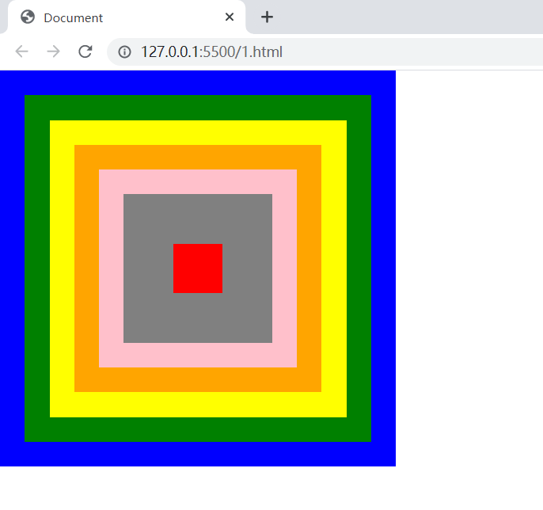
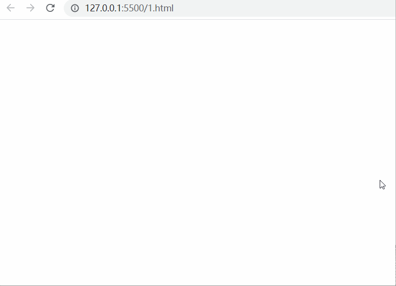

# 走马灯走一走鸭

实现走马灯效果

标签结构如下

```html
<!DOCTYPE html>
<html lang="en">
<head>
    <meta charset="UTF-8">
    <meta http-equiv="X-UA-Compatible" content="IE=edge">
    <meta name="viewport" content="width=device-width, initial-scale=1.0">
    <title>Document</title>
    <style>
        *{
            margin: 0;
        }
        div:nth-child(1){
            width: 400px;
            height: 400px;
            position: relative;
        }
        div:nth-child(2){
            width: 350px;
            height: 350px;
            position: absolute;
            top: 25px;
            left: 25px;
        }
        div:nth-child(3){
            width: 300px;
            height: 300px;
            position: absolute;
            top: 50px;
            left: 50px;
        }
        div:nth-child(4){
            width: 250px;
            height: 250px;
            position: absolute;
            top: 75px;
            left: 75px;
        }
        div:nth-child(5){
            width: 200px;
            height: 200px;
            position: absolute;
            top: 100px;
            left: 100px;
        }
        div:nth-child(6){
            width: 150px;
            height: 150px;
            position: absolute;
            top: 125px;
            left: 125px;
        }
        div:nth-child(7){
            width: 100px;
            height: 100px;
            position: absolute;
            top: 150px;
            left: 150px;
        }
        div:nth-child(8){
            width: 50px;
            height: 50px;
            position: absolute;
            top: 175px;
            left: 175px;
        }
    </style>
</head>
<body>
    <div></div>
    <div></div>
    <div></div>
    <div></div>
    <div></div>
    <div></div>
    <div></div>
    <div></div>

    <script>
        let arr = ['red', 'blue', 'green', 'yellow', 'orange', 'pink', 'gray', 'purple'];
    </script>
</body>
</html>
```


静态效果:



动态效果



