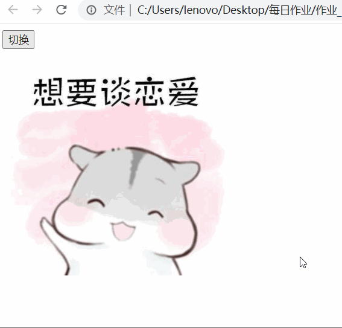

# 我想谈恋爱

在这个标签结构基础上, 实现下面效果

```html
<!DOCTYPE html>
<html lang="en">

<head>
    <meta charset="UTF-8">
    <title>Title</title>
</head>

<body>
    <input type="button" value="切换" id="btn"><br>
    

    <script>

    </script>
</body>

</html>
```




