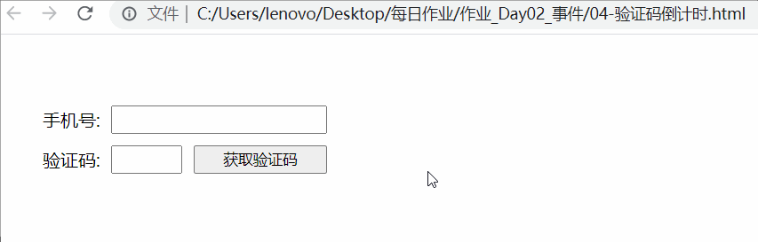

# 验证码倒计时

在这个标签结构基础上, 实现下面效果

```html
<!DOCTYPE html>
<html lang="en">

<head>
  <meta charset="UTF-8">
  <meta name="viewport" content="width=device-width, initial-scale=1.0">
  <title>练习 - 网页时钟</title>
  <style>
    body {
      padding: 40px;
    }

    ul {
      padding: 0;
      list-style: none;
    }

    li {
      margin: 10px 0;
      line-height: 26px;
      display: flex;
    }

    input,
    button {
      padding: 0;
      margin-left: 10px;
      display: block;
    }

    input {
      width: 190px;
      outline: none;
    }

    button {
      width: 120px;
    }

    .verify {
      width: 60px;
    }
  </style>
</head>

<body>
  <ul>
    <li>
      手机号:
      <input type="text">
    </li>
    <li>
      验证码:
      <input type="text" class="verify">
      <button id="btn">获取验证码</button>
    </li>
  </ul>

  <script>
  </script>
</body>

</html>
```




