# Day01_模板学习

## 预习自测-必须

把`vue-admin-template`这一个模板项目克隆下来(看02节内容-按照步骤来)

看看npm install后, 是否能启动成功

## 项目介绍

完整预览效果：[人力资源平台项目](http://ihrm.itheima.net/#/login)

项目功能模块划分:


​							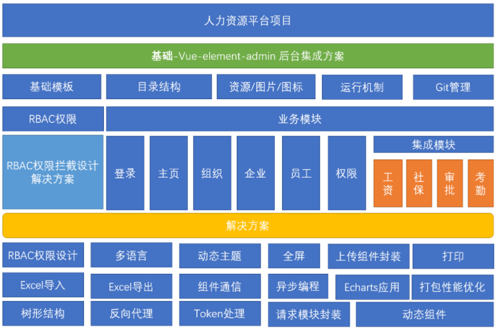


1. 技术栈： **vue-admin-template  二次开发**

   > ES6, vue, vuex, vue-router, vue-cli, axios, element-ui

2. 技术解决方案：
   - RBAC 权限设计

     > RBAC: 基于角色的访问控制权限的基本模型

   - 多语言

   - Excel 导入导出

   - 反向代理

   - 请求模块封装

   - ...


## 01.vue-element-admin-介绍

### 目标

公司项目提倡 “小步快跑，快速迭代” 的敏捷开发模式

* 传统开发：闭关三年，潜心修炼，精益求精，产品横空出世

* 敏捷开发：不追求前期完美的设计、完美编码，'最快速度'完成核心功能(抢占市场)

  > 后续不断迭代升级，完善产品


😀❓  思 考：从0创建标签和样式, 慢慢走?

* 使用ElementUI等组件库

  > 但也得自己一点点组装, 还是慢


### 讲解

基于 vue 技术栈的**数据管理系统** 解决方案 **vue-element-admin**

介绍:  [vue-element-admin](https://panjiachen.gitee.io/vue-element-admin-site/zh/) 是一个**数据管理系统**的前端解决方案(一个模板)

* 它基于 vue 和 element-ui实现
* 内置了国际化解决方案(多语言) 
* 动态路由，权限验证，提炼了典型的业务模型


官网地址：[vue-element-admin](https://panjiachen.gitee.io/vue-element-admin-site/zh/)

在线浏览：[vue-element-admin](https://panjiachen.github.io/vue-element-admin/#/dashboard)

git地址: [git地址](https://gitee.com/mirrors/vue-element-admin.git)


运行体验

```bash
# 从码云拉取代码 
git clone https://gitee.com/mirrors/vue-element-admin.git

# 切换到具体目录下
cd vue-admin-template

# 安装所有依赖
npm install

# 启动开发调试模式  查看package.json文件的scripts可知晓启动命令
npm run dev
```


**`注意`**：如果git clone 速度过慢或者报错，可以：直接下载代码的压缩包运行，[vue-element-admin 仓库](https://gitee.com/panjiachen/vue-admin-template)

`注意`: 如果npm install 报错, 可以这样解决

```js
原因: 虽然克隆地址是gitee.com的, 但是npm i 安装依赖包的时候, 有个包它竟然引用了github.com上的一个地址(这就需要你除了gitee还要配置github秘钥, 比较麻烦)   
解决: 直接使用老师的node_modules文件夹, 放到工程根目录, 解压. 就不用npm i下载了. 
```


启动运行登录后首页效果


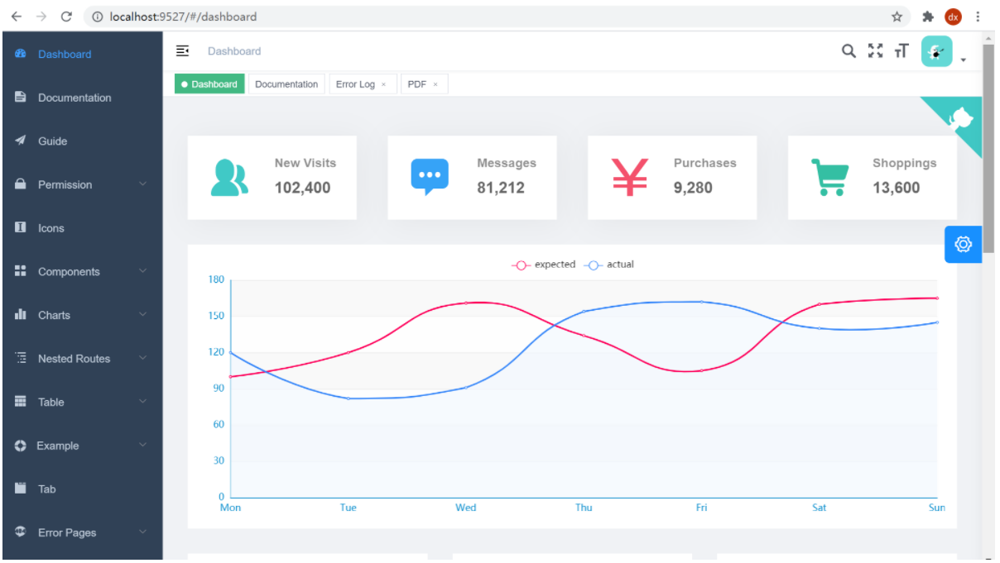


### 小结

1. 什么是vue-element-admin?

   <details>     
   <summary>答案</summary> 
   <ul>
   <li>基于vue和elementUI的一套基础结构项目</li>
   </ul>
   </details>


## 02.vue-admin-template 介绍

### 目标

什么是 vue-admin-template 


###   讲解

之前的vue-element-admin 缺点：不太好进行二次开发，因为要删减的东西太多

采取另外一个子系统，叫做 `vue-admin-template` ，它提供最基础的模板，方便做二次开发

也包含了 **登录 / 鉴权 / 主页布局** 的一些基础功能模板


官网地址： [vue-admin-template ](https://github.com/PanJiaChen/vue-admin-template)

在线浏览：[vue-admin-template ](https://panjiachen.gitee.io/vue-admin-template/#/login?redirect=%2Fdashboard)

学习文档:  https://juejin.cn/post/6844903476661583880


#### 运行体验

```bash
# 从码云拉取代码 
git clone https://gitee.com/panjiachen/vue-admin-template.git

# 切换到具体目录下
cd vue-admin-template

# 安装所有依赖
npm install

# 启动开发调试模式  查看package.json文件的scripts可知晓启动命令
npm run dev
```


如果npm install 总是出错，看[官网说明](https://panjiachen.gitee.io/vue-element-admin-site/zh/guide/other/faq.html#npm-install-%E6%80%BB%E6%98%AF%E5%A4%B1%E8%B4%A5%EF%BC%9F)

或者看本笔记最下方的**常见报错说明**


预览效果如下


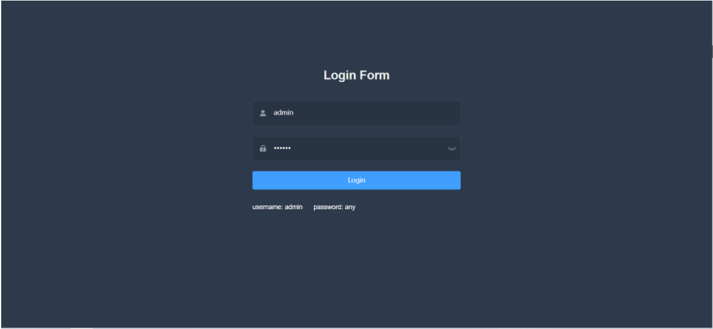

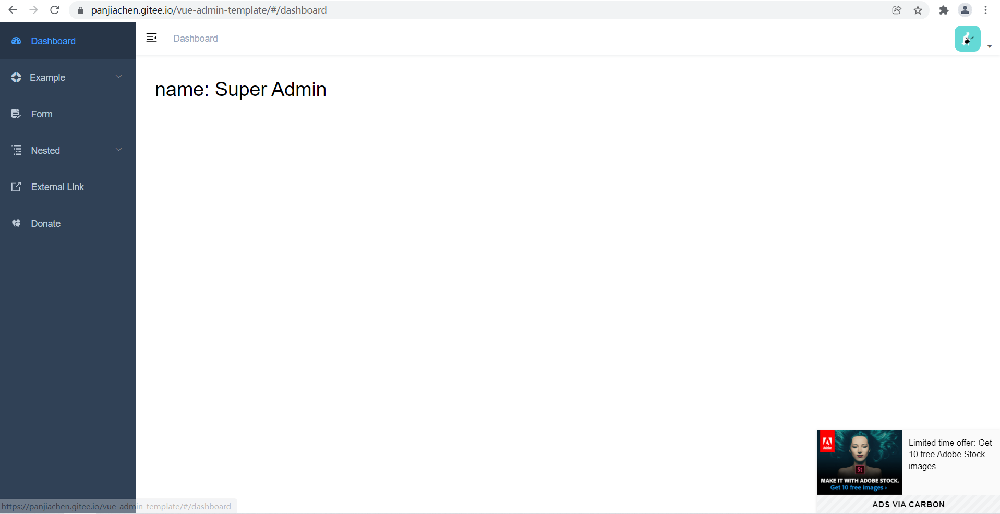


### 小结

1. 为何又使用vue-admin-template这个模板项目?

   <details>     
   <summary>答案</summary> 
   <ul>
   <li>vue-element-admin比较复杂要删减东西很多</li>
   <li>vue-admin-template只留下了最关键的模板代码</li>
   </ul>
   </details>


## 03.模板讲解-套路介绍

### 目标

拿到一个项目, 模板项目/以后公司项目/任何别人写的项目, 如何读

### 讲解

1. 无论如何要把项目启动起来, 最好是能看到画面(如果项目都启动不起来, 那你要拿出你的厚脸皮. 找到一切能团结的力量, 赐予项目力量吧)

   > 每个公司的项目环境都不太一样, 只有公司自己人才最熟悉公司的项目环境(可能有些包是内部的, npm镜像从淘宝是下不到的, 需要修改npm镜像地址为公司内部的ip地址, 等等其他情况)
   >
   > 项目启动不起来, 可以适当的问下同组同事

2. 可以先从项目的入口文件开始读, 如果找不到哪个是入口, 就从头挨个文件读, 绘制代码地图(任意工具, process.on或者其他软件. 或者笔和纸都可以)

   > 每个公司的模板有的用的官方的, 有的是基于官方的进行二次封装修改(一般入口main.js)
   >
   > 但是有些公司自己大佬创建脚手架环境, 入口可能不再main.js (new Vue)-> 不一定是绝对的
   >
   > 假如入口真的没找到, 从头挨个文件读, 然后找入口

3. 项目至少读2-3遍, 才能明白其中的文件架构和封装的工具

   > 进公司, 公司会给你1-3天甚至5-7天, 让你熟悉下项目
   >
   > 拉取项目代码, 需求文档, 接口文档, 把自己变成前任前端攻城狮, 代码熟悉熟悉
   >
   > 才能在这个项目的基础上, 修改和开发

4. 下面我们开始讲解

   > 打印变量 / 看变量名猜 / 联想上下文 / ....有点像看阅读理解
   >
   > 找不到标签/样式, 设置个颜色看看?
   >
   > 标签对不上, 改个文字看看变不变
   >
   > 变量不知道在哪里用过, 可以用vscode放大镜, 全局查找

### 小结

1. 拿到公司项目以后我们要做什么?

   <details>
   <summary>答案</summary>
   <ul>
   <li>首先, 先克隆拿到公司的工程代码, 然后安装依赖, 启动项目</li>
   <li>埃个文件和文件夹阅读代码, 然后逐行写注释, 尽快把整个工程项目搞明白</li>
   </ul>
   </details>
   
   


## 04.模板讲解-api

### 目标

理解 api 模块的方法

### 讲解

#### 目录分析

将所有的网络请求**方法**放在 api 目录下统一管理，按照模块来划分对应的文件

#### 代码分析

api/table.js讲解

```js
import request from '@/utils/request' // 导入请求函数

/**
 * 获取 - 表格 - 数据列表
 * @param {*} params 参数 
 * @returns Promise对象
 */
export function getList(params) { 
  // 知识点1: axios函数调用, 在原地返回一个Promise对象(内部包裹ajax请求)
  // 知识点2: return后面值, 会返回到当前函数getList调用的地方(可通过放大镜查找)
  // 调用axios指定请求的地址和方式, 发起请求
  return request({ 
    url: '/vue-admin-template/table/list',
    method: 'get',
    params
  })
}
```


api/users.js讲解

```js
import request from '@/utils/request'

// JSDOC注释, 写代码的时候vscode会给你提示
// 封装工具函数可以用这种注释-必须挨着代码

/**
 * 登录
 * @param {*} data 请求参数
 * @returns Promise对象
 */
export function login(data) {
  return request({
    url: '/vue-admin-template/user/login',
    method: 'post',
    data
  })
}

/**
 * 获取 - 用户信息
 * @param {*} token token字符串(登录时-由后台返回的)
 * @returns Promise对象
 */
export function getInfo(token) {
  return request({
    url: '/vue-admin-template/user/info',
    method: 'get',
    params: { token }
  })
}

/**
 * 退出登录
 * @returns Promise对象
 */
export function logout() {
  return request({
    url: '/vue-admin-template/user/logout',
    method: 'post'
  })
}

```

上面代码中使用了封装的request工具，每个接口的请求都单独**`导出`**了一个方法，这样做的好处就是：

1.  每个api/js文件，对应业务所有接口，清晰明了，查找方便 
2.  业务页面中，使用哪个接口直接导入即可
3.  语义化清晰，维护方便
4.  分工合作


### 小结

1. 以后找接口，修改或增加接口, 我们该如何做?

   <details>     
   <summary>答案</summary> 
   <ul>
   <li>都在api文件夹, 定义相应文件, 统一管理</li>
   </ul> 
   </details>

2. api接口方法, 需要传入什么?

   <details>     
   <summary>答案</summary> 
   <ul>
   <li>方法内有请求执行, 而url和方式在内部, 我们只需要传前端页面收集的参数</li>
   </ul> 
   </details>

3. api接口方法, 会返回什么?

   <details>     
   <summary>答案</summary> 
   <ul>
   <li>本项目中request内是, 基于axios进行的二次封装, 返回的是一个Promise对象到逻辑页面调用处</li>
   </ul> 
   </details>

4. 在调用接口方法时, 如何拿到成功/失败结果?

   <details>     
   <summary>答案</summary> 
   <ul>
   <li>在逻辑页面, 我们可以用await或者then来提取成功的结果, 用try+catch/.catch方法来拿到失败结果</li>
   </ul> 
   </details>


## 05.模板讲解-icons

### 目标

了解 Icons 文件的组织

### 讲解

#### Icons 文件的组织方式


​					

查看 icons 下的 index.js 文件

> 将 svg 目录下所有的 svg 文件全部引入到项目中，并且挂载为全局的组件进行使用

```js
import Vue from 'vue' // 引入Vue
import SvgIcon from '@/components/SvgIcon'// 用div/svg+use, 来渲染图标组件

// 全局注册svg-icon组件
Vue.component('svg-icon', SvgIcon)

// 特别难(了解)-不用硬读
// require: commonJS规范里引入的语法
// require.context() 自动导入文件夹下的一切方法
// require.context('./svg', false, /\.svg$/) 导入svg文件夹下的所有以.svg结尾的文件->代码环境中
// false代表如果里面有子目录, 不管
const req = require.context('./svg', false, /\.svg$/)
// 返回了一个函数->webpackContext
// 知识点1: 函数(方法)也是对象可以点属性和方法
// 知识点2: map里可以直接写function也可以放一个变量(函数体)
const requireAll = requireContext => {
  console.log(requireContext.keys()) // ['./dashboard.svg', './example.svg', './eye-open.svg', './eye.svg', './form.svg', './link.svg', './nested.svg', './password.svg', './table.svg', './tree.svg', './user.svg']
  // requireContext.keys().map() -> 遍历每个svg文件的路径
  // 函数式编程: 把一个回调函数体, 直接放到map里执行了->req函数webpackContext
  return requireContext.keys().map(requireContext) // 遍历的同时,用req函数内webpack的require引入svg文件到项目工程里
}
requireAll(req)


// 这块代码意思可以看这里: https://juejin.cn/post/6844903517564436493#heading-9

```


### 小结

1. 以后项目中，使用 icons，应该放到哪个文件夹, 放什么类型文件 ？

   <details>     
   <summary>答案</summary> 
   <ul>
   <li>也放入.svg图标文件, 放到icons文件夹下</li>
   </ul>
   </details>


## 06.模板讲解-layout

### 目标

分析这个文件有什么作用

### 讲解

这个文件, 是项目登录以后, 见到的布局的框, 左侧导航, 上部导航和下不的内容部分

```vue
<template>
  <!-- layout布局页面(左边和上面) -->
  <div :class="classObj" class="app-wrapper">
    <!-- 灰色蒙层: 在移动端下, 切换左侧导航, 会出现
      sidebar.opened -> 侧边栏导航出现(值来自vuex的sidebar.js)
      点击蒙层关闭->设置(opened为false, 本地还存个0)
     -->
    <div v-if="device==='mobile' && sidebar.opened" class="drawer-bg" @click="handleClickOutside" />
    <!-- 左侧侧边栏组件 -->
    <sidebar class="sidebar-container" />
    <!-- 右侧容器 -->
    <div class="main-container">
      <!-- 头部是否固定(在@/settings可以设置, 但是在vuex里取出)->现在false不固定 -->
      <div :class="{'fixed-header':fixedHeader}">
        <!-- 头部导航组件 -->
        <navbar />
      </div>
      <!-- 主体内容区域 -->
      <app-main />
    </div>
  </div>
</template>

<script>
import { Navbar, Sidebar, AppMain } from './components' // 头部导航, 左侧导航, 右下角主体
import ResizeMixin from './mixin/ResizeHandler' // 混入对象, 公共的东西注入

export default {
  name: 'Layout',
  components: {
    Navbar,
    Sidebar,
    AppMain
  },
  mixins: [ResizeMixin], // 混入其他配置项, 此组件创建就会执行混入里的生命周期方法
  computed: {
    // 返回左侧导航控制对象
    sidebar() {
      return this.$store.state.app.sidebar
    },
    // 返回当前设备类型值
    device() {
      return this.$store.state.app.device
    },
    // 返回头部是否固定
    fixedHeader() {
      return this.$store.state.settings.fixedHeader
    },
    // 返回class对象(layout页面用的样式)
    classObj() {
      return {
        hideSidebar: !this.sidebar.opened, // 左侧导航样式是否生效(前缀类名, 只有fixedHeader为true才有效)
        openSidebar: this.sidebar.opened, // 移动端->左侧导航开启为true, 整体内容部分定位
        withoutAnimation: this.sidebar.withoutAnimation, // 是否需要动画(可以自定义此类名相关具体css)
        mobile: this.device === 'mobile'
      }
    }
  },
  methods: {
    handleClickOutside() {
      this.$store.dispatch('app/closeSideBar', { withoutAnimation: false })
    }
  }
}
</script>
```


### 小结

1. 此文件有和作用, 对应页面哪部分?

   <details>     
   <summary>答案</summary> 
   <ul>
   <li>这个layout布局页面, 包含左侧导航, 顶部导航和下边的App-Main主体区域</li>
   </ul> 
   </details>


## 07.模板讲解-router/index.js

### 目标

分析这个文件夹下面的一切文件

### 讲解

router/index.js - 文件主要内容讲解

```js
import Vue from 'vue'
import Router from 'vue-router'

// 给Vue添加中间件函数(插件)
// 知识点: 执行()里东西
// 情况1: ()里函数, 直接执行Router里的一切
// 情况2: ()里对象, 执行对象install方法内的一切
// 全局注册RouterView和RouterLink组件
// 给Vue原型上添加$router和$route2个属性
Vue.use(Router)

/* Layout */
import Layout from '@/layout'


// 知识点1: 路由是一套映射关系
// path路径对应component组件的映射关系
// 效果: 你切换浏览器上路由地址, 上这个数组里遍历匹配规则路径
// 命中后, 就会吧component对应的组件挂载到router-view位置上
export const constantRoutes = [
  {
    path: '/login',
    component: () => import('@/views/login/index'), // 异步加载(懒加载组件-当路由路径命中这个path, 才会现去引入对应组件代码)
    hidden: true
  },

  {
    path: '/404',
    component: () => import('@/views/404'),
    hidden: true
  },

  {
    path: '/',
    component: Layout,
    redirect: '/dashboard',
    children: [{
      path: 'dashboard',
      name: 'Dashboard',
      component: () => import('@/views/dashboard/index'),
      meta: { title: 'Dashboard', icon: 'dashboard' }
    }]
  },
  // ...略

  // 404 page must be placed at the end !!!
  // 404还是在最后, 但是最关键的path: '*'
  // 数组是有顺序的, 前面的对象里path都没有和当前路由路径匹配上就到了这里
  // 重定向redirect: 改变浏览器地址栏/404, 显示404页面->路由地址好看一些
  // 不显示那个错误的路由地址(难看)
  { path: '*', redirect: '/404', hidden: true }
]

const createRouter = () => new Router({
  // mode: 'history', 
  // 在路由切换时, 滚回到网页的顶部
  scrollBehavior: () => ({ y: 0 }),
  routes: constantRoutes
})

const router = createRouter()

// 重置路由对象-得讲到后面再用
export function resetRouter() {
  const newRouter = createRouter()
  router.matcher = newRouter.matcher 
}

export default router

```


### 小结

1. 此文件有何作用, 对应页面哪部分?

   <details>     
   <summary>答案</summary> 
   <ul>
   <li>路由相关的配置, 以及路由规则对象数组</li>
   </ul> 
   </details>


## 08.模板讲解-vuex

### 目标

分析 vuex 中代码组织方式

### 讲解

#### 分析 vuex 组织

​						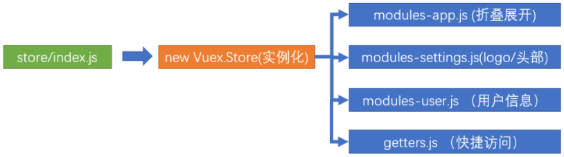

当前的 vuex 结构采用了模块形式进行管理共享状态

```js
import Vue from 'vue'
import Vuex from 'vuex'
import getters from './getters'
import app from './modules/app'
import settings from './modules/settings'
import user from './modules/user'

Vue.use(Vuex)

// store是唯一的一个数据仓库(管家)
// 复习知识点1: store里包含5大核心配置项(概念) - 定义
// state -> 定义变量
// mutations -> 定义方法(形参1是state, 唯一可以修改state值的地方) -> devTool工具检测到
// actions -> 定义方法(形参1是store, 异步操作来修改state, 但是也要提交到mutations)
// getters -> vuex里计算属性 -> 计算返回值
// modules -> 集中式管理太多, 可以分散到多个模块分别管理(但是最后都要挂载到根store上)

// 知识点2: 每个moudles对象里还是包含这5个核心概念, 还能继续嵌套管理

// 知识点3: vuex里的东西, 如何在vue组件页面/js文件里进行使用
// 类1: 根store里的(不分模块的时候)
// 直接使用
// 映射使用

// 类2: 分模块(不开命名空间)
// 注意: 只影响state的取值方式
// mutations和actions和getters还像以前一样使用

// 类3: 分模块(开命名空间)
// 使用时, 要带模块名(命名空间名)

const store = new Vuex.Store({
  modules: { // vuex分模块: key模块名, value模块配置对象
    app, // 侧边栏对象, 设备型号
    settings, // 侧边栏有logo? 头部是否固定定位
    user // token, name, 等用户信息
  },
  getters // 根上的(方便逻辑页面直接访问, getters内部帮我去映射每个模块里state)
})

export default store

```


modules 中是导入的模块

* user.js - 用户相关模块(包含登录等接口调用)
* settings.js - 对logo和头部的设置
* app.js -  对侧边栏展开的设置


getters中集中导出了所有变量, 方便我们调用访问

```js
// 此文件可以让逻辑页面直接从getters里取值(根getters不用关心模块名)
// 逻辑页面不需要自己一点点的从state里取值
// 知识点1: 当箭头函数, 函数体"只有一段代码"而且"默认把值返回"可以同时省略大括号和return
const getters = {
  // sidebar(state) {
  //   return state.app.sidebar
  // },
  sidebar: state => state.app.sidebar,
  device: state => state.app.device,
  token: state => state.user.token,
  avatar: state => state.user.avatar,
  name: state => state.user.name
}
export default getters

// function和箭头函数, 要看this的指向
// 如果你非要让this指向调用者, 必须用function
// 知识点2:
// function函数里this关键字变量值, 指向调用者
// 箭头函数里this关键字值, 指向外层函数作用域this的值
// 旭哥博客: https://lidongxuwork.gitee.io/pages/webFront/javascript/run/this%E6%8C%87%E5%90%91.html#this%E5%85%B3%E9%94%AE%E5%AD%97


```


### 小结

1. 如何查看vuex的结构?

   <details>     
   <summary>答案</summary> 
   <ul>
   <li>找到new Vuex.Store入口, 逐个攻破, 循序渐入</li>
   </ul>
   </details>
   
   

## 09.模板讲解-utils

### 目标

了解utils工具包里文件作用

### 讲解

1. utils/auth.js - token获取设置

   ```js
   import Cookies from 'js-cookie'
   
   const TokenKey = 'vue_admin_template_token' // 存储token用的key名
   
   export function getToken() { // 获取token方法-从Cookie里
     return Cookies.get(TokenKey)
   }
   
   export function setToken(token) { // 设置token方法
     return Cookies.set(TokenKey, token)
   }
   
   export function removeToken() { // 删除token的方法
     return Cookies.remove(TokenKey)
   }
   
   ```

2. utils/get-page-title.js - 获取标题

   ```js
   import defaultSettings from '@/settings'
   
   const title = defaultSettings.title || 'Vue Admin Template' // 如果settings里有值就用, 否则用后面的值
   
   export default function getPageTitle(pageTitle) { // 获取页面标签栏上的标题
     if (pageTitle) { // 如果有具体页面-拼在前面
       return `${pageTitle} - ${title}`
     }
     return `${title}` // 如果没有具体页面-直接返回上面获取的标题
   }
   
   ```

3. utils/index.js - 工具方法

   ```js
   
   /**
    * 格式化日期
    * @param {(Object|string|number)} time(时间对象|时间字符串|时间戳)
    * @param {string} cFormat (格式模板yyyy-mm-dd或者mm-dd)
    * @returns {string | null} 返回处理后日期字符串
    */
   export function parseTime(time, cFormat) {
     if (arguments.length === 0 || !time) { // 如果没有传参, time传入为null或undefined, 直接返回null
       return null
     }
     const format = cFormat || '{y}-{m}-{d} {h}:{i}:{s}' // 格式化目标
     let date
     if (typeof time === 'object') {
       date = time // 如果外面传入的是日期对象
     } else {
       if ((typeof time === 'string')) { // 如果外面传入的是日期字符串
         if ((/^[0-9]+$/.test(time))) { // 如果是数字(时间戳)
           // support "1548221490638"
           time = parseInt(time) // 把时间戳字符串, 转成数字类型
         } else { // safari浏览器里不支持年-月-日格式, 支持年/月/日, 要转换下
           // support safari
           // https://stackoverflow.com/questions/4310953/invalid-date-in-safari
           time = time.replace(new RegExp(/-/gm), '/')
         }
       }
   
       if ((typeof time === 'number') && (time.toString().length === 10)) {
         time = time * 1000 // 如果传入的是数字, 但是是10位(秒), 要转成毫秒
       }
       date = new Date(time) // 把时间戳最终也转成日期对象
     }
     // ***********战术分割线---上面为了得到日期对象*******************
     const formatObj = { // 把日期对象转成年,月,日,时,分,秒,天数字装入对象
       y: date.getFullYear(),
       m: date.getMonth() + 1,
       d: date.getDate(),
       h: date.getHours(),
       i: date.getMinutes(),
       s: date.getSeconds(),
       a: date.getDay()
     }
     // 把外面传入的格式例如yyyy-mm-dd, 替换成数字2021-12-02类似年月日
     const time_str = format.replace(/{([ymdhisa])+}/g, (result, key) => {
       const value = formatObj[key] // 把英文对应取出数字
       // Note: getDay() returns 0 on Sunday
       if (key === 'a') { return ['日', '一', '二', '三', '四', '五', '六'][value ] } // 如果key要的是日, 则用数字去数组换出中文
       return value.toString().padStart(2, '0') // padStart(总位数, 前置补充), 所以如果只不足2位, 左边补0
     })
     return time_str // 返回处理后的年月日数字的字符串
   }
   
   /** 返回多久之前, 超过2天返回年月日时分秒
    * @param {number} time
    * @param {string} option
    * @returns {string}
    */
   export function formatTime(time, option) {
     if (('' + time).length === 10) { // 如果是秒, 转成毫秒的时间戳
       time = parseInt(time) * 1000
     } else { // 如果是日期对象, 转成时间戳
       time = +time
     }
     const d = new Date(time) // 再把时间戳转成日期对象
     const now = Date.now() // 获取
   
     const diff = (now - d) / 1000 // 求出时间戳, 差值秒
   
     if (diff < 30) {
       return '刚刚'
     } else if (diff < 3600) {
       // less 1 hour
       return Math.ceil(diff / 60) + '分钟前'
     } else if (diff < 3600 * 24) { // 小于1天的 就是多少小时前
       return Math.ceil(diff / 3600) + '小时前'
     } else if (diff < 3600 * 24 * 2) { // 小于2天的就是1天前
       return '1天前'
     }
     if (option) { // option传递了的话意思就是要格式化时间
       return parseTime(time, option) // 调用上面方法
     } else { // 如果没有第二个参数, 超过2天了返回x月x日x时x分
       return (
         d.getMonth() +
         1 +
         '月' +
         d.getDate() +
         '日' +
         d.getHours() +
         '时' +
         d.getMinutes() +
         '分'
       )
     }
   }
   
   /**
    * 把key=value&key=value字符串转成{key: value, key: value}
    * @param {string} url
    * @returns {Object}
    */
   export function param2Obj(url) {
     // 例如: ?a=10&b=20
     // 把?后面的参数截取出来, URL转码把%E2等字符转成中文
     // 如果?后面的参数有+号替换成空字符串
     const search = decodeURIComponent(url.split('?')[1]).replace(/\+/g, ' ')
     if (!search) { // 如果没有参数, 直接返回空对象
       return {}
     }
     const obj = {}
     const searchArr = search.split('&') // 用&符号分割参数, 类似:['a=10', 'b=20']
     searchArr.forEach(v => { // 遍历每个数组元素
       const index = v.indexOf('=') // 查找小字符串里有无=字符
       if (index !== -1) { // 如果找到了, 从头截取到=号左边
         const name = v.substring(0, index) // 作为名字
         const val = v.substring(index + 1, v.length) // 后面value截取
         obj[name] = val // 往对象里添加一对key: value
       }
     })
     return obj // 上面处理后返回对象
   }
   
   ```

4. utils/validate.js

   ```js
   /**
    * Created by PanJiaChen on 16/11/18.
    */
   
   /**
    * 判断是否是外链
    * @param {string} path
    * @returns {Boolean} true是外链, false不是外链
    */
   export function isExternal(path) {
     // 匹配https:或者 http:
     // 匹配mailto: (在网页中发送邮件)
     // 匹配tel:
     return /^(https?:|mailto:|tel:)/.test(path)
   }
   
   /**
    * @param {string} str
    * @returns {Boolean}
    */
   export function validUsername(str) {
     const valid_map = ['admin', 'editor']
     return valid_map.indexOf(str.trim()) >= 0
   }
   
   ```

### 小结

1. utils里一般放的都是什么东西?

   <details>
   <summary>答案</summary>
   <ul>
   <li>整个项目用到的工具, 封装起来集中管理, 逻辑页面需要的时候进行调用</li>
   </ul>
   </details>


## 10.模板讲解-request.js(上午结束)

### 目标

了解 Axios 封装的流程

了解拦截器的使用

### 讲解

#### axios 封装介绍

模板项目对 axios 进行了二次封装，实现前后端数据的交互

1.  创建 axios 实例
2.  配置请求根路径以及请求超时时间
3.  请求拦截器
4.  响应拦截器

#### 创建axios实例

使用 axios.create 方法创建 axios 实例

```js
// 创建axios实例(service里面带前缀基地址和超时时间)
const service = axios.create({
  // 知识点1: nodejs+webpack下的环境变量
  // process.env -> nodejs环境下的内置全局变量(任意处使用)
  // 效果: 获取敲击命令, 执行时的 "环境变量"
  // yarn dev(开发环境启动)-> process.env上会被nodejs+webpack挂载.env.development文件里的变量值到这里
  // yarn build:prod(打包准备放入生产环境) -> process.env上会被挂载.env.production文件里的变量值到这里
  // 作用: 根据敲击的命令, 自动加载对应不同的环境变量, 开发时是一个基地址, 上线时是一个基地址
  baseURL: process.env.VUE_APP_BASE_API, // url = base url + request url
  // withCredentials: true, // send cookies when cross-domain requests
  timeout: 5000 // 网络请求5秒后还没得到响应, 则判定超时, 报错
})
```

#### 拦截器

axios的拦截器原理如下：

分为，请求拦截器和响应拦截器

请求拦截器：在`发出请求之前`拦截请求，用来对请求进行修改并返回，例如：添加请求头

响应拦截器：在`接收到响应报文之后`对响应报文中的数据修改以后返回，例如：判断是否是 401，重新登录


​			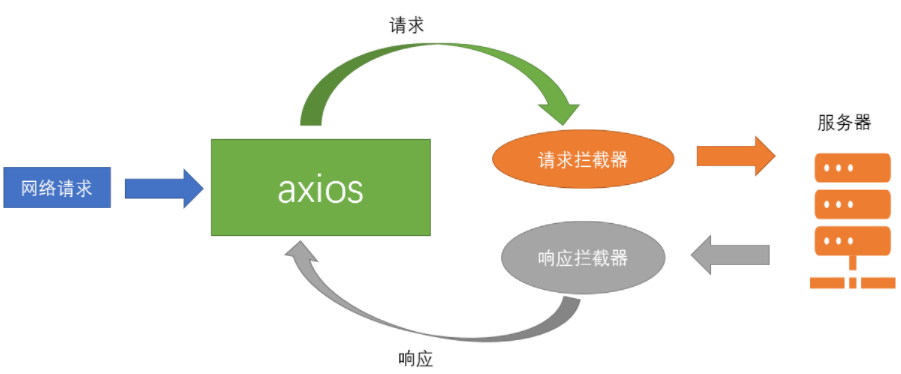


#### 请求拦截器

在`发出请求之前`拦截请求，用来对请求进行修改并返回

```js
// 请求拦截器
service.interceptors.request.use(
  config => { // 发送请求之前, 对配置对象最后修改
    if (store.getters.token) { // 如果有token, 携带上
      config.headers['X-Token'] = getToken() // key叫X-Token, value是token(带在请求头里)
    }
    return config
  },
  error => { // 请求之前报错执行这里
    console.log(error) // for debug
    return Promise.reject(error)
  }
)
```


#### 响应拦截器

在`接收到响应报文之后`对响应报文中的数据修改以后返回

```js
// 响应拦截器
service.interceptors.response.use(
  response => { // 响应成功2xx, 3xx
    const res = response.data // 提取响应数据

    // http状态虽然正确, 但是逻辑错误在code中表示(20000成功, 不是20000则失败)
    if (res.code !== 20000) {
      Message({
        message: res.message || 'Error',
        type: 'error',
        duration: 5 * 1000
      })

      // 其他错误码的判断, 给出提示
      if (res.code === 50008 || res.code === 50012 || res.code === 50014) {
        MessageBox.confirm('You have been logged out, you can cancel to stay on this page, or log in again', 'Confirm logout', {
          confirmButtonText: 'Re-Login',
          cancelButtonText: 'Cancel',
          type: 'warning'
        }).then(() => { // 用户点击确认, 清除vuex的token
          store.dispatch('user/resetToken').then(() => {
            location.reload()
          })
        })
      }
      return Promise.reject(new Error(res.message || 'Error'))
    } else {
      return res
    }
  },
  error => { // 响应状态码4xx, 5xx进入这里
    console.log('err' + error)
    Message({
      message: error.message,
      type: 'error',
      duration: 5 * 1000
    })
    return Promise.reject(error)
  }
)
```


### 小结

1. axios的拦截器何时执行?

   <details>     
   <summary>答案</summary> 
   <ul>
   <li>请求拦截器, 在发起请求之前, 对请求的配置对象, 进行最后修改</li>
   <li>响应拦截器, 在响应数据回来, 先被响应拦截器函数, 处理一下</li>
   <li>每种拦截器函数, 都有一个成功的和失败的</lli>
   </ul>
   </details>

2. http状态码和code的区别?

   <details>     
   <summary>答案</summary> 
   <ul>
   <li>http状态码, 是本次响应的状态</li>
   <li>200完全成功</li>
   <li>4开头和5开头都是本次响应失败</li>
   <li>而code是http一次请求和一次成功响应, 但是逻辑有错误, 例如登录失败</li>
   </ul>
   </details>


## 11.模板讲解-App.vue-路由和Layout

### 目标

分析 App.vue 中代码的构成


### 讲解

App.vue 是项目的根组件 

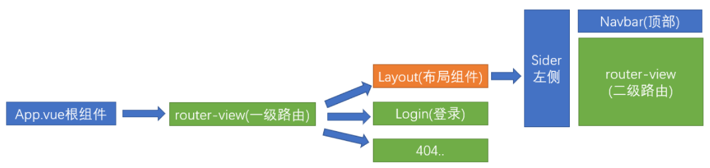


1. App.vue 只有 router-view ，一级路由的出口

   ```vue
   <template>
     <div id="app">
       <!-- 一级路由的出口 -->
       <router-view />
     </div>
   </template>
   ```

2. 查看 router/index.js 中的路由表文件

   ```js
     {
       path: '/login', // 登录
       component: () => import('@/views/login/index'),
       hidden: true
     },
   
     {
       path: '/404', // 404
       component: () => import('@/views/404'),
       hidden: true
     },
   
     {
       path: '/',
       component: Layout, // 我们在访问主要时，需要展示的是 Layout组件
       redirect: '/dashboard',
       children: [{
         path: 'dashboard',
         name: 'Dashboard',
         component: () => import('@/views/dashboard/index'),
         meta: { title: 'Dashboard', icon: 'dashboard' }
       }]
     
   
     // 其他路由和组件……
   ```

3. Layout 是登录后主页的样式布局

   ```vue
   <template>
     <!-- layout布局页面(左边和上面) -->
     <div :class="classObj" class="app-wrapper">
       <!-- 灰色蒙层: 在移动端下, 切换左侧导航, 会出现
         sidebar.opened -> 侧边栏导航出现(值来自vuex的sidebar.js)
         点击蒙层关闭->设置(opened为false, 本地还存个0)
        -->
       <div v-if="device==='mobile' && sidebar.opened" class="drawer-bg" @click="handleClickOutside" />
       <!-- 左侧侧边栏组件 -->
       <sidebar class="sidebar-container" />
       <!-- 右侧容器 -->
       <div class="main-container">
         <!-- 头部是否固定(在@/settings可以设置, 但是在vuex里取出)->现在false不固定 -->
         <div :class="{'fixed-header':fixedHeader}">
           <!-- 头部导航组件 -->
           <navbar />
         </div>
         <!-- 主体内容区域 -->
         <app-main />
       </div>
     </div>
   </template>
   ```

4. Layout下属

   左侧slidebar组件 (侧边栏导航)

   右侧上部navbar组件 (头部导航)

   右侧主题内容app-main组件

   分别切换进去查看对应实现


### 小结

1. 整个项目的路由是如何布局管理的?

   <details>
   <summary>答案</summary>
   <ul>
   <li>App.vue里设置一级路由挂载点, 挂载layout和登录页面以及404页面</li>
   <li>Layout.vue右下角是二级路由挂载点,挂载二级路由的页面</li>
   </ul>
   </details>
   
   

## 12.模板讲解-views下属

### 目标

分析这个文件夹下面的一切文件

### 讲解

主要讲解下登录页面views/login.vue

```vue
<template>
  <div class="login-container">
    <!-- elementUI表单结构
      el-form > el-form-item > 具体的表单标签(输入框/复选框/....)
      做表单的校验:
      方式1: 标签上校验(失去焦点校验)
      el-form标签: :model="表单数据对象" :rules="规则对象"
      el-form-item prop="对象里key名"
      具体标签 v-model="表单数据对象.key名"
      重要: 因为组件内要访问key名, 所以要求表单数据对象和规则对象key必须一致
      prop和v-model的那个key名对应的

      方式2: JS里兜底校验(防止用户上来直接点击按钮-想跳过标签校验)
      el-form标签: ref="别名" 为了在js中this.$refs.别名 获取到el-form组件对象
      点击登录事件方法内, 调用组件对象内置.validate()方法进行强制校验
     -->
    <el-form ref="loginForm" :model="loginForm" :rules="loginRules" class="login-form" auto-complete="on" label-position="left">

      <div class="title-container">
        <h3 class="title">Login Form</h3>
      </div>

      <el-form-item prop="username">
        <span class="svg-container">
          <svg-icon icon-class="user" />
        </span>
        <el-input
          ref="username"
          v-model="loginForm.username"
          placeholder="Username"
          name="username"
          type="text"
          tabindex="1"
          auto-complete="on"
        />
      </el-form-item>

      <el-form-item prop="password">
        <span class="svg-container">
          <svg-icon icon-class="password" />
        </span>
        <el-input
          :key="passwordType"
          ref="password"
          v-model="loginForm.password"
          :type="passwordType"
          placeholder="Password"
          name="password"
          tabindex="2"
          auto-complete="on"
          @keyup.enter.native="handleLogin"
        />
        <span class="show-pwd" @click="showPwd">
          <svg-icon :icon-class="passwordType === 'password' ? 'eye' : 'eye-open'" />
        </span>
      </el-form-item>

      <el-button :loading="loading" type="primary" style="width:100%;margin-bottom:30px;" @click.native.prevent="handleLogin">Login</el-button>

      <div class="tips">
        <span style="margin-right:20px;">username: admin</span>
        <span> password: any</span>
      </div>

    </el-form>
  </div>
</template>
```


### 小结

1. 此文件有何作用, 对应页面哪部分?

   <details>     
   <summary>答案</summary> 
   <ul>
   <li>对应登录页面, 是写的现成的</li>
   </ul> 
   </details>


## 13.模板讲解-main.js

### 目标

😀❓  思 考：

入职公司，一般是对已有的项目进行开发，我们能够直接上手开发吗 ？


😇💯 答案：

不能

公司项目有可能写了半年，一年，甚至更久

项目代码，会比较多，根本无法下手，直接上手也会产生很多 Bug 

因此入职以后，公司会给一定的时间去熟悉公司的项目代码(**运行机制和文件梳理**)


### 讲解

main.js是项目的整个入口, 刚才我们从头挨个分析后, 现在我们可以去整理和规划下每个文件夹的意思了

#### 目录结构

```html
├── src                        # 源代码
│   ├── api                    # 所有请求
│   ├── assets                 # 主题 字体等静态资源
│   ├── components             # 全局公用组件
│   ├── icons                  # 项目所有 svg icons
│   ├── layout                 # 全局 layout
│   ├── router                 # 路由
│   ├── store                  # 全局 store管理
│   ├── styles                 # 全局样式
│   ├── utils                  # 全局公用方法
│   ├── views                  # views 所有页面
│   ├── App.vue                # 入口页面
│   ├── main.js                # 入口文件 加载组件 初始化等
│   └── permission.js          # 权限管理
│   └── settings.js            # 配置文件
```


#### main.js

main.js 是整个项目的入口文件

​						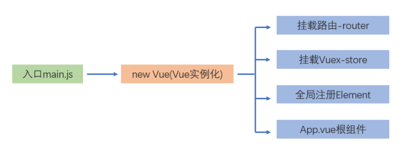


在 main.js 文件中，在对 Vue 进行实例化的同时，还主要做了 4 件事：

1.  挂载路由 router

   ```js
   import router from './router'
   
   new Vue({
     el: '#app',
     router,
     store,
     render: h => h(App)
   })
   ```

2.  挂载 store

   ```js
   import store from './store'
   
   new Vue({
     el: '#app',
     router,
     store,
     render: h => h(App)
   })
   ```

3.  注册 element

   ```js
   import ElementUI from 'element-ui'
   import 'element-ui/lib/theme-chalk/index.css'
   import locale from 'element-ui/lib/locale/lang/en' // lang i18n
   
   // set ElementUI lang to EN
   // Vue.use(ElementUI, { locale })
   // 如果想要中文版 element-ui，按如下方式声明
   Vue.use(ElementUI)
   ```

4.  挂载项目的跟组件

   ```js
   import App from './App'
   
   new Vue({
     el: '#app',
     router,
     store,
     render: h => h(App)
   })
   ```


#### mock

mock是模拟数据, 用于随机生成一些值给前台

有的项目是前端先干, 后端还没有接口(以后后端接口可以参考mock的数据结构无缝和前端对接)

```js
if (process.env.NODE_ENV === 'production') {
  const { mockXHR } = require('../mock')
  mockXHR()
}
// mock(拦截ajax请求, 返回模拟数据)
// 文档: http://mockjs.com/
// 项目分为2种情况
// 后端写好了(有接口)
// 不使用mock, 而是直接ajax->请求后端接口->拿到开发数据铺设页面

// 后端还没写(无接口)
// 细分2种情况
// (1): "没有"和后台沟通好, 返回数据的字段名, 字段数量, 无法使用mock, 先随便编点固定数据
// (2): 页面数量, 模块划分, 字段名字都已经确定了, 我们可以选择使用mock, 来设置模拟数据格式, 将来后台有接口了, 我无需改变前端逻辑代码, 直接替换接口请求即可
```


### 小结

1. main.js里都干了什么?

   <details>     
   <summary>答案</summary> 
   <ul>
   <li>清除标签默认样式</li>
   <li>引入和注册ElementUI</li>
   <li>引入全局通用样式</li>
   <li>引入App根组件</li>
   <li>引入store和router</li>
   <li>引入字体图标工具和路由权限控制模块</li>
   </ul>
   </details>


## 14.模板讲解-permission.js

### 目标

分析 permission.js 中代码的作用

### 讲解

```js
import router from './router' // 我们自己new的router路由对象(相当于this.$router)
import store from './store' // new出来store对象(相当于this.$store)
import { Message } from 'element-ui' // 消息顶部提示框
import NProgress from 'nprogress' // 进度条(浏览器顶部-路由切换的时候显示)
// 知识点1: 如果想看包的作用, 最好就是去npmjs.com网站
import 'nprogress/nprogress.css' // 进度条样式
import { getToken } from '@/utils/auth' // get token from cookie
import getPageTitle from '@/utils/get-page-title' // 设置浏览器标题的处理函数

NProgress.configure({ showSpinner: false }) // 右侧的进度环
// 知识点2: 分析代码思路
// (1): 先找官方文档, 读一读
// (2): 在自己改改试一试, 分析分析, 改改, 打印打印....
// (3): 百度/问别人
// (4): 先放放, 不影响核心逻辑, 最后联想上下文(变量在哪里用过-在当前页面搜索/放大镜全局搜索), 再猜

const whiteList = ['/login'] // 白名单(无token能够看到的页面路由路径)

// 全局路由-前置守卫
router.beforeEach(async(to, from, next) => {
  // to: 要去的下一个路由页面的 路由对象(路由规则数组里)
  // 开启进度条(针对路由切换页面有进度条, ajax请求无进度条)
  NProgress.start()

  // 知识点: 给浏览器上面标签栏上的标题设置文字(类似index.html中title标签作用)
  // title标签静态的, document.title可以在js代码运行时候动态修改
  // to.meta.title, 拿到router/index.js里路由规则对象中提前存放的标题文字
  document.title = getPageTitle(to.meta.title)

  // determine whether the user has logged in
  const hasToken = getToken()

  if (hasToken) { // 有token(已登录)
    if (to.path === '/login') { // 已登录了还想去跳到登录页
      next({ path: '/' }) // 重新强制给你打回到首页
      NProgress.done() // 进度条关闭
    } else { // 已登录不去登录页(正常页面)
      const hasGetUserInfo = store.getters.name
      if (hasGetUserInfo) { // 有用户信息->放行
        next() // 这个才是放行->让路由页面跳转
      } else {
        try {
          // 已登录(有token), 但是无用户信息, 调用actions里请求拿到用户名字等
          // 添加到vuex里
          await store.dispatch('user/getInfo')
          // 等待网络请求成功, 放行到下一个正文页面

          next()
        } catch (error) {
          // 比如token过期, 上面await后请求就报错
          // remove token and go to login page to re-login
          // 重置token(删除)
          await store.dispatch('user/resetToken')
          // 给用户一个提示框
          Message.error(error || 'Has Error')
          // 打回到登录页面(token过期, 回去重新登录)
          // 给登录页面进行路由跳转传参(把本来要去的页面to.path地址传给登录页面)
          // 登录后不会去首页, 而是去到刚才没过去的那个未遂的页面上
          next(`/login?redirect=${to.path}`)
          NProgress.done()
        }
      }
    }
  } else { // 无token
    if (whiteList.indexOf(to.path) !== -1) { // 在白名单里(例如:登录/login), 放行
      // includes()判断存在返回true
      // indexOf()查找下标
      next()
    } else {
      // 无token(没登录), 还想去正常的页面, 打回到登录页面来
      // 知识点: next()里有路径, 就会再次发生一次路由跳转, 路由守卫会从头再重新执行一遍
      // 点击登录, 如果有redierct跳转到未遂地址(回到刚才页面)
      next(`/login?redirect=${to.path}`)
      NProgress.done()
    }
  }
})
// 先读, 后仿写, 写多了, 自己拿到需求根据目标再写

// 全局路由-后置守卫(路由跳转完成, 再触发()里函数体)
router.afterEach(() => {
  // 进度条关闭
  NProgress.done()
})

// 心理准备: 拿到一个半截项目 1天-1个月你会非常痛苦
// 挺过来, 看看. 熟悉了, 就非常轻松....

```

### 小结

1. permission.js作用是什么?

   <details>     
   <summary>答案</summary> 
   <ul>
   <li>控制路由权限判断</li>
   <li>登录和非登录的相关设置</li>
   </ul>
   </details>


## 15.模板讲解-settings.js

### 目标

分析 settings.js 中代码的作用

### 讲解

settings.js 主要用来对项目信息进行配置，里面有三个属性：

1.  `title`：项目名称
2.  `fixedHeader`：固定头部
3. `sidebarLogo`：显示左侧菜单logo

```js
module.exports = {

  title: '人资资源管理平台',

  /**
   * @type {boolean} true | false
   * @description Whether fix the header
   */
  fixedHeader: false,

  /**
   * @type {boolean} true | false
   * @description Whether show the logo in sidebar
   */
  sidebarLogo: false
}
```

​		

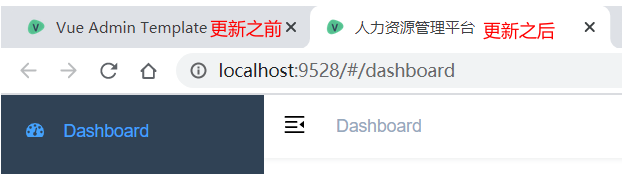


### 小结

1. settings.js的作用?

   <details>     
   <summary>答案</summary> 
   <ul>
   <li>封装了全局的一些变量, 方便一键修改</li>
   </ul>
   </details>


## 16.模板讲解-scss-介绍

### 目标

什么是 scss

### 讲解

#### scss 的基本使用

和less类似, sass 也是一种 CSS 的预编译语言

它提供了 变量、嵌套、 混合、 函数等功能，并且完全兼容 CSS 语法

详见 [Scss  官方文档](https://www.sass.hk/)


#### scss 和 sass 的区别

​		sass 和 scss 其实是**`一样的`**css预处理语言，scss 是 sass 3 引入新的语法，其后缀名是分别为 .sass 和 .scss 两种。
​		sass  版本 3.0 之前的后缀名为 .sass ，而版本 3.0 之后的后缀名. scss


#### scss-基本语法

#### 变量

1. 定义变量

   ```scss
   $highlight-color: #f90;
   $basic-border: 1px solid black;
   ```

   

2. 使用变量

   ```scss
   #app {
     background-color: $highlight-color;
     border: $basic-border;
   }
   ```

   

3. 在初始化的项目中， **`styles/variables.scss`**这个文件中就是我们本次项目用到的所有 scss 变量

   

   ​				  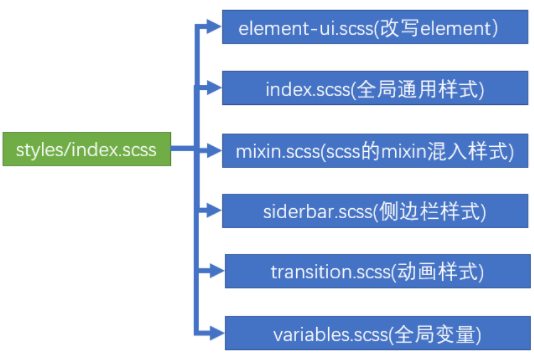


#### 嵌套语法

转换之前：

```scss
// scss语法
$highlight-color: #f90;
$basic-border: 1px solid black;

#app{
  background-color:  $highlight-color;
  border:$basic-border;

  .container{
    font-size:30px;
  }
}
```

转换之后：

```css
#app {
  background-color: #f90;
  border: 1px solid black;
}

#app .container {
  font-size: 30px;
}
```


#### &父选择器

假如你想针对某个特定子元素 进行设置

```scss
$highlight-color: #f90;
$basic-border: 1px solid black;

#app {
  background-color:  $highlight-color;
  border:$basic-border;

  .container {
    font-size:30px;
  }

  a {
    color:blue;

    &:hover {
      color: red;
    }
  }
}
```


#### 模块

多个 .scss文件可以相互引用

引入.scss可以得到里面的变量直接用


1. 格式

   ```scss
   @import './xxxx.scss';
   ```

   

2. 例如

   ```scss
   // base.scss 
   
   $base-color: green;
   ```

   ```scss
   @import './base.scss';
   
   $highlight-color: #f90;
   $basic-border: 1px solid black;
   
   #app {
     background-color:  $base-color;
     border:$base-border;
   
     .container {
       font-size:30px;
     }
   
     a {
       color:blue;
   
       &:hover {
         color: red;
       }
     }
   }
   ```

   

### 小结 

1. scss 的语法非常多，我们最常使用的有哪些?

   <details>
   <summary>答案</summary>
   <ul>
   <li>定义变量</li>
   <li>嵌套使用</li>
   <li>使用&选择器</li>
   <li>抽取变量, 进行复用, @import引入</li>
   </ul>
   </details>


## 17.模板讲解-scss

### 目标

了解 scss 文件的作用

### 讲解

#### scss 文件组织方式

vue-admin-template  项目使用了[scss ](https://www.sass.hk/)作为 css 的扩展语言，Scss 文件主要放置在**`styles`**目录下，其中 `index.scss` 文件在入口文件 main.js 文件中已经导入

```js
import '@/styles/index.scss' // global css
```

因为我们主要来看一下 index.scss 文件，会发现这个文件将其他文件都已经使用 @import 方法进行了导入

```js
@import './variables.scss';
@import './mixin.scss';
@import './transition.scss';
@import './element-ui.scss';
@import './sidebar.scss';

// 其他代码略
```

各个文件的具体作用，看下图


​									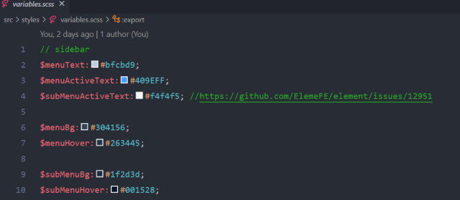


### 小结

1. index.scss的文件有什么作用?

   <details>
   <summary>答案</summary>
   <ul>
   <li>负责把其他的scss文件, 集中导入, 然后在main.js集中注入</li>
   </ul>
   </details>


## 18.环境变量

### 目标

在不同环境自适应取值使用

区分线上和线下环境

### 讲解

本地服务端口需要在`vue.config.js`中进行设置，详见 [Vue-cli 官方文档](https://cli.vuejs.org/zh/guide/webpack.html)

```js
const port = process.env.port || process.env.npm_config_port || 9528 // dev port
```

 **`process.env.port`**是一个 nodejs 服务下的环境变量

在**`.env.development`**和**`.env.production`**两个文件区分环境

1.  development => 开发环境 => 运行npm run dev => 加载.env.development内容

2.  production     => 生产环境 => 运行 npm run build:prod => 加载.env.production内容

==我们去对应的环境变量配置文件中设置port端口号, 敲击不同的命令, 查看效果==


### 小结

1. 环境变量的作用是什么?

   <details>
   <summary>答案</summary>
   <ul>
   <li>在配置文件中, 添加key和value, 然后根据敲击的命令, 加载不同的变量的值在代码里生效</li>
   </ul>
   </details>


## 今日总结

1. 拿到项目怎么办T.T?

   * 先启动跑起来(遇到报错, 就想办法干掉他)
     * 访问无数据/可能是公司局域网/只能在公司局域网启动项目
     * 公司内部的包, 用npm/yarn都下不到, 需要把npm/yarn的镜像地址切换到公司内部服务器

   * 项目文件夹几十, 几百, 几千个

     * 先熟悉封装的工具 / 先不用管具体页面 (因为可能不会给你分具体的需求和负责的模块)

     * 先从main.js入口开始 (小程序/react/uniapp/其他框架) 都先找到入口

       > 可以用xmind构建项目文件夹和文件关系, 每个文件的主要作用解释

     * 顺腾摸瓜, 挨个写注释

2. 看代码过程中遇到问题

   (1): 某个方法/属性不知道什么意思 - 但是是API的, 多查文档, 

   (2): 找不到哪里用过, 多用vscode左侧的放大镜功能搜索

   (3): 不知道什么作用, 可以随便改个值, 看看页面哪里发生了变化

   (4): 找到标签对应页面那一部分, 还可以通过关键类名

## 常见的报错

https://panjiachen.gitee.io/vue-element-admin-site/zh/guide/other/faq.html#node-sass-%E5%AE%89%E8%A3%85%E5%A4%B1%E8%B4%A5%EF%BC%9F

### ssh无权限

方案1:  试试改成https方式下包


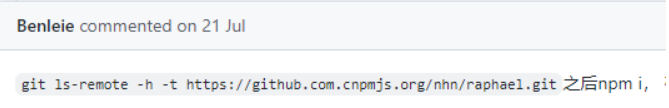


方案2: 如果没有.gitconfig没有配置项, 自己添加一个, 然后重启终端, 或者看看别的

https://www.bilibili.com/video/bv1Vq4y1k71U


方案3: 可以看看这里有没有想要的

https://github.com/PanJiaChen/vue-element-admin/issues/3491


方案4: 那就老老实实配置github.com的ssh秘钥吧

本地生成秘钥

把.pub公钥配置到github.com网站上(没账号注册一个)-可能网速很慢多等会, 多刷新下

https://www.jianshu.com/p/c75dafdd3078


方案5: 终极大招- 把别人好使的node_modules文件夹拿过来, 不用下了, 直接放到项目根目录下, 直接使用, 启动项目即可


