# Day02_项目环境搭建-登陆模块

## 各种地址

1. api接口文档: https://shuiruohanyu.gitee.io/yyds/api.html (也可用本地的<接口文档.html>
2. 线上演示: http://ihrm.itheima.net/ (原型图, 设计图)
3. 后台接口基地址: http://ihrm.itheima.net/api

## 01.项目-环境初始化

### 目标

克隆一份新的vue-admin-template模板项目

### 讲解

```bash
# 新建hmhr文件夹
新建hmhr文件夹

# 克隆一份新的项目模板 (后面空格.代表克隆到路径所在文件夹下)
git clone https://gitee.com/panjiachen/vue-admin-template.git .

# 安装所有依赖
npm install

# 启动开发调试模式  查看package.json文件的scripts可知晓启动命令
npm run dev
```

### 小结

1. 克隆时, 为何后面有时候要加个点

   <details>     
   <summary>答案</summary> 
   <ul>
   <li>把项目里代码放到当前文件夹下</li>
   <li>如果不加会在原地创建个新文件夹, 放入代码</li>
   </ul> 
   </details>


## 02.项目-肃清模板

### 目标

把它的项目里代码都删除掉, 留下一个框

### 讲解

从上到下, 挨个文件过筛子

1. 自带的作者的.git文件夹删除掉, 一会儿我们自己初始化一个自己的使用(==删除==)

   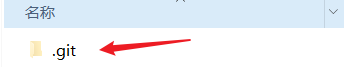

   

2. mock - 文件夹删除 (用于模拟数据, 无后台接口使用)

   配套 - ==vue.config.js== - 对应使用的代码, 删除

   ```js
   // before: require('./mock/mock-server.js')
   ```

   

3. main.js -> 清除mock.js相关代码

   ```js
   import Vue from 'vue'
   import 'normalize.css/normalize.css' // A modern alternative to CSS resets
   
   import ElementUI from 'element-ui'
   import 'element-ui/lib/theme-chalk/index.css'
   import locale from 'element-ui/lib/locale/lang/en' // lang i18n
   
   import '@/styles/index.scss' // global css
   
   import App from './App'
   import store from './store'
   import router from './router'
   
   import '@/icons' // icon
   import '@/permission' // permission control
   
   // if (process.env.NODE_ENV === 'production') {
   //   const { mockXHR } = require('../mock')
   //   mockXHR()
   // }
   
   Vue.use(ElementUI, { locale })
   // 如果想要中文版 element-ui，按如下方式声明
   // Vue.use(ElementUI)
   
   Vue.config.productionTip = false
   
   new Vue({
     el: '#app',
     router,
     store,
     render: h => h(App)
   })
   
   ```

4. api文件夹

   > 删除table.js, 留下user.js, 但是清空user.js里一切

   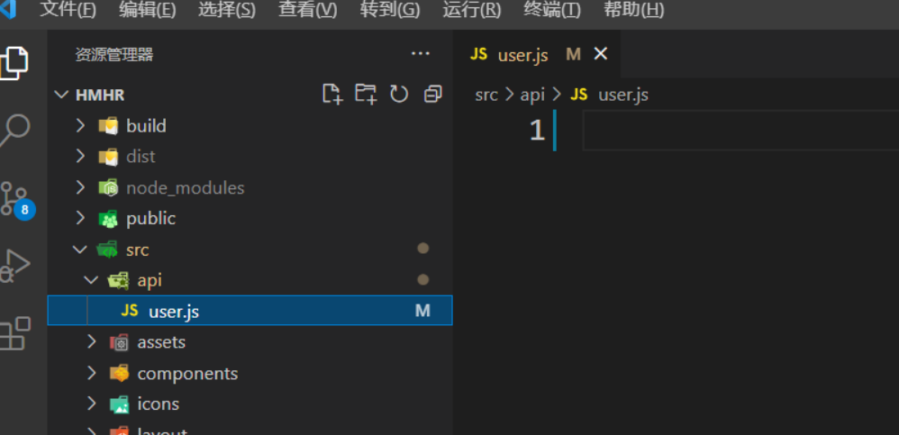

   

5. router/index.js - 路由修改

   ```js
   import Vue from 'vue'
   import Router from 'vue-router'
   Vue.use(Router)
   
   import Layout from '@/layout'
   
   export const constantRoutes = [
     {
       path: '/login',
       component: () => import('@/views/login/index'),
       hidden: true
     },
     {
       path: '/404',
       component: () => import('@/views/404'),
       hidden: true
     },
     {
       path: '/',
       component: Layout,
       redirect: '/dashboard',
       children: [{
         path: 'dashboard',
         name: 'Dashboard',
         component: () => import('@/views/dashboard/index'),
         meta: { title: 'Dashboard', icon: 'dashboard' }
       }]
     },
   
     { path: '*', redirect: '/404', hidden: true }
   ]
   
   const createRouter = () => new Router({
     scrollBehavior: () => ({ y: 0 }),
     routes: constantRoutes
   })
   
   const router = createRouter()
   
   export function resetRouter() {
     const newRouter = createRouter()
     router.matcher = newRouter.matcher
   }
   
   export default router
   
   ```

6. views/删除不需要的页面, 只需要保存路由需要的页面即可

   

   

7. store/modules/user.js -> 肃清模板

   ```js
   const getDefaultState = () => {
     return {
     }
   }
   const state = getDefaultState()
   
   const mutations = {
     RESET_STATE: (state) => {
       Object.assign(state, getDefaultState())
     }
   }
   
   const actions = {
   }
   
   export default {
     namespaced: true,
     state,
     mutations,
     actions
   }
   ```

   

8. utils/request.js中, 肃清模板

   ```js
   import axios from 'axios'
   
   const service = axios.create({
     baseURL: process.env.VUE_APP_BASE_API,
     timeout: 5000
   })
   
   service.interceptors.request.use(
     config => {
       return config
     },
     error => {
       return Promise.reject(error)
     }
   )
   
   service.interceptors.response.use(
     response => {
       return response
     },
     error => {
       return Promise.reject(error)
     }
   )
   
   export default service
   
   ```

9. permission.js -> 路由权限管理, 肃清留框

   ```js
   import router from './router'
   
   // const whiteList = ['/login'] // no redirect whitelist
   
   router.beforeEach(async(to, from, next) => {
   
     next()
   })
   
   router.afterEach(() => {
   
   })
   
   ```

### 小结

1. 为何要肃清模板?

   <details>     
   <summary>答案</summary> 
   <ul>
   <li>因为大家的经验, 还不足以在现有的代码上进行修改, 而且我们要学习写的写法</li>
   </ul> 
   </details>

2. 以后进公司, 公司写完的项目, 我能肃清吗?

   <details>     
   <summary>答案</summary> 
   <ul>
   <li>不能, 那你会被打s的~</li>
   <li>如果整个项目都是你负责, 要把所有代码逐行写注释, 像我们昨天一样</li>
   <li>如果你负责某个模块, 先运行起来, 找到自己的文件, 但是要把封装的公共工具看明白, 不用管别人的.vue文件, 要多沟通, 谁封装了全局的东西, 组内要备案. 防止重复封装</li>
   </ul> 
   </details>


## 03.项目-git管理

###  目标 

本地初始化git环境

[码云](https://gitee.com/)建立远程仓库, 推送上去

### 讲解

#### 本地初始化

**`注意`**: 之前的项目是直接从 vue-admin-template **`克隆`**而来

里面有原来的提交记录,为了避免冲突, 先将原来的**`.git`**文件夹删除掉，自己初始化个空的自己的

```bash
# 初始化项目

git init
```

```bash
# 将修改添加到暂存
git add .

# 将暂存提到本地仓库
git commit -m '人资项目初始化_肃清模板后'
```

#### 建立远程仓库

> 远程仓库建立只需要在网站上直接操作即可


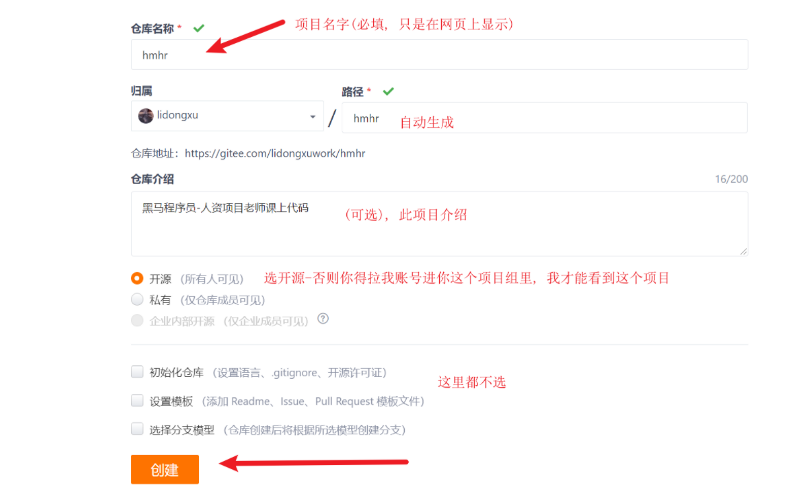

> 创建项目完成后, 找到git仓库地址.git结尾的

#### 推送到远程仓库

推送到远程仓库一般先将**`远程仓库地址`**用本地仓库别名代替

```bash 
# 添加远程仓库地址

git remote add origin 远程仓库地址
```

> 当我们不清楚自己的仓库对应的origin地址时, 我们可以通过命令查看当前的远程仓库地址

```bash
# 查看本地仓库的远程仓库地址映射

git remote -v
```

**推送master分支到远程仓库**

> 如果想推送其他分支, 本地先确保有, 然后把master换成对应分支名

```bash
# 将master分支推送到origin所代表的远程仓库地址
git push -u origin master
```

> -u作用是建立一条通道, 以后直接git push即可(但是要在master分支下)

#### 更多命令


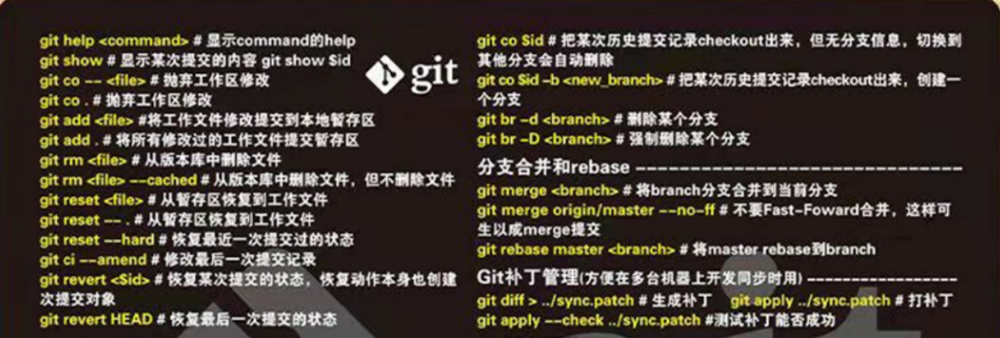

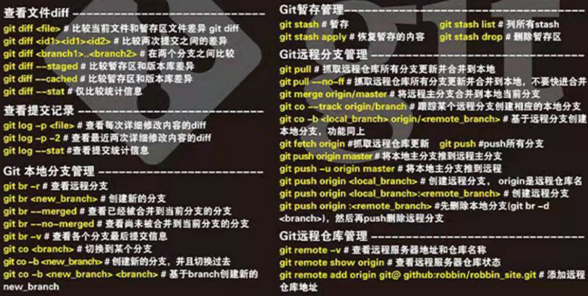


### 小结

1. 本地准备git仓库(得到.git文件夹), .git文件夹作用是什么?

   <details>     
   <summary>答案</summary> 
   <ul>
   <li>.git文件夹记录了, 当前git仓库的版本信息和代码快照, 以及远程仓库的地址</li>
   <li>如果确保你要重新记录本地提交记录, 可以删除, 否则不要随意删除</li>
   </ul> 
   </details>

2. 为什么要把git记录提交到远程服务器上?

   <details>     
   <summary>答案</summary> 
   <ul>
   <li>可以和别人同步合作, 协同开发, 把git版本记录保存到云上, 本地万一没了, 可以拉取恢复</li>
   </ul> 
   </details>

3. 第一次从git仓库拿到代码, 命令是什么?

   <details>     
   <summary>答案</summary> 
   <ul>
   <li>git clone第一次克隆下来, 从远程仓库上复制下来</li>
   </ul> 
   </details>

4. git clone可以拉取所有分支吗?

   <details>     
   <summary>答案</summary> 
   <ul>
   <li>不可以, 默认拉取的是主分支master的代码</li>
   <li>如果想要第一次拉取子分支代码, git clone -b 分支名 远程git地址即可</li>
   <li>如果本地已经克隆过了, 想要再拉取别的分支, 可以git checkout -b 分支名, 在本地新建</li   >
   </ul> 
   </details>

5. git pull的作用? 代码在哪里合并的?

   <details>     
   <summary>答案</summary> 
   <ul>
   <li>从本地git仓库已经配置好的远程链接上, 拉取代码到本地</li>
   <li>把本地commit提交到本地仓库的代码和远程拉取下来的, 在本地进行合并</li>
   </ul> 
   </details>

6. 如何查看git提交记录

   <details>     
   <summary>答案</summary> 
   <ul>
   <li>git log --oneline</li>
   </ul> 
   </details>


## 04.登录-样式调整

### 目标

修改登录页面静态布局。参考图:

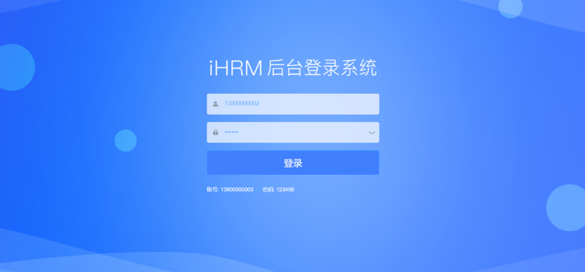


### 讲解

#### 思路

项目中已经有了login.vue文件了，有现成的结构和样式。

在原来的基础上进行修改, 找标签列名覆盖样式

#### 素材准备-图片

课程资料的`素材/common`中，要将**`common`**文件夹拷到 **`assets`**目录里


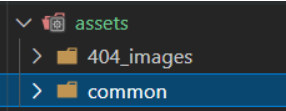

#### 素材准备-样式

课程资料的`素材/styles`中，2个scss文件, 复制到 **`styles`**目录里

- 替换**`variables.scss`**
- 新增**`common.scss`**

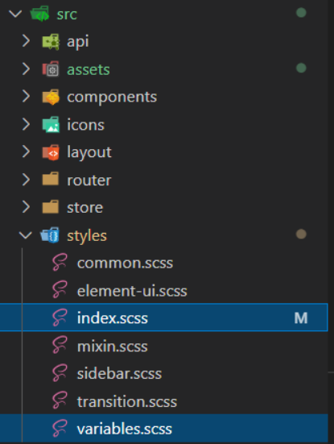

在**`index.scss`**中引入该样式

```scss
// 引入common.scss样式表 (公共样式)
@import './common.scss';
```

main.js已经默认引入了index.scss入口文件带着所有样式变量


#### logo图

`views\login\index.vue`

==注意1: 是在el-form内== 

```vue
<!-- 放置标题图片 @是设置的别名, 是在vue.config.js中设置的路径别名, 代表src绝对地址 -->
<div class="title-container">
    <h3 class="title">
      
    </h3>
 </div>
```


#### 背景图片

`views\login\index.vue`

==注意: 在**样式表**使用@时, 要在前面加~告诉webpack从根路径识别而不是相对路径==

```css
.login-container {
  background-image: url('~@/assets/common/login.jpg'); // 设置背景图片
  background-position: center; // 将图片位置设置为充满整个屏幕
}
```


#### 输入框字体颜色

`views\login\index.vue`

修改样式变量的值在style标签内

```css
$light_gray: #68b0fe;  // 将输入框颜色改成蓝色
$cursor: #68b0fe; // 将输入框光标改成蓝色
```


#### 输入框背景颜色

```diff
/* reset element-ui css */
.el-form-item {
    border: 1px solid rgba(255, 255, 255, 0.1);
    // background: rgba(0, 0, 0, 0.1);
+    background: rgba(255, 255, 255, 0.7);
    border-radius: 5px;
    color: #454545;
}
```


#### 登录按钮样式

`views\login\index.vue`

在el-button 上补充一个 login_btn的class，并设置样式如下

```css
.login_btn{
    background: #407ffe;
    height: 64px;
    line-height: 32px;
    font-size: 24px;
}
```


#### 提示文字

```htmL
<div class="tips">
    <span style="margin-right:20px;">手机号: 13800000002</span>
    <span> 密码: 123456</span>
</div>
```


#### 错误信息的字体大小

当表单元素的输入验证错误时，它会在相应的表单元素下边出现一个文字说明。

```css
/* reset element-ui css */
.el-form-item__error {
    font-size: 14px
}
```


### 小结

1. 其他的.scss文件引入到index.scss, 为何这样干?

   <details>     
   <summary>答案</summary> 
   <ul>
   <li>styles的出口是index.scss, index.scss引入到main.js, webpack打包插入到网页上生效, </li>
   </ul> 
   </details>

2. 如何在现有项目, 修改样式?

   <details>     
   <summary>答案</summary> 
   <ul>
   <li>运行项目后, 找到对应标签的类名, 然后回到代码对类名进行重写覆盖</li>
   </ul> 
   </details>

3. 路径中的@代表的是什么?

   <details>     
   <summary>答案</summary> 
   <ul>
   <li>webpack中配置的alias别名, @在路径中代表src文件夹的绝对路径</li>
   </ul> 
   </details>

4. 在样式中使用@, 前面加~, webpack才会识别绝对地址

   

## 05.登录-内容调整

### 目标

虽然样式好了,  但是标签内容和文字内容, 不太符合需求

### 讲解

从头过一遍, 明确需求目标, 然后进行文字和变量的替换

1. 把所有地方, username换成mobile属性名(==这里只有核心代码, 不要复制==)
2. 把错误提示文字换掉
3. 去utils/validate.js中, 封装导出validaMobile验证手机号正则方法

src/views/login/index.vue

```vue
<template>
  <div class="login-container">
    <el-form
      ref="loginForm"
      :model="loginForm"
      :rules="loginRules"
      class="login-form"
      auto-complete="on"
      label-position="left"
    >
      <!-- 放置标题图片 @是设置的别名, 是在vue.config.js中设置的路径别名, 代表src绝对地址 -->
      <div class="title-container">
        <h3 class="title">
          
        </h3>
      </div>

      <el-form-item prop="mobile">
        <span class="svg-container">
          <svg-icon icon-class="user" />
        </span>
        <el-input
          ref="mobile"
          v-model="loginForm.mobile"
          placeholder="Mobile"
          name="mobile"
          type="text"
          tabindex="1"
          auto-complete="on"
        />
      </el-form-item>

      <el-form-item prop="password">
        <span class="svg-container">
          <svg-icon icon-class="password" />
        </span>
        <el-input
          :key="passwordType"
          ref="password"
          v-model="loginForm.password"
          :type="passwordType"
          placeholder="Password"
          name="password"
          tabindex="2"
          auto-complete="on"
          @keyup.enter.native="handleLogin"
        />
        <span class="show-pwd" @click="showPwd">
          <svg-icon
            :icon-class="passwordType === 'password' ? 'eye' : 'eye-open'"
          />
        </span>
      </el-form-item>

      <el-button
        class="login_btn"
        :loading="loading"
        type="primary"
        style="width: 100%; margin-bottom: 30px"
        @click.native.prevent="handleLogin"
      >登录</el-button>

      <div class="tips">
        <span style="margin-right: 20px">手机号: 13800000002</span>
        <span> 密码: 123456</span>
      </div>
    </el-form>
  </div>
</template>

<script>
import { validMobile } from '@/utils/validate'

export default {
  name: 'Login',
  data() {
    const validateMobile = (rule, value, callback) => {
      if (!validMobile(value)) {
        callback(new Error('请输入正确的手机号'))
      } else {
        callback()
      }
    }
    const validatePassword = (rule, value, callback) => {
      if (value.length < 6) {
        callback(new Error('密码不能小于6位, 遗忘密码联系管理员'))
      } else {
        callback()
      }
    }
    return {
      loginForm: {
        mobile: '13800000002',
        password: '123456'
      },
      loginRules: {
        mobile: [
          { required: true, trigger: 'blur', validator: validateMobile }
        ],
        password: [
          { required: true, trigger: 'blur', validator: validatePassword }
        ]
      },
      loading: false,
      passwordType: 'password',
      redirect: undefined
    }
  },
  watch: {
    $route: {
      handler: function(route) {
        this.redirect = route.query && route.query.redirect
      },
      immediate: true
    }
  },
  methods: {
    showPwd() {
      if (this.passwordType === 'password') {
        this.passwordType = ''
      } else {
        this.passwordType = 'password'
      }
      this.$nextTick(() => {
        this.$refs.password.focus()
      })
    },
    handleLogin() {
      this.$refs.loginForm.validate((valid) => {
        if (valid) {
          this.loading = true
          this.loading = false
        } else {
          return false
        }
      })
    }
  }
}
</script>
```

在utils/validate.js中

```js
/**
 * 验证手机号
 * @param {string} str 账号-手机号
 * @returns {Boolean} 通过校验为true, 否则为false
 */
export function validMobile(str) {
  return /^1[3-9]\d{9}$/.test(str)
}

```


### 小结

1. 做需求, 和改页面, 4步套路是?

   <details>     
   <summary>答案</summary> 
   <ul>
   <li>明确需求和画面是前提, 知道要什么</li>
   <li>1. 准备标签和样式</li>
   <li>2. 铺设数据, 修改变量名, 绑定变量</li>
   <li>3. 实现表单校验, 和交互</li>
   <li>4. 前端准备好一切, 开始调用后端接口</li>
   </ul> 
   </details>


## 06.登录-表单校验

### 目标

基础模板已有校验代码，我们来修正和完善

### 讲解

#### 思路分析

el-form表单校验标签结构和属性配置

==注意: 规则对象key名字(rules属性)一定要和model表单对象的key同名==


#### 代码修改

1. 上一步, 已经把对应的key都对应好了, 规则对象和表单对象绑定的属性已经一致

3. 密码验证不需要自定义校验过程, 可以直接用内置min和max

   长度在6-16位

   ```js
   password: [
       { required: true, trigger: 'blur', min: 6, max: 16, message: '密码长度在6-16位' }
   ]
   ```

   删除validatePassword方法即可

4. 最终落地代码

   ```js
   import { validMobile } from '@/utils/validate'
   
   export default {
     name: 'Login',
     data() {
       const validateMobile = (rule, value, callback) => {
         if (!validMobile(value)) {
           callback(new Error('请输入正确的手机号'))
         } else {
           callback()
         }
       }
   
       return {
         loginForm: {
           mobile: '13800000002',
           password: '123456'
         },
         loginRules: {
           mobile: [
             { required: true, trigger: 'blur', validator: validateMobile }
           ],
           password: [
             { required: true, trigger: 'blur', min: 6, max: 16, message: '密码长度在6-16位' }
           ]
         },
         loading: false,
         passwordType: 'password',
         redirect: undefined
       }
     },
     watch: {
       $route: {
         handler: function(route) {
           this.redirect = route.query && route.query.redirect
         },
         immediate: true
       }
     },
     methods: {
       showPwd() {
         if (this.passwordType === 'password') {
           this.passwordType = ''
         } else {
           this.passwordType = 'password'
         }
         this.$nextTick(() => {
           this.$refs.password.focus()
         })
       },
       handleLogin() {
         this.$refs.loginForm.validate((valid) => {
           if (valid) {
             this.loading = true
             this.loading = false
           } else {
             return false
           }
         })
       }
     }
   }
   ```

   

### 小结

1. 完整的表单校验需要三个组件完成配合  分别是

   <details>     
   <summary>答案</summary> 
   <ul>
   <li>el-form负责绑定model 和 rules (绑定表单数据对象, 和规则对象, key得统一)</li>
   <li>el-form-item负责绑定prop (规则key名)</li>
   <li>el-input(表单) 负责双向绑定具体的表单数据 (表单数据key名)</li>
   </ul> 
   </details>

2. 简单的校验和复杂的校验分别使用什么方式?

   <details>     
   <summary>答案</summary> 
   <ul>
   <li>简单的校验使用配置项的几个字段即可, 复杂的校验使用自定义校验validator</li>
   </ul> 
   </details>

3. 校验的触发方式, 有哪2种?

   <details>     
   <summary>答案</summary> 
   <ul>
   <li>一个是标签那边的校验, 还有一个是JS调用表单的validate方法校验, 都需要使用</li>
   </ul> 
   </details>


## 07.登录-功能实现

### 目标

请求线上接口，实现登录

### 讲解

#### 修改基地址

在utils/request.js中发现使用的是`.env.development`的环境变量

```url
VUE_APP_BASE_API = 'http://ihrm.itheima.net/api'
```

baseURL基地址就会提取上面地址使用

```js
const service = axios.create({
  baseURL: process.env.VUE_APP_BASE_API, // 设置axios请求的基础的基础地址
  timeout: 20000 // 定义20秒超时
})
```

#### 封装登录接口

src/api/user.js 中修改原来方法

```js
import request from '@/utils/request'

/**
 * 用户 - 登录
 * @param {*} param0
 * @returns
 */
export function loginAPI(data) {
  return request({
    url: '/sys/login',
    method: 'post',
    data
  })
}

```

#### 统一出口导出接口

src/api/新建index.js

```js
export * from './user' // 从user.js按需导入所有, 然后按需导出所有

```


#### 调用登录接口

在views/login/index.vue中, 引入login接口, 进行调用

```js
import { loginAPI } from '@/api'

export default {
  methods: {
    // 登录
    handleLogin() {
      this.$refs.loginForm.validate(async(valid) => { // 登录校验
        if (valid) {
          this.loading = true
          const res = await loginAPI(this.loginForm)
          console.log(res)
          this.loading = false
        } else {
          return false // 未通过
        }
      })
    }
  }
}
```

==我的天啊, 但是发现, 跨域了, 因为后台没有开启cors==

### 小结

1. .env配置文件有何作用?

   <details>     
   <summary>答案</summary> 
   <ul>
   <li>根据执行的命令, 会自动配置变量到process.env上使用</li>
   <li>可以用于自适应不同环境, 使用不同的值</li>
   </ul> 
   </details>

2. 我们这次基地址如何配置?

   <details>     
   <summary>答案</summary> 
   <ul>
   <li>在.env.production设置开发环境基地址, 那个key是VUE_APP_开头是固定不能改</li>
   </ul> 
   </details>

3. 网络请求方法, 如何封装?

   <details>     
   <summary>答案</summary> 
   <ul>
   <li>还是在utils/request.js中基于axios进行二次封装</li>
   <li>在那里配置基础地址baseURL, 并导出自定义axios函数</li>
   </ul> 
   </details>

4. 接口调用的完整逻辑和文件划分?

   <details>     
   <summary>答案</summary> 
   <ul>
   <li>封装网络请求, utils/request.js, 设置基地址, 来自.env.production的环境变量</li>
   <li>封装接口方法, api/xxx.js中, 封装接口方法导出</li>
   <li>引入到逻辑页面, 调用, 还是和以前一样</li>
   </ul> 
   </details>


## 08.跨域-跨域原因以及解决方案

### 目标

1.  掌握跨域的原因；

2.  复习常用的解决方案；

### 讲解

#### 什么是跨域

在A地址（发起请求的页面地址）向B地址（要请求的目标页面地址）发起请求时，

如果A地址和B地址在： **协议** 、**域名**、 **端口**  不全相同，则说明请求是跨域的

#### **跨域请报错的原因**

> 请求是跨域的，并不一定会报错。普通的图片请求，css文件请求是不会报错的

**跨域请求出现错误的条件**： 浏览器同源策略  &&  请求是ajax类型

浏览器同源策略，同源策略是一个重要的安全策略，它能帮助阻隔恶意文档，减少可能被攻击的媒介。

#### **解决方案**

- 前端用JSONP方式去发请求（jsonp不是ajax请求）

- 后端写代码(CORS)在响应中添加必要的响应头，让响应回来之后浏览器不报错

- **代理转发**

  
  
  ​				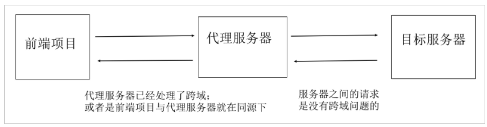

### 小结

1. 跨域是谁对谁做出的限制?

   <details>     
   <summary>答案</summary> 
   <ul>
   <li>是浏览器对ajax做出的限制</li>
   <li></li>
   </ul> 
   </details>

2. 什么是跨域?

   <details>     
   <summary>答案</summary> 
   <ul>
   <li>网页打开时, 浏览器地址栏上的协议, 域名和端口, 与ajax请求的url地址里协议, 域名和端口对不上就跨域了</li>
   </ul> 
   </details>

3. 这个项目哪个地址和哪个地址, 跨域访问了?

   <details>     
   <summary>答案</summary> 
   <ul>
   <li>前端项目在http://localhost:8080下打开访问的, 而内嵌的ajax请求, 请求地址:http://ihrm.itheima.net </li>
   </ul> 
   </details>

4. 解决跨域有几种方法?

   <details>     
   <summary>答案</summary> 
   <ul>
   <li>jsonp方式</li>
   <li>后端开启cors</li>
   <li>代理转发的方式</li>
   </ul> 
   </details>


## 09.跨域-代理转发

### 目标

如何做代理转发

### 讲解

#### 介绍

vue脚手架项目内置了代理转发功能


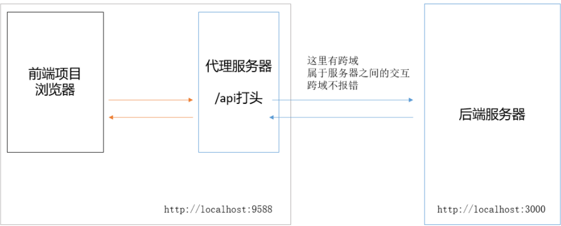

1. 前端浏览器直接**跨域**访问后端服务器**不行**
2. 前端浏览器请求本地开启cors的**中间服务器**, 它再去请求真正接口服务器

#### vue-cli 解决跨域配置说明

在`vue.config.js`配置文件中，有一项是devServer，它就是我们下边要操作的主角。

==注意1: 一定要把.env.development里设置为/api, 让它触发webpack开发服务器作为的代理服务器使用==

```bash
# 开发环境的基础地址
VUE_APP_BASE_API = '/api'
```

==注意2: 一定要把mock服务注释掉, 用线上地址==

在vue.config.js中

```js
module.exports = {
  devServer: {// 里面新增
    // before: require('./mock/mock-server.js'), // 注释线上地址
    // 代理配置
    proxy: {
      // 这里的 api 表示如果我们的请求地址以 /api 开头的时候，就出触发代理机制
      '/api': {
        target: 'http://ihrm.itheima.net', // 需要代理的地址
        changeOrigin: true // 是否跨域，需要设置此值为 true 才可以让本地服务代理我们发出请求
      }
      // 这里没有pathRewrite, 因为后端接口就是ihrm.itheima.net/api这种格式,所以不需要重写
    }
  }
}
```

==修改webpack入口以外的代码, 需要重新启动webpack服务器生效==

#### 登录账号

登录这个原网站查看员工: http://ihrm.itheima.net/hrsaas/login, 密码默认都是123456

### 小结

1. 后端开启cors原理?

   <details>     
   <summary>答案</summary> 
   <ul>
   <li>在响应头设置Access-Control-Allow-Origin: *; 允许跨域访问的地址为所有/指定ip</li>
   <li>更多讲解看这里:https://lidongxuwork.gitee.io/pages/webFront/%E6%B5%8F%E8%A7%88%E5%99%A8/CORS.html#cors%E7%AE%80%E4%BB%8B</li
   </ul> 
   </details>

2. 如果后端不开启, 我们如何才能跨域访问?

   <details>     
   <summary>答案</summary> 
   <ul>
   <li>自己本地/vuecli脚手架服务器设置代理转发</li>
   </ul> 
   </details>

3. 如果以后打包上线了, 我们代理转发还有用吗?

   <details>     
   <summary>答案</summary> 
   <ul>
   <li>在本地开发有代理服务器, 上线后, 最好把前端和后端放在一个域名和端口的服务器下</li>
   <li>线上再部署一个服务器代码, 把自己的前端和代理服务器放到一个域名下, 然后在由线上服务器进行代理转发</li>
   </ul> 
   </details>


## 10.登录-修改axios的响应拦截器(上午结束)

### 目标

1. 登录时，填写错误的用户名密码，没有错误提示(没有进入catch分支)
2. 成功和失败时, 应该给个弹窗提示
3. 获取ajax的返回结果比较麻烦：res.data.data.xxxx

### 讲解

#### 回顾

以前用try+catch捕获错误, 我们试试

```js
handleLogin() { // 登录
    this.$refs.loginForm.validate(async(valid) => { // 登录校验
        if (valid) {
            this.loading = true
            try {
                const res = await loginAPI(this.loginForm)
                console.log(res)
            } catch (err) {
                console.error(err)
            }
            this.loading = false
        } else {
            return false // 未通过
        }
        // 知识点1:
        // this.loginForm是上面定义和v-model绑定的对象以及对象key属性
        // 这里直接把相同的参数名对象直接发给后台 (建议: 前端定义变量可以直接跟接口文档要求的参数名一致)
        // 知识点2: await只能拿到成功的结果, 如果Promise对象内用reject()返回, 这里就中断不往下执行
        // 知识点3: 当Promise对象这里, 没有自己捕获到错误(try+catch, 或者.catch())然后处理的话, 浏览器就会把"抛出的这个错误"打印到控制台里, "终止代码继续往下"
        // 知识点4: 捕获Promise的错误 try+catch
        // 知识点5: 打印相关
        // 小点: .log(普通打印) .error(红色打印) .dir(打印对象详细信息-可以展开看里面key+value)
    })
}
```

发现, 还是不进catch里, 原因是, 我们密码错误, http请求过程是ok的, 返回状态为200, 但是axios内部判定http状态码为4xx, 5xx才会抛出错误, 让catch捕获

#### 铺垫

1. 后端可以用http状态码, 来返回标记错误提示, 例如
   * 400 -> 前端参数错误
   * 401 -> 用户身份过期
   * 403 -> 用户无权限
   * 404 -> 请求地址错误
   * 405 -> 请求方式错误
2. 后端也可以清一色全用200, 作为http响应状态码, 用success或code字段标记请求成功/失败

#### 解决登录失败不报错的问题

**分析原因：**

首先 axios 内部的报错机制：

1.  如果本次请求得到的响应的状态码 不是 2 开头的（如：400，500），就会主动抛出错误。
2.  如果本次请求出现网络错误，就会主动抛出错误

但当用户用户名和密码输入错误时，本次请求的状态码是正常的（虽然 success 字段是false），也没有网络错误，所以axios并不会报错。如下图示：

​          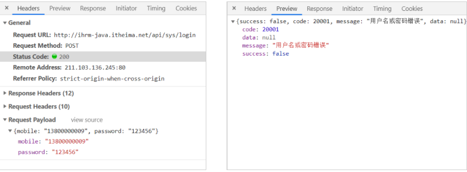        


**解决思路：**

​	在响应拦截器中，根据本次请求返回的数据中的 success  字段值，来决定是否主动抛出错误。

落地代码

```js
service.interceptors.response.use(
  response => {
    const { success, message } = response.data
    if (success) {
      return response
    } else {
      return Promise.reject(new Error(message)) // 返回Promise错误的对象, 等同reject() -> 自己根据success字段判断逻辑错误(账号密码错误)
    }
  },
  error => {
    return Promise.reject(error)
  }
)
```

> 再次查看try+catch能否进入


#### 解决获取有效数据代码冗余的问题

观察api的返回结果，我们发现axios在处理接口返回值时，默认会自动给包裹一个data字段，这导致我们每次在业务模块获取数据都需要写`res.data.data.xxxx`，这样太麻烦了。


​							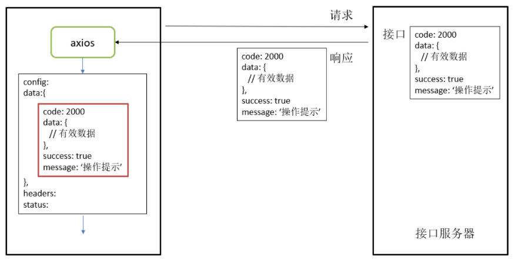


**落地代码**

在`src/utils/request.js`中，补充请求拦截器如下：

```diff
service.interceptors.response.use(
  response => {
    const { success, message } = response.data
    if (success) {
+      return response.data
    } else {
      return Promise.reject(new Error(message)) // 返回Promise错误的对象, 等同reject() -> 自己根据success字段判断逻辑错误(账号密码错误)
    }
  },
  error => {
    return Promise.reject(error)
  }
)
```

> 向外返回后台返回的数据


#### 验收效果

1. 验收登录成功的情况：再次登陆之后的查看结果，发现打印出来的已经直接是data中的数据了
2. 验收登录失败的情况：输入一个错误的手机号，检查是否按照我们的设置显示出错误信息

```js
handleLogin() { // 登录
      this.$refs.loginForm.validate(async(valid) => { // 登录校验
        if (valid) {
          this.loading = true
          try {
            const res = await loginAPI(this.loginForm)
            console.log(res)
          } catch (err) {
            console.error(err)
          }
          this.loading = false
        } else {
          return false // 未通过
        }
      })
    }
  }
```


#### 消息提示-使用

查询element-ui文档, 找到了[message消息提示](https://element.eleme.cn/#/zh-CN/component/message)

```js
handleLogin() {
      this.$refs.loginForm.validate(async(valid) => { // 登录校验
        if (valid) {
          this.loading = true
          try {
            const res = await loginAPI(this.loginForm)
            this.$message.success(res.message)
            console.log(res)
          } catch (err) {
            this.$message.error(err.message)
            console.error(err)
          }
          this.loading = false
        } else {
          return false // 未通过
        }
      })
    }
```


#### 错误统一处理

如果每次发起请求后，都进行错误处理，会让代码也非常冗余

我们既然在响应拦截器中进行获取到了错误的状态码，这时候就可以进行错误的统一处理

```diff
import { Message } from 'element-ui'


service.interceptors.response.use(
  response => {
    const { success, message } = response.data
    if (success) {
      return response.data
    } else {
+      Message.error(message) // http状态码2xx, 但是逻辑错误
      return Promise.reject(new Error(message)) // 返回Promise错误的对象, 等同reject() -> 自己根据success字段判断逻辑错误(账号密码错误)
    }
  },
  error => {
+    Message.error(error.response.data.message) // http状态码4xx
    return Promise.reject(error)
  }
)
```

```diff
handleLogin() { // 登录
    this.$refs.loginForm.validate(async(valid) => {
        // 登录校验
        if (valid) {
          this.loading = true
          try {
            const res = await loginAPI(this.loginForm)
            this.$message.success(res.message)
            console.log(res)
          } catch (err) {
-            this.$message.error(err.message)
            console.error(err)
          }
          this.loading = false
        } else {
          return false // 未通过
        }
      })
}
```


### 小结

1. 整个接口调用的流程是什么?

   <details>     
   <summary>答案</summary> 
   <ul>
   <li>1. 从逻辑页面开始, 调用actions</li>
   <li>2. actions里调用真正的api接口方法, login方法</li>
   <li>3. login接口方法里, 调用axios方法, 发起请求</li>
   <li>4. 在响应拦截器中, 进行判断和data字段提取, 返回到actions调用处</li>
   <li>5. 在actions方法内用Promise的resolve返回给逻辑页面数据</li>
   </ul> 
   </details>

2. 后台返回错误状态有哪2种方式?

   <details>     
   <summary>答案</summary> 
   <ul>
   <li>方式1: http状态码, 4xx等</li>
   <li>方式2: http状态码都200, 用某个数据字段标记错误状态</li>
   </ul> 
   </details>

3. 弹窗的机制是如何设置的?

   <details>     
   <summary>答案</summary> 
   <ul>
   <li>1. 成功的提示, 在逻辑页面自行设置</li>
   <li>2. 错误的提示, 在响应拦截器里统一设置, 使用后台返回的提示文字</li>
   </ul> 
   </details>

4. await只能获取Promise内成功结果, 想要捕获失败怎么办?

   <details>     
   <summary>答案</summary> 
   <ul>
   <li>正常Promise内的错误, 会抛出到控制台里</li>
   <li>如果我们用try+catch捕获错误, 或者.catch接收错误信息, 就不会抛出到控制台里</li>
   </ul> 
   </details>


## 11.token处理-保存到vuex

### 目标

本项目中，后端接口中只有登录接口是不需要 token 的，其他接口都需要 token 才能访问。 

### 讲解

#### 分析

登陆功能之后，从后端获取到了 token 值，在接下来的其他请求中，接口服务器都会去检查 token 值，这里我们提前把它保存到统一管理公共状态的 vuex 中

   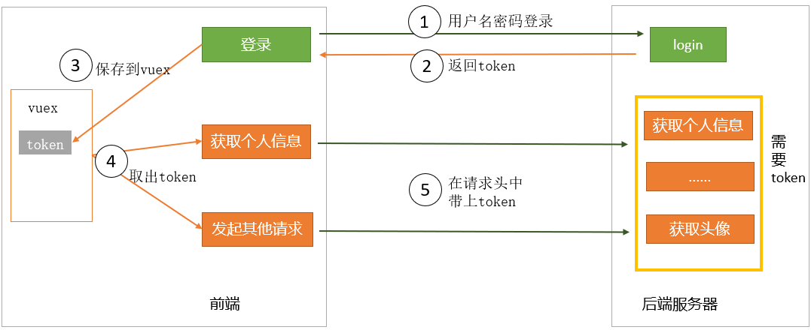

#### 保存

使用vuex的基本逻辑：数据放在state中，要修改数据则调用mutations

1. 先在state中补充定义token
2. 同时，要提供对应的用来修改token的mutation，以方便在用户登陆成功之后，去设置token。

整体思路如下


​						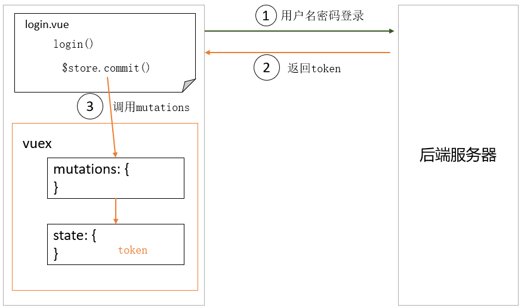

#### 初始化token状态

由于项目中，已经用了modules，直接在`store/modules/user.js`中定义token

==把别的变量都删除掉==

```js
// 共享的数据
const state = () => ({
  token: '' // 用户 Token，默认为 ''
})
```

#### 提供操作token的mutation

在`store/modules/user.js`中

```js
// 操作数据的方法
const mutations = {
  // ...其他
  // 设置token
  SET_TOKEN(state, newToken) {
    state.token = newToken
  },
  // 删除token
  REMOVE_TOKEN(state) {
    state.token = ''
  }
}
```

#### 成功登录后提交mutation

在 `views/login/index.vue` 中

直接使用$store.commit方式, 注意vuex是分模块方式

```diff
handleLogin() {
      this.$refs.loginForm.validate(async(valid) => {
        // 登录校验
        if (valid) {
          this.loading = true
          try {
            const res = await loginAPI(this.loginForm)
            this.$message.success(res.message)
+            this.$store.commit('user/SET_TOKEN', res.data)
            console.log(res)
          } catch (err) {
            this.$message.error(err.message)
            console.error(err)
          }
          this.loading = false
        } else {
          return false // 未通过
        }
      })
    }
```


#### 调试

在vue调试工具中核实效果

==注意: 需要点击登录后, 在点击左侧第二行mutations才能看到token值存入==


​							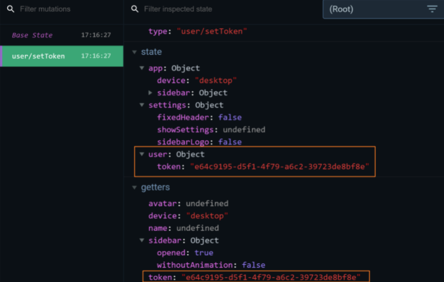

### 小结

1. 使用vuex的基本流程?

   <details>     
   <summary>答案</summary> 
   <ul>
   <li>1. 定义数据。 在state中定义。</li>
   <li>2. 定义mutations。用它来操作数据。</li>
   <li>3. 在逻辑页面里, 网络请求后, 把数据保存到vuex中</li>
   </ul> 
   </details>


## 12.token处理-axios请求拦截器-统一注入

### 目标

除了登录接口无需携带token, 因为这个是后台数据管理系统, 必须登录才能看到其他接口数据

### 讲解

#### 思路

> 在axios请求拦截器统一携带token


​			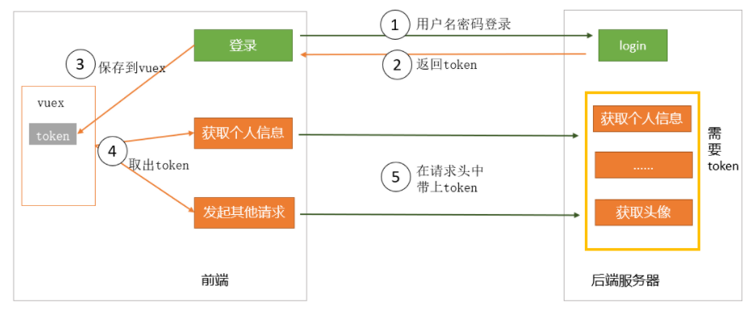


#### 请求拦截器代码

在文件**`src/utils/request.js`**中:

- 引入 store

先在store/getters.js, 为token变量设置getters

```js
const getters = {
  sidebar: state => state.app.sidebar,
  device: state => state.app.device,
  token: state => state.user.token, // 返回用户token
  avatar: state => state.user.avatar,
  name: state => state.user.name
}
export default getters

```


- 补充请求拦截器，代码逻辑是：
  - 如果当前 vuex中有 token，就在请求头中设置上
  - 因为后端返回的 token 没有添加上 Bearer  字符串，因此我们需要手动添加
  - Authorization 和 Bearer 是本项目的后端接口要求的写法。

> 原来代码里有, 在它的基础上改装即可

`src/utils/request.js`, 添加请求拦截器代码

```js
import store from '@/store'

service.interceptors.request.use(
  config => {
    // 知识点: js文件中能否使用this.$store?
    // 不能, 因为这个this关键字不是Vue组件对象, 无法查找原型链上$store
    // 但是this.$store为了拿到的是store/index.js导出store对象
    // 解决: 我们直接把store对象导入过来使用, 是同一个store对象
    const token = store.getters.token
    if (token) {
      config.headers.Authorization = `Bearer ${token}`
    }
    return config
  },
  error => {
    return Promise.reject(error)
  }
)
```


#### 测试

1. 在 `api/user.js` 中封装一个 `api` 去请求用户信息，当然这个接口是需要 token 才能访问的

   ```js
   /**
    * 用户 - 获取用户资料
    * @description: 获取用户资料
    * @param {*}
    * @return {*}
    */
   export function getUserProfileAPI() {
     return request({
       url: '/sys/profile',
       method: 'post'
     })
   }
   ```

   

3. 在 login/index.vue 中临时弄个按钮, 先点击登录, 再点击获取个人信息测试下, 请求头是否设置成功

   ```vue
   <el-button @click="testFn">测试</el-button>
   
   <script>
       import { getUserProfileAPI } from '@/api'
   
       export default {
           methods: {
               async testFn() {
                   const res = await getUserProfileAPI()
                   console.log(res)
               }
           }
       }
   </script>
   ```

   


### 小结

1. 在普通 js文件中使用 store 时，和vue文件里使用store时, 区别是什么?

   <details>     
   <summary>答案</summary> 
   <ul>
   <li>在普通js文件中, 直接引入store/index.js中的store对象使用即可</li>
   <li>在vue文件中, 方法中, 可以使用this.$store, 通过Vue实例的原型链找到new Vue时, 绑定的store对象</li>
   </ul> 
   </details>

2. 单独把axios引入到某个vue页面中, 还会执行request.js中的请求拦截器吗?

   <details>     
   <summary>答案</summary> 
   <ul>
   <li>不能, 因为单独引入的axios, 相当于独立的一个方法, 没有配置过基地址, 也没有绑定过拦截器</li>
   </ul> 
   </details>


## 13.token处理-持久化

### 目标

现在 token 虽然保存在 vuex  中，但页面刷新之后，vuex 的内容丢失了，将会导致接口访问异常。所以我们需要对 token 做持久化处理，让页面刷新之后 token 不丢失。

### 讲解

#### **思路**

1. 在设置 token 的时候除了在 vuex 中存一份，在本地也同步存一份
2. 在对 token 进行初始化的时候先从本地取一下，优先使用本地取到的值
3. 在删除 token 的时候除了把 vuex 中的删除掉，把本地的也一并删除

#### 代码

**准备工具方法**

在**`utils/auth.js`**中，基础模板已经为我们提供了**`获取token`**，**`设置token`**，**`删除token`**这三个方法，可以直接使用

只需要将存储的key放置成特定值即可

```js
import Cookies from 'js-cookie'
const TokenKey = 'hrsaas-ihrm-token' // 设定一个独一无二的key

export function getToken() {
  return Cookies.get(TokenKey)
}

export function setToken(token) {
  return Cookies.set(TokenKey, token)
}

export function removeToken() {
  return Cookies.remove(TokenKey)
}
```

**在vuex中引入方法，并调用**

在`store/modules/user.js`文件中

```js
import { getToken, setToken, removeToken } from '@/utils/auth'

const getDefaultState = () => {
  return {
    token: getToken() // 用户 Token，默认为 ''
  }
}
const state = getDefaultState()

const mutations = {
  RESET_STATE: (state) => {
    Object.assign(state, getDefaultState())
  },
  // 设置token
  SET_TOKEN(state, newToken) {
    state.token = newToken
    setToken(newToken)
  },
  // 删除token
  REMOVE_TOKEN(state) {
    state.token = ''
    removeToken()
  }
}

const actions = {
}

export default {
  namespaced: true,
  state,
  mutations,
  actions
}


```

#### 运行-测试

观察是否成功保存到本地, 这里不用localStorage/sessionStorage, 而是使用Cookie存储

成功如图所示:

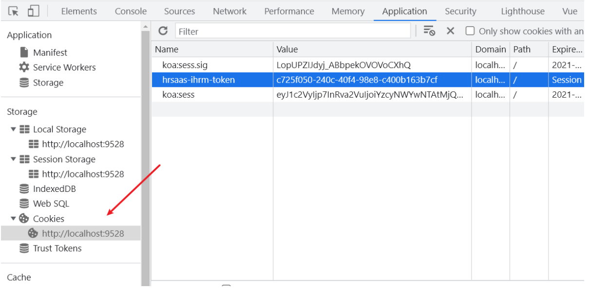


### 小结

1. 为什么不直接使用本地的token, 还要使用vuex里的呢?

   <details>     
   <summary>答案</summary> 
   <ul>
   <li>其实可以直接使用本地的token, 不使用vuex的</li>
   <li>浏览器本地的token, 是要进行磁盘数据的读取和写入, 速度没有vuex快</li>
   <li>但是vuex是在内存里, 虽然快, 但是刷新就消失了, 所以要在本地持久存储同步一份</li>
   <li>如果面试的时候, 遇到抬杠的, 我们就直接都从本地存取吧, 反正也不差那点时间(很快)</li>
   </ul> 
   </details>


## 14.优化-在vuex中的action里发登陆请求


### 目标

在 vuex 的 action 中发异步请求的写法

> 我们现在的写法，vuex 管理用户的数据只有 state 和 mutation，异步请求我们是在组件里做的，那我们可不可以在action 里发送请求，然后组件里 dispatch 我们的 action 呢？ 当然是可以的，改写一下

### 讲解

#### 补充actions

在`store/modules/user.js`中，写 actions 如下：

```js
import { loginAPI } from '@/api'

const actions = {
  // 登录逻辑-封装
  async loginActions({ commit }, value) {
    try {
      const res = await loginAPI(value)
      // 我们只需要token, 保存到上面的vuex中
      commit('SET_TOKEN', res.data)
      // 逻辑页面还在接收数组, 外面写成功/失败的逻辑, 所以这里要把数组返回出去
      // return到actions调用的地方(login/index.vue)
      return res
    } catch (err) {
      return Promise.reject(err)
    }
  }
}
```

#### 在组件中调用action

`views/login/index.vue`

```js
import { mapActions } from 'vuex'

methods: {
    ...mapActions('user', ['loginActions']),
    // 其他方法
    handleLogin() {
      this.$refs.loginForm.validate(async(valid) => {
        // 登录校验
        if (valid) {
          this.loading = true
          try {
            const res = await this.loginActions(this.loginForm)
            this.$message.success(res.message)
            console.log(res)
          } catch (err) {
            console.error(err)
          }
          this.loading = false
        } else {
          return false // 未通过
        }
      })
    },
  }
```


#### 测试后

测试完成后, 我们的测试按钮和事件方法无用了, 删除即可


### 小结

1. 我们把网络请求是如何优化的?

   <details>     
   <summary>答案</summary> 
   <ul>
   <li>**原方案** ：在逻辑组件中发异步请求api接口方法，再用 commit 调 mutation 来设置 state</li>
   <li>**新方案**：在逻辑组件中调用 action，在 action 内部去发异步请求api接口方法，再去调用 commit 调 mutation 来设置 state</li>
   </ul> 
   </details>


## 15.环境变量-设置环境变量

### 目标

理解环境变量的作用，能设置和使用环境变量

### 讲解

#### 端口配置

问题：前端项目启动时，占用端口号`9528`，是在哪里定义的呢？

答：在 `vue.config.js` 中进行配置。vue.config.js 是对 Vue 项目进行相关编译的配置文件，例如：项目打包、启动服务
相关等，它的核心在于 **webpack**，相当于在 webpack 的基础上又做了一次抽象。官网地址： [地址](https://cli.vuejs.org/zh/)


而webpack配置里的devServer选项是对服务器做出的配置


下图是开发环境服务端口的在 vue.config.js 中 位置，**`process.env.port`**实际上是一个nodejs服务下的**环境变量**

```js
const port = process.env.port || process.env.npm_config_port || 9528 // dev port
```


可以去.env.development中, 添加变量port, 重启服务器看是否生效\

```bash
port = 8080
```


#### 环境变量的配置文件

在企业开发中，前端环境通常包含很多中，常用的有：

1.  开发环境 ：项目开发过程中，开发同学开发时使用的环境
2.  预发布环境：预发布环境相当于生产环境，只不过是服务代码以及数据库是另外独立部署
3.  生产环境：线上环境，用户使用的环境

我们在开发中，不同的环境需要进行不同配置，例如：接口地址、端口等，那么我们如何区分不同环境呢？


在项目的根目录下还存在一些特殊的配置文件，我们可以其中定义相关的环境变量。

| 文件名称         | 对应环境   | 说明                                                         |
| ---------------- | ---------- | ------------------------------------------------------------ |
| .env.development | 开发环境   | 当运行`npm run dev` 的时候会以此文件为配置文件，这个文件中可以定义针对开发环境的环境变量 |
| .env.production  | 生产环境   | 当运行`npm run build:prod` 的时候会以此文件为配置文件，这个文件中可以定义针对开发环境的环境变量 |
| .env.staging     | 预发布环境 | 可以理解为production环境的镜像， 尽最大可能来模拟产品线上的环境(硬件，网络拓扑结构，数据库数据) |

在项目运行的过程中，通过不同的命令，能加载不同的配置文件，从而获取不同的环境变量。


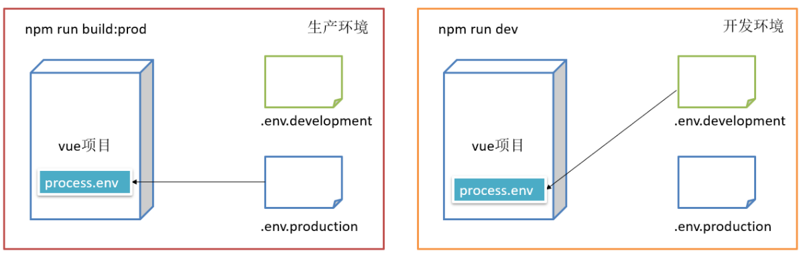


#### 定义环境变量-示例

`key = value`     key表示环境变量的名称   value表示环境变量的值

```bash
# just a flag
ENV = 'development'

# base api
VUE_APP_BASE_API = '/api'
```

请注意，以 `VUE_APP_` 开头的变量将通过 `webpack.DefinePlugin` 嵌入到的代码中，建议以它开头来定义

> 前端代码, 被webpack打包解析, 所以前端想用变量要以VUE_APP_ 开头定义
>
> node环境代码, 可以随便定义变量, 可以在vue.config.js打印

```
VUE_APP_NUM = 2000
```

定义好环境变量之后，项目启动之后，它会自动被集成到process.env这个属性中。我们只需要通过下面的方式使用即可

```js
console.log(process.env.环境变量名)
```

**注意**：修改服务的配置文件，想要生效的话，必须要重新启动服务

更多阅读：[vue-cli 环境与变量](https://cli.vuejs.org/zh/guide/mode-and-env.html#%E7%8E%AF%E5%A2%83%E5%8F%98%E9%87%8F)

### 小结

1. 代码分为哪些环境?

   <details>     
   <summary>答案</summary> 
   <ul>
   <li>开发环境 development</li>
   <li>生产环境 production</li>
   <li>测试环境(预发布环境) staging </li>
   </ul> 
   </details>

2. 如何定义环境变量, 以及如何使用?

   <details>     
   <summary>答案</summary> 
   <ul>
   <li>在.env.xxxx的文件内定义key=value格式变量</li>
   <li>会根据你执行的命令, 加载对应文件内变量挂载到process.env对象上</li>
   <li>在前端代码环境需要以VUE_APP_前缀开头定义变量</li>
   </ul> 
   </details>


## 16.环境变量-配置不同的请求基地址

### 目标

在项目开发的不同阶段，很可能要请求不同的基地址，例如：

在开发阶段，所有 ajax 请求要发到地址 a

在上线之后，所有 ajax 请求要发到地址 b


如何自动切换呢？设置环境变量！

### 讲解

#### 配置

.env.devlopment

```bash
# 开发环境的基础地址
VUE_APP_BASE_API = '/api'
```

.env.production

```bash
# 生产环境的基地址
VUE_APP_BASE_API = 'http://ihrm.itheima.net/api'  
```

#### 配置-相对路径

在vue.config.js中, 设置publicPath, 让打包后index.html引入其他文件的路径, 以此开头

```js
publicPath: './'
```


#### 查看效果

执行 npm run build:prod，生成 dist 目录，分析文件，查看请求地址

==因为后台没开启cors, 报错跨域正常, 知道看到URL请求地址切换了就ok==


### 小结

1. 为什么要配置环境变量, 不同的请求基地址

   <details>     
   <summary>答案</summary> 
   <ul>
   <li>因为开发时, /api开头命中webpack开发服务器, 由服务器代理转发到http://ihrm.itheima.net</li>
   <li>但是打包上线以后, 没有webpack开发服务器转发了, 我们需要让axios请求的基地址直接由/api换成http://ihrm.itheima.net/api</li>
   </ul> 
   </details>


## 今日作业

1. 把逻辑页面 -> 提交的数据到mutations -> 再保存到vuex的state里, (state的getters值又用到逻辑页面) 把这个流程画图
2. 把逻辑页面 -> 提交actions (发起请求) -> ....后面相同的流程图 绘制一下 


 


   
