# Day03-项目_主页模块

## 前置知识

对于白名单的判断，我们需要使用数组的 includes() 方法，检查这个元素在数组中是否存在

```js
// 数组.includes(元素)： 检查这个元素在数组中是否存在
['a','b'].includes('a')  ==> true
['a','b'].includes('c')  ==> false
```


## 1.主页-跳转到主页

### 目标

登录成功之后，跳转进入主页


### 讲解

#### 思路

路由跳转： this.$router.push(地址) - 能返回

路由跳转:	this.$router.replace(地址) - 不能返回

#### 实现

src/views/login/index.vue中, 最后跳转登录页面

路由中配置/路径, 就是Layout布局页面, dashboard是二级路由的首页(欢迎页面)

```diff
handleLogin() {
      this.$refs.loginForm.validate(async(valid) => {
        // 登录校验
        if (valid) {
          this.loading = true
          try {
            const res = await this.loginActions(this.loginForm)
            this.$message.success(res.message)
+            this.$router.replace('/')
          } catch (err) {
            console.error(err)
          }
          this.loading = false
        } else {
          return false // 未通过
        }
      })
    }
```

### 小结

1. API方法里网络请求是异步的, 为何路由能在, 网络请求成功以后跳转的呢?

   <details>     
   <summary>答案</summary> 
   <ul>
   <li>因为我们使用了await, 会暂停async函数内代码往下执行, 等待异步结果回来继续向下执行跳转</li>
   </ul> 
   </details>


## 2.主页-路由导航守卫和 permission.js

### 目标

复习导航守卫, 和认识permission.js文件

### 讲解

#### 导航守卫

1. 什么是导航守卫

   导航守卫就是路由跳转过程中的一些钩子函数，在函数中通过跳转或取消的方式守卫导航

   

2. 全局导航守卫分为几种

   - 前置导航守卫 router.beforeEach
   - 后置导航守卫 router.afterEach
   
   例如: 
   
   ```js
   const router = new VueRouter({ ... })
   
   router.beforeEach((to, from, next) => {
     // to：即将要进入的目标
     // from：当前导航正要离开的路由
     // next：next 是一个函数，通常是指放行，next() 直接放行 ，next(路径) 跳转到某一个页面
   })
   
   router.afterEach((to, from) => {
     // ...
   })
   ```
   
   

#### permission

`permission.js` 是控制页面登录权限的文件，

 主要使用 beforeEach 路由前置守卫 根据 Token 存在与否，控制页面间的跳转，回顾下 permission 最原始的代码(==不复制==)

```js
import router from './router'
import NProgress from 'nprogress' // progress bar
import 'nprogress/nprogress.css' // progress bar style

NProgress.configure({ showSpinner: false }) // NProgress Configuration

const whiteList = ['/login'] // no redirect whitelist

// 前置导航守卫
router.beforeEach(async(to, from, next) => {})

// 后置导航守卫
router.afterEach(() => {
  // finish progress bar
  NProgress.done()
})

```


### 小结

1. 什么是导航守卫?

   <details>     
   <summary>答案</summary> 
   <ul>
   <li>导航守卫就是路由跳转过程中的一些钩子函数，在函数中通过跳转或取消的方式守卫导航</li>
   </ul> 
   </details>

2. 路由**全局**导航守卫有哪2种?

   <details>     
   <summary>答案</summary> 
   <ul>
   <li>全局前置导航守卫-router.beforeEach()</li>
   <li>全局后置导航守卫-router.afterEach()</li>
   </ul> 
   </details>

3. permission.js 主要的作用?

   <details>     
   <summary>答案</summary> 
   <ul>
   <li>控制页面权限的文件</li>
   </ul> 
   </details>

4. 为何不写在router/index.js文件里?

   <details>     
   <summary>答案</summary> 
   <ul>
   <li>那里主要是生成路由对象的相关代码, 包括路由规则</li>
   <li>为了代码分层, 方便管理</li>
   </ul> 
   </details>


## 3.主页-权限拦截流程

### 目标

了解使用导航守卫进行权限拦截的流程

### 讲解

#### 分析

用户访问页面，触发导航守卫钩子函数，然后按照如下流程进行解析。

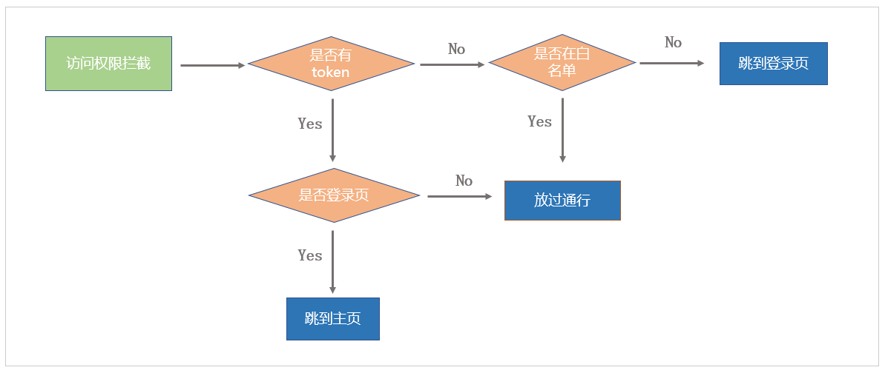

白名单：那些不需要 token 就可以直接访问的页面，那么哪些页面不需要 token 就能够直接访问呢 ？

1.  login 登录页面
2.  404 页面

#### 实现

在基础框架阶段，我们知道 `src/permission.js`是专门进行路由权限处理，因此我们在这个文件中进行权限拦截的处理

`src/permission.js`  详细代码：

```js
import router from './router'
import store from './store'

// 白名单数组
const whiteList = ['/login', '/404']

// 前置路由守卫
router.beforeEach((to, from, next) => {
  // 获取到 token
  const token = store.getters.token

  // 如果存在 token
  if (token) {
    if (to.path === '/login') {
      // 如果存在 token，访问的是登录页面，直接跳转到主页
      next('/')
    } else {
      // 如果存在 token，访问的是其他页面，直接放行
      next()
    }
  } else {
    // 如果不存在 token，访问的是白名单内容，直接放行
    if (whiteList.includes(to.path)) {
      next()
    } else {
      // 没有 token，且不是白名单页面，跳转到登录页面
      next('/login')
    }
  }
})
```


### 小结

1. 请用两句话, 总结下, 上面路由守卫的判断的目的?

   <details>     
   <summary>答案</summary> 
   <ul>
   <li>登录状态下有token, 如果用户去登录页, 强制回到首页</li>
   <li>非登录状态下无token, 去白名单页面, 放行, 其他页面需要登录才能查看</li>
   </ul> 
   </details>

2. includes是谁的方法, 有什么作用?

   <details>     
   <summary>答案</summary> 
   <ul>
   <li>数组的方法, 检查这个元素在数组中是否存在, 存在返回true</li>
   </ul> 
   </details>
   
   

## 4.主页-路由跳转进度条

### 目标

在路由跳转时，给页面的顶部一些进度条提示

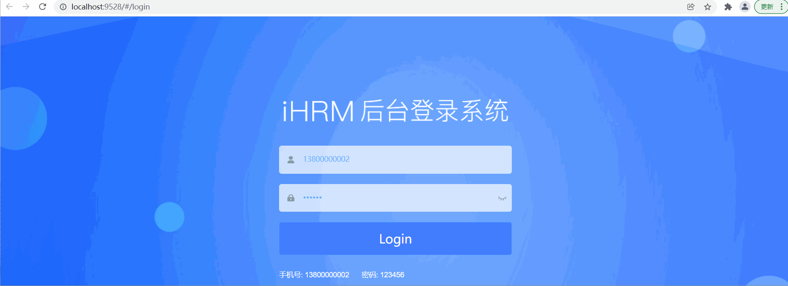

### 讲解

#### 思路

插件：NProgress   https://github.com/rstacruz/nprogress

注意：在这个项目中已经使用过了 NProgress (下载过了)，我们只需要参考来写就行了

#### 实现

```js
// 导入进度条插件
import NProgress from 'nprogress'
// 导入进度条样式
import 'nprogress/nprogress.css'

// 前置路由守卫
router.beforeEach((to, from, next) => {
  // 显示进度条效果
  NProgress.start()

  // 省略其它 ... 
})

// 后置路由守卫
router.afterEach((to, from) => {
  // 隐藏进度条效果
  NProgress.done()
})
```

#### 注意

在全局路由守卫中可能会走next('/重定向地址'), 导致路由跳转中断, 重新进行路由跳转和守卫重新执行, 所以在重定向位置, 需要把进度条关闭, 否则进度条会一直存在

落地代码

```js
// 前置路由守卫
router.beforeEach((to, from, next) => {
  NProgress.start()
  // 获取到 token
  const token = store.getters.token

  // 如果存在 token
  if (token) {
    if (to.path === '/login') {
      // 如果存在 token，访问的是登录页面，直接跳转到主页
      next('/')
      NProgress.done()
    } else {
      // 如果存在 token，访问的是其他页面，直接放行
      next()
    }
  } else {
    // 如果不存在 token，访问的是白名单内容，直接放行
    if (whiteList.includes(to.path)) {
      next()
    } else {
      // 没有 token，且不是白名单页面，跳转到登录页面
      next('/login')
      NProgress.done()
    }
  }
})

// 后置路由守卫
router.afterEach((to, from) => {
  // 隐藏进度条效果
  NProgress.done()
})
```


### 小结

1. 全局路由导航守卫钩子有几个?

   <details>     
   <summary>答案</summary> 
   <ul>
   <li>beforeEach, afterEach。在beforeEach中启动进度条，在afterEach中停止进度条</li>
   </ul> 
   </details>


## 5.主页-左侧导航结构与样式

### 目标

按照主页的UI样式修改左侧导航区域结构和样式


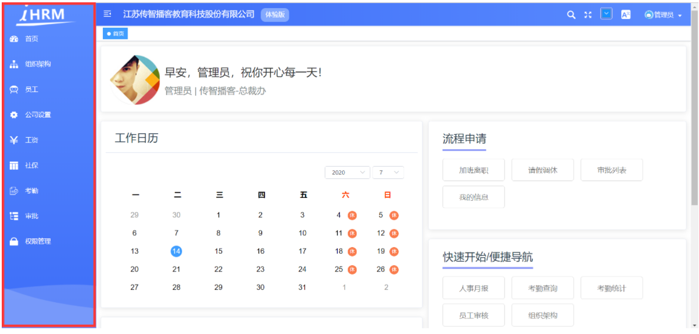


### 讲解

#### 分析

主页的布局架构

​						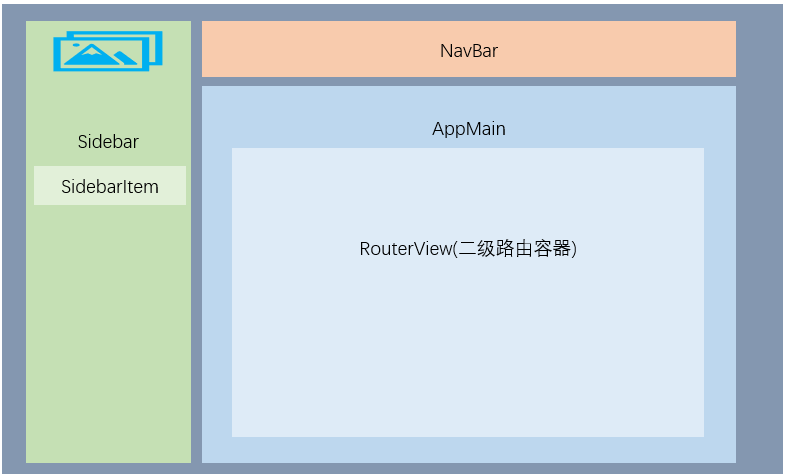

#### 实现

1.  修改侧边栏的背景色，在 `src\styles\sidebar.scss` 中查找类名修改

   ```scss
   .sidebar-container {
     background: -webkit-linear-gradient(bottom, #3d6df8, #5b8cff);
   }
   ```

   

2.  设置左侧导航背景图片，在 `src\styles\sidebar.scss` 中查找类名修改

   - 在scss中，如果我们想要使用**`@`**别名，需要在前面加上一个**`~`**才可以

   ```scss
   .scrollbar-wrapper {
     background: url('~@/assets/common/leftnavBg.png') no-repeat 0 100%;
   }
   ```

   

3.  设置菜单选中颜色，在 `src\styles\sidebar.scss` 中查找类名修改

   - **`注意`**：因为我们后期没有二级菜单，所以这里暂时不用对二级菜单的样式进行控制

   ```scss
   .el-menu {
     border: none;
     height: 100%;
     width: 100% !important;
   
     a {
       li {
         .svg-icon {
           color: #fff;
           font-size: 18px;
           vertical-align: middle;
           .icon {
             color: #fff;
           }
         }
   
         span {
           color: #fff;
         }
   
         &:hover {
           .svg-icon {
             color: #43a7fe;
           }
           
           span {
             color: #43a7fe;
           }
         }
       }
     }
   }
   ```

   

4. 显示左侧logo图片，需要先开启是否显示 logo，在 `src/setttings.js` 中将 sidebarLogo 属性设置为 true

   ```js
   module.exports = {
   
     title: '人力资源管理平台',
   
     /**
      * @type {boolean} true | false
      * @description Whether fix the header
      */
     fixedHeader: false,
   
     /**
      * @type {boolean} true | false
      * @description Whether show the logo in sidebar
      */
     sidebarLogo: true
   }
   
   ```

   

5.  设置头部图片结构，在 `src/layout/components/Sidebar/Logo.vue` 中进行设置

   ```vue
   <template>
     <div class="sidebar-logo-container" :class="{'collapse':collapse}">
       <transition name="sidebarLogoFade">
         <router-link key="collapse" class="sidebar-logo-link" to="/">
           
         </router-link>
       </transition>
     </div>
   </template>
   ```

   

6.  去除logo的背景色，在`src/layout/components/Sidebar/Logo.vue`中的 style 中，删除 background 项

   ```scss
   .sidebar-logo-container {
     position: relative;
     width: 100%;
     height: 50px;
     line-height: 50px;
     // background: #2b2f3a;
     text-align: center;
     overflow: hidden;
   }
   ```

   

7. 设置大图和小图的样式，在`src/layout/components/Sidebar/Logo.vue`中的 style 中进行设置

   ```scss
   // 大图样式
   & .sidebar-logo {
     width: 140px;
     // height: 32px;
     vertical-align: middle;
     margin-right: 12px;
   }
   
   ```
   
   ```scss
   // 小图样式
   &.collapse {
       .sidebar-logo {
           margin-right: 0px;
           width: 32px;
           height: 32px;
       }
   }
   ```
   
   


### 小结

1. 如何在现有的标签上进行修改?

   <details>     
   <summary>答案</summary> 
   <ul>
   <li>务必先要把项目跑起来, 看到画面, 进行浏览器上调试</li>
   <li>找到对应标签关键字/样式名, 在vscode用放大镜搜索找到修改</li>
   </ul> 
   </details>


## 6.主页-头部左侧-内容结构与样式

### 目标

按照主页的 UI 设计稿修改头部区域内容结构与样式(主要是左边)


### 讲解

1.  进入头部组件文件： `layout/components/Navbar.vue`，主要做两件事情：

   - 添加公司名称
   - 删除 面包屑 的代码

   ```vue
   <div class="app-breadcrumb">
     江苏传智播客教育科技股份有限公司
     <span class="breadBtn">体验版</span>
   </div>
   ```

   > 现在有点歪, 很正常, 还要调整样式

2. 公司名称部分样式

   这个放在.navbar下

   ```scss
   .app-breadcrumb {
     display: inline-block;
     font-size: 18px;
     line-height: 50px;
     margin-left: 10px;
     color: #ffffff;
     cursor: text;
   
     .breadBtn {
       background: #84a9fe;
       font-size: 14px;
       padding: 0 10px;
       display: inline-block;
       height: 30px;
       line-height: 30px;
       border-radius: 10px;
       margin-left: 15px;
     }
   }
   ```

   > 文字颜色是白色, 因为下一步背景图要改变

3. 头部背景渐变色

   ```scss
   .navbar {
     background-image: -webkit-linear-gradient(left, #3d6df8, #5b8cff);
   }
   ```

   

4. 设置汉堡组件 svg 图标为白色

   - **`注意`**这里的图标我们使用了`svg`，设置颜色需要使用svg标签的`fill属性`

   * vue组件样式相关
     * 运行时,选中标签, 看右侧的style里样式被划线划掉了, 优先级不够(权限)
     * /deep/ 选中组件内的选择器, 如果看右侧的style样式类名已经上去了证明已经选中了跟/deep/没啥关系, 如果发现类名写了, 但是没上去, 运行时选择器没有选到组件内类名(/deep/)  /deep/作用: 把scope加的属性选择器加到类名的前面, 选中组件内无属性的类名
     * svg要用fill属性填充图标颜色, 而不能用style影响颜色

   ```vue
   <svg
     :class="{'is-active':isActive}"
     class="hamburger"
     viewBox="0 0 1024 1024"
     xmlns="http://www.w3.org/2000/svg"
     width="64"
     height="64"
     fill="#fff"
   >
   ```

   

### 小结

1. 我们左上角的 汉堡组件作用? 如何修改颜色

   <details>     
   <summary>答案</summary> 
   <ul>
   <li>一个按钮, 可以控制左边导航是否折叠</li>
   <li>它不是字体图标, 而是一个svg标签,用path来描绘, 绘制路径, fill填充路径颜色</li>
   </ul> 
   </details>
   
   


## 7.主页-头部右侧-下拉菜单结构与样式

### 目标

按照主页的 UI 设计稿修改头部下拉菜单区域的结构和样式

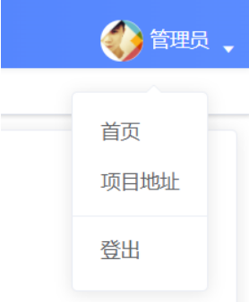


### 讲解

1. 头部下拉菜单区域的结构调整

   

   ```vue
   <div class="right-menu">
     <el-dropdown class="avatar-container" trigger="click">
       <div class="avatar-wrapper">
         
         <span class="name">管理员</span>
         <i class="el-icon-caret-bottom" style="color:#fff" />
       </div>
       <el-dropdown-menu slot="dropdown" class="user-dropdown">
         <router-link to="/">
           <el-dropdown-item>
             首页
           </el-dropdown-item>
         </router-link>
         <a target="_blank" href="https://gitee.com/shuiruohanyu/hrsaas53">
           <el-dropdown-item>
             项目地址
           </el-dropdown-item>
         </a>
         <el-dropdown-item divided @click.native="logout">
           <span style="display:block;">退出登录</span>
         </el-dropdown-item>
       </el-dropdown-menu>
     </el-dropdown>
   </div>
   ```

   

2. 头部下拉菜单区域的样式调整

   ==注意替换的是wrapper, 不是container==

   ```scss
   .avatar-wrapper {
     // margin-top: 5px;
     position: relative;
   
     // 头像
     .user-avatar {
       cursor: pointer;
       width: 30px;
       height: 30px;
       border-radius: 15px;
       vertical-align: middle;
       margin-right: 10px;
     }
   
     // name
     .name {
       color: #fff;
       vertical-align: middle;
       margin-left:5px;
     }
       
     .user-dropdown {
       color: #fff;
     }
   
     // 下拉 icon 图标位置
     .el-icon-caret-bottom {
       cursor: pointer;
       position: absolute;
       right: -20px;
       top: 20px;
       font-size: 12px;
     }
   }
   ```

   

### 小结

1. el-dropdown-menu和el-dropdown-item的关系以及作用?

   <details>     
   <summary>答案</summary> 
   <ul>
   <li>el-dropdown-menu是"整个"下拉列表项</li>
   <li>el-dropdown-item是每个下拉选项</li>
   </ul> 
   </details>


## 8.主页-显示用户名

### 目标

封装获取用户信息的接口，同时创建 actions 方法

### 讲解

####  封装请求接口

在**`src/api/user.js`**中封装获取用户资料的方法==刚才测试的时候已经定义过了==

```js
/**
 * 用户 - 获取用户资料
 * @description: 获取用户资料
 * @param {*}
 * @return {*}
 */
export function getUserProfile() {
  return request({
    url: '/sys/profile',
    method: 'post'
  })
}
```

#### 创建获取用户数据的vuex

`在store/modules/user.js`中添加

#### state设置

虽然, 刚才已经在state定义过name和avatar字段, 但是这里我们决定保存一个用户信息的对象

==跟上, 改的比较多==

```js
const getDefaultState = () => {
  return {
    token: getToken(), // 用户 Token，默认为 ''
    userInfo: {} // 用户信息对象
  }
}
```

#### getters设置

也在store/getters.js定义过获取name和avatar值的属性了

```js
const getters = {
  sidebar: state => state.app.sidebar,
  device: state => state.app.device, // 这2个控制dashboard面板页左侧导航,不要注释
  token: state => state.user.token,
  avatar: state => state.user.avatar,
  name: state => state.user.userInfo.username // 返回用户名
  
}
export default getters
```

#### mutations设置

创建 mutations 方法, 对用户信息 userInfo 进行处理

- 设置用户信息 
- 删除用户信息

```js
const mutations = {
  // ...其他
  // 设置用户名
  SET_USER(state, value) {
    state.userInfo = value
  },
  // 删除用户信息
  REMOVE_USER(state) {
    state.userInfo = {}
  }
}
```

####  actions方法设置

1.  导入封装的请求模块
2.  创建获取用户信息的 action 方法

```js
import { login, getUserProfileAPI } from '@/api/user'

// 异步对数据处理
const actions = {
  // ...其他
  // 获取-用户信息
  async getUserInfoActions({ commit }) {
    const { data: userObj } = await getUserProfileAPI() // 获取用户基本资料对象
    commit('SET_USER', userObj) // 保存到vuex的userInfo对象里
  }
}
```

#### 调用

在permission.js中, 切换路由时, 获取下

如果vuex里没有, 再发起获取数据

==为何不写在dashboard首页去请求呢? 因为用户上来进入别的页面, 我右上角还是需要用户信息, 所以在路由跳转请求==

为何在next()后面, 先让页面跳转, 再发请求, 如果遇到401强制回到登录页, 最后做登录未遂地址, 要让路由跳转完成先, 然后在发请求才能拿到当前路由页面

```diff
// 前置路由守卫
router.beforeEach((to, from, next) => {
  NProgress.start()
  // 获取到 token
  const token = store.getters.token

  // 如果存在 token
  if (token) {
    if (to.path === '/login') {
      // 如果存在 token，访问的是登录页面，直接跳转到主页
      next('/')
      NProgress.done()
    } else {
      // 如果存在 token，访问的是其他页面，直接放行
      next()
+      if (!store.getters.name) { store.dispatch('user/getUserInfoActions') }
    }
  } else {
    // 如果不存在 token，访问的是白名单内容，直接放行
    if (whiteList.includes(to.path)) {
      next()
    } else {
      // 没有 token，且不是白名单页面，跳转到登录页面
      next('/login')
      NProgress.done()
    }
  }
})
```

#### 顶部导航设置名字

`layout/components/Navbar.vue`下设置右侧导航名字

```js
<span class="name">{{ name }}</span>

computed: {
    ...mapGetters(['sidebar', 'avatar', 'name'])
},
```

在页面上看看有没有名字


### 小结

1. 用户名是如何进行管理的?

   <details>     
   <summary>答案</summary> 
   <ul>
   <li>在vuex定义相关变量和mutations和actions</li>
   <li>在路由页面切换时, 判断如果vuex里无值, 就进行获取</li>
   </ul> 
   </details>


## 9.axios-响应拦截器-身份过期

### 目标

当token过期时, 401状态, 自动跳转回登陆页

### 讲解

#### 主页-Token失效处理

token 作为用户的关键令牌信息不是长久有效的，一般都会有一个失效时间，这个失效时间由后端来决定，如果超过失效时间，当前 token 就不能再作为用户标识请求数据了，这时候我们需要做一些额外的失效处理

#### 分析


​					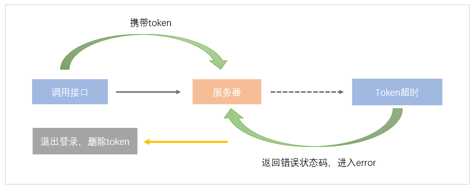


1. 后端： 接收到请求时，检查当前 token 是否失效，如果 token 已失效，则返给前端一个约定好的状态码 **10002**

2. 前端：在响应拦截器的 Error 阶段，分析接口的返回值，如果状态码为10002， 则进行 token 失效操作

   

   ​				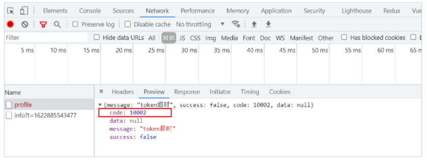


#### 讲解

在`utils/request.js中`, 在axios响应拦截器里, 判断错误状态码401

```js
import router from '@/router'
import { removeToken } from '@/utils/auth'

service.interceptors.response.use(
  response => {
    // ...省略了其他代码
  },
  error => { // http状态码4xx
    Message.error(error.response.data.message)
    if (error.response && error.response.data && error.response.data.code === 10002) {
      store.commit('user/REMOVE_TOKEN')
      store.commit('user/RESET_STATE')
      router.replace('/login')
    }
    return Promise.reject(error)
  }
)
```

### 小结

1. 为何要判断401, 不判断行不行?

   <details>     
   <summary>答案</summary> 
   <ul>
   <li>不行, 因为http状态码4xx, 或者5xx都会进入响应拦截器的第二个函数体里</li>
   <li>所以如果404或者405报错也跳转登录意义不对, 只有401需要跳转回登录页面</li>
   </ul> 
   </details>

2. 为何跳转登录页, 用replace?

   <details>     
   <summary>答案</summary> 
   <ul>
   <li>其实为了防止路由跳转回上一页, 因为退出登录回到登录页面, 你无权利再返回上一页了</li>
   <li>其实返回也是切换url, 想让路由切换上一页的地址, 其实用push也行, 因为路由守卫当中判断无token你是去不了非白名单页面的</li>
   </ul> 
   </details>


## 10.主页-获取用户头像

### 目标

获取用户头像并显示


### 讲解

#### 分析

由于头像的信息是在另外一个单独的接口中，且获取头像的接口的参数还必须依赖用户 id ，所以，我们需要：

1.  新建一个用来获取个人头像的 api
2.  在 actions 中，获取个人信息成功后，取出用户 id，再用用户 id 去获取个人头像，然后将头像数据也保存在 vuex 中

#### 封装接口

在api/user.js中补充一个api

```js
/**
 * 用户 - 获取头像
 * @description: 获取用户头像
 * @param {*} id 用户id
 * @return {*}
 */
export function getUserPhotoAPI(id) {
  return request({
    url: `/sys/user/${id}`
  })
}
```

#### 修改action

在 `store/modules/user.js` 修改 `action` 在获取用户信息时，再发一个请求去获取头像

注意：合并两个对象！

```js
// 获取-用户信息
async getUserInfoActions({ commit }) {
    const { data: userObj } = await getUserProfileAPI() // 获取用户基本资料对象
    const { data: photoObj } = await getUserPhotoAPI(userObj.userId) // 获取用户头像等

    const newObj = { ...userObj, ...photoObj } // 合并一个信息非常全的对象
    commit('SET_USER', newObj) // 保存到vuex的userInfo对象上 -> 一会儿用调试工具查看
}
```

####  验证

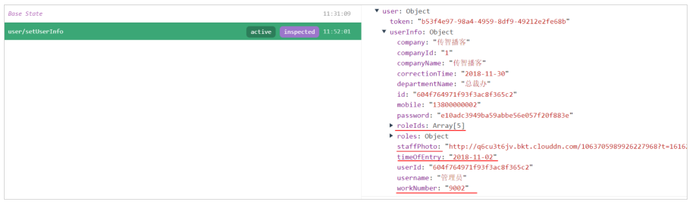


### 小结

1. 后端返回的数据格式是什么?

   <details>     
   <summary>答案</summary> 
   <ul>
   <li>是一个对象, code, message, success, data里装的是真正的数据, 格式统一</li>
   </ul> 
   </details>

2. axios返回的数据格式有几个data, 分别如何处理?

   <details>     
   <summary>答案</summary> 
   <ul>
   <li>有2个data字段嵌套, 第一个data是axios处理的把后台返回的对象装入到data里, 但是在响应拦截器已经.data取出后端返回的对象</li>
   <li>第二个data是后端返回对象上的data字段, 在使用时候, 用结构赋值, 把data的值保存到左边变量</li>
   </ul> 
   </details>


## 11.主页-显示用户头像

### 目标

把用户头像显示到头部导航的右侧上

### 讲解

用户的头像信息在vuex的state叫userInfo的对象里

但是头部使用的是getters里avatar字段的值

`store/getters.js`下, 设置avatar的值提取方式

```js
avatar: state => state.user.userInfo.staffPhoto, // 返回用户头像地址
```

> 这里注意数据是别人传的, 图片又是在第三方云托管, 所以图片可能会消失不见, 正常404

### 小结

1. 图片资源, 有哪2种方式在服务器?

   <details>     
   <summary>答案</summary> 
   <ul>
   <li>方式1: 把图片文件保存在自己的服务器上, 服务器返回图片的完整url使用</li>
   <li>方式2: 图片文件真身保存在第三方服务器存储, 我们自己的后台服务器只保存一个引用的完整的url地址</li>
   </ul> 
   </details>


## 12.主页-用户退出功能

### 目标

实现用户退出功能 

### 讲解

#### 分析 

`弹窗` 询问用户 `是否确认退出`登录：

1.  点击确认退出：
   - 如果有登出接口，就调用（注意：并不是所有的项目中，都有退出接口）
   - 登出接口成功调用之后清空本地用户信息（token、userInfo）
   - 如果需要携带必要参数跳**回到登录页面**准备重新登录操作
2.  点击取消退出，不做任何操作

​											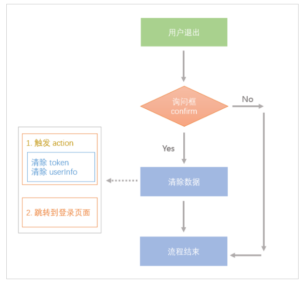

#### 实现

1. 在 `store/modules/user.js` 中创建退出的 actions 方法

   ```js
   const actions = {
     // ...其他
     // 退出登录
     async logOutActions({ commit }) {
       commit('REMOVE_TOKEN')
       commit('RESET_STATE')
     }
   }
   ```

   

2. 在用户点击退出后，弹出询问确认对话框，详见文档：[确认对话框](https://element.eleme.cn/#/zh-CN/component/message-box#que-ren-xiao-xi)

   ``在layout/components/Navbar.vue`

   ```js
   // 退出登录
   async logout() {
       this.$confirm('你确定要离开吗?, 是否继续?', '提示', {
           confirmButtonText: '确定',
           cancelButtonText: '取消',
           type: 'warning'
       }).then(async() => {
           // 使用 dispath 调用退出登录的方法
           // 其实action无论有么有async, 返回的都是一个Promise对象(vuex内部设置)
           // await等待退出流程代码走完
           await this.$store.dispatch('user/logOutActions')
   
           // 跳转到登录页面
           this.$router.replace('/login')
   
           // 退出成功后的提示
           this.$message.success('退出成功!')
       }).catch(() => {
           // 取消退出提示
           this.$message.info('已取消退出')
       })
   }
   ```

   

3. 验证是否退出

   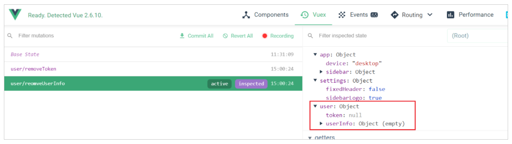

   

### 小结

1. 用户退出登录的业务流程是什么?

   <details>     
   <summary>答案</summary> 
   <ul>
   <li>清除token和用户信息, 强制跳转回到登录页</li>
   <li>路由守卫, 判断无token你是无法回到白名单之外的, 需要身份的页面</li>
   </ul> 
   </details>

2. 为什么退出登录, 无需后端接口?

   <details>     
   <summary>答案</summary> 
   <ul>
   <li>因为我们采用的是前端存储token身份信息, 后端只有代码, 所以后端不保存用户的登录信息</li>
   </ul> 
   </details>


## 13.主页-登录未遂地址-分析

### 目标

熟悉退出登录后，再次登录，返回到退出之前页面的流程

### 讲解

#### 演示

1. 以京东为例，目前我们处在订单列表页面，用户进行退出操作

   

   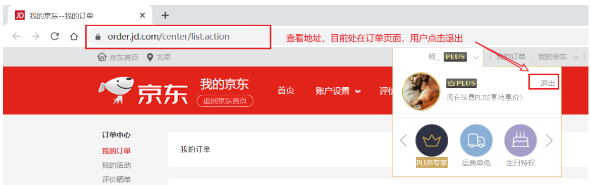

   

   

2. 当退出成功后，我们观察退出后的登录网址

   

   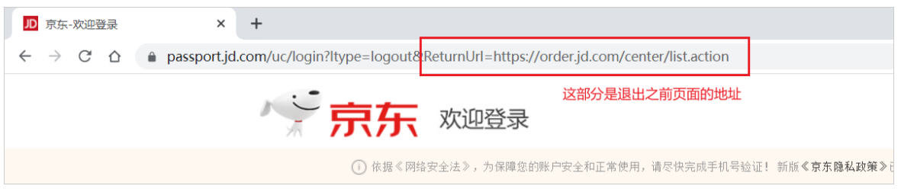

   

3. 当我们再次进行登录，会发现，我们跳转回了退出之前的页面

4. 查看下方的 GIF 动画，感知整个流程

   - 通过查看当前的 URL 地址，以及下方的文字可以知道用户目前在 `我的订单` 页面，
   - 然后`点击退出`，回到登录页面，查看当前的 URL 地址
   - 然后再次扫码登录，发现又回到了 `我的订单` 页面

   

   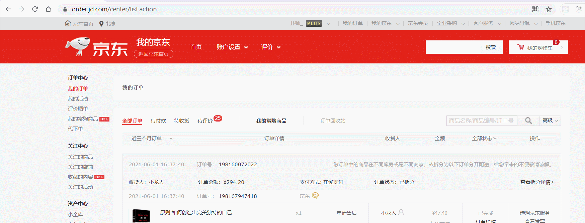


#### 分析

1.  在退出时，拿到当前 `页面路径`以及`查询参数`(例如：查询发票页面)
2.  将获取到的 `路径`以及`查询参数` 拼接到登录的 url 地址后面

### 小结

1. 登录未遂地址的目的和做法是什么?

   <details>     
   <summary>答案</summary> 
   <ul>
   <li>就是把退出登录时, 所在页面的完整路由地址, 传递给登录页面, 路由跳转页面传参</li>
   <li>在登录页面判断是否有未遂地址, 如果有跳转目标路由地址, 否则跳转本来设置的首页</li>
   </ul> 
   </details>


## 14.主页-介绍页面-用于测试

### 目标

现在就一个dashboard看不出效果, 因为登录默认进入的就这个页面, 准备个新页面, 测试后删除即可

### 讲解

1. 新建`views/info/index.vue`文件夹和文件, 随便输入内容

2. 配置info页面的路由, 左侧导航会根据路由数组, 自动生成

   ```js
   {
           path: 'info',
           name: 'Info',
           component: () => import('@/views/info/index'),
           meta: { title: 'Info', icon: 'dashboard' }
   }
   ```

### 小结

1. meta的作用是什么?

   <details>     
   <summary>答案</summary> 
   <ul>
   <li>左侧导航会根据路由数组里的规则, 以及meta值来动态生成左侧导航的</li>
   </ul> 
   </details>


## 15.主页-登录未遂地址-实现

### 目标

在退出时，跳回login时，回传当前的路径

### 讲解

1.  如何获取到当前页面的路径以及查询参数的信息

   - $route.path: 只有路径的信息
   - $route.fullPath：路径+查询参数的信息

2. 约定一个参数，拼接到登录页面后面

   - path： 这个名字是自己约定的，表示当前页面的地址，登录以后需要返回的地址

   ```diff
   // 退出登录
       async logout() {
         this.$confirm('你确定要离开吗?, 是否继续?', '提示', {
           confirmButtonText: '确定',
           cancelButtonText: '取消',
           type: 'warning'
         }).then(async() => {
           // 使用 dispath 调用退出登录的方法
           // 其实action无论有么有async, 返回的都是一个Promise对象(vuex内部设置)
           // await等待退出流程代码走完
           await this.$store.dispatch('user/logOutActions')
   
           // 跳转到登录页面
   +        this.$router.replace(`/login?redirect=${encodeURIComponent(this.$route.fullPath)}`)
   
           // 退出成功后的提示
           this.$message.success('退出成功!')
         }).catch(() => {
           // 取消退出提示
           this.$message.info('已取消退出')
         })
       }
   ```

3. 在登录页面,判断如果url上有参数, 用参数跳转, 否则去首页

   ```diff
   handleLogin() {
         this.$refs.loginForm.validate(async(valid) => {
           // 登录校验
           if (valid) {
             this.loading = true
             try {
               const res = await this.loginActions(this.loginForm)
               this.$message.success(res.message)
   +            this.$router.replace(this.redirect || '/')
             } catch (err) {
               console.error(err)
             }
             this.loading = false
           } else {
             return false // 未通过
           }
         })
       }
   ```

4. 在401, request.js中响应拦截器, 被迫退出登录时, 也要携带未遂地址

   ```diff
   error => {
       Message.error(error.response.data.message)
       if (error.response && error.response.data && error.response.data.code === 10002) {
         store.commit('user/REMOVE_TOKEN')
         store.commit('user/RESET_STATE')
   +      router.replace(`/login?redirect=${encodeURIComponent(router.currentRoute.fullPath)}`)
       }
       return Promise.reject(error)
     }
   ```
   
5. 测试完成后, ==把info页面文件和路由配置删除==

==encodeURIComponent把URL上的&符号编码成URL编码, 在url?传递参数能够正确传递==

### 小结

1. 登录未遂地址思路是?

   <details>     
   <summary>答案</summary> 
   <ul>
   <li>在退出登录的时候, 和401的强制退出登录时, 都清除本地token和vuex的token, 然后携带当前页面地址到登录页</li>
   <li>在登录时, 判断如果有参数就跳转path对应路径, 否则跳转首页</li>
   </ul> 
   </details>


