# Day04-路由页面_组织架构

## 前置知识-背单词

| 单词        | 含义         | 音标           |
| ----------- | ------------ | -------------- |
| approvals   | 审批         | [əˈpruvəlz]    |
| attendances | 考勤         | [əˈtɛndənsɪz]  |
| dashboard   | 首页(仪表板) | [ˈdæʃbɔːrd]    |
| departments | 组织架构     | [dɪˈpɑrtmənts] |
| employees   | 员工         | [ɛmˈplɔɪiz]    |
| permission  | 权限管理     | [pərˈmɪʃn]     |
| salarys     | 工资         | [ˈsæləri]      |
| setting     | 角色设置     | [ˈsetɪŋ]       |
| social      | 社保         | [ˈsoʊʃl]       |


## 01.路由页面-静态和动态路由表

### 目标

理解静态路由和动态路由的区别

掌握动态结合静态的路由管理方式

### 讲解

#### 背景

在当前项目中，我们要实现的最终效果是：不同用户登陆进来时，显示出来的菜单功能是不同的

#### 分析

- 静态路由表：不需要做权限控制的路由，每个用户都可以正常访问。

- 动态路由表：需要做权限控制的路由，用户如果权限不一致访问到的路由也不一样。

  

​				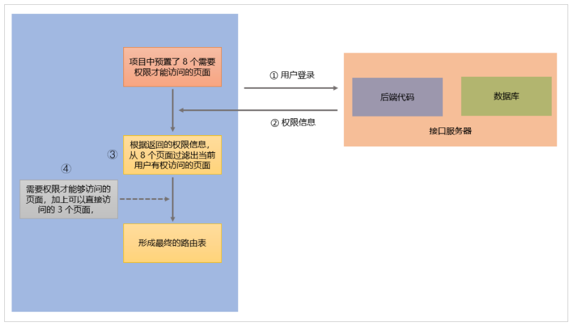


#### 工作原理

用户登录之后，根据他携带的功能不同


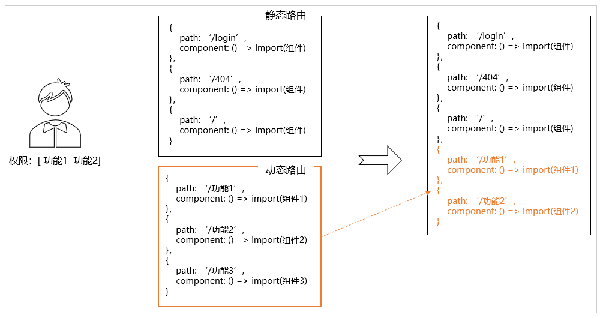


#### 拆分静态和动态路由表

进入`router/index.js`文件，做两处修改：

1. 补充一个动态路由表asyncRoutes
2. 将动态和静态合并在一起

```js
// 省略其他...
// 动态路由表，项目中不同的用户可以访问不同的功能
export const asyncRoutes = [
  // 先空着这里，后面来补充功能
]

// 静态路由表，项目中每个用户都可以访问的功能
export const constantRoutes = [
  // 省略....
]

const createRouter = () => new Router({
  // 控制路由滚动行为  滚动到顶部
  scrollBehavior: () => ({ y: 0 }),
  // 组合到一起组成路由表
  routes: [...constantRoutes, ...asyncRoutes]
})
```

==这里注意, 如果把动态路由规则对象的数组, 放到后面, 静态路由的path:*会在中间, 所以如果你在动态路由页面退出登录, 重新进入的时候, 按照数组里匹配规则, 会先匹配path:星号, 导致404, 可以考虑先把动态路由规则数组放到前面==

### 小结

1. 静态和动态的路由数组, 将来有什么区别?

   <details>     
   <summary>答案</summary> 
   <ul>
   <li>静态的写固定, 任何人都使用的相同的, 不变的路由配置</li>
   <li>动态的数组空着, 后续会根据用户的身份对应权限信息, 动态往里生成加入</li>
   </ul> 
   </details>


## 02.路由页面-页面组件和路由 

> 注意：静态路由我们已经具备了，接下来就生成一下动态路由，为了方便将来做权限控制，我们先暂时把所有的动态路由都当成静态路由一样，全部给它显示出来，后面我们会继续完成权限控制

### 目标

创建人资项目的需要的路由模块（包含路由定义和对应的组件生成）

### 讲解

#### 创建页面模块

接下来，我们可以将人力资源需要完成的8个模块功能，快速搭建相应的页面和路由

```bash
├── dashboard           # 首页
├── login               # 登录
├── 404                 # 404
├── departments         # 组织架构
├── employees           # 员工
├── setting             # 角色设置
├── salarys             # 工资
├── social              # 社保
├── attendances         # 考勤
├── approvals           # 审批
├── permission          # 权限管理
```

快速创建文件夹

* 方式1: 可以使用一下命令进行文件夹的快速创建, 注意==在views文件夹下打开终端==

* 方式2: 集成终端, 一定使用这个, 才能正确使用mkdir命令

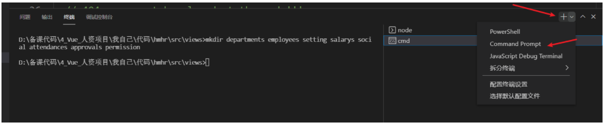

执行如下命令

```bash
# 快速创建文件夹
# 使用 Git bash here 这个工具进行文件夹创建
mkdir departments employees setting salarys social attendances approvals permission
```

每个模块的内容，可以先按照标准的模板进行创建，如下：

```vue
<template>
  <div class="dashboard-container">
    <div class="app-container">
      <h2>考勤</h2>
    </div>
  </div>
</template>

<script>
export default {}
</script>

<style lang="scss" scoped></style>

```

==注意==：根元素我们以`模块名称-container`作为类名，子元素以`app-contaienr`作为通用布局类名，这样我们的每个业务模块的首页都会有一致的页面结构


#### 设置路由

由于涉及到的模块众多，我们先以其中的**员工管理**模块为例，进行路由设置，然后再去类似写其它的页面。

下面向asyncRoutes中补充员工管理这个路由配置，如下：

```js
export const asyncRoutes = [
  {
    path: '/approvals',
    name: 'Approvals',
    component: () => import('@/views/approvals'),
    meta: { title: '审批' }
  }
]
```

通过访问我们发现，虽然可以正常渲染组件，但是项目的整体架子没有了。原因很简单：项目的整体架子是由layout及相关组件完成的，而上面的写法中，并没有载入


#### 嵌套路由

经过上边的分析，要想显示员工管理页面的内容的同时 还能看到layout组件，则可以将它设置为layout的二级路由。

```js
{
    path: '/approvals', // 审批
    component: Layout,
    children: [
      {
        path: '',
        name: 'Approvals',
        component: () => import('@/views/approvals'),
        meta: { title: '审批' }
      }
    ]
  }
```

我们模仿原来首页的写法，实现了Layout架子的渲染，并且我们把二级路由的path选项置空，作为默认渲染路由。


#### 其他同理

可以直接复制

```js
// 动态路由规则
export const asyncRouteArr = [
  {
    path: '/approvals', // 审批
    component: Layout,
    children: [
      {
        path: '',
        name: 'Approvals',
        component: () => import('@/views/approvals'),
        meta: { title: '审批' }
      }
    ]
  },
  {
    path: '/attendances', // 考勤
    component: Layout,
    children: [
      {
        path: '',
        name: 'Attendances',
        component: () => import('@/views/attendances'),
        meta: { title: '考勤' }
      }
    ]
  },
  {
    path: '/departments', // 组织架构
    component: Layout,
    children: [
      {
        path: '',
        name: 'Departments',
        component: () => import('@/views/departments'),
        meta: { title: '组织架构' }
      }
    ]
  },
  {
    path: '/employees', // 员工
    component: Layout,
    children: [
      {
        path: '',
        name: 'Employees',
        component: () => import('@/views/employees'),
        meta: { title: '员工' }
      }
    ]
  },
  {
    path: '/permission', // 权限
    component: Layout,
    children: [
      {
        path: '',
        name: 'Permission',
        component: () => import('@/views/permission'),
        meta: { title: '权限' }
      }
    ]
  },
  {
    path: '/salarys', // 薪资
    component: Layout,
    children: [
      {
        path: '',
        name: 'Salarys',
        component: () => import('@/views/salarys'),
        meta: { title: '薪资' }
      }
    ]
  },
  {
    path: '/setting', // 角色设置
    component: Layout,
    children: [
      {
        path: '',
        name: 'Setting',
        component: () => import('@/views/setting'),
        meta: { title: '角色设置' }
      }
    ]
  },
  {
    path: '/social', // 社保
    component: Layout,
    children: [
      {
        path: '',
        name: 'Social',
        component: () => import('@/views/social'),
        meta: { title: '社保' }
      }
    ]
  }
]
```

#### 效果

最终我们形成了如下图所示左侧所示菜单，这个效果与之前的效果是一致的。

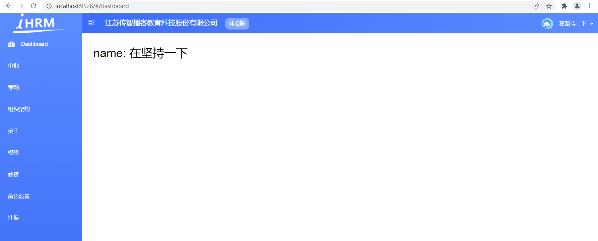


### 小结

1. 为何我们这次二级路由, 都要独立设置Layout和路径, 不写在Layout下的二级路由里?

   <details>     
   <summary>答案</summary> 
   <ul>
   <li>因为左侧导航是根据路由数组, 第一层对象来生成的, 所以只能把每个路径都对应Layout</li>
   <li>然后再把Layout下设置成它的二级路由页面</li>
   </ul> 
   </details>


## 03.路由页面-模块化管理动态路由

### 目标

对router.js路由表中的动态路由进行物理目录拆分，实现真正的**模块化**管理

### 讲解

#### 问题

虽然我们已经掌握了定义动态路由的方式，直接继续往`asyncRoutes` 表里继续添加定义就可以实现，但是可以想象到：如果功能越来越复杂，可能要动态管理的路由数量会很多，那我们的`router/index.js`文件会变的非常大，不好维护。

为了解决这个问题，我们对动态的路由进行物理目录拆分。


#### 思路

把每一个路由配置单独写在一个文件中，然后再统一导入使用

#### 创建路由文件

根据以上的标准建立好对应页面之后，接下来建立每个模块的路由规则

路由模块目录结构

```bash
├── router               # 路由目录
 ├── index.js            # 路由主文件
 ├── modules             # 模块目录
  ├── departments.js     # 组织架构
  ├── employees.js       # 员工 
  ├── setting.js         # 公司设置
  ├── salarys.js         # 工资
  ├── social.js          # 社保
  ├── attendances.js     # 考勤
  ├── approvals.js       # 审批
  ├── permission.js      # 权限管理
```

打开终端, 快速创建文件命令 

==注意直接复制所有命令到终端执行, 最后一条可能需要按下回车==

```bash
# 创建路由文件
echo >departments.js
echo >employees.js
echo >setting.js
echo >salarys.js
echo >social.js
echo >attendances.js
echo >approvals.js
echo >permission.js


```


#### 文件内容

以`router/modules/approvals.js`为例，它的代码是：

```js
import Layout from '@/layout'

// Layout组件中包含
export default {
  path: '/approvals', // 路径
  component: Layout, // 组件
  children: [{
    path: '', // 这里当二级路由的path什么都不写的时候 表示当前路由为默认路由直接渲染对应组件
    name: 'Approvals', // 给路由规则加一个name
    component: () => import('@/views/approvals'),
    // 路由元信息  其实就是存储数据的对象 我们可以在这里放置一些信息
    meta: { title: '审批' }
  }]
}

```

注意上边的导入 layout 和 默认导出, 其他的文件直接照此从路由router/index.js里复制过来

#### router/index.js

```js
import employeesRouter from './modules/employees'
const asyncRoutes = [
  employeesRouter
]

const createRouter = () => new Router({
  scrollBehavior: () => ({ y: 0 }), // 管理滚动行为 如果出现滚动 切换就让 让页面回到顶部
  routes: [...constantRoutes, ...asyncRoutes] // 临时合并所有的路由
})
```

最终完成的代码，如下：

```js
// 引入多个动态路由模块
import approvalsRouter from './modules/approvals'
import departmentsRouter from './modules/departments'
import employeesRouter from './modules/employees'
import permissionRouter from './modules/permission'
import attendancesRouter from './modules/attendances'
import salarysRouter from './modules/salarys'
import settingRouter from './modules/setting'
import socialRouter from './modules/social'

// 省略其它...

// 组合动态路由模块
export const asyncRoutes = [
  approvalsRouter,
  departmentsRouter,
  employeesRouter,
  permissionRouter,
  attendancesRouter,
  salarysRouter,
  settingRouter,
  socialRouter
]
const createRouter = () => new Router({
  scrollBehavior: () => ({ y: 0 }), // 管理滚动行为 如果出现滚动 切换就让 让页面回到顶部
  routes: [...constantRoutes, ...asyncRoutes] // 临时合并所有的路由
})
```

本阶段只做组织架构, 角色设置, 员工, 权限4个页面,  调整下先后顺序

```js
// 组合动态路由模块
export const asyncRoutes = [
  departmentsRouter,
  settingRouter,
  employeesRouter,
  permissionRouter,
  approvalsRouter,
  attendancesRouter,
  salarysRouter,
  socialRouter
]
```

### 小结

1. 为什么我们要把对象, 分散的modules下的各个js文件中去呢?

   <details>     
   <summary>答案</summary> 
   <ul>
   <li>将路由拆开到不同的文件中，这样可以方便我们后期的维护</li>
   <li>而且名字要和路由页面名字对应, 好查找</li>
   </ul> 
   </details>
   
   

## 04.路由页面-左侧菜单自动生成的逻辑

### 目标

理解左侧导航菜单是如何生成的

### 讲解

只要我们配置好了路由表，左侧的菜单就会自动生成，这是怎么回事？

#### 问题 1：

> 为什么路由表里添加了新路由就会显示到左侧 ？

秘诀在`layout/components/SideBar/index.vue` 文件中，下面摘录核心代码如下：

==sidebar是自定义的==

```html
<template>
  <sidebar-item 
     v-for="route in routes" 
     :key="route.path" 
     :item="route" 
     :base-path="route.path" 
  />
</template>

<script>
  export default {
    computed: {
      routes() {
         // this.$router.options.routes可以拿到路由配置时，设置的路由表数据
         return this.$router.options.routes
      }
    }
  }
</script>
```

通过分析源码我们得知

1.  `this.$router.options.routes` 可以拿到完整的路由表数据
2.  项目左侧的菜单时根据完整的路由表遍历出来的

#### 问题 2：

>  为什么菜单中的title和图标从哪里来？

负责菜单标题渲染的是 meta 属性中的 title 属性

负责图标渲染的是 meta 中的 icon 属性


#### 问题 3：

> 为什么404/login路由没有显示到左侧菜单中？

原因: 在定义路由时， 它们有一个属性：hidden: true

```js
{
  path: '/login',
  component: () => import('@/views/login/index'),
  hidden: true
},

{
  path: '/404',
  component: () => import('@/views/404'),
  hidden: true
},
```

在 `src\layout\components\Sidebar\SidebarItem.vue` 组件中判断 hidden 属性，如果是 hidden 是 true 则不进行渲染

```vue
<template>
  <div v-if="!item.hidden">
    <!-- 其他代码略 -->
  </div>
</template>
```


### 小结

1. 左侧导航是如何生成的?

   <details>     
   <summary>答案</summary> 
   <ul>
   <li>左侧导航是利用路由规则数组, 遍历数组每个路由对象生成选项</li>
   </ul> 
   </details>

2. 路由对象里hidden属性作用是?

   <details>     
   <summary>答案</summary> 
   <ul>
   <li>路由对象里hidden决定是否渲染此路由对应左侧导航, 为true隐藏, 取反是为了让它为false不渲染左侧导航</li>
   </ul> 
   </details>

3. 路由对象里meta中title和icon作用是?

   <details>     
   <summary>答案</summary> 
   <ul>
   <li>路由对象里的meta中的title和icon负责设置左侧导航的标题和图标</li>
   </ul> 
   </details>


## 05.路由页面-设置菜单图标

### 目标

1. 掌握 route 对象中的 meta 的作用
2.  能给每个菜单配置前面菜单图标

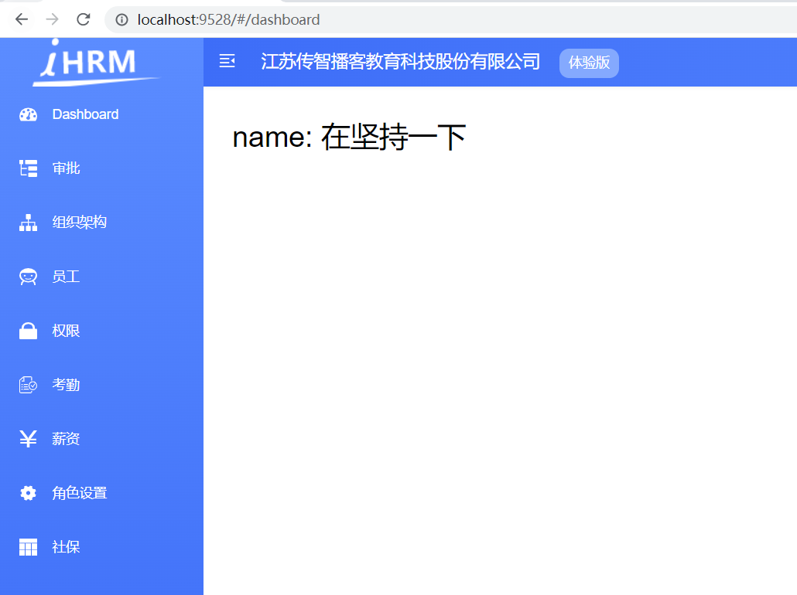

### 讲解

#### 分析项目中配置icon方法

 在本项目中，菜单图标已经配置完成了，具体在`Layout/SideBar/SideBarItem.vue`文件中：

```vue
<app-link v-if="onlyOneChild.meta" :to="resolvePath(onlyOneChild.path)">
  <el-menu-item :index="resolvePath(onlyOneChild.path)" :class="{'submenu-title-noDropdown':!isNest}">
    <item :icon="onlyOneChild.meta.icon||(item.meta&&item.meta.icon)" :title="onlyOneChild.meta.title" />
  </el-menu-item>
</app-link>
```


上面的代码中 onlyOneChild 就是当前路由中的子路由对象， 给 item 组件传入了两个属性:  icon 和 title

1.  左侧菜单的文字读取的是 meta 属性的 title 属性
2.  左侧菜单的图标读取的是 meta 属性的 icon 属性，meta 的 icon 属性名匹配`src/icons/svg`目录下的svg图标名称即可显示图标

#### 实现

1. 准备 icon 图标，将 `项目资料/菜单svg` 该目录下的所有svg 替换到**`src/icons/svg`**目录下

   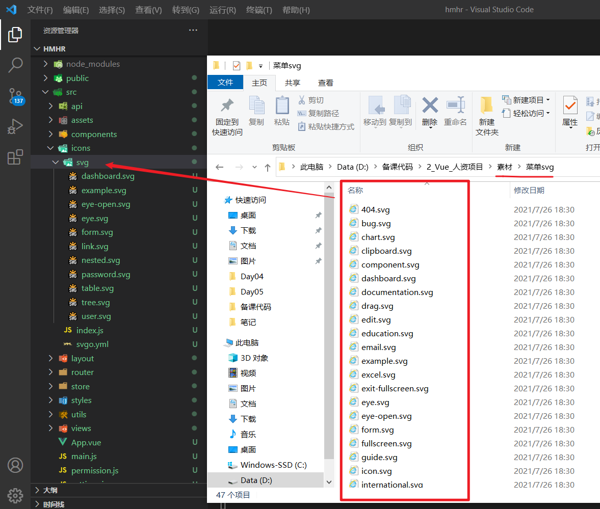

2. 修改菜单中的 icon 名字，在 `src/router/modules` 下的各个文件中，修改路由设置中的 icon 的属性值

   ```js
   import Layout from '@/layout'
   
   // Layout组件中包含
   export default {
     path: '/approvals', // 路径
     component: Layout, // 组件
     children: [{
       path: '', // 这里当二级路由的path什么都不写的时候 表示当前路由为默认路由直接渲染对应组件
       name: 'Approvals', // 给路由规则加一个name
       component: () => import('@/views/approvals'),
       // 路由元信息  其实就是存储数据的对象 我们可以在这里放置一些信息
       meta: { title: '审批', icon: 'tree-table' }
     }]
   }
   
   ```

   

3. 具体的每个icon名对应的图标效果可参考[线上地址](https://panjiachen.github.io/vue-element-admin/#/icon/index)。 

   项目中使用的图标这里有单独列出来，如下：各个模块对应的标题及icon名

   ```bash
       页面                  icon名
   1. dashboard    主页        dashboard
   2. approvals    审批        tree-table
   3. attendances  考勤        skill
   4. departments  组织架构     tree    
   5. employees    员工        people
   6. permission   权限        lock
   7. salarys      工资        money
   8. settings     公司设置     setting
   9. social       社保        table
   ```

   

### 小结

1. 请梳理左侧导航相关的组成文件, 每个文件的作用?

   <details>     
   <summary>答案</summary> 
   <ul>
   <li>layout/index.vue是布局框, 左侧组件sidebar自定义的</li>
   <li>slidebar/index.vue是左侧组件入口</li>
   <li>Logo.vue是上面的logo组件</li>
   <li>SidebarItem.vue是每行的导航项目</li>
   <li>Link.vue在a标签和router-link标签自动区分, 决定是内部路由还是外部链接跳转</li>
   <li>包裹Item.vue, 才是带图标和标题的左侧导航</li>
   </ul> 
   </details>
   
   


## 06.路由页面-设置高亮当前菜单项

### 目标

当左侧的某一菜单处于选中状态时，对它高亮显示

### 讲解

#### 分析

当某个菜单处于选中状态时，el-menu自动会有一个特殊的类`.is-active`，所以我们补充一个css类就可以了。


#### 操作

在 `src\styles\sidebar.scss`文件中， 在el-menu下添加一个is-active类

这里已经提前在variables.scss准备了, `$menuText` 和 `$menuActiveText` 样式两个特殊的颜色

==在styles/sidebar.scss中67行左侧, 最好放到a样式下面==

```scss
.el-menu {
  // 省略其他
    
  .is-active {
    background-color: $menuText !important;
      
    span{
      color: $menuActiveText !important;
    }
      
    .svg-icon{
      color: $menuActiveText !important;
    }
  }
}
```

#### 效果

点击某项, 激活高亮效果持久留在原地(看左侧组织架构)

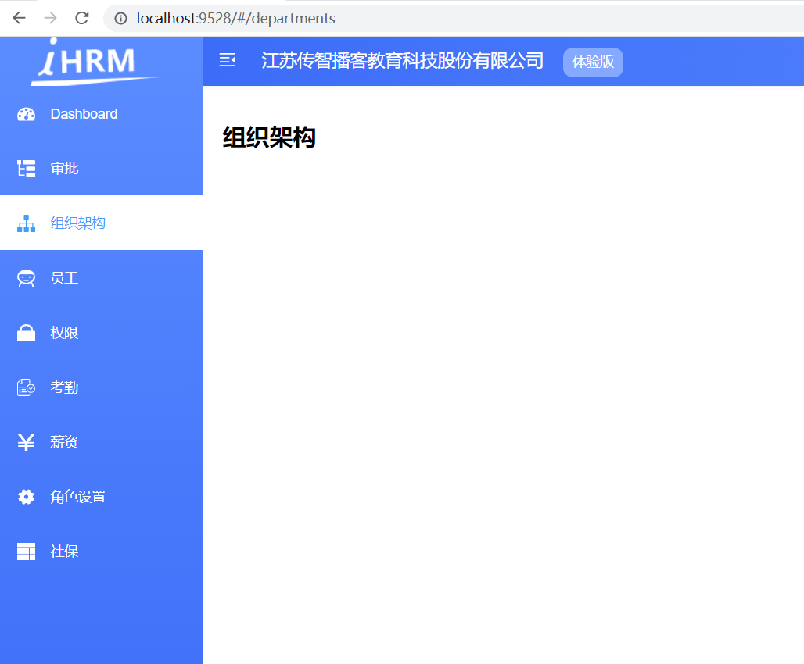

#### 提示

如果你想格式化scss里的样式代码, vscode会提示你安装scss format的插件, 安装即可啦


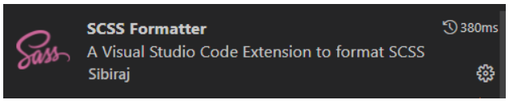


### 小结

1. 基于el-menu进行的封装, 它自带激活类名,我们只需要针对, 对应类名设置具体样式即可


## 07.路由页面-动态设置标题

### 目标

在进入不同的页面时，网页显示不同的标题


​												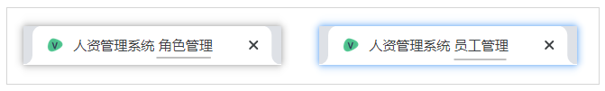

### 讲解

#### 分析

在不同页面中独立设置标题，把标题信息保存在 meta 中

在路由跳转时：在路由前置守卫中，获取 title，并设置

#### 难点

如何设置页面标题？ 

```js
document.title = '标题内容'
```

#### 代码

在`src/permission.js`中

1. 引入 工具方法getPageTitle

```js
import getPageTitle from '@/utils/get-page-title'
```

2. 等待路由页面跳转完成后, 设置最后一个to的元信息meta里的title标题


```js
// 后置路由守卫
router.afterEach((to, from) => {
  document.title = getPageTitle(to.meta.title)
  // 隐藏进度条效果
  NProgress.done()
})
```

#### 调整

> 发现效果不对, 进入getPageTitle中发现, 顺腾摸瓜, 值怎么来的

1. src/settings.js中设置title, 修改基本的全局title

   ```js
   title: '人力资源管理系统',
   ```

2. 调整顺序, 我们想让全局title在前面

   ```js
   import defaultSettings from '@/settings'
   
   const title = defaultSettings.title || 'Vue Admin Template'
   
   export default function getPageTitle(pageTitle) {
     if (pageTitle) {
       // return `${pageTitle} - ${title}` // 原来的
       return `${title} - ${pageTitle}`
     }
     return `${title}`
   }
   
   ```

### 小结

1. 如何设置浏览器标签栏上的文字?

   <details>     
   <summary>答案</summary> 
   <ul>
   <li>document.title = 字符串</li>
   </ul> 
   </details>

## 08.组织架构-整体卡片布局

### 目标

实现组织架构区域的**整体**结构


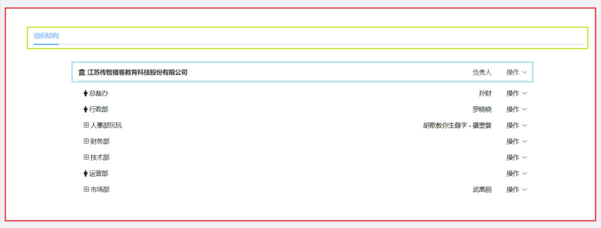


### 讲解

#### 分析

整体区域的绘制(红色)： [el-card 卡片组件](https://element.eleme.cn/#/zh-CN/component/card)


#### 实现

1. 在 `src\views\departments\index.vue` 中进行整体结构的搭建

   - ==直接复制, 这个框基础上写, 样式类名已经准备好==

     ```vue
     <template>
       <div class="departments-container">
         <div class="app-container">
           
         </div>
       </div>
     </template>
     
     <script>
     export default {
       name: 'Departments'
     }
     </script>
     
     <style lang="scss" scoped>
     .box-card {
       padding: 10px 30px;
     }
     
     .tab-pane {
       padding: 20px 80px;
     
       .company {
         margin-left: 12px;
         font-weight: bold;
         font-size: 14px;
       }
     
       .department-header {
         height: 50px;
         display: flex;
         align-items: center;
         border-bottom: 1px solid #ccc;
       }
     }
     </style>
     
     ```

     

   - 首先使用 el-card 卡片组件 完成整体区域绘制, 讲解和读卡片布局

     ```vue
     <template>
       <div class="departments-container">
         <div class="app-container">
           <!-- el-card 卡片布局(分为头和体2部分)
             第一个子标签就是头(需要设置slot="header"-插槽)
             知识点: vue2.6之前写具名插槽的写法slot="具名插槽名字" 之后v-slot:header, #header
             第二个子标签部分就是身体 -->
           <el-card class="box-card">
             <div slot="header" class="clearfix">
               <span>卡片名称</span>
               <el-button
                 style="float: right; padding: 3px 0"
                 type="text"
               >操作按钮</el-button>
             </div>
             <div v-for="o in 4" :key="o" class="text item">
               {{ "列表内容 " + o }}
             </div>
           </el-card>
         </div>
       </div>
     </template>
     ```

   

   * 然后把`el-card`内的东西删除, 留下框, 最终落地代码

     ```vue
     <template>
       <div class="departments-container">
         <div class="app-container">
           <!-- 卡片组件(分为头部和身体) -->
           <el-card class="box-card">
             
           </el-card>
         </div>
       </div>
     </template>
     ```

     

2. 调整主体区域的背景色：`src\styles\sidebar.scss`

   ```diff
   #app {
     .main-container {
       min-height: 100%;
       transition: margin-left 0.28s;
       margin-left: $sideBarWidth;
       position: relative;
   +    background-color: #f0f2f5;
     }
   }
   ```

3. 最终效果

   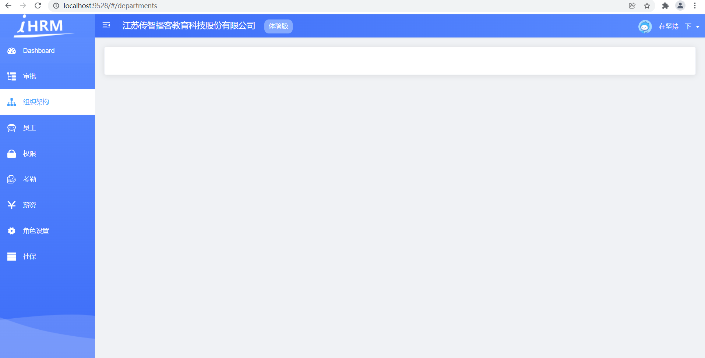

### 小结

1. el-card组件特点是什么?

   <details>     
   <summary>答案</summary> 
   <ul>
   <li>默认分上和下2部分, 此组件第一个子元素就是卡片的头, 第二个以后就是卡片的身体</li>
   <li>卡片的头部, 用具名插槽, 身体部分默认插槽无需名字</li>
   </ul> 
   </details>


## 09.组织架构-卡片头部

### 目标

完成卡片头部的tab标签实现

### 讲解

明确目标后, 去element-ui组件库中查找类似的, 使用[Tabs组件](https://element.eleme.cn/#/zh-CN/component/tabs)


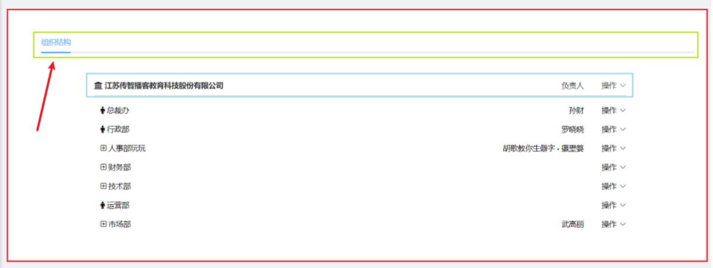


1. 把找到的标签, 复制到我们的el-card头部里, 阅读每个标签和属性含义

   ```vue
   <template>
     <div class="departments-container">
       <div class="app-container">
         <el-card class="box-card">
           <div slot="header" class="clearfix">
             <!-- el-tab-pane有几个, 就有几个tab标签导航
                  el-tab-pane夹着的内容, 就是这个导航对应的内容
                  el-card只用到了头(没有体), 体用的是el-tab标签导航的身体内容(一切放在了卡片的头里写)
   
                  el-tabs: Tabs标签页导航
                         v-model: 绑定点击激活的name值
                         @tab-click: tab导航点击事件
                  el-tab-pane: 每个tab标签导航
                         label: tab导航显示文字
                         name: 点击关联到v-model的值
              -->
             <el-tabs v-model="activeName" @tab-click="handleClick">
               <el-tab-pane label="用户管理" name="first">用户管理</el-tab-pane>
               <el-tab-pane label="配置管理" name="second">配置管理</el-tab-pane>
               <el-tab-pane label="角色管理" name="third">角色管理</el-tab-pane>
               <el-tab-pane
                 label="定时任务补偿"
                 name="fourth"
               >定时任务补偿</el-tab-pane>
             </el-tabs>
           </div>
         </el-card>
       </div>
     </div>
   </template>
   
   <script>
   export default {
     name: 'Departments',
     data() {
       return {
         activeName: 'first' // 被激活的 Tab 标签页
       }
     },
     methods: {
       handleClick(tab, event) {
         console.log(tab, event)
       }
     }
   }
   </script>
   
   <style lang="scss" scoped>
   .box-card {
     padding: 10px 30px;
   }
   
   .tab-pane {
     padding: 20px 80px;
   
     .company {
       margin-left: 12px;
       font-weight: bold;
       font-size: 14px;
     }
   
     .department-header {
       height: 50px;
       display: flex;
       align-items: center;
       border-bottom: 1px solid #ccc;
     }
   }
   </style>
   
   ```

2. 然后删除不需要的, 和我们的需求对上, 最终落地代码

   ```vue
   <template>
     <div class="departments-container">
       <div class="app-container">
         <!-- 卡片组件(分为头部和身体) -->
         <el-card class="box-card">
           <!-- 头部 -->
           <div slot="header" class="clearfix">
             <!-- tab导航 -->
             <el-tabs v-model="activeName" @tab-click="handleClick">
               <el-tab-pane label="组织导航" name="first">组织导航</el-tab-pane>
             </el-tabs>
           </div>
         </el-card>
       </div>
     </div>
   </template>
   ```

3. 最终效果

   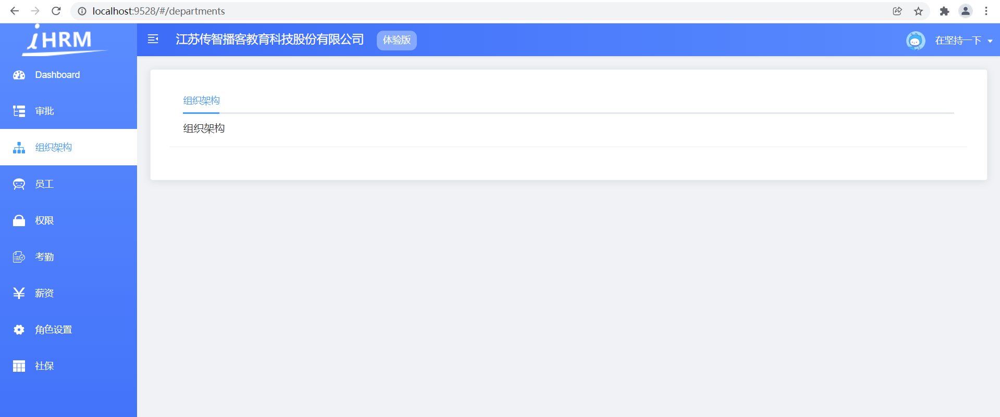

### 小结

1. el-tabs和el-tab-pane关系是什么?

   <details>     
   <summary>答案</summary> 
   <ul>
   <li>el-tabs父级标签, 代表一行tabs标签栏导航</li>
   <li>el-tab-pane子级标签, 代表每一个tab标签导航</li>
   </ul> 
   </details>

2. el-tab-pane和它的字标签什么关系?

   <details>     
   <summary>答案</summary> 
   <ul>
   <li>一一对应的关系, 每个tab导航对应自己的内容部分</li>
   </ul> 
   </details>


## 10.组织架构-列表布局

### 目标

完成这部分的布局效果, 先不考虑内容, 就是一大行, 两列, 蓝色框里的布局

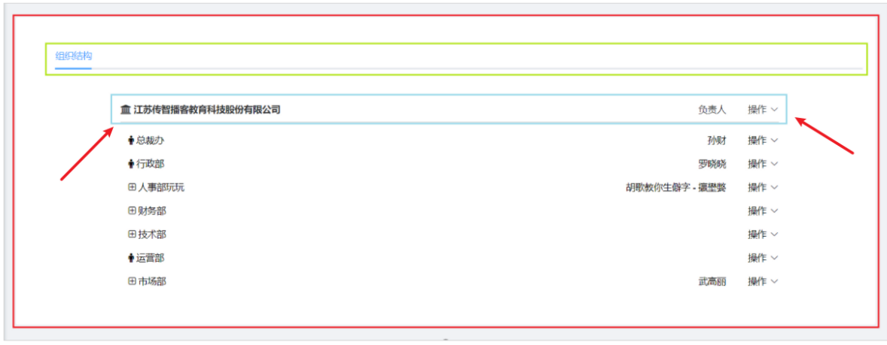


### 讲解

element-ui里有个[Layout布局组件](https://element.eleme.cn/#/zh-CN/component/layout)

1. 在el-tab-pane中间, 放入el-row和el-col布局, ==直接复制下面的代码==

   > 注意1: el-tab-pane上有个class类名
   >
   > 注意2: 复制完成后读一读标签结构
   
   ```vue
   <el-tab-pane label="组织导航" name="first" class="tab-pane">
                 <!-- class="tab-pane"设置左右padding, 把内容往中间挤压 -->
                 <!-- 使用 Layout 布局绘制头部区域
                   最外层一行, 2列
                     el-row: type布局模式
                             justify两端对齐
                             align交叉轴排列方式(垂直方向居中)
                  -->
                 <el-row type="flex" justify="space-between" align="middle" class="department-header">
                   <!-- 第一列20份 -->
                   <el-col :span="20">
                     <i class="el-icon-s-home" />
                     <span class="company">江苏传智播客教育科技股份有限公司</span>
                   </el-col>
                   <!-- 第二列4份 -->
                   <el-col :span="4">
                     <!-- 在容器范围里, 一行再分2列 -->
                     <el-row type="flex" justify="end">
                       <el-col>负责人</el-col>
                       <el-col>
                         <!-- 这个之前在头部导航右侧下拉菜单讲过 -->
                         <el-dropdown>
                           <!-- 下拉菜单文字 -->
                           <span class="el-dropdown-link">
                             操作<i class="el-icon-arrow-down el-icon--right" />
                           </span>
                           <!-- 下拉项 -->
                           <el-dropdown-menu slot="dropdown">
                             <el-dropdown-item>添加子部门</el-dropdown-item>
                           </el-dropdown-menu>
                         </el-dropdown>
                       </el-col>
                     </el-row>
                   </el-col>
                 </el-row>
               </el-tab-pane>
   ```

### 小结

1. 我们这一行是如何布局的?

   <details>     
   <summary>答案</summary> 
   <ul>
   <li>先用el-row和el-col划分一行, 2列</li>
   <li>在第二个el-col占4份父级宽度范围下, 再分一行两列, 里面还可以嵌套别的组件</li>
   </ul> 
   </details>


## 11.组织架构-主体结构-左侧

### 目标

完成主体区域结构的绘制

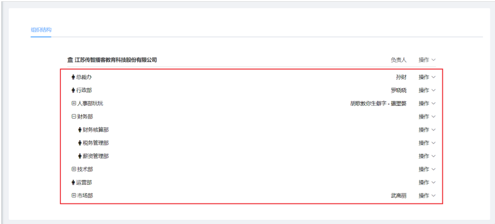


### 讲解

1.  主体区域左侧一列(各种部门)使用 Tree 树形控件实现
2.  右侧结构复用头部区域的代码
    - 如何复用头部区域的代码 ？
    - 使用Tree树形组件的插槽技术！
    - 详见： [Tree 树形控件 - 自定义节点内容](https://element.eleme.cn/#/zh-CN/component/tree#zi-ding-yi-jie-dian-nei-rong)

3. 总之下面就是树形组件整体使用, 加树形组件的插槽实现自定义节点内容

#### 代码实现

1. 查看 [tree 树形控件](https://element.eleme.cn/#/zh-CN/component/tree) 文档，分析 tree 树形控件使用的数据结构，模拟后端返回的数据

   ==整体复制替换==

   ```js
   data() {
       return {
         activeName: 'first', // 被激活的 Tab 标签页
         // 树形控件数据
         treeData: [
           {
             departName: '总裁办',
             name: '孙财'
           },
           {
             departName: '行政部',
             name: '罗晓晓'
           },
           {
             departName: '人事部',
             name: '安小晴',
             children: [
               {
                 departName: '财务核算部'
               }
             ]
           },
           {
             departName: '财务部',
             name: '',
             children: [
               {
                 departName: '财务核算部'
               },
               {
                 departName: '税务管理部'
               },
               {
                 departName: '薪资管理部'
               }
             ]
           },
           {
             departName: '技术部',
             name: '',
             children: [
               {
                 departName: '前端技术部'
               },
               {
                 departName: '后端技术部'
               }
             ]
           },
           {
             departName: '运营部',
             name: ''
           },
           {
             departName: '市场部',
             name: '武高丽',
             children: [
               {
                 departName: '市场部1'
               },
               {
                 departName: '市场部2'
               }
             ]
           }
         ],
         // 定义结构显示
         defaultProps: {
           children: 'children',
           label: 'departName'
         }
       }
     }
   ```

   

2. 使用 tree 组件，并绑定我们定义的属性

   ==套在el-tab-pane的el-row的兄弟下, 循环主体列表==

   ```vue
   
   <el-tabs v-model="activeName" @tab-click="handleClick">
       <el-tab-pane label="组织导航" name="first" class="tab-pane">
           <el-row type="flex" justify="space-between" align="middle" class="department-header">
               <!-- ...略过... -->
           </el-row>
   		
        	<!-- 在这里设置, 树形控件 -->   
           <el-tree class="departments-tree" :data="treeData" :props="defaultProps" :default-expand-all="true">
           	<!-- 默认插槽  并且使用内部的数据进行自定义模板的渲染, scope.data 所以直接key解构赋值变量也是data(对应数据对象)-->
               <template #default="{ data }">
   				<el-row
           			type="flex"
           			justify="space-between"
           			align="middle"
           			style="height: 40px; width: 100%;"
           		>
       				<!-- 部门名字 -->
       				<el-col :span="20">
           				<span>{{ data.departName }}</span>
                   	</el-col>
                   </el-row>
               </template>
           </el-tree>
       </el-tab-pane>
   </el-tabs>
   ```

   

3. 调整树形控件之间的样式, 在views/departments/index.vue下面style最下面加即可

   ```scss
   .departments-tree {
     margin: 12px 0px;
   }
   ```

   

4. 查看结构，发现我们的左侧功能已经实现了

   

   

### 小结

1. 请总结下, 我们树形控件数据结构是什么样子的?

   <details>     
   <summary>答案</summary> 
   <ul>
   <li>每个对象代表一行数据节点</li>
   <li>如果这个对象有children属性, 那children数组里的对象就是下一级(行)的节点对象, 默认缩进递归</li>
   </ul> 
   </details>


## 12.组织架构-主体结构-右侧

### 目标

完成组织结构, 右侧要显示的标签和下拉菜单, 效果如下

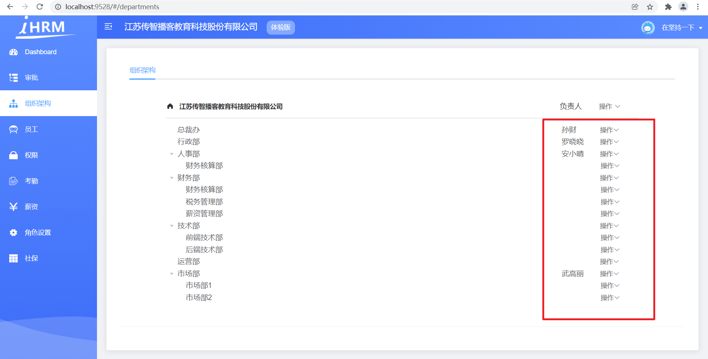

### 讲解

思路: 右侧结构复用头部区域的代码, 给el-tree里新增一个el-col占据右侧列, 设置内容标签

1. 实现结构的复用 (看功能操作区域部分标签代码)

   ```vue
   <el-tree class="departments-tree" :data="treeData" :props="defaultProps" :default-expand-all="true">
                   <!-- 默认插槽  并且使用内部的数据进行自定义模板的渲染
                     scope.data 所以直接key解构赋值变量也是data(对应数据对象)
                    -->
                   <template #default="{ data }">
                     <el-row
                       type="flex"
                       justify="space-between"
                       align="middle"
                       style="height: 40px; width: 100%;"
                     >
                       <!-- 部门名字 -->
                       <el-col :span="20">
                         <span>{{ data.departName }}</span>
                       </el-col>
                       <!-- 功能操作区域 -->
                       <el-col :span="4">
                         <el-row type="flex" justify="end">
                           <!-- 两个内容 -->
                           <el-col>{{ data.name }}</el-col>
                           <el-col>
                             <!-- 下拉菜单 element -->
                             <el-dropdown>
                               <span> 操作<i class="el-icon-arrow-down" /> </span>
                               <!-- 下拉菜单 -->
                               <el-dropdown-menu slot="dropdown">
                                 <el-dropdown-item @click.native="add(data)">添加子部门</el-dropdown-item>
                                 <el-dropdown-item @click.native="edit(data)">编辑部门</el-dropdown-item>
                                 <el-dropdown-item @click.native="del(data)">删除部门</el-dropdown-item>
                               </el-dropdown-menu>
                             </el-dropdown>
                           </el-col>
                         </el-row>
                       </el-col>
                     </el-row>
                   </template>
                 </el-tree>
   ```

   

2. 对每行节点样式进行调整：`src\styles\element-ui.scss`, ==直接在最下面加载==

   ```scss
   // 树形控件节点_内容样式(每行)
   .el-tree-node__content {
     height: 30px !important;
     font-size: 14px !important;
   }
   ```


3. 查看结构，发现我们的右侧功能已经实现了

   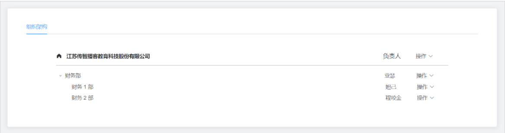

4. tab的点击事件暂时不需要删除

5. 对应操作的点击事件方法-实现下

   ```js
   methods: {
       // 正文部分-右侧的添加子部门
       add(data) {
   
       },
       // 编辑子部分
       edit(data) {
   
       },
       // 删除部分
       del(data) {
   
       }
     }
   ```

   

### 小结

1. 请总结下, 我们组织架构页面布局是什么组件套用什么组件?

   <details>     
   <summary>答案</summary> 
   <ul>
   <li>最外层是el-card, 卡片布局</li>
   <li>在头的部分集成的整个页面功能, 没要列表部分</li>
   <li>el-card集成el-tabs和el-tab-pane导航组件</li>
   <li>el-tab-pane分为2行, 第一行el-row是头部标记(类似表格列标题)</li>
   <li>el-tab-pane分为2行, 第二行el-tree树状结构组件</li>
   <li>每个el-row里分2个el-col. 右侧的el-col里继续嵌套el-col2个分左右</li>
   </ul> 
   </details>


## 13.组织架构-获取数据并渲染

### 目标

完成组织架构 API 的封装

完成组织架构数据的获取以及数据的渲染

毕竟上面的数据是假的, 我们得拿到真实接口的数据

==注意: 如果数据里有空值, 就是我们有人的项目没做表单校验, 估计录入空值给后台, 而后台也没有判断直接保存到数据库里了==

### 讲解

1. 封装获取组织架构的 API, 新建src/api/departments.js

   ```js
   import request from '@/utils/request'
   
   /**
    * 组织架构 - 获取列表
    * @returns Promise对象
    */
   export function departmentsListAPI() {
     return request({
       url: '/company/department'
     })
   }
   
   ```

2. 别忘了在统一的api/index.js - 导出新的接口文件

   ```js
   export * from './departments'
   ```

3. 在views/departments/index.vue, 中引入并调用 API，获取到组织架构数据

   ```js
   import { departmentsListAPI } from '@/api'
   
   async created() {
       this.getDepartMentsListFn()
   },
   
   methods: {
       // 获取部门列表方法
       async getDepartMentsListFn() {
         const res = await departmentsListAPI()
         console.log(res)
         this.treeData = transTree(res.data.depts, '') // 因为后台返回的字段是id和pid而且根是空字符串, 如果不是需要自己改变transTree里判断条件等
       }
   }
   ```

4. 查看返回的数据字段, name是部门名字, manager是部门负责人

5. 需要修改tree默认的字段, 和标签里显示的字段

   ==其实默认的用不上了, 因为显示的名字, 我们都是自己从对象里取出来的==

   ```vue
   <!-- 部门名字 -->
   <el-col :span="20">
       <span>{{ data.name }}</span>
   </el-col>
   <!-- 功能操作区域 -->
   <el-col :span="4">
   	<el-row type="flex" justify="end">
           <!-- 两个内容 -->
           <el-col>{{ data.manager }}</el-col>
       </el-row>
   </el-col>
   
   <script>
   export default {
       data(){
           return {
               // ...其他
               // 定义结构显示
               defaultProps: {
           		label: 'name' // 改成name字段
         		}
           }
       }
   }
   </script>
   ```

   

6. 查看效果

   

   

   

   根据渲染结构，发现虽然数据已经成功显示出来了，但是它是平铺下来的，并不是树形的！

   

   

### 小结

1. 为何我们出来的并不是 嵌套的层级的树状结构, 怎么是平铺的呢?

   <details>     
   <summary>答案</summary> 
   <ul>
   <li>原因：后端返回来的数据并不是一个嵌套的树状结构，而是一个平铺的数组结构，它不能直接在tree中使用。</li>
   <li>解决：我们写代码处理一下：把平铺的数组转成树状数据</li>
   </ul> 
   </details>


## 14.组织架构-处理树形结构

### 目标

把后端传过来的平铺数组数据，处理成 tree 组件需要的树形数据

### 讲解

#### 分析

1.  把我们第一天的函数, 封装成工具，单独放在 `utils\index.js` 下边
2.  数据结构比较复杂，如果使用循环，会产生多层 for 循环，因此需要使用递归

#### 分析数据结构

​    											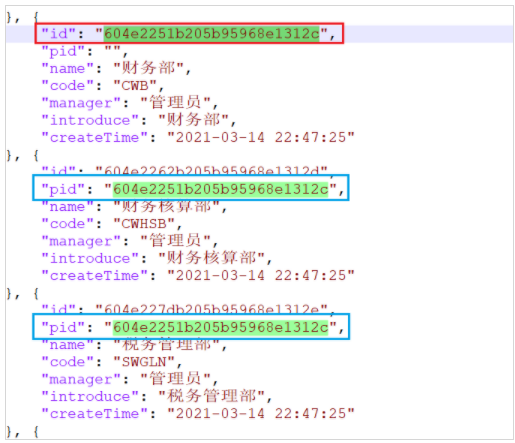

1.  pid：父级部门 id
    - 如果为空，说明是 1 级
    - 如果不为空，pid 代表的是父级的 id，
2.  `pid 代表的是父级的 id`，那是否可以使用 id 和 pid  形成嵌套关系呢？
    - 可以

#### 实现

1. 在 `src\utils\index.js` 中进行代码的封装

   ```js
   /**
    * 把扁平结构的数据, 转成树形控件
    * @param {*} list
    * @param {*} rootValue
    * @returns
    */
   export function transTree(list, rootValue) { // list: 整个数组, rootValue本次要查找的目标id -> 此函数为了找到rootValue目标id的下属们
     const treeData = [] // 装下属对象的
     list.forEach(item => {
       if (item.pid === rootValue) { // 当前对象pid符合, 继续递归调用查找它的下属
         const children = transTree(list, item.id) // 返回item对象下属数组
         if (children.length) {
           item.children = children // 为item添加children属性保存下属数组
         }
         treeData.push(item) // 把当前对象保存到数组里, 继续遍历
       }
     })
     return treeData // 遍历结束, rootValue的id对应下属们收集成功, 返回给上一次递归调用children, 加到父级对象的children属性下
   }
   ```

   

2. 在 `src\views\departments\index.vue` 导入插件并调用

   ```js
   import { transTree } from '@/utils'
   
   async created() {
       const res = await departmentsListAPI()
       this.treeData = transTree(res.data.depts, '') // 因为后台返回的字段是id和pid而且根是空字符串, 如果不是需要自己改变transTree里判断条件等
     },
   ```

   

3. 预览效果

   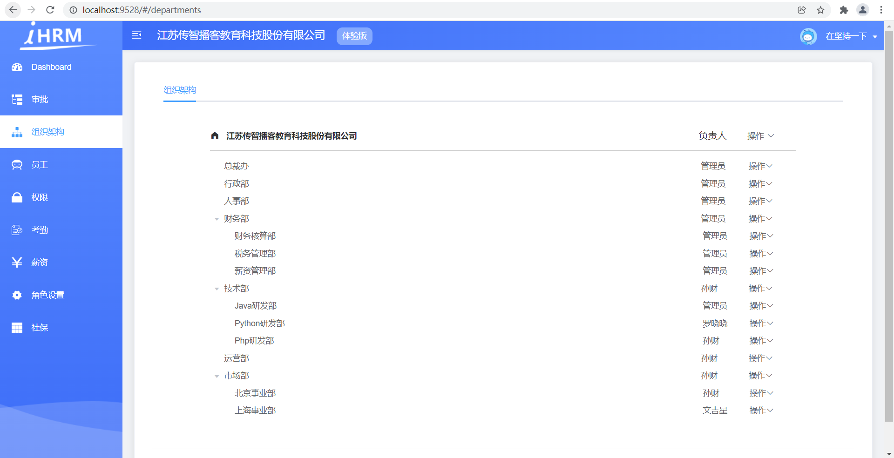


### 小结

1. 如果以后工作本来是要层叠嵌套结构, 但是数组是扁平化的应该怎么办?

   <details>     
   <summary>答案</summary> 
   <ul>
   <li>用我们准备的方法, 稍作修改, 即可实现数组转树状结构</li>
   </ul> 
   </details>


