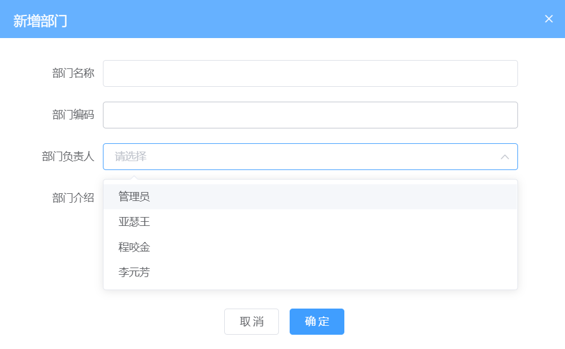
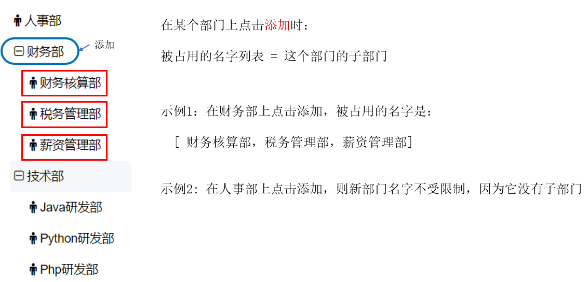
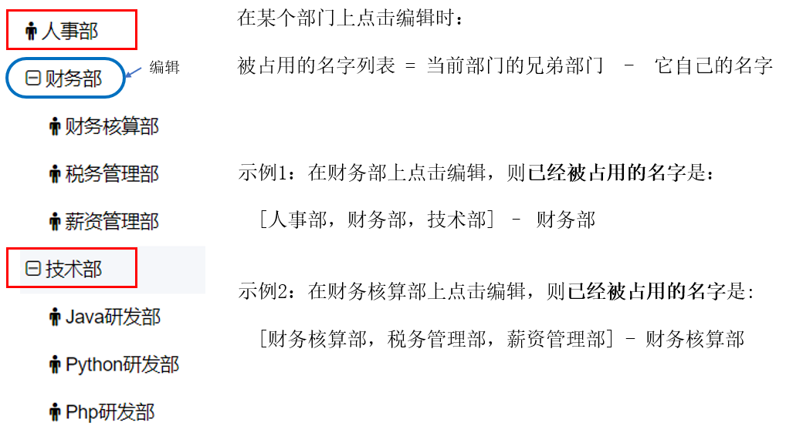

# Day05-组织架构

## 01.组织架构-添加子部门-组件封装

### 目标

分析新增功能，并完成基本交互，点击添加之后，有一个弹层


### 讲解

#### 分析

1.   将添加功能需要单独做一个子组件
2.   编辑和添加功能在界面上比较相似，考虑共用
3.   将子组件在父组件中进行导入，当点击添加之后，通过弹层[dialog](https://element.eleme.cn/#/zh-CN/component/dialog)显示出来

#### 注意

我们封装组件的思想就是, 组件只负责展示数据, 网络请求和逻辑代码在页面组件书写(index.vue)

#### 实现

1. 在 `src/views/departments/components`目录下，新增一个文件：departDialog.vue，先任意补充内容

   ```vue
   <template>
     <div>
       我是弹出层
     </div>
   </template>
   
   <script>
   export default {
   
   }
   </script>
   
   <style>
   
   </style>
   
   ```

   

2. 在 `src\views\departments\index.vue` 父组件中导入并进行注册

   ```vue
   <div class="app-container"></div>
   <!-- 新增子频道 -->
   <departDialog :dialog-visible="showDialog"/>
   
   <script>
   import departDialog from './components/departDialog.vue'
   
   data(){
       return {
         // 是否展示-添加子频道的弹出层
         showDialog: false
       }
   },
   components: {
       departDialog
   }
   </script>
   
   ```

   

3. 添加弹层组件在`components/departDialog.vue`上

   * 把before-close属性删除掉
   * 把width宽度改50%

   ```vue
   <template>
     <div>
       <el-dialog
         title="提示"
         :visible.sync="dialogVisible"
         width="50%"
       >
         <span>这是一段信息</span>
         <span slot="footer" class="dialog-footer">
           <el-button>取 消</el-button>
           <el-button type="primary">确 定</el-button>
         </span>
       </el-dialog>
     </div>
   </template>
   
   <script>
   export default {
     props: {
       dialogVisible: {
         type: Boolean,
         default: false
       }
     }
   }
   </script>
   
   <style>
   
   </style>
   
   ```

   

4. 补充`departments/index.vue`, 点击<添加子部门>让弹窗出现

   ```vue
   <template>
     <div class="departments-container">
       <div class="app-container">
       </div>
       <!-- 省略.... -->
       <!-- 新增-子部门-弹窗 -->
       <depart-dialog :dialog-visible="showDepartDialog" />
     </div>
   </template>
   
   <script>
   export default {
       data () {
           return {
               // ...其他
               showDepartDialog: false // 新增子部门弹框是否出现
           }
       },
       methods: {
       	// 右侧 - 添加子部门
       	add(data) {
         		this.showDepartDialog = true
       	}
     	}
   }
   </script>
   
   ```

5. 现在关闭弹窗报错正常, 因为修改了props变量的值, 而props是只读的

### 小结

1. 如果在子组件内必须要修改props的值怎么办?

   <details>     
   <summary>答案</summary> 
   <ul>
   <li>遵守单项数据流, 自定义事件改外面值来影响里面</li>
   </ul> 
   </details>


## 02.组织架构-添加子部门-隐藏组件

### 目标

隐藏组件的方式有很多种, 但是我们只想让用户点击取消和确定按钮才能关闭

### 讲解

#### 分析

对于 dialog 组件，可以支持如下四种关闭的方式, 测试下

1.  点击遮罩层上, 会导致弹窗关闭
2.  按下esc键。会导致弹窗关闭
3.  点击右上角的X按钮。会导致弹窗关闭
4.  点击确认和取消, 可以自己写弹窗关闭(留下)

#### 实现

1. 把上面3种方式, 都关闭

   ```vue
    <!--
         close-on-click-modal: 是否可以通过点击 modal 关闭 Dialog
         close-on-press-escape	是否可以通过按下 ESC 关闭 Dialog
         show-close	是否显示关闭按钮
        -->
       <el-dialog
         title="提示"
         :visible.sync="dialogVisible"
         width="50%"
         :close-on-click-modal="false"
         :close-on-press-escape="false"
         :show-close="false"
       >
   ```

   

3. views/departments/components/departDialog.vue, 弹出框组件里点击按钮绑定事件关闭弹窗

   > 遵守单向数据流, 所以用.sync去影响departments/index.vue页面的变量

   ```vue
   <span slot="footer" class="dialog-footer">
   	<el-button @click="cancelFn">取 消</el-button>
   	<el-button type="primary" @click="enterFn">确 定</el-button>
   </span>
   
   
   <script>
   export default {
     // ...其他
     methods: {
       // 取消-点击事件
       cancelFn() {
         this.$emit('update:dialogVisible', false)
       },
       // 确定-点击事件
       enterFn() {
         this.$emit('update:dialogVisible', false)
       }
     }
   }
   </script>
   
   ```

4. 在views/departments/index.vue中快速接收

   > [.sync官方文档解释](https://cn.vuejs.org/v2/guide/components-custom-events.html#sync-%E4%BF%AE%E9%A5%B0%E7%AC%A6)
   
   父子双向数据绑定公式: 
   
   * 父组件时 :属性名.sync="父里Vue数据名"
   * 子组件时 恰当时机this.$emit('update:属性名', 传给父变量的值)
   
   其实父->子还是用到了props属性, 子->父还是用了自定义事件, 只不过名字有固定格式
   
   ```vue
   <!-- 新增-子部门-弹窗 -->
   <!-- .sync作用: 快速实现双向数据绑定
   	以前: 子改父变量值
   	需求: 组件内想要影响父组件的showDepartDialog变量值, 可以这样写
   	父组件: 绑定自定义事件, 把值赋予给父页面里变量
       @updateDialog="val => showDepartDialog = val"
       子组件: 触发自定义事件, 传值给val
       this.$emit('updateDialog', false)
   
       现在: 我不想自己起自定义事件名, 也不想写赋值的函数, 让.sync帮我吧
   	:dialog-visible.sync="showDepartDialog"
       这句话干了2件事 
   		(1): 把showDepartDialog变量值传入给组件内props叫dialogVisible变量 (父->子)
   		(2): 转换为自定义事件绑定@update:dialogVisible="val => showDepartDialog = val"
       哎哎哎. 巧了, 这.sync干的第二件事和我们父绑定事件一样啊, 而且少写这么多代码, 真香
   
       总结: .sync可以给当前绑定绑定固定格式update:变量名的事件, 把值赋予给右侧的变量
   -->
   <depart-dialog :dialog-visible.sync="showDepartDialog" />
   ```
   
   

### 小结

1. dialog-组件默认有几种关闭方式?

   <details>     
   <summary>答案</summary> 
   <ul>
   <li>点击遮罩层, 点击右上角×按钮, 键盘的esc按键, 点击确定和取消按钮自己写逻辑</li>
   </ul> 
   </details>

2. .sync实际上干了什么?

   <details>
   <summary>答案</summary>
   <ul>
   <li>给所在标签绑定了@update:属性名="val => Vue变量名 = val"</li>
   <li>其实就是个语法糖, 绑定个自定义事件, 把收到的值给右侧的Vue变量</li>
   </ul>
   </details>

3. 父子组件想要实现双向数据绑定语法是?

   <details>
   <summary>答案</summary>
   <ul>
   <li>父组件时, :属性名.sync="父里Vue数据名"</li>
   <li>子组件时, 恰当时机this.$emit('update:属性名', 传给父变量的值)</li>
   </ul>
   </details>


## 03.组织架构-添加子部门-弹框表单

### 目标

实现添加子部门的弹框

​							


### 讲解

1. 在 `src\views\departments\components\departDialog.vue`  组件中，使用 element 提供的 el-from 组件实现添加部门的表单

   ==直接复制==

   ```vue
   <template>
     <div>
       <el-form ref="deptForm" label-width="120px">
         <el-form-item label="部门名称">
           <el-input v-model="form.name" style="width:80%" placeholder="1-50个字符" />
         </el-form-item>
         <el-form-item label="部门编码">
           <el-input v-model="form.code" style="width:80%" placeholder="1-50个字符" />
         </el-form-item>
         <el-form-item label="部门负责人">
           <el-select v-model="form.manager" style="width:80%" placeholder="请选择">
             <el-option value="1" />
           </el-select>
         </el-form-item>
         <el-form-item label="部门介绍">
           <el-input v-model="form.introduce" style="width:80%" placeholder="1-300个字符" type="textarea" :rows="3" />
         </el-form-item>
       </el-form>
     </div>
   </template>
   ```

   

2. 在 data 中定义表单中需要使用的数据

   ==直接复制, 讲解标签==

   ```js
   data() {
     return {
       form: {
         name: '', // 部门名称
         code: '', // 部门编码
         manager: '', // 部门管理者
         introduce: '' // 部门介绍
       }
     }
   }
   ```


### 小结

1. 表单里没有按钮, 按钮在外面, 点击如何拿到表单数据?

   <details>     
   <summary>答案</summary> 
   <ul>
   <li>可以通过v-model绑定表单里的值, 通过this.form拿到对象绑定的数据</li>
   </ul> 
   </details>


## 04.组织架构-添加子部门-负责人列表

### 目标

实现添加子部门的弹框




### 讲解

#### 分析

1.  首先封装获取部门负责人的 API
2.  调用 API ，将返回的数据赋值给 data 中的数据
3.  将数据绑定给 el-select 组件

#### 实现

1. 封装获取部门负责人的 API

   ```js
   /**
    * 组织架构 - 部门负责人列表数据
    * @returns
    */
   export function getEmployeeSimpleAPI() {
     return request({
       url: '/sys/user/simple'
     })
   }
   ```

   

2. 在组件中导入封装的 API 方法，将返回的数据赋值给 data 中的数据

   ```js
   import { getEmployeeSimpleAPI } from '@/api'
   ```

   ```js
   data() {
       return {
         // ...其他
         employeesList: [] // 员工列表
       }
   },
   created() {
       // ...其他
       this.getEmployeesListFn()
   },
   methods: {
       // ...
       // 获取员工列表方法
       async getEmployeesListFn() {
         const res = await getEmployeeSimpleAPI()
         this.employeesList = res.data
       }
   }
   ```

   

3. 在index.vue传递到departDialog.vue组件中

   ```vue
   <!-- 新增-子部门-弹窗 -->
   <depart-dialog
                  :dialog-visible.sync="showDepartDialog"
                  :employees-list="employeesList"
                  />
   ```

   

4. 在departDialog.vue中, 接收, 并且在el-select组件中循环渲染

   ```vue
   <el-form-item label="部门负责人">
       <el-select v-model="form.manager" style="width:80%" placeholder="请选择">
           <el-option v-for="item in employeesList" :key="item.id" :value="item.username" />
       </el-select>
   </el-form-item>
   
   <script>
   export default {
       // 员工列表
       employeesList: {
         type: Array,
         default() {
           return [] // 独立作用域
         }
         // props的默认值如果类型校验是数组/对象->为了防止互相引用, 要在函数里返回一个新数组/对象
       }
   }
   </script>
   ```

   - 注意，对于 el-option 组件，它有两个重要的属性：

     - label：选项显示的内容(不设置, 默认显示value在页面上)


4.   查看效果

     ​							

### 小结

1. 部门负责人是如何做的, 思路是什么?

   <details>     
   <summary>答案</summary> 
   <ul>
   <li>先把数据请求回来, 在现有的标签和样式的列表里, 循环使用即可</li>
   </ul> 
   </details>


## 05.组织架构-添加子部门-接口调用

### 目标

实现添加部门功能

### 讲解

#### 分析

1.  首先分析接口文档，查看需要使用的参数 
2.  封装添加部门功能的接口 API
3.  分析发现都可以在表单里获取到, 但是父级ID, 要让父组件向子组件传递父级 ID
4.  在用户点击确认之后，进行做表单验证(后面处理)
5.  导入 API，调用接口成功之后，向父级传递自定义事件
    - 关弹层
    - 通知父组件更新数据

#### 实现

1. 封装添加部门功能的接口

   ```js
   /**
    * 组织架构 - 新增子部门
    * @description: 新增子部门
    * @param {object} data 发送参数： name, code, manager, introduce, pid
    * @param {object} data 发送参数： 部门名称, 部门编码, 部门管理者, 部门介绍, 新增的这个子部门的上级部门
    * @returns
    */
   export function addDepartmentsAPI(data) {
     return request({
       url: '/company/department',
       method: 'post',
       data // 前端form表单的参数名, 直接和接口的对应, 这里可以少写很多属性名代码
     })
   }
   
   ```

   

2. 传递父级 id 给子组件

   ```js
   // 正文部分-右侧的添加子部门
   add(data) {
       this.clickDepartId = data.id // 保存当前部门id
       this.showDepartDialog = true
   }
   ```

   ```js
   data() {
       return {
         // ...其他
         // 部门的id
         clickDepartId: ''
       }
     },
   ```

   
   
3. 在 `src\views\departments\components\departDialog.vue`在点击确定按钮时, 把数据传出来

   ```js
   // 确定-点击事件
   enterFn() {
       this.$emit('addDepartEV', this.form)
       this.$emit('update:dialogVisible', false)
   }
   ```

   

4. 在 `src\views\departments\index.vue` 文件中导入 API，并接收子组件触发的事件, 调用添加接口

   ```vue
   <!-- 新增-子部门-弹窗 -->
         <depart-dialog
           :dialog-visible.sync="showDepartDialog"
           :employees-list="employeesList"
           @addDepartEV="addDepartmentsFn"
         />
   
   <script>
   import { addDepartmentsAPI } from '@/api'
   
   export default {
       methods: {
           // 新增-添加部门的方法
           async addDepartmentsFn(dataObj) {
             dataObj.pid = this.clickDepartId
             const res = await addDepartmentsAPI(dataObj)
             console.log(res)
           }
       }
   }
   </script>
   ```

   

#### 注意

1. 如果提示部门编号重复的报错

   请更换一个部门添加,而且部门编码别乱打, 例如123, 可能会跟别人重复...

   

### 小结

1. 新增数据的思路是什么?

   <details>     
   <summary>答案</summary> 
   <ul>
   <li>v-model绑定表单form对象数据, 前端数据绑定成功</li>
   <li>然后封装接口, 调用传参进入, 关闭弹窗, 重新获取数据铺设</li>
   </ul> 
   </details>

2. 重新获取数据铺设覆盖, 更新是否会把所有标签覆盖?

   <details>     
   <summary>答案</summary> 
   <ul>
   <li>虽然数据覆盖了, 但是我们v-for会对比新旧DOM, 根据key来决定如何更新DOM</li>
   </ul> 
   </details>


## 06.组织架构-编辑部门-数据回显

### 目标

实现子部门数据回显操作

### 讲解

1. 在 `src\api\departments.js` 中，添加一个用于获取部门详情的接口，如下

   ```js
   /**
    * 组织架构 - 获取部门详情
    * @description: 获取部门详情
    * @param {*} id 表示当前要编辑项的id值(部门id)
    * @return {*}
    */
   export function getDepartDetailAPI(id) {
     return request({
       url: `/company/department/${id}`
     })
   }
   ```

   

2.  在 `src\views\departments\index.vue` 文件中导入请求数据的 API

   ```js
   import { getDepartDetailAPI } from '@/api'
   ```

   

3. 在编辑部门的按钮, 点击事件中,请求部门详细数据, 影响departDialog.vue组件内表单的值, 回显

   

   ```js
   // 右侧 - 编辑子部门
   async edit(data) {
       this.clickDepartId = data.id // 编辑的部门id
       this.showDepartDialog = true // 弹窗显示
       const res = await getDepartDetailAPI(data.id)
       this.$refs.departDialog.form = res.data // 影响组件表单里对象
   }
   ```


### 小结

1. watch都可以侦听哪些东西?

   <details>     
   <summary>答案</summary> 
   <ul>
   <li>可以侦听不只data和computed里属性还可以侦听props里的变量</li>
   <li>其实只要是this组件实例对象里的属性, 都可以watch侦听</li>
   <li>例如this.$route, this.parentId, 这些属性不用写this.进行侦听</li>
   </ul> 
   </details>


## 07.组织架构-编辑部门-保存数据

### 目标

完成保存编辑功能

### 讲解

#### 分析

1.  封装更新接口

2.  调用接口，保存数据

3.  保存成功之后，通知父组件：关闭弹层，更新数据

#### 实现

1. 在 `src\api\departments.js` 中，添加一个用于更新部门数据的接口

   ==注意url上的id, 要传父级的id==

   ```js
   /**
    * 组织架构 - 更新部门详情
     * @description: 更新部门数据
     * @param {*} data: form表单数据 但是要有id, 父级的频道id
     * @return {*}
     */
   export function updateDepartmentsAPI(data) {
     return request({
       url: `/company/department/${data.id}`,
       method: 'put',
       data
     })
   }
   ```

   

2. 在`departements\index.vue`, 导入接口

   ```js
   import { updateDepartmentsAPI } from '@/api'
   ```

   

3. 根据编辑状态, 在点击确定来判断如何调用接口

   ==注意, 要合并id到参数对象中==

   ```js
   // 新增-添加部门的方法
   async addDepartmentsFn(dataObj) {
       if (this.isEdit) { // 编辑状态
           dataObj.id = this.clickDepartId
           const res = await updateDepartmentsAPI(dataObj)
           console.log(res)
       } else { // 新增状态
           dataObj.pid = this.clickDepartId
           const res = await addDepartmentsAPI(dataObj)
           console.log(res)
       }
       this.getDepartMentsListFn()
   }
   ```
   
   

### 小结

1. 如何确保我们正确调用, 新增接口和更新接口呢?

   <details>     
   <summary>答案</summary> 
   <ul>
   <li>根据isEdit变量值来判断是需要执行什么</li>
   </ul> 
   </details>


## 08.组织架构-删除部门

### 目标

实现操作中的删除功能

### 讲解

#### 分析

1.  封装删除部门的 api

2. 在组件中调用：

   - 删除之前要提示用户去做确认 [确认提示组件](https://element.eleme.cn/#/zh-CN/component/message-box#que-ren-xiao-xi)

   - 删除之后要更新数据

#### 实现

1. 在 `src/api/departments.js` 中封装删除的接口

   ```js
   /**
    * 组织架构 - 删除部门
    * @description: 删除部门 - 注意: 有子部门不能删除
    * @param {*} id 当前点击的操作按钮 所在的项的id(部门id)
    * @return {*}
    */
   export function delDepartmentAPI(id) {
     return request({
       url: `/company/department/${id}`,
       method: 'delete'
     })
   }
   ```

   

3.   在`views/departements/index.vue`中, 导入封装的删除 API

   ```js
   import { delDepartmentAPI } from '@/api/departments'
   ```

   

3. 在事件处理程序中执行删除的逻辑

   * 先来一个确认弹框
   * 如果选择取消, 则提示用户取消
   * 如果选择确定, 调用接口
   * 根据接口返回结果, 进行相应提示

   ```js
   // 右侧 - 删除部门
   async del(data) {
       // 显示删除确认消息对话框
       const delRes = await this.$confirm('此操作将永久删除部门, 是否继续?', '提示', {
           confirmButtonText: '确定',
           cancelButtonText: '取消',
           type: 'warning'
       }).catch(err => err)
   
       // 如果返回的结果是 cancel 说明用户取消了删除
       if (delRes === 'cancel') return this.$message('您取消了删除')
   
       // 调用删除接口
       const delDepartRes = await delDepartmentAPI(data.id)
       // 根据状态值, 查看是否删除成功
       if (!delDepartRes.success) return this.$message.error(delDepartRes.message)
       // 删除成功需要给用户进行提示
       this.$message.success(delDepartRes.message)
       // 删除后需要重新获取当前页面数据
       this.getDepartMentsListFn()
   },
   ```

   

### 小结

1. 删除部门的思路是什么?

   <details>     
   <summary>答案</summary> 
   <ul>
   <li>1. 先给删除按钮绑定点击事件和事件处理函数</li>
   <li>2. 然后设置弹窗出现, 让用户选择确定还是取消</li>
   <li>3. 根据选择来执行不同的逻辑</li>
   </ul> 
   </details>


## 09.组织架构-删除部门优化

### 目标

如果当前部门下面有子部门时，不能对当前部门进行删除

### 实现

首先判断是有有 data ，没有存在 data 就判断是否存在 data.children 属性，如果有，就不能显示删除部门

==注意有data.children要让v-if的值为false, 所以前面取反==

```vue
<el-dropdown-item v-if="data && !data.children" @click.native="delDept(data.id)">删除部门</el-dropdown-item>
```

###  小结

1. 我们是如何优化删除部门下拉菜单项的, 为什么要优化?

   <details>     
   <summary>答案</summary> 
   <ul>
   <li>因为如果有子部门的这项, 不能出现删除部门的下拉菜单项</li>
   <li>判断数据对象是否有children, 有则为true, 但是我想让v-if为false所以取反</li>
   </ul> 
   </details>


## 10.组织结构-顶部-添加子部门

### 目标

实现我们顶部, 第一行最右侧菜单的添加部门

### 讲解

我们可以复用添加子部门的功能

1. 绑定点击事件, 做一个判断即可

   ```vue
   <!-- 下拉项 -->
   <el-dropdown-menu slot="dropdown">
       <el-dropdown-item @click.native="add()">添加子部门</el-dropdown-item>
   </el-dropdown-menu>
   
   <script>
   methods: {
       // 右侧 - 添加子部门
       add(data) {
         this.isEdit = false
         if (data) { // 添加二级以下部门
           this.clickDepartId = data.id // 保存当前部门id
         } else { // 添加一级部门(当前点击公司id为'')
           this.clickDepartId = ''
           // 我们可以看到一级部门的pid都是''
         }
   
         this.showDepartDialog = true // 弹窗显示
       }
   }
   </script>
   ```

### 小结

1. 如何给父级的添加子部门实现, 注意什么?

   <details>     
   <summary>答案</summary> 
   <ul>
   <li>注意, 根部门的id为空字符串, 要给它设置下属部门</li>
   <li>第一级部门的id是后台生成</li>
   </ul> 
   </details>


## 11.组织架构-清空表单

### 目标

在新增/编辑时, 点击确定按钮/取消按钮, 表单关闭时把表单清空

### 讲解

1. 在`views/departments/components/departDialog.vue`组件中, 在确定和取消按钮处, 使用el-form内置的清除表单的方法

   ```js
   this.$refs.deptForm.resetFields()
   ```

2. 可以在弹窗关闭事件中, 清空表单, 绑定关闭事件

   ```js
   // 弹窗-关闭事件
   closeDialog() {
       this.$refs.deptForm.resetFields()
   }
   ```

3. 点击确定的时候, ==可能==有问题, 看代码和注释

   ```js
   // 确定-点击事件
   enterFn() {
       // 细节: 有可能会出现, 也有可能不会出现问题
       // 问题: 网络请求读取form对象是空值
       // 原因: 传递form对象, 在ajax要发起前一瞬间, 如果这边把form对象清空, 那边读到的就是空字符串给后台, 所以为了防止这个问题出现
       // 解决:
       // 1. 复制一个新的对象给外面请求接口用, 里面改变this.form不会影响到外面(拷贝)
       // 2. 清空的慢一些. 但是时间不太好掌握
       this.$emit('addDepartEV', { ...this.form })
       this.form = {
           name: '', // 部门名称
           code: '', // 部门编码
           manager: '', // 部门管理者
           introduce: '' // 部门介绍
       }
       this.$refs.deptForm.resetFields()
       this.$emit('update:dialogVisible', false)
   }
   ```

   

### 小结

1. 变量里如果存储的是对象, 那么变量之间的传值和修改, 改的是什么?

   <details>     
   <summary>答案</summary> 
   <ul>
   <li>传递和修改的都是对象的内容地址</li>
   </ul> 
   </details>
   
   

## 12.组织架构-添加和编辑-表单验证

### 目标

实现新增/编辑部门的基础表单校验

### 讲解

#### 表单校验的具体要求

| 校验项目              | 校验规则         |
| --------------------- | ---------------- |
| 部门名称（name）      | 必填 2-10个字符  |
| 部门编码（code）      | 必填 1-20个字符  |
| 部门负责人（manager） | 必填             |
| 部门介绍 ( introduce) | 必填 1-300个字符 |

#### 分析

1. 定义验证规则

2. 配置模板，应用规则

   给表单设置 `rules` 属性传入验证规则

   给表单设置`model`属性传入表单数据

   给表单中的元素（Form-Item ）设置 `prop` 属性，其值为设置为需校验的字段名

3. 手动js里兜底验证

####  实现

1. 在 departDialog.vue 中补充定义 rules ，具体如下：==直接复制==

   ```js
   data() {
     return {
       // 省略其他...
       rules: {
           name: [
             { required: true, message: '部门名称不能为空', trigger: 'blur'},
             { min: 1, max: 50, message: '部门名称要求1-50个字符', trigger:'blur'}
           ],
           code: [
             { required: true, message: '部门编码不能为空', trigger: 'blur'},
             { min: 1, max: 50, message: '部门编码要求1-50个字符', trigger: 'blur'}
           ],
           manager: [
             { required: true, message: '部门负责人不能为空', trigger: 'blur'}
           ],
           introduce: [
             { required: true, message: '部门介绍不能为空', trigger:'blur'},
             { min: 1, max: 300, message: '部门介绍要求1-300个字符', trigger: 'blur'}
           ]
       }
     }
   }
   ```

   

   

2. 将规则应用到模板中

   - el-form上的 ref，model， rules
   - el-form-item 上的 prop

   ```vue
   <el-form ref="deptForm" :model="form" :rules="rules" label-width="120px">
       <el-form-item label="部门名称" prop="name">
           <el-input v-model="form.name" style="width:80%" placeholder="1-50个字符" />
       </el-form-item>
       <el-form-item label="部门编码" prop="code">
           <el-input v-model="form.code" style="width:80%" placeholder="1-50个字符" />
       </el-form-item>
       <el-form-item label="部门负责人" prop="manager">
           <el-select v-model="form.manager" style="width:80%" placeholder="请选择">
               <el-option v-for="item in employeeList" :key="item.id" :value="item.username" />
           </el-select>
       </el-form-item>
       <el-form-item label="部门介绍" prop="introduce">
           <el-input v-model="form.introduce" style="width:80%" placeholder="1-300个字符" type="textarea" :rows="3" />
       </el-form-item>
   </el-form>
   ```

   

3. 手动兜底验证，在 `deptDialog.vue` 中，给 onSubmit 补充回调

   ```js
   // 确定-点击事件
   enterFn() {
       this.$refs.deptForm.validate(async(valid) => {
           if (valid) {
               // 细节: 有可能会出现, 也有可能不会出现问题
               // 问题: 网络请求读取form对象是空值
               // 原因: 传递form对象, 在ajax要发起前一瞬间, 如果这边把form对象清空, 那边读到的就是空字符串给后台, 所以为了防止这个问题出现
               // 解决:
               // 1. 复制一个新的对象给外面请求接口用, 里面改变this.form不会影响到外面(拷贝)
               // 2. 清空的慢一些. 但是时间不太好掌握
               this.$emit('addDepartEV', { ...this.form })
               this.form = {
                   name: '', // 部门名称
                   code: '', // 部门编码
                   manager: '', // 部门管理者
                   introduce: '' // 部门介绍
               }
               this.$refs.deptForm.resetFields()
               this.$emit('update:dialogVisible', false)
           }
       })
   }
   ```

   

### 小结

1. 表单验证的步骤是什么?

   <details>     
   <summary>答案</summary> 
   <ul>
   <li>el-form上设置model和rules属性, 2个对象key一致</li>
   <li>el-form-item的prop属性, 值和对象key一致</li>
   <li>el-xxxx表单标签的v-model绑定数据, 绑定在同名对象key属性里</li>
   </ul> 
   </details>


## 13.组织架构-添加子部门-注意事项

### 目标

由于我们的业务需要，我们对表单的验证补充两个要求

| 校验项目         | 校验规则                         |
| ---------------- | -------------------------------- |
| 部门编码（code） | 部门编码在整个模块中都不允许重复 |
| 部门名称（name） | 同级部门中禁止出现重复部门       |

### 讲解

####  分析

1.  在子组件中需要使用到全部数据
2.  在父组件处理好做校验时需要用到的数据，再传递给子组件，由子组件内部完成验证

#### 实现

1. 做校验时需要的数据相对简单，并不需要把部门列表数据全部传递给子组件，这里做一些映射处理。在`views/departments/index.vue`中

   ```js
   data(){
       return {
           originList: [] // 用于弹窗内-校验部门code和name是否重复数据数组
       }
   }
   // 获取部门列表方法
   async getDepartMentsListFn() {
       const res = await departmentsListAPI()
       console.log(res)
       // 格式化需要传递给子组件的数据
       this.originList = res.data.depts.map(item => (
           {
               id: item.id,
               code: item.code,
               name: item.name,
               pid: item.pid // 下面使用
           }
       ))
       this.treeData = transTree(res.data.depts, '') // 因为后台返回的字段是id和pid而且根是空字符串, 如果不是需要自己改变transTree里判断条件等
   },
   ```
   
   
   
2. 传递给子组件

   ```diff
   <deptDialog
     v-if="showDialog"
     :parent-id="parentId"
     :is-edit="isEdit"
   +  :origin-list="originList"
     @update-depart="updateDepart"
     @close="closeDialog"
   />
   ```

   

3. 在子组件中接收

   ```js
   // 用于校验的code和name对象的数组
       originList: {
         type: Array,
         default() {
           return []
         },
         required: true
       }
   ```
   
   

### 小结

1. props里数组, 为什么非要弄个default函数返回数组?

   <details>     
   <summary>答案</summary> 
   <ul>
   <li>eslint对props的语法做出了严格校验, 如果是数组或者对象, 默认值必须返回一个新数组/对象-作用域独立</li>
   </ul> 
   </details>


## 14.组织架构-==添加==子部门-编号非重验证

### 目标

实现表单数据校验：**新添加**的模块的部门编码在整个模块中都不允许重复

### 讲解

#### 分析

在子组件内部创建**自定义校验函数**进行判断

如果当前添加的部门编号已经在`originList`中已经存在，则提示用户部门编号已经存在，添加不了新部门

#### 实现

1.  在子组件的 data() 中，添加 validCode 自定义校验函数

   ```js
   data() {
     // 校验部门编码是否重复
     const validCode = (rule, value, callback) => {
       // 判断是否能否找到对应的部门，如果找到了则返回该对象
       const existCodeList = this.originList.map(item => item.code)
       // 如果存在该对象，则说明编码已经存在，抛出错误
       existCodeList.includes(value) ? callback(new Error('编码' + value + '已经存在')) : callback()
     }
     
     // ...其他
   }
   ```

   

2.  并在rules中，将它添加到对code的验证规则数组中去

   ```js
   data() {
     return {
       rules: [
         // 其他略……
         code: [
           { required: true, message: '部门编码不能为空', trigger: 'blur' },
           { min: 1, max: 50, message: '部门编码要求1-50个字符', trigger: 'blur' },
           { validator: validCode, trigger: 'blur' }
         ]
       ]
     }
   }
   ```

   

3.  验证

   在做添加时，通过验证是否不能使用已经有 code

   

### 小结

1. 如果一个数据属性, 需要多个规则校验应该如何做?

   <details>     
   <summary>答案</summary> 
   <ul>
   <li>在规则属性数组里添加多个对象</li>
   </ul> 
   </details>


## 15.组织架构-==编辑==子部门-编号自己冲突

### 目标

在编辑时，会发现当前这个部门的原来的编码不能使用了。

### 讲解

#### 分析

编辑和添加是共用一套表单验证规则，而在添加时: 约定所有的已有的部门编号是不能使用的。

#### 思路

如果是编辑时，则必须要在`不能使用的部门编号`中**排除当前正在编辑的部门编码**。

#### 代码

1. **修改验证函数**：在创建验证函数时，如果是编辑 就把当前的部门排除在外

   ```js
   data() {
     // 校验部门编码是否重复
     const validCode = (rule, value, callback) => {
       // 判断是否能否找到对应的部门，如果找到了则返回该对象
       let existCodeList = this.originList.map(item => item.code)
   
       // 如果是编辑状态，则将需要编辑的这一项排除在外
       if (this.isEdit) {
         existCodeList = this.originList.filter(item => item.id !== this.parentId).map(item => item.code)
       }
   
       // 如果存在该对象，则说明编码已经存在，抛出错误
       existCodeList.includes(value) ? callback(new Error('编码' + value + '已经存在')) : callback()
     }
   }
   ```

   

2. 子组件departDialog.vue里定义props变量准备接收

   ```js
   // 编辑状态
       isEdit: {
         type: Boolean,
         default: false
       },
       // 单击的部门id
       parentId: {
         type: String,
         default: ''
       }
   ```

3. 父组件departments/index.vue传入数据

   ```diff
    <!-- 新增-子部门-弹窗 -->
         <depart-dialog
           ref="departDialog"
           :dialog-visible.sync="showDepartDialog"
           :employees-list="employeesList"
           :origin-list="originList"
   +        :is-edit="isEdit"
   +        :parent-id="clickDepartId"
           @addDepartEV="addDepartmentsFn"
         />
   ```

   

### 小结

1. 为什么编辑某个部门自己会和自己冲突?

   <details>     
   <summary>答案</summary> 
   <ul>
   <li>因为数组里包含所有, 包括现在正在编辑的, 所以冲突</li>
   </ul> 
   </details>


## 16.组织架构-==添加==子部门-名字非重验证

### 目标

实现表单数据校验：添加的模块的部门名字在同级部门中不允许重复

### 讲解

#### 分析

1.  业务以及接口要求

| 校验项目         | 校验规则                   |
| ---------------- | -------------------------- |
| 部门名字（name） | 部门名称在同级中不允许重复 |

2.  实现步骤

   - 在子组件的 data() 中，添加 validName自定义校验函数

   - 如何去计算那些部门名字是不可用的呢？

     - 在某个部门上点击添加时， 被占用的名字列表 = 这个部门的子部门

     ​    

3.  如何找到子部门?

   - 如下对于基础数据，如何找出 id 为 01 的子部门？ 答： filter!

   ```json
   var arr originList = [
     {id:'01', pid:'', name:'财务部'},
     {id:'02', pid:'01', name:'财务核算部'},
     {id:'03', pid:'01', name:'税务核算部'},
     {id:'04', pid:'01', name:'薪资核算部'},
   ]
   ```

   

####  实现

1. 在子组件的 data() 中，添加 validName自定义校验函数

   ```js
   // 同级部门禁止出现重复部门
   const validName = (rule, value, callback) => {
       // 查找同级的分类
       // 先筛选属于这个pid下属的(parentId就是id)部门对象, 然后映射name名字数组
       const existNameList = this.originList.filter(item => item.pid === this.parentId).map(item => item.name)
   
       // 判断最新输入的部门名称是否存在
       existNameList.includes(value) ? callback(new Error('这个部门下这个名字' + value + '已经被占用了')) : callback()
   }
   ```

   

2.  并在 rules 中，将它添加到对 name 的验证规则数组中去

   ```js
   rules: {
     name: [
       { required: true, message: '部门名称不能为空', trigger: 'blur' },
       { min: 1, max: 50, message: '部门名称要求1-50个字符', trigger: 'blur' },
       { validator: validName, trigger: 'blur' }
     ]
   }
   ```


### 小结

1. id和pid的作用有什么作用?

   <details>     
   <summary>答案</summary> 
   <ul>
   <li>id是当前部门的标识对象, pid是当前部门的父级id值</li>
   </ul> 
   </details>


## 17.组织架构-==编辑==时同级部门出现重复优化

### 目标

做编辑时，没有做校验，还可以使用同级部门的名字

### 讲解

#### 分析

1.  添加子部门和编辑部门时，计算哪些部门名字不能使用的公式是不同的

   而目前的代码中只处理了添加时的校验

   

2.  编辑时的计算方式

   `在某个部门上点击 编辑时：被占用的名字列表 = 当前部门的兄弟部门 - 它自己的名字`

   ​       

   

3. 如何找到兄弟部门?

   如下数据，如何找出 id 为02的兄弟部门？ 

   答：两步。第一步，找到这个部门的 pid， 第二步，根据 pid 找同级部门

   ```js
   var arr originList = [
     {id:'00', pid:'', name: '人事部'},
     {id:'01', pid:'', name:'财务部'},
     {id:'02', pid:'01', name:'财务核算部'},
     {id:'03', pid:'01', name:'税务核算部'},
     {id:'04', pid:'01', name:'薪资核算部'},
     {id:'05', pid:'', name: '技术部'},
   ]
   ```
   
   

#### 代码

* 修改validName函数，父组件中单独计算编辑部门的同级部门名称	

  ```js
  // 同级部门禁止出现重复部门
  const validName = (rule, value, callback) => {
      // 查找同级的分类
      // 先筛选属于这个pid下属的(parentId就是id)部门对象, 然后映射name名字数组
      // this.originList - 是所有的和所有层级的数组
      // 找到父级数组们
      let existNameList = this.originList.filter(item => item.pid === this.parentId).map(item => item.name)
  
      // 如果是编辑的情况
      if (this.isEdit) {
          // 找到部门的当前对象
          const dept = this.originList.find(item => item.id === this.parentId)
          // 取出父级的 id (当前对象的pid)
          const pid = dept.pid
          // 过滤，筛选出同一级别的数据, 但是id不包含当前编辑部门的id, 映射返回name名字数组
          existNameList = this.originList
              .filter(item => item.pid === pid && item.id !== this.parentId)
              .map(item => item.name)
      }
  
      // 判断最新输入的部门名称是否存在
      existNameList.includes(value) ? callback(new Error('名字' + value + '已经被占用了')) : callback()
  }
  ```

  

### 小结

1. 这个数组方法都有什么作用?

   <details>     
   <summary>答案</summary> 
   <ul>
   <li>filter是过滤数组, 返回符合条件的项, 形成的新数组</li>
   <li>map是映射数组, 返回同等数量的数据</li>
   <li>find查找数组里符合条件的项</li>
   </ul> 
   </details>


