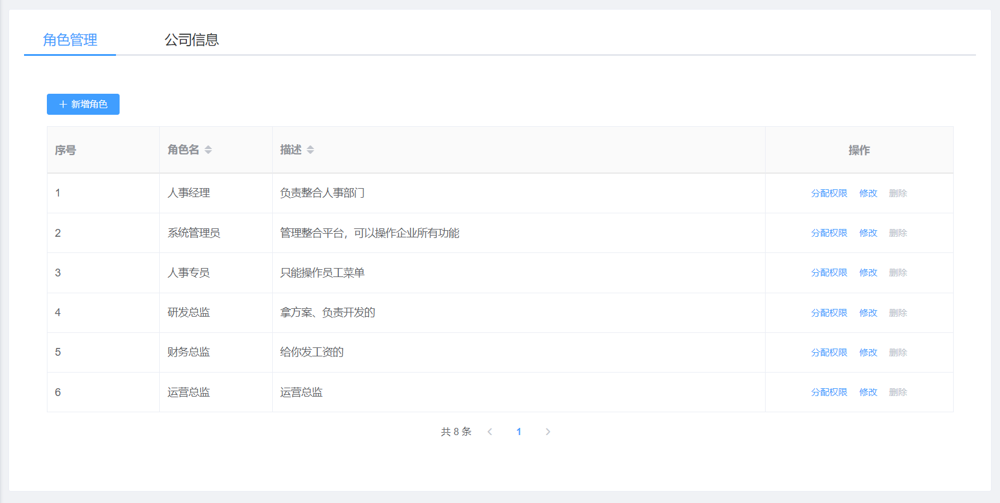
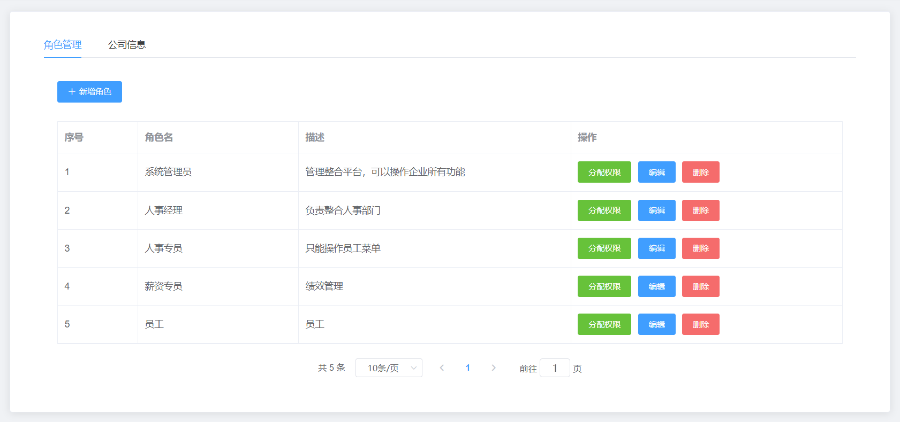
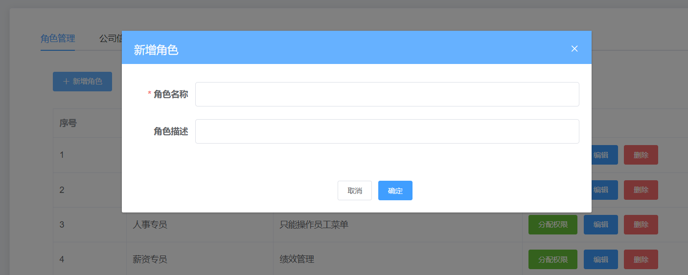
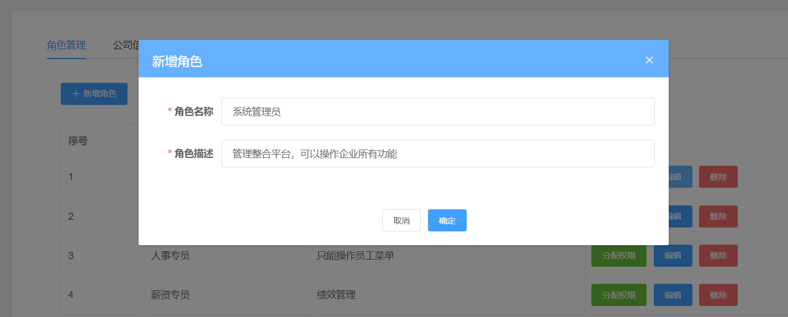

# Day06_角色管理

## 01.角色管理-静态页面搭建

### 目标

实现角色管理静态页面搭建




### 讲解

#### 分析

1.  整体区域的绘制： Card 卡片组件
2.  标签区域的绘制： Tabs 标签页组件 
3.  表格区域的绘制： Table 表格组件
4.   分页去取的绘制： Pagination 分页组件


#### 实现

1. `views/setting/index.vue`中直接复制如下标签结构

```vue
<template>
  <div class="setting-container">
    <div class="app-container">
      <!-- 卡片组件 -->
      <el-card class="box-card">
        <!-- 使用 Tabs 组件完成标签页布局 -->
        <el-tabs v-model="activeName">
          <el-tab-pane label="角色管理" name="first" class="tab-pane">
            <!-- 新增角色按钮 -->
           <el-row style="height:60px">
             <el-button
               icon="el-icon-plus"
               size="small"
               type="primary"
              >新增角色</el-button>
            </el-row>
            <!-- 使用 Table 组件实现用户角色的渲染 -->
            <el-table border style="width: 100%">
              <el-table-column type="index" label="序号" width="120" />
              <el-table-column label="角色名" width="240" />
              <el-table-column label="描述" />
              <el-table-column label="操作">
                <template slot-scope="scope">
                  <el-button size="small" type="success" @click="setRoles(scope.row)">分配权限</el-button>
                  <el-button size="small" type="primary" @click="editRoles(scope.row)">编辑</el-button>
                  <el-button size="small" type="danger" @click="delRoles(scope.row)">删除</el-button>
                </template>
              </el-table-column>
            </el-table>

            <!-- 分页区域 -->
            <el-pagination
              :current-page="query.page"
              :page-sizes="[10, 15, 20, 25]"
              :page-size="query.pagesize"
              layout="total, sizes, prev, pager, next, jumper"
              :total="total"
              @size-change="handleSizeChange"
              @current-change="handleCurrentChange"
            />
          </el-tab-pane>
          <el-tab-pane label="公司信息" class="tab-pane">
            <el-alert
              title="对公司名称、公司地址、营业执照、公司地区的更新，将使得公司资料被重新审核，请谨慎修改"
              type="info"
              show-icon
              :closable="false"
            />
            <el-form label-width="120px" style="margin-top:50px">
              <el-form-item label="公司名称">
                <el-input disabled style="width:400px" />
              </el-form-item>
              <el-form-item label="公司地址">
                <el-input disabled style="width:400px" />
              </el-form-item>
              <el-form-item label="邮箱">
                <el-input disabled style="width:400px" />
              </el-form-item>
              <el-form-item label="备注">
                <el-input type="textarea" :rows="3" disabled style="width:400px" />
              </el-form-item>
            </el-form>
          </el-tab-pane>
        </el-tabs>
      </el-card>
    </div>
  </div>
</template>

<script>
export default {
  data() {
    return {
      activeName: 'first',
      query: {
        page: 1, // 当前页面
        pagesize: 10 // 页面显示的条数
      },
      rolesList: [], // 角色列表
      total: 0 // 角色数据总条数
    }
  },
  methods: {
    // 每页显示的条数发生改变时触发
    handleSizeChange() {},

    // 当前页面发生改变时触发
    handleCurrentChange() {},

    // 设置角色
    setRoles() {},

    // 编辑角色
    editRoles() {},

    // 删除角色
    delRoles() {}
  }
} 
</script>

<style lang="scss" scoped>
.box-card {
  padding: 10px 30px;
}

.tab-pane {
  padding: 20px;
}

.el-pagination {
  text-align: center;
  margin-top: 20px;
}
</style>

```

2. 复制完成后, 挨个读一遍对一遍, 熟悉下代码结构

### 小结

1. el-tabs和el-tab-pane的关系是什么?

   <details>     
   <summary>答案</summary> 
   <ul>
   <li>el-tabs是标签栏导航</li>
   <li>el-tab-pane有几个, 就有几个标签页, 然后夹着对应的内容</li>
   </ul> 
   </details>

 

## 02.角色管理-表格数据铺设

### 目标

1.  调用获取角色信息的接口
2.  完成页面上的数据渲染

### 讲解

#### 思路

1.  封装获取角色列表接口
2.  在组件中调用
3.  渲染数据


####  实现

1.  封装获取角色列表接口，需要添加一个文件，**`src/api/setting.js`** 内容如下：

   ```js
   // 导入axios实例
   import request from '@/utils/request'
   
   /**
    * @description 获取所有角色信息
    * @param {*} params  {page, pagesize}
    * @returns
    */
   export function getRolesAPI(params) {
     return request({
       url: '/sys/role',
       method: 'GET',
       params: params
     })
   }
   
   ```

   

2. 在 `src/views/settings/index.vue` 业务组件中调用接口

   ==别忘了,在api/index.js, 引入导出settings.js接口方法==

   ```js
   import { getRolesAPI } from '@/api'
   export default {
     // ...其他
     created() {
       // 调用获取角色列表的方法
       this.getRolesList()
     },
     methods: {
       // 获取角色列表
       async getRolesList() {
         // 发起请求
         const res = await getRolesAPI(this.query)
         // 根据返回的状态码进行业务处理
         if (!res.success) return this.$message.error(res.message)
         // 将返回的数据进行赋值
         this.rolesList = res.data.rows
         this.total = res.data.total
       },
       // ...其他
     }
   }
   ```

   

3. 渲染表格

   ```vue
   <el-tab-pane label="角色管理" name="first" class="tab-pane">
     <!-- 新增角色按钮 -->
     <el-row style="height:60px">
       <el-button
         icon="el-icon-plus"
         size="small"
         type="primary"
       >新增角色</el-button>
     </el-row>
     <!-- 使用 Table 组件实现用户角色的渲染 -->
     <el-table :data="rolesList" border style="width: 100%">
       <el-table-column type="index" label="序号" width="120" />
       <el-table-column prop="name" label="角色名" width="240" />
       <el-table-column prop="description" label="描述" />
       <el-table-column label="操作">
         <template slot-scope="scope">
           <el-button size="small" type="success" @click="setRoles(scope.row)">分配权限</el-button>
           <el-button size="small" type="primary" @click="editRoles(scope.row)">编辑</el-button>
           <el-button size="small" type="danger" @click="delRoles(scope.row)">删除</el-button>
         </template>
       </el-table-column>
     </el-table>
   
     <!-- 分页区域 -->
     <el-pagination
       :current-page="query.page"
       :page-sizes="[10, 15, 20, 25]"
       :page-size="query.pagesize"
       layout="total, sizes, prev, pager, next, jumper"
       :total="total"
       @size-change="handleSizeChange"
       @current-change="handleCurrentChange"
     />
   </el-tab-pane>
   ```

   

4. 预览效果

   


### 小结 

1. el-table表格如何使用?

   <details>     
   <summary>答案</summary> 
   <ul>
   <li>el-table里data传入数组和对象</li>
   <li>el-table-column的prop设置数据对象的字段</li>
   </ul> 
   </details>


## 03.角色管理-渲染公司信息数据

### 目标

读取并渲染公司信息数据, ==渲染当前登录用户的公司信息==

### 讲解

#### 分析

1.  封装获取公司信息数据的 API
2.  从 Vuex 中取到公司的 ID，传递给 API 方法
3.  调用 API 方法，并将数据赋值给 data 中的数据
4.  将数据在页面上渲染

#### 实现

1.  封装获取公司信息数据的 API

   ```js
   /**
    * @description 获取公司信息
    * @param {*} companyId
    * @returns
    */
   export function getCompanyInfoAPI(companyId) {
     return request({
       url: `/company/${companyId}`
     })
   }
   ```

   

2.  将 companyId 处理成 Getters 属性

   ```js
   const getters = {
     companyId: state => state.user.userInfo.companyId // 公司 ID
   }
   ```

   

3. 在 `src\views\setting\index.vue` 组件中利用辅助函数导入 companyId 

   ```js
   import { mapGetters  } from 'vuex'
   ```

   ```js
   data(){
     return {
         // ...其他选项
         formData: {} // 公司信息对象
     }  
   },
   computed: {
     ...mapGetters(['companyId'])
   },
   created() {
     // ...其他
     // 调用获取公司信息的方法
     this.getCompanyInfo()
   },
   methods: {
     // 获取的公司的信息
     async getCompanyInfo() {
       const res = await getCompanyInfoAPI(this.companyId)
       if (!res.success) return this.$message.error(res.message)
       this.formData = res.data
     }
   }
   ```

   

4.  渲染页面

   ```vue
   <el-form :model="formData" label-width="120px" style="margin-top:50px">
     <el-form-item label="公司名称">
       <el-input v-model="formData.name" disabled style="width:400px" />
     </el-form-item>
     <el-form-item label="公司地址">
       <el-input v-model="formData.companyAddress" disabled style="width:400px" />
     </el-form-item>
     <el-form-item label="邮箱">
       <el-input v-model="formData.mailbox" disabled style="width:400px" />
     </el-form-item>
     <el-form-item label="备注">
       <el-input v-model="formData.remarks" type="textarea" :rows="3" disabled style="width:400px" />
     </el-form-item>
   </el-form>
   ```

   

5.  预览效果

   


### 小结

1. 当前登录的角色, 公司信息如何获取回来的?

   <details>     
   <summary>答案</summary> 
   <ul>
   <li>登录后有token, 在路由切换时, 获取用户的信息, 包含用户所在公司的ID</li>
   <li>然后使用公司ID, 换回公司相关信息, 铺设到表单里显示</li>
   </ul> 
   </details>


## 04.角色管理-添加角色弹框展示

### 目标

实现添加角色弹框的展示


### 讲解

#### 分析

1. 点击新增角色展示弹框
2.  弹框中有两个表单项：角色名称和角色描述，其中角色名称为必填项
3.  点击确定按钮先进行表单验证，验证通过之后调用新增接口创建角色
4.  点击取消按钮弹框关闭，并清空表单内容及验证内容 


#### 实现

1. 对弹框的布局进行绘制

   ```vue
   <!-- 卡片组件 -->
   
   <!-- 新增弹框 -->
   <el-dialog
     title="新增角色"
     :close-on-click-modal="false"
     :close-on-press-escape="false"
     :visible.sync="showDialog"
   >
     <el-form ref="roleForm" :model="roleForm" :rules="roleRules" label-width="100px">
       <el-form-item label="角色名称" prop="name">
         <el-input v-model="roleForm.name" />
       </el-form-item>
       <el-form-item label="角色描述" prop="description">
         <el-input v-model="roleForm.description" />
       </el-form-item>
     </el-form>
   
     <!-- 底部 -->
     <el-row slot="footer" type="flex" justify="center">
       <el-col :span="6">
         <el-button size="small" @click="cancleRoles">取消</el-button>
         <el-button size="small" type="primary" @click="roleSubmit">确定</el-button>
       </el-col>
     </el-row>
   </el-dialog>
   ```
   
   
   
2. 绑定页面需要使用的数据

   - showDialog:  来表示弹层是否关闭

   - roleForm:  表单数据，具体的字段名称与后端接口一致

   - roleRules:  验证规则

   ```js
   data() {
     return {
       // ...其他选项
       showDialog: false, // 控制弹框的隐藏和展示
       // 添加角色
       roleForm: {
         name: '',
         description: ''
       },
       // 添加角色验证
       roleRules: {
         name: [
           { required: true, message: '角色名称不能为空', trigger: 'blur' }
         ],
         description: [
           { required: true, message: '角色描述不能为空', trigger: 'blur' }
         ]
       }
     }
   }
   ```

   

3. 绑定页面需要使用的事件

   ```js
   methods: {
     // ...其他
     // 角色弹框-> 确定按钮
       roleSubmit() {
         this.showDialog = false
       },
   
       // 角色弹框-> 取消按钮
       cancleRoles() {
         this.showDialog = false
       }
   }
   ```

   

4. 点击添加角色按钮，显示弹框

   ```vue
   <el-button
              icon="el-icon-plus"
              size="small"
              type="primary"
              @click="addRoleBtnFn"
              >新增角色</el-button>
   
   <script>
       export default {
           methods: {
               // ...其他
               // 新增角色->按钮点击事件
               addRoleBtnFn() {
                   this.showDialog = true
               }
           }
       }
   </script>
   ```

   

5.  点击左上角新增角色看是否出现, 点击确定和取消看是否隐藏

   

   

### 小结

1. el-form表单校验需要配置的是哪几项?

   <details>     
   <summary>答案</summary> 
   <ul>
   <li>el-form和el-form-item和具体表单项</li>
   </ul> 
   </details>


## 05.角色管理-添加角色功能实现

### 目标

完成添加角色的功能

### 讲解

#### 分析

1.   封装添加角色功能的 API
2.   点击确定按钮进行**表单校验**，校验通过以后，调用接口，成功调用之后要完成三件事情
   - 重新拉取角色列表，让新增的数据得以显示
   - 提示用户本次操作已成功
   - 关闭弹框

#### 实现

1.   在 `src\api\setting.js`  文件中封装添加角色功能的 API

   ```js
   /**
    * @description: 新增角色
    * @param {*} data {name,description}
    * @return {*}
    */
   export function addRoleAPI(data) {
     return request({
       url: '/sys/role',
       method: 'post',
       data
     })
   }
   ```

   

2.  在 `src\views\setting\index.vue` 文件中导入 API 方法，并在确定的事件处理程序中调用

   ```js
   import { addRoleAPI } from '@/api'
   ```

   ```js
   // 角色弹框-> 确定按钮
       roleSubmit() {
         this.$refs.roleForm.validate(async valid => {
           if (valid) {
             // 调用新增角色的 API
             const res = await addRoleAPI(this.roleForm)
             // 根据状态码判断请求成功与否
             if (!res.success) return this.$message.error(res.message)
             // 添加成功，给用户进行提示
             this.$message.success(res.message)
             // 重新获取权限列表数据
             this.getRolesList()
             // 隐藏弹框
             this.showDialog = false
           }
         })
       }
   ```

   

### 小结

1. 业务问题, 这个角色功能到底有什么用?

   <details>     
   <summary>答案</summary> 
   <ul>
   <li>用于设置角色的身份权限</li>
   </ul> 
   </details>


## 06.角色管理-编辑角色思路分析

### 目标

分析出编辑角色的基本步骤和思路

### 讲解

#### 分析

1.  点击`编辑`按钮
2.  展示弹框，数据回显：把当前的详情数据展示出来
3.  点击确定，保存结果


**要点**

1. 它与添加操作共用一个表单
2. 表单中需要的两个数据在表格数据中已经有了，不需要再次发请求去取了

### 小结

1. 我们编辑角色的思路是?

   <details>     
   <summary>答案</summary> 
   <ul>
   <li>与添加表单, 共用一个弹框dialog+表单</li>
   <li>我们一会儿可以把数据回显上去</li>
   </ul> 
   </details>


## 07.角色管理-编辑角色数据回显

### 目标

1.  实现编辑角色数据的获取
2.  实现编辑角色数据的回显

### 讲解

#### 分析

1.  封装获取当前角色数据的 API 方法
2.  点击编辑，获取当前这一行的 ID 
3.   调用该方法，将获取到的这一行数据赋值给 data 中的 formData

#### 实现

1.  封装获取当前角色数据的 API 方法

   ```js
   /**
    * @description: 获取某一个角色列表
    * @param {*} id
    * @return {*}
    */
   export function getRoleIdAPI(id) {
     return request({
       url: `/sys/role/${id}`
     })
   }
   ```

   

2.  点击编辑，获取当前这一行数据

   ```vue
   <el-button size="small" type="primary" @click="editRoles(scope.row)">编辑</el-button>
   ```

   ```js
   // 编辑角色
   async editRoles(dataObj) {
       // 调用接口，获取需要编辑的角色数据
       const res = await getRoleIdAPI(dataObj.id)
       if (!res.success) return this.$message.error(res.message)
       this.roleForm = res.data
       // 让弹框展示
       this.showDialog = true
   },
   ```

   

3.   数据赋值给 roleForm 以后，数据就会展示在弹框中




### 小结

1. 编辑角色数据传递的ID指的是什么?

   <details>     
   <summary>答案</summary> 
   <ul>
   <li>这个id指的这一行角色的, 数据id</li>
   </ul> 
   </details>


## 08.角色管理-编辑功能完成

### 目标

实现用户编辑功能的完成

### 讲解

#### 分析

1.  因为编辑和新增公用的是一个弹框，因此需要区分是编辑还是新增 
2. 封装编辑功能的 API
3.  用户点击确定，调用 API 同时向接口传递数据 

#### 实现

1. 判断是新增还是编辑角色

   - 声明状态 isEdit 为 false
   - 在点击添加以及编辑按钮时，对状态进行改变

   ```js
   data() {
     return {
       // ...其他选项
       isEdit: false // 是否处于编辑状态
     }
   }
   ```

   
   
   ```js
   methods: {
     // 新增角色 - 按钮点击事件
     addRoleBtn() {
        this.isEdit = false // 现在不是编辑状态
        this.showDialog = true // 弹窗出现
     },
   
     // 编辑角色
     async editRoles(id) {
       // 是否编辑状态
       this.isEdit = true
       // 调用接口，获取需要编辑的角色数据
       const res = await getRoleId(id)
       if (!res.success) return this.$message.error(res.message)
       this.roleForm = res.data
       // 让弹框展示
       this.showDialog = true
     }
   }
   ```
   
   
   
2.  封装编辑功能的 API

   ```js
   /**
    * @description: 编辑角色
    * @param {*} data
    * @return {*}
    */
   export function updateRoleAPI(data) {
     return request({
       url: `/sys/role/${data.id}`,
       method: 'put',
       data
     })
   }
   ```

   

3.  在组件中导入 API，并调用

   ```js
   import { updateRoleAPI } from '@/api'
   ```

   ```js
   // 角色弹框-> 确定按钮
       roleSubmit() {
         this.$refs.roleForm.validate(async valid => {
           if (valid) {
             if (!this.isEdit) {
             // 调用新增角色的 API
               const res = await addRoleAPI(this.roleForm)
               // 根据状态码判断请求成功与否
               if (!res.success) return this.$message.error(res.message)
               // 添加成功，给用户进行提示
               this.$message.success(res.message)
             } else {
             // 调用编辑角色的 API
               const res = await updateRoleAPI(this.roleForm)
               // 根据状态码判断请求成功与否
               if (!res.success) return this.$message.error(res.message)
               // 编辑成功，给用户进行提示
               this.$message.success(res.message)
             }
   
             // 重新获取权限列表数据
             this.getRolesList()
             // 隐藏弹框
             this.showDialog = false
           }
         })
       }
   ```
   
   

4.  实现弹框提示改变

   ```vue
   <el-dialog
     :title="isEdit ? '编辑角色' : '新增角色'"
     :close-on-click-modal="false"
     :close-on-press-escape="false"
     :visible.sync="showDialog"
   >
   </el-dialog>
   ```
   


### 小结

1. 编辑和新增最大的区别在哪里?

   <details>     
   <summary>答案</summary> 
   <ul>
   <li>在数据回显后, 用户编辑资料内容还会绑定到form对象表单上</li>
   <li>在通过校验后, 判断isEdit变量值状态, 来决定新增还是编辑</li>
   </ul> 
   </details>


## 09.角色管理-分页功能

### 目标

实现角色管理页面的分页功能

### 讲解

#### 分析

1.  监听页面显示的条数是否改变：当每页显示的条数发生改变时表格数据需要改变
2.  监听页码是否发生改变：当页码发生改变时表格需要改变

#### 实现

1. 之前已经定义分页需要绑定的参数，并传递给请求角色列表的方法

   ```js
   methods: {
     // 获取角色列表
     async getRolesList() {
       // 发起请求
       const res = await getRolesAPI(this.query)
       // 根据返回的状态码进行业务处理
       if (!res.success) return this.$message.error(res.message)
       // 将返回的数据进行赋值
       this.rolesList = res.data.rows
       this.total = res.data.total
     }
   }
   ```

   

2.  监听页面显示的条数是否改变

   ```js
   methods: {
     // 每页显示的条数发生改变时触发
       handleSizeChange(newSize) {
         this.query.pagesize = newSize
         this.getRolesList()
       },
   }
   ```

   

3.  监听页码是否发生改变

   ```js
   methods: {
     // 当前页面发生改变时触发
       handleCurrentChange(newPage) {
         this.query.page = newPage
         this.getRolesList()
       },
   }
   ```

   

### 小结

1. 分页功能实现的思路是?

   <details>     
   <summary>答案</summary> 
   <ul>
   <li>找到分页接口的, 然后分析需要传递什么参数</li>
   <li>在data中定义好对应的变量名, 然后传入个API接口</li>
   <li>监听页码和每页数量改变, 同步到变量中, 重新调用接口, 重新铺设当前页面数据</li>
   </ul> 
   </details>


## 10.角色管理-删除角色功能

### 目标

实现删除角色的功能

### 讲解

#### 分析

1.  查阅接口文档，封装删除角色的 API
2.  给删除按钮绑定点击事件，弹出确认对话框
3.  确认删除则调用封装的 API
4.  删除成功以后，重新刷新页面

#### 实现

1.  封装删除角色的 API，并在组件中导入

   ```js
   /**
    * @description: 删除角色
    * @param {*} id 角色id
    * @return {*}
    */
   export function deleteRoleAPI(id) {
     return request({
       url: `/sys/role/${id}`,
       method: 'delete'
     })
   }
   ```

   ```js
   import { deleteRoleAPI } from '@/api'
   ```

   

2.   显示确认对话框

   ```js
     // 删除角色
     async deleteRole(dataObj) {
       // 显示删除询问对话框
       const delRes = await this.$confirm('此操作将永久删除该角色, 是否继续?', '提示', {
         confirmButtonText: '确定',
         cancelButtonText: '取消',
         type: 'warning'
       }).catch(err => err)
       
       console.log(delRes)
     }
   ```

   

3. 标签传递数据对象下来

   ```vue
    <el-button size="small" type="danger" @click="delRoles(scope.row)">删除</el-button>
   ```

   

4. 调用接口，实现删除功能

   ```js
   // 删除角色
       async delRoles(dataObj) {
       // 显示删除询问对话框
         const delRes = await this.$confirm('此操作将永久删除该角色, 是否继续?', '提示', {
           confirmButtonText: '确定',
           cancelButtonText: '取消',
           type: 'warning'
         }).catch(err => err)
   
         // 用户点击了取消，给用户进行提示
         if (delRes === 'cancel') return this.$message.info('您取消了删除')
   
         // 调用删除的 API
         const res = await deleteRoleAPI(dataObj.id)
   
         // 根据返回的状态码进行错误提示
         if (!res.success) return this.$message.error(res.message)
         // 删除成功后的提示
         this.$message.success(res.message)
         // 重新获取数据
         this.getRolesList()
       },
   ```
   
   

### 小结

1. 删除功能实现的思路是?

   <details>     
   <summary>答案</summary> 
   <ul>
   <li>删除按钮, 点击事件, 传递要删除的选项id</li>
   <li>调用接口, 接收响应结果, 成功/失败的提示</li>
   <li>重新获取数据</li>
   </ul> 
   </details>


## 11.角色管理-删除角色的分页异常处理

### 目标

解决删除最后一页的最一条数据之后，页面会显示不正常

### 讲解

#### 分析

如果删除第最后一页 (假设是第2页) 的最一条数据之后，再发请求，还是求的第2页，而此时，后端已经求不到第2 页的数据了(被删除了)

在删除成功之后，去检测一下，是否当前删除的是当前页最后一条数据，如果是，就把页码-1，再发请求

#### 实现

```js
methods: {
  // 删除角色
  async delRoles(id) {
    // 显示删除询问对话框
    const delRes = await this.$confirm('此操作将永久删除该角色, 是否继续?', '提示', {
      confirmButtonText: '确定',
      cancelButtonText: '取消',
      type: 'warning'
    }).catch(err => err)

    // 用户点击了取消，给用户进行提示
    if (delRes === 'cancel') return this.$message.info('您取消了删除')

    // 调用删除的 API
    const res = await deleteRoleAPI(id)

    // 根据返回的状态码进行错误提示
    if (!res.success) return this.$message.error(res.message)
    // 删除成功后的提示
    this.$message.success(res.message)
      
    // 判断当前数据的长度是否等于 1
    if (this.rolesList.length === 1) {
      this.query.page--
      // 如果是第一页的第一条
      if (this.query.page === 0) {
        this.query.page = 1
      }
    }  
      
    // 重新获取数据
    this.getRolesList()
  
}
```


### 小结

1. 为何最后一页, 删除最后一条会有问题?

   <details>
   <summary>答案</summary>
   <ul>
   <li>删除后, 刷新列表的时候, 虽然组件标签页码变化了</li>
   <li>但是变量参数page的值未变, 所以请求的还是刚才最后一页的数据</li>
   </ul>
   </details>

2. 针对删除最后一页, 最后一条的bug如何解决?

   <details>
   <summary>答案</summary>
   <ul>
   <li>在删除后, 判断当前数组里是否剩余1条, 证明这最后一条要被删除了</li>
   <li>立刻自己让page--, 再判断不能减少到0, 所以为0时, 让page为1</li>
   </ul>
   </details>


## 12.角色管理-关闭弹层重置数据

### 目标

在弹框关闭以后，清空弹框中表格的数据

### 讲解

#### 分析

1.   在点击取消时需要清空表单数据
2.   在点击 x 图标时需要清空表单数据
3.   在点击确定/取消关闭时清空表单数据
4.   总结: 直接给dialog绑定close事件, 无论怎么关闭, 直接在关闭时清空

#### 实现

1. dialog身上绑定close事件

   ```vue
   <el-dialog
           :title="isEdit ? '编辑角色' : '新增角色'"
           :close-on-click-modal="false"
           :close-on-press-escape="false"
           :visible.sync="showDialog"
           @close="closeRoleDialog"
   >
   ```

   

2. 创建清除数据的方法, 在取消里

   ```js
   methods: {
     // 关闭角色弹框
     closeRoleDialog() {
       this.$refs.roleForm.resetFields()
       this.showDialog = false
     }
   }
   ```

   

### 小结

1. 先点击编辑, 后点击新增时, 为何表单里会有刚才的数据?

   <details>     
   <summary>答案</summary> 
   <ul>
   <li>因为编辑和新增用的同一个表单组件和数据对象, v-model关联的对象被赋值</li>
   <li>所以点击编辑, 使用的同一个数据对象, 标签里有值</li>
   </ul> 
   </detail

2. 如何处理上面的问题?

   <details>
   <summary>答案</summary>
   <ul>
   <li>在dialog关闭事件中, 把表单清空, 可以用el-form组件对象自带的resetFields方法</li>
   </ul>
   </details>


