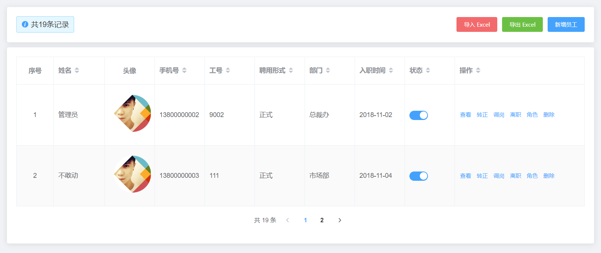
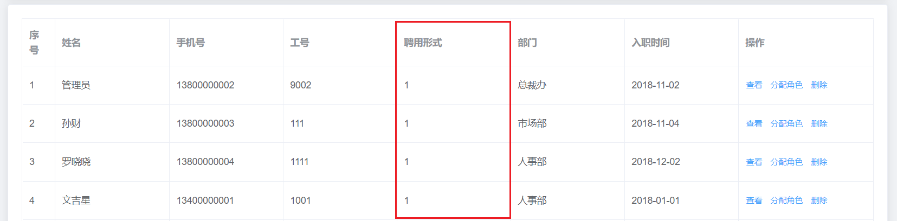
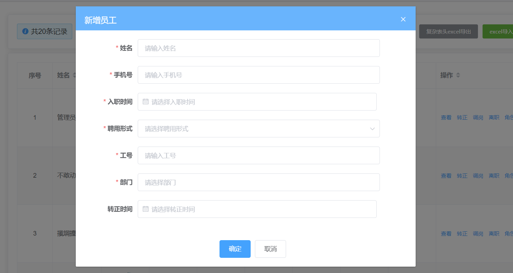
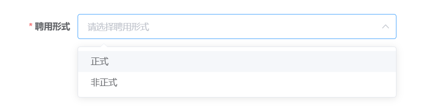
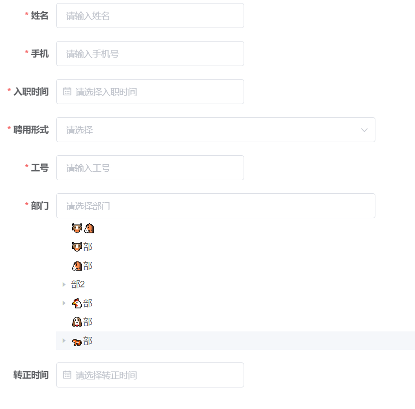

# Day07_员工管理

## 01.员工管理-头部组件-封装使用

### 目标

核心功能分析：

1.  PageTools 公共组件封装
2.  Excel 导入导出功能
3.  员工列表表格渲染
4.  分页功能


### 讲解

#### 分析

在后续的业务开发中，我们经常会用到一个类似下图的工具栏，因此需要可以将其封装成公共组件，方便复用


问： 左侧的提示消息 和 右侧按钮 在每个页面中并不是一致的，怎么处理呢 ？

<details>
<summary>答案</summary>
<ul>
<li>具名插槽</li>
</ul>
</details>

#### 实现

1.  创建组件实现基本结构，新建 `src\components\PageTools\index.vue` 文件,，实现页面结构的创建

   ```vue
   <template>
     <el-card>
       <div class="page-tools">
         <!-- 左侧 -->
         <div class="left">
           <div class="tips">
             <i class="el-icon-info" />
             <span>文字区域</span>
           </div>
         </div>
   
         <div class="right">
           <!-- 右侧 -->
           按钮区域
         </div>
       </div>
     </el-card>
   </template>
   
   <script>
   export default {}
   </script>
   
   <style lang="scss" scoped>
   .page-tools {
     display: flex;
     justify-content: space-between;
     align-items: center;
   
     .tips {
       line-height: 34px;
       padding: 0px 15px;
       border-radius: 5px;
       border: 1px solid rgba(145, 213, 255, 1);
       background: rgba(230, 247, 255, 1);
   
       i {
         margin-right: 10px;
         color: #409eff;
       }
     }
   }
   </style>
   
   ```

   

2.  定义左右两侧内容的具名插槽

   - 我们定义了两个具名插槽，将来在使用组件的时候，只需要按照对应的插槽名称就可以在特定的位置插入内容
   - slot-left 左侧的文本区域
   - slot-right 右侧按钮区域

   ```vue
   <template>
     <el-card>
       <div class="page-tools">
         <!-- 左侧 -->
         <div class="left">
           <div class="tips">
             <i class="el-icon-info" />
             <slot name="slot-left">
               <span>文字区域</span>
             </slot>
           </div>
         </div>
   
         <div class="right">
           <!-- 右侧 -->
           <slot name="slot-right">
             <span>按钮区域</span>
           </slot>
         </div>
       </div>
     </el-card>
   </template>
   ```

   

3.  在 `src\views\employees\index.vue` 组件中使用封装的 PageTools 组件

   - 导入注册组件
   - 使用组件的时候注入自定义内容

   ```vue
   <template>
     <div class="employees-container">
       <div class="app-container">
         <!-- 通用工具栏组件使用 -->
         <page-tools>
           <!-- 自定义左侧内容 -->
           <template #slot-left>
             <span>共 19 条记录</span>
           </template>
   
           <!-- 自定义右侧内容 -->
           <template #slot-right>
             <el-button type="danger" size="small">导入excel</el-button>
             <el-button type="success" size="small">导出excel</el-button>
             <el-button type="primary" size="small">新增员工</el-button>
           </template>
         </page-tools>
       </div>
     </div>
   </template>
   
   <script>
   // 导入组件
   import PageTools from '@/components/PageTools'
   
   export default {
     components: {
       PageTools // 导入自定义组件
     }
   }
   </script>
   
   <style lang="scss" scoped></style>
   
   ```


### 小结

1. 我们为什么要封装头部组件?

   <details>     
   <summary>答案</summary> 
   <ul>
   <li>因为后面有多个页面需要使用的这个组件, 所以我们要封装下</li>
   </ul> 
   </details>


## 02.员工管理-头部组件-全局注册

### 目标

1.  将工具栏组件进行全局注册
2.  熟练将组件抽取成全局组件的流程

### 讲解

#### 分析

在上一节，我们将业务组件在 components 中进行注册，定义成了局部组件，这种方式能够满足我们的业务，但这种写法会导致公用的组件需要在多个组件中分别进行注册，造成代码冗余。因此我们会将 `全局通用组件进行全局注册`

1.  将组件在入口文件进行导入
2.  使用 Vue.component 进行全局组件的绑定

#### 实现

1.  在 main.js 文件中导入组件并进行注册

   ```js
   // 导入组件
   import PageTools from '@/components/PageTools'
   
   // 注册组件
   Vue.component('PageTools', PageTools)
   ```

   

2.  将局部注册的导入、注册代码进行删除


### 小结

1. 组件使用的基本步骤有哪些?

   <details>     
   <summary>答案</summary> 
   <ul>
   <li>创建, 引入, 注册, 使用组件</li>
   </ul> 
   </details>
   
2. 注册组件, 有哪2种方式?

   <details>     
   <summary>答案</summary> 
   <ul>
   <li>局部components选项注册</li>
   <li>main.js入口处, 用Vue.component()全局注册组件方法</li>
   </ul> 
   </details>

3. 局部注册和全局注册的区别?

   <details>
   <summary>答案</summary>
   <ul>
   <li>局部注册, 只能在当前.vue组件中使用</li>
   <li>全局注册, 任意组件内使用, 但是一定要先走全局注册再走使用</li>
   </ul>
   </details>


## 03.员工管理-头部组件-Vue插件

> 上一节，虽然我们非常方便的将组件进行了全局注册
>
> 但是大家想象一个场景：如果我们需要注册的全局组件非常多，我们需要一个一个引入，然后分别调用 Vue.component 方法
>
> main.js 文件会变的很大，不好维护，为了解决这个问题，我们学习一下 Vue插件 的形式

### 目标

掌握 Vue.use() 的用法，能用它来注册全局组件

### 讲解

#### 分析

1.   什么是 Vue.use()  ？

   - 它是 Vue 提供一个静态方法，用来向 Vue 注册插件，点击 [Vue-use 文档](https://cn.vuejs.org/v2/api/#Vue-use)

2.   使用格式 ？

   ```js
   Vue.use(obj)
   ```

   - Vue.use 可以接收一个对象，Vue.use(obj)  
   - 对象 obj 中需要提供一个 **install** 函数
   - 在 Vue.use(obj) 时，会自动调用该 install 函数，并传入 Vue构造器
   - 如果传入Vue.use()里是一个函数, 直接传入Vue构造器, 直接执行此函数

#### 代码

1. 在 main.js 文件中体验下 Vue.use()

   ```js
   const MyInstall = {
     install(Vue) {
       // 在 install 方法中，使用 Vue.component 挂载组件
       Vue.component('PageTools', PageTools)
     }
   }
   
   Vue.use(MyInstall)
   ```

   

2.  我们可以把这个配置对象, 封装到`src/components/index.js`中, 导出此对象到main.js中给Vue.use使用

   ```js
   /**
    * 进行全局组件的挂载
    */
   
   import PageTools from './index.vue'
   
   export default {
     install(Vue) {
       Vue.component('PageTools', PageTools)
     }
   }
   
   ```
   


3. main.js中导入注册

   ```js
   // 导入组件
   import GlobalComponents from '@/components/index.js'
   Vue.use(GlobalComponents)
   ```

   


### 小结

1. Vue.use方法有什么作用?

   <details>     
   <summary>答案</summary> 
   <ul>
   <li>Vue.use用于给Vue添加中间件函数插件</li>
   </ul> 
   </details>
   
   
2. Vue.use()中可以传入什么?

   <details>
   <summary>答案</summary>
   <ul>
   <li>如果传入的是函数, 执行此函数传入Vue类作为参数</li>
   <li>如果传入的是对象, 必须有install方法, 会自动执行此方法, 传入Vue作为参数</li> 
   </ul>
   </details>


3. 为何要把对象封装的js文件内?

   <details>
   <summary>答案</summary>
   <ul>
   <li>以后要是再注册全局组件, 写到这个js中的插件对象中, 方便管理</li>
   </ul>
   </details>


## 04.员工管理-员工列表-静态结构

### 目标

实现员工管理页面静态结构搭建



### 讲解

#### 分析

1.  表格区域：使用 Table 表格 组件实现
   - 操作列使用 作用域插槽 实现
2.   分页区域：使用 Pagination 分页 组件实现

#### 实现

```vue
<template>
  <div class="employees-container">
    <div class="app-container">
      <!-- 通用工具栏组件使用 -->
      <page-tools>
        <!-- 自定义左侧内容 -->
        <template #slot-left>
          <span>共19条记录</span>
        </template>

        <!-- 自定义右侧内容 -->
        <template #slot-right>
          <el-button type="danger" size="small">导入excel</el-button>
          <el-button type="success" size="small">导出excel</el-button>
          <el-button type="primary" size="small">新增员工</el-button>
        </template>
      </page-tools>

      <el-card style="margin-top: 10px;">
        <el-table border>
          <el-table-column label="序号" />
          <el-table-column label="姓名" />
          <el-table-column label="头像" />
          <el-table-column label="手机号" />
          <el-table-column label="工号" />
          <el-table-column label="聘用形式" />
          <el-table-column label="部门" />
          <el-table-column label="入职时间" />
          <el-table-column label="操作" width="280">
            <template>
              <el-button type="text" size="small">查看</el-button>
              <el-button type="text" size="small">分配角色</el-button>
              <el-button type="text" size="small">删除</el-button>
            </template>
          </el-table-column>
        </el-table>
        <!-- 分页组件 -->
        <el-row type="flex" justify="center" align="middle" style="height: 60px">
          <!-- 分页区域 -->
          <el-pagination
            :current-page="query.page"
            :page-sizes="[10, 15, 20, 25]"
            :page-size="query.size"
            layout="total, sizes, prev, pager, next, jumper"
            :total="total"
            @size-change="handleSizeChange"
            @current-change="handleCurrentChange"
          />
        </el-row>
      </el-card>
    </div>
  </div>
</template>

<script>
export default {
  name: 'Employees',
  data() {
    return {
      query: {
        page: 1, // 页码
        size: 10 // 每页条数
      },
      employeesList: [], // 员工列表
      total: 0 // 数据总条数
    }
  },

  methods: {
    // 每页显示的条数发生改变时触发
    handleSizeChange(newSize) {},

    // 当前页面发生改变时触发
    handleCurrentChange(newPage) {}
  }
}
</script>

<style lang="scss" scoped></style>
```


### 小结

1. el-table-column有什么用?

   <details>
   <summary>答案</summary>
   <ul>
   <li>elementUI封装的组件, 设置表格有多少列</li>
   </ul>
   </details>

2. el-table表格, 如何确定有多少行和列?

   <details>
   <summary>答案</summary>
   <ul>
   <li>el-table中data属性对应数组里对象, 有多少个, 内部循环多少行表格</li>
   <li>el-table-column决定有多少列</li>
   </ul>
   </details>

3. Pagination组件特点是什么?

   <details>
   <summary>答案</summary>
   <ul>
   <li>只实现了标签创建和点击的事件触发和回调, JS中的数据逻辑包括请求都自己写</li>
   </ul>
   </details>


## 05.员工管理-员工列表-数据获取

### 目标

实现员工的数据加载

### 讲解

#### 思路

-  封装获取员工列表 api
- 在创建组件时调用获取员工列表数据的方法
- 将返回的数据赋值给 data 中的数据

####  实现

1.  封装获取员工列表 api，在 `src/api/employees.js` 文件中封装员工的加载请求 

   ```js
   /**
    * @description: 获取员工列表
    * @param {*} params {page:当前页,size：每页条数}
    * @return {*}
    */
   export function getEmployeeListAPI(params) {
     return request({
       url: '/sys/user',
       methods: 'get',
       params
     })
   }
   ```
   
   
   
2. 在`api/index.js`导出

   ```js
   export * from './employees.js'
   ```

   

3. 调用接口获取数据，在组件 `src/employees/employees.vue` 中引入上边定义的方法并调用

   ```js
   created() {
     // 调用获取员工列表的方法
     this.getEmployeeList()
   },
   
   methods: {
     // 获取员工列表
     async getEmployeeList() {
         // 调用获取员工列表的 API
         const res = await getEmployeeListAPI(this.query)
         console.log(res)
         // 根据返回的状态码给用户提示
         if (!res.success) return this.$message.error(res.message)
         // 将返回的结果赋值 data 中的数据
         this.employeesList = res.data.rows
         this.total = res.data.total
       }
   }
   ```

   

### 小结

1. 获取员工列表数据, 如何只获取第1页的10条数据呢?

   <details>     
   <summary>答案</summary> 
   <ul>
   <li>需要注意传参, 当前页码和当前页需要的数量, 以及Pagination组件对应上</li>
   </ul> 
   </details>

2. 如何确保请求的数据页数和条数和Pagination组件显示的一致?

   <details>
   <summary>答案</summary>
   <ul>
   <li>Vue准备页码page变量和size,影响标签显示, 影响数据的获取</li>
   </ul>
   </details>


## 06.员工管理-员工列表-数据渲染

### 目标

1.  实现员工列表页面的渲染
2.  实现员工列表页分页的渲染

### 讲解

#### 分析

1.   按后端数据的格式内容，修改对应 el-table-colum 的 prop 属性
2.   按 el-pagination 组件的要求，在页面中添加与分页相关的数据项同时监听页面改变事件

#### 实现

1. 按后端数据的格式内容，修改对应 el-table-colum 的 prop 属性, ==直接复制==

   ```vue
   <el-table border :data="employeesList">
       <el-table-column label="序号" type="index" />
       <el-table-column label="姓名" prop="username" />
       <el-table-column label="头像" prop="staffPhoto" />
       <el-table-column label="手机号" prop="mobile" />
       <el-table-column label="工号" prop="workNumber" />
       <el-table-column label="聘用形式" prop="formOfEmployment" />
       <el-table-column label="部门" prop="departmentName" />
       <el-table-column label="入职时间" prop="timeOfEntry" />
       <el-table-column label="操作" width="280">
           <template>
               <el-button type="text" size="small">查看</el-button>
               <el-button type="text" size="small">分配角色</el-button>
               <el-button type="text" size="small">删除</el-button>
           </template>
       </el-table-column>
   </el-table>
   ```

   

2. 按 el-pagination 组件的要求，在页面中添加与分页相关的数据项同时监听页面改变事件==已绑好==

   ```vue
   <!-- 分页组件 -->
   <el-row type="flex" justify="center" align="middle" style="height: 60px">
     <!-- 分页区域 -->
     <el-pagination
       :current-page="query.page"
       :page-sizes="[10, 15, 20, 25]"
       :page-size="query.size"
       layout="total, sizes, prev, pager, next, jumper"
       :total="total"
       @size-change="handleSizeChange"
       @current-change="handleCurrentChange"
     />
   </el-row>
   ```

3. 在事件处理函数中, 实现请求和切换数据的逻辑

   ```js
   methods: {
     // 每页显示的条数发生改变时触发
     handleSizeChange(newSize) {
       this.query.size = newSize
       this.getEmployeeList()
     },
   
     // 当前页面发生改变时触发
     handleCurrentChange(newPage) {
       this.query.page = newPage
       this.getEmployeeList()
     }
   }
   ```

   

### 小结

1. 分页切换数据是如何做的?

   <details>     
   <summary>答案</summary> 
   <ul>
   <li>使用分页组件, 监听分页的点击事件, 切换query的参数</li>
   <li>然后重新请求数据, 拿到数据更新到表格里</li>
   </ul> 
   </details>


## 07.员工管理-员工列表-格式化聘用形式

### 目标

将后端直接给到的数据做进行格式化处理

### 讲解

#### 分析




1.  后端给到我们前端的是一个数字类型的状态码(1,  2)，每一个状态码对应有中文说明，其中
   - 1 代表 正式
   - 2 代表 非正式


2.  问：那么如何将 数字类型的状态码 转换成对应的中文呢 ？

    答：通过枚举的方式转换成文字即可，

   ​		枚举数据存放于我们提供的**`资源/枚举`**中，可以将枚举下的 constant 文件夹复制到`src/`文件夹下
   
   ```js
   {
     // 聘用形式
     hireType: [
       {
         id: 1,
         value: '正式'
       },
       {
         id: 2,
         value: '非正式'
       }
     ]
     // ...其他
   }
   ```
   
   


3. 问：表格某列如何格式化数据呢?

   答：查阅elementUI文档, 借助 `el-table-column` 的 `formatter` 属性进行设置

   ```vue
   <el-table-column
     prop="formOfEmployment"
     label="聘用形式"
     :formatter="formatter">
   </el-table-column>
   ```

   ```js
   methods: {
     formatter(row) {
       // row对应行的数据对象
       return row.formOfEmployment;
     }
   }
   ```
   
   

#### 实现

1. 在`api/constant/employees.js`定义工具对象

   ==我们可以复制预习资料里对应的文件==

   ```js
   // 员工
   export default {
     // 聘用形式
     hireType: [
       {
         id: 1,
         value: '正式'
       },
       {
         id: 2,
         value: '非正式'
       }
     ]
     // ...其他
   }
   ```

   

2. 给聘用形式这一栏绑定 formatter 属性

   ```vue
   <el-table-column prop="formOfEmployment" label="聘用形式" :formatter="formatter" />
   ```

   

3. 在 methods 中声明 formatter 方法

   ```js
   import Employees from '@/api/constant/employees'
   
   methods: {
       // 格式化表格的某一项
       formatter(row, column, cellValue, index) {
           // 用数组的 find 方法找到 id = 1 的元素，再取出它的 value
           const obj = Employees.hireType.find((item) => item.id === cellValue)
           return obj ? obj.value : '未知'
       }
   }
   ```

   

4. 预览效果

   

   

### 小结

1. Employees.hireType.find这个是什么意思?

   <details>     
   <summary>答案</summary> 
   <ul>
   <li>从Employees对象里取出某个属性的值, Employees.hireType是个数组, 然后用find查找符合目标的对象</li>
   </ul> 
   </details>

## 08.员工管理-员工列表-格式化入职时间

### 目标

现在的时间, 有点不太准确, 我们给格式化成年-月-日格式

### 讲解

1. 我们可以借助utils工具包里的parseTime方法格式化时间, 引入此方法并注册

   ```js
   import { parseTime } from '@/utils'
   
   export default {
       // ...其他省略
       methods: {
       	parseTime
           // 其他省略
       }
   }
   ```

   

2. 在el-table-column中, 设置自定义显示列的内容, 设置显示格式

   ```vue
   <el-table-column label="入职时间" prop="timeOfEntry">
       <template v-slot="{ row }">
   		<span>{{ parseTime(row.timeOfEntry, '{yyyy}-{mm}-{dd}') }}</span>
       </template>
   </el-table-column>
   ```

   

### 小结

1. methods中只写一个单词什么意思?

   <details>
   <summary>答案</summary>
   <ul>
   <li>key是在当前组件内的方法名, value是引入的函数体, 但是key和value变量同名了, 简写</li>
   </ul>
   </details>


## 09.员工管理-员工列表-设置表格自排序

### 目标

点击入职时间后面的上下箭头，可以实现当前页数据按照入职时间升序或者降序排列

### 讲解

#### 分析

查阅elemenet-ui文档 中的 table 已经提供了这个功能，直接使用即可

详见：[表格-排序](https://element.eleme.cn/#/zh-CN/component/table#pai-xu)

基本步骤是：

1.  给 el-table 添加 default-sort 属性，设置默认的排序列和排序顺序
2.  给 el-table-column 添加 sortable 属性，即可实现以该列为基准的排序，接受一个`Boolean`，默认为`false`


#### 实现

1.  给 el-table 添加 default-sort 属性

   ```vue
   <el-table border :data="employeesList" :default-sort="{prop: 'workNumber'}"></el-table>
   ```

   

2.  给 el-table-column 添加 sortable 属性

   ```vue
   <el-table-column label="工号" prop="workNumber" sortable />
   ```


3. 发现排序有点问题, 分析发现工号的数据是字符串

   > 思考, 如何自定义列的排序过程, 查elementUI文档发现: [table排序](https://element.eleme.cn/#/zh-CN/component/table#pai-xu), 用el-table-column身上的sort-method属性, 自定义排序方法过程, 类似Array的sort方法


4. 在el-table-column上添加自定义排序属性和指定方法名

   ```vue
   <el-table-column label="工号" prop="workNumber" sortable :sort-method="workNumberSortFn" />
   ```


5. 在methods选项重定义方法, 以及排序的过程

   关于数组的sort排序方法可以看这个链接[数组的sort排序方法](https://developer.mozilla.org/zh-CN/docs/Web/JavaScript/Reference/Global_Objects/Array/sort)

   ```js
   // 员工列-自定义排序
   workNumberSortFn(a, b) {
       // 打印a和b发现是表格数组里的对象
       // sort方法使用:
       // 如果return小于0, 那么 a 会被排列到 b 之前
       // 如果return等于0, 那么 a 和 b 位置不变
       // 如果return大于0, 那么 a 会被排列到 b 之后
       return parseInt(a.workNumber) - parseInt(b.workNumber)
   }
   ```

   

### 小结

1. 为什么我们设置几个东西就可以让el-table组件实现排序了?

   <details>     
   <summary>答案</summary> 
   <ul>
   <li>把数据传入到el-table组件内, 然后根据你设置的字段sortable和设置哪个字段用于排序</li>
   <li>内部会根据你点击的方向, 来设置数组的顺序影响页面铺设</li>
   </ul> 
   </details>


## 10.员工管理-添加员工-弹窗准备

### 目标

1. 创建弹窗和表单
2. 点击新增员工显示
3. 点击确定和取消关闭弹窗

​				

### 讲解

#### 分析

1.  将弹框抽取成单独的组件
2.  在父组件中使用 el-dialog 组件展示封装的弹框组件
3.  在子组件中 form 组件实现页面的布局

#### 实现-弹窗准备

1.  新建添加表单组件，`src\views\employees\components\empDialog.vue`

   ```vue
   <template>
     <!-- 表单 -->
     <el-form label-width="120px">
       <el-form-item label="姓名">
         <el-input style="width:50%" placeholder="请输入姓名" />
       </el-form-item>
       <el-form-item label="手机">
         <el-input style="width:50%" placeholder="请输入手机号" />
       </el-form-item>
       <el-form-item label="入职时间">
         <el-date-picker style="width:50%" placeholder="请选择入职时间" />
       </el-form-item>
       <el-form-item label="聘用形式">
         <el-select style="width:50%" placeholder="请选择" value="" />
       </el-form-item>
       <el-form-item label="工号">
         <el-input style="width:50%" placeholder="请输入工号" />
       </el-form-item>
       <el-form-item label="部门">
         <el-input style="width:50%" placeholder="请选择部门" />
       </el-form-item>
       <el-form-item label="转正时间">
         <el-date-picker style="width:50%" placeholder="请选择转正时间" />
       </el-form-item>
       <el-form-item>
         <el-button>取消</el-button>
         <el-button type="primary">确定</el-button>
       </el-form-item>
     </el-form>
   </template>
   
   <script>
   export default {
     name: 'EmpDialog'
   }
   </script>
   
   <style lang="scss" scoped></style>
   
   ```

   

2. 在父组件中引入

   ==注意这里, 封装的是弹窗上面的表单组件, 而在父用的时候包一个el-dialog==

   ```js
   import EmpDialog from './components/empDialog'
   
   export default {
       components: {
           EmpDialog
       }
   }
   ```

   ```vue
   <!-- 新增员工弹框组件 -->
   <el-dialog title="新增员工">
     <emp-dialog />
   </el-dialog>
   ```


#### 实现-弹窗出现

1. 定义控制添加员工组件的展示的状态

   ```js
   data () {
     return {
       // ...其他省略
       showDialog: false // 添加员工组件的展示
     }
   }
   ```


2. 用变量控制dialog是否显示

   ```vue
   <!-- 新增员工弹框组件 -->
   <el-dialog title="新增员工" :visible.sync="showDialog">
     <emp-dialog />
   </el-dialog>
   ```

   

3. 点击新增员工按钮, 绑定事件方法, 为了让弹窗出现

   ```vue
   <el-button type="primary" size="small" @click="addEmpShowDialogFn">新增员工</el-button>
   ```

   

4. 实现对应方法, 让弹窗出现

   ```js
   // 新增员工->点击出弹窗
   addEmpShowDialogFn() {
       this.showDialog = true
   }
   ```

   

#### 实现-弹窗消失

1.  添加对话框的关闭功能

   在子组件中抛出事件 ，来由于现在控制弹框显示与否的属性是在父组件中申明的，如果我们想点击取消或者确定按钮进行弹框关闭，我们需要通过触发自定义事件的方式进行`子传父`。

   > 但是我们前面讲过子传父, 双向绑定数据可以用.sync实现

   - 在子组件中, 用$emit触发.sync语法糖绑定的带格式的事件

   ```vue
   <el-form-item>
     <el-button @click="addCancel">取消</el-button>
     <el-button type="primary" @click="addSubmit">确定</el-button>
   </el-form-item>
   ```

   ```js
     methods: {
       // 点击取消按钮
       addCancel() {
         this.$emit('update:sDialog', false)
       },
   
       // 点击确定按钮
       addSubmit() {
         this.$emit('update:sDialog', false)
       }
     }
   ```

   

2.  在父组件中，给子组件传入要绑定的数据参数, 在用.sync配合子组件update自定义事件, 改变父里Vue数据

    ```vue
    <!-- 新增员工弹框组件 -->
    <el-dialog title="新增员工" :visible.sync="showDialog">
        <emp-dialog :s-dialog.sync="showDialog" />
    </el-dialog>
    ```


### 小结

1. 这次我们把什么封装到了empDialog.vue组件里?

   <details>     
   <summary>答案</summary> 
   <ul>
   <li>把整个表单部分放到某个组件里</li>
   </ul> 
   </details>

2. 子组件里确定和取消, 是如何关闭的弹窗的?

   <details>
   <summary>答案</summary>
   <ul>
   <li>子组件内触发update格式的自定义事件, 外面要用.sync语法糖配合</li>
   </ul>
   </details>


## 11.员工管理-添加员工-表单校验

### 目标

完成添加员工弹框的表单校验

### 分析

1.   在 data 中定义表单数据以及校验规则
2.  在 template 中应用规则
   - el-form : rules, model, ref
   - el-form-item: prop
   - 表单上v-model绑定数据对象
   - 注意: 数据对象和规则对象的key和prop以及v-model值一致
3.  手动兜底校验
   - this.$refs.xxx.validate(valid => {  })

###  实现

1. 按后端接口要求，准备表单数据来定义数据项

   > key名建议和后台对应, 这样可以直接把对象发给后台

   ```js
   data() {
     return {
       // 添加表单字段
       formData: {
         username: '', // 用户名
         mobile: '', // 手机号
         formOfEmployment: '', // 聘用形式
         workNumber: '', // 工号
         departmentName: '', // 部门
         timeOfEntry: '', // 入职时间
         correctionTime: '' // 转正时间
       }
     }
   }
   ```

   

2. 添加表单验证，定义验证规则

   ```js
   data() {
     return {
       // ...其他省略
       // 添加表单的校验字段
       rules: {
         username: [
           { required: true, message: '用户姓名不能为空', trigger: 'blur' },
           { min: 1, max: 4, message: '用户姓名为1-4位', trigger: 'blur' }
         ],
         mobile: [
           { required: true, message: '手机号不能为空', trigger: 'blur' },
           { pattern: /^1[3-9]\d{9}$/, message: '手机号格式不正确', trigger: 'blur' }
         ],
         formOfEmployment: [
           { required: true, message: '聘用形式不能为空', trigger: 'blur' }
         ],
         workNumber: [
           { required: true, message: '工号不能为空', trigger: 'blur' }
         ],
         departmentName: [
           { required: true, message: '部门不能为空', trigger: 'change' }
         ],
         timeOfEntry: [
           { required: true, message: '请选择入职时间', trigger: 'blur' }
         ]
       }
     }
   }
   ```

   

3. 绑定表单数据和规则

   ```vue
   <el-form ref="addForm" :model="formData" :rules="rules" label-width="120px">
       <el-form-item label="姓名" prop="username">
           <el-input v-model="formData.username" style="width:50%" placeholder="请输入姓名" />
       </el-form-item>
       <el-form-item label="手机" prop="mobile">
           <el-input v-model="formData.mobile" style="width:50%" placeholder="请输入手机号" />
       </el-form-item>
       <el-form-item label="入职时间" prop="timeOfEntry">
           <el-date-picker v-model="formData.timeOfEntry" style="width:50%" placeholder="请选择入职时间" />
       </el-form-item>
       <el-form-item label="聘用形式" prop="formOfEmployment">
           <el-select v-model="formData.formOfEmployment" style="width:50%" placeholder="请选择" />
       </el-form-item>
       <el-form-item label="工号" prop="workNumber">
           <el-input v-model="formData.workNumber" style="width:50%" placeholder="请输入工号" />
       </el-form-item>
       <el-form-item label="部门" prop="departmentName">
           <el-input v-model="formData.departmentName" style="width:50%" placeholder="请选择部门" />
       </el-form-item>
       <el-form-item label="转正时间" prop="correctionTime">
           <el-date-picker v-model="formData.correctionTime" style="width:50%" placeholder="请选择转正时间" />
       </el-form-item>
       <el-form-item>
           <el-button @click="addCancel">取消</el-button>
           <el-button type="primary" @click="addSubmit">确定</el-button>
       </el-form-item>
   </el-form>
   ```

   

4. 手动兜底验证

   ```js
   // 点击确定按钮
   addSubmit() {
       this.$refs.addForm.validate(valid => {
           if (valid) { // 通过表单校验
               this.$emit('update:sDialog', false)
           }
       })
   }
   ```


5. 效果: 点击取消关闭, 点击确定无法关闭


### 小结

1. 表单校验相关代码放在index.vue还是empDialog.vue中?

   <details>     
   <summary>答案</summary> 
   <ul>
   <li>在empDialog.vue中, 表单整体在里面, 于是在里面校验即可</li>
   </ul> 
   </details>

2. elementUI表单校验需要注意哪些地方?

   <details>
   <summary>答案</summary>
   <ul>
   <li>el-form上绑定ref, form, rules这3个属性和值</li>
   <li>el-form-item上绑定prop值为表单和规则对象的key字符串</li>
   <li>表单上用v-model关联页面数据, 值绑定到form指定的表单数据对象上</li>
   </ul>
   </details>


## 12.员工管理-添加员工-聘用列表

### 目标

实现添加员工表单聘用形式渲染

​		 	


### 分析

1.  聘用形式的数据直接从常量中取。这里的常量可以从`src\constant\employees.js` 中获取
2.  EmployeeEnum.hireType 表示聘用形式数组对象

### 实现

1.   在`employees/components/empDialog.vue`引入常量数据

   ```js
   // 导入需要枚举的导入
   import EmployeeEnum from '@/api/constant/employees'
   ```

   

2. 引用枚举对象中的 hireType 属性

   ```js
   data() {
     return {
       // ...其他省略
       hireType: EmployeeEnum.hireType, // 聘用形式数据绑定
     }
   }
   ```

   

3.  渲染常量数据

   注意：根据接口的要求，要传递的数据是聘用形式的编号，而不是中文描述，所以这里的设置 value 值必须是 id

   ```vue
   <el-form-item label="聘用形式" prop="formOfEmployment">
     <el-select v-model="formData.formOfEmployment" style="width:50%" placeholder="请选择">
       <el-option
         v-for="item in hireType"
         :key="item.id"
         :label="item.value"
         :value="item.id"
       />
     </el-select>
   </el-form-item>
   ```

   

4.  查看效果

   ​                             

   

### 小结

1. 我们为何聘用形式, 不需要接口获取下拉列表数据?

   <details>     
   <summary>答案</summary> 
   <ul>
   <li>因为这个无需接口, 我们需要传递1和2值给后台就可以</li>
   </ul> 
   </details>

2. el-option的label属性和value属性作用是?

   <details>
   <summary>答案</summary>
   <ul>
   <li>label是标签上显示给用户看的文字, value是用户选择对应行绑定给v-model使用的值</li>
   </ul>
   </details>


## 13.员工管理-添加员工-部门渲染

### 目标

实现添加员工表单部门数据渲染

​                      

### 讲解

#### 分析

员工的部门数据渲染和组织架构的数据一致，同时我们也需要使用树行组件的方式向渲染

1.  发请求获取数据
2.  对数据进行格式转换（数组转树）
3.  绑定到 el-tree 组件


#### 实现

1.  在`views/employees/index.vue`主页面中, 导入获取部门数据渲染的 API 方法以及格式化树行组件的方法

   ```js
   // 引入api方法
   import { departmentsListAPI } from '@/api'
   // 树形结构的转换方法
   import { transTree } from '@/utils'
   ```

   

2. 在页面打开的时候，获取到树行组件数据的方法

   ```js
   export default {
     // ...其他省略
     data() {
         return {
             // ...其他省略
             treeData: [] // 存储部门列表(树结构)
         }
     },
     created() {
       // ...其他
       // 调用获取部门列表的方法
       this.getDepartments()
     },
     methods: {
       // ...其他
       // 获取树行组件的数据
       async getDepartments() {
         const res = await departmentsListAPI()
         if (!res.success) return this.$message.error(res.message)
         this.treeData = transTree(res.data.depts, '')
         console.log(this.treeData)
       }
     }
   }
   ```
   
   
   
3. 传给表单内存组件

   ```vue
   <!-- 新增员工弹框组件 -->
   <el-dialog title="新增员工" :visible.sync="showDialog">
       <emp-dialog :s-dialog.sync="showDialog" :tree-data="treeData" />
   </el-dialog>
   ```

   

4. 在`views/employees/components/empDialog.vue`中props接收父传过来的树形结构的部门列表数据

   ```js
    props: {
       treeData: {
         type: Array,
         default: _ => []
       }
     },
   ```

   

5. 用el-tree在表单el-form-item内, 输入框下面展示部门列表

   ```vue
   <el-form-item label="部门" prop="departmentName">
     <el-input v-model="formData.departmentName" style="width:50%" placeholder="请选择部门" />
     <div class="tree-box">
       <el-tree :data="treeData" default-expand-all :props="{ label: 'name' }" />
     </div>
   </el-form-item>
   ```

   

6. 最后的效果如下

   


### 小结

1. 网络请求一般写在哪里?

   <details>     
   <summary>答案</summary> 
   <ul>
   <li>其实页面组件或者封装弹窗组件都可以, 但是不要在复用组件里, 所以我们建议在页面组件使用, 然后传值进去, 写一起不乱</li>
   </ul> 
   </details>

2. el-form-item表单域组件内可否放非表单组件?

   <details>
   <summary>答案</summary>
   <ul>
   <li>可以, 它就在那一行显示</li>
   </ul>
   </details>


## 14.员工管理-添加员工-部门优化

### 目标

当用户在点击 `部门` 时才能够加载对应的树形组件

### 讲解

#### 分析

1. 在 el-input 上补充 @foucs 方法
2.  当用户在 input 框上点击了，在对应的回调函数中获取部门信息

#### 实现

1. 在 el-input 上补充 @foucs 方法

   ```vue
   <el-input
     v-model="formData.departmentName"
     style="width:50%"
     placeholder="请选择部门"
     @focus="departmentNameFocus"
   />
   ```

   

2. 方法定义

   ```js
   // 部门输入框聚焦
   departmentNameFocus() {
   
   }
   ```

   

3. 定义变量, 通知el-tree是否展示

   ```js
   data () {
       return {
           // ...其他
           showTree: false // 是否显示树形组件
       }
   }
   ```


4. 设置在el-tree身上

   ```vue
   <div v-if="showTree" class="tree-box">
       <el-tree :data="treeData" default-expand-all :props="{ label: 'name' }" />
   </div>
   ```

   

5. 在对应的事件处理程序中控制 tree 组件的隐藏和展示

   ```js
   methods: {
       // 选择部门-输入框获取焦点
       departmentNameFocus() {
           this.showTree = true
       }
   }
   ```

   

### 小结

1. 我们如何用输入框, 自己模拟一个下拉菜单?

   <details>     
   <summary>答案</summary> 
   <ul>
   <li>输入框监听聚焦的事件, 然后控制下拉菜单是否出现</li>
   </ul> 
   </details>


## 15.员工管理-添加员工-选择部门

### 目标

点选部门时，将选中的部门信息展示到部门输入框中

### 讲解

#### 分析

1. 给 el-tree 添加点击事件：node-click 事件，节点被点击时的回调
2. 只有叶子节点（没有下级的节点）才能被选上==注意==

#### 实现

1.  给 el-tree 添加点击 node-click 事件

   ```vue
   <div v-if="showTree" class="tree-box">
     <el-tree
       :data="treeData"
       default-expand-all
       :props="{ label: 'name' }"
       @node-click="treeClick"
     />
   </div>
   ```

   

2.  在 node-click 事件对应的事件处理程序中进行业务逻辑的处理

   ```js
   methods: {
       // 树形控件-点击事件
       treeClick(data) {
           // 如果当前部门还有子部门，则不能被选中
           if (data && data.children) {
               return
           }
           // 把当前选中的节点显示在 input 框中
           this.formData.departmentName = data.name
           // 隐藏 tree
           this.showTree = false
       }
   }
   ```
   


### 小结

1. 如何区分点击节点行是否还有下属节点?

   <details>     
   <summary>答案</summary> 
   <ul>
   <li>el-tree提供行节点的点击事件, 并且传入这行绑定的数据对象</li>
   <li>根据对象是否有children字段和值, 如果有不能隐藏阻止代码往下走</li>
   </ul> 
   </details>


## 16.员工管理-添加员工-部门输入屏蔽

### 目标

虽然点击tree组件能填充, 但是用户还可以输入修改, 会造成数据不一致性

### 讲解

#### 思路

1. 直接禁用输入框, 但是会变成禁用效果太丑
2. 记录原来输入框的值, 检测v-model变化, 就把原来点击的值覆盖回去

#### 实现

1. data定义变量, 保存点击tree组件时部门名字, 用于一会替换输入框内容

   ```js
   data() {
       return {
           // ...其他省略
           clickDepartName: '' // 点击的部门名字
       }
   }
   ```

2. 在el-tree点击事件保存点击的部门名字

   ```js
   // 树形控件-点击事件
   treeClick(data) {
       // ...其他省略
       
       // 临时保存点击的部门名字
       this.clickDepartName = data.name
   }
   ```

3. watch监听v-model表单对象值变化, 如果不一致, 直接覆盖

   ```js
   watch: {
       'formData.departmentName'(newVal) {
         if (newVal !== this.clickDepartName) {
           this.formData.departmentName = this.clickDepartName
         }
       }
     },
   ```

   

### 小结

1. watch如何监听对象里某个属性, 值的变化呢?

   <details>
   <summary>答案</summary>
   <ul>
   <li>可以用字符串表达式的写法作为配置对象里的key</li>
   </ul>
   </details>


## 17.员工管理-添加员工-功能完成

### 目标

完成具体的新增员工功能

### 讲解

#### 思路

1.  封装实现添加员工功能的 API 方法， 并在组件中导入
2.  当用户点击确认添加后，需要调用封装的 API 方法
3.  添加员工成功之后，通知父组件：
   1. 关闭弹层
   2. 更新表格数据


#### 实现

1.   在`src/api/employees.js`中封装 api 新增员工

   ```js
   /**
    * @description: 添加员工
    * @param {*} data
    * @return {*}
    */
   export function addEmployeeAPI(data) {
     return request({
       method: 'post',
       url: '/sys/user',
       data
     })
   }
   ```

   

2. 在子组件`src/views/employee/components/empDialog.vue`中, 点击确定按钮, 把表单的值传出去, 然后关闭弹窗

   ```js
   // 点击确定按钮
   addSubmit() {
       this.$refs.addForm.validate(valid => {
           if (valid) { // 通过表单校验
               // 传值出去
               this.$emit('addEmpEV', { ...this.formData })
   
               // 关闭弹窗
               this.$emit('update:sDialog', false)
           }
       })
   },
   ```

   

3. 在 `src\views\employees\index.vue` 父组件中导入 API

   ```js
   import { addEmployeeAPI } from '@/api'
   ```

   

4. 在父组件 `src\views\employees\index.vue` 中，监听子组件中发射的事件

   ```vue
   <!-- 新增员工弹框组件 -->
   <el-dialog title="新增员工" :visible.sync="showDialog">
       <emp-dialog :s-dialog.sync="showDialog" :tree-data="treeData" @addEmpEV="addEmpFn" />
   </el-dialog>
   ```
   
   ```js
   // 新增员工->事件触发
   async addEmpFn(formData) {
       const res = await addEmployeeAPI(formData)
   
       if (res.success) {
           this.$message.success(res.message)
           // 提示后, 重新请求列表
           this.getEmployeeList()
       } else {
           this.$message.error(res.message)
       }
   }
   ```

### 小结

1. 添加员工实现的思路是?

   <details>     
   <summary>答案</summary> 
   <ul>
   <li>在子组件内点击确定事件处理函数中, 子传父, 拷贝表单数据对象给父组件</li>
   <li>在父组件内绑定自定义事件接收, 调用定义好的API接口发给后台, 给用户提示, 然后重新请求此页的列表</li>
   </ul> 
   </details>


## 18.员工管理-添加员工-表单数据重置

### 目标

在弹层隐藏时，将表单数据恢复到之前的状态。

### 讲解

#### 分析

在用户执行了如下操作，将弹层隐藏时，将表单数据恢复到之前的状态。

1.  点击了取消、确定
2.  点击了弹层中右上角的关闭
3.  点击了ESC
4.  点击了弹层的遮罩区域）

可以分开写, 很麻烦,但是有相同效果, el-dialog都会触发close关闭事件


#### 实现


1. 在父组件 `src\views\employees\index.vue` 中，监听close 事件

   ```vue
    <!-- 新增员工弹框组件 -->
         <el-dialog
           title="新增员工"
           :visible.sync="showDialog"
           @close="addEmpDialogCloseFn"
         >
           <emp-dialog
             ref="addEmpDialog"
             :s-dialog.sync="showDialog"
             :tree-data="treeData"
             @addEmpEV="addEmpFn"
           />
         </el-dialog>
   ```

   

2. 定义 close 事件处理程序, 设置ref, 获取到子组件表单对象, 用el-form组件对象的resetFields方法置空表单

   ```js
   // 新增员工->弹窗关闭事件
   addEmpDialogCloseFn() {
       this.$refs.addEmpDialog.$refs.addForm.resetFields()
   }
   ```

   


### 小结

1. 表单数据重置如何做的?	

   <details>     
   <summary>答案</summary> 
   <ul>
   <li>第一个$refs获取到子组件对象的this,然后第二个$refs获取到子组件范围内的el-form组件对象</li>
   <li>目标获取到el-form组件对象, 调用resetFields方法, 清空表单</li>
   </ul> 
   </details>

2. 在什么时机, 清空表单的?

   <details>     
   <summary>答案</summary> 
   <ul>
   <li>点击确定和取消, 都会触发el-dialog的close事件方法</li>
   <li>在close事件方法中, 清空表单</li>
   </ul> 
   </details>


## 作业(自己做)

### 员工原理-员工列表-时间渲染问题

#### 模板

解决添加员工后时间渲染问题

 


#### 讲解

##### 分析

1.   在渲染的时候将时间进行格式化
2.   格式化的方式
   -  使用第三方的库：dayjs 实现


##### 实现

1.  下载 dayjs 并导入到当前组件中

   ```bash
   npm install dayjs --save
   ```

   
   
2. 引入dayjs后使用, 然后创建方法准备使用

   ```js
   import dayjs from 'dayjs'
   ```

   

   ```js
   methods: {
     // 格式化入职日期的方法
     formatTime(time) {
       return dayjs(time).format('YYYY-MM-DD')
     }
   }
   ```

   

3. 改造页面结构

   ```vue
   <el-table-column label="入职时间" prop="timeOfEntry">
       <template v-slot="scope">
   		{{ formatTime(scope.row.timeOfEntry) }}
       </template>
   </el-table-column>
   ```


#### 小结

1. 时间处理的原理是什么?

   <details>     
   <summary>答案</summary> 
   <ul>
   <li>把年月日的日期取出来, 拼接自己格式的字符串返回</li>
   </ul> 
   </details>


### 员工管理-删除员工-功能完整实现

#### 目标

实现删除员工的功能

#### 讲解

##### 分析

1.  点击删除，弹出询问提示框
2.  用户点击确认后，调用删除员工api，删除成功之后再去更新页面数据
3.  用户点击取消后，给用户取消提示

#####  实现

1. 封装删除员工 api，在`src\api\employees.js`中补充一个api

   ```js
   /**
    * @description: 删除员工
    * @param {*} id 员工id
    * @return {*}
    */
   export function delEmployeeAPI(id) {
     return request({
       method: 'delete',
       url: `/sys/user/${id}`
     })
   }
   ```

   

2. 调整模板, 给删除按钮绑定点击事件和作用域插槽

   ```vue
   <el-table-column label="操作" width="200">
     <template slot-scope="scope">
       <el-button type="text" size="small">查看</el-button>
       <el-button type="text" size="small">分配角色</el-button>
       <el-button type="text" size="small" @click="delEmp(scope.row.id)">删除</el-button>
     </template>
   </el-table-column>
   ```

   

3. 删除的逻辑功能

   ```js
   methods: {
     // ...其他
     async delEmp(id) {
       // 显示删除询问对话框
       const delRes = await this.$confirm('此操作将永久删除该角色, 是否继续?', '提示', {
         confirmButtonText: '确定',
         cancelButtonText: '取消',
         type: 'warning'
       }).catch(err => err)
   
       // 用户点击了取消，给用户进行提示
       if (delRes === 'cancel') return this.$message.info('您取消了删除')
   
       const res = await delEmployeeAPI(id)
       if (!res.success) return this.$message.error(res.message)
       // 删除成功后的提示
       this.$message.success(res.message)
       // 重新获取数据
       this.getEmployeeList()
     }
   }
   ```


#### 小结

1. 删除员工实现的思路是什么?

   <details>     
   <summary>答案</summary> 
   <ul>
   <li>删除按钮绑定点击事件, 传递要删除的员工id</li>
   <li>调用接口, 成功后, 再重新获取页面数据</li>
   </ul> 
   </details>
   
   


### 员工管理-删除员工-分页异常处理

#### 问题

如果删除第4页的最一条数据之后，页面会显示不正常

#### 讲解

##### 原因

如果删除第 4 页的最一条数据之后，再发请求，还是求的第 4 页，而此时，已经求不到第 4 页的数据了。

##### 分析

在删除成功之后，去检测一下，是否当前删除的是当前页最后一条数据，如果是，就把页码 -1，再发请求

##### 代码

```js
methods: {
  async delEmp(id) {
    // 显示删除询问对话框
    const delRes = await this.$confirm('此操作将永久删除该角色, 是否继续?', '提示', {
      confirmButtonText: '确定',
      cancelButtonText: '取消',
      type: 'warning'
    }).catch(err => err)

    // 用户点击了取消，给用户进行提示
    if (delRes === 'cancel') return this.$message.info('您取消了删除')

    const res = await delEmployee(id)
    if (!res.success) return this.$message.error(res.message)
    // 删除成功后的提示
    this.$message.success(res.message)
      
    // 判断是不是最后一条数据
    if (this.employeesList.length === 1) {
      this.query.page--
      if (this.query.page <= 0) {
        this.query.page = 1
      }
    }
    // 重新获取数据
    this.getEmployeeList()
  }
}
```

#### 小结

1. 删除员工_分页列表异常原因?

   <details>     
   <summary>答案</summary> 
   <ul>
   <li>数组里最后一条数据, 页面空白了, 但是Pagination组件自己删除了最后一个分页标签</li>
   <li>但是js中的变量不会被Pagination组件影响, 所以请求的参数还是之前最后一页的页码</li>
   </ul> 
   </details>
   
   
2. 删除员工_分页列表异常如何处理?

   <details>
   <summary>答案</summary>
   <ul>
   <li>Pagination自己变了, 但是JS里的参数, 我们需要写代码, 判断如果数组剩下最后一条了, 让页码-1再发请求即可</li>
   </ul>
   </details>


