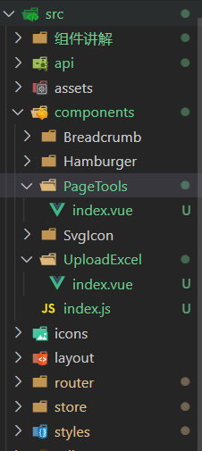
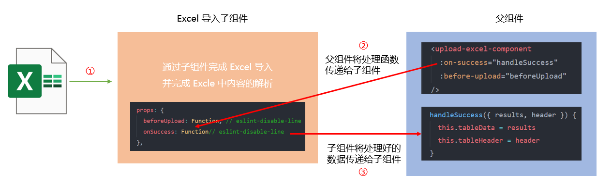
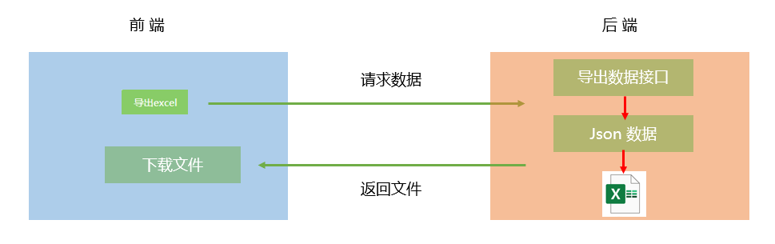
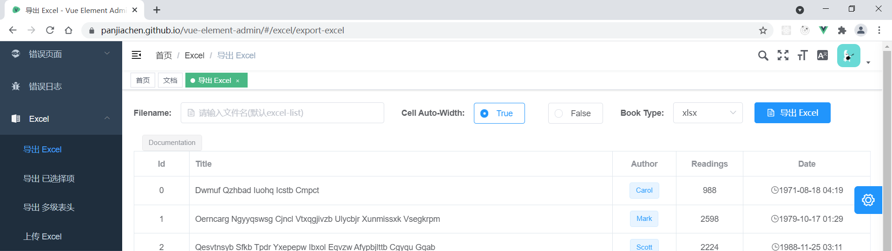

# Day08_Excel导入导出

## 01.员工管理-Excel导入功能介绍

### 目标

在前面员工的添加是一个一个进行的，如果一次性添加多个员工信息，这时候就会很繁琐

因此需要我们开发一个批量导入的功能，将用户的信息存储到 excel 中然后进行批量导入

### 讲解

#### 实现方式 1

前端主导（工作大量在前端）

1.  上传 excel 文件，把 excel 文件的内容读出来，还原成最基本的行列结构
2.  将数据按照后端接口要求格式化，并使用 AJAX 将数据发送到服务器

​		


####  实现方式 2

后端主导（工作大量在后端）

1. 前端只需要负责将 excel 文件上传

   

### 小结

1. excel文件上传有几种方式?

   <details>     
   <summary>答案</summary> 
   <ul>
   <li>在前端, 把excel文件获取到, 用第三方包把文件数据读出, 转换后发给后台</li>
   <li>在后端, 前端把excel文件, 用FormData对象直接发给后台, 让后台读取/保存</li>
   </ul> 
   </details>

2. 图片上传也有几种方式呢?

   <details>     
   <summary>答案</summary> 
   <ul>
   <li>前端把图片转成base64字符串发给后台, 后台保存图片的base64字符串数据</li>
   <li>前端把图片文件, 放到formData表单对象中, 直接发给后台, 后台接收文件数据流, 把文件保存到后台</li>
   </ul> 
   </details>


## 02.员工管理-Excel导入方案

### **目标**

分析 vue-element-admin 中的导入方案

​	


### 讲解

####  分析

1.  打开我们前面下载的项目, 通过路由路径定位到源码位置进行分析
2.  导入相关的代码文件有两个：
   - 使用组件：`src/views/excel/upload-excel.vue`
   - 定义组件：`src/components/UploadExcel/index.vue`


#### 上传组件实现分析

1.  源代码 `src/components/UploadExcel/index.vue`

   ```vue
   <template>
     <div>
       <!-- 代码略 -->
     </div>
   </template>
   
   <script>
   import XLSX from 'xlsx'
   
   export default {
     props: {
       beforeUpload: Function, // eslint-disable-line
       onSuccess: Function// eslint-disable-line
     },
     data() {
       // 代码略
     },
     methods: {
       // 代码略
     }
   }
   </script>
   
   <style scoped></style>
   
   ```

    

2. 这个组件引入了 xlsx 包， 因此我们需要提前安装 

   - Excel 的导入导出都是依赖于[js-xlsx](https://github.com/SheetJS/js-xlsx)来实现的，
   - 在 `js-xlsx`的基础上又封装了[Export2Excel.js](https://github.com/PanJiaChen/vue-element-admin/blob/master/src/vendor/Export2Excel.js)来方便导出数据
   - 由于 `Export2Excel`不仅依赖`js-xlsx`还依赖`file-saver`和`script-loader`
     - file-saver 用户在客户端保存文件的
     - script-loader 用于在前端执行一次js脚本文件的


   ```bash
   npm install xlsx file-saver -S
   npm install script-loader -S -D
   ```

   

3.  需要给它提供两个 props：

   - beforeUpload：上传之前的函数，可以在上传之前做一些自己的特殊判断，如判断文件的大小是否大于 1 兆？
   - onSuccess: 成功调用之后的函数，它会返回表格的表头和内容。


####  导入组件使用分析

 源代码：`src/views/excel/upload-excel.vue`

```vue
<template>
  <div class="app-container">
    <upload-excel-component
      :on-success="handleSuccess"
      :before-upload="beforeUpload"
     />
    <!-- 其他代码略 -->
  </div>
</template>

<script>
// 导入上传的组件
import UploadExcelComponent from '@/components/UploadExcel/index.vue'

export default {
  name: 'UploadExcel',
  // 绑定上传组件
  components: { UploadExcelComponent },
  data() {
    return {
      tableData: [],
      tableHeader: []
    }
  },
  methods: {
    // 上传之前的函数
    beforeUpload(file) {
      // 如判断文件的大小是否大于 1 兆
      const isLt1M = file.size / 1024 / 1024 < 1

      // 若大于 1 兆则停止解析并提示错误信息。
      if (isLt1M) {
        return true
      }

      this.$message({
        message: 'Please do not upload files larger than 1m in size.',
        type: 'warning'
      })
      return false
    },
    // 成功调用之后的函数，它会返回表格的表头和内容。
    handleSuccess({ results, header }) {
      this.tableData = results
      this.tableHeader = header
    }
  }
}
</script>

```

#### 图解

​	

### 小结

1. 分析别的项目, 页面文件去哪里找, 具体标签在哪里找?

   <details>
   <summary>答案</summary>
   <ul>
   <li>页面组件看路由, 从路由里找到, 标签可以看关键字或者类名去代码全局搜索/页面搜索</li>
   </ul>
   </details>

2. 文件转数据是依赖哪些包实现的?

   <details>
   <summary>答案</summary>
   <ul>
   <li>xlsx包和它需要依赖的file-saver和script-loader包</li>
   </ul>
   </details>


## 03.员工管理-Excel导入组件准备

### 目标

拷贝 vue-element-admin 中提供的 excel 导入功能组件到自己项目中

### 讲解

#### 分析

1.  安装包
2.  拷贝核心组件

#### 实现

1. 安装必要的插件

   > -S和-D (默认就是--save不写即可, -S -D(是--save-dev) : 具体区别可以看这里: https://www.bilibili.com/video/BV15M4y1u78F?spm_id_from=333.999.0.0

   ```bash
   npm install xlsx file-saver -S
   npm install script-loader -S -D
   ```

2. 引入UploadExcel组件并注册为全局

   - 将 vue-element-admin 提供的组件复制到我们自己的项目 `src/components/UploadExcel`下

   - 在 `src\components\index.js` 中将该组件注册成全局组件

     

3. 在index.js将它注册成全局组件

   ```js
   /**
    * 进行全局组件的挂载
    */
   
   import PageTools from './PageTools/index.vue'
   import UploadExcel from './UploadExcel/index.vue'
   
   export default {
     install(Vue) {
       Vue.component('PageTools', PageTools)
       Vue.component('UploadExcel', UploadExcel)
     }
   }
   
   
   ```


4. 这里要格外注意, 最新版的xlsx包, 导出的方式改变了, 所以我们要修改UploadExcel组件代码

   ```js
   // import XLSX from 'xlsx'
   // 上面改成下面这样, 按需引入所有然后形成一个对象保存到XLSX变量上
   import * as XLSX from 'xlsx'
   ```

   

### 小结

1. 我们为什么在components/index.js - 在这里导入和注册

   <details>
   <summary>答案</summary>
   <ul>
   <li>统一注册和导出, 然后在main.js用Vue.use注册全局组件</li>
   </ul> 
   </details>


##  04.员工管理-Excel导入页面准备

### 目标

1.  根据业务要求配置一个独立的 excel导入功能 路由
2.  创建 excel导入功能 对应的组件，在这个单独的页面中实现员工导入功能

### 讲解

#### 分析

1.  配置路由
2.  建立对应的页面，然后在这个页面中引入 UploadExcel 组件实现导入功能


#### 实现

1.   建立公共导入的页面路由

   - 在 `src` 目录下创建 `excel` 文件夹 

   - 创建 excel导入功能 组件，`src\views\excel\index.vue`

   

2.  创建页面的结构，同时补充导入成功后的回调函数

   ```vue
   <template>
     <!-- Excel 导入功能组件 -->
     <upload-excel :on-success="handleSuccess" />
   </template>
   
   <script>
   export default {
     name: 'Excel',
     methods: {
       // 导入成功以后的回调函数
       handleSuccess({ results, header }) {}
     }
   }
   </script>
   
   <style lang="scss" scoped></style>
   
   ```

   

3.  配置路由

   这个路由不需要根据权限控制，直接定义为静态路由即可。在**`src/router/index.js`**下的静态路由表末尾404前添加一个路由

   ```js
   {
     path: '/excel',
     component: Layout,
     hidden: true, // 不显示到左侧菜单
     children: [{
       path: '',
       component: () => import('@/views/excel')
     }]
   }
   ```

   

4.   在`views/employees/index.vue` 在<导入 Excel> 按钮绑定点击事件，点击后跳转到 Excel 导入页面

   ```vue
   <el-button type="danger" size="small" @click="uploadExcelBtnFn">导入excel</el-button>
   ```

    

5.  事件方法中, 切换路由页面到/excel, 查看前面准备的上传表格页

   ```js
   // 导入excel按钮->点击事件
       uploadExcelBtnFn() {
         this.$router.push('/excel')
       }
   ```
   
   
   
6. 测试导入效果

   - excel 导入插件本质：把 excel 经过分析转换成js能够识别的常规数据，拿到数据我们可以进行任何操作

   ```js
   methods: {
     // 导入成功以后的回调函数
     handleSuccess({ results, header }) {
       console.log(results)
       console.log(header)
     }
   }
   ```

   

### 小结

1. 我们是如何实现表格导入读取成数组的功能?

   <details>
   <summary>答案</summary>
   <ul>
   <li>使用xlsx的这个第三方的包, 然后使用模板项目里准备的组件文件使用即可</li>
   </ul> 
   </details>


## 05.员工管理-Excel导入内容格式化

### 目标

数据格式转换：将 excel 解析好的数据经过处理后，转成可以传给接口调用的数据

​		

### 讲解

#### 分析

1.  调用接口进行excel上传的**重点其实是数据的处理**，
2.  按照接口的要求，把 excel 表格中经过插件处理好的数据处理成后端接口要求的格式


#### 实现

1.   在`views/excel/index.vue`导入时间处理方法

   ```js
   import { formatExcelDate } from '@/utils'
   ```

   
   
2. 按接口要求，处理excel导入的数据。处理内容包含：

   - 字段中文转英文。excel中读入的是`姓名`,而后端需要的是`username`

   - 日期处理。从excel中读入的时间是一个 number 值，而后端需要的是标准日期

   ```js
   methods: {
     // 将表格中的数据进行格式化
     transExcel(results) {
       const userRelations = {
         '入职日期': 'timeOfEntry',
         '手机号': 'mobile',
         '姓名': 'username',
         '转正日期': 'correctionTime',
         '工号': 'workNumber',
         '部门': 'departmentName',
         '聘用形式': 'formOfEmployment'
       }
   
       return results.map(item => {
         const obj = {}
   
         // 1. 取出这个对象所有的属性名： ['姓名'， ‘手机号’]
         // 2. 遍历这个数组，通过 中文名去 userRelations 找对应英文名， 保存值
         const contentKeys = Object.keys(item)
         contentKeys.forEach(key => {
           // 找到对应的英文名
           const transKey = userRelations[key]
           // 如果格式化的是时间，需要进行转换
           if (transKey === 'timeOfEntry' || transKey === 'correctionTime') {
               // 表格的天数->转成日期对象
               const transDate = new Date(formatExcelDate(item[key]))
               // 再把日期对象转成->'年-月-日'保存到对象属性里给后台
               obj[transKey] = parseTime(transDate, '{yyyy}-{mm}-{dd}')
             } else {
               obj[transKey] = item[key]
             }
         })
   
         return obj
       })
     },
   
     // 导入成功以后的回调函数
     handleSuccess({ results, header }) {
       const arr = this.transExcel(results)
       console.log('转换之后的格式是', arr)
     }
   }
   ```

   

3. 上面用到的日期处理函数在 `utils/index.js` 中定义如下

   ```js
   // 把excel文件中的日期格式的内容转回成标准时间
   export function formatExcelDate(numb, format = '/') {
     const time = new Date((numb - 25567) * 24 * 3600000 - 5 * 60 * 1000 - 43 * 1000 - 24 * 3600000)
     time.setYear(time.getFullYear())
     const year = time.getFullYear() + ''
     const month = time.getMonth() + 1 + ''
     const date = time.getDate() + ''
     if (format && format.length === 1) {
       return year + format + month + format + date
     }
     return year + (month < 10 ? '0' + month : month) + (date < 10 ? '0' + date : date)
   }
   ```

   ==为何要减少5分43秒, 因为1901年之前, 北京时间是东8时5分43秒不是真正意义上的东8区==

   具体解释:

   ```js
   // 1. xlsx包, 读取表格里日期的时候, 会按照1900年01月01日进行天数的计算, 返回天数数字
   // 43534天, 是1900年(当时的UTC时间算)->到2019年过的天数
   // 注意1: 在1900年的时候, 时间是UTC+8:5:43 (43534天里, 照0时0分0秒, 多了5分43秒)
   // 可以查询每个年份, 时区: https://www.timeanddate.com/time/zone/china/shanghai
   // 注意2: 获取表格的天数, 1月0日也算了一天(43534天里, 多了1天)
   
   // 2. js中, new Date是从1970年开始计算日期对象
   // 所以你传入给new Date的表格时间, 要把1970年之前的天数减掉, 就是上面说的1900-1970天数和多出来的5分43秒
   ```

   图解

   

### 小结

1. 表格读出中文key对象, 如何转换英文key的对象的?

   <details>
   <summary>答案</summary>
   <ul>
   <li>准备一个中文key和英文key映射关系的对象, 然后遍历数据里所有中文key拿出来, 换取英文key</li>
   <li>再准备一个新的对象, 组织英文key和value值</li>
   </ul> 
   </details>


## 06.员工管理-Excel导入接口调用

### 目标

完成按钮跳转，导入完成（接口调用）之后，再跳回到原来的页面

### 讲解

#### 分析

1.  准备好excel 导入的接口
2.   在页面上，点击了导入之后，做跳转，跳到上传页面；

#### 实现

1.  在 `src/api/employee` 封装好导入的接口

   ```js
   /**
    * @description: 导入excel
    * @param {*} data
    * @return {*}
    */
   export function importEmployeeAPI(data) {
     return request({
       url: '/sys/user/batch',
       method: 'post',
       data
     })
   }
   ```

   

2. 在`views/excel/index.vue`表格上传页面中导入封装的方法

   ```js
   import { importEmployeeAPI } from '@/api'
   ```

   

3.  调用封装的方法，实现 Excel 导入功能

   ```js
   // 导入成功以后的回调函数
   async handleSuccess({ results, header }) {
       const arr = this.transExcel(results)
       const res = await importEmployeeAPI(arr).catch(err => err)
       if (!res.success) return this.$message.error(res.message)
       this.$router.back()
       this.$message.success('操作成功')
   }
   ```

### 小结

1. $router.back作用是?

   <details>
   <summary>答案</summary>
   <ul>
   <li>跳转回到上一个路由历史的记录</li>
   </ul> 
   </details>


## 07.员工管理-Excel导出功能介绍

### 目标

在表格中查询到了我们需要的数据，希望用他们生成excel文件，保存在本地。


### 讲解

#### 实现方式 1

取回数据，解析数据，保存为 excel 文件，工作大量在前端

​			 


#### 实现方式 2

前端调用接口，获取  excel 文件，下载即可，工作大量在后端

​			 


### 小结

1. 在前端, 导出Excel形成一个文件, 如何做?

   <details>
   <summary>答案</summary>
   <ul>
   <li>先请求后台接口, 拿到列表所有数据</li>
   <li>然后借助xlsx包的方法, 把数据转成excel文件并下载</li>
   </ul> 
   </details>


## 08.员工管理-Excel导出方案

### 目标

先去vue-admin中去学习导出功能的用法，并归纳总结把它用到本项目中的步骤

> 前置工作：这个功能在我们课程一开始学习的vue-element-admin中有现成的功能参考，我们也在`项目资源`里提供了现成的插件包，大家先把它复制到自己项目的`src目录`下

### 讲解

#### 分析

学习使用现成的excel导出组件，通过路由路径定位到源码位置




**熟悉案例代码**

网上示例地址：https://gitee.com/mirrors/vue-element-admin/blob/master/src/views/excel/export-excel.vue

```js
import('@/vendor/Export2Excel').then(excel => {
    const tHeader = ['Id', 'Title', 'Author', 'Readings', 'Date']
    const filterVal = ['id', 'title', 'author', 'pageviews', 'display_time']
    const list = this.list
    const data = this.formatJson(filterVal, list)
    excel.export_json_to_excel({
      header: tHeader,
      data,
      filename: this.filename,
      autoWidth: this.autoWidth,
      bookType: this.bookType
    })
    this.downloadLoading = false
 })
```

#### 具体说明

1.  插件包位于`src/vendor/export2Excel`中，采用的是按需引入的方式

   什么时候正式要使用导出功能了,插件才会被正式引入到应用里

   ```
   import('@/vendor/Export2Excel').then(excel => {})
   ```

2. `Export2Excel`依赖的包有`js-xlsx`、`file-saver`和`script-loader`

   也就是说，在项目跑起来之前要安装依赖

   ```bash
   npm install file-saver script-loader --save
   ```


### 小结

1. 导出表格如何实现?

   <details>
   <summary>答案</summary>
   <ul>
   <li>使用xlsx包里,准备好的方法</li>
   </ul> 
   </details>


## 09_员工管理-Excel导出基础实现

### 目标

实现员工的基础导出功能实现

### 讲解

#### 分析

1.  把vue-element-admin 中的导出功能，迁移本项目

2.  使用静态数据实现基础的导出功能（先不使用从接口获取的数据）


#### 实现

1. 将 `vue-element-admin` 中的 `src/vendor/export2Excel` 复制到本项目中，直接使用

   格外注意, 新版的xlsx导入方式改变了, 所以要改变代码

   ```js
   import * as XLSX from 'xlsx'
   ```

   

2. 在项目中安装依赖

   ```bash
   npm install file-saver script-loader --save
   ```

   

3. 给导出按钮添加点击事件

   ```vue
   <el-button type="success" size="small" @click="downloadExcel">导出excel</el-button>
   ```

   ```js
   // 导出excel按钮->点击事件
   downloadExcel() {
       import('@/vendor/Export2Excel').then(excel => {
           // excel表示导入的模块对象
           excel.export_json_to_excel({
               header: ['姓名', '工资'], // 表头 必填
               data: [
                   ['刘备', 100],
                   ['关羽', 500]
               ], // 具体数据 必填
               filename: 'excel-list', // 文件名称
               autoWidth: true, // 宽度是否自适应
               bookType: 'xlsx' // 生成的文件类型
           })
       })
   }
   ```

   

以上代码表示:

1.  当我们正式点击`导出`按钮之后，才去加载 vendor 文件夹中的Export2Excel模块
2.  import 方法执行完毕返回的是一个 promise 对象，在then方法中我们可以拿到使用的模块对象
3.  重点关注 data 的配置部分，我们发现它需要一个严格的二维数组

**Excel导出参数说明**

| 参数      | 说明                   | 类型    | 可选值                                                       | 默认值     |
| --------- | ---------------------- | ------- | ------------------------------------------------------------ | ---------- |
| header    | 导出数据的表头         | Array   | /                                                            | []         |
| data      | 导出的具体数据         | Array   | /                                                            | **[[]]**   |
| filename  | 导出文件名             | String  | /                                                            | excel-list |
| autoWidth | 单元格是否要自适应宽度 | Boolean | true / false                                                 | true       |
| bookType  | 导出文件类型           | String  | xlsx, csv, txt, [more](https://github.com/SheetJS/js-xlsx#supported-output-formats) | xlsx       |

### 小结

1. 导出时的二个数组, 怎么来呢?

   <details>
   <summary>答案</summary>
   <ul>
   <li>需要我们按照目标表格需要的字段和数据, 用js代码进行排列</li>
   </ul> 
   </details>


## 10.员工管理-Excel导出尝试实现

### 目标

使用业务 真实数据实现导出功能

### 讲解

#### 分析

1. 从后台重新获取数据（这样才能确保是最新的）

2. 对数据的**格式进行转换**（后端给的数据字段名都是英文的），以用来做导出


核心在于把后端接口返回的数据转成 Export2Excel 这个插件需要的格式

#### 准备表头header数据

因为接口中返回的数据中的key是英文，而我们期望导出的表头是中文，所以提前准备中文和英文的映射关系

```js
const map = {
  'id': '编号',
  'password': '密码',
  'mobile': '手机号',
  'username': '姓名',
  'timeOfEntry': '入职日期',
  'formOfEmployment': '聘用形式',
  'correctionTime': '转正日期',
  'workNumber': '工号',
  'departmentName': '部门',
  'staffPhoto': '头像地址'
}
```

#### 目标表格data数据

> 具体的表格数据我们需要通过接口从后端获取回来，难点在于如何把后端返回的数据处理成`Export2Excel`插件需求的二维数组格式。

下面是一个示例：

```json
const dataArr = [
 ["13600000001", "吕勇锐", "1992-08-04", "正式", "2020-01-01", "0001", "总裁办"]
 ["13600000002", "袁永安", "1993-08-04", "正式", "2020-01-01", "0002", "总裁办"]
]
```


#### 补充一个用来处理数据的函数

```js
transData(rows) {
  // 写代码
  const map = {
    'id': '编号',
    'password': '密码',
    'mobile': '手机号',
    'username': '姓名',
    'timeOfEntry': '入职日期',
    'formOfEmployment': '聘用形式',
    'correctionTime': '转正日期',
    'workNumber': '工号',
    'departmentName': '部门',
    'staffPhoto': '头像地址'
  }

  const headerKeys = Object.keys(rows[0])
  const header = headerKeys.map(item => {
    return map[item]
  })

  const data = rows.map(obj => {
    return Object.values(obj)
  })

  return { header, data }
}
```

#### 最终的代码

```js
methods: {
    transData(rows) {
        // 写代码
        const map = {
            'id': '编号',
            'password': '密码',
            'mobile': '手机号',
            'username': '姓名',
            'timeOfEntry': '入职日期',
            'formOfEmployment': '聘用形式',
            'correctionTime': '转正日期',
            'workNumber': '工号',
            'departmentName': '部门',
            'staffPhoto': '头像地址'
        }

        const headerKeys = Object.keys(rows[0])
        const header = headerKeys.map(item => {
            return map[item]
        })

        const data = rows.map(obj => {
            return Object.values(obj)
        })

        return { header, data }
    }
    // 导出 Excel
    async downloadExcel() {
        const res = await getEmployeeList()
        const excelObj = this.transData(res.data.rows)
        import('@/vendor/Export2Excel').then(excel => {
            // excel表示导入的模块对象
            excel.export_json_to_excel({
                header: excelObj.header, // 表头 必填
                data: excelObj.data, // 具体数据 必填
                filename: '员工列表', // 文件名称
                autoWidth: true, // 宽度是否自适应
                bookType: 'xlsx' // 生成的文件类型
            })
        })
    },


}
```

### 小结

1. 数据如果不是自己想要的结构要怎么办?

   <details>
   <summary>答案</summary>
   <ul>
   <li>先看好自己手上的数据, 和目标数据之间的关系, 找规律</li>
   <li>用js代码, 把对应的数据结构, 熟练使用对象的方法和数组方法进行转换使用</li>
   </ul> 
   </details>

2. 下载的只有当前页面的数据, 如果我想要全部的数据怎么办?

   <details>
   <summary>答案</summary>
   <ul>
   <li>请求第一次, 把总数据请求回来, 然后单独发送参数, 把1页所有数据拿回来导出成表格即可</li>
   </ul> 
   </details>


## 11.员工管理-Excel导出顺序对应

### 目标

刚才我们的数据对应不了页面, 而且数据顺序也有点错乱, 尝试解决

### 讲解

1. 分析原因, Object.values拿到的值数组顺序不稳定, 所以我们决定自己来实现一个个取值和按顺序组织数组

   ```js
   transData(rows) {
         // // 写代码
         // const map = {
         //   'id': '编号',
         //   'password': '密码',
         //   'mobile': '手机号',
         //   'username': '姓名',
         //   'timeOfEntry': '入职日期',
         //   'formOfEmployment': '聘用形式',
         //   'correctionTime': '转正日期',
         //   'workNumber': '工号',
         //   'departmentName': '部门',
         //   'staffPhoto': '头像地址'
         // }
   
         // const headerKeys = Object.keys(rows[0])
         // const header = headerKeys.map(item => {
         //   return map[item]
         // })
   
         // const data = rows.map(obj => {
         //   return Object.values(obj)
         // })
   
         // return { header, data }
   
         // 考虑顺序 (页面上列保持一致顺序)
         // 4.0 准备一个列表头中文数组 (8个)
         const headerArr = ['序号', '姓名', '头像', '手机号', '工号', '聘用形式', '部门', '入职时间']
         // 4.1 数据key的映射关系(思路: 遍历上边数组里按照顺序, 取出中文的名字, 但是对应数组值的数组, 要从英文key对象中取出value值, 我要用中文key换到英文key然后去取到值)
         const myObj = {
           // 序号可以等遍历的时候直接用索引值, 而不是来自于英文对象里
           '姓名': 'username',
           '头像': 'staffPhoto',
           '手机号': 'mobile',
           '工号': 'workNumber',
           '聘用形式': 'formOfEmployment',
           '部门': 'departmentName',
           '入职时间': 'timeOfEntry'
         }
         // 4.2 按照顺序, 形成值的数组 (明确目标->想要数据结构->读代码(每个变量意思)读2-3遍->仿写3-5遍)
         const resultArr = rows.map((item, index) => {
           const valueArr = [] // 值小数组
           headerArr.forEach(zhKey => {
             if (zhKey === '序号') {
               valueArr.push(index + 1)
             } else {
               const enKey = myObj[zhKey]
               valueArr.push(item[enKey])
             }
           })
           return valueArr
         })
   
         return { header: headerArr, data: resultArr }
       },
   
       // 导出 Excel
       async downloadExcel() {
         const res = await getEmployeeListAPI()
         const res2 = await getEmployeeListAPI({
           page: 1,
           size: res.data.total
         })
         const excelObj = this.transData(res2.data.rows)
         import('@/vendor/Export2Excel').then(excel => {
         // excel表示导入的模块对象
           excel.export_json_to_excel({
             header: excelObj.header, // 表头 必填
             data: excelObj.data, // 具体数据 必填
             filename: '员工列表', // 文件名称
             autoWidth: true, // 宽度是否自适应
             bookType: 'xlsx' // 生成的文件类型
           })
         })
       }
   ```

   

### 小结

1. 值数组是如何和列标题头数组对应的?

   <details>
   <summary>答案</summary>
   <ul>
   <li>首先, 遍历数组是按照顺序的, 拿到中文的key换成英文的key, 再去对象取值后, 按顺序push到值的数组中</li>
   </ul>
   </details>


