# Day09_员工详细

## 01.员工详情-页面和路由

### 目标

1.  创建 员工详情 的布局页面
2.  创建 员工详情 的路由跳转

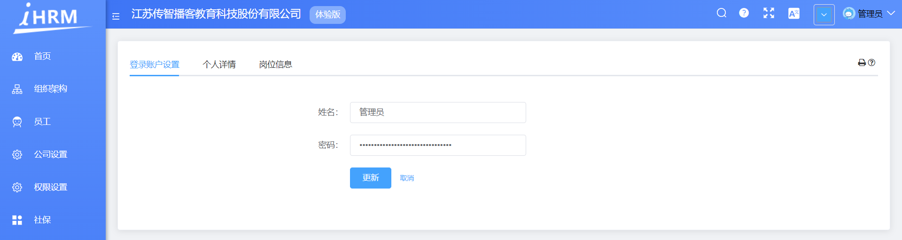


### 讲解

#### 分析

1. 使用 el-tabs 组件完成整体的结构

2.  三个子模块的功能通过三个独立的组件来实现

#### 实现

1.   页面结构搭建

   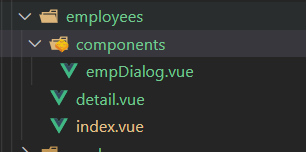
   
   
   
2. 把页面放在`views/employees/detail.vue`，因为这个页面还是与员工相关的，所以仍放置在employees目录下

   ```vue
   <template>
     <div class="employees-container">
       <div class="app-container">
         <el-card>
           <el-tabs>
             <el-tab-pane label="登录账户设置"/>
             <el-tab-pane label="个人详情" />
             <el-tab-pane label="岗位信息" />
           </el-tabs>
         </el-card>
       </div>
     </div>
   </template>
   ```

   

3.  在文件`router/modules/employees.js`绑定路由，因为员工详情页属于员工模块，所以直接和列表路由写到一起

   ```js
   export default {
     path: '/employees', // 员工
     component: Layout,
     children: [
       {
         path: '',
         name: 'Employees',
         component: () => import('@/views/employees'),
         meta: { title: '员工', icon: 'people' }
       },
       {
         path: 'detail',
         name: 'employeesDetail',
         component: () => import('@/views/employees/detail'),
         hidden: true
       }
     ]
   }
   
   ```
   
   
   
4.  在员工列表页面路由跳转到员工详情，需要携带了必要的 id 参数

   ```vue
   <el-table-column label="操作" width="200">
     <template slot-scope="scope">
       <el-button 
          type="text"
          size="small"
          @click="$router.push('/employees/detail?id=' + scope.row.id)"
        >
          查看
        </el-button>
       <el-button type="text" size="small">分配角色</el-button>
       <el-button type="text" size="small" @click="delEmp(scope.row.id)">删除</el-button>
     </template>
   </el-table-column>
   ```


### 小结

1. 为什么这个详情可以放到children里了?

   <details>     
   <summary>答案</summary> 
   <ul>
   <li>因为详情页面不需要左侧导航了, 而且作为二级路由可以在右下角查看, 而且hidden也为true了</li>
   </ul> 
   </details>


## 02.员工详情-将组件拆分维护

###  目标

按照不同 tab 创建不同的内容组件

### 分析

根据分析，这里把三个面板中的内容分别拆成三个对应的组件

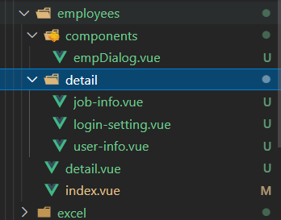


### 实现

1.   登录账号设置组件 `src\views\employees\detail\login-setting.vue`

   ```vue
   <template>
     <div class="login-setting">
       账号设置
     </div>
   </template>
   
   <script>
   export default {
     name: 'LoginSetting'
   }
   </script>
   
   <style lang="scss" scoped></style>
   
   ```

   

2.  `src\views\employees\detail\user-info.vue`员工个人信息组件

   ```vue
   <template>
     <div class="user-info">
       个人信息
     </div>
   </template>
   
   <script>
   export default {
     name: 'UserInfo'
   }
   </script>
   
   <style lang="scss" scoped></style>
   
   ```

   

3.  `src\views\employees\detail\job-info.vue`员工工作信息组件

   ```vue
   <template>
     <div />
   </template>
   
   <script>
   export default {
     name: 'JobInfo'
   }
   </script>
   
   <style lang="scss" scoped></style>
   
   ```

   

4.  把上面定义的三个组件引入到 detail.vue 中，并使用

   ```vue
   <template>
     <div class="employees-container">
       <div class="app-container">
         <el-card>
           <el-tabs>
             <el-tab-pane label="登录账户设置">
               <login-setting />
             </el-tab-pane>
   
             <el-tab-pane label="个人详情">
               <user-info />
             </el-tab-pane>
   
             <el-tab-pane label="岗位信息">
               <job-info />
             </el-tab-pane>
           </el-tabs>
         </el-card>
       </div>
     </div>
   </template>
   
   <script>
   // 导入子组件
   import JobInfo from './detail/job-info'
   import LoginSetting from './detail/login-setting'
   import UserInfo from './detail/user-info'
   
   export default {
     // 挂载子组件
     components: {
       JobInfo,
       LoginSetting,
       UserInfo
     }
   }
   </script>
   <style lang="scss" scoped>
   
   </style>
   
   ```
   


### 小结

1. 我们为什么把3个tab-pane的内容, 封装分散出独立的组件?

   <details>     
   <summary>答案</summary> 
   <ul>
   <li>因为这样便于复用和管理</li>
   </ul> 
   </details>


## 03.员工详情-帐户设置页面布局

###  目标

1.  完成登录帐户设置页面布局
2.  完成登录账号设置页面数据渲染


### 分析

1.  页面结构使用 Form 表单实现
2.  封装帐户设置的请求 api
3.  进行数据回填


### 实现

1.  静态结构使用 Form 组件实现

   ```vue
   <template>
     <div class="login-setting">
       <el-form
         ref="userForm"
         :model="userInfo"
         label-width="120px"
         style="margin-left: 120px; margin-top: 30px"
       >
         <el-form-item label="姓名:">
           <el-input v-model="userInfo.username" style="width:300px" />
         </el-form-item>
   
         <el-form-item label="密码:">
           <el-input v-model="userInfo.password" type="password" style="width:300px" />
         </el-form-item>
   
         <el-form-item>
           <el-button type="primary">更新</el-button>
         </el-form-item>
       </el-form>
     </div>
   </template>
   
   <script>
   export default {
     name: 'LoginSetting',
     data() {
       return {
         userInfo: {
           username: '',
           password: ''
         }
       }
     }
   }
   </script>
   
   <style lang="scss" scoped></style>
   
   ```

   

2.  在 `src\api\user.js` 封装请求api

   ```js
   /**
    * @description: 获取员工详细信息
    * @param {*} id 用户id
    * @return {*}
    */
   export function getUserDetailByIdAPI(id) {
     return request({
       url: `/sys/user/${id}`
     })
   }
   ```

   

3.  在 `employees/components/login-setting.vue` 中导入 API

   - 获取数据，保存到数据项
   - 数据项显示到视图

   ```js
   import { getUserDetailByIdAPI } from '@/api'
   
   export default {
     name: 'LoginSetting',
     data() {
       return {
         userInfo: {
           username: '',
           password: ''
         }
       }
     },
     created() {
       // 调用获取用户详情的方法
       this.loadUserDetailById()
     },
     methods: {
       // 获取用户详情
       async loadUserDetailById() {
         const res = await getUserDetailByIdAPI(this.$route.query.id).catch(err => err)
         if (!res.success) return this.$message.error(res.message)
         this.userInfo = res.data
       }
     }
   }
   ```


### 小结

1. 账户如何做回显?

   <details>     
   <summary>答案</summary> 
   <ul>
   <li>跳转到查看页面传递用户的id, 请求详细信息, 然后放置到表单对象里显示页面</li>
   </ul> 
   </details>


## 04.员工详情-修改用户名和密码

### 目标

用户更改用户名或密码后，点击保存，实现用户名和密码修改

### 分析

1.  封装修改用户名和密码的 api
2.  当用户点击更新，调用 api，修改用户名和密码

### 实现

1.   在 **`src/api/employees.js`** 中，封装修改信息 api 用来获取保存新的数据

   ```js
   /**
    * @description: 保存员工信息
    * @param {*} data
    * @return {*}
    */
   export function saveUserDetailByIdAPI(data) {
     return request({
       url: `/sys/user/${data.id}`,
       method: 'put',
       data
     })
   }
   ```

   

2.  在**`src/views/employees/detail/login-setting.vue`** 组件中添加表单校验

   ```vue
   <template>
     <div class="login-setting">
       <el-form
         ref="userForm"
         :model="userInfo"
         :rules="rules"
         label-width="120px"
         style="margin-left: 120px; margin-top: 30px"
       >
         <el-form-item label="姓名:" prop="username">
           <el-input v-model="userInfo.username" style="width:300px" />
         </el-form-item>
   
         <el-form-item label="密码:" prop="password">
           <el-input v-model="userInfo.password" type="password" style="width:300px" />
         </el-form-item>
   
         <el-form-item>
           <el-button type="primary" @click="updateUser">更新</el-button>
         </el-form-item>
       </el-form>
     </div>
   </template>
   <script>
   import { getUserDetailByIdAPI, saveUserDetailByIdAPI } from '@/api/user'
   
   export default {
     name: 'LoginSetting',
     data() {
       return {
         userInfo: {
           username: '',
           password: ''
         },
         rules: {
           username: [{ required: true, message: '用户名不能为空', triggler: 'blur' }],
           password: [{ required: true, message: '密码不能为空', triggler: 'blur' }]
         }
       }
     },
     // 其他代码略……
   }
   ```

   

3.  在组件中调用 api，实现修改功能

   ```js
   
   import { getUserDetailById, saveUserDetailByIdAPI } from '@/api/user'
   
   export default {
     name: 'LoginSetting',
     data() {
       return {
         userInfo: {
           username: '',
           password: ''
         },
         rules: {
           username: [{ required: true, message: '用户名不能为空', trigger: 'blur' }],
           password: [{ required: true, message: '密码不能为空', trigger: 'blur' }]
         }
       }
     },
     created() {
       // 调用获取用户详情的方法
       this.loadUserDetailById()
     },
     methods: {
       // 更新用户信息模块
       updateUser() {
         this.$refs.userForm.validate(async valid => {
           if (!valid) return this.$message.error('检查用户名和密码')
           const res = await saveUserDetailByIdAPI(this.userInfo)
           this.loadUserDetailById()
           this.$message.success(res.message)
         })
       },
       // ...其他
     }
   }
   ```
   
    

### 小结

1. 如何更新用户名和密码?

   <details>     
   <summary>答案</summary> 
   <ul>
   <li>把表单当前数据, 传入更新接口调用</li>
   </ul> 
   </details>


## 05.员工详情-个人详情页面布局

### 目标

实现个人信息的读取及显示

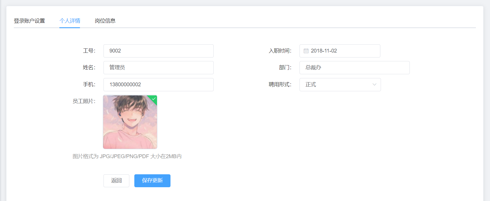

### 页面结构

1.   封装接口，获取个人信息数据

2.  页面结构绘制

3.  实现页面的渲染

   ```vue
   <template>
     <div class="user-info">
       <!-- 个人信息 -->
       <el-form label-width="220px">
         <!-- 工号 入职时间 -->
         <el-row class="inline-info">
           <el-col :span="12">
             <el-form-item label="工号">
               <el-input v-model="userInfo.workNumber" class="inputW" />
             </el-form-item>
           </el-col>
   
           <el-col :span="12">
             <el-form-item label="入职时间">
               <el-date-picker
                 v-model="userInfo.timeOfEntry"
                 style="width: 300px"
                 type="date"
                 class="inputW"
                 value-format="YYYY-MM-DD"
               />
             </el-form-item>
           </el-col>
         </el-row>
         <!-- 姓名 部门 -->
         <el-row class="inline-info">
           <el-col :span="12">
             <el-form-item label="姓名">
               <el-input v-model="userInfo.username" class="inputW" />
             </el-form-item>
           </el-col>
           <el-col :span="12">
             <el-form-item label="部门">
               <el-input v-model="userInfo.departmentName" class="inputW" />
             </el-form-item>
           </el-col>
         </el-row>
         <!--手机 聘用形式  -->
         <el-row class="inline-info">
           <el-col :span="12">
             <el-form-item label="手机">
               <el-input v-model="userInfo.mobile" style="width: 300px" />
             </el-form-item>
           </el-col>
           <el-col :span="12">
             <el-form-item label="聘用形式">
               <el-select v-model="userInfo.formOfEmployment" class="inputW">
                 <el-option
                   v-for="item in EmployeeEnum.hireType"
                   :key="item.id"
                   :label="item.value"
                   :value="item.id"
                 />
               </el-select>
             </el-form-item>
           </el-col>
         </el-row>
         <!-- 员工照片 -->
         <el-row class="inline-info">
           <el-col :span="12">
             <el-form-item label="员工头像">
               <!-- 放置上传图片 -->
   
             </el-form-item>
           </el-col>
         </el-row>
         <!-- 保存个人信息 -->
         <el-row class="inline-info" type="flex" justify="center">
           <el-col :span="12">
             <el-button type="primary" @click="saveUser">保存更新</el-button>
             <el-button @click="$router.back()">返回</el-button>
           </el-col>
         </el-row>
       </el-form>
     </div>
   </template>
   
   <script>
   import { getUserDetailByIdAPI } from '@/api/user'
   import EmployeeEnum from '@/api/constant/employees'
   
   export default {
     data() {
       return {
         userId: this.$route.query.id,
         EmployeeEnum, // 员工枚举数据
         userInfo: {}
       }
     },
     created() {
       // 调用获取用户信息的 API
       this.loadUserInfoById()
     },
     methods: {
       async loadUserInfoById() {
         const res = await getUserDetailByIdAPI(this.userId).catch(err => err)
         if (!res.success) return this.$message.error(res.message)
         this.userInfo = res.data
       },
   
       saveUser() {}
     }
   }
   </script>
   
   <style scoped lang="scss">
     .user-info{
       padding-top:20px;
     }
   </style>
   ```
   

暂时没有设置图片

### 小结

1. 个人详情布局如何做?

   <details>     
   <summary>答案</summary> 
   <ul>
   <li>传递id到详情页面, 然后请求数据铺设页面</li>
   </ul> 
   </details>


## 06.员工详情-个人详情保存更新

### 目标

保存个人信息

### 分析

1.  表单验证 
2.  点击保存，调用接口

### 代码

1.  封装保存用户信息的 API

   ```js
   /**
    * 保存员工的基本信息
    * @param {*} data
    * @returns
    */
   export function saveUserDetailByIdAPI(data) {
     return request({
       url: `/sys/user/${data.id}`,
       method: 'put',
       data
     })
   }
   ```

   

2.  导入 API

   ```js
   import { saveUserDetailByIdAPI } from '@/api/employees'
   ```

   

3.   点击保存，更新用户个人详情

   ```js
   methods: {
     // 保存用户信息的更改
     async saveUser() {
       const res = await saveUserDetailByIdAPI(this.userInfo)
       if (!res.success) return this.$message.error(res.message)
       this.loadUserInfoById()
       this.$message.success(res.message)
     }
   }
   ```
   
   

### 小结

1. 个人信息保存更新思路是?

   <details>     
   <summary>答案</summary> 
   <ul>
   <li>把表单的数据传递给更新数据的接口</li>
   </ul> 
   </details>


## 07.员工详情-图片存储方案介绍

### 目标

了解主流的图片存储方案

### 两种常见方案

**1.  存到自己公司购买的服务器上**

优点：好控制

缺点：成本高由于图片都存放到自己的服务器上，占据空间很大


**2. 存到三方云服务器（阿里云，七牛云，腾讯云）**

各种云有专门的为图片存储提供的云服务器，我们自己的服务器只存储图片地址即可

​               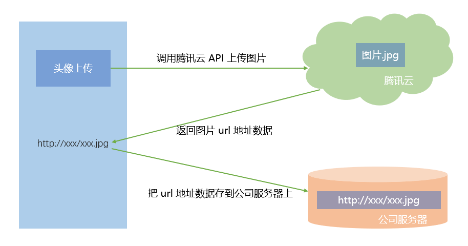

上面属于第三方图片服务器, 直传

还有一种是把图片文件传给自己的后台, 由后台上传到第三方图片服务器

### 小结

1. 我们上传图片有几种方案?

   <details>     
   <summary>答案</summary> 
   <ul>
   <li>前端直传第三方图片托管服务器, 或者前端传给后端, 后端传递图片到第三方图片托管服务器, 或者我们服务器自己存储, 比较占用服务器资源</li>
   </ul> 
   </details>


## 08.员工详情-腾讯云cos申请配置

### 目标

使用现成的腾讯云服务创建一个**免费**的云存储。

官网：https://cloud.tencent.com/


### 创建账号并实名认证

1.  打开腾讯云，点击右上角登录，使用微信扫码进行登录

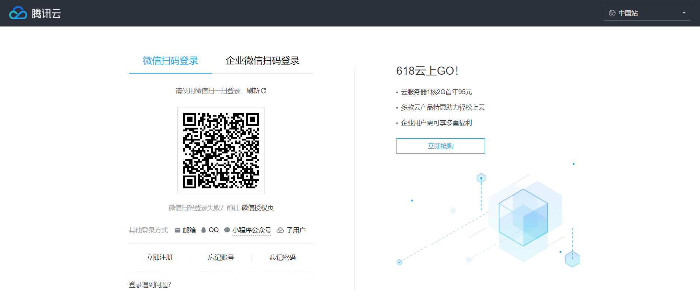


2.  注册或关联账号

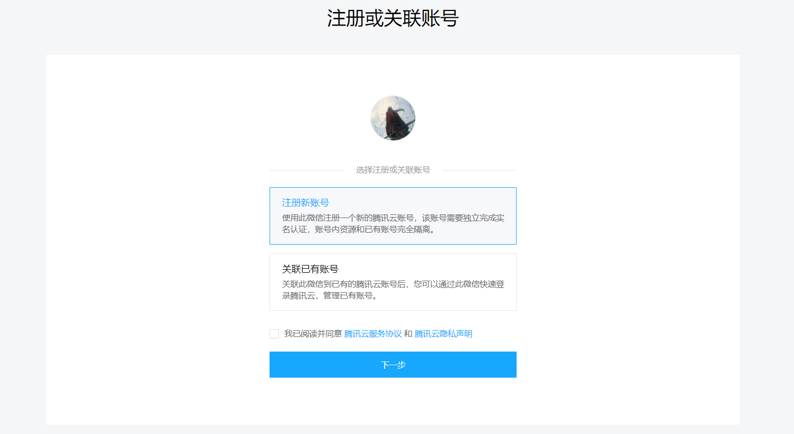


3.  提示关注腾讯云并完成账号注册

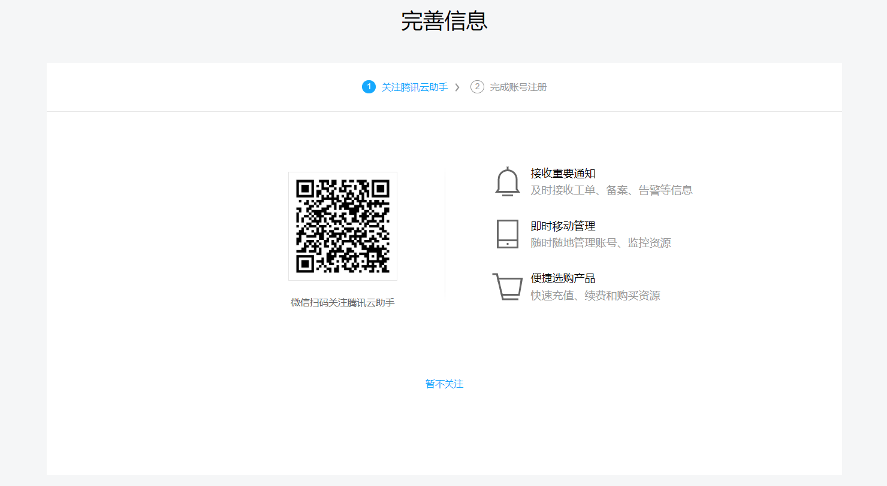


4.  注册完成

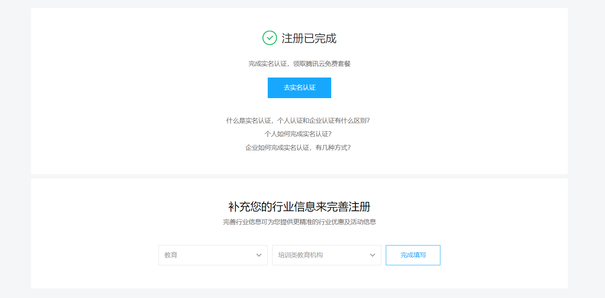


5.  点击去实名认证，选择个人认证，进行实名认证


### 开通对象存储

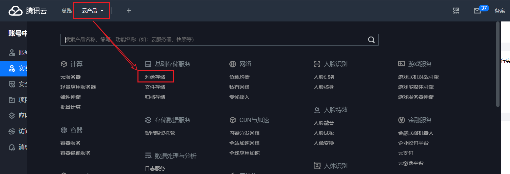

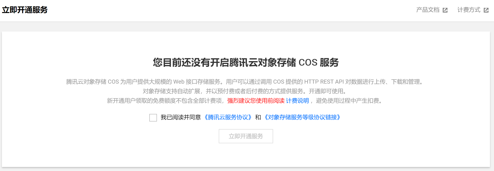

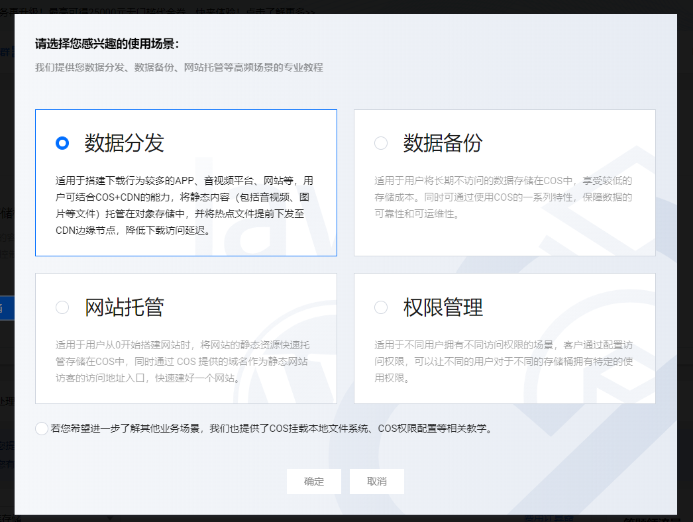

### 创建存储桶

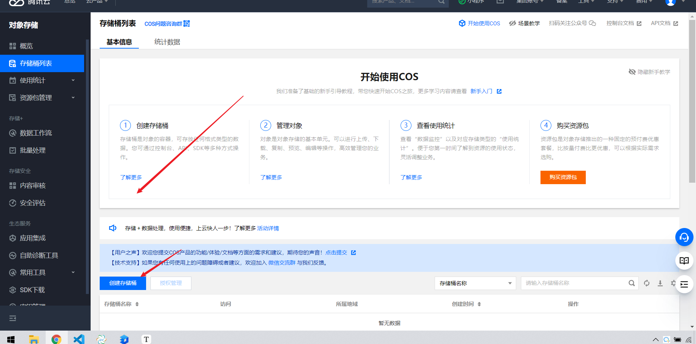


​							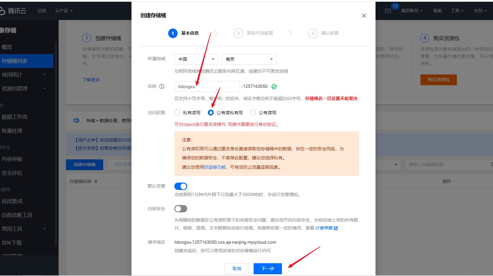

==剩下几步默认下一步就行了==


### 设置cors规则

#### 在存储桶列表中，选中存储桶

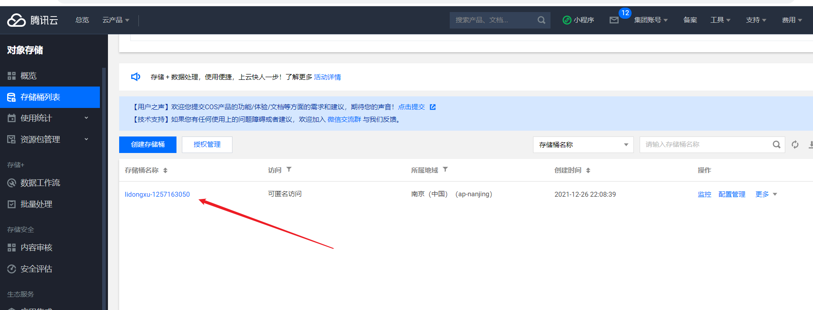

#### 在左侧的菜单中选安全管理

> 因为我们是在测试上传，全部容许上传即可，真正的生产环境需要单独配置具体的域名和操作方法

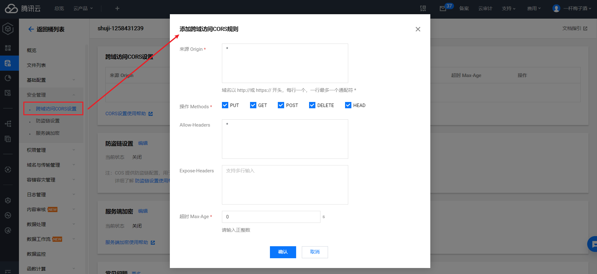


### 配置云API秘钥

服务器属于个人的，需要一定的权限才能自由上传图片，这个负责权限验证的其实就是秘钥，也就是说拥有秘钥是进行上传的必要条件。

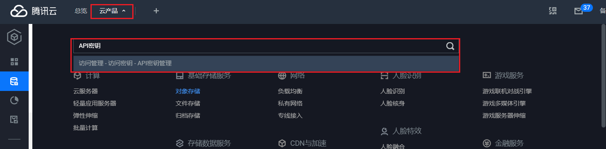

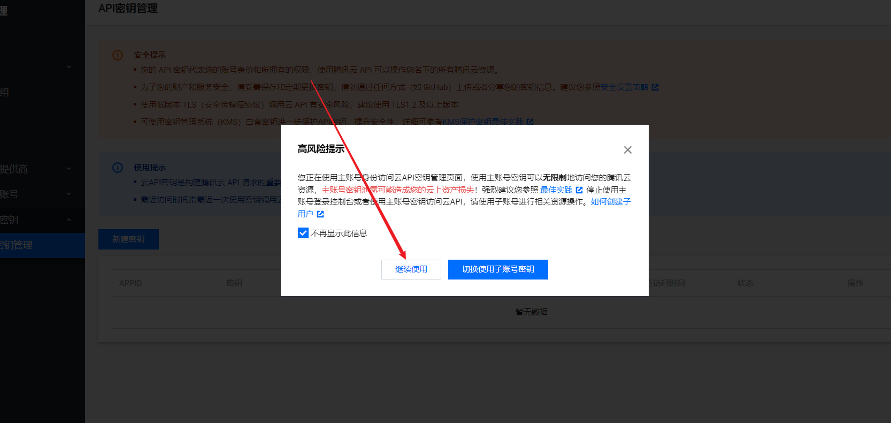

**秘钥配置和API密钥管理**

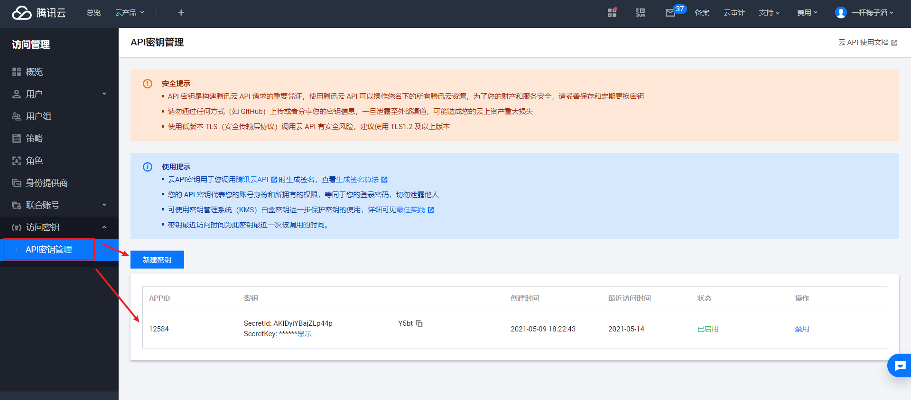


**安全性提示**

实际工作中，秘钥属于敏感信息，不能直接放到前端存储，容易产生安全问题，更好的做法是把秘钥交给后端管理，前端通过调用接口先获取秘钥，有了秘钥之后再进行上传操作

以上我们就完成了，所有的准备工作~

### 小结

1. 我们刚才做的一些操作目的是什么?

   <details>     
   <summary>答案</summary> 
   <ul>
   <li>为了是在腾讯云上申请一个空间, 为我们上传图片到云服务器做准备</li>
   </ul> 
   </details>


## 09.员工详情-图片上传组件封装思路

### 目标

了解图片上传组件实现的思路

### 分析

​                               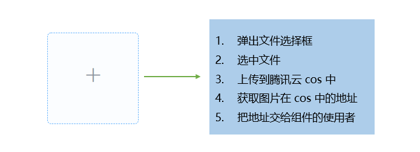


### 重点

1.  前端主动发起图片上传使用的是三方的腾讯云上传接口
2.  前端得到一个已经上传完毕的图片地址
3.  然后把这个地址当成一个接口字段 传给我们自己的后端服务

### 小结

1. 我们前端把图片到底传递到了哪里?

   <details>     
   <summary>答案</summary> 
   <ul>
   <li>上传到了第三方云服务器上</li>
   </ul> 
   </details>


## 10.员工详情-二次封装 Upload 上传

### 目标

基于 element 框架提供的 Upload 上传组件封装自己的上传组件


### 思路

1.  创建自定义上传组件
2.  分析 element 中的 Upload 上传组件
3.  将  element 中的 Upload 上传组件进行封装

### 实现

1.  创建 `src\components\UploadImg\index.vue` 组件

2.  将  element 中的 Upload 上传组件进行封装

   ```vue
   <template>
     <div>
       <el-upload
         class="avatar-uploader"
         action="https://jsonplaceholder.typicode.com/posts/"
         :show-file-list="false"
         :on-success="handleAvatarSuccess"
         :before-upload="beforeAvatarUpload"
       >
         
         <i v-else class="el-icon-plus avatar-uploader-icon" />
       </el-upload>
     </div>
   </template>
   
   <script>
   export default {
     name: 'UploadImg',
     data() {
       return {
         imageUrl: ''
       }
     },
     methods: {
       handleAvatarSuccess(res, file) {
         this.imageUrl = URL.createObjectURL(file.raw)
       },
       beforeAvatarUpload(file) {
         const isJPG = ['image/jpeg', 'image/png', 'image/jpg', 'image/gif'].includes(file.type)
         const isLt2M = file.size / 1024 / 1024 < 2
   
         if (!isJPG) {
           this.$message.error('上传头像图片只能是 JPG 格式!')
         }
         if (!isLt2M) {
           this.$message.error('上传头像图片大小不能超过 2MB!')
         }
         return isJPG && isLt2M
       }
     }
   }
   </script>
   
   <style>
     .avatar-uploader .el-upload {
       border: 1px dashed #d9d9d9;
       border-radius: 6px;
       cursor: pointer;
       position: relative;
       overflow: hidden;
     }
     .avatar-uploader .el-upload:hover {
       border-color: #409EFF;
     }
     .avatar-uploader-icon {
       font-size: 28px;
       color: #8c939d;
       width: 160px;
       height: 160px;
       line-height: 178px;
       text-align: center;
     }
     .avatar {
       width: 178px;
       height: 178px;
       display: block;
     }
   </style>
   
   ```

   

3.  配置自定义上传属性

   - 关键属性：`:http-request="upload"  action="#"`
   - 使用自定义行为覆盖默认上传，注意一旦设置自定义上传行为之后，所有的上传操作都需要自己实现，比如数据处理，上传成功之后的后续操作，on-success 钩子函数也不会继续触发

   ```vue
   <template>
     <div>
       <el-upload
         class="avatar-uploader"
         action="#"
         :show-file-list="false"
         :on-success="handleAvatarSuccess"
         :before-upload="beforeAvatarUpload"
         :http-request="upload"
       >
         
         <i v-else class="el-icon-plus avatar-uploader-icon" />
       </el-upload>
     </div>
   </template>
   
   <script>
   export default {
     name: 'UploadImg',
     methods: {
       // 自定义上传属性
       upload(file) {
         console.log(file)
       },
       
       // 其他略……
     }
   }
   </script>
   ```
   
   
   
4.  挂载为全局组件

   ```js
   import PageTools from './PageTools'
   import UploadExcel from './UploadExcel'
   import UploadImg from './UploadImg'
   
   export default {
     install(Vue) {
       // 注册工具栏组件
       Vue.component('PageTools', PageTools)
   
       // 注册导入excel组件
       Vue.component('UploadExcel', UploadExcel)
   
       // 挂载为全局组件
       Vue.component('UploadImg', UploadImg)
     }
   }
   
   ```

   

5.  在 `src\views\employees\components\user-info.vue` 组件中进行使用

   ```vue
   <!-- 员工照片 -->
   <el-row class="inline-info">
     <el-col :span="12">
       <el-form-item label="员工头像">
         <!-- 放置上传图片 -->
         <upload-img />
       </el-form-item>
     </el-col>
   </el-row>
   ```

   

### 小结

1. 我们上传Upload组件使用的是哪个标签?

   <details>     
   <summary>答案</summary> 
   <ul>
   <li>el-upload上传组件, 把它封装成components/UploadImg组件进行复用</li>
   </ul> 
   </details>


## 11.员工详情-上传图片到腾讯云

### 目标

1.  使用用腾讯云对象存储功能，将图片上传到腾讯云
2.  根据 cos 的上传 API 实现上传功能

### 分析

1.  在云服务器上的准备：申请 cos 服务器，配置密钥，设置cors访问

2. 在代码层面的准备：

   * [新手文档](https://cloud.tencent.com/document/product/436/11459)

   - [对象存储-接口文档](https://cloud.tencent.com/document/product/436)

   - 下载一个官方提供的操作cos服务的包(cos-js-sdk-v5)
   - 用自己的密钥去实例化cos
   - 具体做上传

### 实现

1. 安装依赖

   ```bash
   npm i cos-js-sdk-v5 --save
   ```

   

2.  在`src/components/UploadImg/index.vue`实例化 cos 对象

   ```js
   
   // 导入 cos 模块
   const COS = require('cos-js-sdk-v5')
   
   // SECRETID 和 SECRETKEY请登录 https://console.cloud.tencent.com/cam/capi 进行查看和管理
   var cos = new COS({
     SecretId: 'xxx',
     SecretKey: 'xxx'
   })
   
   export default {}
   
   ```

   

3. 使用 cos 对象完成上传

   ```js
   methods: {
     // 自定义上传属性
     upload(res) {
       if (res.file) {
         cos.putObject({
           Bucket: 'xxx', // 存储桶的名称，必须
           Region: 'xxx', // 存储桶所在地域，必须字段
           Key: res.file.name, // 文件名，必须
           StorageClass: 'STANDARD', // 上传模式, 标准模式
           Body: res.file, // 上传文件对象
           // 上传进度条
           onProgress: function(progressData) {
             console.log(JSON.stringify(progressData))
           }
         }, (err, data) => {
           if (err === null && data.statusCode === 200) {
             this.imageUrl = `https:${data.Location}`
           }
         })
       }
     }
   }
   ```

   

4.  如何查看 Bucket 和 Region

   

   ​                                         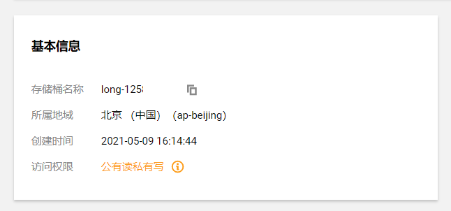

### 小结

1. 如何使用腾讯云上传图片呢?

   <details>     
   <summary>答案</summary> 
   <ul>
   <li>使用腾讯云的SDK软件开发工具包, 然后用他们内置的方法, 设置相关参数直接传递给服务器</li>
   </ul> 
   </details>


## 12.员工详情-更新用户资料数据

### 目标

实现用户头像的更新

### 分析

1.  目前头像的地址在 `src\components\UploadImg` 组件中
2.   需要将图片地址，传递给父组件
3.   通过 ref 获取到子组件实例，从而获取到用户头像地址
4.  在将图片传递到服务器以后，当打开个人详情页面时需要做数据回显处理

### 实现 

1. 在 `employees\detail\user-info.vue`  组件中获取用户头像地址

   ==不要忘记给upload-img组件添加imageUrl属性哟==

   ```js
   async saveUser() {
     // 获取到子组件中的图片地址
     const newimageUrl = this.$refs.imageUrl.imageUrl
     this.userInfo.staffPhoto = newimageUrl
   
     const res = await saveUserDetailByIdAPI(this.userInfo)
     if (!res.success) return this.$message.error(res.message)
     this.loadUserInfoById()
     this.$message.success(res.message)
   }
   ```

   

2. 在 `employees\detail\user-info.vue`  组件中将接口返回的图片回显给图片组件

   ```js
   async loadUserInfoById() {
     const res = await getUserDetailByIdAPI(this.userId).catch(err => err)
     if (!res.success) return this.$message.error(res.message)
     this.userInfo = res.data
   
     // 将接口返回的图片赋值给图片组件
     this.$refs.imageUrl.imageUrl = res.data.staffPhoto
   }
   ```

   

### 小结

1. 图片保存的思路是什么?

   <details>     
   <summary>答案</summary> 
   <ul>
   <li>前端使用el-upload组件, 选择文件上传得到图片文件对象</li>
   <li>把文件使用腾讯云的SDK上传到腾讯云的对象存储空间内, 返回一个腾讯云上的图片的地址</li>
   <li>然后保存到UploadImg组件内变量上, 点击更新按钮, 拿到图片地址和表单其他数据, 更新到自己的后台保存即可(保存的是图片的地址而不是图片文件本身呦)</li>
   </ul> 
   </details>


## 13.员工详情-实现图片上传进度条功能

### 目标

在图片上传的过程中，显示图片上传的进度条

### 分析

1.  在上传时，cos 支持配置 onProgress 回调，在这个回调函数中可以拿到当前上传的进度

   ```js
   // 自定义上传属性
   upload(res) {
     if (res.file) {
       cos.putObject({
         Bucket: 'xxx', // 存储桶的名称，必须
         Region: 'xxx', // 存储桶所在地域，必须字段
         Key: res.file.name, // 文件名，必须
         StorageClass: 'STANDARD', // 上传模式, 标准模式
         Body: res.file, // 上传文件对象
         // 上传进度条
         onProgress: function(progressData) {
           console.log(JSON.stringify(progressData))
         }
       }, (err, data) => {
         if (err === null && data.statusCode === 200) {
           this.imageUrl = `https:${data.Location}`
         }
       })
     }
   }
   ```

   

2.   进度条的显示使用 Element 提供的 `Progress 进度条` 组件 


### 实现

1. 更改组件结构，添加  `Progress 进度条` 组件 

   `src/components/UploadImg/index.vue`

   ```vue
   <el-upload
     class="avatar-uploader"
     action="#"
     :show-file-list="false"
     :on-success="handleAvatarSuccess"
     :before-upload="beforeAvatarUpload"
     :http-request="upload"
   >
     
     <i v-else class="el-icon-plus avatar-uploader-icon" />
     <el-progress v-if="showProgress" type="circle" :percentage="100" class="progress" />
   </el-upload>
   
   <style>
   .progress {
     position: absolute;
     display: flex;
     top: 50%;
     left: 50%;
     transform: translate(-50%, -50%);
     background: #e4e4e4;
     border-radius: 50%;
     opacity: 0.9;
   }
   </style>
   ```

   

2. 在 data 字段中添加 `percent` 字段

   ```js
   data() {
     return {
       percent: 0, // 图片的上传进度
       showProgress: false // 是够显示上传进度
     }
   }
   ```

   

3. 在 cos 实例的 `onProgress` 回调函数中获取到进度并赋值给 percent

   ```js
   methods: {
     // 自定义上传属性
     upload(res) {
       if (res.file) {
         // 显示进度条
         this.showProgress = true
         cos.putObject(
           {
             Bucket: 'long-1258431239', // 存储桶的名称，必须
             Region: 'ap-beijing', // 存储桶所在地域，必须字段
             Key: res.file.name, // 文件名，必须
             StorageClass: 'STANDARD', // 上传模式, 标准模式
             Body: res.file, // 上传文件对象
             // 上传进度条
             onProgress: (progressData) => {
               // 控制进度条的进度
               this.percent = progressData.percent * 100
             }
           },
           (err, data) => {
             if (err === null && data.statusCode === 200) {
               this.imageUrl = `https:${data.Location}`
               // 隐藏进度条
               this.showProgress = false
             }
           }
         )
       }
     }
   }
   ```


### 小结

1. 图片上传进度条如何做的?

   <details>     
   <summary>答案</summary> 
   <ul>
   <li>上传有个方法叫onProgress, 然后使用el-progress组件, 设置百分比值即可</li>
   </ul> 
   </details>


## 14.员工列表-在员工列表中显示头像

### 目标

在表格中显示员工头像

### 思路

通过自定义列，将图片显示在表格中

### 操作

1.  在 `src\views\employees\index.vue` 中的 table 上补充一列

   ```vue
   <el-table-column label="头像" width="120">
     <template slot-scope="scope">
       
     </template>
   </el-table-column>
   ```

   

2.  样式调整

   ```vue
   <style lang="scss" scoped>
   .staffPhoto {
     width: 100px;
     height: 100px;
     border-radius: 50%;
   }
   </style>
   ```

   

3.  此时可能部分图片无法正常显示（原因是图片本身地址有误，或者就是没有设置图片）


### 小结

1. 为什么有的图片没有了? 

   <details>     
   <summary>答案</summary> 
   <ul>
   <li>此时可能部分图片无法正常显示（原因是图片本身地址有误，或者就是没有设置图片）</li>
   </ul> 
   </details>
   
   


## 15.通用封装-封装全局图片组件

### 目标

封装全局图片组件，实现两个效果：

1.  没有src属性时，有一个默认图片
2.  统一样式


### 分析

1.  首先需要封装图片组件，然后进行全局注册
   - 使用 Element 提供的 [Image 图片](https://element.eleme.cn/#/zh-CN/component/image#jia-zai-shi-bai)
2.  在业务组件使用封装的组件
   - 组件使用者如果传递了图片，使用传递的图片
   -  如果没有传递图片，使用默认图片

### 实现

1. 新建组件 `src\components\ImageHolder\index.vue`

   ==把素材里的img文件夹, 放到`src\components\ImageHolder下面`==

   ```vue
   <template>
     <!-- el-image组件 ：https://element.eleme.io/#/zh-CN/component/image -->
     <el-image :src="src" class="img-container">
       <!-- error插槽：设置如果出错，要显示的内容 -->
       <template #error>
         <!-- 静态资源就近维护：把head.jpg这张图放在这个组件的目录下 -->
         
       </template>
     </el-image>
   </template>
   
   <script>
   export default {
     // 定义如何从父组件中接收数据
     props: {
       src: {
         type: String,
         default: ''
       }
     }
   }
   </script>
   
   <style scoped lang="scss">
   .img-container {
     border-radius: 50%;
   
     img {
       width: 100%;
     }
   }
   </style>
   
   ```

   

2. 全局注册组件

   ```js
   
   import ImageHolder from './ImageHolder'
   
   export default {
     install(Vue) {
       // 将图片组件挂载为全局组件
       Vue.component('ImageHolder', ImageHolder)
     }
   }
   
   ```

   

3. 在业务组件中封装组件

   ```vue
   <el-table-column label="头像" width="120">
       <template slot-scope="scope">
   		<image-holder class="staffPhoto" :src="scope.row.staffPhoto" />
       </template>
   </el-table-column>
   ```

   

### 小结

1. 我们为什么要封装图片组件

   <details>     
   <summary>答案</summary> 
   <ul>
   <li>可以统一设置, 然后统一使用</li>
   </ul> 
   </details>


