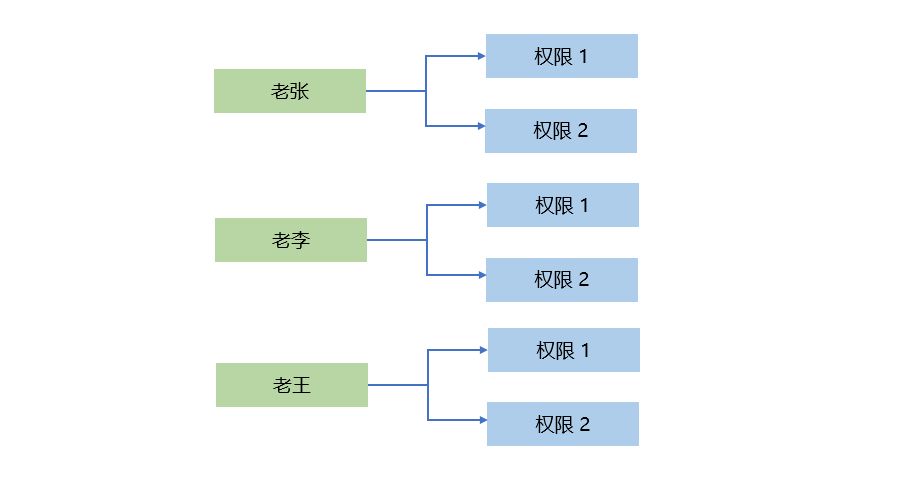
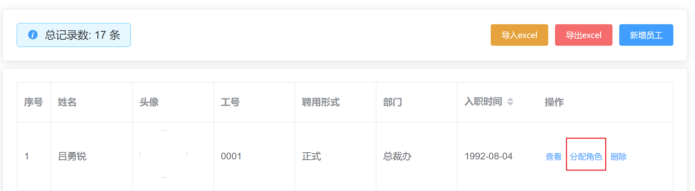
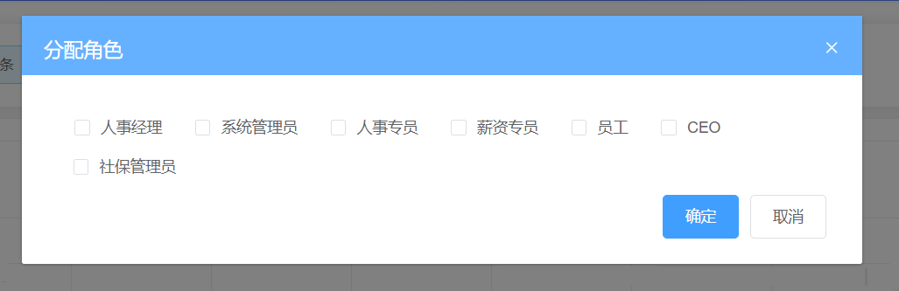
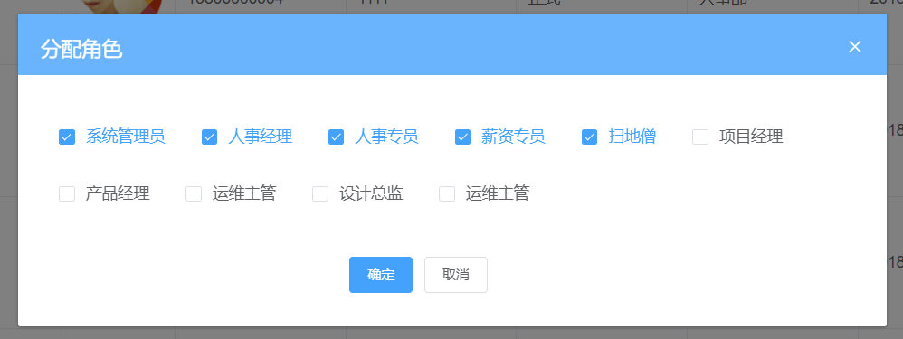
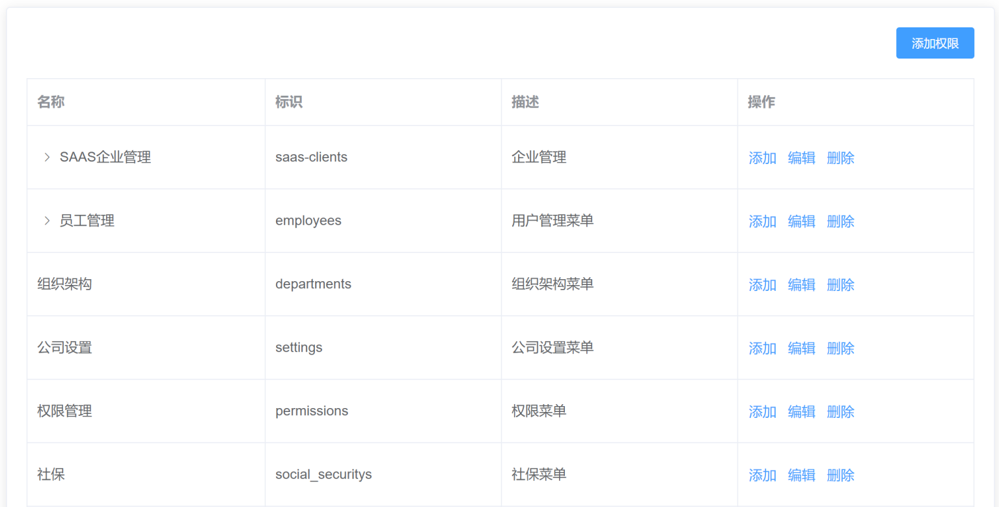
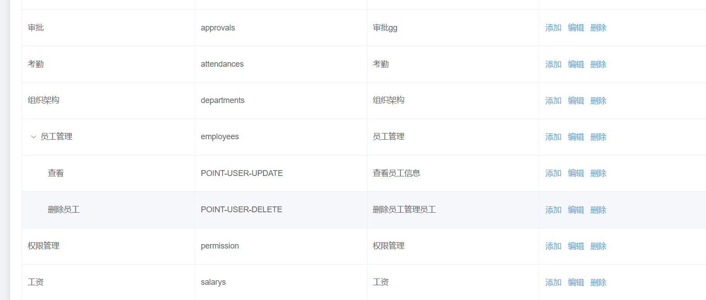
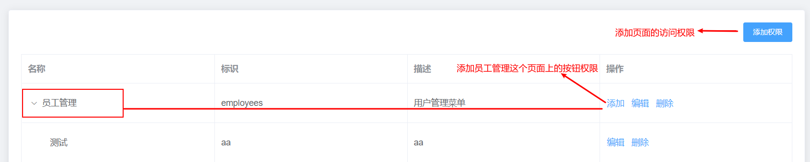
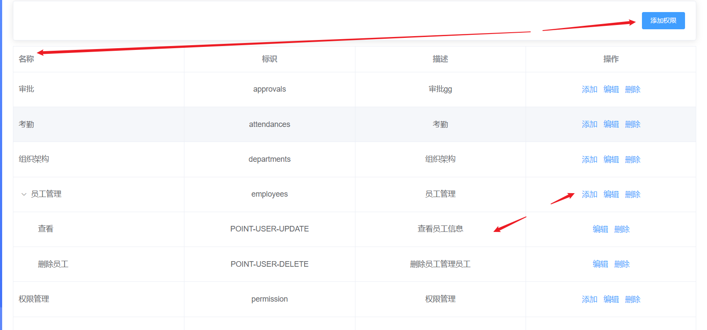
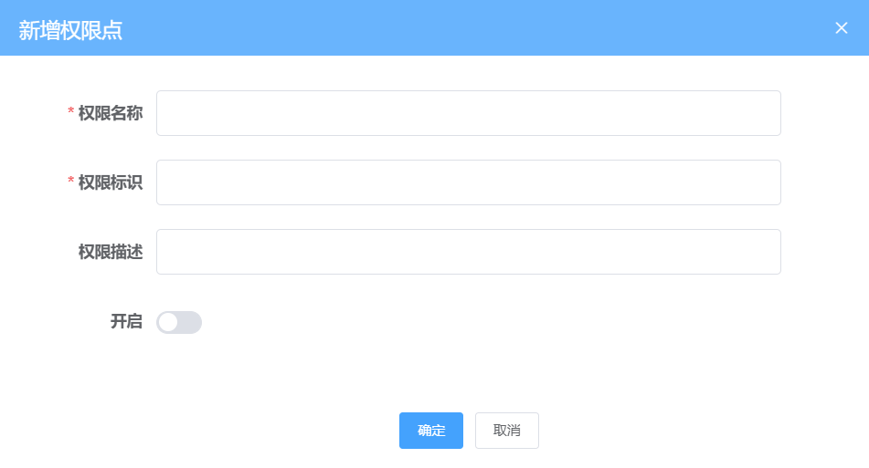

# Day10_权限管理

## 01.权限管理-RBAC的权限设计思想

### 目标

1.  了解传统的权限设计
2.  了解 RBAC 权限设计思想

### 分析

1.  **传统权限说明**

   ​					

   

   从上面的图中，我们发现，传统的权限设计是对**每个人**进行单独的权限设置，

   但这种方式已经不适合目前企业的高效管控权限的发展需求，因为每个人都要单独去设置权限

   
   
2.  **RBAC 权限设计思想说明**

   因此传统的诸多缺点，RBAC的权限模型就应运而生了，RBAC(Role-Based Access Control) ，也就是==基于角色的权限分配解决方案==，相对于传统方案，RBAC提供了中间层Role（角色），其权限模式如下：
   

   ​					


   RBAC 实现了用户和权限点的分离，想对某个用户设置权限，只需要对该用户设置相应的角色即可，而该角色就拥有了对应的权限，这样一来，权限的分配和设计就做到了极简，高效，当想对用户收回权限时，只需要收回角色即可，接下来，我们就在该项目中实施这一设想。

   

### 小结

1. 以前我们怎么管理用户的权限, 现在怎么做的?

   <details>     
   <summary>答案</summary> 
   <ul>
   <li>以前是给每个用户设置可以访问的路由页面路径列表, 或者权限来管理, 现在我们关心的是角色(类)能访问的权限, 而用户分发的是角色的身份</li>
   </ul> 
   </details>


## 02.角色管理-员工分配角色弹框

### 目标

实现给员工分配角色的弹框展示






### 分析

目前系统中已经有一些角色，我们下面要将这些角色分配给不同的员工，让他们进入系统后，做不同的事情。


用户和角色是**`1对多`**的关系：一个用户可以拥有多个角色，这样他就会具体这多个角色的权限了。比如公司的董事长可以查看全部的员工、可以对公司进行设置、也可以查看员工考勤


例如: 老王是董事长

方式1: 

老王这个员工, 分配角色的时候, 可以分配多个角色(人事专员-权限1和2, 薪资专员-权限1和3, 考勤专员-权限4和5.....) -> 老王就有很多功能

上面的分配有点麻烦, 所以更好的做法

方式2: 

新建角色 -> 董事长 -> 分配权限点(1, 2, 3, 4, 5) -> 给老王设置角色就不需要上面那些小的了, 直接设置一个董事长就全有了


因为功能比较复杂，因此我们需要按照如下步骤进行开发

1.  把具体的功能给拆分出去（角色的功能比较复杂，拆分组件会减轻工作量）
2.  通过 Element 提供的 Dialog 组件实现弹层


### 实现

1.  创建 `src\views\employees\components\assignRoleDialog.vue` 组件

2.  初始化页面结构

   ```html
   <template>
     <div>
       <!-- 渲染角色列表 -->
   
       <el-row class="footer" type="flex" justify="center">
         <el-col :span="6">
           <el-button type="primary" size="small">确定</el-button>
           <el-button size="small" @click="cancleDialog">取消</el-button>
         </el-col>
       </el-row>
     </div>
   </template>
   
   <script>
   export default {
     name: 'AssignRole',
     props: {
       // 用户的id 用来查询当前用户的角色信息
       userId: {
         type: String,
         default: null
       }
     },
     data() {
       return {}
     },
     methods: {
       // 取消弹框
       cancleDialog() {
         this.$emit('close')
       }
     }
   }
   </script>
   
   <style lang="scss" scoped>
   .footer {
     margin-top: 30px;
   }
   </style>
   
   ```

   

3.  导入组件，在`src/views/employees/index.vue`并放置到弹框中

   ```js
   import AssignRoleDialog from './components/assignRoleDialog.vue'
   ```

   ```js
   components: {
     AssignRoleDialog
   }
   ```

   ```html
   <!-- 员工-分配角色权限 - 弹窗 -->
   <el-dialog title="分配角色" :visible="showRoleDialog" @close="cancleDialog">
     <!-- 设置角色组件 -->
     <assign-role-dialog @close="showRoleDialog = false" />
   </el-dialog>
   ```

   ```js
   // 关闭分配角色弹框
   cancleDialog() {
     this.showRoleDialog = false
   }
   ```

   

4.  点击分配角色绑定事件处理程序，并传递 ID

   ```html
   <el-button type="text" size="small" @click="setEmp(scope.row.id)">分配角色</el-button>
   ```

   

5.  在对应的事件处理中

   - 接收 ID，并传递给组件
   - 让弹框展示
   - data里定义userId: '' 变量
   
   ```js
   // 分配角色
   setEmp(id) {
     this.userId = id
     this.showRoleDialog = true
   }
   ```
   
   ```html
   <!-- 设置角色组件 -->
   <assign-role-dialog :user-id="userId" @close="showRoleDialog = false" />
   ```

6. 子组件内接收userId变量, 在`src/views/employees/components/assignRoleDialog.vue`中

   ==其实这一步已经在上面埋伏好了==

   ```js
   props: {
       // 用户的id 用来查询当前用户的角色信息
       userId: {
         type: String,
         default: null
       }
     }
   ```

### 小结

1. 角色分配我们要做什么效果?

   <details>     
   <summary>答案</summary> 
   <ul>
   <li>弄一个弹框, 把内部的内容单独封装一个组件</li>
   </ul> 
   </details>


## 03.角色管理-获取角色列表并用渲染

### 目标

1.  学习 Checkbox 多选框 组件的使用
2.  获取角色列表数据
3.  Checkbox  + 列表数据，渲染角色列表结构

### 分析

1.  学习 [Checkbox 多选框](https://element.eleme.cn/#/zh-CN/component/checkbox#duo-xuan-kuang-zu) 的使用
2.  准备 api 接口发送请求获取后端数据
3.  开始渲染角色列表的结构


### 组件学习

1.  页面结构

   - v-model的值是数组（表示多选）
   - 它的子元素el-checkbox的label属性决定了选中这一项之后值

   ```vue
   <!-- 渲染角色列表 -->
   <el-checkbox-group v-model="roleIdArr">
     <el-checkbox label="复选框 A" />
     <el-checkbox label="复选框 B" />
     <el-checkbox label="复选框 C" />
   </el-checkbox-group>
   
   <script>
   export default {
     data () {
   	return {
   	  roleIdArr: [] // 保存当前选中的权限列表
   	}
     }
   }
   </script>
   ```

   

### 实现

1. 导入获取角色列表的方法, 在`src/views/employees/index.vue`引入使用, 然后传值进入到弹窗组件

   ==在api/setting.js中已经定义过了, 直接导入使用==

   ```js
   import { getRolesAPI } from '@/api'
   ```

   

2. 调用该方法，获取角色列表数据

   ```js
   data() {
     return {
       roleIds: [], // 被选中项
       roleList: [] // 角色列表数据
     }
   },
   
   created() {
       // ...其他
     	// 获取所有角色信息
       this.getRoleListFn()
   },
   
   methods: {
     // 获取角色列表
     async getRoleListFn() {
   	const res = await getRolesAPI()
   	this.roleList = res.data.rows
     }
   }
   ```

   

3. 向子组件传值进入

   ```html
   <!-- 员工-分配角色权限 - 弹窗 -->
   <el-dialog title="分配角色" :visible="showRoleDialog" @close="cancleDialog">
       <!-- 设置角色组件 -->
       <assign-role-dialog :user-id="userId" :role-list="roleList" @close="showRoleDialog = false" />
   </el-dialog>
   ```

4.  在`views/employees/components/assignRoleDialog.vue`中接收传递过来的角色数组数据

    ```js
    props: {
        // ...
        // 接收所有角色数据
        roleList: {
          type: Array,
          required: true
        }
      }
    ```

    

### 小结

1. 我们为何要把数组定义在逻辑页面, 传入, 写子组件里也行, 那为何还要写在外面?

   <details>     
   <summary>答案</summary> 
   <ul>
   <li>组件一般接收数据展示, 或者有一些事件, 触发传回到逻辑页面, 而且我们在用一些第三方封装的组件也是这个思想, 组件只负责展示数据和一些简单的交互</li>
   </ul> 
   </details>


## 04.角色管理-获取员工已有角色数据并回填

### 目标

获取员工已有的数据，将获取到的数据回填到复选框内

​					

### 分析

1. 首先需要获取到当前员工已有的权限
2.  将获取到的员工数据中的 roleIds 权限字段赋值给 data 中的 roleIds

### 实现

1. 在`api/employees.js`里其实已经定义过了, 改个注释

   ```js
   /**
    * @description: 获取用户详细信息
    * @param {*} id 用户id
    * @return {*}
    */
   export function getUserDetailByIdAPI(id) {
     return request({
       url: `/sys/user/${id}`
     })
   }
   ```

   

2. 导入获取员工详情的 API

   ```js
   import { getUserDetailByIdAPI } from '@/api'
   ```

   

3. 调用获取员工详情数据的方法

   ```js
   
   methods: {
     // 调用员工详情数据
     async getUserRoles() {
       const infoRes = await getUserDetailByIdAPI(this.userId)
       if (!infoRes.success) return this.$message.error(infoRes.message)
       this.roleIds = infoRes.data.roleIds
     },
     // ...其他
     // 分配角色-按钮点击事件
     // 分配角色
       setEmp(id) {
         this.userId = id
         this.showRoleDialog = true
   
         // 获取员工详细数据
         this.getUserRoles()
       }
   }
   ```


### 小结

1. 为什么我们一直在请求准备数据, 不在组件内渲染呢?

   <details>     
   <summary>答案</summary> 
   <ul>
   <li>因为根据需求发现, 我们需要全部的角色信息列表, 还需要当前登录的这个用户的角色信息, 所以先准备好2个数组的数据, 再去铺设, 还可以设置默认选中哪些. 所以先准备好数据, 一会儿铺设</li>
   </ul> 
   </details>


## 05.角色管理-数据铺设和默认选择

### 目标

把角色信息, 在弹窗组件中显示, 并接收用户选择的数据

### 讲解

1. 在子组件`employees/components/assignRoleDialog.vue`中, 铺设数据

   ```vue
   <!-- 渲染角色列表 -->
   <el-checkbox-group v-model="roleIdArr">
       <el-checkbox v-for="obj in roleList" :key="obj.id" :label="obj.name" :value="obj.id" />
   </el-checkbox-group>
   ```

2. 设置默认的选择

   ==在内部监听外面传入值的变化, 同步给子组件内私有变量, 影响上面多选框的选择==

   ```js
   watch: {
       roleIds() {
           this.roleIdArr = this.roleIds
       }
   },
   ```

### 小结

1. 默认选择如何做的?

   <details>     
   <summary>答案</summary> 
   <ul>
   <li>复选框v-model设置数组, 默认和每个value匹配上, 默认就选中了</li>
   </ul> 
   </details>


## 06.角色管理-完成角色管理的分配

### 目标

给员工选定角色，同步到服务器，实现角色管理的分配

### 分析

1.  封装角色管理分配的 API
2.  点击确定，调用接口，完成角色分配

### 实现

1.  在 `src\api\employees.js` 文件中封装角色管理分配的 API

   ```js
   /**
    * @description: 为员工分配角色
    * @param {*} data { id:当前用户id, roleIds:选中的角色id组成的数组 }
    * @return {*}
    */
   export function assignRolesAPI(data) {
     return request({
       url: '/sys/user/assignRoles',
       data,
       method: 'put'
     })
   }
   
   ```

   

2. 点击确定，调用接口，完成角色分配, 把数组返回给父组件, 在子组件`employees/components/assignRoleDialog.vue`实现

   ```vue
   <el-button type="primary" size="small" @click="confirmFn">确定</el-button>
   ```

3. 对应点击事件的方法

   ```js
   // 确定-点击事件
   confirmFn() {
       this.$emit('confirm', this.roleIdArr)
   }
   ```

4. 在父级`src/employees/index.vue`中, 接收事件和选择的角色id的数组

   ```vue
   <!-- 员工-分配角色权限 - 弹窗 -->
   <el-dialog title="分配角色" :visible="showRoleDialog" @close="cancleDialog">
       <!-- 设置角色组件 -->
       <assign-role-dialog :user-id="userId" :role-list="roleList" :role-ids="roleIds" @close="showRoleDialog = false" @confirm="addRoleFn" />
   </el-dialog>
   ```

5. 对应父级的事件方法

   ```js
   import { assignRolesAPI } from '@/api'
   ```

   

   ```js
   methods: {
     // 子组件弹窗 - 点击确定 - 员工角色分配
       async addRoleFn(roleIds) {
       // 调用 API，传入参数
         const res = await assignRolesAPI({ id: this.userId, roleIds: roleIds })
         if (!res.success) return this.$message.error(res.message)
   
         // 员工分配成功，给用户提示
         this.$message.success(res.message)
         // 关闭弹框
         this.showRoleDialog = false
         // 重新获取当前当前列表数据
         this.getEmployeeList()
       }
   }
   ```

   

### 小结

1. 角色管理-角色分配传递什么类型数据给后台

   <details>     
   <summary>答案</summary> 
   <ul>
   <li>外层是对象, 里面是角色id的数组给后台, 但其实会被axios转成json字符串发给后台</li>
   </ul> 
   </details>


## 07.权限点-权限点管理说明

### 目标

理解权限点管理的业务需求

### 分析

在前面我们已经给员工角色， 那么权限是什么

在企业服务中，权限一般分割为 **页面访问权限**，**按钮操作权限**，**API访问权限**，

API权限多见于在后端进行拦截，所以我们这一版本只做**`页面访问权限`**和**`按钮操作权限`**


1.  页面访问权限： 是否有权限访问某个菜单
   - 例如：是否可以在左侧菜单中看到 员工管理 这个链接
2.  按钮操作权限：是否有权限操作页面上的某个按钮功能
   - 例如：同样是人事部的员工，并不是所有人都可以看到 **导入excel** 这里按钮


### 小结

1. 我们做权限管理, 主要有哪3类权限控制?

   <details>     
   <summary>答案</summary> 
   <ul>
   <li>页面访问权限, 按钮等交互可见权限, 还有api接口权限一般携带token后端判断, 返回状态</li>
   </ul> 
   </details>


## 08.权限点-静态结构搭建

### 目标

1.  完成权限管理页面静态结构的搭建
2.  完成权限管理增删改查请求接口 api 的封装




### 分析

1.  使用 Element 提供的 Table 组件实现结构的搭建
2.   实现 权限管理增删改查请求 api 的封装

 

### 实现

1.  在 `src\views\permission\index.vue` 组件中实现权限管理页面的搭建

   ```html
   <template>
     <div class="permission-container">
       <div class="app-container">
         <!-- 表格 -->
         <el-card>
           <div style="text-align: right; margin-bottom: 20px">
             <el-button type="primary" size="small">添加权限</el-button>
           </div>
   
           <el-table border>
             <el-table-column label="名称" />
             <el-table-column label="标识" />
             <el-table-column label="描述" />
             <el-table-column label="操作">
               <template>
                 <el-button type="text">添加</el-button>
                 <el-button type="text">编辑</el-button>
                 <el-button type="text">删除</el-button>
               </template>
             </el-table-column>
           </el-table>
         </el-card>
       </div>
     </div>
   </template>
   
   <script>
   export default {}
   </script>
   
   <style lang="scss" scoped></style>
   
   ```

   

2.  权限管理页面接口 API 封装

   ```js
   import request from '@/utils/request'
   
   // 获取权限列表
   export function getPermissionListAPI(params) {
     return request({
       url: '/sys/permission',
       params
     })
   }
   
   // 新增权限
   export function addPermissionAPI(data) {
     return request({
       url: '/sys/permission',
       method: 'post',
       data
     })
   }
   
   // 更新权限
   export function updatePermissionAPI(data) {
     return request({
       url: `/sys/permission/${data.id}`,
       method: 'put',
       data
     })
   }
   
   // 删除权限
   export function delPermissionAPI(id) {
     return request({
       url: `/sys/permission/${id}`,
       method: 'delete'
     })
   }
   
   // 获取权限详情
   export function getPermissionDetailAPI(id) {
     return request({
       url: `/sys/permission/${id}`
     })
   }
   
   ```
   
3.  在同一出口导出

    ```js
    export * from './user'
    export * from './departments'
    export * from './setting'
    export * from './employees'
    export * from './permission'
    
    ```

    


### 小结

1. 权限点页面作用是什么?

   <details>     
   <summary>答案</summary> 
   <ul>
   <li>设置此公司都有哪些权限功能, 角色是你的身份, 而权限是你和别人都是人事, 但是权限不同.</li>
   </ul> 
   </details>


## 09.权限点-获取权限管理数据并渲染

### 目标

1.  获取权限管理列表数据的获取
2.  使用渲染权限管理列表页


### 分析

1.  使用封装的 API 获取到权限管理列表数据
2.   给权限管理页面结构 Table 组件绑定相关的属性，实现列表渲染


### 实现

1.  导入获取权限管理列表数据的方法

   ```js
   import { getPermissionListAPI } from '@/api'
   ```

   

2.  调用 API 取权限管理列表数据，并渲染权限管理页面结构

   ```html
   <template>
     <div class="permission-container">
       <div class="app-container">
         <!-- 表格 -->
         <el-card>
           <div style="text-align: right; margin-bottom: 20px">
             <el-button type="primary" size="small">添加权限</el-button>
           </div>
   
           <el-table border :data="permissionList">
             <el-table-column label="名称" prop="name" />
             <el-table-column label="标识" prop="code" />
             <el-table-column label="描述" prop="description" />
             <el-table-column label="操作">
               <template>
                 <el-button type="text">添加</el-button>
                 <el-button type="text">编辑</el-button>
                 <el-button type="text">删除</el-button>
               </template>
             </el-table-column>
           </el-table>
         </el-card>
       </div>
     </div>
   </template>
   
   <script>
   import { getPermissionListAPI } from '@/api'
   
   export default {
     data() {
       return {
         permissionList: [] // 权限管理列表数据
       }
     },
     created() {
       // 调用获取权限管理列表的数据
       this.getPermissionList()
     },
     methods: {
       // 获取权限管理列表的数据
       async getPermissionList() {
         const res = await getPermissionListAPI().catch(err => err)
         if (!res.success) return this.$message.error(res.message)
         this.permissionList = res.data
       }
     }
   }
   </script>
   
   <style lang="scss" scoped></style>
   
   ```

   

### 小结

1. 表格的prop写在哪里, 有什么作用?

   <details>     
   <summary>答案</summary> 
   <ul>
   <li>写在el-table-column上, 然后内部会循环数组, 每个对象对应一行, 每个单元格对应对象的哪个字段使用在单元格要用prop指定对象的key名</li>
   </ul> 
   </details>


## 10.权限点-将权限管理表格转化树形

### 目标

让权限管理页面的数据按照树行组件进行展示

### 分析

table 表格组件支持树类型的数据的显示，当 row 中包含 `children` 字段时，被视为树形数据。渲染树形数据时，必须要指定 `row-key`，因此需要实现以下两个步骤：

1.  数据要转成 tree 结构
   - 调用封装的 tranListToTreeData 方法
2.  表格要支持 tree 结构
   - 给 table 表格添加 row-key 属性


### 实现

1.  导入封装的 tranListToTreeData 方法

   ```js
   import { transTree } from '@/utils/index'
   
   export default {
     name: 'Permission',
     methods: {
       // 获取权限管理列表的数据
       async getPermissionList() {
         const res = await getPermissionListAPI().catch(err => err)
         if (!res.success) return this.$message.error(res.message)
         // 一级元素的 id 为 0
         this.permissionList = transTree(res.data, '0')
       }
     }
   }
   ```
   
   
   
2. 给 table 表格添加 row-key 属性

   ==table里也可以直接集成树形结构==

   ```html
   <el-table border :data="permissionList" row-key="id"></el-table>
   ```

效果



==row-key的值, 类似v-for的key值, 内部会开始尝试使用.children来决定是否有子数据==

### 小结

1. el-table内部是否可以支持树形结构

   <details>     
   <summary>答案</summary> 
   <ul>
   <li>可以支持树形结构, 在el-table上设置row-key为</li>
   </ul> 
   </details>


## 11.权限点-实现按钮操作权限控制-需要调整

### 目标

只有页面级别的节点，才能有**添加** 功能

因此本节目标：实现按钮操作权限控制

### 实现

1.  当 type 为 1 时为路由页面访问权限
2.  当 type 为 2 时为按钮功能操作权限

### 实现

在页面结构中，找到 操作位置的结构，使用 type  做判断

```html
<el-table-column label="操作">
  <template #default="{ row }">
    <el-button v-if="row.type === 1" type="text">添加</el-button>
    <el-button type="text">编辑</el-button>
    <el-button type="text">删除</el-button>
  </template>
</el-table-column>
```

### 小结

1. 如何控制谁有某个按钮/没有按钮?

   <details>     
   <summary>答案</summary> 
   <ul>
   <li>根据数据来决定, 页面的显示, 这就是数据驱动页面</li>
   </ul> 
   </details>


## 12.权限点-添加权限弹框

### 目标

1.  实现添加权限弹框中展示
2.  实现添加权限弹框的表单校验

### 分析

1.  使用 Element 提供的 Dialog 对话框 组件 + Form 组件实现弹框展示
2.  给 Form 表单组件添加 Rules 属性，进行校验
3.  用户点击添加，显示弹框
4.  用户点击取消和 x 号，隐藏弹框

### 实现

1. 新建`src/views/permission/components/perDialog.vue`文件, 定义弹框表单需要使用的数据

   ```js
   props: {
       // 是否显示弹层
       showDialog: {
         type: Boolean
       }
   },
   data() {
     return {
       permissionList: [], // 权限管理列表数据
       formData: {
         name: '', // 名称
         code: '', // 权限标识
         description: '', // 描述
         enVisible: '0', // 开启
         pid: '', // 添加到哪个节点下
         type: '' // 类型吖
       },
       rules: {
         name: [{ required: true, message: '权限名称不能为空', trigger: 'blur' }],
         code: [{ required: true, message: '权限标识不能为空', trigger: 'blur' }]
       }
     }
   }
   ```

   

2.  实现弹框和数据的绑定

   ```html
   <!-- 放置一个弹层 用来编辑新增节点 -->
   <el-dialog title="新增权限点" :visible="showDialog" @close="btnCancel">
     <!-- 表单 -->
     <el-form ref="perForm" :model="formData" :rules="rules" label-width="120px">
       <el-form-item label="权限名称" prop="name">
         <el-input v-model="formData.name" style="width:90%" />
       </el-form-item>
       <el-form-item label="权限标识" prop="code">
         <el-input v-model="formData.code" style="width:90%" />
       </el-form-item>
       <el-form-item label="权限描述">
         <el-input v-model="formData.description" style="width:90%" />
       </el-form-item>
       <el-form-item label="开启">
         <el-switch
           v-model="formData.enVisible"
           active-value="1"
           inactive-value="0"
         />
       </el-form-item>
     </el-form>
     <el-row slot="footer" type="flex" justify="center">
       <el-col :span="6">
         <el-button size="small" type="primary">确定</el-button>
         <el-button size="small" @click="btnCancel">取消</el-button>
       </el-col>
     </el-row>
   </el-dialog>
   ```

   

3. 点击取消和弹框右上角 x 号，关闭弹框, 在子组件内, 定义

   ```vue
   <el-dialog title="新增权限点" :visible="showDialog" @close="btnCancel">
   ```

   ```js
   // 关闭弹框
   btnCancel() {
     this.formData = {
       name: '', // 名称
       code: '', // 标识
       description: '', // 描述
       type: '', // 类型 该类型 不需要显示 因为点击添加的时候已经知道类型了
       pid: '', // 因为做的是树 需要知道添加到哪个节点下了
       enVisible: '0' // 开启
     }
     this.$refs.perForm.resetFields()
     this.$emit('close')
   }
   ```

4.  点击弹框显示添加权限弹框

    ```html
    <div style="text-align: right; margin-bottom: 20px">
      <el-button type="primary" size="small" @click="showDialog = true">添加权限</el-button>
    </div>
    ```

    ```html
    <el-button v-if="row.type === 1" type="text" @click="showDialog = true">添加</el-button>
    ```

5.  引入到父级页面使用

    ```js
    import perDialog from '@/views/permission/components/perDialog.vue'
    ```

    ```vue
    <script>
    export default {
      components: {
        perDialog
      },
      data() {
        return {
          permissionList: [], // 权限管理列表数据
          showDialog: false // 控制弹出框是否显示
        }
      }
    }
    </script>
    ```

    

### 小结

1. 添加权限弹框, 封装的是什么部分?

   <details>     
   <summary>答案</summary> 
   <ul>
   <li>是整个el-dialog+el-form, 表单对象在里面, 然后外面控制显示/隐藏, 需要值再传出来</li>
   </ul> 
   </details>


## 13.权限点-添加按钮数据分析

### 目的

了解添加权限和页面权限上添加的不同



### 分析

新增的权限点分为两类：

1. 点击右上角的添加权限， 添加是路由的访问权限也就是菜单的权限（左侧菜单栏的内容） （type=1，pid='0')
2. 点击表格中的添加权限点，添加的是路由对应页面里面按钮的操作权限 (type=2，pid为当前需要添加项的 id)



### 实现

1.  给两个添加按钮绑定事件

   ```html
   <el-button type="primary" size="small" @click="addPermission(1, '0')">添加权限</el-button>
   ```

   ```html
   <el-button v-if="row.type === 1" type="text" @click="addPermission(2, row.id)">添加</el-button>
   ```

   

2.  绑定事件处理程序, 给子组件传入

   ```vue
   <template>
     <div class="permission-container">
       <div class="app-container">
         <!-- 表格 -->
         
         <!-- 弹窗 -->
         <per-dialog ref="perDialog" :pid="pid" :show-dialog="showDialog" :type="type" @close="dialogCloseFn" @confirm="confirmFn" />
       </div>
     </div>
   </template>
   
   <script>
   export default {
     data() {
       return {
         permissionList: [], // 权限管理列表数据
         showDialog: false, // 控制弹出框是否显示
         type: 0, // 添加权限-类型
         pid: 0 // 添加权限-pid
       }
     },
     methods: {
       // 添加权限 - 按钮点击事件
       addPermission(type, id) {
         // 控制弹框展示
         this.showDialog = true
   
         // 记录当前添加的关键信息
         this.type = type
         this.pid = id
       }
     }
   }
   </script>
   ```

3. 在子组件-弹窗组件接收和绑定

   ```vue
   <template>
     <!-- 放置一个弹层 用来编辑新增节点 -->
     <el-dialog title="新增权限点" :visible="showDialog" @close="btnCancel">
       <!-- 表单 -->
       <el-form ref="perForm" :model="formData" :rules="rules" label-width="120px">
         <el-form-item label="权限名称" prop="name">
           <el-input v-model="formData.name" style="width:90%" />
         </el-form-item>
         <el-form-item label="权限标识" prop="code">
           <el-input v-model="formData.code" style="width:90%" />
         </el-form-item>
         <el-form-item label="权限描述">
           <el-input v-model="formData.description" style="width:90%" />
         </el-form-item>
         <el-form-item label="开启">
           <el-switch
             v-model="formData.enVisible"
             active-value="1"
             inactive-value="0"
           />
         </el-form-item>
       </el-form>
       <el-row slot="footer" type="flex" justify="center">
         <el-col :span="6">
           <el-button size="small" type="primary">确定</el-button>
           <el-button size="small" @click="btnCancel">取消</el-button>
         </el-col>
       </el-row>
     </el-dialog>
   </template>
   
   <script>
   export default {
     props: {
       // ...其他
       // 添加权限-类型
       type: {
         type: [Number, String],
         default: 0
       },
       // 添加权限-pid(目标)
       pid: {
         type: [Number, String],
         default: 0
       }
     },
     watch: {
       showDialog() {
         this.formData.type = this.type
         this.formData.pid = this.pid
       }
     }
   }
   </script>
   ```

   

### 小结

1. 2种添加权限有什么区别?

   <details>     
   <summary>答案</summary> 
   <ul>
   <li>最外层, 点击的是路由导航的权限控制, 有哪些页面</li>
   <li>每层上的点击, 控制这个页面有哪些功能, 功能的权限名字</li>
   </ul> 
   </details>


## 14.权限点-实现权限添加功能

### 目标

实现权限的添加功能

​									

### 分析

1.  验证表单中的 权限名称 和 权限标识 用户是否输入
2.  当用户点击 确定按钮时，调用添加权限 API ，发起添加请求

### 实现

1. 在子组件, 监听确定事件, 把表单数据对象传出

   ```vue
   <el-button size="small" type="primary" @click="confirmFn">确定</el-button>
   <script>
   export default {
     methods: {
       // 确定按钮-点击事件
       confirmFn() {
         // 验证用户是否输入了必填项
         this.$refs.perForm.validate(async valid => {
           if (valid) {
             this.$emit('confirm', this.formData)
           }
         })
       }
     }
   }
   </script>
   ```

   

2. 在父组件`permission/index.vue`导入 API 方法

   ```js
   import { getPermissionListAPI, addPermissionAPI } from '@/api/permission'
   ```

   

3. 调用 API，发起添加请求

   ```vue
   <template>
     <div class="permission-container">
       <div class="app-container">
         <!-- 表格 -->
   
         <!-- 弹窗 -->
         <per-dialog ref="perDialog" :pid="pid" :show-dialog="showDialog" :type="type" @close="dialogCloseFn" @confirm="confirmFn" />
       </div>
     </div>
   </template>
   
   <script>
       // ...其他
   
   export default {
       // ...其他
     methods: {
       // ...其他
       // 添加-确认-提交权限
       async confirmFn(data) {
         // 调用接口，传入参数，发起请求
         const res = await addPermissionAPI(data).catch(err => err)
         if (!res.success) return this.$message.error(res.message)
   
         // 重新获取页面数据
         this.getPermissionList()
         this.$message.success(res.message)
         this.$refs.perDialog.$refs.perForm.resetFields()
         this.showDialog = false
       }
     }
   }
   </script>
   
   ```

   

### 小结

1. 我们添加后, 如何清空的表单?

   <details>     
   <summary>答案</summary> 
   <ul>
   <li>通过两层$refs找到子组件内的el-form对象, 调用内部清除的方法</li>
   </ul> 
   </details>


## 15.权限点-编辑权限点-铺设

### 目标

实现权限点编辑功能

### 分析

1.  添加和编辑共用一个弹层框

2.  补充一个数据项`isEdit`来区别是否处于编辑状态

3.  点击了编辑之后：

   - 获取详情
   - 显示在表单中
   - 保存用户修改后的结果
     - 保存成功，关闭弹层，重新请求数据，提示

### 实现

1.  导入获取当前权限以及编辑权限的 API

   ```js
   import { getPermissionDetail, updatePermission } from '@/api/permission'
   ```

   

2. 父组件内,  在data定义isEdit变量, 点击新增和编辑, 分别改变对应变量状态值

   ```vue
   <el-button type="text" @click="editFn(row.id)">编辑</el-button>
   ```

   ```js
   // 编辑-点击事件
   editFn(id) {
       this.isEdit = true
   }
   ```

   

3. 点击编辑，获取当前权限点数据，并传入给子组件表单, 显示

   ==data中定义formData变量==

   ```js
   // 编辑-点击事件
   async editFn(id) {
       this.isEdit = true
       this.showDialog = true
       const res = await getPermissionDetailAPI(id).catch(err => err)
       if (!res.success) return this.$message.error(res.message)
       // 数据回显
       this.formData = res.data
   }
   ```

   

4. 传递给子组件

   ```vue
   <!-- 弹窗 -->
   <per-dialog ref="perDialog" :pid="pid" :show-dialog="showDialog" :type="type" :form-data-obj="formData" @close="dialogCloseFn" @confirm="confirmFn" />
   ```

   

5. 子组件接收formDataObj, 然后赋予给子组件的表单对象上

   ```vue
   <script>
   export default {
     props: {
       // ...其他
       // 编辑时-传入的数据对象
       formDataObj: {
         type: Object,
         default: _ => {}
       }
     },
     watch: {
       // ...其他
       formDataObj() {
         this.formData = { ...this.formDataObj }
       }
     }
   }
   </script>
   
   ```

   


### 小结

1. 编辑如何做的, 思路是?

   <details>     
   <summary>答案</summary> 
   <ul>
   <li>点击按钮传递对应的权限id, 然后拿到详情数据对象, 传入到子组件, 在表单props监听值, 然后赋予给子组件内部的表单对象回填</li>
   </ul> 
   </details>


## 16.权限点-编辑权限点-调接口

### 目标

实现权限点编辑功能

### 分析

- 保存用户修改后的结果
  - 保存成功，关闭弹层，重新请求数据，提示

### 实现

1. 导入获取当前权限以及编辑权限的 API

   ```js
   import { getPermissionDetailAPI, updatePermissionAPI } from '@/api/permission'
   ```

   

2. 动态设置弹框标题, 传递状态子组件, 判断

   ```vue
   <per-dialog ref="perDialog" :pid="pid" :show-dialog="showDialog" :type="type" :form-data-obj="formData" :is-edit="isEdit" @close="dialogCloseFn" @confirm="confirmFn" />
   ```

3. 在确定的事件中, 判断是新增还是更新

   ```js
   // 添加-确认-提交权限
   async confirmFn(data) {
       if (this.isEdit) {
           // 更新
           // 调用接口，传入参数，发起请求
           const res = await updatePermissionAPI(data).catch(err => err)
           if (!res.success) return this.$message.error(res.message)
           this.$message.success(res.message)
       } else {
           // 新增
           // 调用接口，传入参数，发起请求
           const res = await addPermissionAPI(data).catch(err => err)
           if (!res.success) return this.$message.error(res.message)
           this.$message.success(res.message)
       }
   
       // 重新获取页面数据
       this.getPermissionList()
       this.$refs.perDialog.$refs.perForm.resetFields()
       this.showDialog = false
   },
   ```

   

### 小结

1. 编辑和新增调用接口是如何区分的?

   <details>     
   <summary>答案</summary> 
   <ul>
   <li>以后有多种状态判断,我们可以想想有什么变量可以用, 如果没有就创造一个</li>
   </ul> 
   </details>


## 17.权限点-编辑权限点-去重

### 目标

修改编辑弹框中的 bug

### 分析

新增

* 名字: 要加的是==子级==的权限名字, 不能和子级们同名
* 权限标识, 是和所有人比, 唯一不能重复

编辑

* 名字: 不能和点击这项的==同级==重名 - 不包含自己(排除)
* 权限标识:  是和所有人比, 唯一不能重复 - 不包含自己(排除)

### 实现

1.  在子组件`permission/component/perDialog.vue` data 中声明两个校验规则

   ```js
   // 校验权限名称
   const validName = (rule, value, callback) => {
     // 添加时的校验： 名字不能取子元素的名字
     let existNameList = this.originList.filter(item => item.pid === this.formData.pid)
     if (this.isEdit) {
       // 编辑时的校验： 名字不能取兄弟（排除自己）的名字
       // 找兄弟，排除自己
       existNameList = this.originList.filter(item => item.pid === this.formData.pid && item.id !== this.formData.id)
     }
     existNameList.map(it => it.name).includes(value)
       ? callback(new Error(value + '已经占用'))
       : callback()
   }
   
   // 校验权限标识
   const validCode = (rule, value, callback) => {
     // 添加时的校验：code不能重复
     let existCodeList = this.originList
     if (this.isEdit) {
       // 编辑时的校验: code能取自己
       existCodeList = this.originList.filter(item => item.id !== this.formData.id)
     }
     existCodeList.map(it => it.code).includes(value)
       ? callback(new Error(value + '已经占用'))
       : callback()
   }
   ```

   

2.  在`permission/index.vue`父页面中,  data 中声明 originList 字段为规则中需要使用的字段

   ```js
   originList: [] // 在做校验时需要用到的数据
   ```

   

3.  在数据加载成功之后，对originList做初始化

   ```js
   // 获取权限管理列表的数据
   async getPermissionList() {
     const res = await getPermissionList().catch(err => err)
     if (!res.success) return this.$message.error(res.message)
     this.originList = res.data.map(({ id, pid, name, code }) => ({ id, pid, name: name.trim(), code }))
     // 一级元素的 id 为 0
     this.permissionList = tranListToTreeData(res.data, '0')
   }
   ```

4.  在子组件接收, 给表单规则里使用

    ```vue
    <script>
    export default {
      props: {
        // ...其他
        // 用于校验的数组
        originList: {
          type: Array,
          default: (_) => []
        }
      },
      data() {
        // 第一步的那些验证规则方法
        return {
          // ...其他
          rules: {
            name: [
              { required: true, message: '权限名称不能为空', trigger: 'blur' },
              { validator: validName, trigger: 'blur' }
            ],
            code: [
              { required: true, message: '权限标识不能为空', trigger: 'blur' },
              {
                validator: validCode,
                trigger: 'blur'
              }
            ]
          }
        }
      }
    }
    </script>
    ```

    

    

### 小结

1. 名字和code, 注意如何区分?

   <details>     
   <summary>答案</summary> 
   <ul>
   <li>名字是和同级比较, 而code是和所有人比较</li>
   </ul> 
   </details>


## 18.权限点-实现权限删除功能

### 目标

实现删除功能

### 分析

点击删除按钮时，询问用户是否删除，确认删除：

1.  调用接口删除数据
2.  更新表格

### 实现

1. 导入封装的 API 接口

   ```js
   import { delPermissionAPI } from '@/api'
   ```

   

2.  给删除按钮绑定删除事件

   ```html
   <el-button type="text" @click="delFn(row.id)">删除</el-button>
   ```

   

3.  删除事件处理程序

   ```js
   // 删除权限
   async delFn(id) {
     // 确认消息
     const confirmRes = await this.$confirm('此操作将永久删除该权限, 是否继续?', '提示', {
       confirmButtonText: '确定',
       cancelButtonText: '取消',
       type: 'warning'
     }).catch(err => err)
   
     if (confirmRes === 'cancel') return this.$message.info('您取消了删除')
   
     // 调用接口，并传入 ID
     const res = await delPermissionAPI(id)
     if (!res.success) return this.$message.error(res.message)
     this.$message.success(res.message)
     this.getPermissionListFn()
   }
   ```

### 小结

1. 我们删除权限点要做什么?

   <details>     
   <summary>答案</summary> 
   <ul>
   <li>点击的时候, 传递要删除的权限点的id, 调用接口, 重新请求列表即可</li>
   </ul> 
   </details>


