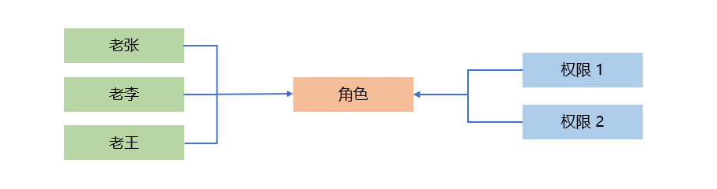
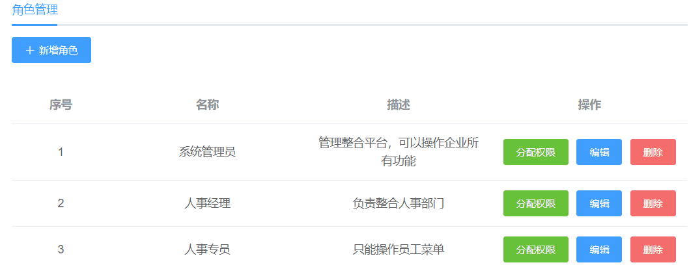
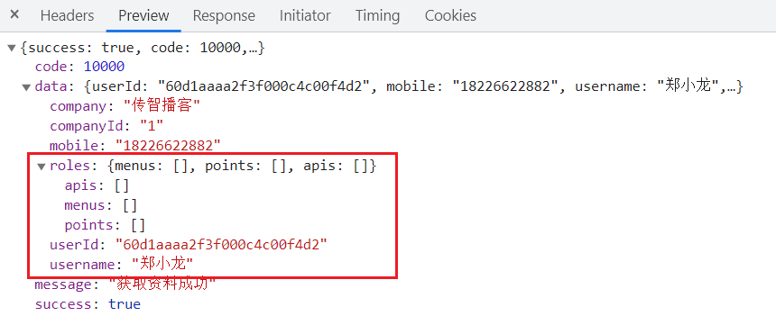
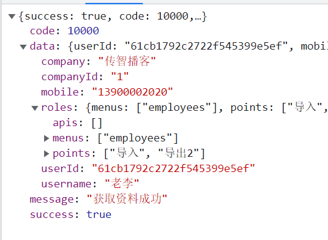
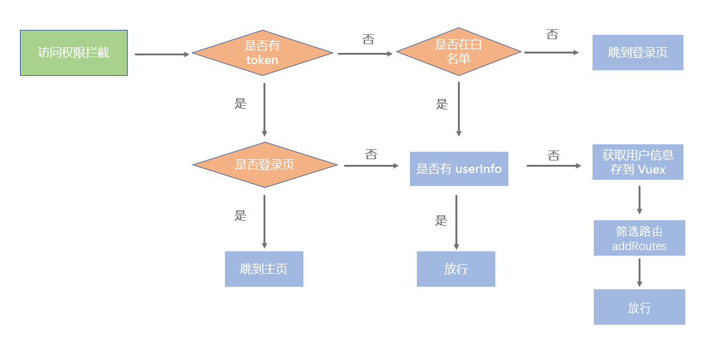
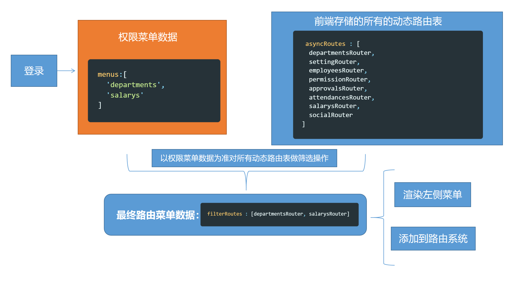
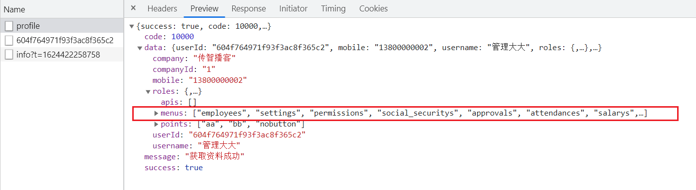
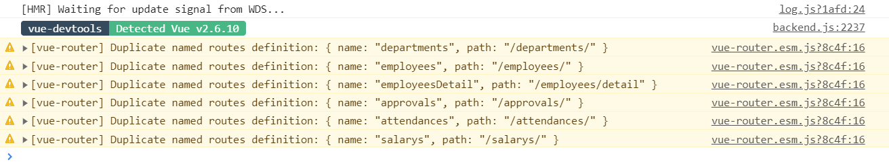
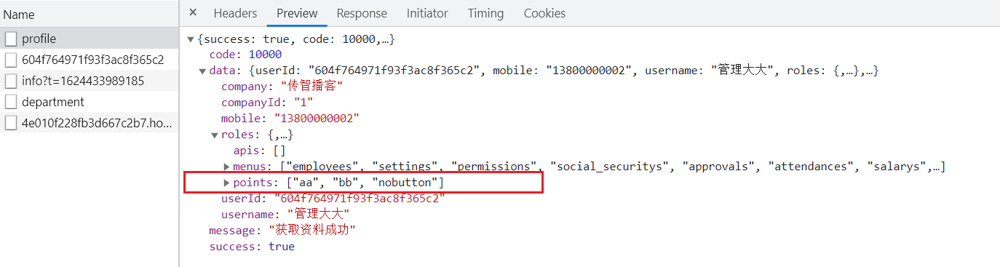

# Day11_权限管理


## 01.权限分配-角色分配权限点

### 目标

给某个角色分配某些权限点(页面权限/功能权限), 每个用户可能有一个角色/多个角色, 都是多对多

​					


### 讲解

如图，在前面的课程中，我们已经完成了：

1.  给员工设计角色的功能
2.  设置项目中包含哪些权限点

但是还没有给角色分配它自身拥有哪些权限，说白了，就是某个员工他能做什么事，不能做什么事，我们还没有明确！


给角色分配权限点代码比较多，需要封装组件。

### 小结

1. 项目中关于权限, 有哪3个东西, 关系是?

   <details>     
   <summary>答案</summary> 
   <ul>
   <li>员工管理, 员工的角色管理, 每个角色拥有的权限点</li>
   </ul> 
   </details>


## 02.权限分配-实现角色分配弹框

### 目标

实现点击分配权限，展示分配权限弹框功能

​			 

### 分析

1.  定义 分配权限弹框 子组件
2.  给 分配权限 按钮绑定点击事件
3.  在事件处理程序中，让 分配权限弹框 展示

### 实现

1. 创建 `src\views\setting\assignPermission.vue` 子组件

   ```html
   <template>
     <div>
       <div>分配权限功能</div>
   
       <el-row class="footer" type="flex" justify="center">
         <el-col :span="6">
           <el-button size="small" @click="cancelButton">取 消</el-button>
           <el-button size="small" type="primary" @click="setRolesBtn">确 定</el-button>
         </el-col>
       </el-row>
     </div>
   </template>
   
   <script>
   export default {
     name: 'AssignPermission',
     props: {
       permissionList: {
         type: Array,
         default: _ => []
       },
       roleId: {
         type: [Number, String],
         required: true
       }
     },
     data() {
       return {}
     },
     created() {
       console.log(this.roleId)
     },
     methods: {
       // 取消按钮
       cancelButton() {
         this.$emit('close')
       },
   
       // 设置权限按钮
       setRolesBtn() {}
     }
   }
   </script>
   
   <style lang="scss" scoped>
   .footer {
     margin-top: 30px;
   }
   </style>
   
   ```

   

2. 将定义的子组件在 `src\views\setting\index.vue` 中导入并挂载

   ```js
   import AssignPermission from './assignPermission.vue'
   
   export default {
     name: 'Setting',
     components: {
       AssignPermission
     }
     // ...其他
   }
   ```

   ```html
   <!-- 分配权限弹框 -->
   <el-dialog
     title="分配权限"
     :visible.sync="dialogVisible"
     width="50%"
   >
     <assign-permission :role-id="roleId" />
   </el-dialog>
   ```

   

3. 控制弹框的隐藏和展示

   - 给分配权限按钮绑定点击事件

   ```html
   <el-button size="small" type="success" @click="setRoles(scope.row.id)">分配权限</el-button>
   ```

   - 在 对应的事件处理程序中控制弹框的隐藏和展示

     ==data里定义roleId, 和dialogVisible==

   ```js
   // 设置角色
   setRoles(id) {
     this.dialogVisible = true
     this.roleId = id
   }
   ```

   

4.  点击取消按钮，隐藏弹框

   - 接收子组件传递的事件
   -  在对应的事件处理程序中，控制弹框的隐藏和展示

   ```html
   <!-- 分配权限弹框 -->
   <el-dialog
     title="分配权限"
     :visible.sync="dialogVisible"
     width="50%"
     @close="setVisible"
   >
     <assign-permission :role-id="roleId" @close="setVisible" />
   </el-dialog>
   ```

   ```js
   // 分配权限弹框隐藏
   setVisible() {
     this.dialogVisible = false
   }
   ```

### 小结

1. 弹框我们封装的是哪个组件?

   <details>     
   <summary>答案</summary> 
   <ul>
   <li>把表单封装了, 外面是el-dialog组件</li>
   </ul> 
   </details>


## 03.权限分配-获取权限点数据并渲染成树组件

### 目标

1.  获取权限点数据
2.  渲染成树行组件

​							

### 分析

1.  导入获取权限列表数据的 API 以及 转换树行组件的方法
2.  调用 API ，获取数据
3.  使用 Tree 树行组件实现结构的搭建

### 实现

1.  在`setting/index.vue`中, 导入获取权限列表数据的 API

   ```js
   import { getPermissionListAPI } from '@/api'
   import { transTree } from '@/utils'
   ```

   

2. 在父级调用接口, 拿到所有权限点数据, 传入铺设

   ```vue
   <template>
     <div class="setting-container">
       <div class="app-container">
         <!-- 卡片组件 -->
        
   
         <!-- 分配权限弹框 -->
         <el-dialog
           title="分配权限"
           :visible.sync="dialogVisible"
           width="50%"
         >
           <assign-permission :role-id="roleId" :permission-list="permissionList" @close="setVisible" />
         </el-dialog>
       </div>
     </div>
   </template>
   
   <script>
   import { getRolesAPI, getCompanyInfoAPI, addRoleAPI, getRoleIdAPI, updateRoleAPI, deleteRoleAPI, getPermissionListAPI } from '@/api'
   // ...其他
   import { transTree } from '@/utils'
   
   export default {
     name: 'Setting',
     data() {
       return {
         // ...其他
         permissionList: [] // 权限点数组
       }
     },
     created() {
       // ...其他
       // 调用获取权限点列表的方法
       this.getPermissionListFn()
     },
     methods: {
       // 获取-权限点列表
       async getPermissionListFn() {
         const res = await getPermissionListAPI()
         this.permissionList = transTree(res.data, '0')
       }
     }
   }
   </script>
   ```

   

   

3. 在子组件中, 使用 Tree 树行组件实现结构的搭建

   ```html
   <!-- 权限点数据展示 -->
   <el-tree :data="permissionList" :props="{ label: 'name' }" />
   ```

   

### 小结

1. 为什么要在外面请求数据?

   <details>     
   <summary>答案</summary> 
   <ul>
   <li>在逻辑页面发请求, 准备好数据, 在弹窗组件只负责铺设数据</li>
   </ul> 
   </details>


## 04.权限分配-调整树行控件的样式

### 目标

给分配权限弹框中的权限前面添加复选框、同时让组件默认展开

​							


### 分析

查阅 Element  中的 [Tree 树行控件](https://element.eleme.cn/#/zh-CN/component/tree#tree-shu-xing-kong-jian) 文档

1.  show-checkbox 显示选择框
2.  default-expand-all 默认展开
3.  check-strictly  设置true，可以关闭父子关联

### 实现

```html
<!-- 权限点数据展示 -->
<el-tree
  :data="permissionList"
  :props="{ label: 'name' }"
  show-checkbox
  default-expand-all
  check-strictly
/>
```


### 小结

1. check-strictly的作用是什么?

   <details>     
   <summary>答案</summary> 
   <ul>
   <li>有复选框的时候, 点击父节点的子节点跟着一起关联, 设置它为true, 就不关联了</li>
   </ul> 
   </details>


## 05.权限分配-角色已有权限数据回填

### 目标

点击弹窗出现, 默认填充数据

### 分析

1.  准备获取当前角色已有权限的 API 

2.  组装参数 ，调用 api 获取数据

3. 把数据回填显示到 tree 中

   - 查看文档：[树节点的选择](https://element.eleme.cn/#/zh-CN/component/tree#shu-jie-dian-de-xuan-ze)

   - 通过 setCheckedKeys 方法设置选中节点
   - 通过 keys 设置目前勾选的节点，使用此方法必须设置 node-key 属性

### 实现

1.  导入 API 方法

   ```js
   import { getRoleIdAPI } from '@/api'
   ```

   

2. 在`views/setting/index.vue`获取当前角色的权限

   ```vue
   <assign-permission :role-id="roleId" :permission-list="permissionList" @close="setVisible" :role-ids-list="roleIdsList"/>
   
   <script>
   export default {
     name: 'Setting',
     components: {
       AssignPermission
     },
     data() {
       return {
         // ...其他
         roleIdsList: [] // 某个角色的权限点数组
       }
     },
     methods: {
       // 设置角色
       // 获取角色-对应权限列表
       async setRoles(id) {
         this.dialogVisible = true
         this.roleId = id
         const res = await getRoleIdAPI(id)
         this.roleIdsList = res.data.permIds
       },
     }
   }
   </script>
   ```

   

3. 设置 Tree 树行组件的属性

   ```html
   <!-- 权限点数据展示 -->
   <el-tree
     ref="tree"
     :data="permissionList"
     :props="{ label: 'name' }"
     node-key="id"
     show-checkbox
     default-expand-all
     check-strictly
   />
   ```

4.  在子组件设置默认选中的值

    ```js
    watch: {
        roleIdsList() {
            this.$refs.tree.setCheckedKeys(this.roleIdsList)
        }
    },
    ```

    

### 小结

1. el-tree如何设置默认选中的值

   <details>     
   <summary>答案</summary> 
   <ul>
   <li>设置node-key="id"值, 类似key, 然后用组件内置的方法setCheckedKeys, 设置选中的数组, 数据要和data里数据一致就会默认选中</li>
   </ul> 
   </details>


## 06.权限分配-解决数据闪现问题

### 目标

每次打开后, 还能看到刚才默认选中数据

### 分析

由于子组件在 dialog 嵌套，所以，它只会创建一次, 以后都是隐藏, 出现

1. 方案 1：让弹层隐藏时，把子组件销毁
   - 优点：简单
   - 缺点：销毁组件，有一定性能问题

2. 方案 2：在父组件中点击分配角色时，直接先清除子组件内的默认权限id额数组

### 实现

1.  方案 1：让弹层隐藏时，把子组件销毁

   ```html
   <assign-permission v-if="dialogVisible" :role-id="roleId" @close="setVisible" />
   ```

   

2. 方案 2：在父组件中点击分配角色时，直接调用子组件中方法重新获取当前用户的数据

   ```js
   // 设置角色
   // 获取角色-对应权限列表
   async setRoles(id) {
       // 清除数据
       this.roleIdsList = []
       this.dialogVisible = true
       this.roleId = id
       const res = await getRoleIdAPI(id)
       this.roleIdsList = res.data.permIds
   }
   ```

   

### 小结

1. 闪现数据的原因是什么?

   <details>     
   <summary>答案</summary> 
   <ul>
   <li>组件是css方式显示隐藏, 而新的数组是靠网络请求回来, 然后影响数据, 我们可以在出现前把默认选中数组清空, 再请求后再铺设默认选中的数组</li>
   </ul> 
   </details>


## 07.权限分配-保存选择的权限

### 目标

完成角色对应权限的更改

### 分析

1.  准备给角色设置权限的 API
   - 如何获取选中的节点
   - 查看文档：[树节点的选择](https://element.eleme.cn/#/zh-CN/component/tree#shu-jie-dian-de-xuan-ze)
2.  点击确定，给当前角色设置权限

### 实现

1.  封装给角色分配权限的 API, 在`api/setting.js`

   ```js
   /**
    * 给角色分配权限
    * @param {*} data {id:角色id, permIds:[] 所有选中的节点的id组成的数组}
    * @returns
    */
   export function assignPermAPI(data) {
     return request({
       url: '/sys/role/assignPrem',
       method: 'put',
       data
     })
   }
   ```

   

2.  在组件中导入封装的 API, 在父里引入

   ```js
   import { getRoleIdAPI, assignPermAPI } from '@/api'
   ```

   

3. 在子组件内, 点击确定按钮, 点击事件, 把值传给父组件`views/setting/index.vue`中

   ```js
   // 设置权限按钮
   setRolesBtn() {
       const permIds = this.$refs.tree.getCheckedKeys()
       this.$emit('confirmPer', { id: this.roleId, permIds: permIds })
   }
   ```


4. 父接收confirmPer事件, 拿到值, 交给后台

   ```js
   // 分配权限菜单-确定事件
   async confirmFn(data) {
       const res = await assignPermAPI(data)
       if (res.success) this.$message.success(res.message)
       this.dialogVisible = false
       this.getRolesList()
   },
   ```

   

### 小结

1. 保存选择的权限思路是什么?

   <details>     
   <summary>答案</summary> 
   <ul>
   <li>子组件拿到树结构数据, 传递给父组件,然后传递给接口, 刷新列表</li>
   </ul> 
   </details>


## 08.权限管理-认识用户的权限数据

### 分析

到目前为止，我们实现了 RBAC 权限设计思想的各个环节，我们给员工分配了角色，给角色又分配了权限点，员工现在已经有了相对应的权限点，接下来我们就可以利用这些权限点做实际的权限控制，在人资项目里，权限的控制有两个地方：

1.  左侧菜单权限控制（不同的用户进来系统之后，看到的菜单是不同的）
2.  操作按钮权限控制 (页面上的按钮，不同的人也有不同权限)


###  权限数据在哪里

在员工管理中新建一个全新的员工数据，然后使用全新的员工账号登录(密码为123456)，查看个人信息接口(/api/sys/profile)的返回数据，下图看到的是没有配置任何权限的返回状态，可以看到，roles下的menus和points都为空，此时员工没有任何权限

​					


###  如何修改权限数据

使用管理员账号登录，然后给刚才创建的新员工分配俩个菜单权限和一个操作按钮权限，然后我们再次登录员工账号查看个人信息返回数据

操作步骤：

1.  权限点管理 >  给**员工管理**下增加`导入，导出` 按钮操作权限点

2.  角色管理 >  新建角色**人事总监** >  给角色分配权限 （员工管理，导入，导出）

3.  员工管理 > 给员工分配**人事总监**角色

4.  重新登录新员工账号，查看权限数据，观察roles、menus、points 项目

### 注意

第三步, 员工管理, 页面默认请求10条数据, 修改下请求总数

判断如果数据大于默认的10, 再用total, 设置pagesize, 再发一次

不然 默认只有10个角色




### 小结

1. 我们都设置了什么东西?

   <details>     
   <summary>答案</summary> 
   <ul>
   <li>给用户设置角色, 给角色设置权限, 新建用户, 分配角色</li>
   </ul> 
   </details>


## 09.权限管理-动态路由整体分析

### 分析

登录成功，进入导航守卫：

- 获取个人权限信息
- 生成可以访问的动态路由


​		


​		


### 小结

1. 我们做动态路由的思路是什么?

   <details>     
   <summary>答案</summary> 
   <ul>
   <li>在路由守卫, 拿到用户信息, 保存到vuex中, 然后再筛选路由对象, 添加到路由规则数组里, 然后在放行</li>
   </ul> 
   </details>
   
   


## 10.动态路由-addRoutes方法

### 目标

学习 vue-router 对象中的 *addRoutes方法，用它来动态添加路由配置

### 分析

[addRoutes 文档](https://router.vuejs.org/zh/api/#router-addroute)

使用格式

```js
router.addRoutes([路由配置对象])
// 或者:
this.$router.addRoutes([路由配置对象])
```


### 演示

```html
<button @click="hAddRoute">addRoute</button>
```

```js
methods: {
  hAddRoute() {
    this.$router.addRoute({
      path: '/abcd',
      name: 'abcd',
      component: () => import('@/views/abc')
    })
      
    this.$router.addRoutes([{
      path: '/abcd',
      name: 'abcd',
      component: () => import('@/views/abc')
    }])
  }
}
```


### 小结

1. 我们如何在运行时, 向路由规则数组里加入一些对象?

   <details>     
   <summary>答案</summary> 
   <ul>
   <li>使用路由对象里的$router中的addRoute方法</li>
   </ul> 
   </details>


## 11.动态路由-使用addRoutes改造左侧菜单

### 目标

使用 Vue-router 提供的 addRoutes 方法改造左侧菜单

### 分析

1.  将动态路由表从 router 文件中移除
2.  在 permission.js 中导入动态路由表
3.  在 permission.js 中引入，判断是否存在用户信息，如果存在并使用 addRoutes 动态添加

### 实现

1.   将动态路由表从 router 文件中移除

   ```js
   const createRouter = () => new Router({
     // mode: 'history', // require service support
     scrollBehavior: () => ({ y: 0 }),
     // routes: [...constantRoutes, ...asyncRoutes],
     routes: [...constantRoutes]
   })
   ```

   

2.  在 permission.js 中导入动态路由表

   ```js
   import router, { asyncRouteArr } from './router'
   ```

   

3.  使用 addRoutes 动态添加路由表

   - 判断是否存在用户信息，在 `src\store\getters.js` 导出 userId

   ```js
   const getters = {
     userId: state => state.user.userInfo.userId // 用户ID
   }
   export default getters
   
   ```

   

   - 左侧的菜单只剩下静态的首页了

   ```js
   // 如果存在 token
   if (token) {
     if (to.path === '/login') {
       // 如果存在 token，访问的是登录页面，直接跳转到主页
       next('/')
     } else {
       if (!store.getters.userId) {
         // 如果存在 token，访问的是其他页面，直接放行
         await store.dispatch('user/getUserInfo')
         router.addRoutes(asyncRouteArr)
       }
       next()
     }
   }
   ```


4.  验证
   - 左侧的菜单只剩下静态的首页了（后续来解决）
   -  浏览器手动输入某一个动态路由地址，依旧是可用的，证明我们其实已经把动态路由添加到我们的路由系统了

### 小结

1. 我们addRoutes好用了吗? 但是左侧菜单出现了吗?

   <details>     
   <summary>答案</summary> 
   <ul>
   <li>其实方法已经好用了, 可以切换路由实现路由的跳转了</li>
   </ul> 
   </details>


## 12.动态路由-动态生成左侧菜单

### 目标

解决使用 addRoutes 方法后，左侧的菜单只剩下静态的首页的问题

### 分析

当前的菜单渲染 `src\layout\components\Sidebar\index.vue` 使用的数据：

1.  `this.$router.options.routes` 这个数据是固定
2.   而通过 addRoutes 添加的路由表只存在内存中，并不会改变`this.$router.options.routes` 


如果我们希望在调用addRoutes方法之后，要路由数据立刻反映到菜单中，我们需要想一个额外的方法，

思考一下，vue开发中，哪个技术可以保证响应式特性还可以动态修改？ 

vuex！


1.  在 vuex 中创建 新增一个 permission 模块

### 实现

1.  创建 `src\store\modules\permission.js` 模块

   ```js
   /**
    * Vuex 权限，动态路由模块
    */
   
   // 导入静态路由表
   import { constantRoutes } from '@/router'
   
   export default {
     namespaced: true, // 开启命名空间
     state: () => ({
       routes: constantRoutes // 默认静态路由
     }),
     mutations: {
       // 设置动态路由方法
       setRoutes(state, asyncRoutes) {
         // 将动态路由和静态路由组合起来
         state.routes = [...constantRoutes, ...asyncRoutes]
       }
     },
     getters: {},
     actions: {}
   }
   
   ```

   

2.  在 `src\store\index.js` 文件中导入并挂载 permission 模块

   ```js
   import Vue from 'vue'
   import Vuex from 'vuex'
   import getters from './getters'
   import app from './modules/app'
   import settings from './modules/settings'
   import user from './modules/user'
   + import permission from './modules/permission'
   
   Vue.use(Vuex)
   
   const store = new Vuex.Store({
     modules: {
       app,
       settings,
       user,
   +    permission
     },
     getters
   })
   
   export default store
   
   ```

   

3.  在 `src\permission.js` 权限管理模块中进行动态路由和静态路由的合并，生成完整的菜单数据

   ```js
   if (!store.getters.userId) {
     // 如果存在 token，访问的是其他页面，直接放行
     await store.dispatch('user/getUserInfo')
     router.addRoutes(asyncRoutes)
   
     // 将动态路由传递给 mutation 方法，进行合并
     store.commit('permission/setRoutes', asyncRouteArr)
   }
   ```

   

4.  菜单生成部分改写使用vuex中的数据

   ```js
   routes() {
       // return this.$router.options.routes
       return this.$store.state.permission.routes
   }
   ```
   
   

### 小结

1. 我们的左侧导航生成依赖的是什么?

   <details>     
   <summary>答案</summary> 
   <ul>
   <li>依赖路由规则对象的数组</li>
   </ul> 
   </details>

2. 为何动态添加好用, 但是左侧导航不出现?

   <details>     
   <summary>答案</summary> 
   <ul>
   <li>网页刚打开, 左侧导航已经使用路由对象规则数组, 动态权限是靠网络请求异步回来添加的</li>
   </ul> 
   </details>


## 13.动态路由-使用后端返回的权限数据

### 目标

上一步我们实现了:

- 把动态路由通过 addRoutes 动态添加到了路由系统里
- 把动态路由保存到 vuex 的 menu 中

但是我们没有和权限数据做搭配，接下来我们通过接口返回的权限数据对动态菜单做过滤处理，以确定完成菜单与用户权限相关


### 分析

1.  访问权限的数据在用户属性 `menus`中，`menus`中的标识该怎么和路由对应呢？

   

   

   可以将路由模块的根节点**`name`**属性命名和权限标识一致，这样只要标识能对上，就说明用户拥有了该权限

   后端和前端的接口约定如下：

   -  员工 → 标识： employees
   - 权限 → 标识： permissions
   - 组织 → 标识： departments
   - 设置 → 标识： settings
   - 工资 → 标识： salarys
   - 审核 → 标识： approvals
   - 考勤 → 标识： attendances
   - 社保 → 标识： social_securitys

   
   
2.  需要的数据

   - 用户的页面访问权限，从 action 中返回即可

   

3.  过滤数据

   - 在 `src\permission.js` 权限管理模块中过滤出用户拥有的权限


### 实现

1.  从 actions 中返回菜单项，修改 `store/modules/user.js` ，添加 return 语句

   ```js
   // 获取-用户信息
   async getUserInfoActions({ commit }) {
       const { data: userObj } = await getUserProfileAPI() // 获取用户基本资料对象
       const { data: photoObj } = await getUserPhotoAPI(userObj.userId) // 获取用户头像等
   
       const newObj = { ...userObj, ...photoObj } // 合并一个信息非常全的对象
       commit('SET_USER', newObj) // 保存到vuex的userInfo对象上 -> 一会儿用调试工具查看
       return userObj.roles.menus
   },
   ```
   
   

2.  改造 `src\permission.js` 权限管理模块代码，过滤出用户拥有的权限

   ```js
   if (!store.getters.name) {
       const menus = await store.dispatch('user/getUserInfoActions')
       // 根据用户实际的权限 menus 从asyncRouteArr里, 过滤出用户能访问的页面的路由对象
       const filterRoutes = asyncRouteArr.filter(route => {
           const routeName = route.children[0].name.toLowerCase()
           return menus.includes(routeName)
       })
       router.addRoutes(filterRoutes)
       // 将动态路由传递给 mutation 方法，进行合并
       store.commit('permission/setRoutes', filterRoutes)
   }
   ```
   
   

效果如下


### 小结

1. 我们根据用户身份, 实现的动态路由的完整思路是什么?

   <details>     
   <summary>答案</summary> 
   <ul>
   <li>登录后, 用token换回这个用户的信息, 然后根据信息筛选符合关键字的路由对象数组</li>
   </ul> 
   </details>


## 14.动态路由-刷新页面时的bug修复

### 目标

如果我们==点击别的导航==, 然后刷新浏览器，会发现跳到了404页面；对于addRoute添加的路由，在刷新时会白屏

1.  解决页面刷新时，页面 404 问题
2.  解决动态路由，刷新页面白屏问题

### 分析

现在我们的路由设置中的404页处在中间位置，而不是所有路由的末尾了，`path:'*'` 导致可以匹配任意页面

解决方案：把404页改到路由配置的最末尾就可以了

### 实现

1.  从 `route/index.js` 中的静态路由中删除`path:'*'`这一项

   ```js
   // 404 page must be placed at the end !!!
   // { path: '*', redirect: '/404', hidden: true }
   ```

   

2.  在 `permission.js` 中补充在最后

   ```js
   if (!store.getters.userId) {
     // 如果存在 token，访问的是其他页面，直接放行
     const menus = await store.dispatch('user/getUserInfo')
   
     // 根据用户实际的权限 menus 从 asyncRoutes 中过滤出用户能访问的页面
     const filterRoutes = asyncRoutes.filter(route => {
       const routeName = route.children[0].name
       return menus.includes(routeName)
     })
   
     router.addRoutes(filterRoutes)
   
     // 404 page must be placed at the end !!!
     filterRoutes.push(
       { path: '*', redirect: '/404', hidden: true }
     )
   
     // 将动态路由传递给 mutation 方法，进行合并
     store.commit('permission/setRoutes', filterRoutes)
   }
   ```


3. 解决动态路由，刷新页面白屏问题

   ==先尝试跳转, next()执行, 但是网络请求回来以后, 动态路由挂载, 再重新的跳转一次==

   ```js
   // 前置路由守卫
   router.beforeEach(async(to, from, next) => {
     // 显示进度条效果
     NProgress.start()
   
     // 获取到 token
     const token = store.getters.token
   
     // 如果存在 token
     if (token) {
       if (to.path === '/login') next('/') // 如果存在 token，访问的是登录页面，直接跳转到主页
       else {
         if (!store.getters.name) {
           const menus = await store.dispatch('user/getUserInfoActions')
           // 根据用户实际的权限 menus 从asyncRouteArr里, 过滤出用户能访问的页面的路由对象
           const filterRoutes = asyncRouteArr.filter(route => {
             const routeName = route.children[0].name.toLowerCase()
             return menus.includes(routeName)
           })
           router.addRoutes(filterRoutes)
           filterRoutes.push(
             { path: '*', redirect: '/404', hidden: true }
           )
   
           // 将动态路由传递给 mutation 方法，进行合并
           store.commit('permission/setRoutes', filterRoutes)
   
           // 解决刷新出现的白屏bug
           next({
             path: to.path, // 保证路由添加完了再进入页面 (可以理解为重进一次)
             replace: true // 重进一次, 不保留重复历史
           })
         }
         next() // 如果存在 token，访问的是其他页面，直接放行
       }
     } else {
       if (whiteList.includes(to.path)) next() // 如果不存在 token，访问的是白名单内容，直接放行
       else next('/login') // 没有 token，且不是白名单页面，跳转到登录页面
     }
   })
   ```


==注意: 这里的next()会走两次, next()里面带值重定向走一次==

刷新, 要进入to.path指定的地址-> next()放行 但是同时网络请求也走了

走完以后, next() 重定向-> 因为刚才还没有动态路由地址, 会导致404. 

而重定向后, 路由守卫发现改变, 再次->next() 但是动态路由已经有了, 所以可以正常跳转

### 小结

1. 我们为何动态路由添加后再来个next()重定向?

   <details>     
   <summary>答案</summary> 
   <ul>
   <li>这样确保动态路由添加后, 再跳转能够找到对应路由的规则</li>
   </ul> 
   </details>


## 15.动态路由-退出登录时重置路由

### 目标

退出后，再次登陆，发现菜单异常 ，控制台有输出说路由重复



解决控制台警告问题

### 分析

路由设置是通过`router.addRoutes(filterRoutes)`来添加的，退出时并没有清空，再次登陆又加了一次，所以有重复。

需要将路由权限重置 (恢复默认)   将来登录后再次追加才可以，不然的话，就会重复添加

### 实现

我们的 `router/index.js`文件，发现一个重置路由方法

```js
// Detail see: https://github.com/vuejs/vue-router/issues/1234#issuecomment-357941465
// 重置路由
export function resetRouter() {
  const newRouter = createRouter()
  router.matcher = newRouter.matcher // 重新设置路由的可匹配路径
}
```

这个方法就是将路由重新实例化，相当于换了一个新的路由，之前**`加的路由`**就不存在了，

需要在**登出的时候， 调用一下即可**


在 `store/modules/user.js` 文件中导入 `resetRouter` 方法

```js
import { resetRouter } from '@/router'


// 退出登录
  logOutActions({ commit }) {
    commit('RESET_STATE')
    // 重置token
    commit('REMOVE_TOKEN')
    // 重置路由
    resetRouter()
  }
```


### 小结

1. 我们退出登录, 都需要做什么?

   <details>     
   <summary>答案</summary> 
   <ul>
   <li>清除本地的token, 清除vuex里token, 重置路由规则对象的数组, 然后重新跳转回到登录页</li>
   </ul> 
   </details>


## 16.权限分配-权限按钮级别控制分析

### 目标

员工 A 和员工 B 都可以访问同一个页面（以员工管理为例），但是员工 A 可以导出 excel，员工 B 就不可以导出 excel

如何实现权限按钮级别控制呢

### 思路

用户登陆成功后，用户可以访问的按钮级别权限保存在 points 数组中。而这个数据我们是保存在 vuex 中的，因此可以在项目的任意地方来访问 points  中的数据。




只要控制按钮显示与否的标识在 points 出现，则可以将对应的功能显示出来

### 小结

1. 功能点权限如何划分?

   <details>     
   <summary>答案</summary> 
   <ul>
   <li>返回用户信息有个points数组里有个标记字符串和后台商量好, 不限于哪个页面使用</li>
   </ul> 
   </details>


## 17.权限分配-自定义指令实现按钮级控制

### 目标

自定义指令实现按钮级控制

### 分析

创建全局自定义指定

### 实现

1.   创建 `src\directive\power.js` 文件，在文件内进行全局自定义指定创建

   ```js
   /**
    * 按钮级权限控制
    */
   import store from '@/store'
   
   export default {
     inserted(el, binding) {
       // 从 vuex 中取出 points
       const points = store.state.user.userInfo.roles.points
   
       // 如果 points 中有 binding.value 则显示
       // 不存在则隐藏
       if (!points.includes(binding.value)) {
         el.parentNode.removeChild(el)
       }
     }
   }
   
   ```

   

2.  创建 `src\directive\index.js` 文件，挂载 自定义指定

   ```js
   import power from './power'
   
   export default {
     install(Vue) {
       // 创建按钮级权限控制的自定义指令
       Vue.directive('power', power)
     }
   }
   
   ```

   

3.  在 `main.js` 文件中挂载自定义指定文件

   ```js
   // 导入全局挂载的组件
   import Directive from './directive'
   Vue.use(Directive)
   ```

   

4.  挂载自定义指定

   ```html
   <el-button v-power="'import'" type="danger" size="small" @click="$router.push('/excel')">导入excel</el-button>
   <el-button v-power="'export'" type="success" size="small" @click="downloadExcel">导出excel</el-button>
   ```

   

### 小结

1. 某个标签的权限应该怎么控制?

   <details>     
   <summary>答案</summary> 
   <ul>
   <li>返回用户信息有个points数组里有个标记字符串和后台商量好, 不限于哪个页面使用</li>
   </ul> 
   </details>


## 18.权限管理-总结

### 业务场景

公司里有不同的职能部门，都在用同一套系统 ，不一样部门的人员进入系统里面需要操作的事情是不一样的

必定需要根据不同的员工角色配置不同的权限

### RBAC权限设计思想

​					

一种基于**角色**的设计思想

1. 给员工配置角色  （一个员工可以拥有多个角色）
2. 给角色配置权限点 （一个角色可以有多个权限点）

员工只要有了角色之后，就自动拥有了角色绑定的所有权限点

### 根据权限设计思想对应业务模块

1. 员工管理
2. 角色管理
3. 权限点管理

### 员工得到权限数据

​    员工信息接口中有当前员工的所有权限数据

```
userInfo:{
  roles: {
    menus: [],  // 菜单权限数据
    points: [] // 按钮权限数据
  }
}
```

### 使用权限数据做具体的权限处理

1. 菜单权限控制

   登录 > 菜单权限数据 > 和本地的所有的动态路由数据做匹配出具 > 得到根据权限筛选之后的动态路由数据

   1. 添加到路由系统中 （可以根据路径标识渲染组件 **addRoutes**）
   2. 添加到左侧菜单渲染  （vuex管理 + v-for遍历）

   

2. 按钮权限控制

   登录 > 按钮权限数据 >  使用按钮单独的权限标识 去权限数据里面查找 

   自定义指令


