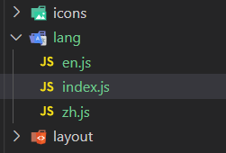
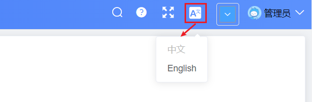
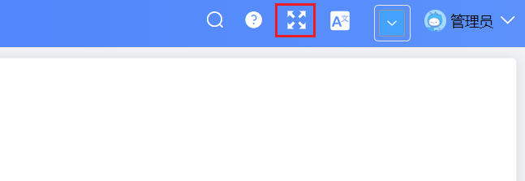
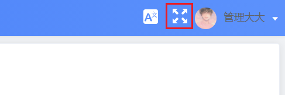
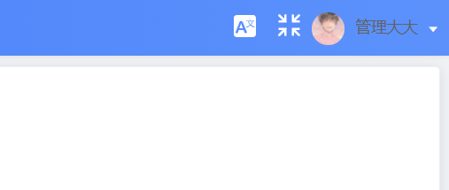
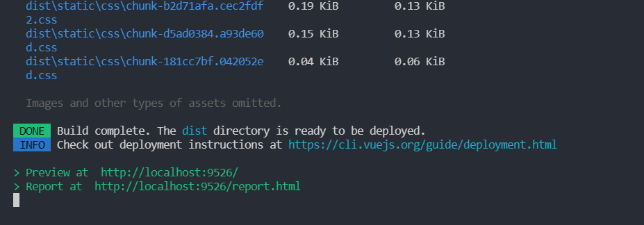
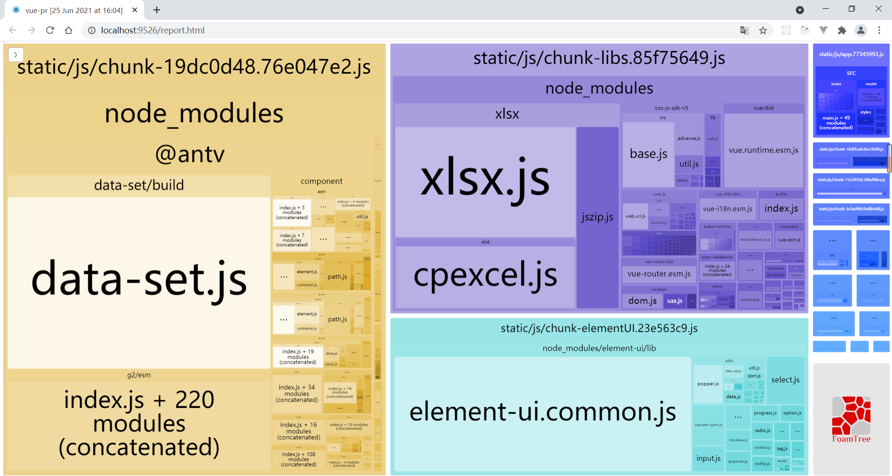
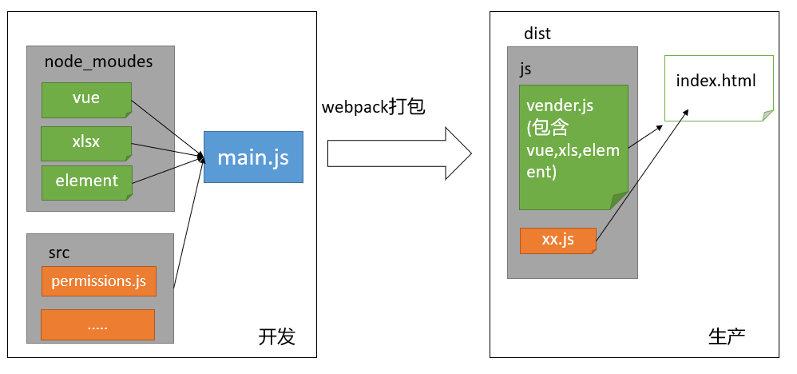

# Day12_多语言和打包

## 01.多语言-多语言支持

### 目标

1.  实现 elementUI 中英文切换功能，感受中文切换的效果
2.  学习 Vue 国际化插件 Vue I18n 的使用

### 分析

Vue项目中的多语言支持使用的是 [Vue I18n](https://kazupon.github.io/vue-i18n/zh/)

1.  安装 Vue I18n 包
2.  进行多语言配置

==注意, 是el内置的一些标签的位置, 如果我们在代码里写固定的比如表格的列标题文字, 那是不会受到影响的==

### 实现

1.  安装 Vue I18n 包

   > 请注意版本号。vue-i18n现在有了一个新版本，对应的api有些不兼容，请还是使用8.22.2这个版本

   ```bash
    npm i vue-i18n@8.22.2
   ```

   

2.   创建 `src\lang\index.js` 文件进行多语言设置

   ```js
   // 导入 Vue
   import Vue from 'vue'
   
   // 导入 vue-i18n 插件
   import VueI18n from 'vue-i18n'
   import locale from 'element-ui/lib/locale' // 导入 Element 语言配置插件
   import enLocale from 'element-ui/lib/locale/lang/en' // 导入 Element 英文包
   import zhLocale from 'element-ui/lib/locale/lang/zh-CN' // 导入 Element 中文包
   
   Vue.use(VueI18n)
   
   // 创建国际化插件的实例
   const i18n = new VueI18n({
     locale: 'zh', // 设置地区，zh 表示中国地区
     // 设置地区信息
     messages: {
       en: {
         ...enLocale
       },
       zh: {
         ...zhLocale
       }
     }
   })
   
   // 配置 Element 语言转换关系
   locale.i18n((key, value) => i18n.t(key, value))
   
   export default i18n
   
   ```

   

3.   在 `main.js` 入口文件导入多语言设置

   ```js
   // 多语言配置
   import i18n from '@/lang'
   ```

   

4.   在 Vue 实例中挂载多语言设置

   ```js
   new Vue({
     el: '#app',
     router,
     store,
     i18n,
     render: h => h(App)
   })
   ```


5.  在 `src\lang\index.js` 文件中，切换地区语言查看

   ```js
   // 创建国际化插件的实例
   const i18n = new VueI18n({
     // 切换成 en 查看标题效果
     locale: 'zh', // 设置地区，zh 表示中国地区
     // 其他代码略
   })
   ```

   

### 小结

1. 我们现在给ElementUI配置的多语言支持, 针对的是哪部分?

   <details>     
   <summary>答案</summary> 
   <ul>
   <li>针对的是ElementUI组件内置的标签和样式</li>
   </ul> 
   </details>


## 02.多语言-自定义内容支持多语言

### 目标

上一小结，我们通过配置让 Element 组件库内部支持了多语言配置

那自定义内容部分，也就是没有使用 Element 的部分该如何实现多语言呢

实现：自定义内容支持多语言

### 分析

1.  使用提前准备好的自定义语言配置文件
   - 自定义语言配置文件在`项目资源/语言包`里面
2.   准备两套翻译文案 
   - 在 `en.js` 和 `zh.js` 中已经分别准备了中英文翻译文案
3.  使用 `vue-i18n` 提供的语法进行切换
   - 用$t('属性名')来生成标题


### 实现

1. 在预习资料中的素材, 导入自定义语言配置文件放到 `src\lang` 文件夹下

   

2. 在 `src\lang\index.js` 文件中进行配置

   ```js
   // 导入 Vue
   import Vue from 'vue'
   
   // 导入 vue-i18n 插件
   import VueI18n from 'vue-i18n'
   import locale from 'element-ui/lib/locale' // 导入 Element 语言配置插件
   import enLocale from 'element-ui/lib/locale/lang/en' // 导入 Element 英文包
   import zhLocale from 'element-ui/lib/locale/lang/zh-CN' // 导入 Element 中文包
   
   // 引入自定义中文包
   + import customZh from './zh'
   // 引入自定义英文包
   + import customEn from './en'
   
   Vue.use(VueI18n)
   
   // 创建国际化插件的实例
   const i18n = new VueI18n({
     locale: 'zh', // 设置地区，zh 表示中国地区
     // 设置地区信息
     messages: {
       en: {
         ...enLocale,
   +      ...customZh
       },
       zh: {
         ...zhLocale,
   +      ...customEn
       }
     }
   })
   
   // 配置 Element 语言转换关系
   locale.i18n((key, value) => i18n.t(key, value))
   
   export default i18n
   ```

   

3. 在 `en.js` 和 `zh.js` 中找到 `navbar` 字段进行公司标题字段设置

   ```js
   // en.js
   navbar: {
     companyName: 'Jiangsu Chuanzhi podcast Education Technology Co., Ltd',
   }
   ```

   ```js
   // zh.js
   navbar: {
     companyName: '江苏传智播客教育科技股份有限公司',
   }
   ```

   

4. 使用 `vue-i18n` 提供的语法进行切换，这里以更改 `标题` 为例

   ```vue
   <div class="app-breadcrumb">
     {{ $t('navbar.companyName') }}
     <span class="breadBtn">体验版</span>
   </div>
   ```

   


### 小结

1. 中英文具体如何切换的?

   <details>     
   <summary>答案</summary> 
   <ul>
   <li>使用$t()函数后, 内部会根据你在main.js的lang的配置语言的标识'zh'还是'en', 然后加载对应对应对象里的字段返回</li>
   </ul> 
   </details>


## 03.多语言-实现动态切换中英文

### 目标

在我们虽然已经实现了中英文切换的核心逻辑，但是是死的，不能动态切换，

因此本节想要实现以下的效果：

​		点击中英文按钮，弹出下拉框，当我们点击 中文 和 English 的时候可以实现动态的切换当前的语言

​											

### 分析

点击下拉框时把当前选择的语言赋值给`this.$i18n.locale`属性即可

### 实现

1. 在 `src\components\Lang` 中封装多语言组件进行此功能

   ==当前是什么语言, 对应文字就禁用==

   ```vue
   <template>
     <el-dropdown trigger="click" @command="changeLanguage">
       <div>
         <svg-icon style="color:#fff;font-size:20px" icon-class="language" />
       </div>
       <el-dropdown-menu slot="dropdown">
         <el-dropdown-item command="zh" :disabled="'zh'=== $i18n.locale ">中文</el-dropdown-item>
         <el-dropdown-item command="en" :disabled="'en'=== $i18n.locale ">English</el-dropdown-item>
       </el-dropdown-menu>
     </el-dropdown>
   </template>
   
   <script>
   export default {
     methods: {
       changeLanguage(lang) {
         this.$i18n.locale = lang // 设置给本地的i18n插件
         this.$message.success('切换多语言成功')
       }
     }
   }
   </script>
   
   ```

   

2. 将多语言组件挂载为全局组件

   ==在src/components/index.vue统一导出==

   ```js
   /**
    * 进行全局组件的挂载
    */
   
   import PageTools from './PageTools/index.vue'
   import UploadExcel from './UploadExcel/index.vue'
   import UploadImg from './UploadImg/index.vue'
   import ImageHolder from './ImageHolder/index.vue'
   import Lang from './Lang'
   
   export default {
     install(Vue) {
       Vue.component('PageTools', PageTools)
       Vue.component('UploadExcel', UploadExcel)
       Vue.component('UploadImg', UploadImg)
       Vue.component('ImageHolder', ImageHolder)
       Vue.component('Lang', Lang)
     }
   }
   
   
   ```

   

3. 在 `src\layout\components\Navbar.vue` 使用多语言组件并进行样式美化

   ```vue
   <div class="right-menu">
     <!-- 语言包 -->
     <lang class="right-menu-item" />
   </div>
   ```

   ```css
   .right-menu {
     float: right;
     height: 100%;
     line-height: 50px;
     display: flex;
     align-items: center;
     justify-content: center;
   }
   ```

   

### 小结

1. 如何实现切换中英文?

   <details>     
   <summary>答案</summary> 
   <ul>
   <li>下拉菜单, 绑定点击事件, 然后传入提前设置的标记key名('zh', 'en')然后, 修改this.$i18n.locale的实例的值</li>
   </ul> 
   </details>


## 04.全屏-全屏组件创建

### 目标

分析全屏功能的实现逻辑

创建并使用全屏组件

​											

### 分析

1.  在顶部的工具栏中补充一个按钮，点它之后进行全屏展示

2.  为了方便复用功能，把它注册成一个全局组件 

### 实现

1. 在 `src\components\ScreenFull` 中创建全屏组件

   - 注意：要想这个图片能正确显示，还必须在`src\icons\svg`下有对应的 fullscreen.svg 文件

     ==前面第一天我们已经复制svg文件夹里的文件了==

   ```vue
   <template>
     <!-- 放置一个图标 -->
     <div>
       <svg-icon icon-class="fullscreen" class="fullscreen" />
     </div>
   </template>
   
   <script>
   export default {
     name: 'ScreenFull'
   }
   </script>
   
   <style lang="scss" scoped>
   .fullscreen {
     width: 20px;
     height: 20px;
     color: #fff;
     cursor: pointer;
   }
   </style>
   
   ```

   

2.  将全屏组件挂载为全局组件

   ```js
   /**
    * 进行全局组件的挂载
    */
   
   import ScreenFull from './ScreenFull'
   
   export default {
     install(Vue) {
       // 将全屏组件挂载为全局组件
       Vue.component('ScreenFull', ScreenFull)
     }
   }
   
   ```

   

3. 在`src\layout\components\Navbar.vue` 使用全局组件

   ```vue
   <div class="right-menu">
         <!-- 语言包 -->
         <screen-full />
         <lang class="right-menu-item" />
         <!-- 下拉菜单 -->
       </div>
   ```

   

### 小结

1. 全局组件如何准备?

   <details>     
   <summary>答案</summary> 
   <ul>
   <li>创建一个图标全局组件, 然后全局注册, 然后把组件使用</li>
   </ul> 
   </details>


## 05.全屏-实现全屏逻辑

### 目标

实现全屏效果

### 分析

使用 screenFull 插件来提供全屏功能

### 实现

1. 安装插件

   ==最新版的6.0, 不能和当前vue脚手架兼容==

   ```bash
   npm i screenfull@5.2.0
   ```

   

2. 在全屏组件中引入

   ```js
   import screenfull from 'screenfull'
   ```

   

3. 给icon 添加点击事件，在事件处理程序中使用插件的核心api

   ```html
   <template>
     <!-- 放置一个图标 -->
     <div>
       <svg-icon icon-class="fullscreen" class="fullscreen" @click="toggleScreen" />
     </div>
   </template>
   
   <script>
   import screenfull from 'screenfull'
   export default {
     name: 'ScreenFull',
     methods: {
       // 点击全屏
       toggleScreen() {
         screenfull.toggle()
       }
     }
   }
   </script>
   ```


### 小结

1. 我们如何实现的全屏功能?

   <details>     
   <summary>答案</summary> 
   <ul>
   <li>使用screenfull的组件, 然后内置有toggle方法切换全屏</li>
   </ul> 
   </details>


## 06.全屏-实现全屏图标切换

### 目标

处于全屏状态和非全屏状态时的图标是不同的，

本节需要实现全屏状态和非全屏状态图标的切换

### 分析

补充数据项：isFullscreen

- 在全屏切换时更改它的值
- 在显示图标时给出不同的class

### 实现

1.  在components/ScreenFull/index.vue, 在 data 中新增状态管理数据

   ```js
   data() {
     return {
       isFullscreen: false // 全屏
     }
   }
   ```

   

2.  在全屏/非全屏切换时更改它的值

   ```js
   // 点击全屏
   toggleScreen() {
     screenfull.toggle()
     // 切换全屏与否状态
     this.isFullscreen = !this.isFullscreen
   }
   ```

   

3.  在显示图标时给出不同的class

   ```html
   <svg-icon
     :icon-class="isFullscreen ? 'exit-fullscreen' : 'fullscreen'"
     class="fullscreen"
     @click="toggleScreen"
   />
   ```

   

### 小结 

1. 条件表达式如何运行的?

   <details>     
   <summary>答案</summary> 
   <ul>
   <li>?坐标表达式为真, 直接在原地使用?后面的值, 否则是:后面的值</li>
   </ul> 
   </details>


## 07.全屏-解决图片不切换问题

### 目标

​											

​											

如果当前是全屏状态，按下ESC会恢复到普通状态

而此时组件中的数据项却没有变成 false，所以导致图标没有及时修改过来

因此本节需要实现解决图片不切换问题

### 分析

使用 screenfull 的事件监听

### 实现

监听全屏的状态是否发生切换

```js
mounted() {
  // 监听全屏的状态是否切换
  screenfull.on('change', () => {
    this.isFullscreen = screenfull.isFullscreen
  })
}
```


### 小结

1. 我们有几种方式关闭全屏状态?

   <details>     
   <summary>答案</summary> 
   <ul>
   <li>点击按钮, 用浏览器给我们的方法实现, 但是我们是封装在screenfull这个插件的方法里了, 具体可以看最下面的扩展</li>
   </ul> 
   </details>


## 08.打包优化

### 背景

前端资源打包在每个项目中都会有涉及，每位开发者都希望打包是用最少的时间构建出最小的代码，这不仅能提高团队中的效率，也能提高页面的访问性能

### 打包方式

项目开发完成之后的打包，需要使用 webpack 做打包，

打包后将项目中的`.html`、 `.vue`、`.scss`、`.js`  等素材打包成 `.html` 、 `.js` 、`.css`


### 小结

1. webpack的作用是什么?

   <details>     
   <summary>答案</summary> 
   <ul>
   <li>我们可以把文件打包成模块, 压缩, 整合, 提高加载速度</li>
   </ul> 
   </details>


## 09.性能分析

### 目标

我们集成了功能，写了很多组件，最终都会打包成一堆文件，每个包大小如何呢？

本节目标：对开发的应用进行包大小分析

### 实现

我们可以使用vue-cli本身提供的性能分析工具，对我们开发的所有功能进行打包分析，它的应用非常简单

```bash
npm run preview -- --report
```

这个命令会从我们的**`入口 main.js`**进行依赖分析，分析出各个包的大小，方便我们进行观察和优化

执行完这个命令，我们会看到控制台中如下类似的输出

​                       


点击下方的地址，查看每个包的体积大小。

如下图所示，方块越大，说明该文件占用的文件越大，文件越大，对于网络带宽和访问速度的要求就越高，这也就是我们优化的方向。





### 小结

1. 打包命令不是npm run build, 这里为何叫preivew?

   <details>     
   <summary>答案</summary> 
   <ul>
   <li>因为正常打包输出dist文件夹, 没有一个预览的服务, 我们可以用vscode自带的liveServer等插件来运行html网页文件, 而preview是这个脚手架环境自带的在build文件夹里有个启动node+web服务来浏览打包后的dist下</li>
   </ul> 
   </details>


## 10.优化方案1-路由懒加载

### 目标

如何实现路由的懒加载

### 分析

1.  结合 Vue 的[异步组件 ](https://cn.vuejs.org/v2/guide/components-dynamic-async.html#异步组件)和 Webpack 的[代码分割功能](https://doc.webpack-china.org/guides/code-splitting-async/#require-ensure-/)，轻松实现 [路由组件的懒加载](https://router.vuejs.org/zh/guide/advanced/lazy-loading.html#%E8%B7%AF%E7%94%B1%E6%87%92%E5%8A%A0%E8%BD%BD)
2.  也可以把组件按组分块
    - 有时候我们想把某个路由下的所有组件都打包在同个异步块 (chunk) 中。只需要使用 [命名 chunk ](https://webpack.js.org/guides/code-splitting-require/#chunkname)，一个特殊的注释语法来提供 chunk name (需要 Webpack > 2.4)
    - Webpack 会将任何一个异步模块与相同的块名称组合到相同的异步块中

### 实现

1. 定义一个能够被 Webpack 自动代码分割的异步组件

   ```js
   const Foo = () => import('./Foo.vue')
   ```

   

2. 在路由配置中什么都不需要改变，只需要像往常一样使用 `Foo`

   ```js
   const router = new VueRouter({
     routes: [{ path: '/foo', component: Foo }]
   })
   ```

   

3. 简写

   ```js
   const router = new VueRouter({
     routes: [
       {
         path: '/foo',
         component: () => import('./Foo.vue') 
       }
     ]
   })
   ```

   

4. 将组件按组分块 （以员工模块为例，将员工列表和员工详情按组进行分块）

   ```js
   // Layout组件中包含
   export default {
     path: '/employees', // 路径
     component: Layout, // 组件
     children: [
       {
         name: 'employees', // 给路由规则加一个name
         path: '', // 这里当二级路由的path什么都不写的时候 表示当前路由为默认路由直接渲染对应组件
         component: () => import(/* webpackChunkName: "employees-employeesDetail" */ '@/views/employees'),
         // 路由元信息  其实就是存储数据的对象 我们可以在这里放置一些信息
         meta: { title: '员工', icon: 'peoples' }
       },
       {
         name: 'employeesDetail',
         path: 'detail',
         component: () => import(/* webpackChunkName: "employees-employeesDetail" */ '@/views/employees/detail'),
         hidden: true
       }
     ]
   }
   ```

   


### 小结

1. 路由是如何优化的?

   <details>     
   <summary>答案</summary> 
   <ul>
   <li>使用路由懒加载, 可以让app.js不是特别大, 加快首屏加载的速度.</li>
   </ul> 
   </details>


## 11.优化方案2-减少包体积-整体分析

### 目标

了解如何减少包体积的思路 

### 分析

1.  打包过程：从 main.js 开始出发，寻找项目中需要使用到的依赖，最终交由webpack进行打包

​							


2. 我们是否需要把**第三方的库**全部打包到自己的项目中呢？

   比如 xlsx 文件就很大，而且这类插件长期不需要我们进行更新，所以**没有必要打包进来**！


3. 思路

   ​				


### 小结

1. 如何减少包体积?

   <details>     
   <summary>答案</summary> 
   <ul>
   <li>把一些不必经常维护的第三方插件, 不用webpack模块化方式打包, 而是变成cdn的script的src方式加载, 因为cdn有物理加速的能力-会找用户就近的服务器拿到指定地址的文件 </li>
   </ul> 
   </details>


## 12.优化方案3-减少包体积-排除第三方

### 目标

通过配置vue-cli把一些平常不需要用的包排除在打包文字之外。

例如:让 `webpack` 不打包 `vue` `xlsx` 和 `element`   

### **使用方式**

先找到 `vue.config.js`， 添加 `externals` 项，具体如下：

```js
configureWebpack: {
  // provide the app's title in webpack's name field, so that
  // it can be accessed in index.html to inject the correct title.
  name: name,
  externals: {
    // 基本格式：
    // '包名' : '在项目中引入的名字'
    'vue': 'Vue',
    'element-ui': 'ElementUI',
    'xlsx': 'XLSX'
  },
  resolve: {
    alias: {
      '@': resolve('src')
    }
  }
}
```


再次运行，我们会发现包的大小已经大幅减小： 三个包已经不在打包的目标文件中了。

==但是也报错了, Vue不见了==

### 小结

<details>     
<summary>答案</summary> 
<ul>
<li> webpack把对应几个包名写在key上, 就可以刨除掉</li>
</ul> 
</details>


## 13.优化方案4-了解 CDN

### 目标

CDN全称叫做“Content Delivery Network”，中文叫**内容分发网络**。我们用它来**提高访问速度**。

​				        之后   				


把一些静态资源：css， .js，图片，视频放在第三方的CDN服务器上，可以加速访问速度。


前端项目中使用CDN好处：

1. 减少应用打包出来的包体积
2. 加快静态资源的访问-cdn服务器集群-就近返回
3. 利用浏览器缓存，不会变动的文件长期缓存

### 小结

1. 我们为何使用cdn?

   <details>     
   <summary>答案</summary> 
   <ul>
   <li> 可以适当提高第三方插件的链接速度, 但是开发的时候我们还是可以在本地用npm下载, 但是上线后要配置cdn地址, 用户的浏览器默认还有缓存功能</li>
   </ul> 
   </details>


## 14.优化方案5-引用 CDN

### 目标

做相关配置：把排除在外的包，通过公共网络资源方式引入

​										


### 具体配置-在生产环境时生效

请注意，在开发环境时，文件资源还是可以从本地 node_modules 中取出，而只有项目上线了，才需要去使用外部资源。此时我们可以使用**环境变量**来进行区分。具体如下：

在**`vue.config.js`**文件中：

==一定要去main.js设置变量的名字, 这里要匹配去替换==

==因为cdn里的源代码配置在ELEMENT这个变量上==

```js
// 需要排除的包对象
let externals = {}
// 需要配置的 CDN 链接
let CDN = { css: [], js: [] }
// 判断是否是生产环境
const isProduction = process.env.NODE_ENV === 'production'
// 如何是生产环境，需要执行以下逻辑
if (isProduction) {
  externals = {
    /**
      * externals 对象属性解析：
      * '包名': '在项目中引入的名字'
      * 以 element-ui 举例 我再 main.js 里是以
      * import ELEMENT from 'element-ui'
      * Vue.use(ELEMENT)
      * 这样引入的，所以我的 externals 的属性值应该是 ELEMENT
      * 一定要去main.js设置
    */
    'vue': 'Vue',
    'element-ui': 'ELEMENT',
    'xlsx': 'XLSX'
  }

  CDN = {
    css: [
      'https://unpkg.com/element-ui/lib/theme-chalk/index.css' // element-ui css 样式表
    ],

    js: [
      // vue must at first!
      'https://unpkg.com/vue@2.6.12/dist/vue.js', // vuejs
      'https://unpkg.com/element-ui/lib/index.js', // element-ui js
      'https://cdn.jsdelivr.net/npm/xlsx@0.16.6/dist/xlsx.full.min.js' // xlsx
    ]
  }
}
```

### webpack配置externals配置项

```jsx
configureWebpack: {
  // 配置单页应用程序的页面的标题
  name: name,
+ externals: externals,
  resolve: {
    alias: {
      '@': resolve('src')
    }
  }
}
```

### 注入CDN配置到html模板

之后通过 `html-webpack-plugin`注入到 `index.html`之中:

在 vue.config.js 中，设置

```js
chainWebpack(config) {
  // 注入cdn变量 (打包时会执行)
  config.plugin('html').tap(args => {
    args[0].cdn = CDN // 配置 CDN 给插件
    return args
  })
  // 省略其他...
}
```

找到 `public/index.html`   通过配置`CDN Config` 依次注入 css 和 js。

修改head的内容如下：

```html
<head>
    <meta charset="utf-8">
    <meta http-equiv="X-UA-Compatible" content="IE=edge,chrome=1">
    <meta name="viewport" content="width=device-width, initial-scale=1, maximum-scale=1, user-scalable=no">
    <link rel="icon" href="<%= BASE_URL %>favicon.ico">
    <title><%= webpackConfig.name %></title>

      <!-- 引入样式 -->
      <% for(var css of htmlWebpackPlugin.options.cdn.css) { %>
        <link rel="stylesheet" href="<%=css%>">
        <% } %>


    <!-- 引入JS -->
    <% for(var js of htmlWebpackPlugin.options.cdn.js) { %>
      <script src="<%=js%>"></script>
    <% } %>
  </head>
```

==注意：上面的代码改动会导本地开发模式不能正常工作！==

开发环境可以把index.html删除

### 打包检查效果

```bash
npm run build:prod
```

检查生成的index.html中是否有css引入和js引入

### 更改 publicPath

```
publicPath: './'
```

更改 publicPath 后打包，打包后再次打开，就可以双击 dist/index.html 查看效果了

### 小结

1. 在html里写的百分号和尖括号, 是另外一种模板语法, 叫ejs模板, 可以在html中直接放入js


## 15.路由模式-两种路由模式

### 目标

了解俩种单页应用的路由模式，清楚它们的区别

###   分析

1. **hash模式**

   hash 模式使用 URL 的 hash 来模拟一个完整的 URL, 其显示的网路路径中会有 “#” 号

   hash 虽然出现 URL 中，但不会被包含在 HTTP 请求中，对后端完全没有影响，因此改变 hash 后刷新,  也不会有问题

   hash 模式示例:  http://localhost:8080/#/home       http://localhost:8080/#/user 

   

2. **history模式**

   history 模式美化后的hash模式，路径中不包含“#”。依赖于 Html5 的 `history api `

   由于改变了地址, 刷新时会按照修改后的地址请求后端, 需要后端配置处理, 将地址访问做映射, 否则会 404

   history 模式示例:  http://localhost:8080/home       http://localhost:8080/user


### 实现

Vue 项目修改路由模式，修改路由模式从 hash 转变为history模式

> 开发到现在，我们一直都在用 hash 模式，打包我们尝试用 history 模式

改成history模式非常简单，只需要将路由的mode类型改成history即可。在`src/router/index.js`中

```js
// 创建路由实例
const createRouter = () => new Router({
  mode: 'history', // require service support
  scrollBehavior: () => ({ y: 0 }),
  // 指定路由规则
  routes: [
    ...constantRoutes // 静态路由, 首页
  ]
})
```

配置好之后，我们访问路径不再需要加 # 号同样运行正常，这是因为 webpack 默认配好了对于 history 模式的处理，实际上线其实是有问题的，需要我们增加额外的配置

**重点：**history 模式下首次打开可以正常访问  一旦刷新就会出现找不到资源的情况  这是因为不加 # 号，服务器会当成一般的资源进行处理，发现找不到资源路径就会报错


### 小结

1. 路由有哪两种模式?

   <details>     
   <summary>答案</summary> 
   <ul>
   <li>hash和history路由模式</li>
   </ul> 
   </details>


## 16.环境部署-解决history

### 目标

将打包好的代码打包上线，解决history

### 使用 koa 框架部署项目

> 到现在为止，我们已经完成了一个前端工程师的开发流程，按照常规的做法，此时，运维会将我们的代码部署到阿里云的 nginx 服务上，对于我们而言，我们可以将其部署到本机的 nodejs 环境中

1. 建立 web 服务文件夹  **`hrServer`**

2. 在该文件夹下，初始化 npm

   ```bash
   npm init -y
   ```

3. 安装服务端框架 koa (也可以采用 express 或者 egg )

   ```bash
   npm install koa koa-static
   ```

4. hrServer 中新建 public 目录，并拷贝上小节打包的 dist 目录内容，到**`hrServer/public`**下

5. 在根目录下创建 app.js，代码如下

   ```js
   const Koa  = require('koa')
   const serve = require('koa-static')
   
   const app = new Koa()
   
   // 将public下的代码静态化
   app.use(serve(__dirname + "/public"))
   
   app.listen(3333, () => {
     console.log('人资项目启动: 3333端口')
   })
   ```

   

### 解决history页面访问问题

> 问题：基于history模式下，浏览器一刷新就会出现页面丢失的问题

**安装 koa中间件** 

```bash 
# 专门处理history模式的中间件
npm install koa2-connect-history-api-fallback
```

**注册中间件**

```js
const Koa  = require('koa')
const serve = require('koa-static')
const { historyApiFallback } = require('koa2-connect-history-api-fallback')

const app = new Koa();

// 这句话 的意思是除接口之外所有的请求都发送给了 index.html
app.use(historyApiFallback({ 
  // 这里的whiteList是 白名单的意思
  whiteList: ['/api']
}))

// 将public下的代码静态化
app.use(serve(__dirname + "/public"))

app.listen(3333, () => {
  console.log('人资项目启动: 3333端口')
})

```


==此时解决了刷新 404 的问题  (注意: 如果点了登录, 记得清除cookies 再测试)==

### 小结

1. history模式使用需要注意什么?

   <details>     
   <summary>答案</summary> 
   <ul>
   <li>需要服务器端对路径进行处理, 不是/api开头的就是路由地址交给index.html然后给vue-router路由使用</li>
   </ul> 
   </details>


## 17.环境部署-解决跨域问题

> 问题：此时我们点击登录，接口是不通的，我们需要在生产环境配置一下跨域，原理和我们之前用 vue-cli 配置的原理是一致的，都是通过中间的服务器经过转发去代理真实的接口

### 安装跨域代理中间件

==其实就是本地一个node服务器, 代码在下载的包里, 做代理转发==

注意: 和webpack开发服务器没关系

```bash
npm install koa2-proxy-middleware
```

### 配置跨越代理

```js
const Koa  = require('koa')
const serve = require('koa-static');
const { historyApiFallback } = require('koa2-connect-history-api-fallback');
const proxy = require('koa2-proxy-middleware')
const app = new Koa();

// 添加代理转发规则
app.use(proxy({
  targets: {
      // 匹配/api开头后面任意字符正则
    '/api/(.*)': {
        target: 'http://ihrm.itheima.net', //后端服务器地址
        changeOrigin: true
    }
  }
}))
// 这句话 的意思是除接口之外所有的请求都发送给了 index.html
app.use(historyApiFallback({ 
  whiteList: ['/api']
}));  // 这里的whiteList是 白名单的意思
app.use(serve(__dirname + "/public")); //将public下的代码静态化

app.listen(3333, () => {
  console.log('人资项目启动')
})
```

### 前端修改生产环境下的baseUrl-指向本地服务器

前端修改生产环境的 baseUrl

`.env.production`

```jsx
VUE_APP_BASE_API = '/api'
```

重新打包，将目录重新给到node public 目录，重新运行

```jsx
npm run build:prod
```

重新运行

```jsx
node app.js
```

此时，我们的项目就可以跨域访问了！

==但是我们的前端代码放在本地自己建立的这个服务器下==

### 小结

1. 前端请求的地址为何是/api, 不能是http://localhost等地址

   <details>     
   <summary>答案</summary> 
   <ul>
   <li>因为前端代码, 是在本地服务器上运行, 浏览器请求本地服务器上的文件, 在浏览器运行时, 所有非http开头的标签请求, 都是在浏览器当前地址栏的 http://域名:端口的基础下进行请求的, 所以还是请求本地服务器</li>
   </ul> 
   </details>


## 扩展-原生实现全屏(自看了解)

核心技术：

浏览器底层给我们提供了开启全屏和关闭全屏的API，因为有兼容性问题，所以我们借助社区成熟的全屏插件来实现功能

1 开启全屏: document.documentElement.requestFullscreen()

2 关闭全屏: document.exitFullscreen()


