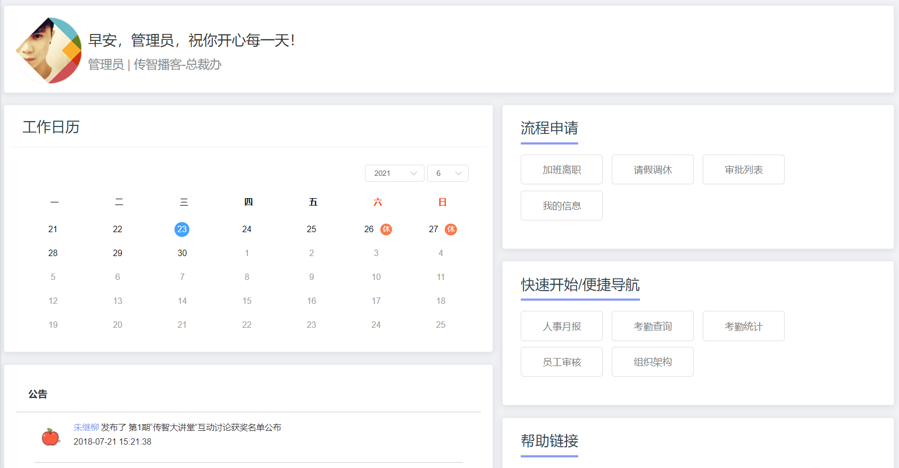
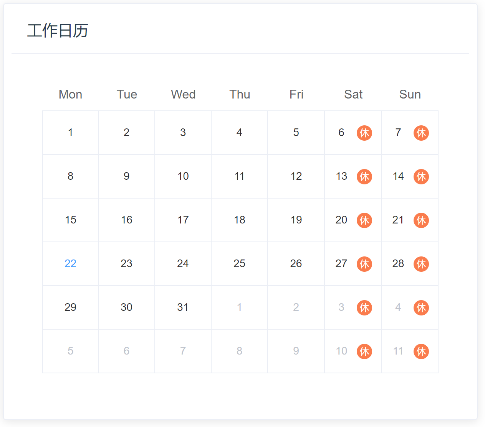
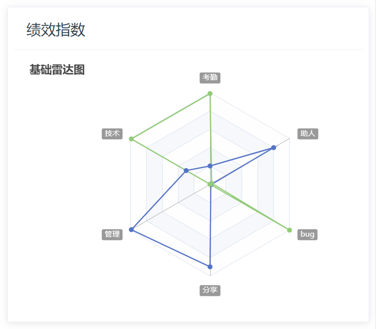

## 首页-静态结构

### 目标

完成首页静态页面的绘制



### 分析

使用 Element 提供的组件进行布局即可，在这里，我们不进行讲解，直接拷贝下方代码即可

### 实现

```vue
<template>
  <div class="dashboard-container">
    <!-- 头部内容 -->
    <el-card class="header-card">
      <div>
        <div class="fl headL">
          <div class="headImg">
            
          </div>
          <div class="headInfoTip">
            <p class="firstChild">早安，管理员，祝你开心每一天！</p>
            <p class="lastChild">早安，管理员，祝你开心每一天！</p>
          </div>
        </div>
        <div class="fr" />
      </div>
    </el-card>
    <!-- 主要内容 -->
    <el-row type="flex" justify="space-between">
      <!-- 左侧内容 -->
      <el-col :span="13" style="padding-right: 26px">
        <!-- 工作日历 -->
        <el-card class="box-card">
          <div slot="header" class="header">
            <span>工作日历</span>
          </div>
          <!-- 放置日历组件 -->
        </el-card>
        <!-- 公告 -->
        <el-card class="box-card">
          <div class="advContent">
            <div class="title">公告</div>
            <div class="contentItem">
              <ul class="noticeList">
                <li>
                  <div class="item">
                    
                    <div>
                      <p>
                        <span class="col">朱继柳</span> 发布了
                        第1期“传智大讲堂”互动讨论获奖名单公布
                      </p>
                      <p>2018-07-21 15:21:38</p>
                    </div>
                  </div>
                </li>
                <li>
                  <div class="item">
                    
                    <div>
                      <p>
                        <span class="col">朱继柳</span> 发布了
                        第2期“传智大讲堂”互动讨论获奖名单公布
                      </p>
                      <p>2018-07-21 15:21:38</p>
                    </div>
                  </div>
                </li>
                <li>
                  <div class="item">
                    
                    <div>
                      <p>
                        <span class="col">朱继柳</span> 发布了
                        第3期“传智大讲堂”互动讨论获奖名单公布
                      </p>
                      <p>2018-07-21 15:21:38</p>
                    </div>
                  </div>
                </li>
              </ul>
            </div>
          </div>
        </el-card>
      </el-col>
      <!-- 右侧内容 -->
      <el-col :span="11">
        <el-card class="box-card">
          <div class="header headTit">
            <span>流程申请</span>
          </div>
          <div class="sideNav">
            <el-button class="sideBtn">加班离职</el-button>
            <el-button class="sideBtn">请假调休</el-button>
            <el-button class="sideBtn">审批列表</el-button>
            <el-button class="sideBtn">我的信息</el-button>
          </div>
        </el-card>

        <!-- 绩效指数 -->
        <el-card class="box-card">
          <div slot="header" class="header">
            <span>绩效指数</span>
          </div>
          <!-- 放置雷达图 -->
        </el-card>
        <!-- 帮助连接 -->
        <el-card class="box-card">
          <div class="header headTit">
            <span>帮助链接</span>
          </div>
          <div class="sideLink">
            <el-row>
              <el-col :span="8">
                <a href="#">
                  <span class="icon iconGuide" />
                  <p>入门指南</p>
                </a>
              </el-col>
              <el-col :span="8">
                <a href="#">
                  <span class="icon iconHelp" />
                  <p>在线帮助手册</p>
                </a>
              </el-col>
              <el-col :span="8">
                <a href="#">
                  <span class="icon iconTechnology" />
                  <p>联系技术支持</p>
                </a>
              </el-col>
            </el-row>
          </div>
        </el-card>
      </el-col>
    </el-row>
  </div>
</template>

<style lang="scss" scoped>
.dashboard-container {
  margin: 10px;
  li {
    list-style: none;
  }
  .headImg {
    float: left;
    width: 100px;
    height: 100px;
    border-radius: 50%;
    background: #999;
    img {
      width: 100%;
      height: 100%;
      border-radius: 50%;
    }
  }

  .headInfoTip {
    padding: 25px 0 0;
    margin-left: 120px;
    p {
      padding: 0 0 15px;
      margin: 0;
      &.firstChild {
        font-size: 20px;
      }
      &.lastChild {
        font-size: 16px;
        color: #7f8c8d;
      }
    }
  }
}

.box-card {
  padding: 5px 10px;
  margin-top: 20px;
  .header {
    span {
      color: #2c3e50;
      font-size: 20px;
    }
    .item {
      color: #97a8be;
      float: right;
      padding: 3px 0;
    }
  }
  .headTit {
    span {
      border-bottom: 4px solid #8a97f8;
      padding-bottom: 10px;
    }
  }
}
.header-card {
  position: relative;
  .header {
    position: absolute;
    right: 20px;
    top: 15px;
    z-index: 1;
  }
}

.advContent {
  background: #fff;
  border-radius: 5px 5px 0px 0px;
  .title {
    font-size: 16px;
    padding: 20px;
    font-weight: bold;
    border-bottom: solid 1px #ccc;
  }
  .contentItem {
    padding: 0 30px;
    min-height: 350px;
    .item {
      display: flex;
      padding: 18px 0 10px;
      border-bottom: solid 1px #ccc;
      .col {
        color: #8a97f8;
      }
      img {
        width: 56px;
        height: 56px;
        border-radius: 50%;
        margin-right: 10px;
      }
      p {
        padding: 0 0 8px;
      }
    }
  }
}
.noticeList {
  margin: 0;
  padding: 0;
}
.sideNav,
.sideLink {
  padding: 30px 0 12px;
  .sideBtn {
    padding: 16px 26px;
    font-size: 16px;
    margin: 10px 5px;
  }
}
.sideLink {
  text-align: center;
  .icon {
    display: inline-block;
    width: 76px;
    height: 76px;
    background: url("./../../assets/common/icon.png") no-repeat;
  }
  .iconGuide {
    background-position: 0 0;
  }
  .iconHelp {
    background-position: -224px 0;
  }
  .iconTechnology {
    background-position: -460px 0;
  }
}
</style>
```


### 小结


## 首页-显示用户资料

### 目标

将用户姓名显示出来

### 分析

用户信息已经保存在 vuex 中了，现在取出来使用即可

### 代码

1.  使用全局getters创建快捷访问

   ```js
   // 全局getters  目的：创建快捷访问  方便组件访问模块中的数据
   
   const getters = {
     // 其他略
     name: state => state.user.userInfo.username // 用户名
   }
   
   export default getters
   
   ```

   

2.  利用全局 getters 映射导入 name，简化对模块中数据的引用。 

   ```js
   <script>
   import { mapGetters } from 'vuex'
   
   export default {
     name: 'Dashboard',
     data() {
       return {}
     },
     computed: {
       ...mapGetters(['name'])
     },
     methods: {}
   }
   </script>
   ```

   

3.  在结构中使用映射的数据

   ```html
   <div class="headInfoTip">
     <p class="firstChild">早安，{{ name }}，祝你开心每一天！</p>
     <p class="lastChild">{{ name }} | 传智播客-总裁</p>
   </div>
   ```

   

### 小结


## 首页-日历组件基本封装

### 目标

在 Element 的 Calendar-calendar 组件基础之上，对其进行定制，结构如下：

​										

### 分析

1.  独立封装日期显示组件
2.  用插槽自定义日历内容显示

### 实现

1.  创建 `src\views\dashboard\calender.vue` 组件，封装日期显示组件

   ```vue
   <template>
     <el-calendar v-model="currentDate"></el-calendar>
   </template>
   
   <script>
   export default {
     data() {
       return {
         currentDate: new Date()
       }
     }
   }
   </script>
   
   ```

   

2. 在主页中使用日历组件

   - 导入、挂载、使用

   ```vue
   <script>
   import calendar from './calender.vue'
   
   export default {
     name: 'Dashboard',
     components: {
       calendar
     }
   }
   </script>
   ```

   ```vue
   <!-- 放置日历组件 -->
   <calendar />
   ```

   

3.  用插槽自定义日历内容显示

   ```vue
   <template>
     <el-calendar v-model="currentDate">
       <template slot="dateCell" slot-scope="{ date, data }">
         <div class="date-content">
           <span class="text">01</span>
           <span class="rest">休</span>
         </div>
       </template>
     </el-calendar>
   </template>
   
   <script>
   export default {
     data() {
       return {
         currentDate: new Date()
       }
     }
   }
   </script>
   
   <style lang="scss" scoped>
   ::v-deep td.next {
     display: none;
   }
   ::v-deep .current ~ td {
     display: revert !important;
   }
   
   ::v-deep .next ~ td {
     display: none;
   }
   .date-content {
     height: 40px;
     text-align: center;
     line-height: 40px;
     font-size: 14px;
   }
   .date-content .rest {
     color: #fff;
     border-radius: 50%;
     background: rgb(250, 124, 77);
     width: 20px;
     height: 20px;
     line-height: 20px;
     display: inline-block;
     font-size: 12px;
     margin-left: 10px;
   }
   .date-content .text {
     width: 20px;
     height: 20px;
     line-height: 20px;
     display: inline-block;
   }
   </style>
   
   ```

   

### 小结


## 首页-日历组件日期渲染

### 目标

在前边使用插槽的基础上，继续对数据进行设置

​										

### 分析

使用作用域插槽 ` slot-scope="{ date, data }"` 的数据来填充自定义数据到单元格中

### 实现

```html
<template>
  <el-calendar v-model="currentDate">
    <template slot="dateCell" slot-scope="{ date, data }">
      <div class="date-content">
        <span class="text">{{ getDay(data.day) }}</span>
        <span v-if="isWeek(date)" class="rest">休</span>
      </div>
    </template>
  </el-calendar>
</template>

<script>
export default {
  data() {
    return {
      currentDate: new Date()
    }
  },
  methods: {
    getDay(value) {
      const day = value.split('-')[2] // 11, 02
      return day.startsWith('0') ? day.slice(1) : day
    },
    // 判断是否周末
    isWeek(date) {
      return date.getDay() === 6 || date.getDay() === 0
    }
  }
}
</script>
```


### 小结


## 首页-用 antv-G2 实现雷达图

### 目标

用插件实现雷达图功能

​											


### 分析

这种图在echarts中也有，这里我们用蚂蚁数据可视化部门的产品 antv-G2

1.  [antv 官网](https://antv.vision/zh)
2.  [雷达图案例](https://g2.antv.vision/zh/examples/radar/radar#basic)

这类第三方的工具，基本上都是根据官方文档跑起来初始demo，然后查[官方文档](https://g2.antv.vision/zh/docs/manual/getting-started)进行学习


### 实现

1.  安装依赖

   ```bash
   npm install @antv/g2 @antv/data-set --save
   ```

   

2. 创建 `src\views\dashboard\radar.vue` 组件来实现雷达图

   ```html
   <template>
     <div id="container" />
   </template>
   
   <script>
   import DataSet from '@antv/data-set'
   import { Chart } from '@antv/g2'
   
   export default {
     mounted() {
       const data = [
         { item: '工作效率', a: 70, b: 30 },
         { item: '考勤', a: 60, b: 70 },
         { item: '积极性', a: 50, b: 60 },
         { item: '帮助同事', a: 40, b: 50 },
         { item: '自主学习', a: 60, b: 70 },
         { item: '正确率', a: 70, b: 50 }
       ]
       const { DataView } = DataSet
       const dv = new DataView().source(data)
       dv.transform({
         type: 'fold',
         fields: ['a', 'b'], // 展开字段集
         key: 'user', // key字段
         value: 'score' // value字段
       })
   
       const chart = new Chart({
         container: 'container',
         autoFit: true,
         height: 500
       })
       chart.data(dv.rows)
       chart.scale('score', {
         min: 0,
         max: 80
       })
       chart.coordinate('polar', {
         radius: 0.8
       })
       chart.tooltip({
         shared: true,
         showCrosshairs: true,
         crosshairs: {
           line: {
             style: {
               lineDash: [4, 4],
               stroke: '#333'
             }
           }
         }
       })
       chart.axis('item', {
         line: null,
         tickLine: null,
         grid: {
           line: {
             style: {
               lineDash: null
             }
           }
         }
       })
       chart.axis('score', {
         line: null,
         tickLine: null,
         grid: {
           line: {
             type: 'line',
             style: {
               lineDash: null
             }
           }
         }
       })
   
       chart
         .line()
         .position('item*score')
         .color('user')
         .size(2)
       chart
         .point()
         .position('item*score')
         .color('user')
         .shape('circle')
         .size(4)
         .style({
           stroke: '#fff',
           lineWidth: 1,
           fillOpacity: 1
         })
       chart
         .area()
         .position('item*score')
         .color('user')
       chart.render()
     }
   }
   </script>
   
   <style lang="scss" scoped></style>
   
   ```

   


