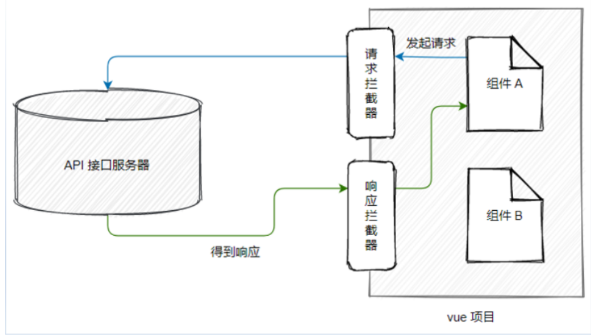
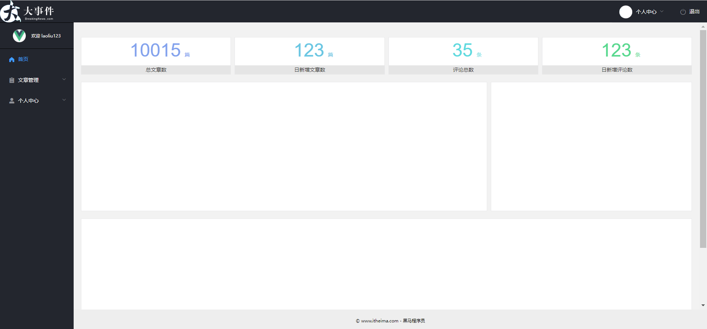
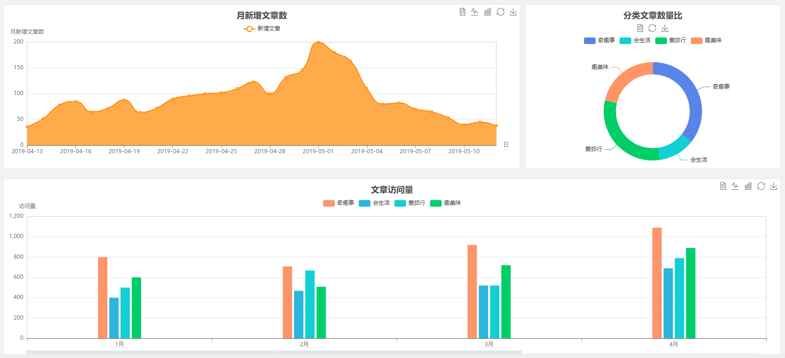
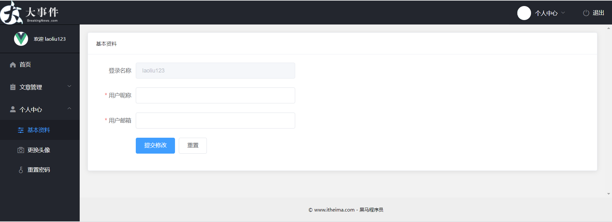
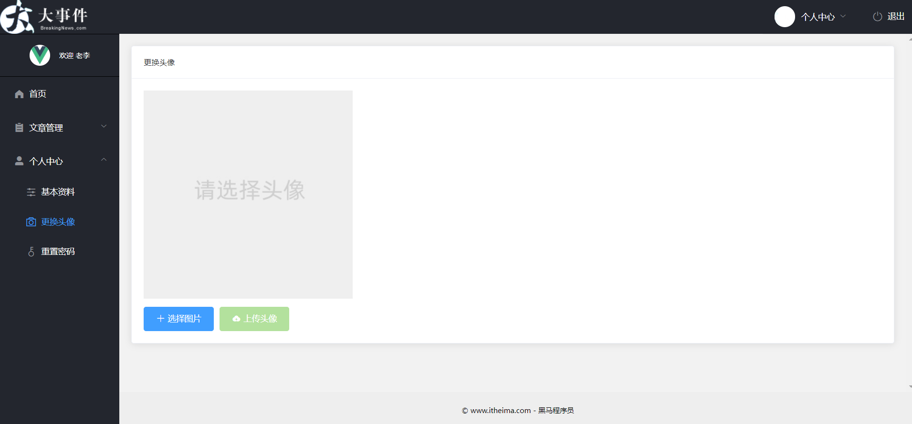
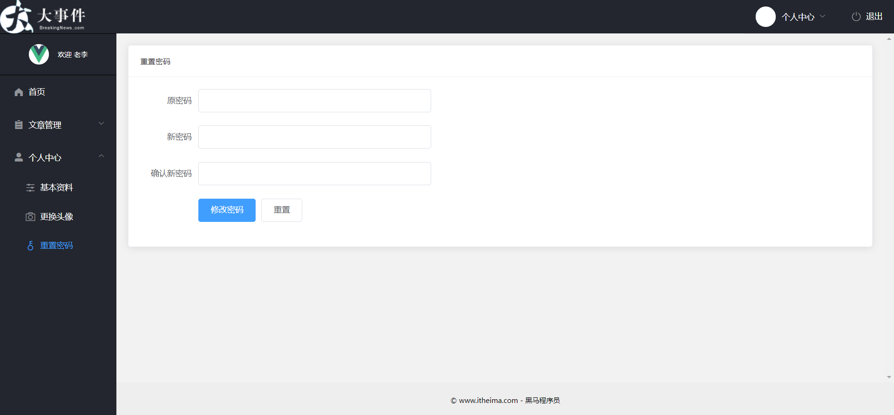

# Day02_左侧菜单-权限控制-个人中心

## 01.布局-vuex保存用户信息

### 目标

能够把登录后返回信息保存到vuex中


### 讲解

1. 在`src/api/index.js`模块中, 定义接口方法, 用于请求用户信息数据

   ```js
   /**
    * 获取-用户信息
    * @returns Promise对象
    */
   export const getUserInfoAPI = () => {
     return request({
       url: '/my/userinfo',
       headers: {
         Authorization: store.state.token
       }
     })
   }
   
   ```

   

2. 在 `src/store/index.js` 模块中，使用接口方法+actions获取用户的基本信息

   ```js
   import Vue from 'vue'
   import Vuex from 'vuex'
   import createPersistedState from 'vuex-persistedstate'
   // 导入axios
   import { getUserInfoAPI } from '@/api'
   
   Vue.use(Vuex)
   
   export default new Vuex.Store({
     state: {
       token: '', // 用户token
       userInfo: {} // 定义用户信息对象
     },
     mutations: {
       // 更新 token 的 mutation 函数
       updateToken (state, newToken) {
         state.token = newToken
       },
       // 更新用户的信息
       updateUserInfo (state, info) {
         state.userInfo = info
       }
     },
     actions: {
       // 定义初始化用户基本信息的 action 函数
       async initUserInfo (store) {
         const { data: res } = await getUserInfoAPI()
         if (res.code === 0) {
           store.commit('updateUserInfo', res.data)
         }
       }
     },
     // 配置为 vuex 的插件
     plugins: [createPersistedState()]
   })
   
   ```

3. 在全局前置守卫, 做判断, 有token但是无userInfo信息, 才发请求拿用户信息, 在`src/router/index.js`中编写

   > 因为不确定先进入的哪个页面, 但是全局前置路由守卫必执行

   ```js
   router.beforeEach((to, from, next) => {
     const token = store.state.token
     if (token && !store.state.userInfo.username) {
       // 有token但是没有用户信息, 才去请求用户信息保存到vuex里
       // 调用actions里方法请求数据
       store.dispatch('initUserInfo')
       // 下次切换页面vuex里有用户信息数据就不会重复请求用户信息
     }
   
     next() // 路由放行
   })
   ```

4. 最后效果就是, 登录后, 刷新后, 会在vue调试工具中查看vuex中userInfo有值即可


### 小结

1. vuex保存用户信息的思路是?

   <details>
   <summary>答案</summary>
   <ul>
   <li>定义state变量和mutations以及actions方法, 在路由守卫中判断有token无vuex中userInfo用户信息的时候, 调用actions里的方法请求用户信息保存到state里userInfo中</li>
   </ul>
   </details>


## 02.布局-渲染用户信息

### 目标

把vuex中用户信息, 渲染到标签上显示


### 讲解

1. 在`src/views/layout/index.vue`, 左侧侧边栏, 渲染用户信息昵称/用户名

   ```vue
   <!-- 左侧边栏的用户信息 -->
   <el-aside width="200px">
       <div class="user-box">
           
           
           <span>欢迎 {{ nickname || username }}</span>
       </div>
   </el-aside>
   
   
   <style lang="less" scoped>
   // 左侧边栏用户信息区域
   .user-box {
     height: 70px;
     display: flex;
     justify-content: center;
     align-items: center;
     border-top: 1px solid #000;
     border-bottom: 1px solid #000;
     user-select: none;
     img {
       width: 35px;
       height: 35px;
       border-radius: 50%;
       background-color: #fff;
       margin-right: 15px;
       object-fit: cover;
     }
     span {
       color: white;
       font-size: 12px;
     }
   }
   </style>
   ```

2. 在vuex中, 定义getters, 定义并导出用户名和昵称

   ```js
   getters: {
       nickname: state => state.userInfo.nickname, // 昵称
       username: state => state.userInfo.username, // 用户名
       user_pic: state => state.userInfo.user_pic // 用户头像
   }
   ```

3. 在`src/views/layout/index.vue`采用映射getters的方式定义计算属性

   ```js
   import { mapGetters } from 'vuex'
   export default {
     computed: {
       ...mapGetters(['nickname', 'username', 'user_pic'])
     }
   }
   ```


### 小结

1. 用户信息如何渲染的?

   <details>
   <summary>答案</summary>
   <ul>
   <li>在vuex中把state映射成getters, 再用getters辅助函数映射到组件内使用state的值</li>
   </ul>
   </details>


## 03.布局-侧边栏导航布局

### 目标

使用elementUI组件, 开发左侧导航


### 讲解

1. 在 `src/views/layout/index.vue` 组件的 `el-aside`范围内div标签兄弟关系，定义左侧菜单的 UI 布局结构

   ```xml
   <!-- 左侧边栏的用户信息 -->
         <el-aside width="200px">
           <div class="user-box">
             
             
             <span>欢迎 {{ nickname || username }}</span>
           </div>
           <!-- 左侧导航菜单 -->
           <el-menu
             default-active="1"
             class="el-menu-vertical-demo"
             background-color="#23262E"
             text-color="#fff"
             active-text-color="#409EFF"
             unique-opened
           >
             <!-- 不包含子菜单的“一级菜单” -->
             <el-menu-item index="1"
               ><i class="el-icon-s-tools"></i>一级菜单</el-menu-item
             >
             <!-- 包含子菜单的“一级菜单” -->
             <el-submenu index="2">
               <template slot="title">
                 <i class="el-icon-s-tools"></i>
                 <span>一级菜单</span>
               </template>
               <el-menu-item index="2-1"
                 ><i class="el-icon-star-on"></i>二级菜单</el-menu-item
               >
               <el-menu-item index="2-2"
                 ><i class="el-icon-star-on"></i>二级菜单</el-menu-item
               >
               <el-menu-item index="2-3"
                 ><i class="el-icon-star-on"></i>二级菜单</el-menu-item
               >
             </el-submenu>
           </el-menu>
         </el-aside>
   ```

2. 美化 `Main.vue` 组件的布局结构：

   ```less
   // 侧边栏菜单的样式
   .el-aside {
     .el-submenu,
     .el-menu-item {
       width: 200px;
       user-select: none;
     }
   }
   ```

   


### 小结

1. menu菜单标签的关系?

   <details>
   <summary>答案</summary>
   <ul>
   <li>menu下包含menu-item代表一行, 然后submenu是带子菜单的容器</li>
   </ul>
   </details>


## 04.布局-侧边栏导航数据

### 目标

从后台请求侧边栏标题等数据, 铺设侧边栏导航


### 讲解

1. 在`src/api/index.js`封装请求侧边栏数据的接口方法

   ```js
   /**
    * 获取-侧边栏菜单数据
    * @returns Promise对象
    */
   export const getMenusAPI = () => {
     return request({
       url: '/my/menus',
       headers: {
         Authorization: store.state.token
       }
     })
   }
   ```

2. 在`src/views/layout/index.vue`组件中, 引入接口方法, 发请求拿到数据, 保存到data变量中

   ```js
   import { getMenusAPI } from '@/api'
   export default {
     // ...其他
     data () {
       return {
         menus: [] // 侧边栏数据
       }
     },
     created () {
       this.getMenusListFn()
     },
     methods: {
       // ...其他
       // 获取侧边栏菜单数据
       async getMenusListFn () {
         const { data: res } = await getMenusAPI()
         console.log(res)
         this.menus = res.data
       }
     }
   }
   ```

3. 循环渲染左侧的一级和二级菜单数据铺设

   ```vue
   <template v-for="item in menus">
       <!-- 不包含子菜单的“一级菜单” -->
       <el-menu-item :index="item.indexPath" :key="item.indexPath" v-if="!item.children">
           <i :class="item.icon"></i>{{ item.title }}
       </el-menu-item>
   
       <!-- 包含子菜单的“一级菜单” -->
       <el-submenu :index="item.indexPath" :key="item.indexPath" v-else>
           <template slot="title">
               <i :class="item.icon"></i>
               <span>{{ item.title }}</span>
           </template>
           <!-- 循环渲染“二级菜单” -->
           <el-menu-item :index="subItem.indexPath" v-for="subItem in item.children" :key="subItem.indexPath">
               <i :class="subItem.icon"></i>{{ subItem.title }}
           </el-menu-item>
       </el-submenu>
   </template>
   ```

4. 修改 `el-menu` 组件的 `default-active` 属性，可以设置默认激活的左侧菜单, 为首页路由路径

   ```vue
   <el-menu
       default-active="/home"
       class="el-menu-vertical-demo"
       background-color="#23262E"
       text-color="#fff"
       active-text-color="#409EFF"
       unique-opened
      ></el-menu>
   ```

5. 为 `el-menu` 组件添加 `router` 属性，可以开启左侧菜单的路由模式

   ```vue
   <el-menu
       default-active="/home"
       class="el-menu-vertical-demo"
       background-color="#23262E"
       text-color="#fff"
       active-text-color="#409EFF"
       unique-opened
       router
      ></el-menu>
   ```

6. 点击左侧导航, 查看路由地址是否切换


### 小结

1. el-menu如何集成路由切换功能?

   <details>
   <summary>答案</summary>
   <ul>
   <li>index属性的值对应要切换的路由地址, el-menu上添加router属性即可</li>
   </ul>
   </details>


## 05.axios-请求拦截器

### 目标

掌握axios请求拦截器使用, 在其中统一携带token




### 讲解

1. 正常接口方法里, 在函数里请求headers参数需要写多个, 要修改需要改多处, 所以我们决定在请求拦截器统一携带

2. 在`utils/request.js`中, 使用自定义axios函数绑定请求拦截器, 判断有token再携带到请求头上

   ```js
   // 定义请求拦截器
   myAxios.interceptors.request.use(function (config) {
     // 为请求头挂载 Authorization 字段
     config.headers.Authorization = store.state.token
     return config
   }, function (error) {
     return Promise.reject(error)
   })
   
   ```

3. 这是一个后台管理类项目, 除了登录和注册接口后端不要求使用token, 其他接口都得携带token

   > 判断请求地址 登录: /api/login 和 注册: /api/reg

   ```js
   // 白名单: 不需要携带token的api地址
   const whiteAPIList = ['/api/reg', '/api/login']
   
   // 定义请求拦截器
   myAxios.interceptors.request.use(function (config) {
     if (!whiteAPIList.includes(config.url)) {
       // 为请求头挂载 Authorization 字段
       config.headers.Authorization = store.state.token
     }
     return config
   }, function (error) {
     return Promise.reject(error)
   })
   ```

4. 发请求看看登录/获取菜单的network里, 请求头上是否有Authorization和token值携带


### 小结

1. axios请求拦截器作用是什么?

   <details>
   <summary>答案</summary>
   <ul>
   <li>axios请求拦截器, 在请求的时候先执行请求拦截器, 添加了请求头, 然后请求到后端接口, 可以统一携带Authorization</li>
   </ul>
   </details>


## 06.权限-控制访问

### 目标

当用户未登录的时候, 是无法访问到这个内部项目的正常页面的


### 讲解

1. 可以在路由全局前置守卫判断当前vuex里是否有token

   > 有token值证明刚才登录过, 无token值证明未登录

   ```js
   router.beforeEach((to, from, next) => {
     const token = store.state.token
     if (token) {
       // 如果有token, 证明已登录
       if (!store.state.userInfo.username) {
         // 有token但是没有用户信息, 才去请求用户信息保存到vuex里
         // 调用actions里方法请求数据
         store.dispatch('initUserInfo')
         // 下次切换页面vuex里有用户信息数据就不会重复请求用户信息
       }
       next() // 路由放行
     } else {
       next('/login')
     }
   })
   ```

2. 在主页删除本地的vuex数据, 刷新页面让vuex取出来空的token, 但是发现递归了

3. 原因: 因为强制跳转到登录页也会让路由守卫再次触发, 又判断无token, 再次跳转登录页, 就递归了

4. 解决: 登录页面应该是无需判断token的, 还有注册页面, 所以设置白名单, 无token要去这2个页面直接放行

   ```js
   // 无需验证token的页面
   const whiteList = ['/login', '/reg']
   
   router.beforeEach((to, from, next) => {
     const token = store.state.token
     if (token) {
       // 如果有token, 证明已登录
       if (!store.state.userInfo.username) {
         // 有token但是没有用户信息, 才去请求用户信息保存到vuex里
         // 调用actions里方法请求数据
         store.dispatch('initUserInfo')
         // 下次切换页面vuex里有用户信息数据就不会重复请求用户信息
       }
       next() // 路由放行
     } else {
       // 如果无token
       // 如果去的是白名单页面, 则放行
       if (whiteList.includes(to.path)) {
         next()
       } else {
         // 如果其他页面请强制拦截并跳转到登录页面
         next('/login')
       }
     }
   })
   ```


### 小结

1. 无token的时候, 还需要判断什么?

   <details>
   <summary>答案</summary>
   <ul>
   <li>还需要判断它是否去的是无token能够访问的页面, 应该直接放行, 让路由跳转</li>
   </ul>
   </details>


## 07.axios-响应拦截器

### 目标

如果token有, 但是过期了怎么办


### 讲解

1. 前端是无法判断token是否过期了的, 所以当某次发请求把token带给后台做验证的时候

2. 后台发现token过期了, 则会返回响应状态码401

3. 但是你又不确定在哪个请求会401, 所以要用统一的响应拦截器做判断

4. 在`src/utils/request.js`中, 给自定义axios函数添加响应拦截器

   > 响应状态码2xx和3xx进入第一个函数, 直接返回响应内容, 如果响应状态码为4xx和5xx则会进入第二个函数, 我们做具体判断和逻辑

   > return 会返回到本次请求的Promise对象位置

   ```js
   // 定义响应拦截器
   myAxios.interceptors.response.use(function (response) {
     // 响应状态码为 2xx 时触发成功的回调，形参中的 response 是“成功的结果”
     return response
   }, function (error) {
     // 响应状态码不是 2xx 时触发失败的回调，形参中的 error 是“失败的结果”
     return Promise.reject(error)
   })
   ```

   

5. 在第二个函数, 编写判断401状态码, token过期做出的处理逻辑

   ```js
   // 定义响应拦截器
   myAxios.interceptors.response.use(function (response) {
     // 响应状态码为 2xx 时触发成功的回调，形参中的 response 是“成功的结果”
     return response
   }, function (error) {
     // 响应状态码不是 2xx 时触发失败的回调，形参中的 error 是“失败的结果”
     if (error.response.status === 401) {
       // 无效的 token
       // 把 Vuex 中的 token 重置为空，并跳转到登录页面
       store.commit('updateToken', '')
       router.push('/login')
     }
     return Promise.reject(error)
   })
   ```

6. 可以手动修改本地token值, 乱改一个, 导致它过期, 试试是否能自动回到登录页面


### 小结

1. 我们在哪里, 如何判断token过期问题?

   <details>
   <summary>答案</summary>
   <ul>
   <li>在axios响应拦截器中, 一旦有请求发送回来的是401, 证明原地token过期了, 清除vuex并跳转到登录页面</li>
   </ul>
   </details>


## 08.首页-标签和路由

### 目标

把首页的组件创建标签和路由配置好




### 讲解

1. 在 `src/views/` 目录下，新建 `/home/index.vue` 组件，并初始化如下的组件结构

   ```vue
   <template>
     <div>
       <div class="container-fluid">
         <el-row class="spannel_list" :gutter="10">
           <el-col :sm="6" :xs="12">
             <div class="spannel">
               <em>10015</em><span>篇</span>
               <b>总文章数</b>
             </div>
           </el-col>
           <el-col :sm="6" :xs="12">
             <div class="spannel scolor01">
               <em>123</em><span>篇</span>
               <b>日新增文章数</b>
             </div>
           </el-col>
           <el-col :sm="6" :xs="12">
             <div class="spannel scolor02">
               <em>35</em><span>条</span>
               <b>评论总数</b>
             </div>
           </el-col>
           <el-col :sm="6" :xs="12">
             <div class="spannel scolor03">
               <em>123</em><span>条</span>
               <b>日新增评论数</b>
             </div>
           </el-col>
         </el-row>
       </div>
   
       <div class="container-fluid">
         <el-row class="curve-pie" :gutter="10">
           <el-col :sm="16" :xs="16">
             <div class="gragh_pannel" id="curve_show"></div>
           </el-col>
           <el-col :sm="8" :xs="8">
             <div class="gragh_pannel" id="pie_show"></div>
           </el-col>
         </el-row>
       </div>
   
       <div class="container-fluid">
         <div class="column_pannel" id="column_show"></div>
       </div>
     </div>
   </template>
   
   <script>
   import * as echarts from 'echarts'
   
   export default {
     name: 'my-home'
   }
   </script>
   
   <style lang="less" scoped>
   .spannel_list {
     margin-top: 20px;
   }
   
   .spannel {
     height: 100px;
     overflow: hidden;
     text-align: center;
     position: relative;
     background-color: #fff;
     border: 1px solid #e7e7e9;
     margin-bottom: 20px;
   }
   
   .spannel em {
     font-style: normal;
     font-size: 50px;
     line-height: 50px;
     display: inline-block;
     margin: 10px 0 0 20px;
     font-family: 'Arial';
     color: #83a2ed;
   }
   
   .spannel span {
     font-size: 14px;
     display: inline-block;
     color: #83a2ed;
     margin-left: 10px;
   }
   
   .spannel b {
     position: absolute;
     left: 0;
     bottom: 0;
     width: 100%;
     line-height: 24px;
     background: #e5e5e5;
     color: #333;
     font-size: 14px;
     font-weight: normal;
   }
   
   .scolor01 em,
   .scolor01 span {
     color: #6ac6e2;
   }
   
   .scolor02 em,
   .scolor02 span {
     color: #5fd9de;
   }
   
   .scolor03 em,
   .scolor03 span {
     color: #58d88e;
   }
   
   .gragh_pannel {
     height: 350px;
     border: 1px solid #e7e7e9;
     background-color: #fff !important;
     margin-bottom: 20px;
   }
   
   .column_pannel {
     margin-bottom: 20px;
     height: 400px;
     border: 1px solid #e7e7e9;
     background-color: #fff !important;
   }
   </style>
   
   ```
   
2. 配置路由在`src/router/index.js`中

   ```js
    {
       path: '/',
       component: () => import('@/views/layout'),
       redirect: '/home', // 默认显示首页的二级路由
       children: [
         {
           path: 'home',
           component: () => import('@/views/home')
         }
       ]
     },
   ```

3. 设置二级路由挂载点, 在`src/views/layout/index.vue`的el-main中

   ```vue
   <!-- 页面主体区域 -->
   <!-- 二级路由挂载点 -->
   <el-main>
       <router-view></router-view>
   </el-main>
   ```

   

### 小结

1. 二级路由如何设置?

   <details>
   <summary>答案</summary>
   <ul>
   <li>在某个一级路由对象里写children, 然后再设置二级路由挂载点位置</li>
   </ul>
   </details>


## 09.首页-echarts使用

### 目标

在vue项目页面中, 使用echarts完成图表




### 讲解

1. 找到[echarts文档](https://echarts.apache.org/handbook/zh/basics/import), 查看如何使用, 根据文档下载echarts包到当前项目中

   ```bash
   yarn add echarts
   ```

2. 根据文档初始化echarts, 并完成面积图的使用

   ```js
   // 模块内用命名导出的, 我把他们再收集起来形成对象, 放到echrats变量里
   import * as echarts from 'echarts'
   
   export default {
     name: 'my-home',
     mounted () {
       this.setCurveChartFn()
     },
     methods: {
       // 设置面积图
       setCurveChartFn () {
         // 基于准备好的dom，初始化echarts实例
         const curveChart = echarts.init(document.getElementById('curve_show'))
         // 绘制面积图表
         // 数据源(模拟后台返回的数据)
         const aListAll = [
           { count: 36, date: '2019-04-13' },
           { count: 52, date: '2019-04-14' },
           { count: 78, date: '2019-04-15' },
           { count: 85, date: '2019-04-16' },
           { count: 65, date: '2019-04-17' },
           { count: 72, date: '2019-04-18' },
           { count: 88, date: '2019-04-19' },
           { count: 64, date: '2019-04-20' },
           { count: 72, date: '2019-04-21' },
           { count: 90, date: '2019-04-22' },
           { count: 96, date: '2019-04-23' },
           { count: 100, date: '2019-04-24' },
           { count: 102, date: '2019-04-25' },
           { count: 110, date: '2019-04-26' },
           { count: 123, date: '2019-04-27' },
           { count: 100, date: '2019-04-28' },
           { count: 132, date: '2019-04-29' },
           { count: 146, date: '2019-04-30' },
           { count: 200, date: '2019-05-01' },
           { count: 180, date: '2019-05-02' },
           { count: 163, date: '2019-05-03' },
           { count: 110, date: '2019-05-04' },
           { count: 80, date: '2019-05-05' },
           { count: 82, date: '2019-05-06' },
           { count: 70, date: '2019-05-07' },
           { count: 65, date: '2019-05-08' },
           { count: 54, date: '2019-05-09' },
           { count: 40, date: '2019-05-10' },
           { count: 45, date: '2019-05-11' },
           { count: 38, date: '2019-05-12' }
         ]
   
         // 但是图标要求直接给数字的值, 所以要把对象的值取出来形成2个只有值的数组
         const aCount = []
         const aDate = []
   
         for (let i = 0; i < aListAll.length; i++) {
           aCount.push(aListAll[i].count)
           aDate.push(aListAll[i].date)
         }
   
         // 面积图的echarts配置项(参考文档复制)
         const chartopt = {
           title: {
             text: '月新增文章数', // 标题
             left: 'center', // 位置居中
             top: '10' // 标题距离容器顶部px
           },
           tooltip: { // 提示框组件
             trigger: 'axis' // 坐标轴触发(鼠标放在坐标轴就能出提示框)
           },
           legend: { // 图例组件(每种颜色的意思)
             data: ['新增文章'], // 图例文字解释(要和series里name对应)
             top: '40' // 距离容器顶部px
           },
           toolbox: { // 工具栏
             show: true, // 要显示
             feature: { // 各工具配置项
               mark: { show: true }, // 辅助线开关
               dataView: { show: true, readOnly: false }, // 数据视图工具，可以展现当前图表所用的数据，编辑后可以动态更新。
               magicType: { show: true, type: ['line', 'bar'] }, // 动态类型切换
               restore: { show: true }, // 配置项还原
               saveAsImage: { show: true } // 点击保存下载图片
             }
           },
           xAxis: [ // 水平轴显示
             {
               name: '日',
               type: 'category',
               boundaryGap: false, // 坐标轴两边留白策略 (不留白)
               data: aDate // 水平轴上的数字数据 (时间)
             }
           ],
           yAxis: [ // 垂直轴显示
             {
               name: '月新增文章数',
               type: 'value' // 以series里的data值做划分段
             }
           ],
           series: [ // 系列(控制图表类型和数据)
             {
               name: '新增文章',
               type: 'line', // 折线图
               smooth: true, // 是否平滑视觉引导线，默认不平滑，可以设置成 true 平滑显示
               areaStyle: { type: 'default' }, // 区域填充样式。设置后显示成区域面积图。
               itemStyle: { color: '#f80', lineStyle: { color: '#f80' } }, // 折线拐点标志的样式。
               data: aCount // 真正数据源(用下标和x轴数组对应)
             }
           ],
           grid: { // 直角坐标系内绘图网格
             show: true,
             x: 50, // grid 组件离容器偏移量, 左侧
             x2: 50, // 右侧
             y: 80, // 上
             height: 220 // 高度
           }
         }
   
         curveChart.setOption(chartopt)
       }
     }
   }
   
   
   ```

3. 设置饼状图

   ```js
   // 设置饼状图
       picChartFn () {
         const oPie = echarts.init(document.getElementById('pie_show'))
         const oPieopt = {
           title: {
             top: 10,
             text: '分类文章数量比',
             x: 'center'
           },
           tooltip: {
             trigger: 'item', // 在图形上才会触发提示
             formatter: '{a} <br/>{b} : {c} ({d}%)' // 提示的文字显示的格式
             // a: 系列名
             // b: 数据名
             // c: 数值
             // d: 百分比 (只有饼状图生效)
           },
           color: ['#5885e8', '#13cfd5', '#00ce68', '#ff9565'], // 系列颜色
           legend: { // 图例组件
             x: 'center',
             top: 65,
             data: ['奇趣事', '会生活', '爱旅行', '趣美味'] // 每个部分对应的数据名(要和series里name对应)
           },
           toolbox: { // 工具箱
             show: true,
             x: 'center',
             top: 35,
             feature: {
               mark: { show: true },
               dataView: { show: true, readOnly: false },
               magicType: {
                 show: true,
                 type: ['pie', 'funnel'],
                 option: {
                   funnel: {
                     x: '25%',
                     width: '50%',
                     funnelAlign: 'left',
                     max: 1548
                   }
                 }
               },
               restore: { show: true },
               saveAsImage: { show: true }
             }
           },
           series: [
             {
               name: '访问来源',
               type: 'pie',
               radius: ['45%', '60%'],
               center: ['50%', '65%'],
               data: [
                 { value: 300, name: '奇趣事' },
                 { value: 100, name: '会生活' },
                 { value: 260, name: '爱旅行' },
                 { value: 180, name: '趣美味' }
               ]
             }
           ]
         }
         oPie.setOption(oPieopt)
       }
   ```

4. 设置底部柱状图

   ```js
   // 设置底部柱状图
       columnChartFn () {
         const oColumn = echarts.init(document.getElementById('column_show'))
         const oColumnopt = {
           title: {
             text: '文章访问量',
             left: 'center',
             top: '10'
           },
           tooltip: {
             trigger: 'axis'
           },
           legend: {
             data: ['奇趣事', '会生活', '爱旅行', '趣美味'],
             top: '40'
           },
           toolbox: {
             show: true,
             feature: {
               mark: { show: true },
               dataView: { show: true, readOnly: false },
               magicType: { show: true, type: ['line', 'bar'] },
               restore: { show: true },
               saveAsImage: { show: true }
             }
           },
           xAxis: [
             {
               type: 'category',
               data: ['1月', '2月', '3月', '4月', '5月']
             }
           ],
           yAxis: [
             {
               name: '访问量',
               type: 'value'
             }
           ],
           series: [
             {
               name: '奇趣事',
               type: 'bar',
               barWidth: 20,
               areaStyle: { type: 'default' },
               itemStyle: {
                 color: '#fd956a'
               },
               data: [800, 708, 920, 1090, 1200]
             },
             {
               name: '会生活',
               type: 'bar',
               barWidth: 20,
               areaStyle: { type: 'default' },
               itemStyle: {
                 color: '#2bb6db'
               },
               data: [400, 468, 520, 690, 800]
             },
             {
               name: '爱旅行',
               type: 'bar',
               barWidth: 20,
               areaStyle: { type: 'default' },
               itemStyle: {
                 color: '#13cfd5'
               },
               data: [500, 668, 520, 790, 900]
             },
             {
               name: '趣美味',
               type: 'bar',
               barWidth: 20,
               areaStyle: { type: 'default' },
               itemStyle: {
                 color: '#00ce68'
               },
               data: [600, 508, 720, 890, 1000]
             }
           ],
           grid: {
             show: true,
             x: 50,
             x2: 30,
             y: 80,
             height: 260
           },
           dataZoom: [ // 给x轴设置滚动条
             {
               start: 0, // 默认为0
               end: 100 - 1000 / 31, // 默认为100
               type: 'slider',
               show: true,
               xAxisIndex: [0],
               handleSize: 0, // 滑动条的 左右2个滑动条的大小
               height: 8, // 组件高度
               left: 45, // 左边的距离
               right: 50, // 右边的距离
               bottom: 26, // 右边的距离
               handleColor: '#ddd', // h滑动图标的颜色
               handleStyle: {
                 borderColor: '#cacaca',
                 borderWidth: '1',
                 shadowBlur: 2,
                 background: '#ddd',
                 shadowColor: '#ddd'
               }
             }
           ]
         }
         oColumn.setOption(oColumnopt)
       }
   ```

   

### 小结

1. 在Vue项目中如何使用图表?

   <details>
   <summary>答案</summary>
   <ul>
   <li>使用yarn/npm下载echarts,然后模块化方式引入, 然后找相关配置代码</li>
   </ul>
   </details>


## 10.个人中心-基本资料-组件和路由

### 目标

完成个人中心/基本资料, 页面组件创建和标签以及路由配置




### 讲解

1. 在 `src/views/User/userInfo.vue` 组件标签, ==直接复制==

   ```vue
   <template>
     <el-card class="box-card">
       <div slot="header" class="clearfix">
         <span>基本资料</span>
       </div>
       <!-- 表单 -->
       <el-form
         :model="userForm"
         :rules="userFormRules"
         ref="userFormRef"
         label-width="100px"
       >
         <el-form-item label="登录名称" prop="username">
           <el-input v-model="userForm.username" disabled></el-input>
         </el-form-item>
         <el-form-item label="用户昵称" prop="nickname">
           <el-input
             v-model="userForm.nickname"
             minlength="1"
             maxlength="10"
           ></el-input>
         </el-form-item>
         <el-form-item label="用户邮箱" prop="email">
           <el-input v-model="userForm.email"></el-input>
         </el-form-item>
         <el-form-item>
           <el-button type="primary" @click="submitFn">提交修改</el-button>
           <el-button>重置</el-button>
         </el-form-item>
       </el-form>
     </el-card>
   </template>
   
   <script>
   export default {
     name: 'UserInfo',
       data () {
       return {
         userForm: {
           username: this.$store.state.userInfo.username, // 默认值用登录后获取到的用户名
           nickname: '',
           email: ''
         },
         // 表单的验证规则对象
         userFormRules: {
           nickname: [
             { required: true, message: '请输入用户昵称', trigger: 'blur' },
             { pattern: /^\S{1,10}$/, message: '昵称必须是1-10位的非空字符串', trigger: 'blur' }
           ],
           email: [
             { required: true, message: '请输入用户邮箱', trigger: 'blur' },
             { type: 'email', message: '邮箱格式不正确', trigger: 'blur' }
           ]
         }
       }
     },
   }
   </script>
   
   <style lang="less" scoped>
   .el-form {
     width: 500px;
   }
   </style>
   
   ```

   

3. 在 `src/router/index.js` 模块中，导入 `UserInfo.vue` 组件，并声明对于应的路由规则：

   ```js
   {
       path: '/',
       component: () => import('@/views/layout'),
       redirect: '/home', // 默认显示首页的二级路由
       children: [
         {
           path: 'home',
           component: () => import('@/views/home')
         },
         {
           path: 'user-info', // 这里必须叫user-info, 因为侧边栏导航切换的是它
           component: () => import('@/views/user/userInfo')
         }
       ]
     }
   ```


3. 发现刷新后, 左侧导航高亮有问题了, 修改`el-menu`的default-active路径的值

   > 为当前的路由路径

   ```vue
    <el-menu :default-active="$route.path">
   ```

   


### 目标

1. 为了路由要设置指定的值?

   <details>
   <summary>答案</summary>
   <ul>
   <li>因为要和侧边栏, 切换跳转路由的地址对应上, 才能匹配到这个路由规则, 挂载二级路由组件</li>
   </ul>
   </details>


## 11.个人中心-基本资料-修改调接口

### 目标

完成提交修改功能调用接口, 和重置按钮功能


### 讲解

1. 在`src/views/user/userInfo.vue`中, 为“提交修改”按钮绑定点击事件处理函数：

   ```vue
   <el-button type="primary" @click="submitFn">提交修改</el-button>
   ```

2. 在 methods 中声明 `submit` 函数，并验证表单的合法性：

   ```js
   // 提交修改
   submitFn () {
       // 验证表单的合法性
       this.$refs.userFormRef.validate(async valid => {
           if (valid) {
               // 验证成功
               console.log(this.userForm)
           } else {
               // 验证失败
               return false
           }
       })
   }
   ```

3. 在`src/api/index.js`模块中, 封装更新用户基本资料的方法

   ```js
   /**
    * 更新-用户基本资料
    * @param {*} param0 { id: 用户id, email: 用户邮箱, nickname: 用户昵称, user_pic: 用户头像地址, username: 用户名 }
    * @returns Promise对象
    */
   export const updateUserInfoAPI = ({ id, email, nickname, user_pic, username }) => {
     return request({
       url: '/my/userinfo',
       method: 'PUT',
       data: {
         id,
         email,
         nickname,
         user_pic,
         username
       }
     })
   }
   ```

4. 发现eslint要求变量名不能出现带下划线的, 所以我们去项目根目录的.eslintrc.js文件, 修改下eslint配置

   > 关闭这个检查

   ```bash
   camelcase: 'off'
   ```

5. 验证通过之后，发起请求，修改用户的信息：

   ```js
   submitFn () {
         // 验证表单的合法性
         this.$refs.userFormRef.validate(async valid => {
           if (valid) {
             // 验证成功
             console.log(this.userForm)
             // 根据接口文档指示, 需要携带id(必须)
             this.userForm.id = this.$store.state.userInfo.id
             // 调用更新用户基本信息接口, 把用户在页面输入的新内容传给后台保存
             const { data: res } = await updateUserInfoAPI(this.userForm)
             if (res.code !== 0) return this.$message.error('更新用户信息失败！')
             // 更新用户信息成功，刷新 Vuex 中的数据
             this.$message.success('更新成功！')
             // 重新让vuex获取下最新的用户数据
             this.$store.dispatch('getUserInfoActions')
           } else {
             // 验证失败
             return false
           }
         })
       }
   ```


6. 在页面修改下用户信息, 保存看是否成功

7. 最后再做个重置, 点击重置按钮, 重置表单数据

   ```vue
   <el-button @click="resetFn">重置</el-button>
   
   <script>
   export default {
     // ...其他
     methods: {
       // ...其他
       // 重置按钮
       resetFn () {
         this.$refs.userFormRef.resetFields()
       }
     }
   
   }
   </script>
   
   ```

   

### 小结

1. 更新用户资料的思路是?

   <details>
   <summary>答案</summary>
   <ul>
   <li>做好表单页面, 收集用户要修改的信息, 根据接口文档差什么往参数对象上添加后, 把数据发给后台更新到数据库里, 根据返回提示code决定如何给用户页面反馈</li>
   </ul>
   </details>


## 12.个人中心-更换头像-组件和路由

### 目标

准备更换头像页面标签和路由, 实现选择头像的弹窗功能




### 讲解

1. 在 `src/views/user/userAvatar.vue` 组件如下：

   ```vue
   <template>
     <el-card class="box-card">
       <div slot="header" class="clearfix">
         <span>更换头像</span>
       </div>
       <div>
         <!-- 图片，用来展示用户选择的头像 -->
         
   
         <!-- 按钮区域 -->
         <div class="btn-box">
           <input type="file" accept="image/*" style="display: none" ref="iptRef" @change="onFileChange" />
           <el-button type="primary" icon="el-icon-plus" @click="chooseImg">选择图片</el-button>
           <el-button type="success" icon="el-icon-upload" :disabled="avatar === ''">上传头像</el-button>
         </div>
       </div>
     </el-card>
   </template>
   
   <script>
   export default {
     name: 'UserAvatar',
     data () {
       return {
         avatar: ''
       }
     }
   }
   </script>
   
   <style lang="less" scoped>
   .btn-box {
     margin-top: 10px;
   }
   .preview {
     object-fit: cover;
   }
   .the_img{
       width: 350px;
       height: 350px;
   }
   </style>
   
   ```

2. 在 `src/router/index.js` 路由模块中，导入步骤1新建的组件，并声明对应的路由规则：

   ```js
   {
       path: 'user-avatar', // 必须用这个值
       component: () => import('@/views/user/userAvatar')
   }
   ```

3. 实现对应的点击事件的方法

   ```js
   methods: {
       // 选择图片->点击事件->让选择框出现
       chooseImg () {
         // 模拟点击行为
         this.$refs.iptRef.click()
       },
       // 在选择框中选择图片后触发的改变事件
       onFileChange (e) {
         // 获取用户选择的文件列表（伪数组）
         const files = e.target.files
         if (files.length === 0) {
           // 没有选择图片
           this.avatar = ''
         } else {
           // 选择了图片
           console.log(files[0])
         }
       }
     }
   ```


### 小结

1. 如何点击按钮, 让图片选择框出现的?

   <details>
   <summary>答案</summary>
   <ul>
   <li>先准备隐藏的input标签type是file, 然后通过点击事件和JS代码获取input标签调用click事件, 就触发了input文件选择标签默认事件就会出图片选择窗口</li>
   </ul>
   </details>


## 13.个人中心-更换头像-预览选择头像

### 目标

用户选择头像后, 要在前端做预览


### 讲解

1. 设置图片, 默认图片和选择显示的图片, 2个img标签

   ```vue
   <!-- 图片，用来展示用户选择的头像 -->
   
   
   ```

   

2. 方式1: 使用**FileReader**来读取选择的前端文件, 转换为base64字符串, 给img标签渲染

   ```js
   onFileChange(e) {
     const files = e.target.files
     if (files.length === 0) {
       this.avatar = ''
     } else {
       // 1. 创建 FileReader 对象
       const fr = new FileReader()
       // 2. 调用 readAsDataURL 函数，读取文件内容
       fr.readAsDataURL(files[0])
       // 3. 监听 fr 的 onload 事件
       fr.onload = e => {
         // 4. 通过 e.target.result 获取到读取的结果，值是字符串（base64 格式的字符串）
         this.avatar = e.target.result
       }
     }
   }
   ```


3. 方式2: 使用`URL.createObjectURL`方法, 也可以把File类型文件, 转成一个Blob类型的纯前端本地的链接

   ```js
   // 使用URL.createObjURL()来转换文件变成图片地址(纯前端本地)
   this.avatar = URL.createObjectURL(files[0])
   ```

   

### 小结

1. 前端如何选择文件后, 用img标签直接预览?

   <details>
   <summary>答案</summary>
   <ul>
   <li>用FileReader读转成base64字符串, 或者用URL对象内置的createObjectURL方法转成内存里的url地址使用</li>
   </ul>
   </details>


## 14.个人中心-更换头像-修改调接口

### 目标

把选择好的头像图片文件, 传递给后台更新保存


### 讲解

1. 找到接口文档, 封装更新头像的接口方法, 在`src/api/index.js`

   ```js
   /**
    * 更新-用户头像
    * @param {*} avatar 头像的base64字符串
    * @returns Promise对象
    */
   export const updateAvatarAPI = (avatar) => {
     return request({
       url: '/my/update/avatar',
       method: 'PATCH',
       data: {
         avatar
       }
     })
   }
   ```

   

2. 在逻辑页面, 还得用`FileReader`才能有`data/image开头的base64图片字符串`, 在`views/user/userAvatar.vue`中修改并引入接口调用

   ```js
   // 在选择框中选择图片后触发的改变事件
       onFileChange (e) {
         // 获取用户选择的文件列表（伪数组）
         const files = e.target.files
         if (files.length === 0) {
           // 没有选择图片
           this.avatar = ''
         } else {
           // 选择了图片
           // 1. 创建 FileReader 对象
           const fr = new FileReader()
           // 2. 调用 readAsDataURL 函数，读取文件内容
           fr.readAsDataURL(files[0])
           // 3. 监听 fr 的 onload 事件
           fr.onload = async e => {
             // 4. 通过 e.target.result 获取到读取的结果，值是字符串（base64 格式的字符串）
             this.avatar = e.target.result
             // 5. 调用接口, 传递给后台并根据返回结果给用户提示
             const res = await updateAvatarAPI(this.avatar)
             if (res.code !== 0) return this.$message.error('上传头像失败！')
             this.$message.success('上传头像成功！')
             this.$store.dispatch('initUserInfo')
           }
   
           // 使用URL.createObjURL()来转换文件变成图片地址(纯前端本地)
           // this.avatar = URL.createObjectURL(files[0])
         }
       }
   ```


### 小结

1. 前端选择的图片如何传递给后台的?

   <details>
   <summary>答案</summary>
   <ul>
   <li>在前端把文件用FileReader读取并转成base64字符串, 并在请求体里把参数发给后台</li>
   </ul>
   </details>


## 15.个人中心-重置密码-组件和路由

### 目标

准备重置密码页面和组件, 配置路由




### 讲解

1. 新建 `src/views/user/userPwd.vue` 页面组件, 并==直接复制==标签和样式

   ```vue
   <template>
     <el-card class="box-card">
       <div slot="header" class="clearfix">
         <span>重置密码</span>
       </div>
       <!-- 表单 -->
       <el-form :model="pwdForm" :rules="pwdFormRules" ref="pwdFormRef" label-width="100px">
         <el-form-item label="原密码" prop="old_pwd">
           <el-input v-model="pwdForm.old_pwd" type="password"></el-input>
         </el-form-item>
         <el-form-item label="新密码" prop="new_pwd">
           <el-input v-model="pwdForm.new_pwd" type="password"></el-input>
         </el-form-item>
         <el-form-item label="确认新密码" prop="re_pwd">
           <el-input v-model="pwdForm.re_pwd" type="password"></el-input>
         </el-form-item>
         <el-form-item>
           <el-button type="primary">修改密码</el-button>
           <el-button>重置</el-button>
         </el-form-item>
       </el-form>
     </el-card>
   </template>
   
   <script>
   export default {
     name: 'UserPwd',
     data () {
       return {
         // 表单的数据对象
         pwdForm: {
           old_pwd: '',
           new_pwd: '',
           re_pwd: ''
         },
         // 表单的验证规则对象
         pwdFormRules: {
           old_pwd: [
             { required: true, message: '请输入密码', trigger: 'blur' },
             { pattern: /^\S{6,15}$/, message: '密码长度必须是6-15位的非空字符串', trigger: 'blur' }
           ],
           new_pwd: [
             { required: true, message: '请输入新密码', trigger: 'blur' },
             { pattern: /^\S{6,15}$/, message: '密码长度必须是6-15位的非空字符串', trigger: 'blur' }
           ],
           re_pwd: [
             { required: true, message: '请再次确认新密码', trigger: 'blur' },
             { pattern: /^\S{6,15}$/, message: '密码长度必须是6-15位的非空字符串', trigger: 'blur' }
           ]
         }
       }
     }
   }
   </script>
   
   <style lang="less" scoped>
   .el-form {
     width: 500px;
   }
   </style>
   
   ```

2. 在 `src/router/index.js` 路由模块中，导入步骤1新建的组件，并声明对应的路由规则：

   ```js
   {
       path: 'user-pwd', // 必须用这个值
       component: () => import('@/views/user/userPwd')
   }
   ```


### 小结

1. elementUI自带标签的基础校验如何使用?

   <details>
   <summary>答案</summary>
   <ul>
   <li>el-form身上添加rules属性和规则对象, el-form-item身上写prop属性字段是rules对应规则对象key属性, 也要和数据对象的key一致, 然后表单域内的表单标签也要对应v-model绑定和prop值同名的属性</li>
   </ul>
   </details>


## 16.个人中心-重置密码-自定义校验

### 目标

* 需求1: 新密码和原密码不能相同
* 需求2: 确认密码要和新密码一致


### 讲解

1. 添加自定义校验字段规则

   ```js
   new_pwd: [
       { required: true, message: '请输入新密码', trigger: 'blur' },
       { pattern: /^\S{6,15}$/, message: '密码长度必须是6-15位的非空字符串', trigger: 'blur' },
       { validator: samePwd, trigger: 'blur' }
     ],
     re_pwd: [
       { required: true, message: '请再次确认新密码', trigger: 'blur' },
       { pattern: /^\S{6,15}$/, message: '密码长度必须是6-15位的非空字符串', trigger: 'blur' },
       { validator: rePwd, trigger: 'blur' }
     ]
   ```

2. 添加自定义函数, 并编写内容的规则代码

   ```js
   data() {
     // 检测新旧密码是否相同
     const samePwd = (rule, value, callback) => {
       if (value === this.pwdForm.old_pwd) {
         return callback(new Error('新旧密码不能相同！'))
       }
       callback()
     }
     // 检测两次新密码是否一致
     const rePwd = (rule, value, callback) => {
       if (value !== this.pwdForm.new_pwd) {
         return callback(new Error('两次新密码不一致！'))
       }
       callback()
     }
     // ...其他代码
   }
   ```

   

### 小结

1. elementUI自带的校验, 如果使用自定义校验?

   <details>
   <summary>答案</summary>
   <ul>
   <li>先把基础校验的几个属性编写好, 然后用规则validator: 对应一个函数体, 接收值, 并用callback方法来决定通过还是返回错误提示</li>
   </ul>
   </details>


## 17.个人中心-重置密码-修改调接口

### 目标

调用修改密码接口, 完成重置按钮重置功能


### 讲解

1. 在`src/api/index.js`定义修改密码的接口方法

   ```js
   /**
    * 更新-用户密码
    * @param {*} param0 { old_pwd: 旧密码, new_pwd: 新密码, re_pwd: 新密码确认 }
    * @returns Promise对象
    */
   export const updatePwdAPI = ({ old_pwd, new_pwd, re_pwd }) => {
     return request({
       url: '/my/updatepwd',
       method: 'PATCH',
       data: {
         old_pwd,
         new_pwd,
         re_pwd
       }
     })
   }
   ```

2. 在`src/views/user/userPwd.vue`中引入接口方法, 在点击提交的时候, 调用接口, 根据返回值给用户提示

   ```vue
   <el-button type="primary" @click="updatePwdFn">修改密码</el-button>
   <el-button @click="resetFn">重置</el-button>
   
   <script>
   import { updatePwdAPI } from '@/api'
   export default {
     // ...其他
     methods: {
       // 修改密码->点击确认
       updatePwdFn () {
         this.$refs.pwdFormRef.validate(async valid => {
           if (!valid) return false // 未通过校验拦住
   
           const { data: res } = await updatePwdAPI(this.pwdForm)
           if (res.code !== 0) return this.$message.error('更新密码失败！')
   
           this.$message.success('更新密码成功！')
           this.$refs.pwdFormRef.resetFields()
         })
       },
       // 重置按钮->点击事件
       resetFn () {
         this.$refs.pwdFormRef.resetFields()
       }
     }
   }
   </script>
   
   ```

   

### 小结

1. 我们是在哪里给后台携带token的?

   <details>
   <summary>答案</summary>
   <ul>
   <li>是在axios请求拦截器中统一携带的</li>
   </ul>
   </details>


