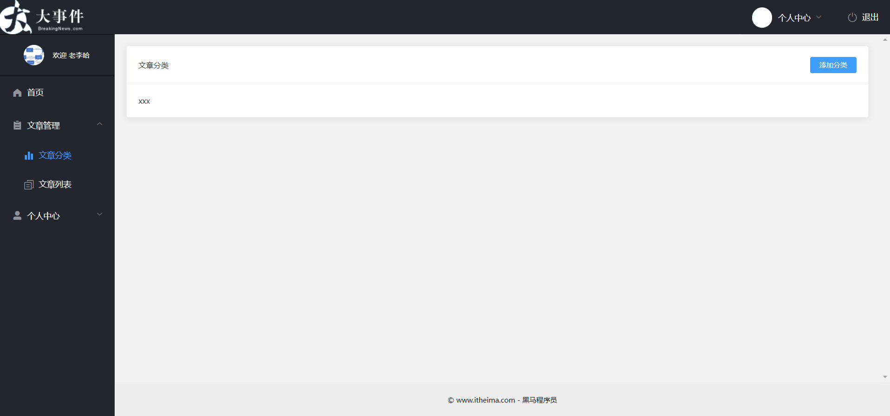
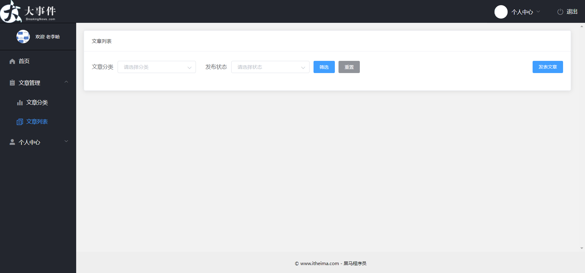

# Day03-文章分类_文章管理

## 01.文章分类-页面组件和路由

### 目标

* 完成文章分类页面的创建和路由设置




### 讲解

1. 新建 `src/views/article/artCate.vue` 组件, ==直接复制标签==

   ```vue
   <template>
     <div>
       <el-card class="box-card">
         <div slot="header" class="clearfix header-box">
           <span>文章分类</span>
           <el-button type="primary" size="mini">添加分类</el-button>
         </div>
         xxx
       </el-card>
     </div>
   </template>
   
   <script>
   export default {
     name: 'ArtCate'
   }
   </script>
   
   <style lang="less" scoped>
   .header-box {
     display: flex;
     justify-content: space-between;
     align-items: center;
   }
   </style>
   
   ```

2. 在 `src/router/index.js` 路由模块中，导入**文章分类**的路由组件，并声明对应的子路由规则：

   ```js
   {
       path: 'art-cate', // 文章分类
       component: () => import('@/views/article/artCate')
   }
   ```


### 小结

1. 为何path需要规定的值?

   <details>
   <summary>答案</summary>
   <ul>
   <li>因为要配合页面侧边栏导航切换的路径匹配, 然后显示二级路由组件</li>
   </ul>
   </details>


## 02.文章分类-铺设分类

### 目标

* 在接口文档找到请求分类数据, 并封装接口方法调用拿到数据


### 讲解

1. 在`src/api/index.js`封装获取文章分类的接口方法

   ```js
   /**
    * 获取-文章分类
    * @returns Promise对象
    */
   export const getArtCateListAPI = () => {
     return request({
       url: '/my/cate/list'
     })
   }
   ```

   

2. 在`views/article/artCate.vue`在 data 中定义文章分类的数据项

   ```js
   data() {
     return {
       // 文章的分类列表
       cateList: []
     }
   },
   ```

3. 在 methods 中定义获取文章分类数据的函数：

   ```js
   created () {
       // 获取文章分类
       this.initCateListFn()
     },
     methods: {
       // 获取文章分类
       async initCateListFn () {
         const res = await getArtCateListAPI()
         this.cateList = res.data.data
       }
     }
   ```

4. 准备表格标签, ==直接复制==

   ```vue
   <el-table style="width: 100%" border stripe>
           <el-table-column label="序号" width="100"></el-table-column>
           <el-table-column label="分类名称"></el-table-column>
           <el-table-column label="分类别名"></el-table-column>
           <el-table-column label="操作">
             <el-button type="primary" size="mini">修改</el-button>
             <el-button type="danger" size="mini">删除</el-button>
           </el-table-column>
         </el-table>
   ```

5. 根据el-table组件文档, 设置数据铺设, ==不可复制==

   ```vue
   <el-table style="width: 100%" :data="cateList" border stripe>
           <el-table-column
             label="序号"
             type="index"
             width="100"
           ></el-table-column>
           <el-table-column label="分类名称" prop="cate_name"></el-table-column>
           <el-table-column label="分类别名" prop="cate_alias"></el-table-column>
           <el-table-column label="操作">
             <el-button type="primary" size="mini">修改</el-button>
             <el-button type="danger" size="mini">删除</el-button>
           </el-table-column>
         </el-table>
   ```

   

### 小结

1. 为何res后面需要点2个data?

   <details>
   <summary>答案</summary>
   <ul>
   <li>因为res是axios返回的响应对象, 而axios把后台返回的数据藏在了data字段里, 所以第一个data为了拿到后台返回的真实数据对象, 但是后台返回的对象里有个data字段, 里面的值才是我们要的数据, 所以继续点第二个data拿到分类数据的数组</li>
   </ul>
   </details>


## 03.文章分类-添加分类-对话框组件

### 目标

* 使用对话框+表单, 来准备添加分类的标签


### 讲解

1. 查找elementUI文档, 找到和需求类似的对话框, 复制标签, 使用在`views/article/artCate.vue`在el-card隔壁下面

   ```vue
   <!-- 添加分类的对话框 -->
   <el-dialog title="添加文章分类" :visible.sync="addVisible" width="35%">
       <span>这是一段信息</span>
       <span slot="footer" class="dialog-footer">
           <el-button size="mini">取 消</el-button>
           <el-button size="mini" type="primary">添 加</el-button>
       </span>
   </el-dialog>
   ```

2. 定义addVisible变量, 默认为false(不出现)

   ```js
   data () {
       return {
         // ...其他
         addVisible: false // 添加分类-对话框是否显示
       }
   }
   ```

3. 在el-card里给按钮添加分类, 绑定点击事件, 让对话框出现

   ```vue
   <el-button type="primary" size="mini" @click="addVisible = true">添加分类</el-button>
   ```

4. 点击取消和添加, 让dialog对话框关闭

   ```vue
   <!-- 添加分类的对话框 -->
   <!-- .sync作用实现双向数据绑定
   会在运行时给所在标签绑定 @update:属性名的事件, 把接收到子组件内传来的值赋予给右侧Vue变量
   组件内$emit('update:visible', true)
   这个update: 是固定的
   -->
   <el-dialog title="添加文章分类" :visible.sync="addVisible" width="35%">
       <span>这是一段信息</span>
       <span slot="footer" class="dialog-footer">
           <el-button size="mini" @click="cancelFn">取 消</el-button>
           <el-button size="mini" type="primary" @click="addFn">添 加</el-button>
       </span>
   </el-dialog>
   
   <script>
   export default {
     // ...其他
     methods: {
       // ...其他
       // 对话框内-添加按钮-点击事件
       addFn () {
         this.addVisible = false
       },
       // 对话框内-取消按钮-点击事件
       cancelFn () {
         this.addVisible = false
       }
     }
   }
   </script>
   
   ```


### 小结

1. el-dialog是什么组件?

   <details>
   <summary>答案</summary>
   <ul>
   <li>是一个对话框组件, 其实也是一个标签, 设置visible属性值为true, 此标签出现, 平时css方式隐藏</li>
   </ul>
   </details>


## 04.文章分类-添加分类-表单

### 目标

* 掌握 el-dialog 结合 el-form 组件的
* 需求1: 在添加分类的对话框上, 添加表单并定义校验规则
* 需求2: 并在对话框关闭的时候, 重置表单


### 讲解

1. 在 `el-dialog` 中渲染**添加分类**的表单：

   ```xml
   <!-- 添加的表单 -->
   <el-form :model="addForm" :rules="addRules" ref="addRef" label-width="80px">
     <el-form-item label="分类名称" prop="cate_name">
       <el-input v-model="addForm.cate_name" minlength="1" maxlength="10"></el-input>
     </el-form-item>
     <el-form-item label="分类别名" prop="cate_alias">
       <el-input v-model="addForm.cate_alias" minlength="1" maxlength="15"></el-input>
     </el-form-item>
   </el-form>
   ```

2. 在 `data` 中声明 `addForm` 和 `addRules` 如下：

   ```js
   data() {
     return {
       // ...其他
       addForm: { // 添加表单的数据对象
           cate_name: '',
           cate_alias: ''
         },
       addRules: { // 添加表单的验证规则对象
           cate_name: [
             { required: true, message: '请输入分类名称', trigger: 'blur' },
             { pattern: /^\S{1,10}$/, message: '分类名必须是1-10位的非空字符', trigger: 'blur' }
           ],
           cate_alias: [
             { required: true, message: '请输入分类别名', trigger: 'blur' },
             { pattern: /^[a-zA-Z0-9]{1,15}$/, message: '分类别名必须是1-15位的字母数字', trigger: 'blur' }
           ]
       }
     }
   }
   ```

3. 监听对话框的 `closed` 事件

   ```vue
   <!-- 添加分类的对话框 -->
   <el-dialog title="添加文章分类" :visible.sync="addVisible" width="35%" @closed="onAddClosedFn">
   </el-dialog>
   ```

4. 定义事件处理函数如下

   ```js
   onAddClosed() {
     this.$refs.addRef.resetFields()
   }
   ```

   

### 小结

1. 如何知道el-dialog对话框关闭了?

   <details>
   <summary>答案</summary>
   <ul>
   <li>查阅文档发现, 这个组件内部, 在检测到对话框关闭, 会触发一个自定义事件叫closed, 我们只需要绑定并实现事件处理函数即可</li>
   </ul>
   </details>


## 05.文章分类-添加分类-保存

### 目标

* 调用接口, 传递分类名字和别名保存


### 讲解

1. 翻阅接口文档, 封装接口方法在`src/api/index.js`中

   ```js
   /**
    * 增加-文章分类
    * @param {*} param0 { cate_name: 文章分类名字, cate_alias: 文章分类别名 }
    * @returns Promise对象
    */
   export const addArtCateAPI = ({ cate_name, cate_alias }) => {
     return request({
       url: '/my/cate/add',
       method: 'POST',
       data: {
         cate_name,
         cate_alias
       }
     })
   }
   ```

2. 在el-dialog弹窗里面的表单, 给添加按钮的点击事件中, 编写代码, 调用接口保存并提示

   ```js
   async addFn () {
       // 表单预校验
       this.$refs.addRef.validate(async valid => {
           if (valid) {
               // 调用接口传递数据给后台
               const { data: res } = await addArtCateAPI(this.addForm)
               if (res.code !== 0) return this.$message.error('添加分类失败！')
               this.$message.success('添加分类成功！')
               // 重新请求列表数据
               this.initCateListFn()
               // 关闭对话框
               this.addVisible = false
           } else {
               return false
           }
       })
   }
   ```


### 小结

1. 添加成功后, 如何让表格数据也新增呢?

   <details>
   <summary>答案</summary>
   <ul>
   <li>因为新增接口没有返回新增的数据, 所以要重新获取下所有的</li>
   </ul>
   </details>

2. 获取所有分类后, 直接覆盖数组, 会不会导致页面重新渲染?

   <details>
   <summary>答案</summary>
   <ul>
   <li>不会, vue内部在数据变化后, 重新准备新的虚拟DOM结构, 和旧的虚拟DOM做对比, 然后只给现在真实DOM打补丁, 不会重新铺设, vue性能很高</li>
   </ul>
   </details>


## 06.文章分类-修改分类-回显

### 目标

* 修改分类和新增分类, 使用同一个el-dialog对话框


### 讲解

1. 在 `views/article/artCate.vue` , 给表格里修改按钮绑定点击事件, 传递要修改的文章分类ID

   ```vue
   <el-table-column label="操作">
       <template v-slot="scope">
           <el-button type="primary" size="mini" @click="updateFn(scope.row)">修改</el-button>
           <el-button type="danger" size="mini">删除</el-button>
       </template>
   </el-table-column>
   ```

2. 准备变量, 保存修改状态和要修改的文章分类id

   ```js
   data () {
       return {
         // ...其他
         editId: '', // 要修改的文章id
         isEdit: false // 保存编辑状态(false新增, true编辑)
       }
     }
   ```

3. 在事件方法中, 修改变量的状态

   ```js
   // 修改-按钮点击事件
   updateFn (obj) {
       this.editId = obj.id // 保存要编辑的文章分类ID
       this.isEdit = true // 设置编辑状态
       this.addVisible = true // 让对话框显示
       // 设置数据回显
       this.$nextTick(() => {
           // 先让对话框出现, 它绑定空值的对象, 才能resetFields清空用初始空值
           this.addForm.cate_name = obj.cate_name
           this.addForm.cate_alias = obj.cate_alias
       })
   }
   ```

4. 在到最上面, 添加分类按钮, 绑定点击事件方法, 修改相应变量的状态

   ```vue
   <el-button type="primary" size="mini" @click="addCateBtnFn">添加分类</el-button>
   ```

   ```js
   // 添加分类->点击出对话框
   addCateBtnFn () {
       this.addVisible = true // 让对话框出现
       this.editId = '' // 编辑的文章分类id设置无
       this.isEdit = false // 编辑的状态关闭
   }
   ```

5. 设置el-dialog的标题

   ```vue
   <el-dialog :title="isEdit ? '编辑文章分类' : '添加文章分类'" :visible.sync="addVisible" width="35%" @closed="onAddClosedFn">
   ```

   

### 小结

1. 如何做数据回显?

   <details>
   <summary>答案</summary>
   <ul>
   <li>点击修改时, 传递对应行的数据对象, 赋予回到表单v-model对象的属性上</li>
   </ul>
   </details>

2. 用同一个对话框, 如何区分是编辑还是新增?

   <details>
   <summary>答案</summary>
   <ul>
   <li>点击修改按钮, 保存isEdit状态为true, 点击新增让对话框出现的时候, 让isEdit状态为false</li>
   </ul>
   </details>


## 07.文章分类-修改分类-提交

### 目标

* 定义接口方法, 传递修改分类的数据保存到后台


### 讲解

1. 查阅接口文档, 定义接口方法

   ```js
   /**
    * 更新-文章分类
    * @param {*} param0 { id: 文章分类id, cate_name: 文章分类名字, cate_alias: 文章分类别名 }
    * @returns Promise对象
    */
   export const updateArtCateAPI = ({ id, cate_name, cate_alias }) => {
     return request({
       url: '/my/cate/info',
       method: 'PUT',
       data: {
         id,
         cate_name,
         cate_alias
       }
     })
   }
   ```

2. 在el-dialog中的表单的点击确定的方法中, 做判断, 调用不同的接口实现功能

   > 注意, 更新的时候, 需要携带文章分类的id值过去

   ```js
   // 对话框内-添加按钮-点击事件
       async addFn () {
         // 表单预校验
         this.$refs.addRef.validate(async valid => {
           if (valid) {
             // 判断当前是新增还是编辑
             if (this.isEdit) {
               // 编辑状态
               // 调用接口传递数据给后台
               const { data: res } = await updateArtCateAPI({ id: this.editId, ...this.addForm })
               if (res.code !== 0) return this.$message.error('更新分类失败！')
               this.$message.success('更新分类成功！')
             } else {
               // 新增
               // 调用接口传递数据给后台
               const { data: res } = await addArtCateAPI(this.addForm)
               if (res.code !== 0) return this.$message.error('添加分类失败！')
               this.$message.success('添加分类成功！')
             }
   
             // 重新请求列表数据
             this.initCateListFn()
             // 关闭对话框
             this.addVisible = false
           } else {
             return false
           }
         })
       }
   ```

   

### 小结

1. 修改分类如何区分是新增还是编辑?

   <details>
   <summary>答案</summary>
   <ul>
   <li>用前面点击按钮保存的isEdit变量来做判断区分</li>
   </ul>
   </details>


## 08.文章分类-删除分类

### 目标

* 实现点击删除分类的功能


### 讲解

1. 根据接口文档, 定义删除文章分类的接口方法

   ```js
   /**
    * 删除-文章分类
    * @param {*} id 要删除的-文章分类id
    * @returns Promise对象
    */
   export const delArtCateAPI = (id) => {
     return request({
       url: '/my/cate/del',
       method: 'DELETE',
       params: {
         id
       }
     })
   }
   ```

   

2. 为删除按钮绑定点击事件处理函数

   ```xml
   <el-button type="danger" size="mini" @click="removeFn(scope.row.id)">删除</el-button>
   ```

3. 定义 `removeFn` 函数

   ```js
   // 删除-文章分类
   async removeFn (id) {
       const { data: res } = await delArtCateAPI(id)
       if (res.code !== 0) return this.$message.error('删除分类失败！')
       this.$message.success('删除分类成功！')
       // 重新请求列表数据
       this.initCateListFn()
   }
   ```


### 小结

1. 删除分类传参的方式在哪里传递?

   <details>
   <summary>答案</summary>
   <ul>
   <li>在query查询字符串上传参给后端</li>
   </ul>
   </details>


## 09.发布文章-页面组件和路由

### 目标

* 准备发表文章的页面组件并配置路由显示




### 讲解

1. 在 `src/views/article/artList.vue` 组件, ==直接复制标签==

   ```vue
   <template>
     <div>
       <el-card class="box-card">
         <div slot="header" class="clearfix">
           <span>文章列表</span>
         </div>
         <!-- 搜索区域 -->
         <div class="search-box">
           <el-form :inline="true" :model="q">
             <el-form-item label="文章分类">
               <el-select v-model="q.cate_id" placeholder="请选择分类" size="small">
                 <el-option label="区域一" value="shanghai"></el-option>
                 <el-option label="区域二" value="beijing"></el-option>
               </el-select>
             </el-form-item>
             <el-form-item label="发布状态" style="margin-left: 15px;">
               <el-select v-model="q.state" placeholder="请选择状态" size="small">
                 <el-option label="已发布" value="已发布"></el-option>
                 <el-option label="草稿" value="草稿"></el-option>
               </el-select>
             </el-form-item>
             <el-form-item>
               <el-button type="primary" size="small">筛选</el-button>
               <el-button type="info" size="small">重置</el-button>
             </el-form-item>
           </el-form>
           <!-- 发表文章的按钮 -->
           <el-button type="primary" size="small" class="btn-pub">发表文章</el-button>
         </div>
   
         <!-- 文章表格区域 -->
   
         <!-- 分页区域 -->
       </el-card>
     </div>
   </template>
   
   <script>
   export default {
     name: 'ArtList',
     data() {
       return {
         // 查询参数对象
         q: {
           pagenum: 1,
           pagesize: 2,
           cate_id: '',
           state: ''
         }
       }
     }
   }
   </script>
   
   <style lang="less" scoped>
   .search-box {
     display: flex;
     justify-content: space-between;
     align-items: flex-start;
     .btn-pub {
       margin-top: 5px;
     }
   }
   </style>
   
   ```

2. 在 `src/router/index.js` 路由模块中，导入并组件并声明路由规则如下

   ```js
   {
       path: 'art-list', // 文章列表
       component: () => import('@/views/article/artList')
   }
   ```


### 小结

1. 如何让el-form的几个表单域在同一行显示?

   <details>
   <summary>答案</summary>
   <ul>
   <li>在el-form身上有个inline属性设置为true即可</li>
   </ul>
   </details>


## 10.发表文章-对话框组件

### 目标

* 准备发表文章的对话框组件


### 讲解

1. 在 `artList.vue` 组件中，声明发表文章的对话框

   ```xml
   <!-- 发表文章的 Dialog 对话框 -->
   <el-dialog title="发表文章" :visible.sync="pubDialogVisible" fullscreen :before-close="handleClose">
     <span>这是一段信息</span>
   </el-dialog>
   ```

2. 在 data 中定义布尔值 `pubDialogVisible`，用来控制对话框的显示与隐藏

   ```js
   data() {
     return {
       // ...其他
       pubDialogVisible: false // 控制发表文章对话框的显示与隐藏
     }
   }
   ```

3. 点击发布按钮，展示对话框

   ```xml
   <!-- 发表文章的按钮 -->
   <el-button type="primary" size="small" class="btn-pub" @click="showPubDialogFn">发表文章</el-button>
   ```


4. 定义事件处理函数如下

   ```js
   methods: {
       // 发表文章按钮->点击事件->让添加文章对话框出现
       showPubDialogFn () {
           this.pubDialogVisible = true
       }
   }
   ```

   

5. 在对话框**将要关闭**时，询问用户是否确认关闭对话框

   ```js
   
   // 对话框关闭前的回调
   async handleClose (done) {
       // 询问用户是否确认关闭对话框
       const confirmResult = await this.$confirm('此操作将导致文章信息丢失, 是否继续?', '提示', {
           confirmButtonText: '确定',
           cancelButtonText: '取消',
           type: 'warning'
       }).catch(err => err)
   
       // 取消了关闭-阻止住, 什么都不干
       if (confirmResult === 'cancel') return
       // 确认关闭
       done()
   }
   ```

   

### 小结

1. this.$confirm的返回值是Promise对象, 如何提取成功结果?

   <details>
   <summary>答案</summary>
   <ul>
   <li>除了.then还可以用await等待并提取, 成功后才会继续往下走(也就是用户选择了确定操作)</li>
   </ul>
   </details>

2. await后面的catch又是怎么回事?

   <details>
   <summary>答案</summary>
   <ul>
   <li>接收上个Promise对象失败的结果, 默认return的err, 会返回给await提取结果(err), 然后confirmResult的值就是'cancel'了, 所以这次Promise对象失败了也会往下执行了, 所以下面做判断</li>
   </ul>
   </details>


## 11.发表文章-对话框内表单

### 目标

* 准备好, 对话框内,发表文章用的表单, 以及数据绑定和规则对象
* 并渲染文章分类下拉菜单数据


### 讲解

1. 初步定义表单的 UI 结构

   ```xml
   <!-- 发布文章的对话框 -->
   <el-form :model="pubForm" :rules="pubFormRules" ref="pubFormRef" label-width="100px">
     <el-form-item label="文章标题" prop="title">
       <el-input v-model="pubForm.title" placeholder="请输入标题"></el-input>
     </el-form-item>
     <el-form-item label="文章分类" prop="cate_id">
       <el-select v-model="pubForm.cate_id" placeholder="请选择分类" style="width: 100%;">
         <el-option label="区域一" value="shanghai"></el-option>
         <el-option label="区域二" value="beijing"></el-option>
       </el-select>
     </el-form-item>
   </el-form>
   ```

2. 在 data 中定义数据对象和验证规则对象：

   ```js
   data() {
     return {
       // ...其他
       pubForm: { // 表单的数据对象
         title: '',
         cate_id: ''
       },
       pubFormRules: { // 表单的验证规则对象
         title: [
           { required: true, message: '请输入文章标题', trigger: 'blur' },
           { min: 1, max: 30, message: '文章标题的长度为1-30个字符', trigger: 'blur' }
         ],
         cate_id: [{ required: true, message: '请选择文章标题', trigger: 'blur' }]
       }
     }
   }
   ```

3. 在 methods 中，声明初始化文章分类列表数据的方法

   ```js
   // 初始化文章分类的列表数据
   async initCateList() {
     const { data: res } = await this.$http.get('/my/cate/list')
     if (res.code === 0) {
       this.cateList = res.data
     }
   }
   ```

4. 在 data 中声明 `cateList` 数组

   ```js
   data() {
     return {
       // ...其他
       cateList: [] // 文章分类
     }
   }
   ```

5. 在 created 生命周期函数中，调用步骤1声明的方法

   ```js
   created() {
     this.initCateList()
   },
   ```

6. 循环渲染文章分类的可选项

   ```vue
   <el-form-item label="文章分类" prop="cate_id">
     <el-select v-model="pubForm.cate_id" placeholder="请选择分类" style="width: 100%;">
       <!-- 循环渲染分类的可选项 -->
       <el-option :label="item.cate_name" :value="item.id" v-for="item in cateList" :key="item.id">
       </el-option>
     </el-select>
   </el-form-item>
   ```

   

### 小结

1. 分类数据的下拉菜单, 铺设的思路是什么?

   <details>
   <summary>答案</summary>
   <ul>
   <li>用接口方法把数据拿回来, 赋予到vue变量上, 然后在组件上循环, 再根据elementUI组件的文档, 设置到相应的属性上即可</li>
   </ul>
   </details>


## 12.发表文章-富文本

### 目标

* 准备富文本编辑器

  > 富文本: 就是可以带标签和样式的字符串, 一般用于设置一个产品/文章的主体内容


### 讲解

> 基于 vue-quill-editor 实现富文本编辑器：https://www.npmjs.com/package/vue-quill-editor

1. 运行如下的命令，在项目中安装富文本编辑器： 

   ```bash
   yarn add vue-quill-editor
   ```

2. 在项目入口文件 `main.js` 中导入并全局注册富文本编辑器

   > 当然, 你也可以单独封装模块写这些代码后, 引入到main.js即可

   ```js
   // 导入富文本编辑器
   import VueQuillEditor from 'vue-quill-editor'
   // 导入富文本编辑器的样式
   import 'quill/dist/quill.core.css'
   import 'quill/dist/quill.snow.css'
   import 'quill/dist/quill.bubble.css'
   
   // 全局注册富文本编辑器
   Vue.use(VueQuillEditor)
   ```

3. 在 `views/article/artList.vue` 组件的 data 中，定义富文本编辑器对应的数据项, 也绑定到表单的数据对象属性中

   ```js
   data() {
     return {
       // ...其他
       // 表单的数据对象
       pubForm: {
         title: '',
         cate_id: '',
   +     content: '' // 文章的内容
       },
       // ...其他
     }
   }
   ```

4. 在 `artList.vue` 组件的模板结构中，添加富文本编辑器的 DOM 结构, 给el-form内新增一块表单域

   ```xml
   <el-form-item label="文章内容">
     <!-- 使用 v-model 进行双向的数据绑定 -->
     <quill-editor v-model="pubForm.content"></quill-editor>
   </el-form-item>
   ```

5. 美化富文本编辑器的样式：

   ```less
   // 设置富文本编辑器的默认最小高度
   // ::v-deep作用: 穿透选择, 正常style上加了scope的话, 会给.ql-editor[data-v-hash]属性, 只能选择当前页面标签或者组件的根标签
   // 如果想要选择组件内的标签(那些标签没有data-v-hash值)所以正常选择选不中, 加了::v-deep空格前置的话, 选择器就会变成如下形式
   // [data-v-hash] .ql-editor 这样就能选中组件内的标签的class类名了
   ::v-deep .ql-editor {
     min-height: 300px;
   }
   ```

6. 再给文章内容部分, 绑定el-form的表单校验, 在el-form-item加上同名的prop属性

   ```vue
   <el-form-item label="文章内容" prop="content">
       <!-- 使用 v-model 进行双向的数据绑定 -->
       <quill-editor v-model="pubForm.content"></quill-editor>
   </el-form-item>
   ```

7. 在rules对应的规则对象中, 添加校验规则

   ```js
   content: [
       { required: true, message: '请输入文章内容', trigger: 'blur' }
   ]
   ```

   


### 小结

1. 什么是富文本?

   <details>
   <summary>答案</summary>
   <ul>
   <li>带内容和样式的标签字符串, 一般用于自带排版布局的内容的, 例如文章详情, 商品详情</li>
   </ul>
   </details>

2. ::v-deep 有什么用?

   <details>
   <summary>答案</summary>
   <ul>
   <li>style开启scoped属性, 选择器只能选择当前页面标签, 因为会在标签加data-v-hash属性, 然后给css选择器加上属性选择器, 但是只会给当前页面标签加data-v-hash值属性和组件的根标签加, 如果你想要选择组件内的原生标签用选择器, 则需要webpack再转换你选择器的样式的时候, 把data-v-hash属性选择器加在前面就用::v-deep标记下</li>
   </ul>
   </details>


## 13.发表文章-封面标签

### 目标

* 渲染文章封面区域标签
* 实现用户选择封面功能, 拿到用户选择的图片文件


### 讲解

1. 在 `artList.vue` 组件的模板结构中，添加文章封面对应的 DOM 结构：

   ```xml
   <el-form-item label="文章封面">
     <!-- 用来显示封面的图片 -->
     
     <br />
     <!-- 文件选择框，默认被隐藏 -->
     <input type="file" style="display: none;" accept="image/*" ref="iptFileRef" />
     <!-- 选择封面的按钮 -->
     <el-button type="text">+ 选择封面</el-button>
   </el-form-item>
   ```

2. 美化封面图片的样式：

   ```less
   // 设置图片封面的宽高
   .cover-img {
     width: 400px;
     height: 280px;
     object-fit: cover;
   }
   ```

3. 为**选择封面**的按钮绑定点击事件处理函数

   ```vue
   <!-- 选择封面的按钮 -->
   <el-button type="text" @click="chooseImgFn">+ 选择封面</el-button>
   ```

4. 模拟**文件选择框**的点击事件

   ```js
   chooseImgFn() {
     this.$refs.iptFileRef.click()
   }
   ```

5. 监听**文件选择框**的 **change** 事件

   ```vue
   <!-- 文件选择框，默认被隐藏 -->
   <input type="file" style="display: none;" ref="iptFile" accept="image/*" @change="onCoverChangeFn" />
   ```

6. 定义 **onCoverChange** 处理函数如下

   ```js
   // 封面选择改变的事件
   onCoverChangeFn (e) {
       // 获取用户选择的文件列表
       const files = e.target.files
       if (files.length === 0) {
           // 用户没有选择封面
           this.pubForm.cover_img = null
       } else {
           // 用户选择了封面
           this.pubForm.cover_img = files[0]
       }
   }
   ```

7. 在 data 中的 `pubForm` 对象上，声明 `cover_img` 属性，用来存储用户选择的封面

   ```js
   data() {
     return {
       // 表单的数据对象
       pubForm: {
         title: '',
         cate_id: '',
         content: '',
   +     cover_img: null // 用户选择的封面图片（null 表示没有选择任何封面）
       },
     }
   }
   ```

   

### 小结

1. 封面标签选择图片的思路是?

   <details>
   <summary>答案</summary>
   <ul>
   <li>先准备隐藏的input[type=file], 然后点击按钮, 用js的方式调用input标签的点击事件, 让文件选择窗口出现, 再给input标签绑定change事件通过事件对象拿到用户选择的图片文件</li>
   </ul>
   </details>


## 14.发表文章-封面图片

### 目标

* 给封面图片标签做预览效果
* 如果用户未选择图片, 给一张默认图片


### 讲解

1. 在 `artList.vue` 组件中，导入默认的封面图片

   ```js
   // 导入默认的封面图片
   import defaultImg from '@/assets/images/cover.jpg'
   ```

2. 在文件选择框的 `change` 事件处理函数中，根据用户是否选择了封面，动态设置封面图片的 src 地址：

   ```js
   // 监听文件选择框的 change 事件
   onCoverChange(e) {
     // 获取到用户选择的封面
     const files = e.target.files
     if (files.length === 0) {
       // 用户没有选择封面
       this.pubForm.cover_img = null
   +   this.$refs.imgRef.setAttribute('src', defaultImg)
     } else {
       // 用户选择了封面
       this.pubForm.cover_img = files[0]
   +   const url = URL.createObjectURL(files[0])
   +   this.$refs.imgRef.setAttribute('src', url)
     }
   }
   ```


### 小结

1. 为何设置默认图片, 要采用获取DOM的方式?

   <details>
   <summary>答案</summary>
   <ul>
   <li>因为只是做预览, 直接给src设置属性的值, 而cover_img属性的值是图片文件, 后续要传递给后台的, 而src路径只能设置临时地址/base64字符串, 当然了你也可以再定义个预览图片的变量, 保存值后在img标签上使用</li>
   </ul>
   </details>


## 15.发表文章-状态

### 目标

* 设置发布文章状态的表单


### 讲解

1. 在 data 中的 pubForm 对象上，定义 `state` 属性，用来存储文章的发布状态

   ```js
   data() {
     return {
       // 表单的数据对象
       pubForm: {
         title: '',
         cate_id: '',
         content: '',
         cover_img: null,
   +     state: '' // 文章的发布状态，可选值有两个：草稿、已发布
       },
     }
   }
   ```
   
2. 在el-form最后, 再准备**发布**和**存为草稿**按钮，并绑定点击事件处理函数

   ```xml
   <el-form-item>
       <el-button type="primary" @click="pubArticleFn('已发布')">发布</el-button>
       <el-button type="info" @click="pubArticleFn('草稿')">存为草稿</el-button>
   </el-form-item>
   ```

3. 在 methods 中声明 `pubArticle` 处理函数如下

   ```js
   // 发布文章或草稿-按钮点击事件
   pubArticleFn (state) {
       // 1. 设置发布状态
       this.pubForm.state = state
       // 2. 表单预校验
       this.$refs.pubFormRef.validate(valid => {
           if (!valid) return this.$message.error('请完善文章信息！')
           // 3. 判断是否提供了文章封面
           if (!this.pubForm.cover_img) return this.$message.error('请选择文章封面！')
           // 4. TODO：发布文章
           console.log(this.pubForm)
       })
   }
   ```

4. 在对话框完全关闭之后，清空表单的关键数据：

   ```xml
   <!-- 发表文章的 Dialog 对话框 -->
   <el-dialog
     title="发表文章"
     :visible.sync="pubDialogVisible"
     fullscreen
     :before-close="handleClose"
     @closed="onDialogClosedFn"
   >
     <!-- 省略其它代码 -->
   </el-dialog>
   ```

5. 在 methods 中声明 `onDialogClosed` 函数如下：

   ```js
   // 对话框完全关闭之后的处理函数
   onDialogClosedFn () {
       // 清空关键数据
       this.$refs.pubFormRef.resetFields()
       // 因为这2个变量对应的标签不是表单绑定的, 所以需要单独控制
       this.pubForm.content = ''
       this.$refs.imgRef.setAttribute('src', defaultImg)
   }
   ```


### 小结

1. 为何重置表单的时候, 有2个需要单独重置?

   <details>
   <summary>答案</summary>
   <ul>
   <li>因为这2个标签不是在表单标签的范围, 而且图片预览的src属性也不是表单数据对象的属性, 所以需要单独设置</li>
   </ul>
   </details>


## 16.发表文章-完成功能

### 目标

* 把前面准备好的数据对象, 调用接口保存在后台


### 讲解

1. 查看接口文档, 封装发布文章的接口方法

   ```js
   /**
    * 发布文章
    * @param {*} fd 表单对象
    * @returns Promise对象
    */
   export const uploadArticleAPI = (fd) => {
     return request({
       url: '/my/article/add',
       method: 'POST',
       data: fd // 参数要的是表单对象, 不能写普通对象, axios内部会判断, 如果是表单对象, 传递的请求体会设置Content-Type: form-data与后端对应
     })
   }
   ```
   
   
   
2. 在发布/存草稿按钮, 点击事件中调用接口, 组织好参数传递

   ```js
   // 创建 FormData 对象
   const fd = new FormData()
   
   // 向 FormData 中追加数据
   Object.keys(this.pubForm).forEach((key) => {
       fd.append(key, this.pubForm[key])
   })
   
   // 发起请求
   const { data: res } = await uploadArticleAPI(fd)
   if (res.code !== 0) return this.$message.error('发布文章失败！')
   this.$message.success('发布文章成功！')
   
   // 关闭对话框
   this.pubDialogVisible = false
   // TODO：刷新文章列表数据
   ```


### 小结

1. 为何我们要传表单对象给后台?

   <details>
   <summary>答案</summary>
   <ul>
   <li>参数以什么方式, 什么内容的格式, 参数名和值的类型都要和后端对应上, 因为你传递给后端后, 它可能会做参数名和类型校验, 而且他要使用的值类型不对可能会给你响应报错</li>
   </ul>
   </details>


