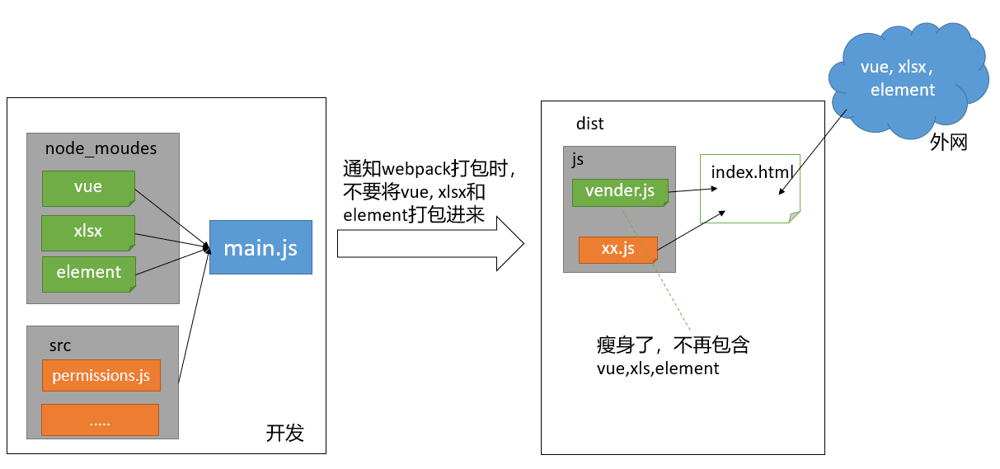

# Day04-文章列表

## 01.文章列表-渲染数据

### 目标

* 把文章列表数据请求回来, 铺设到页面上


### 讲解

1. 根据接口文档, 封装接口方法

   ```js
   /**
    * 获取文章列表
    * @param {*} param0 { pagenum: 当前页码数, pagesize: 当前页条数, cate_id: 文章分类id, state: 文章状态 }
    * @returns Promise对象
    */
   export const getArticleListAPI = ({ pagenum, pagesize, cate_id, state }) => {
     return request({
       url: '/my/article/list',
       params: {
         pagenum,
         pagesize,
         cate_id,
         state
       }
     })
   }
   ```

   

2. 在 data 中定义如下的数据

   ```js
   data() {
     return {
       // ...其他
       artList: [], // 文章的列表数据
       total: 0 // 总数据条数
     }
   }
   ```

3. 在 methods 中声明 `initArtList` 函数，请求文章的列表数据：

   ```js
   // 初始化文章列表
   async initArtListFn () {
       const { data: res } = await getArticleListAPI(this.q)
   
       if (res.code !== 0) return this.$message.error('获取文章列表失败!')
       this.artList = res.data
       this.total = res.total
   }
   ```

4. 在 created 中调用步骤2封装的函数：

   ```js
   created() {
      // ...其他
      // 获取-文章列表
     this.initArtListFn()
   },
   ```

5. 在模板结构中，通过 el-table 组件渲染文章的表格数据：

   ```xml
   <!-- 文章表格区域 -->
   <el-table :data="artList" style="width: 100%;" border stripe>
     <el-table-column label="文章标题" prop="title"></el-table-column>
     <el-table-column label="分类" prop="cate_name"></el-table-column>
     <el-table-column label="发表时间" prop="pub_date"></el-table-column>
     <el-table-column label="状态" prop="state"></el-table-column>
     <el-table-column label="操作"></el-table-column>
   </el-table>
   ```

6. 在发表文章成功后，调用步骤2封装的 `initArtList` 函数：

   ```js
   // 发起请求，发布文章
   async postArticle() {
     // 创建 FormData 对象
     const fd = new FormData()
     // 向 FormData 中追加数据
     Object.keys(this.pubForm).forEach(key => {
       fd.append(key, this.pubForm[key])
     })
     // 发起请求
     const { data: res } = await this.$http.post('/my/article/add', fd)
     if (res.code !== 0) return this.$message.error('发布文章失败！')
     this.$message.success('发布文章成功！')
     // 关闭对话框
     this.pubDialogVisible = false
     // TODO：刷新文章列表数据
   + this.initArtListFn()
   },
   ```


### 小结

1. 文章列表的接口里, 为何需要传这么多的参数?

   <details>
   <summary>答案</summary>
   <ul>
   <li>因为我们文章列表的筛选条件有几个, 就需要传递多少个参数, 后端根据参数在后端筛选后, 返回不同的数据</li>
   </ul>
   </details>


## 02.文章列表-格式化时间

### 目标

* 把表格里的时间格式化成YYYY-MM-DD HH:mm:ss格式


### 讲解

1. 安装格式化时间的第三方包 `dayjs`

   ```bash
   yarn add dayjs
   ```

2. 在项目入口文件 main.js 中导入并使用 dayjs，定义全局属性, 对应函数

   > 其实也可以在具体定义methods, 也可以定义模块封装导出, 使用的地方引入, 各有各的好处
   >
   > 但是建议公共的工具方法可以挂载到Vue原型上, 组件内直接this.调用访问

   ```js
   // 导入dayjs方法
   import dayjs from 'dayjs'
   
   // 定义时间格式化函数
   Vue.prototype.$formatDate = (dateObj) => {
     return dayjs(dateObj).format('YYYY-MM-DD HH:mm:ss')
   }
   ```

3. 在 `artList.vue` 组件中，调用全局属性的方法, 对时间进行格式化：

   ```xml
   <el-table-column label="发表时间" prop="pub_date">
       <template v-slot="{ row }">
           <span>{{ $formatDate(row.pub_date) }}</span>
       </template>
   </el-table-column>
   ```


### 小结

1. 如何给Vue添加一个全局属性?

   <details>
   <summary>答案</summary>
   <ul>
   <li>在Vue.prototype原型链上挂载方法, 任意组件对象都可以调用</li>
   </ul>
   </details>


## 03.文章列表-实现分页功能

### 目标

* 使用ElementUI的Pagination组件实现分页功能


### 讲解

1. 在 `artList.vue` 组件中使用 `el-pagination` 组件

   ```xml
   <!-- 分页区域 -->
   <el-pagination
     @size-change="handleSizeChangeFn"
     @current-change="handleCurrentChangeFn"
     :current-page.sync="q.pagenum"
     :page-sizes="[2, 3, 5, 10]"
     :page-size.sync="q.pagesize"
     layout="total, sizes, prev, pager, next, jumper"
     :total="total"
   >
   </el-pagination>
   ```

2. 美化样式：

   ```less
   .el-pagination {
     margin-top: 15px;
   }
   ```

3. 声明 `handleSizeChangeFn` 函数，监听 pageSize 的变化：

   ```js
   // pageSize 发生了变化
   handleSizeChangeFn (newSize) {
       // 为 pagesize 赋值
       this.q.pagesize = newSize
       // 默认展示第一页数据
       this.q.pagenum = 1
       // 重新发起请求
       this.initArtListFn()
   }
   ```

4. 声明 `handleCurrentChangeFn` 函数，监听页码值的变化：

   ```js
   // 页码值发生了变化
   handleCurrentChangeFn(newPage) {
     // 为页码值赋值
     this.q.pagenum = newPage
     // 重新发起请求
     this.initArtListFn()
   }
   ```


### 小结

1. 分页切换数据列表是如何实现的?

   <details>
   <summary>答案</summary>
   <ul>
   <li>检测Pagination组件的事件, 拿到当前页/每页显示条数, 绑定到参数对象上, 然后调用接口传参给后台</li>
   </ul>
   </details>


## 04.文章列表-实现筛选功能

### 目标

* 实现筛选条件切换, 搜索结果更换的效果


### 讲解

1. 动态为筛选表单中的**文章分类**下拉菜单，渲染可选项列表

   ```xml
   <el-form-item label="文章分类">
     <el-select v-model="q.cate_id" placeholder="请选择分类" size="small">
       <!-- 循环渲染可选项 -->
       <el-option v-for="item in cateList" :key="item.id" :label="item.cate_name" :value="item.id">
       </el-option>
     </el-select>
   </el-form-item>
   ```

2. 当用户点击**筛选按钮**时，调用 `initArtList` 函数重新发起数据请求：

   ```xml
   <el-button type="primary" size="small" @click="initArtListFn">筛选</el-button>
   ```

3. 当用户点击**重置按钮**时，调用 `resetList` 函数：

   ```xml
   <el-button type="info" size="small" @click="resetListFn">重置</el-button>
   ```

4. 声明 `resetList` 函数如下：

   ```js
   // 重置文章的列表数据
   resetListFn() {
     // 1. 重置查询参数对象
     this.q = {
       pagenum: 1,
       pagesize: 2,
       cate_id: '',
       state: ''
     }
     // 2. 重新发起请求
     this.initArtListFn()
   }
   ```

5. 在发布后, 替换调用重置条件方法

   ```js
   // TODO：刷新文章列表数据
   this.resetListFn()
   ```

   

### 小结

1. 筛选功能如何实现的?

   <details>
   <summary>答案</summary>
   <ul>
   <li>根据选择的值绑定到查询参数对象q的属性里, 点击筛选按钮, 把q参数和值传给后台, 让后台返回响应筛选后的内容</li>
   </ul>
   </details>


## 05.文章列表-请求文章详情

### 目标

* 点击文章标题, 获取文章详情的数据


### 讲解

1. 在`api/index.js`中, 封装接口方法

   ```js
   /**
    * 获取-文章详情
    * @param {*} id 文章id
    * @returns Promise对象
    */
   export const getArticleDetailFn = (id) => {
     return request({
       url: '/my/article/info',
       params: {
         id
       }
     })
   }
   ```

   

2. 在表格中，修改文章标题的展示方式

   ```xml
   <el-table-column label="文章标题">
     <template v-slot="{ row }">
       <el-link type="primary" @click="showDetailFn(row.id)">{{ row.title }}</el-link>
     </template>
   </el-table-column>
   ```

3. 在 methods 中定义 `showDetailFn` 函数：

   ```js
   // 获取文章详情
   async showDetailFn (id) {
       const { data: res } = await getArticleDetailAPI(id)
       if (res.code !== 0) return this.$message.error('获取文章详情失败!')
       this.artDetail = res.data
       // 展示对话框
       this.detailVisible = true
   }
   ```

4. 在 data 中定义 `detailVisible` 和 `artDetail` 

   > 注意, 这里查看文章详情用的不是发布文章的dialog

   ```js
   data() {
     return {
       detailVisible: false, // 控制文章详情对话框的显示与隐藏
       artDetail: {} // 文章的详情信息对象
     }
   }
   ```

5. 在 `artList.vue` 组件中，声明查看文章详情的对话框：

   ```xml
   <!-- 查看文章详情的对话框 -->
   <el-dialog title="文章预览" :visible.sync="detailVisible" width="80%">
     <span>这是一段信息</span>
   </el-dialog>
   ```


### 小结

1. 请求文章详情的思路是什么?

   <details>
   <summary>答案</summary>
   <ul>
   <li>点击名字关联传递文章id, 把id传递给后台, 拿到返回的文章详情</li>
   </ul>
   </details>


## 06.文章列表-渲染文章详情

### 目标

* 把文章详情的数据, 渲染在对话框页面上


### 讲解

1. 在`utils/request.js`里导出基地址

   ```js
   export const baseURL = 'http://big-event-vue-api-t.itheima.net'
   const myAxios = axios.create({
     baseURL
   })
   
   ```
   
   
   
2. 在`artList.vue`里, 引入baseURL基地址

   > 因为后台返回的图片地址只有后半段, 需要自己拼接前缀服务器地址, 也就是基地址

   ```js
   import { baseURL } from '@/utils/request'
   export default {
     name: 'ArtList',
     data () {
       return {
         // ...其他
         baseURL // 基地址
       }
     }
   }
   ```

   

3. 渲染文章详情到标签上, ==可以直接复制==

   ```vue
   <!-- 查看文章详情的对话框 -->
   <el-dialog title="文章预览" :visible.sync="detailVisible" width="80%">
     <h1 class="title">{{ artDetail.title }}</h1>
   
     <div class="info">
       <span>作者：{{ artDetail.nickname || artDetail.username }}</span>
       <span>发布时间：{{ $formatDate(artDetail.pub_date) }}</span>
       <span>所属分类：{{ artDetail.cate_name }}</span>
       <span>状态：{{ artDetail.state }}</span>
     </div>
   	
     <!-- 分割线 -->
     <el-divider></el-divider>
     
     <!-- 文章的封面 -->
     
   
     <!-- 文章的详情 -->
     <div v-html="artDetail.content" class="detail-box"></div>
   </el-dialog>
   ```

   

4. 美化 UI 结构

   ```less
   .title {
     font-size: 24px;
     text-align: center;
     font-weight: normal;
     color: #000;
     margin: 0 0 10px 0;
   }
   
   .info {
     font-size: 12px;
     span {
       margin-right: 20px;
     }
   }
   
   // 修改 dialog 内部元素的样式，需要添加样式穿透
   ::v-deep .detail-box {
     img {
       width: 500px;
     }
   }
   ```

   

### 小结

1. 为何在request里把baseURL导出?

   <details>
   <summary>答案</summary>
   <ul>
   <li>因为后台图片所在的服务器地址就是接口所在的服务器地址, 同一个, 然后为了方便统一修改</li>
   </ul>
   </details>


## 07.文章列表-删除文章

### 目标

* 点击文章后面删除按钮, 删除此文章


### 讲解

1. 修改表格中的操作列的渲染方式

   ```xml
   <el-table-column label="操作">
     <template v-slot="{ row }">
       <el-button type="danger" size="mini" @click="removeFn(row.id)">删除</el-button>
     </template>
   </el-table-column>
   ```

2. 在 methods 中定义 `removeFn` 函数：

   ```js
   // 文章-删除
   async removeFn (id) {
       // 1. 询问用户是否要删除
       const confirmResult = await this.$confirm('此操作将永久删除该文件, 是否继续?', '提示', {
           confirmButtonText: '确定',
           cancelButtonText: '取消',
           type: 'warning'
       }).catch(err => err)
   
       // 2. 取消了删除
       if (confirmResult === 'cancel') return
   
       // 执行删除的操作
       const { data: res } = await delArticleAPI(id)
   
       if (res.code !== 0) return this.$message.error('删除失败!')
       this.$message.success('删除成功!')
       // 刷新列表数据
       this.resetListFn()
   }
   ```


### 小结

1. 删除文章的思路是什么?

   <details>
   <summary>答案</summary>
   <ul>
   <li>点击删除按钮获取对应行对象的id, 把id传递给后台删除, 然后重新请求第一页的列表数据</li>
   </ul>
   </details>


## 08.打包发布-概念介绍

### 目标

* 前端资源打包在每个项目中都会有涉及，每位开发者都希望打包是用最少的时间构建出最小的代码，这不仅能提高团队中的效率，也能提高页面的访问性能


### 讲解

项目开发完成之后的打包，需要使用 webpack 做打包，

打包后将项目中的`.html`、 `.vue`、`.scss`、`.js`  等素材打包成 `.html` 、 `.js` 、`.css`


### 小结

1. webpack的作用是什么?

   <details>     
   <summary>答案</summary> 
   <ul>
   <li>我们可以把文件打包成模块, 压缩, 整合, 提高加载速度</li>
   </ul> 
   </details>


## 09.打包发布-publicPath

### 目标

* 介绍publicPath的作用


### 讲解

1. 不使用publicPath, 打包的项目必须保证dist的内容在服务器的根目录

2. 使用publicPath可以影响index.html引入其他打包后的资源的前缀相对路径

3. 在vue.config.js中添加

   ```js
    publicPath: process.env.NODE_ENV === 'development' ? '/' : './'
   ```

   

### 小结

1. publicPath这个固定配置项的作用?

   <details>     
   <summary>答案</summary> 
   <ul>
   <li> 可以影响打包时index.html引入其他资源的相对路径</li>
   </ul> 
   </details>


## 10.打包发布-减少包体积-整体分析

### 目标

了解如何减少包体积的思路 


### 讲解

1.  打包过程：从 main.js 开始出发，寻找项目中需要使用到的依赖，最终交由webpack进行打包

​							


2. 我们是否需要把**第三方的库**全部打包到自己的项目中呢？

   比如 elementUI 文件就很大，而且这类插件长期不需要我们进行更新，所以**没有必要打包进来**！


3. 思路

   ​				


### 小结

1. 如何减少包体积?

   <details>     
   <summary>答案</summary> 
   <ul>
   <li>把一些不必经常维护的第三方插件, 不用webpack模块化方式打包, 而是变成cdn的script的src方式加载, 因为cdn有物理加速的能力-会找用户就近的服务器拿到指定地址的文件 </li>
   </ul> 
   </details>


## 11.打包发布-减少包体积-排除第三方

### 目标

通过配置vue-cli把一些平常不需要用的包排除在打包文字之外。

例如:让 `webpack` 不打包 `vue` `element` 等等   


### 讲解

1. 先找到 `vue.config.js`， 添加 `externals` 项，具体如下

   > 此选项作用, 告诉webpack排除掉这些包, 不进行打包

   ==一定要去修改掉引入Element用的变量名, 这里要匹配去替换==

   ==因为cdn里的源代码配置在ELEMENT这个变量上==

```js
configureWebpack: {
  // provide the app's title in webpack's name field, so that
  // it can be accessed in index.html to inject the correct title.
  name: name,
  externals: {
    // 基本格式：
    // '包名' : '在项目中引入的名字'
    'echarts': 'echarts',
    'vue': 'Vue',
    'vue-router': 'VueRouter',
    'vuex': 'Vuex',
    'axios': 'axios',
    'dayjs': 'dayjs',
    'element-ui': 'ELEMENT',
    'vue-quill-editor': 'VueQuillEditor',
    'vuex-persistedstate': 'createPersistedState'
  },
  resolve: {
    alias: {
      '@': resolve('src')
    }
  }
}
```


再次运行，我们会发现包的大小已经大幅减小： 三个包已经不在打包的目标文件中了。

==但是也报错了, Vue不见了==


### 小结

1. webpack如何剔除包, 不参与打包?

   <details>     
   <summary>答案</summary> 
   <ul>
   <li> webpack把对应几个包名写在key上, 就可以刨除掉</li>
   </ul> 
   </details>


## 12.打包发布-了解 CDN

### 目标

* 了解什么是CDN以及它的好处


### 讲解

CDN全称叫做“Content Delivery Network”，中文叫**内容分发网络**。我们用它来**提高访问速度**。

​				        之后   				


把一些静态资源：css， .js，图片，视频放在第三方的CDN服务器上，可以加速访问速度。


前端项目中使用CDN好处：

1. 减少应用打包出来的包体积
2. 加快静态资源的访问-cdn服务器集群-就近返回
3. 利用浏览器缓存，不会变动的文件长期缓存


### 小结

1. 我们为何使用cdn?

   <details>     
   <summary>答案</summary> 
   <ul>
   <li> 可以适当提高第三方插件的链接速度, 但是开发的时候我们还是可以在本地用npm下载, 但是上线后要配置cdn地址, 用户的浏览器默认还有缓存功能</li>
   </ul> 
   </details>


## 13.打包发布-引用 CDN

### 目标

* 掌握CDN的使用


### 讲解

做相关配置：把排除在外的包，通过公共网络资源方式引入

​										


1. 请注意，在开发环境时，文件资源还是可以从本地 node_modules 中取出，而只有项目上线了，才需要去使用外部资源。此时我们可以使用**环境变量**来进行区分。具体如下：

2. 在**`vue.config.js`**文件中

   ```js
   // 需要排除的包对象
   let externals = {}
   // 判断是否是生产环境
   const isProduction = process.env.NODE_ENV === 'production'
   // 如何是生产环境，需要执行以下逻辑
   if (isProduction) {
     externals = {
       /**
         * externals 对象属性解析：
         * '包名': '在项目中引入的名字'
         * 以 element-ui 举例 我再 main.js 里是以
         * import ELEMENT from 'element-ui'
         * Vue.use(ELEMENT)
         * 这样引入的，所以我的 externals 的属性值应该是 ELEMENT
         * 一定要去main.js设置
       */
       'echarts': 'echarts',
       'vue': 'Vue',
       'vue-router': 'VueRouter',
       'vuex': 'Vuex',
       'axios': 'axios',
       'dayjs': 'dayjs',
       'element-ui': 'ELEMENT',
       'vue-quill-editor': 'VueQuillEditor',
       'vuex-persistedstate': 'createPersistedState'
     }
   }
   ```

   

3. webpack配置externals配置项

   ```js
   configureWebpack: {
     // 配置单页应用程序的页面的标题
     name: name,
   + externals: externals,
     resolve: {
       alias: {
         '@': resolve('src')
       }
     }
   }
   ```

4. 在`public/index.html`中, 填入cdn的地址

   ==这块也要换成动态引入==

   > 因为webpack不会再打包这些第三方代码了, 所以运行时缺少他们, 我们用cdn链接的方式引入到html里参与运行

   ```html
   <!-- built files will be auto injected -->
   <script src="https://unpkg.com/echarts@5.3.2/dist/echarts.min.js"></script>
   <script src="https://unpkg.com/vue@2.6.14/dist/vue.js"></script>
   <script src="https://unpkg.com/vue-router@3.5.1/dist/vue-router.js"></script>
   <script src="https://unpkg.com/vuex@3.6.2/dist/vuex.js"></script>
   <script src="https://unpkg.com/axios@0.27.2/dist/axios.min.js"></script>
   <script src="https://unpkg.com/dayjs@1.11.3/dayjs.min.js"></script>
   <script src="https://unpkg.com/element-ui@2.15.8/lib/index.js"></script>
   <script src="https://unpkg.com/quill@1.3.7/dist/quill.js"></script>
   <script src="https://unpkg.com/vue-quill-editor@3.0.6/dist/vue-quill-editor.js"></script>
   <script src="https://unpkg.com/vuex-persistedstate@3.2.1/dist/vuex-persistedstate.umd.js"></script>
   ```

5. 在头部再引入样式文件的cdn地址

   ```html
   <link rel="stylesheet" href="https://unpkg.com/element-ui@2.15.8/lib/theme-chalk/index.css">
   <link rel="stylesheet" href="https://unpkg.com/quill@1.3.7/dist/quill.core.css">
   <link rel="stylesheet" href="https://unpkg.com/quill@1.3.7/dist/quill.snow.css">
   <link rel="stylesheet" href="https://unpkg.com/quill@1.3.7/dist/quill.bubble.css">
   ```

   

6. 在 `main.js` 中注释掉 `element-ui` 的引入和 `quill` 的样式

   ```js
   // 1. 导入 element-ui 组件库的样式
   // import 'element-ui/lib/theme-chalk/index.css'
   
   // 2. 导入 quill 的样式
   // import 'quill/dist/quill.core.css'
   // import 'quill/dist/quill.snow.css'
   // import 'quill/dist/quill.bubble.css'
   ```

7. 最终在重新打包, 和在开发环境运行, 看看是否都一切正常

8. 而且可以观察下 重新打包出来的包体积dist文件夹大小, 是否有所减少


### 小结

1. 我们如何引入cdn地址?

   <details>
   <summary>答案</summary>
   <ul>
   <li>在index.html网页中引入对应的js和css代码</li>
   </ul>
   </details>


