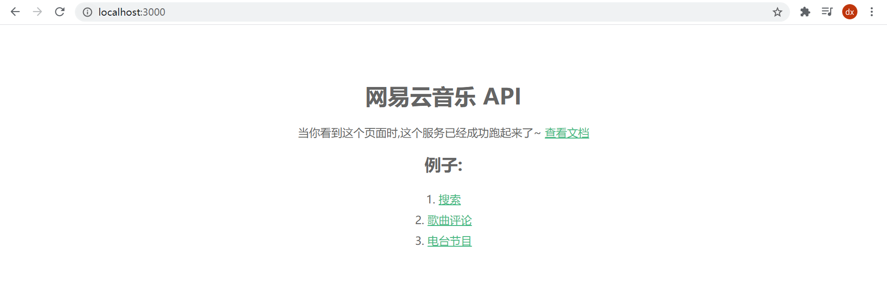
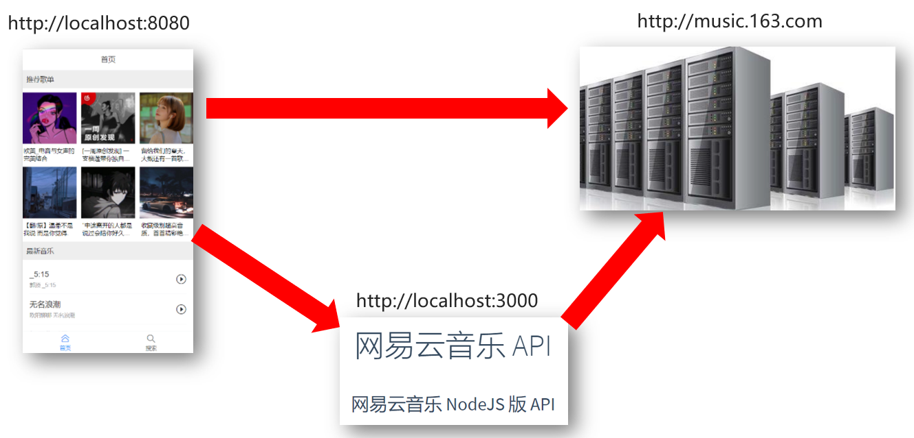
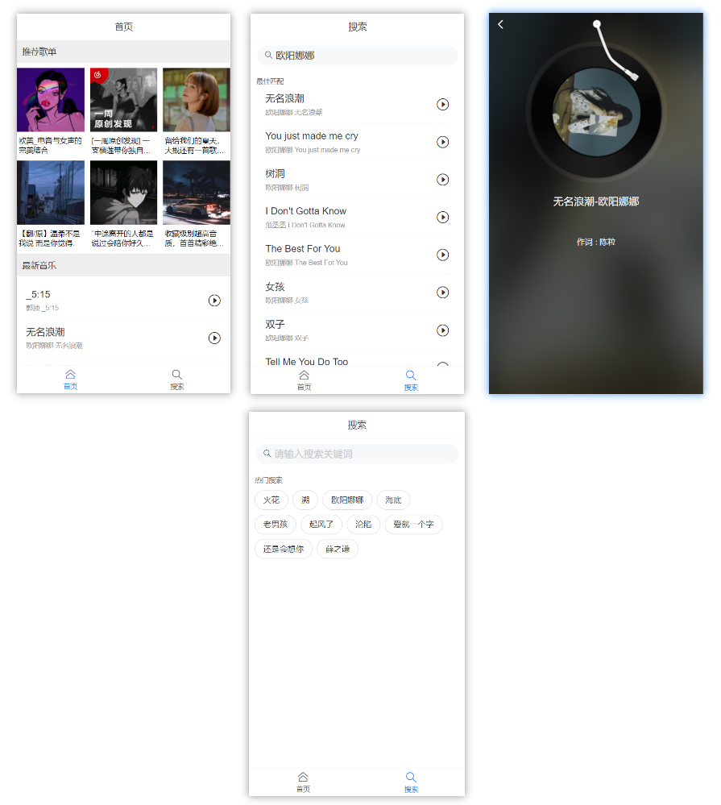
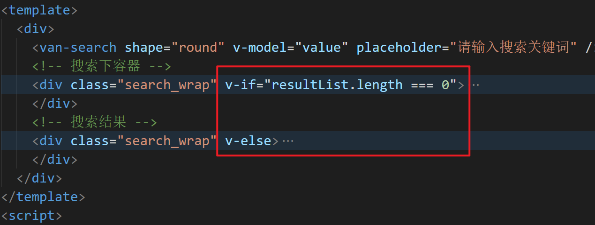
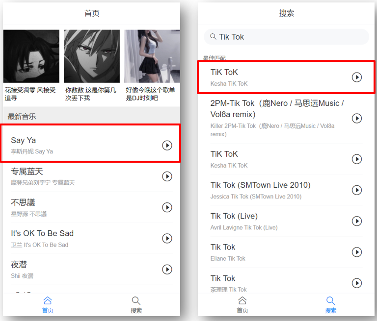
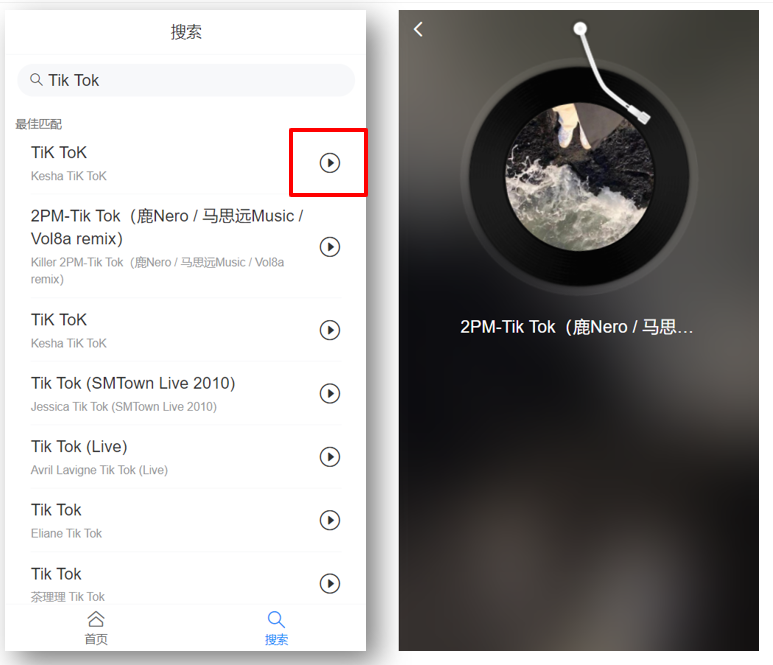

# Day08

## 知识点自测

- [ ] 知道reset.css和flexible.js的作用
- [ ] 什么是组件库-例如bootstrap作用
- [ ] yarn命令的使用
- [ ] 组件名字用name属性方式注册
- [ ] 如何自定义组件库样式

## 铺垫(自学)

> #### 本地接口项目部署

下载网易云音乐node接口项目, 在本地启动, 为我们vue项目提供数据支持

[项目地址](https://binaryify.github.io/NeteaseCloudMusicApi/#/?id=%e5%ae%89%e8%a3%85)

[备用地址](https://github.com/Binaryify/NeteaseCloudMusicApi/tree/master/docs)

下载后, 安装所有依赖, 在本地启动起来, 测试访问此地址是否有数据

http://localhost:3000, 看到如下页面就成功了 - 等着明天上课启动即可



> 总结: 前端请求本地的node项目, node服务器伪装请求去拿网易云音乐服务器数据转发回给自己前端

## 今日学习目标

1. 能够掌握vant组件库的使用
2. 能够掌握vant组件自定义样式能力
3. 能够掌握组件库使用和文档使用能力
4. 能够完成网易云音乐案例

## 1. 案例-网易云音乐

### 1.0 网易云音乐-本地接口

> 目的: 请求网易云音乐服务器API接口-获取数据



> 总结: 反向代理就是用本地开启cors的服务器去转发请求拿到数据

### 1.1 网易云音乐-本地接口启动

> 目的: 启动本地网易云音乐API服务

在今天的笔记铺垫中, 大家自学下载了一个项目启动即可

### 1.2 网易云音乐-前端项目初始化

> 目标: 初始化项目, 下载必备包, 引入初始文件, 配置按需自动引入vant, 创建页面组件

1. 初始化工程

   ```bash
   vue create music-demo
   ```

2. 下载需要的所有第三方依赖包

   ```bash
   yarn add axios vant vue-router 
   ```

3. 引入笔记代码里准备好的reset.css和flexible.js - 实现样式初始化和适配问题 - 引入到main.js

4. 本次vant使用**自动按需引入**的方式

   文档: https://vant-contrib.gitee.io/vant/#/zh-CN/quickstart

   ```bash
yarn add babel-plugin-import  -D
   ```
   
   在babel.config.js - 添加插件配置

   ```js
plugins: [
       ['import', {
           libraryName: 'vant',
           libraryDirectory: 'es',
           style: true
       }, 'vant']
   ]
   ```


### 1.3 网易云音乐-需求分析

根据需求, 创建路由所需要的5个页面的组件

Layout(布局, 顶部导航和底部导航) > 二级路由 Home 和 Search

Play



创建需要的views下的页面组件4个

views/Layout/index.vue  - 负责布局(上下导航 - 中间二级路由切换首页和搜索页面)

```css
/* 中间内容区域 - 容器样式(留好上下导航所占位置) */
.main {
  padding-top: 46px;
  padding-bottom: 50px;
}
```

views/Home/index.vue - 标题和歌名样式

```css
/* 标题 */
.title {
  padding: 0.266667rem 0.24rem;
  margin: 0 0 0.24rem 0;
  background-color: #eee;
  color: #333;
  font-size: 15px;
}
/* 推荐歌单 - 歌名 */
.song_name {
  font-size: 0.346667rem;
  padding: 0 0.08rem;
  margin-bottom: 0.266667rem;
  word-break: break-all;
  text-overflow: ellipsis;
  display: -webkit-box; /** 对象作为伸缩盒子模型显示 **/
  -webkit-box-orient: vertical; /** 设置或检索伸缩盒对象的子元素的排列方式 **/
  -webkit-line-clamp: 2; /** 显示的行数 **/
  overflow: hidden; /** 隐藏超出的内容 **/
}
```

views/Search/index.vue

```css
/* 搜索容器的样式 */
.search_wrap {
  padding: 0.266667rem;
}

/*热门搜索文字标题样式 */
.hot_title {
  font-size: 0.32rem;
  color: #666;
}

/* 热搜词_容器 */
.hot_name_wrap {
  margin: 0.266667rem 0;
}

/* 热搜词_样式 */
.hot_item {
  display: inline-block;
  height: 0.853333rem;
  margin-right: 0.213333rem;
  margin-bottom: 0.213333rem;
  padding: 0 0.373333rem;
  font-size: 0.373333rem;
  line-height: 0.853333rem;
  color: #333;
  border-color: #d3d4da;
  border-radius: 0.853333rem;
  border: 1px solid #d3d4da;
}
```

views/Play/index.vue - 直接从预习资料里复制(节省时间) - 可自己扩展阅读代码

### 1.4 网易云音乐-路由准备

> 目标: 准备路由配置, 显示不同路由页面

router/index.js - 准备路由 - 以及默认显示Layout, 然后Layout默认显示二级路由的首页

```js
// 路由-相关模块
import Vue from 'vue'
import VueRouter from 'vue-router'
import Layout from '@/views/Layout'
import Home from '@/views/Home'
import Search from '@/views/Search'
import Play from '@/views/Play'

Vue.use(VueRouter)
const routes = [
    {
        path: '/',
        redirect: '/layout'
    },
    {
        path: '/layout',
        component: Layout,
        redirect: '/layout/home',
        children: [
            {
                path: 'home',
                component: Home,
                meta: { // meta保存路由对象额外信息的
                    title: "首页"
                }
            },
            {
                path: 'search',
                component: Search,
                meta: {
                    title: "搜索"
                }
            }
        ]
    },
    {
        path: '/play',
        component: Play
    }
]

const router = new VueRouter({
    routes
})

export default router
```

main.js - 引入路由对象, 注册到new Vue中

```js
import router from '@/router'

new Vue({
  render: h => h(App),
  router
}).$mount('#app')
```

App.vue中留好router-view显示路由页面

```vue
<template>
  <div>
    <router-view></router-view>
  </div>
</template>
```

> 总结: 把项目的框搭好, 逐个攻破

### 1.5 网易云音乐-Tabbar组件

> 目标: 点击底部导航, 切换路由页面显示

文档: https://vant-contrib.gitee.io/vant/#/zh-CN/tabbar

1. 注册Tabbar组件, 在main.js中

   ```js
   import { Tabbar, TabbarItem  } from 'vant';
   Vue.use(Tabbar);
   Vue.use(TabbarItem);
   ```

2. 在Layout.vue中使用

   ```vue
   <template>
     <div>
       <div class="main">
         <!-- 二级路由-挂载点 -->
         <router-view></router-view>
       </div>
       <van-tabbar route>
         <van-tabbar-item replace to="/layout/home" icon="home-o"
           >首页</van-tabbar-item
         >
         <van-tabbar-item replace to="/layout/search" icon="search"
           >搜索</van-tabbar-item
         >
       </van-tabbar>
     </div>
   </template>
   
   <script>
   export default {
   }
   </script>
   
   <style scoped>
   /* 中间内容区域 - 容器样式(留好上下导航所占位置) */
   .main {
     padding-top: 46px;
     padding-bottom: 50px;
   }
   </style>
   ```
   
3. 开启路由模式 route属性, 和to属性指向要切换的路由路径

   ```vue
   <van-tabbar route>
       <van-tabbar-item icon="home-o" to="/layout/home"
                        >首页</van-tabbar-item
           >
       <van-tabbar-item icon="search" to="/layout/search"
                        >搜索</van-tabbar-item
           >
   </van-tabbar>
   ```

> 总结: van-tabbar开启route

### 1.6 网易云音乐-NavBar导航组件

> 目标: 实现顶部标题展示

文档: https://vant-contrib.gitee.io/vant/#/zh-CN/nav-bar

1. main.js - 注册NavBar组件

   ```js
   import { NavBar } from 'vant';
   Vue.use(NavBar);
   ```

2. 复制文档里的, 然后删删只留标题

   ```vue
   <van-nav-bar :title="activeTitle" fixed />
   
   <script>
       export default {
           activeTitle: "首页"
       }
   </script>
   ```

### 1.7 网易云音乐-NavBar标题切换

> 目标: 实现点击底部导航/刷新非第一页面页面, 导航标题正确显示

* 在router/index.js - 给$route里需要导航标题的添加meta元信息属性

  ```js
  {
          path: '/layout',
          component: Layout,
          redirect: '/layout/home',
          children: [
              {
                  path: 'home',
                  component: Home,
                  meta: { // meta保存路由对象额外信息的
                      title: "首页"
                  }
              },
              {
                  path: 'search',
                  component: Search,
                  meta: {
                      title: "搜索"
                  }
              }
          ]
      },
  ```

  Layout.vue中监听$route改变:

  给导航active的值设置$route里的元信息的标题

  ```js
  export default {
    data() {
      return {
        activeTitle: this.$route.meta.title, // "默认"顶部导航要显示的标题 (默认获取当前路由对象里的meta中title值)
      };
    },
    // 路由切换 - 侦听$route对象改变
    watch: {
      $route() {
        this.activeTitle = this.$route.meta.title; // 提取切换后路由信息对象里的title显示
      },
    },
  };
  ```

> 总结: 点击底部导航和刷新当前网页, 都能保证导航标题的正确显示

### 1.8 网易云音乐-网络请求封装

> 目标: 不想把网络请求散落在各个逻辑页面里, 不然以后找起来改起来很麻烦

1. 封装utils/request.js - 基于axios进行二次封装 - 设置基础地址

   ```js
   // 网络请求 - 二次封装
   import axios from 'axios'
   axios.defaults.baseURL = "http://localhost:3000"
   export default axios
   ```
   
2. 封装src/api/Home.js

   统一封装网络请求方法

   ```js
   // 文件名-尽量和模块页面文件名统一(方便查找)
   import request from '@/utils/request'
   
   // 首页 - 推荐歌单
   export const recommendMusic = params => request({
       url: '/personalized',
       params
       // 将来外面可能传入params的值 {limit: 20}
   })
   ```
   
3. 在src/api/index.js - 统一导出接口供外部使用

   ```js
   // api文件夹下 各个请求模块js, 都统一来到index.js再向外导出
   import {recommendMusic} from './Home'
   
   export const recommendMusicAPI = recommendMusic // 请求推荐歌单的方法导出
   ```

4. 在main.js - 测试使用一下.

   ```js
   import { recommendMusicAPI } from '@/api/index'
   async function myFn(){
     const res = await recommendMusicAPI({limit: 6});
     console.log(res);
   }
   myFn();
   ```

>  总结: 封装网络请求方法目的, 方便我们统一管理

### 1.9 网易云音乐-首页-推荐歌单

接口地址: /personalized

1. 布局采用van-row和van-col 

   布局文档https://vant-contrib.gitee.io/vant/#/zh-CN/col

2. 使用vant内置的图片组件来显示图片

1. 在main.js注册使用的组件

   ```js
   import { Col, Row, Image as VanImage } from 'vant';
   
   Vue.use(Col);
   Vue.use(Row);
   Vue.use(VanImage);
   ```

4. 在api/index.js下定义推荐歌单的接口方法

   ```js
   // 首页 - 推荐歌单
   export const recommendMusic = params => request({
       url: '/personalized',
       params
       // 将来外面可能传入params的值 {limit: 20}
   })
   ```
   
4. 把数据请求回来, 用van-image和p标签展示推荐歌单和歌单名字

   ```vue
   <template>
     <div>
      <p class="title">推荐歌单</p>
       <van-row gutter="6">
         <van-col span="8" v-for="obj in reList" :key="obj.id">
           <van-image width="100%" height="3rem" fit="cover" :src="obj.picUrl" />
           <p class="song_name">{{ obj.name }}</p>
         </van-col>
       </van-row>
     </div>
   </template>
   
   <script>
   import { recommendMusicAPI } from "@/api";
   export default {
     data() {
       return {
          reList: [], // 推荐歌单数据
       };
     },
     async created() {
       const res = await recommendMusicAPI({
         limit: 6,
       });
       console.log(res);
       this.reList = res.data.result;
     },
   };
   </script>
   ```

### 1.10 网易云音乐- 首页-最新音乐

> 目标: van-cell单元格使用

请求地址: /personalized/newsong

1. 引入van-cell使用 - 注册组件main.js中

   ```js
   import {Cell} from 'vant';
   Vue.use(Cell);
   ```
   
2. 定义接口请求方法 - api/index.js

   ```js
   
   // 首页 - 推荐最新音乐
   export const newMusic = params => request({
       url: "/personalized/newsong",
       params
   })
   ```

3. 列表数据铺设 - 插入自定义标签

   ```vue
   <template>
     <div>
       <p class="title">推荐歌单</p>
       <div>
         <van-row gutter="5">
           <van-col span="8" v-for="obj in recommendList" :key="obj.id">
             <van-image fit="cover" :src="obj.picUrl" />
             <p class="song_name">{{ obj.name }}</p>
           </van-col>
         </van-row>
       </div>
       <p class="title">最新音乐</p>
       <van-cell center v-for="obj in songList" :key="obj.id" :title="obj.name" :label="obj.song.artists[0].name + ' - ' + obj.name">
           <template #right-icon>
             <van-icon name="play-circle-o" size="0.6rem"/>
           </template>
       </van-cell>
     </div>
   </template>
   
   <script>
   import { recommendMusicAPI, newMusicAPI } from "@/api";
   export default {
      data() {
       return {
         reList: [], // 推荐歌单数据
         songList: [], // 最新音乐数据
       };
     },
     async created() {
       const res = await recommendMusicAPI({
         limit: 6,
       });
       console.log(res);
       this.reList = res.data.result;
   
       const res2 = await newMusicAPI({
         limit: 20
       })
       console.log(res2);
       this.songList = res2.data.result
     },
   };
   </script>
   ```

### 1.11 网易云音乐-搜索-热搜关键字

> 目标: 完成热搜关键字铺设

搜索框 – van-search组件

api/Search.js – 热搜关键字 - 接口方法

Search/index.vue引入-获取热搜关键字 - 铺设页面

点击文字填充到输入框

1. 准备搜索界面标签

```vue
<template>
  <div>
    <van-search
      shape="round"
      placeholder="请输入搜索关键词"
    />
    <!-- 搜索下容器 -->
    <div class="search_wrap">
      <!-- 标题 -->
      <p class="hot_title">热门搜索</p>
      <!-- 热搜关键词容器 -->
      <div class="hot_name_wrap">
        <!-- 每个搜索关键词 -->
        <span
          class="hot_item"
          >热搜关键字</span
        >
      </div>
    </div>
  </div>
</template>
<script>
export default {}
</script>

<style scoped>
/* 搜索容器的样式 */
.search_wrap {
  padding: 0.266667rem;
}

/*热门搜索文字标题样式 */
.hot_title {
  font-size: 0.32rem;
  color: #666;
}

/* 热搜词_容器 */
.hot_name_wrap {
  margin: 0.266667rem 0;
}

/* 热搜词_样式 */
.hot_item {
  display: inline-block;
  height: 0.853333rem;
  margin-right: 0.213333rem;
  margin-bottom: 0.213333rem;
  padding: 0 0.373333rem;
  font-size: 0.373333rem;
  line-height: 0.853333rem;
  color: #333;
  border-color: #d3d4da;
  border-radius: 0.853333rem;
  border: 1px solid #d3d4da;
}

/* 给单元格设置底部边框 */
.van-cell {
  border-bottom: 1px solid lightgray;
}
</style>
```

2. api/Search.js - 定义热门搜索接口方法和搜索结果方法

```js
import request from '@/utils/request'

// 热搜关键字
export const hotSearch = () => request({
    url: '/search/hot'
})

// 搜索结果列表
export const searchResult = params => request({
    url: '/cloudsearch',
    params
})
```

3. api/index.js - 导入使用并统一导出

```js
// 统一出口
// 你也可以在逻辑页面里.vue中直接引入@/api/Home下的网络请求工具方法
// 为什么: 我们可以把api所有的方法都统一到一处. 

import {recommendMusic, hotMusic} from '@/api/Home'
import {hotSearch, searchResult} from '@/api/Search'


export const recommendMusicAPI = recommendMusic // 把网络请求方法拿过来 导出
export const hotMusicAPI = hotMusic // 把获取最新音乐的, 网络请求方法导出

export const hotSearchAPI = hotSearch // 热搜
export const searchResultAPI = searchResult // 搜索结果
```

4. created中请求接口-拿到热搜关键词列表

```vue

<!-- 每个搜索关键词 -->
<span
      class="hot_item"
      v-for="(obj, index) in hotArr"
      :key="index"
      >{{ obj.first }}</span>

<script>
    // 目标: 铺设热搜关键字
    // 1. 搜索框van-search组件, 关键词标签和样式
    // 2. 找接口, api/Search.js里定义获取搜索关键词的请求方法
    // 3. 引入到当前页面, 调用接口拿到数据循环铺设页面
    // 4. 点击关键词把值赋予给van-search的v-model变量
    import { hotSearchAPI } from "@/api";
    export default {
        data(){
            return {
                hotArr: [], // 热搜关键字
            }
        },
        async created() {
            const res = await hotSearchAPI();
            console.log(res);
            this.hotArr = res.data.result.hots;
        },
    }
</script>
```

5. 点击热词填充到输入框

```vue

<van-search
            shape="round"
            v-model="value"
            placeholder="请输入搜索关键词"
            />
<!-- 每个搜索关键词 -->
<span
      class="hot_item"
      v-for="(obj, index) in hotArr"
      :key="index"
      @click="fn(obj.first)"
      >{{ obj.first }}</span
    >
</div>

<script>
    export default {
        data(){
            return {
                value: "",
                hotArr: [], // 热搜关键字
            }
        },
        // ...省略了created
        methods: {
            async fn(val) {
                // 点击热搜关键词
                this.value = val; // 选中的关键词显示到搜索框
            },
        }
    }
</script>
```

> 总结: 写好标签和样式, 拿到数据循环铺设, 点击关键词填入到van-search中

### 1.12 网易云音乐-搜索-点击热词-搜索结果

> 目标: 点击热词填充到输入框-出搜索结果

api/Search.js - 搜索结果, 接口方法

Search/index.vue引入-获取搜索结果 - 铺设页面

和热搜关键字容器 – 互斥显示

点击文字填充到输入框, 请求搜索结果铺设

1. 搜索结果显示区域标签+样式(直接复制/vant文档找)

```vue
<!-- 搜索结果 -->
    <div class="search_wrap">
      <!-- 标题 -->
      <p class="hot_title">最佳匹配</p>
      <van-cell
        center
        title='结果名字'
      >
        <template #right-icon>
          <van-icon name="play-circle-o" size="0.6rem"/>
        </template>
      </van-cell>
    </div>
```

2. 点击 - 获取搜索结果 - 循环铺设页面

```vue
<template>
  <div>
    <van-search shape="round" v-model="value" placeholder="请输入搜索关键词" />
    <!-- 搜索下容器 -->
    <div class="search_wrap">
      <!-- 标题 -->
      <p class="hot_title">热门搜索</p>
      <!-- 热搜关键词容器 -->
      <div class="hot_name_wrap">
        <!-- 每个搜索关键词 -->
        <span
          class="hot_item"
          v-for="(obj, index) in hotArr"
          :key="index"
          @click="fn(obj.first)"
          >{{ obj.first }}</span
        >
      </div>
    </div>
    <!-- 搜索结果 -->
    <div class="search_wrap">
      <!-- 标题 -->
      <p class="hot_title">最佳匹配</p>
      <van-cell
        center
        v-for="obj in resultList"
        :key="obj.id"
        :title="obj.name"
        :label="obj.ar[0].name + ' - ' + obj.name"
      >
        <template #right-icon>
          <van-icon name="play-circle-o" size="0.6rem"/>
        </template>
      </van-cell>
    </div>
  </div>
</template>
<script>
// 目标: 铺设热搜关键字
// 1. 搜索框van-search组件, 关键词标签和样式
// 2. 找接口, api/Search.js里定义获取搜索关键词的请求方法
// 3. 引入到当前页面, 调用接口拿到数据循环铺设页面
// 4. 点击关键词把值赋予给van-search的v-model变量

// 目标: 铺设搜索结果
// 1. 找到搜索结果的接口 - api/Search.js定义请求方法
// 2. 再定义methods里getListFn方法(获取数据)
// 3. 在点击事件方法里调用getListFn方法拿到搜索结果数据
// 4. 铺设页面(首页van-cell标签复制过来)
// 5. 把数据保存到data后, 循环van-cell使用即可(切换歌手字段)
// 6. 互斥显示搜索结果和热搜关键词
import { hotSearchAPI, searchResultListAPI } from "@/api";
export default {
  data() {
    return {
      value: "",
      hotArr: [], // 热搜关键字
      resultList: [], // 搜索结果
    };
  },
  async created() {
    const res = await hotSearchAPI();
    console.log(res);
    this.hotArr = res.data.result.hots;
  },
  methods: {
    async getListFn() {
      return await searchResultListAPI({
        keywords: this.value,
        limit: 20,
      }); // 把搜索结果return出去
      // (难点):
      // async修饰的函数 -> 默认返回一个全新Promise对象
      // 这个Promise对象的结果就是async函数内return的值
      // 拿到getListFn的返回值用await提取结果
    },
    async fn(val) {
      // 点击热搜关键词
      this.value = val; // 选中的关键词显示到搜索框
      const res = await this.getListFn();
      console.log(res);
      this.resultList = res.data.result.songs;
    },
  },
};
</script>
```

3. 互斥显示, 热搜关键词和搜索结果列表



> 总结: 点击热词后, 调用接口传入关键词, 返回数据铺设

### 1.13 网易云音乐-输入框-搜索结果

> 目标: 监测输入框改变-拿到搜索结果

观察van-search组件是否支持和实现input事件

绑定@input事件和方法

在事件处理方法中获取对应的值使用

如果搜索不存在的数据-要注意接口返回字段不同

1. 绑定@input事件在van-search上

```vue
<van-search shape="round" v-model="value" placeholder="请输入搜索关键词" @input="inputFn"/>
```

2. 实现输入框改变 - 获取搜索结果铺设

```js
async inputFn() {
    // 输入框值改变
    if (this.value.length === 0) {
        // 搜索关键词如果没有, 就把搜索结果清空阻止网络请求发送(提前return)
        this.resultList = [];
        return;
    }
    const res = await this.getListFn();
    console.log(res);
    // 如果搜索结果响应数据没有songs字段-无数据
    if (res.data.result.songs === undefined) {
        this.resultList = [];
        return;
    }
    this.resultList = res.data.result.songs;
},
```

> 总结: 监测输入框改变-保存新的关键词去请求结果回来铺设

### 1.14 网易云音乐-搜索结果-加载更多

> 目标: 触底后, 加载下一页数据

观察接口文档: 发现需要传入offset和分页公式

van-list组件监测触底执行onload事件

配合后台接口, 传递下一页的标识

拿到下一页数据后追加到当前数组末尾即可

1. 设置van-list组件实现相应的属性和方法, 让page++去请求下页数据

```vue

      <van-list
        v-model="loading"
        :finished="finished"
        finished-text="没有更多了"
        @load="onLoad"
      >
        <van-cell
          center
          v-for="obj in resultList"
          :key="obj.id"
          :title="obj.name"
          :label="obj.ar[0].name + ' - ' + obj.name"
        >
          <template #right-icon>
            <van-icon name="play-circle-o" size="0.6rem" />
          </template>
        </van-cell>
      </van-list>
<script>
// 目标: 加载更多
// 1. 集成list组件-定义相关的变量(搞懂变量的作用) -监测触底事件
// 2. 一旦触底, 自动执行onload方法
// 3. 对page++, 给后台传递offset偏移量参数-请求下一页的数据
// 4. 把当前数据和下一页新来的数据拼接起来用在当前 页面的数组里
// (切记) - 加载更多数据后,一定要把loading改成false, 保证下一次还能触发onload方法
export default {
  data() {
    return {
      value: "",
      hotArr: [], // 热搜关键字
      resultList: [], // 搜索结果
      loading: false, // 加载中 (状态) - 只有为false, 才能触底后自动触发onload方法
      finished: false, // 未加载全部 (如果设置为true, 底部就不会再次执行onload, 代表全部加载完成)
      page: 1, // 当前搜索结果的页码
    };
  },
  // ...省略其他
  methods: {
    async getListFn() {
      return await searchResultListAPI({
        keywords: this.value,
        limit: 20,
        offset: (this.page - 1) * 20, // 固定公式
      }); // 把搜索结果return出去
      // (难点):
      // async修饰的函数 -> 默认返回一个全新Promise对象
      // 这个Promise对象的结果就是async函数内return的值
      // 拿到getListFn的返回值用await提取结果
    },
    async onLoad() {
      // 触底事件(要加载下一页的数据咯), 内部会自动把loading改为true
      this.page++;
      const res = await this.getListFn();
      this.resultList = [...this.resultList, ...res.data.result.songs];
      this.loading = false; // 数据加载完毕-保证下一次还能触发onload
    },
  },
};
</script>
```

> 总结: list组件负责UI层监测触底, 执行onload函数, page++, 请求下页数据, 和现在数据合并显示更多, 设置loading为false, 确保下次触底还能执行onLoad

### 1.15 网易云音乐-加载更多-bug修复

> 目标: 如果只有一页数据/无数据判断

无数据/只有一页数据, finished为true

防止list组件触底再加载更多

还要测试-按钮点击/输入框有数据情况的加载更多

正确代码

```diff
 async fn(val) {
      // 点击热搜关键词
+        this.finished = false; // 点击新关键词-可能有新的数据
      this.value = val; // 选中的关键词显示到搜索框
      const res = await this.getListFn();
      console.log(res);
      this.resultList = res.data.result.songs;
+        this.loading = false; // 本次数据加载完毕-才能让list加载更多
    },
    async inputFn() {
+       this.finished = false // 输入框关键字改变-可能有新数据(不一定加载完成了)
      // 输入框值改变
      if (this.value.length === 0) {
        // 搜索关键词如果没有, 就把搜索结果清空阻止网络请求发送(提前return)
        this.resultList = [];
        return;
      }
      const res = await this.getListFn();
      console.log(res);
      
+      // 如果搜索结果响应数据没有songs字段-无数据
+      if (res.data.result.songs === undefined) {
+        this.resultList = [];
+        return;
+      }
      this.resultList = res.data.result.songs;
+        this.loading = false;
    },
    async onLoad() {
      // 触底事件(要加载下一页的数据咯), 内部会自动把loading改为true
      this.page++;
      const res = await this.getListFn();
+        if (res.data.result.songs === undefined) { // 没有更多数据了
+          this.finished = true; // 全部加载完成(list不会在触发onload方法)
+          this.loading = false; // 本次加载完成
+          return;
+        }
      this.resultList = [...this.resultList, ...res.data.result.songs];
+      this.loading = false; // 数据加载完毕-保证下一次还能触发onload
    },
```

> 总结: 在3个函数 上和下, 设置finished还未完成, 最后要把loading改成false, 判断songs字段, 对这里的值要非常熟悉才可以

### 1.16 网易云音乐-输入框-防抖

> 目标: 输入框触发频率过高

输入框输入"asdfghjkl"

​	接着快速的删除

​	每次改变-马上发送网络请求

​	网络请求异步耗时 – 数据回来后还是铺设到页面上

解决:

​	引入防抖功能

```js
async inputFn() {
    // 目标: 输入框改变-逻辑代码-慢点执行
    // 解决: 防抖
    // 概念: 计时n秒, 最后执行一次, 如果再次触发, 重新计时
    // 效果: 用户在n秒内不触发这个事件了, 才会开始执行逻辑代码
    if (this.timer) clearTimeout(this.timer);
    this.timer = setTimeout(async () => {
        this.finished = false; // 输入框关键字改变-可能有新数据(不一定加载完成了)
        // 输入框值改变
        if (this.value.length === 0) {
            // 搜索关键词如果没有, 就把搜索结果清空阻止网络请求发送(提前return)
            this.resultList = [];
            return;
        }
        const res = await this.getListFn();
        console.log(res);
        // 如果搜索结果响应数据没有songs字段-无数据
        if (res.data.result.songs === undefined) {
            this.resultList = [];
            return;
        }
        this.resultList = res.data.result.songs;
        this.loading = false;
    }, 900);
},
```

> 总结: 降低函数执行频率

### 1.17 网易云音乐-页码bug修复

> 目标: 第一个关键词page已经+到了10, 再第二个关键词应该从1开始

加载更多时, page已经往后计数了

重新获取时, page不是从第一页获取的

点击搜索/输入框搜索时, 把page改回1

代码如下:

```diff
 async fn(val) {
      // 点击热搜关键词
+      this.page = 1; // 点击重新获取第一页数据
      this.finished = false; // 点击新关键词-可能有新的数据
      this.value = val; // 选中的关键词显示到搜索框
      const res = await this.getListFn();
      console.log(res);
      this.resultList = res.data.result.songs;
      this.loading = false; // 本次数据加载完毕-才能让list加载更多
 },
 async inputFn() {
      // 目标: 输入框改变-逻辑代码-慢点执行
      // 解决: 防抖
      // 概念: 计时n秒, 最后执行一次, 如果再次触发, 重新计时
      // 效果: 用户在n秒内不触发这个事件了, 才会开始执行逻辑代码
      if (this.timer) clearTimeout(this.timer);
      this.timer = setTimeout(async () => {
+        this.page = 1; // 点击重新获取第一页数据
        this.finished = false; // 输入框关键字改变-可能有新数据(不一定加载完成了)
        // 输入框值改变
        if (this.value.length === 0) {
          // 搜索关键词如果没有, 就把搜索结果清空阻止网络请求发送(提前return)
          this.resultList = [];
          return;
        }
        const res = await this.getListFn();
        console.log(res);
        // 如果搜索结果响应数据没有songs字段-无数据
        if (res.data.result.songs === undefined) {
          this.resultList = [];
          return;
        }
        this.resultList = res.data.result.songs;
        this.loading = false;
      }, 900);
 },
```

> 总结: 切换时, 让page页面回到1

### 1.18 网易云音乐-Layout边距优化

> 目标: 上下导航会盖住中间内容

我们的头部导航和底部导航挡住了中间内容

给中间路由页面设置上下内边距即可

在Layout/index.vue中

```css
/* 中间内容区域 - 容器样式(留好上下导航所占位置) */
.main {
  padding-top: 46px;
  padding-bottom: 50px;
}
```

### 1.19 网易云音乐-SongItem封装

> 目标: 把首页和搜索结果的歌曲cell封装起来



创建src/components/SongItem.vue

```vue
<template>
  <van-cell center :title="name" :label="author + ' - ' + name">
    <template #right-icon>
      <van-icon name="play-circle-o" size="0.6rem"/>
    </template>
  </van-cell>
</template>

<script>
export default {
  props: {
    name: String, // 歌名
    author: String, // 歌手
    id: Number, // 歌曲id (标记这首歌曲-为将来跳转播放页做准备)
  }
};
</script>

<style scoped>
/* 给单元格设置底部边框 */
.van-cell {
  border-bottom: 1px solid lightgray;
}
</style>
```

Home/index.vue - 重构

==注意: author字段不同==

```vue
<SongItem v-for="obj in songList"
    :key="obj.id"
    :name="obj.name"
    :author="obj.song.artists[0].name"
    :id="obj.id"
></SongItem>
```

Search/index.vue - 重构

==注意: author字段不同==

```vue
<SongItem
          v-for="obj in resultList"
          :key="obj.id"
          :name="obj.name"
          :author="obj.ar[0].name"
          :id="obj.id"
></SongItem>
```

> 总结: 遇到重复标签要封装

### 1.20 网易云音乐-播放音乐

> 目标: 从预习资料拿到播放的api和页面, 配置好路由规则

==时间关系,这个页面不用写, 直接用, 注释在备课代码里写好了==

组件SongItem里 – 点击事件

api/Play.js – 提前准备好 – 接口方法

跳转到Play页面 – 把歌曲id带过进去

在SongItem.vue - 点击播放字体图标

```js
methods: {
    playFn(){
        this.$router.push({
            path: '/play',
            query: {
                id: this.id // 歌曲id, 通过路由跳转传递过去
            }
        })
    }
}
```



> 总结: 准备好播放页, 点击播放传歌曲id过去, 到播放页-再请求响应数据和歌曲地址用audio标签播放

### 1.21 网易云音乐-vant适配

> 目标: 切换不同机型, ==刷新后==看看标签大小适配吗

* postcss – 配合webpack翻译css代码
* postcss-pxtorem – 配合webpack, 自动把px转成rem
* 新建postcss.config.js – 设置相关配置
* 重启服务器, 再次观察Vant组件是否适配

1. 下载postcss和==postcss-pxtorem@5.1.1==

   postcss作用: 是对css代码做降级处理

   postcss-pxtorem: 自动把所有代码里的css样式的px, 自动转rem

2. src/新建postcss.config.js

```js
module.exports = {
  plugins: {
    'postcss-pxtorem': {
      // 能够把所有元素的px单位转成Rem
      // rootValue: 转换px的基准值。
      // 例如一个元素宽是75px，则换成rem之后就是2rem。
      rootValue: 37.5,
      propList: ['*']
    }
  }
}
```

==以iphone6为基准, 37.5px为基准值换算rem==

## 今日总结

- [ ] 掌握vant组件库的使用 - 找组件, 引组件, 用组件
- [ ] 能够对vant组件自带样式进行覆盖自定义
- [ ] 遇到重复的标签, 自己也封装了一个复用的组件
- [ ] 掌握查询文档和使用每个属性的方式

## 今日作业

把课上的案例-从0再来一遍, 为下阶段移动端项目铺垫