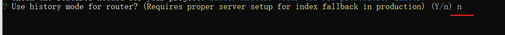
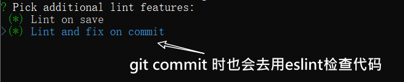
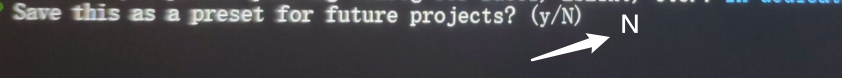
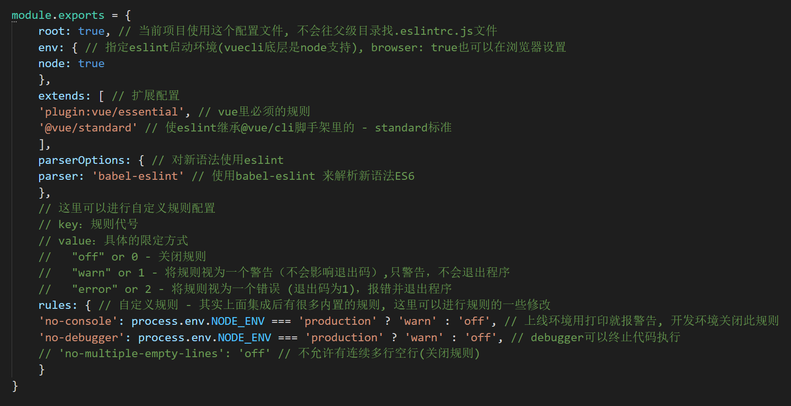

# Day02_项目开始和登录

## 今日学习目标

* 搭建项目的结构
* 完成登录部分功能

## 1.项目_技术点(快速)

### 目标

* 了解项目需求

### 项目介绍

- 黑马头条(极客园)移动端是一个IT资讯移动web应用，有着和**今日头条**类似的资讯浏览体验。
- 主要功能：资讯列表、标签页切换，文章举报，频道管理、文章详情、关注功能、点赞功能、评论功能、搜索功能、登录功能、个人中心、编辑资料、小思同学
- 黑马头条可打包成一款移动APP，后期结合H5+可在Dcloud打包成一款体验较好的手机应用。
- 项目在线浏览地址: http://123.57.109.30:4005/dist/

### 项目包介绍

生产环境的包

| 包名             | 概念           |
| ---------------- | -------------- |
| vue              | 核心vue        |
| vuex             | 状态管理插件   |
| vue-router       | 路由管理插件   |
| axios            | 网络请求插件   |
| vant             | 移动组件库     |
| socket.io-client | 即时通讯库     |
| amfe-flexible    | flexiblejs适配 |

开发环境的包

| 包名            | 概念                                 |
| --------------- | ------------------------------------ |
| babel           | ES语法转换器                         |
| less            | css预处理器                          |
| vue-cli         | vue项目脚手架包                      |
| postcss         | css语法转换器(后处理器)              |
| postcss-pxtorem | 把px自动转rem插件(需要配合webpack用) |

打包App

- Hbuilder开发工具内, DCLOUD功能一键打包

### 项目技术点介绍

* vuejs中
  * $nextTick使用 (vue更新DOM是异步的)
  * 组件通信 (父, 子传递)
  * async和await用法
  * keep-alive 组件缓存
* vuex
  * actions中发ajax请求
  * actions的返回值问题
* vue-router
  * 懒加载 (对打包以后首页加载速度有提高)
* axios
  * 请求和响应拦截器
  * 封装请求工具方法 (代码分层)
* vant
  * 对组件使用更熟悉
  * 掌握使用和查阅文档的能力
* socket.io-client
  * http协议复习 (请求报文和响应报文)
  * 与ajax区别
  * ajax和socket之间的选择
* amfe-flexible
  * 移动端rem适配

### 项目预计收获

1. 自我学习能力
2. 理解项目流程
3. 排错解决能力 (有错误, 对代码也要知道为什么)
   * 标签结构/样式问题 - 看Elements控制台
   * JS逻辑问题 - 学会console打印调试变量值
   * 网络问题 - 看network
4. 快乐和开心, 总结沉淀经验
   * 在完成开发任务后, 建议写博客(不强制)

### 小结

1. 我们要做一个什么东西?

   * 移动端的项目, 资讯类的

2. 项目大概用到哪些技术点?

3. 为什么做项目?

   * 巩固技术知识

   * 项目需求和流程(思想)

   * 锻炼写代码和学习能力

   * 锻炼排错能力

## 2.项目_创建

### 目标

* 用@vue/cli包, 创建脚手架项目

### 步骤

1. 创建项目 (建议使用cmd终端)

   ```js
   vue create hmtt
   ```

2. 采用自定义方式去创建项目

   > 上下箭头切换, 回车确认, 空格选中

   ```js
   ? Please pick a preset:
     Default ([Vue 2] babel, eslint)
     Default (Vue 3 Preview) ([Vue 3] babel, eslint)
   > Manually select features  
   ```

3. 手动选择特性

   Babel, Router, Vuex,  CSS Pre-processors, Linter

   ```js
   ? Please pick a preset: Manually select features
   ? Check the features needed for your project:
    (*) Choose Vue version
    (*) Babel
    ( ) TypeScript
    ( ) Progressive Web App (PWA) Support
    (*) Router
    (*) Vuex
   >(*) CSS Pre-processors
    (*) Linter / Formatter
    ( ) Unit Testing
    ( ) E2E Testing  
   ```

4. 版本Vue2.x

   ```js
   ? Choose a version of Vue.js that you want to start the project with (Use arrow keys)
   > 2.x
     3.x (Preview) 
   ```

5. 路由是否使用history模式：不采用

   

6. css 预处理器: 使用less

   

7. eslint语法风格：Standard (一定)

   

8. 检查节点：保存时检查，提交时检查 (提交时可以不选)



9. 存储插件配置位置：单独放在不同的文件中 

   

10. 接下来，它会问你是否要保存前面的设置作为预设方案，以便后续创建其它项目时直接使用。

    * 你可以选择N(不保存)

    * 如果选择Y, 保存, 以后就可以一键完成以上步骤

      > 如果以后不需要的预设名字, 可以找到C:\Users\电脑名字, 下的.vuerc找到预设名字, 删除预设配置项

11. 经过长长的等待，创建完毕, 进入文件夹, 启动项目


### 小结

1. 如何创建项目?

   * vue create 项目文件夹名

2. 选择哪种预设?

   * 自定义模板

3. 什么叫预设?

   * 生成的脚手架项目里都有什么东西

##  3.项目_git存储

### 目标

* git命令巩固
* 项目版本管理
* 创建远程仓库
* 本地仓库推送上去

### 新项目-本地仓库

1. 创建本地仓库

   > 脚手架项目, 默认有个git本地仓库, 可以覆盖它/删除.git文件夹自己创建

   ```js
   git init
   ```

2. 暂存和提交

   ```js
   git add .
   git commit -m '提交的说明'
   ```

   > 注意: 会在本地.git文件夹里, 有一次本地的提交记录

### 新项目-远程仓库

1. 代码保存到远程
   * gitee.com网站注册账号并且登录
   * gitee.com网站创建仓库

   

2. 根据网站的命令操作(已有本地仓库)

   ```bash
   git remote add origin git仓库地址(自己去网页看)
   git push -u origin master
   ```

> 只有第一次需要 -u origin master, 以后直接git push

4. 上传成功可以看到这里

   > 如果公司自己git服务器, 么有网页, 需要git log看提交记录

   

### 以后提交和推送

> 本地开发代码, 变化后

* 先本地提交保存(暂不保存到远程仓库上)

  ```js
  git add .
  git commit -m '提交说明,一定要写清楚,方便以后回滚'
  ```

* 要推送到远程的话才执行这句

  ```js
  git push
  ```

### 克隆和拉取

> 如需远程git仓库里代码, 需要克隆或拉取代码下来

* 第一次克隆下来

  * 注意: http/https开头的地址, 需要账号密码才能克隆/推送
  * 注意; git@开头的地址, 需要ssh秘钥文件配置好, 才能免账号密码克隆/推送

  ```js
  git clone 远程git仓库地址
  ```

* 多人协同开发一个项目, 别人推送了, 以后直接拉取更新即可

  > 如果提示有冲突, 打开代码, 找到对方商量合并冲突

  ```js
  git pull
  ```

### 小结

1. git有什么作用?

   可以管理代码的版本(没提交一个功能可以有个记录, 随时可以回退)

2. 本地仓库和远程仓库区别?

   本地仓库存在本地文件夹(.git)内记录

   远程仓库需要联网才能推送代码上去

## 4.ESLint介绍

### 目标

* 了解ESLint的作用
* 能判断ESLint的错误

### ESLint是什么

[ESLint](http://eslint.cn/) 是一个代码检查工具，用来检查你的代码是否符合指定的规范

* 例如: = 的前后必须有一个空格
* 例如: 函数名后面必须有空格
* 例如: await必须用用在async修饰的函数内
* 例如: ==必须转换成3个等
* ........

### ESLint的好处

* 在写代码过程中, 检查你代码是否错误, 给你`小黑屋`提示

* ESLint可以约束团队内代码的风格统一

> `ESLint是法官, Standard是法律`

### ESLint的规范

规范文档: http://www.verydoc.net/eslint/00003312.html

规范文档2: https://standardjs.com/rules-zhcn.html

规范文档3: http://eslint.cn/docs/rules/

### ESLint使用

在代码里随便多写几个回车, ESLint会跳出来`刀子嘴`, `豆腐心`的提示你. 

在webpack开发服务器终端 / 浏览器 => 小黑屋


> eslint 是来帮助你的。心态要好，有错，就改。

把第4步规则名字, 复制到上面规范里查找违反了什么规则 / 根据第三步提示修改

### 小结

1. 什么是ESLint?

   代码检查工具

2. 为什么要使用ESLint?

   规范我们写代码的格式, 看着整洁 / 团队内成员风格统一

3. ESLint在哪里生效?

   webpack开发服务器+ESLint配置检查

## 5.ESLint在VSCode中使用

### 目标

* 每次运行后, 才看到ESLint报错, 很累吧?
* 边写代码, VSCode就提示ESLint规则?

### ESLint插件

1. 下载这个插件到vscode中

   

​	==2. 非常非常非常重要==

​		一定要把脚手架工程, 作为vscode**根目录**, 因为eslint要使用配置文件.eslintrc

3. 一定要配置插件监测的时机, 修改ESLint插件配置

   

   不用管别的, 把红框的放在{}内即可

   ```js
   "eslint.run": "onType",
   "editor.codeActionsOnSave": {
   	"source.fixAll.eslint": true
   }
   ```

> 更多的规则可以参考这里: https://www.cnblogs.com/jiaoshou/p/12218642.html

### ESLint插件修复

* 随便文件里多敲击几个回车, vscode报错提示, 证明ESLint插件开始工作
* ctrl + s 报错下是否能自动修复部分问题, 可以, 证明ESLint插件开始工作

> ==如果不工作, 看下面扩展资料==

### 自定义规则

在.eslintrc.js文件中, 可以调整规则(团队内可以自定义自己一套)



rules是一个对象，以键值对的格式来约定规则：

- 键名是规则名
- 值是这条规则的具体说明。最常见的有off,warn,error

### 小结

1. ESLint在哪2个地方分别检查代码?

   VSCode里工作和webpack开发服务器也检查

2. ESLint插件有什么功能?

   VSCode编码时, 提示, 保存还可以自动修复大部分问题

## 6.项目_目录结构

### 目标

* 认识工作目录
* 默认生成目录不满足我们开发结构

### 删除默认配置

1. 清空src/views/App.vue中的默认内容, 留个框

   ```vue
   <template>
     <div>
         黑马头条移动版
     </div>
   </template>
   ```

2. 删除默认生成的文件

   - components/HelloWorld.vue
   - views/Home.vue
   - views/About.vue

3. 修改一下路由配置 - 留下框

   * src/router/index.js

   ```js
   import Vue from 'vue'
   import VueRouter from 'vue-router'
   
   Vue.use(VueRouter)
   
   const routes = [
     // 删除掉
   ]
   
   const router = new VueRouter({
     routes
   })
   
   export default router
   ```

### 新增文件夹

在 src 目录下中补充创建以下目录：

- /api/index.js ： 存储请求函数模块
- /styles:               样式文件模块
- /utils:                 工具函数模块

```sh
├── node_modules # 安装的包
├── public	# 静态资源托管目录
│   ├── favicon.ico
│   └── index.html
└── src	# 源码
    ├── api	#请求接口封装模块
    	└── index.js #封装请求方法
    ├── assets	#资源目录
    ├── components	#组件目录
    ├── router	#路由模块
    	└── index.js #路由对象
    ├── store	#Vuex容器模块
    	└── index.js #store对象
    ├── styles #样式目录
    ├── utils  #工具模块目录
    ├── views  #视图组件目录
    ├── App.vue	#根组件
    └── main.js	#入口文件
├── .browserslistrc # 浏览器的约定
├── .editorconfig #对本项目要用到编辑器的约定
├── .eslintrc.js #eslint
├── .gitignore # git的忽略设置
├── babel.config.js	#babel配置文件
├── package-lock.json	#npm相关文件
├── package.json	#npm相关文件
└── README.md	#项目说明文件
```

### 小结

1. api文件夹的作用?

   * 统一管理网络请求方法

2. utils文件夹的作用?

   * 定义工具方法的地方

## 7.项目_Vant组件库

### 目标

* 黑马头条项目 - 基于Vant组件库开发

### 移动端组件库

PC端也有独特的组件库, 例如后面学习的element-ui

有赞团队推出的Vant组件库

其他移动端组件库

* vux
* mint

### 引入vant组件库

1. 下载vant组件库

   ```js
   yarn add vant
   ```

2. 根据文档指引, 配置按需引入

   https://vant-contrib.gitee.io/vant/#/zh-CN/quickstart#yin-ru-zu-jian

   > 如果上面打不开用这个地址试试: https://youzan.github.io/vant/#/zh-CN/home

3. 下载插件

   ```js
   yarn add babel-plugin-import -D
   ```

4. 在babel.config.js-添加如下配置

   ```js
   module.exports = {
       // ...省略了其他
       plugins: [
           ['import', {
               libraryName: 'vant',
               libraryDirectory: 'es',
               style: true
           }, 'vant']
       ]
   };
   ```

5. 改了src以外的文件, 要重启本地开发服务器

### 小结

1. vant组件库按需加载是什么意思?

   只需要引入某个组件而不是全部, 组件对应样式文件也会自动引入

## 8.项目_移动端适配

### 目标

* 复习适配方案
* 脚手架项目集成postcss翻译css代码

### 适配方案选型

1. PC端一般都是1:1用px还原UI设计图, 靠内容撑开高度
2. 移动端一般都是rem单位进行适配

### 适配步骤

1. 下载amfe-flexible

   > 根据网页宽度, 设置html的font-size

   ```js
   yarn add amfe-flexible
   ```

2. 到main.js引入

   ```js
   import "amfe-flexible"
   ```

3. 下载postcss和postcss-pxtorem@5.1.1

   > postcss: 后处理css, 编译翻译css代码
   >
   > postcss-pxtorem: 把css代码里所有px计算转换成rem

   ```js
   yarn add postcss postcss-pxtorem@5.1.1
   ```

4. 根目录下创建postcss.config.js文件

   > 对postcss进行设置

   ```js
   module.exports = {
     plugins: {
       'postcss-pxtorem': {
         // 能够把所有元素的px单位转成Rem
         // rootValue: 转换px的基准值。
         // 编码时, 一个元素宽是75px，则换成rem之后就是2rem
         rootValue: 37.5,
         propList: ['*']
       }
     }
   }
   
   ```

   > 37.5 是如何得来的?
   >
   > UI移动端设计图宽度375px, 而flexible.js会/10, 设置html的font-size为37.5

### 小结

1. 移动端适配选择哪种?

   rem + flexible.js

2. flexible.js作用是什么?

   js代码里获取网页宽度 / 10设置html的font-size的值(px单位)

3. 代码里px如何自动转换rem?

   postcss和postcss-pxtorem插件

## 9.项目_封装axios函数

### 目标

* 基于axios进行二次封装
* 统一配置, 便于管理

### 步骤

1. 下载axios

   ```js
   yarn add axios
   ```

2. 创建utils/request.js

   ```js
   // 基于 axios 封装的请求模块
   import ajax from 'axios'
   // 新建一个新的axios实例
   const axios = ajax.create({
     baseURL: 'http://123.57.109.30:8000' // 基地址
   })
   
   // 导出自定义函数, 参数对象解构赋值
   export default ({ url, method = 'GET', params, data, headers }) => {
     return axios({ 
       url: url,
       method: method,
       params: params,
       data: data,
       headers: headers
     })
       
   // 以后换库, 只需要改这里, 逻辑页面不用动, 保证代码的复用性和独立性(高内聚低耦合)
   //   return $.ajax({
   //     url: url,
   //     type: method,
   //     data: data,
   //     header: headers
   //   })
   }
   
   ```

### 小结

1. 为何要二次封装axios函数?

   为了让我们的代码更加灵活, 统一管理

2. axios.create作用?

   创建返回一个新的axios函数对象

## 10.项目_封装接口方法

### 目标

* 统一管理请求的接口

### 步骤

api/index.js定义各种接口方法

请求所有频道数据地址: `/v1_0/channels`

```js
// 接口方法, 只负责调用一个接口, 返回一个Promise对象
export const allChannelListAPI = () => {
  return request({
    url: '/v1_0/channels'
  })
}
```

### 测试

在main.js中导入过来, 尝试发起一个请求

```js
import { allChannelListAPI } from '@/api'
async function myFn(){
    const res = await allChannelListAPI()
    console.log(res) // 后台返回的频道数据
}
myFn();
```

> ==测试完, 就删除main.js这段代码, 以后在vue页面使用, 这里只是测试==

### 小结

1. 为何要封装接口方法?

   还是为了方便管理

2. 网络请求相关的代码分了几层呢?

   任意组件(消费), api/index.js(秘书), utils/request.js(车), 接口服务器(本地/后台-数据提供商)

   


## 11.项目_try和catch(上午结束)

### 目标

* 如何捕获await错误情况

### 复习

1. await用于取代then函数, 等待Promise成功结果提取在原地
2. await无法获取Promise失败的结果, 一旦失败Promise错误直接抛出到控制台

### 解决方案

使用JS里内置语法, try+catch

语法:

```js
/*
try {
	// 可能会报错的代码(例如await)
} catch (err) {
	// try里代码报错, 捕捉到这里执行
}
*/
```

具体代码

```js
import { allChannelListAPI } from '@/api'
async function myFn () {
  try {
    const res = await allChannelListAPI()
    console.log(res) // 后台返回的频道数据
  } catch (err) {
    console.error(err)
  }
}
myFn()
```

### 小结

1. await可以提取错误的结果吗?

2. 如何能捕捉到await后面Promise的错误结果?

   使用try+catch块

## 12.登录_页面和路由

### 目标

* 创建登录页面vue文件
* 登录页面路由

### 步骤

1. src/views/Login/index.vue - 作为登录页面 - 先随意弄写标签显示

   ```vue
   <template>
   	<div>
       	<h1>登录页面</h1>
       </div>
   </template>
   
   <script>
       export default {
           name: 'Login'
       }
   </script>
   
   <style lang="less" scoped>
   </style>
   ```

2. src/router/index.js - 添加登录的路由规则

   ```js
   import Login from '@/views/Login'
   
   const routes = [
       {
           path: '/',
           redirect: '/login'
       },
       {
           path: '/login',
           component: Login
       }
   ]
   ```

3. 别忘了路由给挂载点, 在App.vue中

   ```vue
   <template>
     <div>
         <router-view></router-view>
     </div>
   </template>
   
   <script>
   export default {
   
   }
   </script>
   ```

4. 打开页面测试下, 是否能显示登录页面

### 小结

1. 路由的redirect是什么意思?

   切换路由路径的值 - 重新匹配路由

## 13.登录_导航组件

### 目标

* 根据UI设计图, 铺设登录页面

  

### vant组件使用

1. 在main.js - 引入Vant组件 - NavBar导航 - 全局注册

   ```js
   import { NavBar } from 'vant'
   Vue.use(NavBar)
   ```

2. 在Login/index.vue - 使用头部导航组件

   ```vue
   <template>
     <div>
       <van-nav-bar title="黑马头条-登录" />
     </div>
   </template>
   ```

### 样式修改

> 运行后, 找到组件, 渲染标签的类名, 直接覆盖样式

* **class类名覆盖**

  > 运行后, 找到组件标签的类名, 编写相同类名覆盖

  ```less
  .van-nav-bar{
     background: #007bff;
  }
  
  /* /deep/ 就是把data-v-hash值选择器写到类名的前面 */
  /deep/ .van-nav-bar__title{
  	color: white;
  }
  ```


### 小结

1. 为何不直接给组件设置class?
   * 因为组件属性虽然是class, 但是也要看组件是否支持才可以
2. 如何选中深层标签?
   * /deep/ 属性后台选择器

## 14.登录_组件定制

### 目标

* 组件样式修改
* 查阅文档, 定制组件

### 方式1

vant组件配置 - **less变量配置**

vant定制文档: https://vant-contrib.gitee.io/vant/#/zh-CN/theme

1. babel.config.js 修改配置

   ```js
   module.exports = {
     presets: [
       '@vue/cli-plugin-babel/preset'
     ],
     plugins: [
       ['import', {
         libraryName: 'vant',
         libraryDirectory: 'es',
         // 指定样式路径
         style: (name) => `${name}/style/less`
       }, 'vant']
     ]
   }
   
   ```

2. vue.config.js - 修改配置 (让webpack打包时, less变量被覆盖)

   ```js
   module.exports = {
     css: {
       loaderOptions: {
         less: {
           modifyVars: {
             // 直接覆盖变量
             'nav-bar-background-color': '#007bff',
             'nav-bar-title-text-color': 'white',
             // 或者可以通过 less 文件覆盖（文件路径为绝对路径）
             // hack: `true; @import "your-less-file-path.less";`,
           }
         }
       }
     }
   }
   ```

3. 一定要重启webpack开发服务器, 然后观察效果

### 方式2

vant组件配置 - **less文件**

1. src/styles/cover.less - vant定制less变量统一在这管理

   ```less
   // NavBar导航
   @nav-bar-background-color:#007bff;
   @nav-bar-title-text-color:white;
   ```

2. vue.config.js - 注释变量, 放开引入文件路径

   ```js
   // 不要手动写绝对路径, 用代码来动态获取, 绝对地址
   const path = require('path')
   // console.log(__dirname) // 当前文件, 所在文件夹, 的绝对路径
   // 盘符:/......../工程名字, 后面自己拼接 src/styles/cover.less
   module.exports = {
     css: {
       loaderOptions: {
         less: {
           modifyVars: {
             // 直接覆盖变量
             // 'nav-bar-background-color': '#007bff',
             // 'nav-bar-title-text-color': 'white',
             // 或者可以通过 less 文件覆盖（文件路径为绝对路径）
             hack: `true; @import "${path.resolve(__dirname, 'src/styles/cover.less')}";`
           }
         }
       }
     }
   }
   
   ```

3. 一定要重启webpack开发服务器, 然后观察效果

### 小结

1. 如何自定义组件样式?

   方式1: 运行后找到类名, 覆盖它

   方式2: 使用官网文档的配置方式, 覆盖原来默认样式

## 15.登录_表单组件

### 目标

* 表单组件的使用

* 表单组件正则校验

  

### 步骤

1. 引入表单组件, 在main.js中全局注册

   ```js
   import {Form, Field, Button } from 'vant'
   Vue.use(Form)
   Vue.use(Field)
   Vue.use(Button)
   ```

2. 在Login/index.vue使用组件, 定义变量, 和表单校验

   ```vue
   <template>
     <div>
       <van-nav-bar title="黑马头条 - 登录" />
       <van-form @submit="onSubmit">
         <van-field
           v-model="formLogin.mobile"
           type="tel"
           label="手机号"
           placeholder="请输入手机号"
           required
           :rules="[{ required: true, message: '请填写手机号', trigger: 'onChange', pattern: /^1[3456789]\d{9}$/  }]"
         />
         <van-field
           v-model="formLogin.code"
           type="password"
           label="密码"
           placeholder="请输入密码"
           required
           :rules="[{ required: true, message: '请填写密码', trigger: 'onChange', pattern: /^\d{6}$/ }]"
         />
         <div style="margin: 16px;">
           <van-button block type="info" native-type="submit">登录</van-button>
         </div>
       </van-form>
     </div>
   </template>
   
   <script>
   export default {
     name: 'Login',
     data () {
       return {
         formLogin: {
           mobile: '13888888888',
           code: '246810' // 默认只能用246810后台规定了
         }
       }
     },
     methods: {
       onSubmit () {}
     }
   }
   </script>
   ```

### 小结

1. 判断手机号的正则怎么写?

   /^11位校验$/

## 16.登录_调用接口

### 目标

* 调用登录接口

### 接口方法

1. api/index.js - 定义登录接口方法

   ```js
   // 用户 - 登录
   export const loginAPI = ({ mobile, code }) => {
     return request({
       url: '/v1_0/authorizations',
       method: 'POST',
       data: {
         mobile,
         code
       }
     })
   }
   ```

2. 在Login/index.vue引入调用

   ```js
   import { loginAPI } from '@/api'
   
   async onSubmit () {
       try {
           const res = await loginAPI(this.formLogin)
           const { token, refresh_token } = res.data.data
           console.log(token);
           console.log(refresh_token);
       } catch (err) {
           console.error(err)
       }
   }
   ```

3. 打开网页登录测试一下, 观察打印和network是否正常

### ESLint规则修改

我们想要使用_方式定义变量名

```js
rules: {
    'no-console': process.env.NODE_ENV === 'production' ? 'warn' : 'off',
    'no-debugger': process.env.NODE_ENV === 'production' ? 'warn' : 'off',
    'camelcase': 'off' // 关闭_定义变量的检查
}
```

一定要重启vscode和webpack开发服务器才会生效

### 小结

1. 登录流程是什么?

   收集表单值

   调用接口方法

   调用axios发起请求

   请求具体url传递参数给后台

   拿到返回结果打印/提示

## 17.登录_按钮优化

### 目标

* 防止用户多次点击登录按钮

### 标签准备

1. 给按钮设置loading状态和disabled禁用

   ```vue
   <van-button 
               round 
               block 
               type="info" 
               native-type="submit" 
               :loading="isLoding" 
               :disabled="isLoding" 
               loading-text="程序员拼命加载ing...">登录</van-button>
   
   <script>
       export default {
   		data(){
               return {
                   // ...省略其他
                   isLoding: false // 加载状态
               }
           }
       }
   </script>
   ```

2. 在网络请求开始的时候 isLoading = true

3. 在网络请求结束的时候 isLoading = false

   ```js
   async onSubmit () {
       this.isLoading = true
       try {
           const res = await loginAPI(this.formLogin)
           const { token, refresh_token } = res.data.data
           Notify({ type: 'success', message: '登录成功' })
           this.isLoading = false
       } catch (err) {
           Notify({ type: 'warning', message: '手机号或密码错误' })
           this.isLoading = false
       }
   }
   ```

### 小结

1. 为何要限制按钮点击?

   * 防止用户疯狂点击, 在网速慢的时候, 禁用按钮效果好

2. 什么时候开始禁用, 什么时候放开?

   * 网络请求触发开始禁用

   * 网络请求成功/失败, 都把禁用放开

## 18.登录_结果到vuex(不要)

### 目标

* token和refresh_token保存起来

### 定义

1. 在store/index.js 的框里定义state和mutations

   ```js
   import Vue from 'vue'
   import Vuex from 'vuex'
   Vue.use(Vuex)
   export default new Vuex.Store({
     state: {
       token: '', 
       refresh_token: ''
     },
     mutations: {
       setToken (state, token) {
         state.token = token
       },
       setRefreshToken (state, refreshToken) {
         state.refresh_token = refreshToken
       }
     }
   })
   ```

2. 定义actions方法

   > 进行网络请求

   ```js
   import { loginAPI } from '@/api'
   
   actions: {
       async asyncLoginAction (store, val) {
           try {
               const res = await loginAPI(val)
               const { token, refresh_token } = res.data.data
               store.commit('setToken', token)
               store.commit('setRefreshToken', refresh_token)
               return Promise.resolve(res) // 返回成功的Promise对象
           } catch (err) {
               return Promise.reject(err) // 返回失败的Promise对象
           }
       }
   }
   ```

3. 在Login/index.vue调用actions方法, 发送登录请求

4. 继承Notify通知方法, 给用户登录提示

   > actions的方法会返回一个Promise对象

   ```js
   import { mapActions } from 'vuex'
   import { Notify } from 'vant'
   
   methods: {
       ...mapActions(['asyncLoginAction']),
       async onSubmit () {
         try {
           await this.asyncLoginAction(this.formLogin)
           Notify({ type: 'success', message: '登录成功' })
         } catch (err) {
           Notify({ type: 'warning', message: '手机号或密码错误' })
         }
       }
     }
   ```

5. 重新登录, 观察调试工具vuex里是否有值

## 19.登录_结果持久化

### 目的

* 把token和refresh_token值保存到浏览器中

### 修改

1. 在store/index.js中, 保存给vuex时, 给本地存一份

   ```js
   mutations: {
       setToken (state, token) {
           state.token = token
           localStorage.setItem('token', token)
       },
       setRefreshToken (state, refreshToken) {
           state.refresh_token = refreshToken
           localStorage.setItem('refresh_token', refreshToken)
       }
   }
   ```
   
2. state里取值, 默认值也要从本地取

   ```js
   state: {
       token: localStorage.getItem('token') || '', // 前面有值用前面的, 前面要是null, 就用后面的
       refresh_token: localStorage.getItem('refresh_token') || ''
   }
   ```

3. 再次重新登录, 观察vuex和本地是否有值, 就代表成功

4. 刷新网页, 观察vuex是否有默认值, 从本地获取的, 有就代表成功

### 小结

1. token和refresh_token存在哪了?

   vuex里一份, localStorage里一份

2. 以后如何使用这2份数据?

   代码里操作vuex的, vuex负责保存到本地, 和从本地获取

## 扩展:ESLint插件不工作

### ctrl+s保存, 不自动格式化

1. vscode**根目录**下必须直接是有.eslintrc.js文件

2. ESLint插件是否安装, 配置文件写的是否正确?

3. 如果右下角有这个图表点击后选择AnyWhere, 会变成V对号, 如果没有略过此步

   

### 自动缩进

1. 与其他的美化代码插件冲突了

   禁用/卸载如下插件 (或者类似功能的插件)

   

   

2. 关闭vscode自动格式化功能

   vscode文件 -> 首选项 -> 设置 -> 搜索

   

   vscode文件 -> 首选项 -> 设置 -> 搜索

   

### 一保存, 单引又变双引

> 如果没有这个现象, 不用设置, 略过

在ESLint插件, JSON文件配置里

```js
"vetur.validation.template": false, // 把 vetur 扩展的 template 格式化去掉
```

## 扩展: 更多资料

有vue相关的插件 / 其他人写的练习项目 vue-awesome

https://github.com/vuejs/awesome-vue