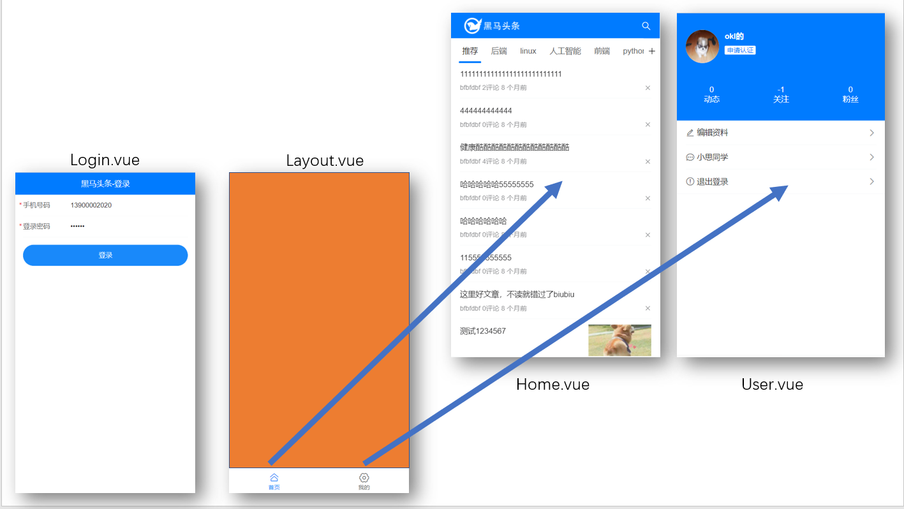
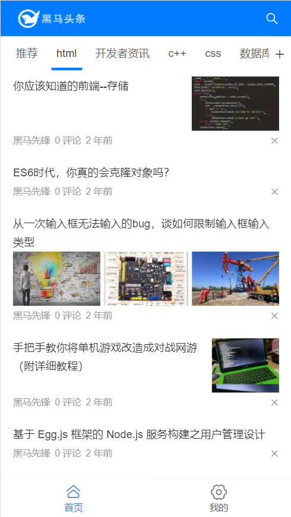
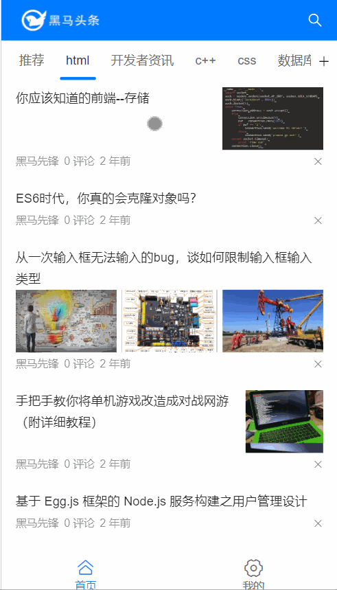
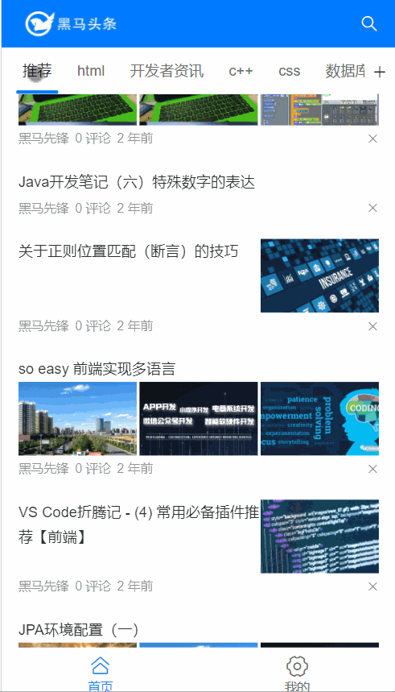

# Day03_首页

## 今日学习目标

* 完成Layout布局和底部导航
* 完成首页布局
* 完成文章列表的铺设
* 学会使用加载更多和刷新组件

## 1.Layout_结构分析

### 目标

* 分析网页结构(Layout布局)
* 分析路由层级

### 思路 - 页面划分

1. Login.vue 和 Layout.vue 是一级路由页面
2. Home.vue和User.vue应该是嵌入在Layout.vue页面里的二级路由页面



### 步骤 - 页面创建

1. 创建Layout/index.vue

   ```vue
   <template>
     <div>
       <!-- 二级路由页面 -->
       <router-view></router-view>
   
       <!-- 下面底部导航 -->
     </div>
   </template>
   
   <script>
   export default {
     name: 'Layout'
   }
   </script>
   
   ```

2. 创建Home/index.vue

3. 创建User/index.vue

### 路由配置

router/index.js - 设置以上3个页面的路由配置

```js
import Vue from 'vue'
import VueRouter from 'vue-router'
import Login from '@/views/Login'
import Layout from '@/views/Layout'
import Home from '@/views/Home'
import User from '@/views/User'

Vue.use(VueRouter)

const routes = [
  {
    path: '/',
    redirect: '/layout' // 这里默认打开首页(layout页下的home)
  },
  {
    path: '/login',
    component: Login
  },
  {
    path: '/layout',
    component: Layout,
    redirect: '/layout/home', // 默认显示二级页面为home首页
    children: [
      {
        path: 'home',
        component: Home
      },
      {
        path: 'user',
        component: User
      }
    ]
  }
]

const router = new VueRouter({
  routes
})

export default router

```

### 小结

1. 二级路由如何配置?

   * 在一级对象里设置children

## 2.Layout_底部导航

### 目标

* TabBar组件使用

  

### 底部导航

1. 查找Vant组件库文档, 全局注册, 在main.js

   ```js
   import { Tabbar, TabbarItem } from 'vant'
   
   Vue.use(Tabbar)
   Vue.use(TabbarItem)
   ```

2. 给Layout页面底部设置TabBar导航

   ```vue
   <template>
     <div>
       <!-- 二级路由页面 -->  
       <router-view></router-view>
       
       <!-- 底部导航 -->  
       <van-tabbar v-model="active" route>
         <van-tabbar-item icon="home-o" to="/layout/home">首页</van-tabbar-item>
         <van-tabbar-item icon="setting-o" to="/layout/user">我的</van-tabbar-item>
       </van-tabbar>
     </div>
   </template>
   
   <script>
   // 需求: 底部导航
   // 1. 复制tabbar组件过来
   // 2. 设置route集成路由功能
   // 3. 设置to属性, 点击跳转路由页面
   // 4. tabbar上设置route和to属性, 点击底部导航就可以切换路由页面
   export default {
     name: 'Layout',
     data () {
       return {
         active: 0
       }
     }
   }
   </script>
   ```
   
3. 美化样式, 给router-view外面, 套一个div.home_container, 并且防止二级页面内容, 被底部导航挡住

   ```vue
   <template>
       <div class="home_container">
           <!-- 二级路由页面 -->  
           <router-view></router-view>
       </div>
   </template>
   
   <style scoped lang="less">
   /* 内容底部内边距(把内容往上挤压, 防止内部被底部导航挡住) */
   .home_container {
     padding-bottom: 50px;
   }
   /* 底部导航上边框 */
   .van-tabbar {
     border-top: 1px solid #f8f8f8;
   }
   </style>
   ```

4. 运行, 测试点击底部导航, 页面是否跳转

### 小结

1. TabBar组件上写什么属性, 集成路由功能?

   * route属性

2. 为何内容要设置底部内边距

   * 防止底部导航挡住内容

## 3.Layout_登录跳转

### 目标

* 登录成功, 跳转到Layout页面

  

### 实现

在Login/index.js内, 登陆成功逻辑处末尾

```js
// 跳转到Layout页面
this.$router.replace({
    path: '/layout'
})
```

### 小结

1. $router和$route区别是?

   * $router下用于跳转路由

   * $route是路由信息对象

2. 路由的push和replace方法区别?

   * push跳转后, 可以返回

   * replace跳转后, 无法返回

## 4.首页_头部标签

### 目标

* 首页头部标签展示

  

### 头部标签

1. 使用NavBar组件, 和图标Icon组件

2. 查找文档, main.js - 全局注册

   > 之前已经注册过NavBar组件(做登录时), 所以这里只注册Icon组件

   ```js
   import { Icon } from 'vant'
   
   Vue.use(Icon)
   ```

3. 分析, 在Home页面头部使用

   > 学生问: 为何不在Layout上面使用?
   >
   > 答案 : 如果使用, 则所有二级页面都有头了, 但实际上只有Home页面头部有

   ```vue
   <template>
     <div>
       <!-- 头部标签 -->
       <van-nav-bar fixed>
         <template #left>
           <!--  -->
           
         </template>
         <template #right>
           <van-icon name="search" size="0.48rem" color="#fff"/>
         </template>
       </van-nav-bar>
     </div>
   </template>
   
   <script>
   import logoPng from '../../assets/toutiao_logo.png'
   export default {
     name: 'Home',
     data () {
       return {
         imgObj: logoPng
       }
     }
   }
   </script>
   
   ```

4. 美化logo的样式

   ```less
   <style scoped lang="less">
   .logo {
       width: 100px;
       height: 30px;
   }
   </style>
   
   ```

### 小结

1. 为何插槽看不见slot标签?

   因为你用的vant组件, 组件内部写好了slot, 你只需要使用即可

2. JS里引入图片为何import

   因为脚手架底层运作是webpack, 图片会认为是模块, 需要模块化导入

## 5.首页_频道铺设

### 目标

* 频道导航铺设


### 布局

1. 文档查找类似组件 - Tab标签页 - main.js注册

   ```js
   import { Tab, Tabs } from 'vant'
   
   Vue.use(Tab)
   Vue.use(Tabs)
   ```

2. 注册组件后, 在首页对应位置使用, 切换动画设置

   ```vue
   <!-- 频道部分 -->
   <van-tabs v-model="active" animated>
     <van-tab title="标签 1">内容 1</van-tab>
     <van-tab title="标签 2">内容 2</van-tab>
     <van-tab title="标签 3">内容 3</van-tab>
     <van-tab title="标签 4">内容 4</van-tab>
   </van-tabs>
   ```

   >  发现:  内容1, 内容2, 内容3, 内容4, 对应的是tab标签下面对应的内容区域(插槽技术)

3. 被定位的头部导航挡住, 给tabs设置固定定位/粘性定位, 距离上边46px(手动转rem)

   ```vue
   <van-tabs
         v-model="active"
         animated
         sticky
         offset-top="1.226667rem"
   >
   ```

4. tab栏内容部分, 也要给tab导航定位留出距离

   ```less
   /* tab内容距离tab导航的距离 */
   /deep/ .van-tabs__content{
       padding-top: 44px;
   }
   ```

### 小结

1. tab组件和内容是什么关系?

   分别一一对应的关系, 分别独立, 互不影响
   
2. 粘性定位是什么?

   正常随着页面滚动, 到达指定位置, 变成固定定位

## 6.首页_频道数据

### 目标

* 频道动态数据铺设

### 定义接口

1. 查看线上接口文档(http://123.57.109.30:8080/), 在api/index.js - 定义接口方法

   > ==如果未登录返回默认频道(新手机号可能只有1个推荐频道)==

   ```js
   // 频道 - 用户已选列表
   export const userChannelAPI = () => request({
     url: '/v1_0/user/channels',
     headers: {
       Authorization: 'Bearer ' + store.state.token
     }
   })
   ```

2. Home/index.vue引入接口方法, created函数中发起请求

   ```js
   import { userChannelAPI } from '@/api'
   
   export default {
       data () {
       	return {
               // ...省略其他
           	channelList: [] // 频道数据
       	}
   	},
       async created () {
   		const res = await userChannelAPI()
   		this.channelList = res.data.data.channels
   	}
   }
   ```

3. 循环铺设频道

   ```vue
   <!-- 频道部分 -->
   <van-tabs v-model="active" animated sticky offset-top="1.226667rem">
       <van-tab v-for="item in channelList" :key="item.id" :title="item.name">
           {{ item.name }}
       </van-tab>
   </van-tabs>
   ```
   
4. 覆盖导航标记条的颜色, styles/cover.less

   ```less
   // Tabs标签页
   @tabs-bottom-bar-color:#007bff;
   ```

### 小结

1. 循环后, 请问tab的内容是一个还是多个?

   循环是分别独立执行的, 每个tab还是对应自己的内容(只不过现在都一样)

2. 登录和未登录返回的频道有什么区别?

   登录就会传递token给后台, 返回对应用户的频道

   未登录后台返回默认的频道

## 7.文章_列表布局(上午结束)

### 目标

* 铺设文章列表
* 组件拆分分析
* ==先不管图片, 迈出一小步==

### 文章列表组件

* 我可以直接把标签, 铺设到Home页面, 但想分散后, 看着结构清晰

  

### 创建ArtileItem组件

1. vant组件库van-cell全局注册

   ```js
   import { Cell } from 'vant'
   
   Vue.use(Cell)
   ```

2. 创建Home/components/ArticleItem.vue文件 ==无vue代码, 复制接着写==

   ```vue
   <template>
     <!-- 一条文章单元格 -->
     <van-cell>
       <!-- 标题区域的插槽 -->
       <template #title>
         <div class="title-box">
           <!-- 标题 -->
           <span>文章标题</span>
         </div>
       </template>
       <!-- label 区域的插槽 -->
       <template #label>
         <div class="label-box">
           <div>
             <span>作者</span>
             <span>0评论</span>
             <span>8个月前</span>
           </div>
           <!-- 反馈按钮 -->
           <van-icon name="cross" />
         </div>
       </template>
     </van-cell>
   </template>
   
   <script>
   export default {}
   </script>
   
   <style scoped lang="less">
   /* 标题样式 */
   .title-box {
     display: flex;
     justify-content: space-between;
     align-items: flex-start;
   }
   
   /* label描述样式 */
   .label-box {
     display: flex;
     justify-content: space-between;
     align-items: center;
   }
   
   /* 文章信息span */
   .label-box span{
       margin: 0 3px;
       &:first-child{
           margin-left: 0;
       }
   }
   </style>
   
   ```

### 创建ArticleList组件

* 创建Home/ArticleList.vue

* 引入ArticleItem.vue组件, 注册, 多使用几次观察效果

  ```vue
  <template>
    <div>
      <!-- 文章列表 -->
      <article-item></article-item>
      <article-item></article-item>
      <article-item></article-item>
    </div>
  </template>
  
  <script>
  import ArticleItem from './components/ArticleItem.vue'
  export default {
    components: {
      ArticleItem
    }
  }
  </script>
  
  ```

### Home页引入

* ArticleList封装后, 要引入到路由页面Home/index.vue才可以看到

  ```vue
  <!-- 频道部分 -->
  <van-tabs v-model="active" 
            animated 
            sticky
            offset-top="1.226667rem">
      <van-tab v-for="item in channelList" 
               :key="item.id" 
               :title="item.name">
          <article-list></article-list>
      </van-tab>
  </van-tabs>
  
  <script>
  // 只有核心代码
  import ArticleList from '@/views/Home/ArticleList'
      
  export default {
      components: {
          ArticleList
      }
  }
  </script>
  
  ```

* 运行后, 观察网页效果是否出现内容一样的文章列表
* ==van-tab有类似于**懒加载**的效果：“只有激活了某个tab标签，才会去加载ArticleList”==

### 小结

1. 文章列表涉及到哪几个组件?

   Home > ArticleList > ArticleItem

## 8.文章_列表数据

### 目标

* 请求文章列表数据
* 铺设动态数据

### 定义接口

* 查看接口文档, 定义接口方法在api下

  预约分页思想:

  第一次传递timestamp: 传递系统时间

  第二次传递timestamp: 用第一次响应结果的pre_timestamp的值

  ```js
  // 文章 - 获取列表
  export const articlesListAPI = ({ channelId }) => {
    return request({
      url: '/v1_0/articles',
      params: {
        channel_id: channelId,
        timestamp: (new Date()).getTime()
      }
    })
  }
  ```

### 发起请求

1. 在Home/ArticleList.vue引入, 并发起请求

   ```vue
   <template>
   	<div>
           <!-- 文章列表 -->
           <article-item></article-item>
           <article-item></article-item>
           <article-item></article-item>
       </div>
   </template>
   
   <script>
       import ArticleItem from './components/ArticleItem.vue'
       import { articlesListAPI } from '@/api'
       export default {
           components: {
               ArticleItem
           },
           async created () {
               const res = await articlesListAPI({
                   channelId: 0 // 默认推荐频道(id为0)
               })
               console.log(res)
           }
       }
   </script>
   ```

### ArticleList循环文章

1. 在ArticleList.vue中, data定义articleList变量接受

2. v-for循环ArticleItem, 传入文章对象

   ```vue
   <template>
   	<div>
           <!-- 文章列表 -->
           <article-item
           	v-for="item in articleList"
           	:key="item.art_id"
           	:obj="item"
           ></article-item>
       </div>
   </template>
   
   <script>
       // 核心代码
       import { articlesListAPI } from '@/api'
       export default {
       data () {
           return {
               articleList: []
           }
       },
       async created () {
           const res = await articlesListAPI({
               channelId: 0 // 默认推荐频道(id为0)
           })
           this.articleList = res.data.data.results
       }
   }
   </script>
   ```

### ArticleItem文章展示

1. 定义props变量obj接收, 从ArticleList传递过来的文章信息对象

2. 替换标签内容

   ```vue
   <template>
   <!-- 一条文章单元格 -->
   <van-cell>
       <!-- 标题区域的插槽 -->
       <template #title>
           <div class="title-box">
               <!-- 标题 -->
               <span>{{ obj.title }}</span>
       </div>
   </template>
   <!-- label 区域的插槽 -->
   <template #label>
   <div class="label-box">
       <div>
           <span>{{ obj.aut_name }}</span>
           <span>{{ obj.comm_count }} 评论</span>
           <span>{{ obj.pubdate }}</span>
       </div>
       <!-- 反馈按钮 -->
       <van-icon name="cross" />
       </div>
   </template>
   </van-cell>
   </template>
   
   <script>
       export default {
           props: {
               obj: { // 文章信息对象
                   type: Object,
                   default () {
                       return {}
                   }
               }
           }
       }
   </script>
   ```

### 小结

1. 铺设文章数据思路是什么?
   * 定义接口方法
   * Home/index.vue引入发起请求
   * 数组传入ArticleList页面
   * 循环ArticleItem, 传入文章对象
   * 在ArticleItem, 使用文章对象替换信息

## 9.文章_图片判断

### 目标

* 文章图片铺设

* 文章图片判断

  

### 分析

1. 什么时候有图片, 什么时候是一张和三张呢?
2. 观察数据字段, 发现有个cover.type的值控制数量
3. cover.images数组, 里面都是图片的url

### 修改ArticleItem

1. 修改标签结构, 添加单图和三图情况的 (==无vue代码直接复制==)

   ```vue
   <template #title>
   	<div class="title-box">
       	<!-- 标题 -->
       	<span>{{ obj.title }}</span>
       	<!-- 单图 -->
       	
       </div>
   	<!-- 三张图片 -->
   	<div class="thumb-box">
       	
           
           
       </div>
   </template>
   ```

2. 美化样式

   ```less
   /* 图片的样式, 矩形黄金比例：0.618 */
   .thumb {
     width: 113px;
     height: 70px;
     background-color: #f8f8f8;
     object-fit: cover;
   }
   
   /* 三图, 图片容器 */
   .thumb-box {
     display: flex;
     justify-content: space-between;
   }
   ```

3. 根据文章信息对象, 判断是否应该出现

4. 替换成真实的图片 / 循环真实图片

   ```vue
   <template #title>
         <div class="title-box">
           <!-- 标题 -->
           <span>{{ obj.title }}</span>
           <!-- 单图 -->
           
           </div>
           <!-- 三张图片 -->
           <div class="thumb-box" v-if="obj.cover.type > 1">
             
           </div>
       </template>
   ```

### 小结

1. 如何区分标签不同的部分

   找到数据区分, 如果没有自己想办法创造 / 与后台沟通分析

## 10.文章_时间处理

### 目标

* 把时间转换成多久之前

### 查找工具

* dayjs第三方库: https://dayjs.fenxianglu.cn/

* 下载dayjs到工程中

  ```js
  yarn add dayjs
  ```

### 工具函数

> 以后可能也要处理时间, 所以封装个工具函数

> 学生问: 为何不使用过滤器
>
> 答: 过滤器本身也是个函数, 而且vue3废弃了过滤器, 所以不使用

utils/date.js

```js
import dayjs from 'dayjs'
import relativeTime from 'dayjs/plugin/relativeTime' // 到指定时间需要的插件
import 'dayjs/locale/zh' // 集成中文

/**
 * .....多久之前
 * @param {*} 之前的时间
 * @returns 系统时间到之前指定时间的距离值
 */
export const timeAgo = (targetTime) => {
  // 格式化时间
  dayjs.extend(relativeTime)
  dayjs.locale('zh')
  var a = dayjs()
  var b = dayjs(targetTime)
  return a.to(b) // 返回多久之前...
}

```

### Home里使用

> 学生问: 为何不到ArticleItem里直接使用
>
> 答: 因为要讲数据预处理

在Home/ArticleList.vue中

```js
import { timeAgo } from '@/utils/date'

export default {
  // 核心代码
  methods: {
    timeAgo: timeAgo
  },
  async created () {
    const res = await articlesListAPI({
      channelId: 0 // 默认推荐频道(id为0)
    })

    // 回来的数据进行预处理, 把时间转成多久多久之前
    res.data.data.results.forEach((obj) => {
      obj.pubdate = this.timeAgo(obj.pubdate)
    })

    this.articleList = res.data.data.results
  }
}
```

### 小结

1. 什么是数据预处理?

   在使用数据之前, 对数据里的值进行修改

## 11.文章_切换数据

### 目标

* 点击频道显示不同数据

  

### 实现

1. 点击频道, 拿到频道ID

   > 频道是用tab 标签页组件, 看文档如何拿到,
   >
   > * 在van-tabs上修改v-model变量名(把active换成channelId)
   > * 在van-tab绑定name属性和值(值为频道ID)
   > * 点van-tab后,name值会自动绑定给v-model(vant组件内部实现的)

   ```vue
   <!-- 频道部分 -->
   <van-tabs v-model="channelId" animated sticky offset-top="1.226667rem">
   	<van-tab v-for="item in channelList" :key="item.id" :title="item.name" :name="item.id">
   		<article-list :cid="channelId"></article-list>
   	</van-tab>
   </van-tabs>
   
   <script>
   export default {
     data () {
       return {
         // ...省略其他(把active换成channelId)
         channelId: 0, // 频道ID(默认0是推荐)
       }
     }
   }
   </script>
   
   ```

2. ArticleList内, props定义变量cid, 替换请求的频道

   > 默认会切换ArticleList, 组件创建后, 会重新进行网络请求

   ```js
   export default {
     // ...核心代码
     props: {
       cid: Number
     },
     async created () {
       const res = await articlesListAPI({
         channelId: this.cid
       })
   
       // 回来的数据进行预处理, 把时间转成多久多久之前
       res.data.data.results.forEach((obj) => {
         obj.pubdate = this.timeAgo(obj.pubdate)
       })
   
       this.articleList = res.data.data.results
     }
   }
   
   ```

### 小结

1. 点击频道切换数据如何做的?

   * 点击频道v-model变量绑定对应name值, 即频道ID
* 然后传给ArticleList, 里面会重新请求频道

## 12.文章列表_加载更多-准备

### 目标

* 手指往上拉, 底部加载更多

  

### 思路

1. 要判断是否滚动到底部
2. 给后台传递页码 / 偏移量, 拿到新数据
3. 和现有数据合并到一个数组里
4. 寻找vant组件, 叫list组件

### 步骤

1. main.js - 注册list组件

   ```js
   import { List } from 'vant'
   
   Vue.use(List)
   ```

2. 套上文章列表组件, 在Home/ArticleList中

   ```vue
   <van-list
         v-model="loading"
         :finished="finished"
         finished-text="没有更多了"
         @load="onLoad"
       >
         <!-- 文章列表 -->
         <article-item
           v-for="item in articleList"
           :key="item.art_id"
           :obj="item"
         ></article-item>
       </van-list>
   ```

3. 定义变量和方法

   ```js
   export default {
     data () {
       return {
         articleList: [], // 文章列表
         loading: false, // 底部加载状态
         finished: false // 数据是否全部加载完成
       }
     },
     methods: {
       // 底部加载
       onLoad () {
   
       }
     }
   }
   
   ```

4. 触底的距离有点远, 查文档, 设置list组件属性offset="50"

   ```vue
   <van-list
         v-model="loading"
         :finished="finished"
         finished-text="没有更多了"
         @load="onLoad"
         offset="50"
       >
   ```

5. 网页刚上来不监测是否触底, 不执行load事件

   > 问题: created和onLoad会分别上来走一次请求, 拿回来2次第一页数据

   ```vue
   <van-list
         v-model="loading"
         :finished="finished"
         finished-text="没有更多了"
         @load="onLoad"
         offset="50"
         :immediate-check="false"
       >
   ```

   

## 13.文章列表_加载更多-功能

### 目标

1. 分析如何拿到下一页数据, 发现接口文档有个timestamp, 说明下一页要用上一次请求成功的pre_timestamp的值

2. Home/ArticleList.vue, data里定义变量nextTime

3. 在文章列表获取成功时, 接收pre_timestamp的值

4. 调用接口传入nextTIme

5. 接收数据合并到现有数组中

6. 判断是否全部加载完成

   > 代码有点多了, 可以单独定义个getArticleList方法调用

### 步骤

1. 修改api接口, 添加额外的时间戳

   ```js
   // 文章 - 获取列表
   export const articlesListAPI = ({ channelId, timestamp }) => {
     return request({
       url: '/v1_0/articles',
       params: {
         channel_id: channelId,
         timestamp: timestamp || (new Date()).getTime()
       }
     })
   }
   ```

2. 创建getArticleList方法, 在created里调用

   ```js
   data () {
       return {
         // ...省略其他
         nextTime: null // 用于加载更多(分页)
       }
   }
   
   methods: {
       async getArticleList () {
         // 负责拿文章列表数据
         const res = await articlesListAPI({
           channelId: this.cid,
           timestamp: this.nextTime
         })
         console.log(res)
         // 回来的数据进行预处理, 把时间转成多久多久之前
         res.data.data.results.forEach((obj) => {
           obj.pubdate = this.timeAgo(obj.pubdate)
         })
   
         // 如果无数据
         if (res.data.data.results.length === 0) {
           this.finished = true // 告诉list组件直接底部显示没有更多数据
         } else {
           this.nextTime = res.data.data.pre_timestamp // 保存下一页数据的时间(做分页用)
           this.articleList = [...this.articleList, ...res.data.data.results]
           // 等待网络请求结果后
           this.loading = false // 底部加载更多状态
         }
       }
   }
   
   async created () {
       this.getArticleList()
   }
   ```

### 小结

1. list组件2个变量控制什么?

   * loading控制底部是否显示加载中状态

   * finished控制底部是否显示全部加载完成

2. list组件使用注意哪几点?

   * list组件触底后, 自动执行load事件和对应onLoad方法, 并把loading值改为true
   * 异步数据加载完毕, 合并数据, 把loading改为false, 以后再让list自动执行load事件
   * 异步数据加载完毕, 判断没有数据了, 把finished改为true, 以后再也不出load事件

3. 为何要把新数组和就数组拆开合并起来?

   * 为了让页面数据更多, 撑高list组件, 让用户继续滚动

## 14.文章列表_加载更多-重复bug

### 目标

1. 发现网络请求上来走了2次一样的
2. 分析原因: list组件和created都走了 (list上来发现组件底部在可视区域, 就触发load事件)
3. 解决: 在load事件方法中判断, 只有页面上有数据, 再触底才执行加载逻辑

### 解决

1. 在ArticleList.vue中判断一下

   ```js
   // 底部加载
   onLoad () {
       // 有第一页数据以后, onLoad再发请求
       if (this.articleList.length > 0) {
           this.getArticleList()
       }
   }
   ```

### 小结

1. 为什么要给onLoad里加入判断?
   * 网页打开list组件自动检查会触发一次onLoad, 而我要在有数据后
   * 再让onLoad里请求数据

## 15.文章列表_下拉刷新

### 目标

* 手指往下拉, 顶部刷新

  

### 思路

1. 实现页面上下拉效果 - vant组件里的list组件
2. 刷新要把旧数组清空, 时间回到系统时间, 重新发起一次请求, 第一页数据

### 步骤

1. 找到Vant组件库文档, main.js - 全局注册PullRefresh组件

   ```js
   import { PullRefresh } from 'vant'
   
   Vue.use(PullRefresh)
   ```

2. 套在要刷新的文章列表外, ==van-list外层==

   ```vue
   <van-pull-refresh v-model="isLoading" @refresh="onRefresh">
         <van-list
           v-model="loading"
           :finished="finished"
           finished-text="没有更多了"
           @load="onLoad"
           offset="50"
         >
           <!-- 文章列表 -->
           <article-item
             v-for="item in articleList"
             :key="item.art_id"
             :obj="item"
           ></article-item>
         </van-list>
       </van-pull-refresh>
   ```

3. 定义变量和方法

   ```js
   export default {
       data () {
           return {
               // ...省略了其他变量(不要删除啊)
               isLoading: false // 顶部刷新状态
           }
       },
       methods: {
           // 顶部刷新事件方法
           onRefresh () {
               this.nextTime = null
         		this.articleList = []
         		this.getArticleList()
           }
       }
   }
   ```

4. 一定注意, 数据异步刷新完毕, 要关闭isLoading状态

   ```js
   this.isLoading = false // 顶部加载状态关闭
   ```

### 小结

1. 刷新的原理是什么?

   * 获取手指移动距离, 然后transform移动标签

2. 刷新流程是什么?

   * 页码回到第一页, 现有数据数组清空, 重新调用获取文章接口

## 扩展-自己写多久之前

```js
relativeTime (val) {
      const t = new Date(val)
      const diff = Date.now() - t.getTime()

      const year = Math.floor(diff / (1000 * 3600 * 24 * 365))
      if (year) {
        return `${year}年前`
      }
      const month = Math.floor(diff / (1000 * 3600 * 24 * 30))
      if (month) {
        return `${month}月前`
      }
      const day = Math.floor(diff / (1000 * 3600 * 24))
      if (day) {
        return `${day}天前`
      }
      const hour = Math.floor(diff / (1000 * 3600))
      if (hour) {
        return `${hour}小时前`
      }
      const minute = Math.floor(diff / (1000 * 60))
      if (minute) {
        return `${minute}分钟前`
      } else {
        return '刚才'
      }
    }
```

