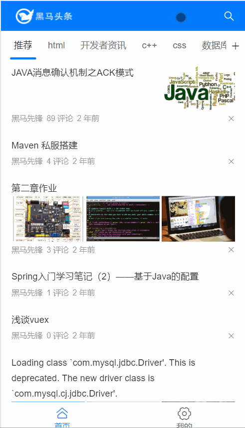
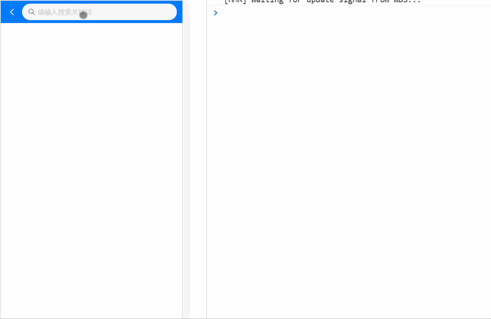
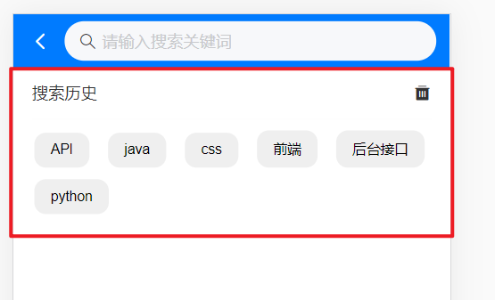
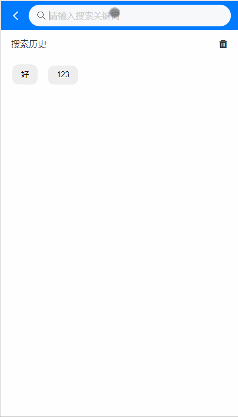
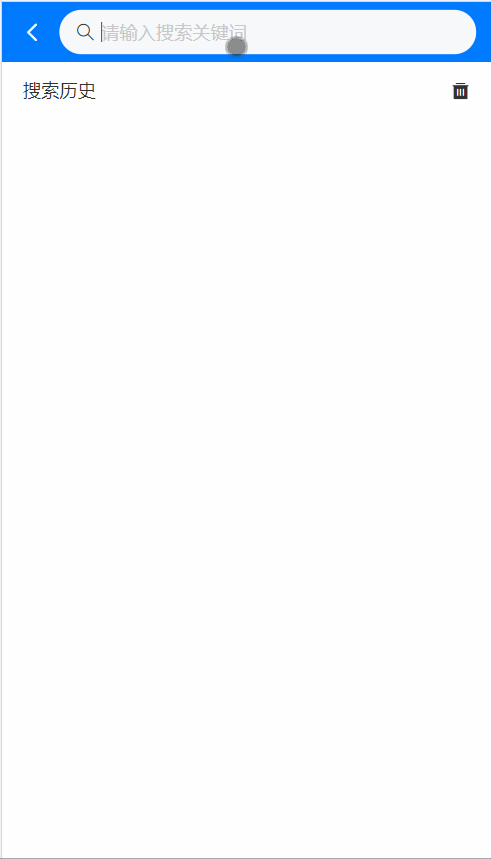
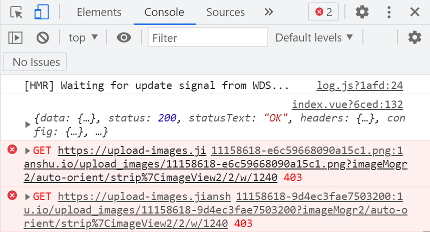
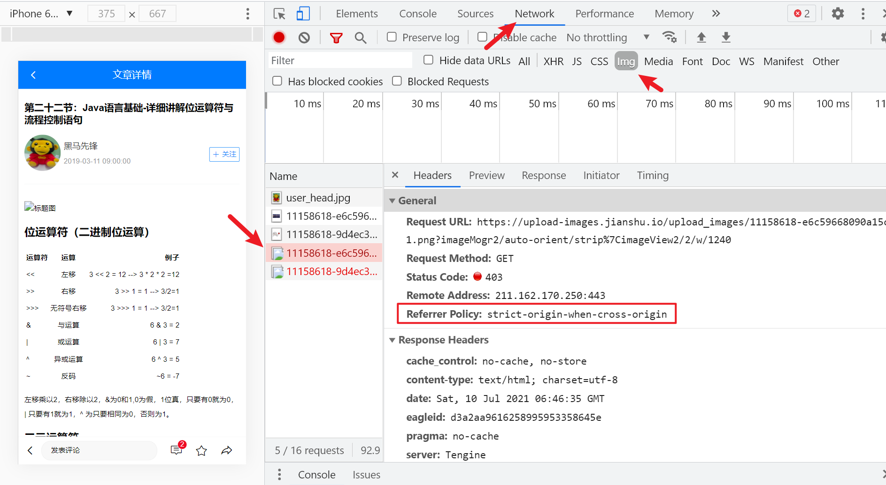

# Day04_文章搜索和详情

## 1.文章搜索_页面和路由

### 目标

* 准备文章搜索页面和路由

  

### 步骤

1. views/Search/index.vue - 新建页面和标签

   ```vue
   <template>
     <div>
       <!-- 搜索页面头部 -->
       <div class="search-header">
         <!-- 后退按钮 -->
         <van-icon name="arrow-left" color="white" size="0.48rem" class="goback" @click="$router.back()"/>
         <!-- 搜索组件 -->
         <van-search placeholder="请输入搜索关键词" background="#007BFF" shape="round" />
       </div>
     </div>
   </template>
   
   <script>
   export default {
     data () {
       return {
         kw: '' // 搜索关键字
       }
     }
   }
   </script>
   
   <style scoped lang="less">
   .search-header {
     height: 46px;
     display: flex;
     align-items: center;
     background-color: #007bff;
     overflow: hidden;
     /*后退按钮*/
     .goback {
       padding-left: 14px;
     }
     /*搜索组件*/
     .van-search {
       flex: 1;
     }
   }
   </style>
   
   ```

2. 配置路由 - 与layout并列关系

   ```js
   import Search from '@/views/Search'
   
   const routes = [
     // ...
     {
       path: '/search',
       component: Search
     }
   ]
   
   const router = new VueRouter({
     routes
   })
   
   export default router
   
   ```

3. 点击Home页面右上角搜索图标, 可以切换路由到搜索页面

   ```vue
   <template #right>
   <van-icon name="search" size="0.48rem" color="#fff" @click="$router.push('/search')"/>
   </template>
   ```

### 小结

1. 分析页面结构, 创建搜索页面和路由地址

## 2.文章搜索_自动聚焦指令

### 目标

* 输入框自动聚焦效果

* 封装全局自定义指令

* Vue.use插件方式注入

  

### 自定义指令-封装

1. utils/directives.js, 定义全局自定义指令插件

   ```js
   import Vue from 'vue'
   // 插件对象(必须有install方法, 才可以注入到Vue.use中)
   export default {
     install () {
       Vue.directive('fofo', {
         inserted (el) {
           // 指令在van-search组件身上, 获取的是组件根标签div, 而input在标签内
           el = el.querySelector('input')
           el.focus()
         }
       })
     }
   }
   
   ```

2. 引入到main.js注册

   ```js
   import diretivesObj from '@/utils/directives'
   
   Vue.use(diretivesObj)
   ```

   > Vue.use相关文档: https://cn.vuejs.org/v2/api/#Vue-use

3. 去van-search上使用

   ```vue
   <!-- 搜索组件 -->
   <van-search v-fofo placeholder="请输入搜索关键词" background="#007BFF" shape="round" />
   ```

### 小结

1. 自定义指令的inserted何时执行?
   * 当指令所在组件, 第一次插入到真实DOM被调用

## 3.文章搜索_输入框防抖

### 目标

* 用户只想要最后一次结果

* 减少无用的触发逻辑代码执行

  

### 步骤

1. van-search关联kw变量

   ```vue
   <van-search v-fofo v-model="kw" placeholder="请输入搜索关键词" background="#007BFF" shape="round" />
   ```

2. 在data中声明变量timer, 保存延迟定时器

   ```js
   data () {
       return {
           kw: '', // 搜索关键字
           timer: null // 防抖, 用的定时器
       }
   }
   ```

3. 监听输入框的@inupt事件, 在事件处理函数中使用防抖操作

   ```vue
   <van-search v-fofo v-model="kw" placeholder="请输入搜索关键词" background="#007BFF" shape="round" @input="inputFn"/>
   
   <script>
       methods: {
           inputFn () {
               clearTimeout(this.timer)
               this.timer = setTimeout(() => {
                   if (this.kw.length === 0) return // 防止空内容触发下面逻辑
                   console.log(this.kw)
               }, 500)
           }
       }
   </script>
   
   ```

### 小结

1. 什么是防抖?
   * 降低逻辑代码触发频率
   * 只要最后一次执行即可
   * 如果中间再次触发, 重新弄个计时器倒计时

## 4.文章搜索_搜索建议列表

### 目标

* 准备标签和样式

* 寻找接口定义api方法

* 搜索文字出现, 铺设联想菜单

  

  

### 步骤

1. 准备标签

   ```vue
   <!-- 搜索建议列表 -->
   <div class="sugg-list">
       <div class="sugg-item" >
           搜索建议
       </div>
   </div>
   ```

2. 美化样式

   ```less
   /*搜索建议列表样式 */
   .sugg-list {
     .sugg-item {
       padding: 0 15px;
       border-bottom: 1px solid #f8f8f8;
       font-size: 14px;
       line-height: 50px;
       // 实现省略号的三行代码
       white-space: nowrap;
       overflow: hidden;
       text-overflow: ellipsis;
     }
   }
   ```

3. 定义接口方法

   ```js
   // 搜索 - 联想菜单
   export const suggestListAPI = ({ q }) => {
     return request({
       url: '/v1_0/suggestion',
       params: {
         q: q
       }
     })
   }
   ```

4. 在Search/index.vue使用, 把数据保存到data里的变量中

   ```js
   import { suggestListAPI } from '@/api'
   
   export default {
     data () {
       return {
         kw: '', // 搜索关键字
         timer: null, // 防抖, 用的定时器
         suggestList: [] // 建议关键字列表
       }
     },
     methods: {
       async inputFn () {
         clearTimeout(this.timer)
         this.timer = setTimeout(async () => {
           if (this.kw.length === 0) return // 防止空内容触发下面逻辑
           const res = await suggestListAPI({
             q: this.kw
           })
           this.suggestList = res.data.data.options
         }, 500)
       }
     }
   }
   
   ```

5. 渲染循环到页面上

   ```vue
   <!-- 搜索建议列表 -->
   <div class="sugg-list">
       <div class="sugg-item" v-for="(str, index) in suggestList" :key="index" v-html="lightFn(str, kw)"></div>
   </div>
   ```

### 小结

1. 什么是联想菜单?
   * 当你输入关键字, 提示你要搜索的关键词

## 5.文章搜索_关键字高亮

### 目标

* 联想菜单推荐的词语关键字高亮

  

### 步骤

1. 定义高亮方法utils/str.js - 封装

   ```js
   /**
    * 转换高亮文字的方法
    * @param {*} str 要被处理的字符串
    * @param {*} target 要匹配关键字
    * @returns 处理后带标签高亮的方法
    */
   export const lightFn = (str, target) => {
     const reg = new RegExp(target, 'ig')
   
     return str.replace(reg, (match) => { // match是关键字匹配的值(尽量保持原样)
       return `<span style="color: red">${match}</span>`
     })
   }
   
   ```

2. 导入到vue组件页面, 注册, 使用

   ```vue
   <template>
     <div>
       <!-- 搜索页面头部 -->
       
       <!-- 搜索建议列表 -->
       <div class="sugg-list" v-for="(str, index) in suggestList" :key="index">
         <div class="sugg-item" v-html="lightFn(str, kw)"></div>
       </div>
     </div>
   </template>
   
   <script>
   import { lightFn } from '@/utils/str'
   export default {
     methods: {
       lightFn // key和value变量名同名
     }
   }
   </script>
   
   ```


### 小结

1. 关键字高亮如何做?

   用replace方法+正则+文字替换span带样式的标签

## 6.文章搜索_历史铺设

### 目标

* 搜索历史铺设

​	

### 步骤

1. 定义初始变量

   ```js
   history: ['API', 'java', 'css', '前端', '后台接口', 'python'] // 搜索历史
   ```

2. 准备标签DOM结构

   ```vue
   <!-- 搜索历史 -->
   <div class="search-history">
       <!-- 标题 -->
       <van-cell title="搜索历史">
           <!-- 使用 right-icon 插槽来自定义右侧图标 -->
           <template #right-icon>
   			<van-icon name="delete" class="search-icon" />
           </template>
       </van-cell>
   
       <!-- 历史列表 -->
       <div class="history-list">
           <span class="history-item">历史文字</span>
       </div>
   </div>
   ```
   
3. 美化样式

   ```less
   /**搜索历史 */
   .search-icon {
     font-size: 16px;
     line-height: inherit;
   }
   
   .history-list {
     padding: 0 10px;
     .history-item {
       display: inline-block;
       font-size: 12px;
       padding: 8px 14px;
       background-color: #efefef;
       margin: 10px 8px 0px 8px;
       border-radius: 10px;
     }
   }
   ```

4. 循环铺设

   ```vue
   <!-- 历史列表 -->
   <div class="history-list">
       <span class="history-item" v-for="str, index in history" :key="index">{{ str }}	</span>
   </div>
   ```

5. 互斥条件, 搜索列表

   ```vue
   <!-- 搜索建议列表 -->
   <div class="sugg-list" v-if="kw.length !== 0">
   
   </div>
   
   <!-- 搜索历史 -->
   <div class="search-history" v-else>
   
   </div>
   ```

### 小结

1. 如果暂无后台接口数据, 怎么办?
   * 先写一个固定数据, 循环出标签和样式
   * 以后有接口数据再替换

## 7.文章搜索_结果页

### 目标

* 输入框回车后, 跳转到搜索结果页

* 点击联想菜单项后, 跳转到搜索结果页

* 点击历史记录, 跳转到搜索结果页

  

### 步骤

1. 定义搜索结果页面Search/SearchResult.vue - 并且配置路由

   ```vue
   <template>
       <div>
         <!-- 搜索结果页-头部导航 -->
         <div class="search-result-container">
           <!-- 点击实现后退效果 -->
           <van-nav-bar
             title="搜索结果"
             left-arrow
             @click-left="$router.go(-1)"
             fixed
           />
         </div>
       </div>
   </template>
   
   <script>
   export default {
     name: 'SearchResult'
   }
   </script>
   
   <style lang="less" scoped>
   .search-result-container {
     padding-top: 46px;
   }
   </style>
   
   ```

2. 返回箭头颜色到cover.css里定制成白色即可

   ```less
   @nav-bar-icon-color: white;
   ```

3. 路由配置

   ```js
   import SearchResult from '@/views/Search/SearchResult'
   
   {
       path: '/search/:keywords',
       component: SearchResult
   }
   ```

4. Search/index.vue - 回车跳转传参

   ```vue
   <van-search
               v-fofo
               v-model="kw"
               placeholder="请输入搜索关键词"
               background="#007BFF"
               shape="round"
               @input="inputFn"
               @search="enterFn"
               />
   
   <script>
       methods: {
           // 输入框回车
           enterFn () {
               this.$router.push({
                   path: `/search/${this.kw}`
               })
           }
       }
   </script>
   
   ```

5. Search/index.vue - 联想菜单项, 点击跳转传参

   ```vue
   <div class="sugg-list" v-if="kw.length !== 0">
       <div
            class="sugg-item"
            v-for="(str, index) in suggestList"
            :key="index"
            v-html="lightFn(str, kw)"
            @click="clickFn(str)"
            ></div>
   </div>
   
   <script>
       methods: {
           // 建议列表点击
           clickFn (str) {
               this.$router.push({
                   path: `/search/${str}`
               })
           }
       }
   </script>
   ```

6. 点击历史记录, 跳转结果页

   ```vue
   <!-- 历史列表 -->
   <div class="history-list">
       <span
             class="history-item"
             v-for="(str, index) in history"
             :key="index"
             @click="hisClickFn(str)"
             >{{ str }}</span>
   </div>
   
   <script>
   	methods: {
           // 历史记录点击
           hisClickFn (str) {
             this.$router.push({
               path: `/search/${str}`
             })
           }
       }
   </script>
   ```

### 小结

1. 搜索结果是路由面面, 重新配置页面
2. 跳转传参在路径上传递(动态路由)

## 8.文章搜索_历史存储和清空(上午结束)

### 目标

* 输入框按回车, 保存搜索词值

* 点联想菜单的项, 保存菜单项值

  

### 步骤

1. 在输入框回车确认事件中, 录入搜索关键字

   ```js
   this.history.push(this.kw) // 保存搜索关键字
   ```

2. 在点击联想菜单项, 录入搜索关键字

   ```js
   this.history.push(str) // 保存搜索关键字
   ```

3. 问题1: 发现回来history数组里并未渲染历史列表

   > 因为跳转页面, 原来页面被释放了, 回来后数组重新创建
   >
   > 解决: 本地缓存起来

   ```js
   watch: {
       history () {
           localStorage.setItem('his', JSON.stringify(this.history))
       }
   }
   ```

4. 刚打开默认从本地获取history数组的值

   ```js
   history: JSON.parse(localStorage.getItem('his')) || [] // 搜索历史
   ```

5. 问题2: 但是发现跳转后, 并未保存到本地(==原因: 先跳转了, watch还未来的及执行==)

   > 给路由跳转加个定时器(最后执行)

   ```js
   // 输入框回车
   enterFn () {
       this.history.push(this.kw) // 保存搜索关键字
       setTimeout(() => {
           this.$router.push({
               path: `/search/${this.kw}`
           })
       })
   },
       
   // 建议列表点击
   clickFn (str) {
   	this.history.push(str) // 保存搜索关键字
       setTimeout(() => {
       	this.$router.push({
       		path: `/search/${str}`
           })
       })
   }
   ```

6. 但是发现有重复的关键字, 需要数组去重技术 - 可以用Set集合类型

   > 在回车和点击事件push方法下写, 不要写到watch里, 否则造成递归

   ```js
   this.history = Array.from(new Set(this.history)) // 去重
   ```

7. 点击删除小图标, 清空搜索历史

   ```vue
   <!-- 标题 -->
   <van-cell title="搜索历史">
       <!-- 使用 right-icon 插槽来自定义右侧图标 -->
       <template #right-icon>
   		<van-icon name="delete" class="search-icon" @click="clearFn"/>
       </template>
   </van-cell>
   
   <script>
   	methods: {
           // 清空搜索历史
           clearFn () {
             this.history = [] // watch会触发, 把空数组保存到本地
           }
       }
   </script>
   
   ```

### 小结

1. 监测输入框的搜索事件, 添加到history数组里
2. 监测联想菜单的点击事件, 添加到history数组里
3. watch监测history变化, 存储到本地
4. history默认初始值, 从本地提取出来

## 9.文章搜索_结果列表铺设

### 目标

* 把搜索结果数据准备好

* 结果列表铺设

  

### 步骤

1. 定义搜索结果列表接口

   ```js
   // 搜索 - 结果列表
   export const searchResultListAPI = ({ q, page = 1 }) => {
     return request({
       url: '/v1_0/search',
       params: {
         q,
         page
       }
     })
   }
   ```

2. 在Search/SearchResult.vue中 接收路由参数, 然后 调用接口拿到搜索结果列表数据

   ```js
   import { searchResultListAPI } from '@/api'
   
   export default {
     name: 'SearchResult',
     async created () {
       const res = await searchResultListAPI({
         q: this.$route.params.keywords // 拿到关键词, keywords来源于router/index.js你定义的动态路由参数名
       })
       console.log(res)
     }
   }
   ```

3. Search/SearchResult.vue - 标签准备 - 复用components/ArticleItem.vue 

   > 可以考虑, 把Home/components/ArticleItem 挪到全局公共组件src/components文件夹下

   ```vue
   <!-- 搜索结果 -->
   <div>
       <article-item></article-item>
   </div>
   
   <script>
   import ArticleItem from '@/components/ArticleItem'
       
   export default {
     components: {
       ArticleItem
     }
   }
   </script>
   ```

4. SearchResult.vue - 接收数据, 循环文章单元格, 传入文章对象 - 查看效果

   ```vue
   <template>
     <div>
       <!-- 搜索结果页-头部导航 -->
         
       <!-- 搜索结果 -->
       <div>
           <article-item v-for="obj in articleList" :key="obj.art_id" :obj="obj"></article-item>
       </div>
     </div>
   </template>
   
   <script>
   import { timeAgo } from '@/utils/date'
   export default {
     data () {
       return {
         articleList: [] // 文章数据
       }
     },
     async created () {
       const res = await searchResultListAPI({
         q: this.$route.params.keywords // 拿到关键词, keywords来源于router/index.js你定义的动态路由参数名
       })
       console.log(res)
       // 数据预处理
       res.data.data.results.forEach(obj => {
         obj.pubdate = timeAgo(obj.pubdate)
       })
       this.articleList = res.data.data.results
     }
   }
   </script>
   
   ```

### 小结

* 根据关键字调用接口, 拿到搜索结果
* 复用之前文章组件(ArticleItem)即可

## 10.文章搜索_上拉加载更多

### 目标

* 集成触底加载更多数据功能

  

### 步骤

1. 准备van-list组件和变量以及方法, 单独定义个getSearchResultFn方法

   ```vue
   <template>
     <div>
       <!-- 搜索结果页-头部导航 -->
   
       <!-- 搜索结果 -->
       <div>
         <van-list
           v-model="loading"
           :finished="finished"
           finished-text="没有更多了"
           @load="onLoad"
           :immediate-check="false"
           offset="50"
         >
           <article-item
             v-for="obj in articleList"
             :key="obj.art_id"
             :obj="obj"
           ></article-item>
         </van-list>
       </div>
     </div>
   </template>
   
   <script>
   export default {
     data () {
       return {
         articleList: [], // 文章数据
         loading: false, // 加载状态
         finished: false // 全部加载完成状态
       }
     },
     methods: {
       // 触底加载更多
       onLoad () {
   
       },
       // 获取搜索结果
       async getSearchResultFn () {
         const res = await searchResultListAPI({
           q: this.$route.params.keywords // 拿到关键词, keywords来源于router/index.js你定义的动态路由参数名
         })
         console.log(res)
         // 数据预处理
         res.data.data.results.forEach((obj) => {
           obj.pubdate = timeAgo(obj.pubdate)
         })
         this.articleList = res.data.data.results
       }
     },
     created () {
       this.getSearchResultFn()
     }
   }
   </script>
   ```

2. 在onLoad触发的网络请求函数中

   * 接口已经准备好, page传参
   * data变量里定义page: 1
   * onLoad方法中判断现在有数据, page++, 发请求

   ```js
   export default {
     data () {
       return {
         articleList: [], // 文章数据
         loading: false, // 加载状态
         finished: false, // 全部加载完成状态
         page: 1 // 页码
       }
     },
     methods: {
       // 触底加载更多
       onLoad () {
         if (this.articleList.length > 0) {
           this.page++
           this.getSearchResultFn()
         }
       },
       // 获取搜索结果
       async getSearchResultFn () {
         const res = await searchResultListAPI({
           q: this.$route.params.keywords, // 拿到关键词, keywords来源于router/index.js你定义的动态路由参数名
           page: this.page
         })
         console.log(res)
         // 更多数据判断
         if (res.data.data.results.length === 0) {
           this.finished = true
           return
         }
   
         // 数据预处理
         res.data.data.results.forEach((obj) => {
           obj.pubdate = timeAgo(obj.pubdate)
         })
   
         // 合并数据
         this.articleList = [...this.articleList, ...res.data.data.results]
         this.loading = false
       }
     }
   }
   
   ```

### 小结

1. van-list组件使用
2. 把官网那句话截图, 按照流程来做即可

## 11.详情_页面创建

### 目标

* 文章详情页创建和路由

  

### 步骤

1. 创建页面views/ArticleDetail/index.vue

   ```vue
   <template>
     <div>
       <!-- Header 区域 -->
       <van-nav-bar fixed title="文章详情" left-arrow @click-left="$router.back()" />
   
       <!-- 文章信息区域 -->
       <div class="article-container">
         <!-- 文章标题 -->
         <h1 class="art-title">小程序</h1>
   
         <!-- 用户信息 -->
         <van-cell center title="张三" label="3天前">
           <template #icon>
             
           </template>
           <template #default>
             <div>
               <van-button type="info" size="mini">已关注</van-button>
               <van-button icon="plus" type="info" size="mini" plain>关注</van-button>
             </div>
           </template>
         </van-cell>
   
         <!-- 分割线 -->
         <van-divider></van-divider>
   
         <!-- 文章内容 -->
         <div class="art-content">好好学习, 天天向上</div>
   
         <!-- 分割线 -->
         <van-divider>End</van-divider>
   
         <!-- 点赞 -->
         <div class="like-box">
           <van-button icon="good-job" type="danger" size="small">已点赞</van-button>
           <van-button icon="good-job-o" type="danger" plain size="small">点赞</van-button>
         </div>
       </div>
     </div>
   </template>
   
   <script>
   export default {
   
   }
   </script>
   
   <style scoped lang="less">
   .article-container {
     padding: 10px;
     margin-top: 46px;
   }
   .art-title {
     font-size: 16px;
     font-weight: bold;
     margin: 10px 0;
   }
   
   .art-content {
     font-size: 12px;
     line-height: 24px;
     width: 100%;
     overflow-x: scroll;
     word-break: break-all;
       /deep/ img{
       	width: 100%;
     	}
       /deep/ pre {
           white-space: pre-wrap;
           word-wrap: break-word;
       }
   }
   
   .van-cell {
     padding: 5px 0;
     &::after {
       display: none;
     }
   }
   
   .avatar {
     width: 60px;
     height: 60px;
     border-radius: 50%;
     background-color: #f8f8f8;
     margin-right: 5px;
     border: none;
   }
   
   .like-box {
     display: flex;
     justify-content: center;
   }
   </style>
   
   ```

2. 注册分割线组件, 在main.js

   ```js
   import { Divider } from 'vant'
   Vue.use(Divider)
   ```

3. 在路由里配置好

   ```js
   import ArticleDetail from '@/views/ArticleDetail'
   
   const routes = [
     // ...
     {
       path: '/article_detail',
       component: ArticleDetail
     }
   ]
   
   ```

## 12.详情_跳转和x区分

### 目标

* 首页点击文章, 跳转详情
* 搜索结果点击, 跳转详情
* x号首页有, 搜索结果没有

### 步骤

1. 在SearchResult.vue里的文章单元格article-item组件上点击跳转

   > ==注意, ArticleItem是组件, 包括Vant的都是组件, 组件身上的事件都是自定义事件(别看是叫click)==
   >
   > 组件内需要$emit('click')才会执行
   >
   > 解决: 给组件绑定原生的点击事件@click.native  (使用修饰符)

   ```vue
   <article-item
                 v-for="obj in articleList"
                 :key="obj.art_id"
                 :obj="obj"
                 @click.native="$router.push(`/article_detail?aid=${obj.art_id}`)"
                 ></article-item>
   ```

2. 在Home/ArticleList.vue的ArticleItem也点击跳转, 同样方式传参

   ```vue
   <!-- 文章列表 -->
   <article-item
                 v-for="item in articleList"
                 :key="item.art_id"
                 :obj="item"
                 @dislike="dislikeFn"
                 @reports="reportsFn"
                 @click.native="$router.push(`/article_detail?aid=${item.art_id}`)"
                 ></article-item>
   ```

3. 首页x, 点击也跳转详情了, 原因: 事件冒泡, 解决

   在src/components/ArticleItem, 阻止x的事件冒泡

   ```vue
   <!-- 反馈按钮 -->
   <van-icon name="cross" @click.stop="onCloseClick" />
   ```

4. 搜索结果页, 文档单元格不应该有x

   > 所以给ArticleItem传入布尔值, 使用组件时, 控制是否显示

   components/ArticleItem.vue

   ```vue
   <!-- 反馈按钮 -->
   <van-icon name="cross" @click.stop="onCloseClick" v-if="showX"/>
   
   <script>
       props: {
           showX: {
               type: Boolean,
               default: true // 默认显示
           }
       }          
   </script>
   
   ```

5. 默认显示, 那在Search/SearchResult.vue, 传入false即可

   ```vue
   <article-item
                 v-for="obj in articleList"
                 :key="obj.art_id"
                 :obj="obj"
                 @click.native="$router.push(`/article_detail?aid=${obj.art_id}`)"
                 :showX="false"
                 ></article-item>
   ```

### 小结

1. 需要区分时, 可以让使用者传入一个值控制

2. 事件冒泡, 触发事件的标签会逐级向父级传递这个事件

   > 传递过程中, 有人实现了这个事件处理函数, 则执行

## 13.详情_数据渲染

### 目标

* 文章详情数据渲染

### 步骤

1. 在api/index.js - 定义接口

   ```js
   // 文章 - 详情
   export const articleDetailAPI = ({ id }) => {
     return request({
       // :id是后台规定的参数名
       // 前端要在对应路径位置传值(不要写:)
       url: `/v1_0/articles/${id}`
     })
   }
   ```

2. ArticleDetail.vue中 - 调用接口拿到文章详情数据, 并保存到data变量上

   ```js
   import { articleDetailAPI } from '@/api'
   export default {
     async created () {
       const res = await articleDetailAPI(this.$route.params.art_id)
       console.log(res)
     }
   }
   ```

3. 把数据铺设到页面上

   ```vue
   <template>
     <div>
       <!-- Header 区域 -->
       <van-nav-bar
         fixed
         title="文章详情"
         left-arrow
         @click-left="$router.back()"
       />
   
       <!-- 文章信息区域 -->
       <div class="article-container">
         <!-- 文章标题 -->
         <h1 class="art-title">{{ artObj.title }}</h1>
   
         <!-- 用户信息 -->
         <van-cell center :title="artObj.aut_name" :label="artObj.pubdate">
           <template #icon>
             
           </template>
           <template #default>
             <div>
               <van-button
                 type="info"
                 size="mini"
                 v-if="artObj.is_followed"
                 >已关注</van-button
               >
               <van-button
                 icon="plus"
                 type="info"
                 size="mini"
                 plain
                 v-else
                 >关注</van-button
               >
             </div>
           </template>
         </van-cell>
   
         <!-- 分割线 -->
         <van-divider></van-divider>
   
         <!-- 文章内容 -->
         <div class="art-content" v-html="artObj.content"></div>
   
         <!-- 分割线 -->
         <van-divider>End</van-divider>
   
         <!-- 点赞 -->
         <div class="like-box">
           <van-button
             icon="good-job"
             type="danger"
             size="small"
             v-if="artObj.attribute === 1"
             >已点赞</van-button
           >
           <van-button v-else icon="good-job-o" type="danger" plain size="small"
             >点赞</van-button
           >
         </div>
       </div>
     </div>
   </template>
   
   <script>
   import { articleDetailAPI } from '@/api'
   export default {
     data () {
       return {
         artObj: {} // 文章对象
       }
     },
     async created () {
       const res = await articleDetailAPI({
         id: this.$route.query.aid
       })
       console.log(res)
       this.artObj = res.data.data
     }
   }
   </script>
   
   ```

### 小结

1. 详情页的文章id, 从路由的query参数里拿到

## 14.详情_作者-关注和取关

### 目标

* 作者的关注

* 作者的取关

  

### 步骤

1. 先实现前端效果, 先别考虑接口

   * 给2个按钮绑定相同方法, 传入布尔值区分
   * 修改对象属性, 影响页面显示按钮

   ```vue
   <van-button
               type="info"
               size="mini"
               v-if="artObj.is_followed"
               @click="followedFn(false)"
               >已关注</van-button>
   <van-button
               icon="plus"
               type="info"
               size="mini"
               plain
               v-else
               @click="followedFn(true)"
               >关注</van-button>
   
   <script>
       // 作者关注/取关
       async followedFn (bool) {
           if (bool === true) { // 用户点了关注按钮
               // 业务: 关注用户
               // 显示: 已关注按钮
               this.artObj.is_followed = true
           } else { // 用户点了已关注按钮身上
               // 业务: 取消关注用户
               // 显示: 关注按钮
               this.artObj.is_followed = false
           }
       }
   </script>
   ```

2. 定义接口方法

   ```js
   // 文章 - 关注作者
   export const followedUserAPI = ({ target }) => {
     return request({
       url: '/v1_0/user/followings',
       method: 'POST',
       data: {
         target: target
       }
     })
   }
   // 文章 - 取消关注作者
   export const unFollowedUserAPI = ({ uid }) => {
     return request({
       // 这uid只是个变量名, 把值拼接在url发给后台(无需指定参数名)
       url: `/v1_0/user/followings/${uid}`,
       method: 'DELETE'
     })
   }
   ```

3. 在follwedFn方法, 调用接口

   ```js
   import { followedUserAPI, unFollowedUserAPI } from '@/api'
   
   // 作者关注/取关
   async followedFn (bool) {
       if (bool === true) {
           // 用户点了关注按钮
           // 业务: 关注用户
           // 显示: 已关注按钮
           this.artObj.is_followed = true
           await followedUserAPI({
               target: this.artObj.aut_id
           })
       } else {
           // 用户点了已关注按钮身上
           // 业务: 取消关注用户
           // 显示: 关注按钮
           this.artObj.is_followed = false
           await unFollowedUserAPI({
               uid: this.artObj.aut_id
           })
       }
   }
   ```

### 小结

1. 属性值控制哪个按钮显示
2. 点击要的业务, 对应业务接口

## 15.详情_文章-点赞和取赞

### 目标

* 实现文章点赞

* 实现文章取消点赞功能

  

### 步骤

1. 还是先实现前端效果, 不考虑接口

   ```vue
   <!-- 点赞 -->
   <div class="like-box">
       <van-button
                   icon="good-job"
                   type="danger"
                   size="small"
                   v-if="artObj.attitude === 1"
                   @click="loveFn(false)"
                   >已点赞</van-button>
       <van-button
                   v-else
                   @click="loveFn(true)"
                   icon="good-job-o"
                   type="danger"
                   plain
                   size="small"
                   >点赞</van-button>
   </div>
   
   <script>
   	// 文章点赞/取消点赞
       async loveFn (bool) {
         if (bool === true) { // 用户点在了点赞按钮上
           // 业务 => 点赞文章
           // 显示 => 已点赞按钮
           this.artObj.attitude = 1
         } else { // 用户点在了已点赞按钮上
           // 业务 => 取消点赞文章
           // 显示 => 点赞按钮
           this.artObj.attitude = -1
         }
       }
   </script>
   ```

2. 接口定义

   ```js
   // 文章 - 点赞
   export const articleLikeAPI = ({ target }) => {
     return request({
       url: '/v1_0/article/likings',
       method: 'POST',
       data: {
         target: target
       }
     })
   }
   
   // 文章 - 取消点赞
   export const articleDisLikeAPI = ({ artId }) => {
     return request({
       url: `/v1_0/article/likings/${artId}`,
       method: 'DELETE'
     })
   }
   ```

3. 在业务判断里, 调用接口更新给后台状态

   ```js
   import { articleLikeAPI, articleDisLikeAPI } from '@/api'
   
   // 文章点赞/取消点赞
   async loveFn (bool) {
       if (bool === true) { // 用户点在了点赞按钮上
           // 业务 => 点赞文章
           // 显示 => 已点赞按钮
           this.artObj.attitude = 1
           await articleLikeAPI({
               target: this.$route.query.aid
           })
       } else { // 用户点在了已点赞按钮上
           // 业务 => 取消点赞文章
           // 显示 => 点赞按钮
           this.artObj.attitude = -1
           await articleDisLikeAPI({
               artId: this.$route.query.aid
           })
       }
   }
   ```

### 小结

1. 先实现页面交互效果
2. 再根据逻辑分别调用后台接口

## 16.详情_图片防盗链

### 目的

* 了解什么是图片防盗链
* 如何解决图片403问题

### 分析

有时候报错403状态码, 发现都是图片路径请求问题



### 原因

- http请求头中有一个referrer字段，用来表示发起http请求的源地址信息

  

- 服务器端在拿到这个referrer值后判断请求是否来自本站

  * 若不是则返回403，从而实现图片的**防盗链**。上面出现403就是因为，请求的是别人服务器上的资源，但把自己的referrer信息带过去了，被对方服务器拦截返回了403

### 解决

在前端可以通过meta来设置referrer policy(来源策略)，referrer设置成`no-referrer`，发送请求不会带上referrer信息，对方服务器也就无法拦截了

```html
<!-- 解决图片403防盗链问题 -->
<meta name="referrer" content="no-referrer" />
```

> 但是如果他们做了其他判断, 我们依旧拿不到此图片

### 小结

1. 图片为何会403?
   * 在自己的网页里, img的src地址是别人服务器的, 他们做了限制
2. 如何解决图片403?
   * 在index.html中, 添加meta信息, 不携带referrer给第三方服务器
   * 但是如果他们做了其他判断, 我们依旧拿不到此图片

