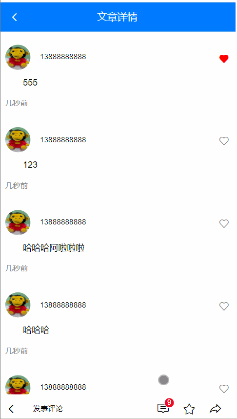
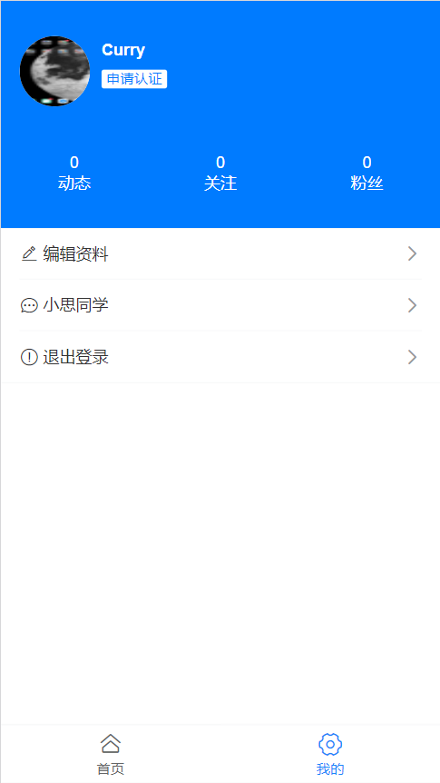
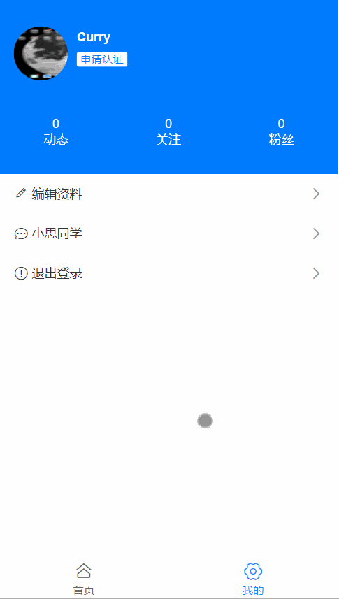
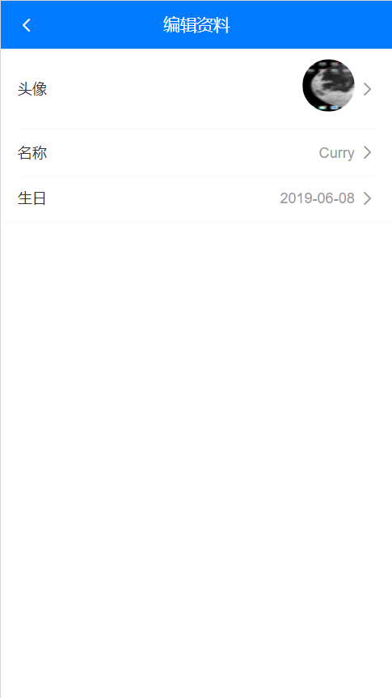
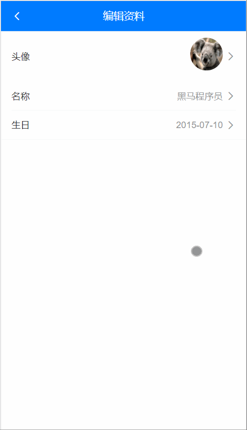

# Day05_文章评论-个人中心

## 1.文章评论_组件创建

### 目标

* 创建文章评论组件

* 在文章详情页显示

  

### 步骤

1. ArticleDetail/CommentList.vue - 定义评论组件(复制标签和样式, 然后对比)

   ```vue
   <template>
     <div>
       <!-- 评论列表 -->
       <div class="cmt-list">
         <!-- 评论的 Item 项 -->
         <div class="cmt-item">
           <!-- 头部区域 -->
           <div class="cmt-header">
             <!-- 头部左侧 -->
             <div class="cmt-header-left">
               
               <span class="uname">zs</span>
             </div>
             <!-- 头部右侧 -->
             <div class="cmt-header-right">
               <van-icon name="like" size="16" color="red" />
               <van-icon name="like-o" size="16" color="gray" />
             </div>
           </div>
           <!-- 主体区域 -->
           <div class="cmt-body">
             基于字体的图标集，可以通过 Icon 组件使用，也可以在其他组件中通过 icon 属性引用。基于字体的图标集，可以通过 Icon 组件使用，也可以在其他组件中通过 icon 属性引用。
           </div>
           <!-- 尾部区域 -->
           <div class="cmt-footer">3天前</div>
         </div>
       </div>
     </div>
   </template>
   
   <script>
   export default {
   }
   </script>
   
   <style scoped lang="less">
   .cmt-list {
     padding: 10px;
     .cmt-item {
       padding: 15px 0;
       + .cmt-item {
         border-top: 1px solid #f8f8f8;
       }
       .cmt-header {
         display: flex;
         align-items: center;
         justify-content: space-between;
         .cmt-header-left {
           display: flex;
           align-items: center;
           .avatar {
             width: 40px;
             height: 40px;
             background-color: #f8f8f8;
             border-radius: 50%;
             margin-right: 15px;
           }
           .uname {
             font-size: 12px;
           }
         }
       }
       .cmt-body {
         font-size: 14px;
         line-height: 28px;
         text-indent: 2em;
         margin-top: 6px;
         word-break: break-all;
       }
       .cmt-footer {
         font-size: 12px;
         color: gray;
         margin-top: 10px;
       }
     }
   }
   </style>
   
   ```

2. 引入到ArticleDetail.vue里使用后查看效果

   ```vue
   <template>
     <div>
       <!-- Header 区域 -->
       <!-- 文章信息区域 -->
   
       <!-- 文章评论区域 -->
       <CommentList></CommentList>
     </div>
   </template>
   
   <script>
   import CommentList from './CommentList.vue'
   export default {
     // ...
     components: {
       CommentList
     }
   }
   </script>
   ```

### 小结

1. 明确需求, 完成标签样式创建
2. 引入到文章详情页面使用

## 2.文章评论_获取评论数据

### 目标

* 查找接口, 拿到评论数据

  

### 步骤

1. 定义接口方法

   ```js
   // 评论 - 获取列表
   // offset第一页时, 不用在params携带(axios发现值为null会自动忽略此参数)
   export const commentListAPI = ({ artId, offset = null, limit = 10 }) => {
     return request({
       url: '/v1_0/comments',
       params: {
         type: 'a',
         source: artId,
         offset,
         limit
       }
     })
   }
   ```

2. CommentList.vue中, 引入发请求, 拿数据

   ```js
   import { commentListAPI } from '@/api'
   export default {
     async created () {
       this.getCommentListFn()
     },
     methods: {
       async getCommentListFn () {
         const res = await commentListAPI({
           artId: this.$route.query.aid
         })
         console.log(res)
       }
     }
   }
   ```

### 小结

1. 可选参数也先预留着

2. axios库中params里的值为null, 会自动忽略此参数和值, 不发给后台

   > 默认第一页offset不用传递

## 3.文章评论_铺设评论数据

### 目标

* 评论数据, 铺设到页面上

  

### 步骤

1. JSON解析数据, 保存到data变量中

   ```js
   export default {
     data () {
       return {
         commentList: [] // 评论数据
       }
     },
     async created () {
       this.getCommentListFn()
     },
     methods: {
       async getCommentListFn () {
         const res = await commentListAPI({
           artId: this.$route.query.aid
         })
         this.commentList = res.data.data.resuts // 保存到变量中
       }
     }
   }
   ```

2. CommentList.vue中修改标签的内容 - 循环数据

   ```vue
   <template>
     <div>
       <!-- 评论列表 -->
       <div class="cmt-list">
         <!-- 评论的 Item 项 -->
         <div class="cmt-item" v-for="obj in commentList" :key="obj.com_id">
           <!-- 头部区域 -->
           <div class="cmt-header">
             <!-- 头部左侧 -->
             <div class="cmt-header-left">
               
               <span class="uname">{{ obj.aut_name }}</span>
             </div>
             <!-- 头部右侧 -->
             <div class="cmt-header-right">
               <van-icon name="like" size="16" color="red" v-if="obj.is_liking === true"/>
               <van-icon name="like-o" size="16" color="gray" v-else/>
             </div>
           </div>
           <!-- 主体区域 -->
           <div class="cmt-body">
             {{ obj.content }}
           </div>
           <!-- 尾部区域 -->
           <div class="cmt-footer">{{ timeAgo(obj.pubdate) }}</div>
         </div>
       </div>
     </div>
   </template>
   
   <script>
   import { timeAgo } from '@/utils/date'
   export default {
     methods: {
       timeAgo
       // ...
     }
   }
   </script>
   ```

### 小结

1. 把数据保存到vue实例上
2. 用vue实例数组循环标签替换数据
3. 引入时间处理方法, 处理时间

## 4.文章评论_评论点亮

### 目标

* 先实现前端点亮效果

* 调用对应接口即可

  

### 步骤

1. 绑定点击事件, 实现前端点亮评论效果

   ```vue
   <!-- 头部右侧 -->
   <div class="cmt-header-right">
       <van-icon name="like" size="16" color="red" v-if="obj.is_liking === true" @click="loveFn(true, obj)"/>
       <van-icon name="like-o" size="16" color="gray" v-else @click="loveFn(false, obj)"/>
   </div>
   
   <script>
       export default {
           // ...
           methods: {
               // ...
               loveFn (bool, obj) {
                   if (bool === true) { // 点了红心
                       // 业务 => 取消红心
                       // 调接口 => 取消红心
                       // 显示 => 灰心
                       obj.is_liking = false
                   } else { // 点了灰心
                       // 业务 => 点亮红心
                       // 调接口 => 点亮红心
                       // 显示 => 红心
                       obj.is_liking = true
                   }
               }
           }
       }
   </script>
   ```

2. 定义接口方法

   ```js
   // 评论 - 喜欢
   export const commentLikingAPI = ({ comId }) => {
     return request({
       url: '/v1_0/comment/likings',
       method: 'POST',
       data: {
         target: comId
       }
     })
   }
   // 评论-取消喜欢
   export const commentDisLikingAPI = ({ comId }) => {
     return request({
       url: `/v1_0/comment/likings/${comId}`,
       method: 'DELETE'
     })
   }
   ```

3. 在逻辑判断中, 分别调用

   ```js
   
   import { commentLikingAPI, commentDisLikingAPI } from '@/api'
   export default {
     // ...
     methods: {
       // ...
       async loveFn (bool, obj) {
         if (bool === true) { // 点了红心
           // 业务 => 取消红心
           // 调接口 => 取消红心
           // 显示 => 灰心
           obj.is_liking = false
           await commentDisLikingAPI({ comId: obj.com_id })
         } else { // 点了灰心
           // 业务 => 点亮红心
           // 调接口 => 点亮红心
           // 显示 => 红心
           obj.is_liking = true
           await commentLikingAPI({ comId: obj.com_id })
         }
       }
     }
   }
   ```

4. 点亮/取消后, 刷新网页看状态是否保留

   > 调用接口成功, 后端数据更新, 刷新网页重新拿到此评论状态

### 小结

1. 先写前端交互效果, 顺清逻辑
2. 再判断中分别调用接口, 刷新测试

## 5.文章评论_发布结构和切换

### 目标

* 发布评论, 标签结构准备

* 显示评论和发布评论容器切换

  

### 步骤

1. 在CommentList.vue底部 - 准备标签和样式

   ```vue
   <!-- 底部添加评论区域 - 1 -->
   <div class="add-cmt-box van-hairline--top">
       <van-icon name="arrow-left" size="0.48rem" @click="$router.back()" />
       <div class="ipt-cmt-div">发表评论</div>
       <div class="icon-box">
           <van-badge>
               <van-icon name="comment-o" size="0.53333334rem" />
           </van-badge>
           <van-icon name="star-o" size="0.53333334rem" />
           <van-icon name="share-o" size="0.53333334rem" />
       </div>
   </div>
   
   <!-- 底部添加评论区域 - 2 -->
   <div class="cmt-box van-hairline--top">
       <textarea placeholder="友善评论、理性发言、阳光心灵"></textarea>
       <van-button type="default" disabled>发布</van-button>
   </div>
   ```

2. 对class修饰

   ```less
   /*美化 - 文章详情 - 底部的评论页面 */
   // 外层容器
   .art-cmt-container-1 {
     padding-bottom: 46px;
   }
   .art-cmt-container-2 {
     padding-bottom: 80px;
   }
   
   // 发布评论的盒子 - 1
   .add-cmt-box {
     position: fixed;
     bottom: 0;
     left: 0;
     width: 100%;
     box-sizing: border-box;
     background-color: white;
     display: flex;
     justify-content: space-between;
     align-items: center;
     height: 46px;
     line-height: 46px;
     padding-left: 10px;
     .ipt-cmt-div {
       flex: 1;
       border: 1px solid #efefef;
       border-radius: 15px;
       height: 30px;
       font-size: 12px;
       line-height: 30px;
       padding-left: 15px;
       margin-left: 10px;
       background-color: #f8f8f8;
     }
     .icon-box {
       width: 40%;
       display: flex;
       justify-content: space-evenly;
       line-height: 0;
     }
   }
   
   .child {
     width: 20px;
     height: 20px;
     background: #f2f3f5;
   }
   
   // 发布评论的盒子 - 2
   .cmt-box {
     position: fixed;
     bottom: 0;
     left: 0;
     width: 100%;
     height: 80px;
     display: flex;
     justify-content: space-between;
     align-items: center;
     font-size: 12px;
     padding-left: 10px;
     box-sizing: border-box;
     background-color: white;
     textarea {
       flex: 1;
       height: 66%;
       border: 1px solid #efefef;
       background-color: #f8f8f8;
       resize: none;
       border-radius: 6px;
       padding: 5px;
     }
     .van-button {
       height: 100%;
       border: none;
     }
   }
   ```

3. data声明变量, isShowCmtInput: false, 控制textarea是否应该出现

4. 控制标签

   ```vue
   <!-- 底部添加评论区域 - 1 -->
   <div class="add-cmt-box van-hairline--top" v-if="isShowCmtInput === false">
   
   <!-- 底部添加评论区域 - 2 -->
   <div class="cmt-box van-hairline--top" v-else>
   ```

5. 给发布评论标签绑定点击事件

   ```vue
   <div class="ipt-cmt-div" @click="isShowCmtInput = true">发表评论</div>
   ```

6. 使用自定义指令fofo, 让输入框自动聚焦, 并修改自定义指令代码

   > 判断指令所在的标签

   ```js
   import Vue from 'vue'
   // 插件对象(必须有install方法, 才可以注入到Vue.use中)
   export default {
     install () {
       Vue.directive('fofo', {
         inserted (el) {
           if (el.nodeName === 'INPUT' || el.nodeName === 'TEXTAREA') {
             // 如果直接是input标签/textarea标签
             el.focus()
           } else {
             // 指令在van-search组件身上, 获取的是组件根标签div, 而input在标签内
             const inp = el.querySelector('input')
             const textArea = el.querySelector('textarea')
             // 如果找到了
             if (inp || textArea) {
               inp && inp.focus()
               textArea && textArea.focus()
             } else {
               // 本身也不是, 子标签里也没有
               console.error('请把v-fofo用在输入框标签上')
             }
           }
         }
       })
     }
   }
   
   ```

7. 给输入框使用, 自动聚焦指令

   ```vue
   <textarea v-fofo placeholder="友善评论、理性发言、阳光心灵"></textarea>
   ```

8. 失去焦点, 让发布评论div关闭

   ```vue
   <textarea v-fofo placeholder="友善评论、理性发言、阳光心灵" @blur="isShowCmtInput = false"></textarea>
   ```

9. 给评论列表外层容器动态设置类名-距离底部

   > 防止底部输入框, 挡住隔壁的内容

   ```vue
   <!-- 评论列表 -->
   <div
        class="cmt-list"
        :class="isShowCmtInput ? 'art-cmt-container-2' : 'art-cmt-container-1'"
        >
   ```

### 小结

1. 看设计图, 完成评论部分2套标签结构和样式
2. 点击实现切换效果
3. 底部出现要让隔壁的内容, 下边距也切换

## 6.文章评论_评论数量和滑动

### 目标

* 设置微标数量提示

  * 无评论, 什么都不显示
  * 有评论, 显示总数

* 点击评论微标滚动

  

### 步骤

1. 收集评论总数, 显示

   > max: 超出这个数量, 就显示max的数字+

   ```vue
   <van-badge :content="totalCount" :max="99">
   	<van-icon name="comment-o" size="0.53333334rem" />
   </van-badge>
   
   <script>
   export default {
     data () {
       return {
         commentList: [], 
         isShowCmtInput: false,
         totalCount: '' // 评论总数
       }
     },
     async created () {
       this.getCommentListFn()
     },
     methods: {
       // 获取评论列表
       async getCommentListFn () {
         const res = await commentListAPI({
           artId: this.$route.query.aid
         })
         this.commentList = res.data.data.results 
         this.totalCount = res.data.data.total_count || '' // 如果无评论数(0), 给空字符串(防止0微标出现)
       }
     }
   }
   </script>
   ```

2. 获取到点赞容器, 调用原生DOM特有方法

   > 让点赞滚动到最上面

   ```js
   // 评论滑动
   async moveFn () {
       // 真实DOM都在document(所以不再一个vue文件内), 也是可以获取的
       document.querySelector('.like-box').scrollIntoView({
           behavior: 'smooth'
       })
   }
   ```

### 小结

1. scrollIntoView作用是让调用者标签滑动到视口区域底部

## 7.文章评论_发布评论(上午结束)

### 目标

* 先实现前端效果

  > 点击发布按钮, 拿到输入框内容

* 再调用接口, 发布评论

  

### 步骤

1. 根据内容, 动态设置发布按钮禁用状态

   ```vue
   <textarea
   	v-fofo
   	v-model="comValue"
   	placeholder="友善评论、理性发言、阳光心灵"
   	@blur="isShowCmtInput = false">
   </textarea>
   <van-button type="default" :disabled="comValue.length === 0">发布</van-button>
   
   <script>
   export default {
     data () {
       return {
         comValue: '' // 评论内容
       }
     }
   }
   </script>
   ```

2. 点击发布按钮, 打印内容

   > 问题: 先失去焦点了, 而且你用v-if, DOM移除, 点击事件未来的及触发
   >
   > 解决: 失去焦点, 延时执行

   ```vue
    <textarea
           v-fofo
           v-model="comValue"
           placeholder="友善评论、理性发言、阳光心灵"
           @blur="blurFn"></textarea>
   <van-button type="default" :disabled="comValue.length === 0" @click="send">发布</van-button>
   
   <script>
       methods: {
           // 发布评论框 - 失去焦点
           blurFn () {
             setTimeout(() => {
               this.isShowCmtInput = false
             })
           },
           // 发布评论
           async send () {
             console.log(this.comValue)
           }
       }
   </script>
   ```

3. 定义接口方法

   ```js
   // 评论 - 发布
   export const sendCommentAPI = ({ artId, content }) => {
     return request({
       url: '/v1_0/comments',
       method: 'POST',
       data: {
         target: artId,
         content: content
       }
     })
   }
   ```

4. 发布事件, 调用接口传给后台

   * 同时数组新增评论对象
   * 评论总数+1
   * 输入框内容清空

   ```js
   // 发布评论
   async send () {
       const res = await sendCommentAPI({
           artId: this.$route.query.aid,
           content: this.comValue
       })
       // 保存新评论对象到数组中
       this.commentList.unshift(res.data.data.new_obj)
       // 数量+1
       this.totalCount++
       // 成功后, 清除输入框内容
       this.comValue = ''
   }
   ```

### 小结

1. 先实现前端点击发布拿到评论内容
2. 调用接口, 想下成功后业务实现
   * 新评论对象加到数组中
   * 总评论数量增加1
   * 清空评论输入框内容

## 8.文章评论_获取更多

### 目标

* 获取下一页评论数据

  

### 步骤

1. van-list套住评论列表区域

   * 定义相关变量和方法
   * 距离底部50像素, 判定为触底
   * 默认上来不检测触底事件

   ```vue
   
         <van-list
           v-model="loading"
           :finished="finished"
           finished-text="没有更多了"
           @load="onLoad"
           offset="50"
           :immediate-check="false"
         >
           <!-- 评论的 Item 项 -->
           <div class="cmt-item" v-for="obj in commentList" :key="obj.com_id">
             <!-- 头部区域 -->
             <div class="cmt-header">
               <!-- 头部左侧 -->
               <div class="cmt-header-left">
                 
                 <span class="uname">{{ obj.aut_name }}</span>
               </div>
               <!-- 头部右侧 -->
               <div class="cmt-header-right">
                 <van-icon
                   name="like"
                   size="16"
                   color="red"
                   v-if="obj.is_liking === true"
                   @click="loveFn(true, obj)"
                 />
                 <van-icon
                   name="like-o"
                   size="16"
                   color="gray"
                   v-else
                   @click="loveFn(false, obj)"
                 />
               </div>
             </div>
             <!-- 主体区域 -->
             <div class="cmt-body">
               {{ obj.content }}
             </div>
             <!-- 尾部区域 -->
             <div class="cmt-footer">{{ timeAgo(obj.pubdate) }}</div>
           </div>
         </van-list>
   
   <script>
   export default {
     data () {
       return {
         // ...
         loading: false, // 底部加载状态
         finished: false // 底部是否加载完成
       }
     },
     methods: {
       // ...
       // 加载更多
       onLoad () {
   
       }
     }
   }
   </script>
   ```

2. 准备: data变量offset, 接口请求后, 保存分页要传的offset

   > 来自上一次接口返回的last_id值, 做分页

   ```js
   export default {
     data () {
       return {
         offset: null // 下一页(偏移id), 一定初始值null(第一页不需要传, axios遇到null忽略此参数)
       }
     },
     methods: {
       async getCommentListFn () {
         const res = await commentListAPI({
           artId: this.$route.query.aid,
           offset: this.offset // 把offset偏移量带给后台
         })
         this.commentList = res.data.data.results
         this.totalCount = res.data.data.total_count || ''
         this.offset = res.data.data.last_id // 保存起来为了做分页
       }
     }
   }
   ```

3. 准备: 在onLoad函数触发, 调用请求评论列表方法

   * 把新数据和旧数据合并
   * 关闭loading加载状态(置false), 下次触底如果loading为false, van-list组件才会再执行load事件
   * 判断如果没有数据了, 把finished(置true), 代表加载完成, van-list组件不会再执行load事件

   ```js
   export default {
     methods: {
       // 获取评论列表
       async getCommentListFn () {
         const res = await commentListAPI({
           artId: this.$route.query.aid,
           offset: this.offset // 把offset偏移量带给后台
         })
         // 判断是否还有数据
         if (res.data.data.results.length === 0) {
           this.finished = true
         }
         this.commentList = [...this.commentList, ...res.data.data.results] // 合并数据
         this.totalCount = res.data.data.total_count || '' // 如果无评论数(0), 给空字符串(防止0微标出现)
         this.offset = res.data.data.last_id // 保存起来为了做分页
         // 关闭加载状态
         this.loading = false
       },
       // 加载更多
       onLoad () {
         this.getCommentListFn()
       }
     }
   }
   ```

### 小结

1. 分页是如何做的?
   * 第一次offset传null, 不要给后台传递offset参数(axios如果params参数遇到值为null, 自动忽略这对key+value)
   * 第一次请求成功把last_id保存起来, 这样第二次请求last_id有值, offset带给后台, 拿到下一页数据
   * 第二次请求成功的last_id再更新保存起来, 为第三次请求下一页做准备
   * .....

## 9.个人中心_组件和数据

### 目标

* 个人中心标签样式和数据

  

### 步骤

1. User/index.vue页面, 复制标签结构和样式

   ```vue
   <template>
     <div class="user-container">
       <!-- 用户基本信息面板 -->
       <div class="user-card">
         <!-- 用户头像、姓名 -->
         <van-cell>
           <!-- 使用 title 插槽来自定义标题 -->
           <template #icon>
             
           </template>
           <template #title>
             <span class="username">用户名</span>
           </template>
           <template #label>
             <van-tag color="#fff" text-color="#007bff">申请认证</van-tag>
           </template>
         </van-cell>
         <!-- 动态、关注、粉丝 -->
         <div class="user-data">
           <div class="user-data-item">
             <span>0</span>
             <span>动态</span>
           </div>
           <div class="user-data-item">
             <span>0</span>
             <span>关注</span>
           </div>
           <div class="user-data-item">
             <span>0</span>
             <span>粉丝</span>
           </div>
         </div>
       </div>
   
       <!-- 操作面板 -->
       <van-cell-group class="action-card">
         <van-cell icon="edit" title="编辑资料" is-link />
         <van-cell icon="chat-o" title="小思同学" is-link />
         <van-cell icon="warning-o" title="退出登录" is-link />
       </van-cell-group>
     </div>
   </template>
   
   <script>
   export default {
   
   }
   </script>
   
   <style scoped lang="less">
   .user-container {
     .user-card {
       background-color: #007bff;
       color: white;
       padding-top: 20px;
       .van-cell {
         background: #007bff;
         color: white;
         &::after {
           display: none;
         }
         .avatar {
           width: 60px;
           height: 60px;
           background-color: #fff;
           border-radius: 50%;
           margin-right: 10px;
         }
         .username {
           font-size: 14px;
           font-weight: bold;
         }
       }
     }
     .user-data {
       display: flex;
       justify-content: space-evenly;
       align-items: center;
       font-size: 14px;
       padding: 30px 0;
       .user-data-item {
         display: flex;
         flex-direction: column;
         justify-content: center;
         align-items: center;
         width: 33.33%;
       }
     }
   }
   </style>
   
   ```

2. 注册用到的Vant内Tag组件

   ```js
   import { Tag, CellGroup } from 'vant'
   
   Vue.use(CellGroup)
   Vue.use(Tag)
   ```

3. 定义接口方法

   ```js
   // 用户 - 基本资料
   export const userInfoAPI = () => {
     return request({
       url: '/v1_0/user'
     })
   }
   ```

4. 在User/index.vue页面使用-获取数据-铺设到标签上

   ```vue
   <template>
     <div class="user-container">
       <!-- 用户基本信息面板 -->
       <div class="user-card">
         <!-- 用户头像、姓名 -->
         <van-cell>
           <!-- 使用 title 插槽来自定义标题 -->
           <template #icon>
             
           </template>
           <template #title>
             <span class="username">{{ user.name }}</span>
           </template>
           <template #label>
             <van-tag color="#fff" text-color="#007bff">申请认证</van-tag>
           </template>
         </van-cell>
         <!-- 动态、关注、粉丝 -->
         <div class="user-data">
           <div class="user-data-item">
             <span>{{ user.art_count }}</span>
             <span>动态</span>
           </div>
           <div class="user-data-item">
             <span>{{ user.follow_count }}</span>
             <span>关注</span>
           </div>
           <div class="user-data-item">
             <span>{{ user.fans_count }}</span>
             <span>粉丝</span>
           </div>
         </div>
       </div>
     </div>
   </template>
   
   <script>
   import { userInfoAPI } from '@/api'
   export default {
     data () {
       return {
         user: {} // 用户对象
       }
     },
     async created () {
       const res = await userInfoAPI()
       console.log(res)
       this.user = res.data.data
     }
   }
   </script>
   
   ```

### 小结

1. 铺设组件标签
2. 请求数据, 保存到data变量上, 才能在vue模板标签上直接用

## 10.个人中心_退出登录

### 目标

* 实现退出登录功能

* 给用户一个确认提示

  

### 步骤

1. 给退出登录按钮绑定点击事件

   ```vue
   <!-- 操作面板 -->
   <van-cell-group class="action-card">
       <van-cell icon="edit" title="编辑资料" is-link />
       <van-cell icon="chat-o" title="小思同学" is-link />
       <van-cell icon="warning-o" title="退出登录" is-link @click="quit"/>
   </van-cell-group>
   
   <script>
   export default {
     methods: {
       quit () {
   		
       }
     }
   }
   </script>
   ```

2. 引入vant的Dialog, 然后当用户点击退出给用户提示, 用户选择确定时, 退出

   ```js
   import { mapMutations } from 'vuex'
   import { Dialog } from 'vant'
   export default {
     methods: {
       ...mapMutations(['setToken']),
       quit () {
         Dialog.confirm({
           title: '提示',
           message: '这就走了?不爱我了吗?'
         }).then(() => {
           // 清空vuex和本地
           this.setToken('')
           // 跳到登录页
           this.$router.replace('/login')
         }).catch(() => {
           // on cancel
         })
       }
     }
   }
   ```

### 小结

1. Dialog.confirm函数在原地返回的是什么?
   * Promise对象

## 11.个人中心_编辑信息页面

### 目标

* 编辑信息页面创建和路由设置

  

### 步骤

1. 新建User/UserEdit.vue文件, 编辑用户信息页面文件, 准备标签和样式

   ```vue
   <template>
     <div class="user-edit-container">
       <!-- Header 区域 -->
       <van-nav-bar title="编辑资料" left-arrow @click-left="$router.back()" fixed />
   
       <!-- 用户资料 -->
       <van-cell-group class="action-card">
         <van-cell title="头像" is-link center>
           <template #default>
             <van-image round class="avatar" src=""/>
           </template>
         </van-cell>
         <van-cell title="名称" is-link  />
         <van-cell title="生日" is-link  />
       </van-cell-group>
     </div>
   </template>
   
   <script>
   export default {
     name: 'UserEdit'
   }
   </script>
   
   <style lang="less" scoped>
   .user-edit-container {
     padding-top: 46px;
     .avatar {
       width: 50px;
       height: 50px;
     }
   }
   </style>
   
   ```

2. 注册需要的van-image组件

   ```js
   import { Image } from 'vant'
   
   Vue.use(Image)
   ```

3. 在router/index.js - 添加编辑页面路由 

   ```js
   import UserEditor from '@/views/User/UserEdit'
   
   {
       path: '/user_editor',
       component: UserEditor
   }
   ```

4. 点击编辑选项单元格, 跳转路由

   ```vue
   <van-cell icon="edit" title="编辑资料" is-link to="/user_editor"/>
   ```

### 小结

1. 编辑用户信息页面创建和路由配置
2. van-cell身上的to / 点击事件 实现跳转路由效果

## 12.个人中心_编辑信息铺设

### 目标

* 编辑信息页面数据铺设

  

### 步骤

1. 定义接口方法

   ```js
   // 用户- 个人资料(就为了获取生日)
   export const userProfileAPI = () => {
     return request({
       url: '/v1_0/user/profile'
     })
   }
   ```

4. 触发网络请求拿到数据后, 渲染基础数据展示

   ```vue
   <template>
     <div class="user-edit-container">
       <!-- Header 区域 -->
       <van-nav-bar title="编辑资料" left-arrow @click-left="$router.back()" fixed />
   
       <!-- 用户资料 -->
       <van-cell-group class="action-card">
         <van-cell title="头像" is-link center>
           <template #default>
             <van-image round class="avatar" :src="profile.photo" />
           </template>
         </van-cell>
         <van-cell title="名称" is-link :value="profile.name" />
         <van-cell title="生日" is-link :value="profile.birthday" />
       </van-cell-group>
     </div>
   </template>
   
   <script>
   import { userProfileAPI } from '@/api'
   export default {
     name: 'UserEdit',
     data () {
       return {
         profile: {} // 用户基本资料
       }
     },
     async created () {
       const res = await userProfileAPI()
       console.log(res)
       this.profile = res.data.data
     }
   }
   </script>
   
   ```

### 小结

1. 拿到数据接口请求
2. 铺设页面替换

## 13.个人中心_头像修改

### 目标

* 点击头像出现文件选择器
* 获取文件对象
* 上传图片文件对象, 表单给后台

> 移花接木: 点击图片, js模拟点击了input[type=file]标签出现选择图片窗口

​	

### 步骤

1. 先实现前端点击获取文件对象效果

   ```vue
   <van-cell title="头像" is-link center>
       <template #default>
           <van-image round class="avatar" :src="profile.photo" @click="$refs.iptFile.click()"/>
           <!-- file 选择框 -->
           <input
                  type="file"
                  ref="iptFile"
                  v-show="false"
                  accept="image/*"
                  @change="onFileChange"
                  />
       </template>
   </van-cell>
   
   <script>
   export default {
     methods: {
       // 文件选择方法
       onFileChange (ev) {
         console.log(ev.target.files[0])
       }
     }
   }
   </script>
   ```

2. 接口定义

   ```js
   // 用户- 更新头像
   // 注意: formObj的值必须是一个表单对象
   // '{"a": 10, "b": 20}' // 对象格式的JSON字符串
   // new FormData() // 表单对象
   export const updatePhotoAPI = (formObj) => {
     return request({
       url: '/v1_0/user/photo',
       method: 'PATCH',
       data: formObj
       // 如果你的请求体内容是表单对象, 浏览器会自动携带请求头Content-Type为multipart/form-data
     })
   }
   ```

3. 引入接口, 传入表单对象, 更新页面

   ```js
   import { updatePhotoAPI } from '@/api'
   export default {
     methods: {
       // 文件选择方法
       async onFileChange (ev) {
       //   console.log(ev.target.files[0])
         if (ev.target.files.length === 0) return // 防止用户未选择图片
         const fd = new FormData()
         fd.append('photo', ev.target.files[0]) // photo在表单里参数名携带
         const res = await updatePhotoAPI(fd)
         console.log(res)
         this.profile.photo = res.data.data.photo // 更新最新头像
       }
     }
   }
   ```

### 小结

1. 什么是表单隐藏域?
   * 给用户看A标签, 点击A标签
   * JS代码监测A点击事件, 触发B标签标签的事件
2. 前端如何创建表单对象?
   * new FormData

## 14.个人中心_姓名修改-准备

### 目标

* 点击弹出, 姓名输入框

* 填入默认值, 自动聚焦

* 效果如下

  

### 步骤

> 目标: 弹出输入框, 然后确定或者取消修改

1. dialog全局注册, 然后在UserEdit.vue这个页面使用 - 准备弹出输入框层

   ```js
   import { Dialog } from 'vant'
   Vue.use(Dialog)
   ```

   ```vue
   <!-- 姓名部分 -->
   <van-cell
           title="名称"
           is-link
           :value="profile.name"
           @click="showNameDialogFn" />
   
   <!-- 修改用户名称的对话框 -->
   <van-dialog
         v-model="isShowNameDialog"
         title="修改名称"
         show-cancel-button
         :before-close="onNameDialogBeforeClose">
         <!-- 输入框 -->
         <van-field
           v-model.trim="userName"
           input-align="center"
           maxlength="7"
           placeholder="请输入名称"
           v-fofo
         />
   </van-dialog>
   
   <script>
   export default {
     data () {
       return {
         isShowNameDialog: false, // 是否显示姓名弹出框
         userName: '' // 编辑用户名
       }
     },
     methods: {
       // 点击名字-出现弹出框
       showNameDialogFn () {
         this.isShowNameDialog = true
         this.userName = this.profile.name // 设置默认显示内容
       },
       // 姓名修改弹出层-关闭前方法
       onNameDialogBeforeClose (action, done) {
   	
       }
     }
   }
   </script>
   ```

## 15.个人中心_姓名修改-验证

### 目标

* 姓名校验

  > 永远不要相信用户在输入框, 输入的内容, 防止注入攻击

  * 1-7位中英文数字组合
  * 不通过, 弹窗不关闭, 给个提示
  * 通过, 弹窗关闭, 调用接口

* 效果如下

  

### 步骤

1. 在弹窗关闭方法里判断

   ```js
   // 姓名修改弹出层-关闭前方法
   async onNameDialogBeforeClose (action, done) {
       // action的值: confirm或cancel(点击按钮区分)
       if (action === 'confirm') {
           // 确定
           // unicode编码 \u4092
           // url编码 %E2%C3%D1
           if (/^[A-Za-z0-9\u4e00-\u9fa5]{1,7}$/.test(this.userName)) {
               // 通过校验
               // 调用接口
               // 更新页面显示的名字
               
               // 关闭弹窗
               done()
           } else {
               // 提示用户
               Notify({ type: 'warning', message: '用户名中英文和数字1-7位' })
               // 阻止弹窗关闭
               done(false)
           }
       } else if (action === 'cancel') {
           // 取消
           done()
       }
   }
   ```

2. 定义接口方法

   ```js
   // 用户 - 更新资料
   export const updateProfileAPI = ({ birthday, userName }) => {
     return request({
       url: '/v1_0/user/profile',
       method: 'PATCH',
       data: {
         birthday: birthday,
         name: userName
       }
     })
   }
   
   ```

3. 在通过校验位置, 调用接口更新

   ```js
   import { updateProfileAPI } from '@/api'
   
   if (/^[A-Za-z0-9\u4e00-\u9fa5]{1,7}$/.test(this.userName)) {
       // 通过校验
       // 调用接口
       await updateProfileAPI({
           userName: this.userName
       })
       // 更新页面显示的名字
       this.profileObj.name = this.userName
       // 关闭弹窗
       done()
   }
   ```

### 小结

1. 在关闭弹窗前, 用vant组件方法判断
2. 用正则判断符合规则就调用接口关闭弹窗
3. 用正则判断不符合规则就提示用户, 阻止弹窗关闭

## 16.个人中心_生日修改-准备

### 目标

* 找到dateTimePiker选择时间组件

  

### 步骤

1. 注册DataTimePicker组件

   ```js
   import { DatetimePicker } from 'vant'
   
   Vue.use(DatetimePicker)
   ```

2. 在UserEdit.vue页面使用, 定义相关变量

   ```vue
   <!-- 修改时间 -->
   <van-popup v-model="isShowBirth" position="bottom" style="height: 50%" round>
         <!-- 日期选择控件 -->
         <van-datetime-picker
           v-model="currentDate"
           type="date"
           title="选择出生日期"
           :min-date="minDate"
           :max-date="maxDate"
           :show-toolbar="true"
         />
   </van-popup>
   
   <script>
   export default {
     data () {
       return {
   	  // ...      
         isShowBirth: false, // 显示时间选择器
         minDate: new Date(1900, 0, 1), // 最小的可选的日期
         maxDate: new Date(), // 最大的可选日期
         currentDate: new Date() // 当前日期
       }
     },
   }
   </script>
   ```

3. 点击单元格, 弹出时间选择组件

   ```vue
   <van-cell title="生日" is-link :value="profile.birthday" @click="isShowBirth = true"/>
   ```

### 小结

1. popup和dateTimePicker组件结合使用
2. 除了用popup也可以用actionSheet组件

## 17.个人中心_生日修改-使用

### 目标

* 监测取消和确定按钮事件

* 分别实现功能

  

### 步骤

1. 绑定事件, 实现功能

   ```vue
   <!-- 修改时间 -->
   <van-popup
   	v-model="isShowBirth"
   	position="bottom"
   	style="height: 50%"
   	round>
       	<!-- 日期选择控件 -->
       	<van-datetime-picker
   			v-model="currentDate"
   			type="date"
   			title="选择出生日期"
   			:min-date="minDate"
   			:max-date="maxDate"
   			:show-toolbar="true"
   			@cancel="isShowBirth = false"
   			@confirm="confirmFn"/>
   </van-popup>
   
   <script>
       import moment from 'moment'
       export default {
           methods: {
               // 弹出时间选择框
               showBirthFn () {
                   this.isShowBirth = true
                   this.currentDate = new Date(this.profile.birthday) // 设置data组件默认显示时间
               },
               // 时间选择
               async confirmFn () {
                   // console.log(this.currentDate instanceof Date)
                   // this.currentDate里值是日期对象
                   // 但是后台要"年-月-日"格式字符串参数值
   
                   console.log(this.currentDate)
                   const dateStr = moment(this.currentDate).format('YYYY-MM-DD')
                   await updateProfileAPI({
                       birthday: dateStr
                   })
                   // 前端页面同步
                   this.profile.birthday = dateStr
                   // 时间选择器关闭
                   this.isShowBirth = false
               }
           }
       }
   </script>
   ```

### 小结

1. 组件需要日期对象, new Date
2. 后台需要日期字符串, "年-月-日"格式
3. 单元格里显示"年-月-日"格式