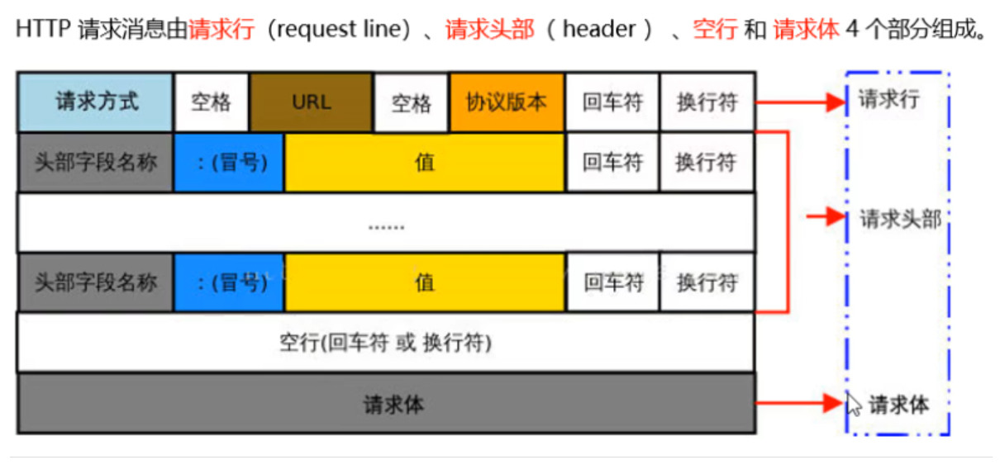
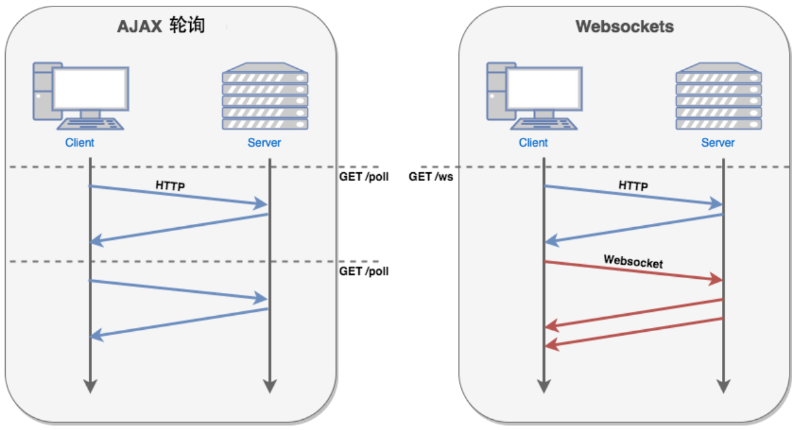
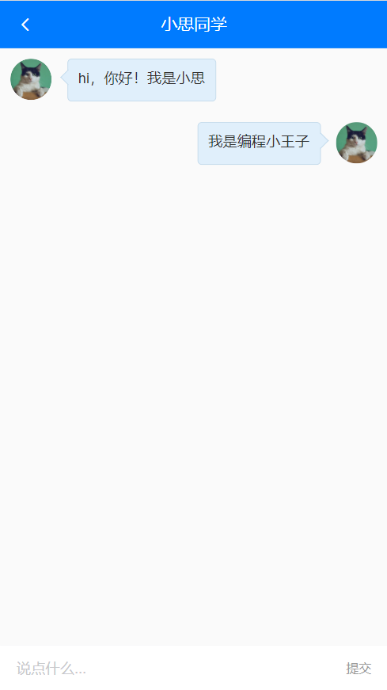
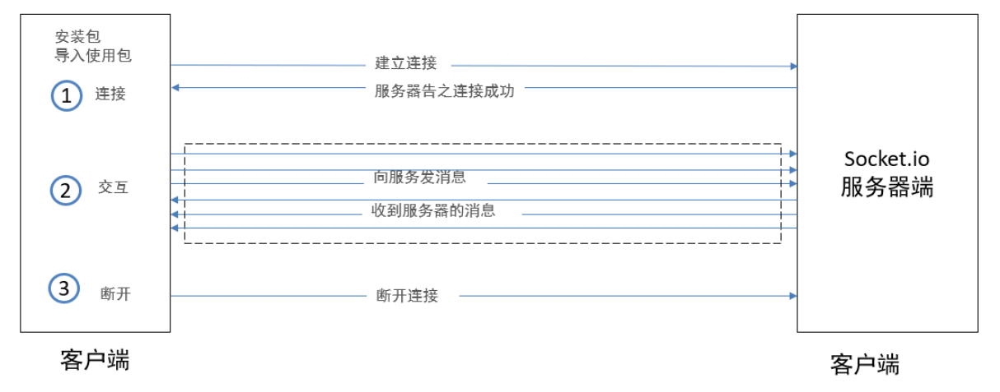

# Day06_小思同学

## 1.http协议复习

### 目标

* 什么是http协议
* 什么是请求报文和响应报文

### 讲解

1. http中文意思:  超文本传输协议, 定义服务器和客户端的传送格式

2. 请求发送的数据包, 叫请求报文, 格式如下

   

3. 响应回来的数据包, 叫响应报文, 格式如下

   

### 缺点

* HTTP 协议：客户端与服务器建立通信连接之后
  * 服务器端只能**被动地**响应客户端的请求，==无法主动给客户端发送消息。== 一次请求才能对应一次响应

http建议阅读: http://lidongxuwork.gitee.io/pages/computer/network/http%E5%8D%8F%E8%AE%AE.html#%E5%AD%97%E6%AE%B5%E6%80%BB%E7%BB%93

http-mdn地址: https://developer.mozilla.org/zh-CN/docs/Web/HTTP

### 小结

1. http协议是规划端与端传输信息的格式
2. http协议暂定一次请求对应一次响应

## 2.即时通信介绍

### 目标

* 什么是即时通信
* ajax是否能实现
* 即时通信实现技术

### 讲解

1. 即时通信: 即时发送和接收互联网消息等的业务

2. ajax只能是发起请求后, 得到一次响应, 无法实现即时通信

   > 但是可模拟, 比如创建计时器, 每隔1秒, 自动调用一次接口, 拿到服务器要发送的数据
   >
   > 但这非常可怕
   >
   > (1): 万一服务器上没有你要的最新消息, 这次请求和响应是无意义的
   >
   > (2): 服务器为了给你做出响应, 还占用了一定内存和带宽, 很浪费

   以上技术叫计时器轮询, 迫不得已才能使用(一般用不上, 了解即可)

3. HTML5出了一个新的技术叫WebSocket, 可以在一个TCP链接上, 实现即时通信效果

   * 需要前端支持
   * 需要后端支持

### 使用场景

* 直播
  * 主播的实时画面数据, 推送到服务器上
  * 服务器主动推送视频流到所有客户端设备上(重点)
* 语音
  * 说话人声音数据流推送到服务器上
  * 服务器推送给指定的客户端设备上(重点)
* 文字聊天
  * 有一个人发送文字到服务器上
  * 服务器推送给指定/所有客户端(重点)
  * 体验下: http://123.57.109.30:4005/index2.html  (多开几个窗口自己跟自己聊)

### 小结

1. 什么是即时通信?
   * 服务器能主动给客户端发送消息, 不局限于一次请求一次响应
2. ajax是否能实现即时通信?
   * 只能模拟, 用轮询方式, 但是耗费资源, 少用
3. 如何实现即时通信?
   * 前端采用WebSocket协议, 也是新出的一个类
   * 后端也要提供WebSocket接口地址, 建立连接

## 3.webSocket使用

### 目标

* 自己用原生JS实现一次WebSocket使用
* 前提: 一定需要一个后端服务器(支持socket的)

### 概念

它是一种新的技术, 前后端只要支持这种协议,  ==后端可以主动向前端推送内容==

项目中使用: 做一个智能客服

Websocket 通过HTTP/1.1 协议的101状态码进行握手 

其实VueCli脚手架服务器 和 浏览器之间就建立了一个WebSocket通道

> 才实现的代码一改, 服务器向浏览器主动推送更新的js文件, 页面就自动更新了

协议对比




### 体验 - 前端代码

代码直接复制体验即可

> 这里后台采用: wss://echo.websocket.org 这个地址实现socket连接

```html
<!DOCTYPE html>
<html lang="en">
<head>
    <meta charset="UTF-8">
    <meta name="viewport" content="width=device-width, initial-scale=1.0">
    <title>体验websocket</title>
    <style>
        #contanier {
            width: 500px;
            height: 400px;
            border: 2px dashed #7575e7;
            overflow-y: auto;
        }
    </style>
</head>
<body>
    <div id="contanier"></div>
    <!-- 1  建立连接 (拨号) -->
    <!-- 2  发消息 接消息 -->
    <!-- 3  关闭连接 -->
    <input type="text" id="message">
    <button onclick="openWS()">建立连接</button>
    <button onclick="sendMessage()">发送消息</button>
    <button onclick="closeWS()">关闭连接</button>
     
    <script>
        var dom = document.getElementById("contanier")
        var inputDom = document.getElementById("message")
        var isOpen = false  // 表示是否已经建立了拨号
        var ws;  // 别的方法 也需要使用ws
           // 打开websocket连接
          var  openWS = function (){
              /// 网络上提供的一个测试websocket功能的服务器地址。
              /// 它的效果是，你向服务器发什么消息 ，它就原样回复给你。
              ws =  new WebSocket('wss://echo.websocket.org')  // 建立与服务器的连接

              // onopen是webSocket约定事件名
              // 当本地客户端浏览器与服务器建立连接之后，就会执行onopen的回调
              ws.onopen = function (event) {
                isOpen = true
                // 建立成功
                dom.innerHTML = dom.innerHTML + `<p>与服务器成功建立连接</p>`
              }
              //   接收消息
              // onmessage是webSocket约定事件名
              // 如果从服务器上发过来了消息，则会进入onmessage的回调
              ws.onmessage = function (event) {
                  // 由于 我们先给服务器发了消息 服务器给我们回了消息
                  dom.innerHTML = dom.innerHTML + `<p style='color: blue'>服务器说:${event.data}</p>`
              }
              // onclose是webSocket约定事件名
              ws.onclose = function () {
                   // 此函数表示 关闭连接成功
                   isOpen = false // 把状态关闭掉
                   dom.innerHTML = dom.innerHTML + `<p>与服务器连接关闭</p>`
              }
          }
        //   发送消息 接收消息
          var sendMessage = function () {
            if(inputDom.value && isOpen)   {
             // 发消息 要等到 连接成功才能发 而且内容不为空

             // 发消息就是send
             ws.send(inputDom.value) // 发送消息
            //   发完之后 添加到 当前视图上
             dom.innerHTML = dom.innerHTML + `<p style='color: red'>我说:${inputDom.value}</p>`
             inputDom.value = ''
            }

          }
          // 关闭连接
          var  closeWS = function () {
              ws.close() // 关闭连接
          }
    </script>
</body>
</html>
```

### 小结

1. vuecli脚手架启动的webpack开发服务器, 和浏览器之间也建立着一条socket通道
2. WebSocket还是基于TCP, 但是会隔几秒发一个很小的包给后台(心跳包) 维持这段连接

## 4.socket.io包使用

> 前端对WebSocket封装很好
>
> 后端对socket代码也封装好了

### 目标

* 后端socket支持
  * nodejs的Express建立web服务器
  * nodejs集成socket.io包开启后端socket服务
* 前端也要使用socket.io包使用socket服务
* 英文文档: https://socket.io/docs/v4/client-initialization/
* 中文文档: https://www.w3cschool.cn/socket/socket-k49j2eia.html

### 后端代码

server.js

```js
const express = require("express")
const app = express()
app.use(express.static(__dirname + '/public'))


var http = require('http').Server(app);
http.listen(4005)
var io = require('socket.io')(http);

// io.on('connection') -- 固定的, 用于 监测有没有人用socket服务链接我, 触发后面的函数
io.on('connection', function(socket){ // socket连接者对象
  // console.log('a user connected');
  socket.on('cTos', data => { // 谁来链接我, 我就给谁绑定一个事件叫cTos(随便), data接收的就是前端触发这个事件传递过来的聊天消息

    // io.sockets(拿到当前连接池里所有的socket对象-链接到我的所有人), emit()触发事件(前端事件叫sToC) ---- 广播
      io.sockets.emit('sToC', data) // 把当前收到的聊天消息, 发送给所有连接着(前端)
  })
});
```

### 前端代码

index.html

```html
<!DOCTYPE html>
<html lang="en">

<head>
    <meta charset="UTF-8">
    <meta http-equiv="X-UA-Compatible" content="IE=edge">
    <meta name="viewport" content="width=device-width, initial-scale=1.0">
    <title>首页</title>
</head>

<body>
    <script src="https://cdn.jsdelivr.net/npm/jquery/dist/jquery.min.js"></script>
    <!-- 1. 引入前端的socket.io注意版本 一定要跟后台对上 -->
    <script src="https://cdn.jsdelivr.net/npm/socket.io@4.1.2/client-dist/socket.io.min.js"></script>
    <div>
        <p>聊天窗口:</p>
        <hr>
        <div id="result"></div>
    </div>
    <div>
        <input type="text" placeholder="用户名" id="user">
        <input type="text" placeholder="消息" id="msg">
        <button id="btn">发送</button>
    </div>
    <script>
        // 2. 用io()函数链接socket服务器
        // 如果代码部署到了线上服务器, 这个localhost要换成线上的ip地址
        // 因为这个网页请求到本地浏览器上查看, 你要还是localhost那不是请求本地呢吗?
        const socket = io("ws://localhost:4005")
        $("#btn").on("click", function () {
            let user = $("#user").val()
            let msg = $("#msg").val()
            console.log(user, msg);

            // 3. socket触发后端的事件
            socket.emit('cTos', { user, msg })
        })

        socket.on('sToC', obj => {
            $("#result").append($(`<p>${obj.user} 说: ${obj.msg}</p>`))
        })
    </script>
</body>

</html>
```

### 第三方使用

> 使用第三方公司封装的插件(SDK)

推荐2个比较常用的即时通信服务平台

* 环信
* 容联云

具体使用过程, 根据文档, 集成到自己项目中

### 小结

1. 可以不用原生WebSocket干, 使用一些包例如, socket.io包
2. 前端要注意使用client名字的js文件
3. 也可以使用第三方服务, 快速集成功能

## 5.小思同学_页面准备

### 目标

* 创建小思同学页面和标签

* 配置路由

  

### 步骤

1. views/Chat/index.vue - 创建页面

   ```vue
   <template>
     <div class="container">
       <!-- 固定导航 -->
       <van-nav-bar fixed left-arrow @click-left="$router.back()" title="小思同学"></van-nav-bar>
   
       <!-- 聊天主体区域 -->
       <div class="chat-list">
         <div>
             <!-- 左侧是机器人小思 -->
             <div class="chat-item left">
               <van-image fit="cover" round src="https://img.yzcdn.cn/vant/cat.jpeg" />
               <div class="chat-pao">这里是别人说的话</div>
             </div>
   
             <!-- 右侧是当前用户 -->
             <div class="chat-item right">
               <div class="chat-pao">这里是我说的话</div>
               <van-image fit="cover" round src="https://img.yzcdn.cn/vant/cat.jpeg" />
             </div>
          </div>
       </div>
   
       <!-- 对话区域 -->
       <div class="reply-container van-hairline--top">
         <van-field  placeholder="说点什么...">
           <template #button>
             <span  style="font-size:12px;color:#999">提交</span>
           </template>
         </van-field>
       </div>
     </div>
   </template>
   
   <script>
   export default {
     name: 'Chat'
   }
   </script>
   
   <style lang="less" scoped>
   .container {
     height: 100%;
     width: 100%;
     position: absolute;
     left: 0;
     top: 0;
     box-sizing: border-box;
     background: #fafafa;
     padding: 46px 0 50px 0;
     .chat-list {
       height: 100%;
       overflow-y: scroll;
       .chat-item {
         padding: 10px;
         .van-image {
           vertical-align: top;
           width: 40px;
           height: 40px;
         }
         .chat-pao {
           vertical-align: top;
           display: inline-block;
           min-width: 40px;
           max-width: 70%;
           min-height: 40px;
           line-height: 38px;
           border: 0.5px solid #c2d9ea;
           border-radius: 4px;
           position: relative;
           padding: 0 10px;
           background-color: #e0effb;
           word-break: break-all;
           font-size: 14px;
           color: #333;
           &::before {
             content: '';
             width: 10px;
             height: 10px;
             position: absolute;
             top: 12px;
             border-top: 0.5px solid #c2d9ea;
             border-right: 0.5px solid #c2d9ea;
             background: #e0effb;
           }
         }
       }
     }
   }
   .chat-item.right {
     text-align: right;
     .chat-pao {
       margin-left: 0;
       margin-right: 15px;
       &::before {
         right: -6px;
         transform: rotate(45deg);
       }
     }
   }
   .chat-item.left {
     text-align: left;
     .chat-pao {
       margin-left: 15px;
       margin-right: 0;
       &::before {
         left: -5px;
         transform: rotate(-135deg);
       }
     }
   }
   .reply-container {
     position: fixed;
     left: 0;
     bottom: 0;
     height: 44px;
     width: 100%;
     background: #f5f5f5;
     z-index: 9999;
   }
   </style>
   
   ```
   
2. 配置路由

   ```js
   import Chat from '@/views/Chat'
   
   {
       path: '/chat',
       component: Chat
   }
   ```

3. 点击van-cell单元格跳转页面

   ```vue
   <van-cell icon="chat-o" title="小思同学" is-link to="/chat"/>
   ```

### 小结

1. van-cell有to属性也能跳转路由

## 6.小思同学_数据获取和渲染

### 目标

* 铺设小思同学页面
* 先把固定数据铺设上去

### 步骤

1. 先在本地渲染数组 - 准备数组并循环渲染到标签上

   ```js
   
   export default {
     name: 'Chat',
     data () {
       return {
         word: '', // 输入框的内容
         // 所有的聊天消息
         list: [
           // 只根据 name 属性，即可判断出这个消息应该渲染到左侧还是右侧
           { name: 'xs', msg: 'hi，你好！我是小思' },
           { name: 'me', msg: '我是编程小王子' }
         ]
       }
     }
   }
   ```

2. 把数据循环到标签上, 注意判断数据是哪一边的, 给输入框绑定v-model

   ```vue
   <template>
     <div class="container">
       <!-- 固定导航 -->
       <van-nav-bar fixed left-arrow @click-left="$router.back()" title="小思同学"></van-nav-bar>
   
       <!-- 聊天主体区域 -->
       <div class="chat-list">
         <div v-for="obj, index in list" :key="index">
             <!-- 左侧是机器人小思 -->
             <div class="chat-item left" v-if="obj.name === 'xs'">
               <van-image fit="cover" round src="https://img.yzcdn.cn/vant/cat.jpeg" />
               <div class="chat-pao">{{ obj.msg }}</div>
             </div>
   
             <!-- 右侧是当前用户 -->
             <div class="chat-item right" v-if="obj.name === 'me'">
               <div class="chat-pao">{{ obj.msg }}</div>
               <van-image fit="cover" round src="https://img.yzcdn.cn/vant/cat.jpeg" />
             </div>
          </div>
       </div>
   
       <!-- 对话区域 -->
       <div class="reply-container van-hairline--top">
         <van-field v-model="word"  placeholder="说点什么...">
           <template #button>
             <span  style="font-size:12px;color:#999">提交</span>
           </template>
         </van-field>
       </div>
     </div>
   </template>
   ```

### 小结

1. 如何区别消息是谁的?
   * 根据消息对象里name字段的值, 决定用哪一边div承载消息

## 7.小思同学_webSocket使用

### 目标

* 继承webSocket, 和后台建立通道

* 完成效果

  

### 步骤

1. 安装客户端socket的包(支持websocket) - 内部对websocket进行了封装

   ```js
   yarn add socket.io-client@4.0.0
   ```

2. 在Chat/index.vue引入包

   ```js
   // 导入 socket.io-client 包
   import { io } from 'socket.io-client'
   
   // 定义变量，存储 websocket 实例
   let socket = null
   ```

3. 创建socket服务

   ```js
   created() {
       // ...
       
       // 创建客户端 websocket 的实例
       socket = io('http://toutiao.itheima.net', {
           query: {
               token: this.token
           },
           transports: ['websocket']
       })
   }
   ```

4. 监听是否连接成功

   > 只有连接内置事件执行了, 才能进行后续操作

   ```js
   created() {
     // 建立连接的事件
     socket.on('connect', () => {
       console.log('与服务器建立了连接')
     })
   }
   ```

5. 在组件销毁前, 关闭服务

   ```js
   // 组件被销毁之前，清空 sock 对象
   beforeDestroy() {
     // 关闭连接
     socket.close()
   
     // 销毁 websocket 实例对象
     socket = null
   },
   ```

6. 在created监听socket的消息

   ```js
   created() {
       // ...
   
       // 接收到消息的事件
       socket.on('message', data => {
         // 把服务器发送过来的消息，存储到 list 数组中
         this.list.push({
           name: 'xs',
           msg: data.msg
         })
       })
   },
   ```

7. 在 send事件中, 把服务器发来的数据装到数组里

   ```js
   sendFn () {
       // 判断内容是否为空
       if (!this.word) return
   
       // 添加聊天消息到 list 列表中
       this.list.push({
           name: 'me',
           msg: this.word
       })
   }
   ```

8. 客户端调用 `socket.emit('message', 消息内容)` 方法把消息发送给 websocket 服务器：

   ```js
   // 向服务端发送消息
   sendFn () {
       // 判断内容是否为空
       if (!this.word) return
   
       // 添加聊天消息到 list 列表中
       this.list.push({
           name: 'me',
           msg: this.word
       })
   
       // 把消息发送给 websocket 服务器
       socket.emit('message', {
           msg: this.word,
           timestamp: new Date().getTime()
       })
   
       // 清空文本框的内容
       this.word = ''
   }
   ```

### 小结

1. vuecli项目中下载socket.io包

2. 建立和服务器的socket连接

   > 要到连接地址和参数等注意事项

3. 与后台协商好, 发送消息和接收消息的事件名, 以及数据格式

## 8.小思同学_滚动到底部

### 目标

* 发消息和收消息, 立刻滚动到底部

  

### 步骤

1. 定义滚动到底部的方法

   ```js
   // 滚动到页面底部
   scrollToBottom () {
       // 获取到所有的聊天 Item 项
       const chatItem = document.querySelectorAll('.chat-item')
       // 获取到最后一项对应的 DOM 元素
       const lastItem = chatItem[chatItem.length - 1]
       // 调用 scrollIntoView() 方法，显示这个元素
       lastItem.scrollIntoView({
           behavior: 'smooth' // 动画平滑
       })
   }
   ```

2. 在发布消息 / 接收到消息的时候, 调用

   ```js
   this.$nextTick(() => {
       this.scrollToBottom()
   })
   ```

### 小结

1. 获取原生DOM, 调用scrollIntoView方法, 让标签滚到可视窗口
2. 如果下面没有更多内容了, 是不一定会滚到头的

## 9.小思同学_存储用户头像(上午结束)

### 目标

* 把我的信息保存到vuex中
* 把信息持久化存储(否则聊天界面刷新头像就没了)

### 步骤

1. 在vuex中定义变量保存信息

   ```js
   import Vue from 'vue'
   import Vuex from 'vuex'
   
   Vue.use(Vuex)
   
   export default new Vuex.Store({
     state: {
       // ...
       user: JSON.parse(localStorage.getItem('user')) || {} // 用户基本资料(默认从本地取)
     },
     mutations: {
       // ...
       setUser (state, userObj) {
         state.user = userObj
         localStorage.setItem('user', JSON.stringify(userObj))
       }
     }
   })
   
   ```

2. 在User/index.vue中, 获取后保存起来

   ```js
   methods: {
       ...mapMutations(['setToken', 'setUser']),
   },
   async created () {
   	const res = await userInfoAPI()
   	this.user = res.data.data
   	this.setUser(res.data.data)
   }
   ```

3. 既然存储到vuex中, 我的页面也使用

   > 逻辑页面里网络请求 => 存储vuex和localStorage中 => 映射回到逻辑页面里使用

   ```js
   import { mapState, mapMutations } from 'vuex'
   export default {
     data () {
       return {
         // user: {} // 用户对象
       }
     },
     computed: {
       ...mapState(['user'])
     },
     async created () {
       const res = await userInfoAPI()
       console.log(res)
       // this.user = res.data.data
       this.setUser(res.data.data)
     }
   }
   ```

4. 去小思同学页面使用vuex中的值, 使用头像

   > 定义getters, 直接拿到user里的头像

   ```js
   getters: {
       userPhoto (state) {
           return state.user.photo
       }
   }
   ```

   然后在逻辑页面映射过来使用即可

   ```js
   import { mapGetters } from 'vuex'
   export default {
     computed: {
       ...mapGetters(['userPhoto'])
     }
   }
   ```

### 小结

1. 跨页面用值, 其实可以直接父传子
2. 但是为了后面跨页面使用, 做铺垫, 保存到vuex中
3. 如果刷新也要使用的值, 要做本地持久化存储

## 10.优化_路由-懒加载

### 目标

* 为何使用路由懒加载
* 什么是路由懒加载

### 步骤

1. 运行时, network里禁用缓存, 观察app.js大小

2. 路由懒加载 - 查看文档: https://router.vuejs.org/zh/guide/advanced/lazy-loading.html

3. 使用

   ```js
   component: Login
   // 改成这个写法
   component: () => import('@/views/Login.vue')
   ```

4. 再次运行后观察app.js的大小

> 路由拦截器, 可以让页面不上来都被引入到webpack里一起打包插入到浏览器运行
>
> 等待使用时, 再去循环对应页面组件

### 小结

1. 为何使用路由拦截器?
   * 为了让首页渲染更快
2. 什么是路由懒加载?
   * 路由规则匹配后, 再加载对应js代码

## 11.优化_路由-全局守卫

### 目标

* 登录成功时, 不允许切换路径进入登录页面

### 步骤

方法1: 全局前置守卫判断

```js
router.beforeEach((to, from, next) => {
  // 有token, 不能去登录页
  // 无token, 需要用户"权限"的才需要去登录页
  if (store.state.token.length > 0 && to.path === '/login') {
    // 证明有token-已经登录了
    next(false) // 阻止跳转原地呆着
  } else {
    next()
  }
})
```

方法2: 路由独享守卫

```js
{
    path: '/login',
    component: () => import(/* webpackChunkName: "Login" */ '@/views/Login'),
    beforeEnter (to, from, next) {
      if (store.state.token.length > 0) { // vuex里有token(代表登录过, 但是一定要注意过期和主动退出要先清除vuex和本地的token, 让其跳转登录页)
        return next(false)
      }
      next()
    }
},
```

### 小结

1. 路由守卫有很多种, 具体查阅文档
2. 重点多看看路由执行的过程和注意事项

## 12.token续签

### 目标

* token过期401, 强制跳转到登录页, 清空本地和store中的token数据
* token过期401, 用refresh_token无感知的刷新一个新的token回来
  * 替换旧的token的同时, 继续上次未完成的请求. 用户体验好

### 步骤

1. 定义刷新token的接口方法

   ```js
   // 用户 - 更新token
   export const refreshTokenAPI = () => request({
     url: '/v1_0/authorizations',
     method: 'PUT',
     headers: {
       Authorization: `Bearer ${store.state.refresh_token}`
     }
   })
   ```

2. 在响应拦截器401处, 调用重新请求token的接口, 然后同步给vuex和本地

   ```js
   axios.interceptors.response.use(function (response) { 
     return response
   }, async function (error) {
     if (error.response.status === 401) { // 身份过期
       // token续签方式1:
       // store.commit('setToken', '')
       // router.push({ path: '/login' })
   
       // token续签方式2: refreshToken(用户无感知)
       store.commit('setToken', '')
       const res = await refreshTokenAPI()
       store.commit('setToken', res.data.data.token)
       // 再调用一次未完成的请求啊(用户无感知)
       // error.config 就是上一次axios请求的配置对象
       // console.dir(error.config)
       // 把新的token赋予到下一次axios请求的请求头中
       error.config.headers.Authorization = 'Bearer ' + res.data.data.token
       // return到await的地方
       return ajax(error.config)
     } else {
       return Promise.reject(error)
     }
   })
   ```

### 小结

* token过期, 强制跳转登录
* token过期, 无感知刷新token, 重新再发起一次请求

## 13.api接口分文件

### 目标

* 把api文件打散

### 步骤

* 原因: 一个api/index.js, 有几百行代码, 不便于管理
* 解决: 分散到多个js文件里, 再引入回到统一导出
  * 分散的js文件名, 尽量和页面模块同名, 方便查找

问题1: 分文件后, 逻辑页面里都是从api/index.js导出的, 难道我们要去改逻辑代码?

解决: 在api/index.js - 中  export * from '分散的文件'  (模块重定向)

意思: 在api/index.js 作为入口, 从别的地方把接口倒回来同时导出给外面

> export 文档: https://developer.mozilla.org/zh-CN/docs/Web/JavaScript/Reference/Statements/export

注意; 包括reports.js文件也从统一出口导出, 去修改src/components/ArticleItem引数据位置

### 结果

api/index.js如下

```js
export * from './reports' // 反馈列表数据
export * from './ArticleDetail' // 文章详情相关
export * from './Home' // 首页(频道)相关, 首页文章列表
export * from './Login' // 登录相关
export * from './Search' // 搜索相关
export * from './User' / 用户相关
```

### 小结

1. 分散以后, 尽量不改变原有代码
2. export * from '模块' (导入所有并再以相同方式导出)

