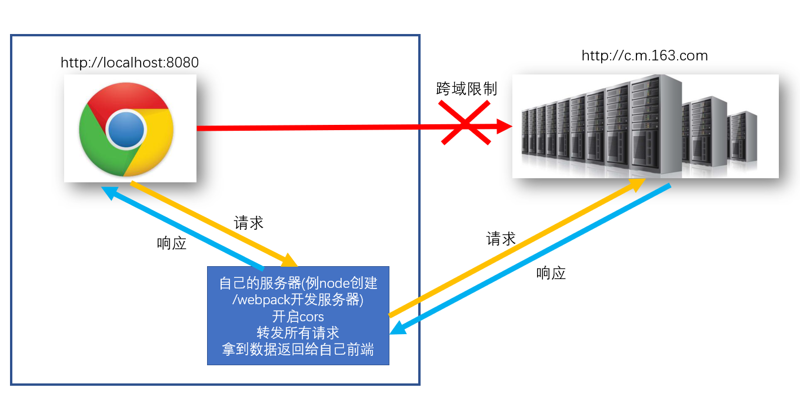
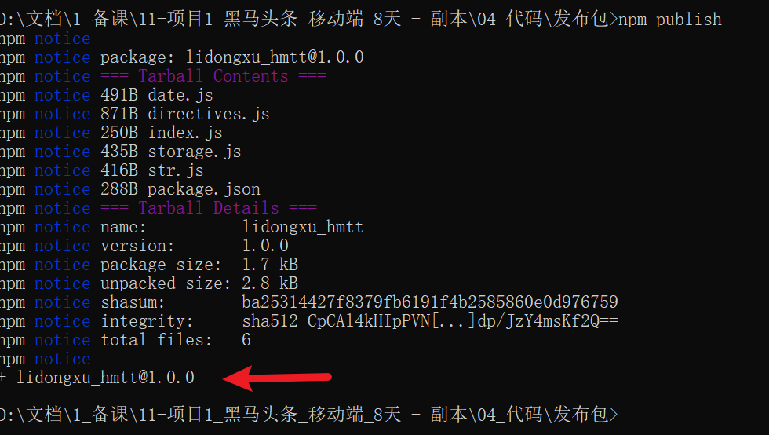
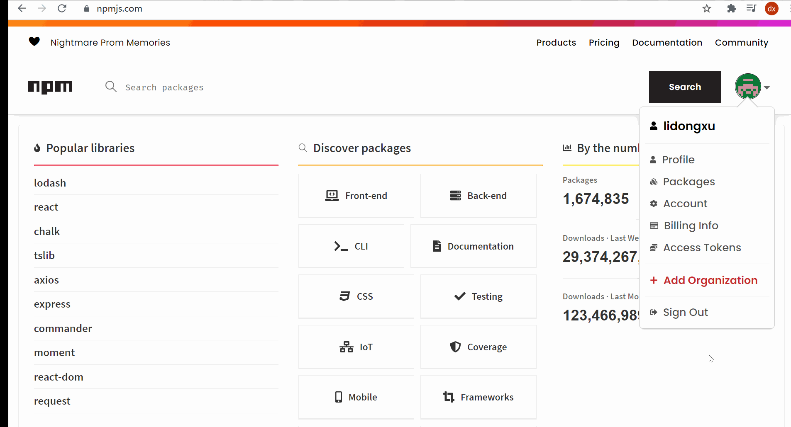
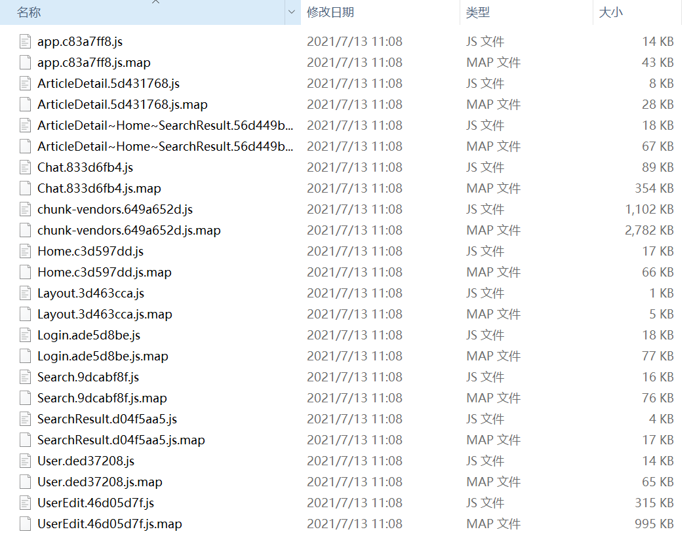
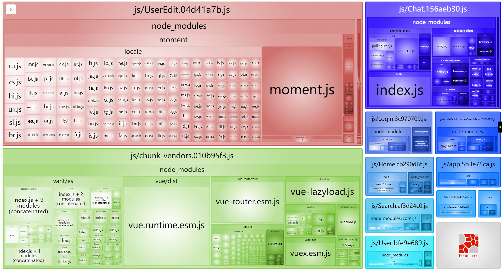
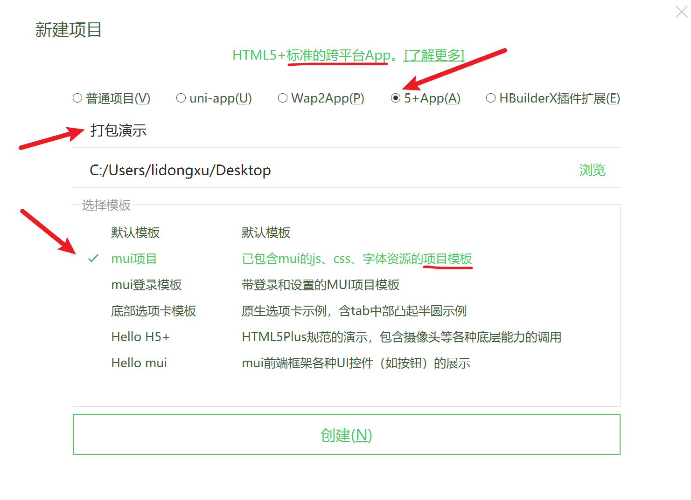
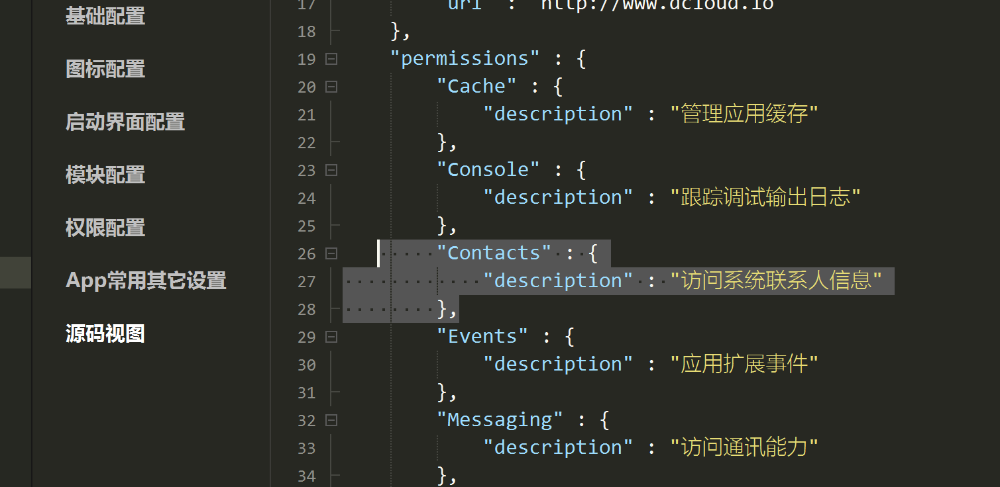

# Day08_知识扩展-打包部署

## 1.知识点_vue模拟v-model实现

### 目标

* 探究v-model到底如何实现的双向数据绑定

### 步骤

1. 新建src/components/Add组件, 准备实现双向数据绑定

   ```vue
   <template>
     <div>
         <p>子组件库存: {{ value }}</p>
         <button @click="addFn">增加+1</button>
     </div>
   </template>
   
   <script>
   export default {
     props: {
       value: {
         type: Number,
         default: 0
       }
     },
     methods: {
       addFn () {
         this.$emit('input', this.value + 1)
       }
     }
   }
   </script>
   
   ```

2. 在App.vue, 准备变量传入组件中

   ```vue
   <template>
     <div>
       <span>父组件库存: {{ count }}</span>
       <hr>
       <!-- <AddBtn :value="count" @input="val => count = val"></AddBtn> -->
       <AddBtn v-model="count"></AddBtn>
     </div>
   </template>
   
   <script>
   import AddBtn from '@/components/Add'
   export default {
     data () {
       return {
         count: 10
       }
     },
     components: {
       AddBtn
     }
   }
   </script>
   
   <style>
   
   </style>
   
   ```

### 小结

1. v-model实际上实现的是什么?
   * 向标签内的value属性赋值
   * 给标签绑定input事件, 并把收到的值, 赋予给vue变量

> 原生JS又如何才能实现同样效果呢? https://www.bilibili.com/video/BV1wL411W7KQ 可以看这里哦

## 2.知识点_RestFul API规范

### 目标

* 了解什么是RestFulAPI规范

### 讲解

```js
// RestFul API规范
// 规范(可遵守, 可不遵守, 尽量遵守)
// 规定了 后台的url接口地址风格
// 具体: 相同url路径, 不同的请求方式, 代表不同动作
// 以前接口样子: 杂乱无章
// /v1_0/likingcomment
// /v1_0/dislikingcomment
// /v1_0/delcomment

// 有规范接口
// /api/book       --- GET      获取所有图书
// /api/book/:id   --- GET      获取指定图片信息
// /api/book       --- POST     添加图书
// /api/book/:id   --- PUT      修改图书信息(全部)
// /api/book/:id   --- PATCH    修改图书信息(部分)
// /api/book/:id   --- DELETE   删除图书
```

### 小结

1. 什么是RestFul 接口规范?

   * 他叫表现层状态转化

   * 相同的路径, 不同的请求方式, 代表不同的动作

## 3.知识点_vuecli开发环境-做代理服务器

### 目标

* 回顾什么是跨域
* 跨域的几种解决方案是什么

### 回顾

1. 什么是跨域:

   * 网页所在url的**协议**, **域名**, **端口号**, 和Ajax请求url的**协议**, **域名**, **端口号**有一个对应不上, 就发生跨域
   * 跨域是浏览器对ajax做出的限制

2. 演示用axios请求网易新闻地址, 发现跨域报错

   ```url
   http://c.m.163.com/nc/article/headline/T1348647853363/0-40.html
   ```

### jsonp方式

* 需要前端和后端同时支持

  > 前端用script+src属性, 发送函数名给后台, 同时准备好同名的函数, 准备接收数据
  >
  > 后端返回的字符串一定用方法名(数据字符串)格式返回, 到script标签中执行
  >
  > 调用函数名, 并传递数据

* 例子代码(看看就行, 不用尝试)

  ```vue
  <script>
    function callBackFn(data){
      // data就是'{"a": 10, "b": 20}'
    }
  </script>
  <script src="http://后台接口地址?callback=callBackFn"></script>
  <!-- 后台接口返回 'callBackFn({"a": 10, "b": 20})' -->
  ```

### cors方式

* 前端什么也不用做

* 后端需要开启cors

  > 实际上就是在响应头添加允许跨域的源
  >
  > Access-Control-Allow-Origin: 字段和值(意思就是允许去哪些源地址去请求这个服务器)

### 代理转发

* 如果后端jsonp也不弄, cors也不弄, 就给你个接口地址

  > 我们可以在本地弄个服务器, 然后用服务器请求后台服务器接口地址

  

* 但是vuecli脚手架, 启动了一个webpack开发服务器, 它就能做代理转发

  * 而且前端和这个服务器是同源的都是8080端口

* 需要修改webpack开发服务器的配置即可

  > 更多配置项参考这里: https://webpack.docschina.org/configuration/dev-server/#devserverproxy

  ```js
  devServer: {
      proxy: {
        // http://c.m.163.com/nc/article/headline/T1348647853363/0-40.html
        '/api': { // 请求相对路径以/api开头的, 才会走这里的配置
          target: 'http://c.m.163.com', // 后台接口域名
          changeOrigin: true, // 改变请求来源(欺骗后台你的请求是从http://c.m.163.com)
          pathRewrite: {
            '^/api': '' // 因为真实路径中并没有/api这段, 所以要去掉这段才能拼接正确地址转发请求
          }
        }
      }
    }
  ```

* axios请求的代码

  ```js
  axios({
      url: '/api/nc/article/headline/T1348647853363/0-40.html'
  })
  ```

### 小结

1. 跨域几种解决方案?
   * jsonp / cors / 代理转发
2. vuecli环境如何设置代理转发?
   * 在vue.config.js - 添加规则和配置

## 4.知识点_发布工具包

### 目标

* 一个项目下来, 自己用原生js, 封装了些工具
* 发布这些工具到npm网站
* 以后换电脑, 直接npm/yarn下载即可

### 步骤-准备 

1. 新建文件夹, 并初始化包环境npm init

   > 得到package.json文件

   重要: ==包名, 入口==

   

2. 把要发布的js文件拿过来

   > 基于原生js的最好, 任何项目通用的代码, 都可以

   * date.js里基于dayjs的
   * directives.js里基于vue的

   > 下载包, npm install dayjs vue

   

3. 创建index.js(package.json记录入口文件名字统一), 然后把其他模块的方法统一导入并导出

   ```js
   // 包的唯一出口
   export * from './date' // 基于dayjs的时间处理
   export * from './directives' // 基于vue的自定义指令
   export * from './storage' // 原生js封装storage存储
   export * from './str' // 原生js封装字符串高亮
   ```

### 步骤-发布

1. 切换本机npm镜像地址

   > 注意npm镜像笔记切换到原来的才能发布工具包
   
   ```js
   npm config set registry=https://registry.npmjs.org/
   ```
   
   > 查看npm镜像地址命令:  npm config get registry

2. 去https://www.npmjs.com/ 这个网站注册账号

   > 一定要用能登录上去的邮箱
   >
   > 一定要去邮箱里有一封验证, 点击链接激活
   >
   > 一定切记账号和密码和邮箱, 发布包使用

3. 在发布包的文件夹下cmd终端

   * 命令: npm login

     > 作用: 建立登录链接
     >
     > 输入上一步注册的账号和密码和邮箱
     >
     > 终端为了防止密码被偷窥, 不会提示, 但实际上已经输入进去了

   * 命令: npm publish

     > 作用: 发布所在文件夹这个包上去

     

     出现这个图就代表成功了, 如果报错请到这里查看报错解决方案:

     http://lidongxuwork.gitee.io/error/

### 验证

1. 去npmjs网站查看

   

2. 也可以到任何一个地方, 用npm / yarn 下载刚才你发布的包名

   > 这样全世界的程序员都可以下你的包了, 快去让你同桌小伙伴下载试试吧

### 小结

1. 为何要发布包?
   * 可以提高自己知名度, 方便下个项目直接下载使用
2. 如果以后更新了, 重新发布?
   * 把js文件放到本地包文件夹里, 在index.js统一导出
   * 把package.json的版本向前改(因为每个版本号只能用一次)

### 扩展

包开发环境和生产环境到底有什么区别?

> 可以看这里: https://www.bilibili.com/video/BV15M4y1u78F

## 5.知识点_删除工具包

### 目标

* 如果感觉名字不好想删除

### 步骤

> 重点警告: 如果你的包已经被很多人使用了, 你删除后, 别人无法再下载

1. 运行npm unpublish命名

   > npm unpublish 包名 --force
   >
   > 这里我随便找个**我自己的**包删除

   

2. 但是要注意

   * 再次发布的包名或版本, 和刚才发布的不能完全一致

### 小结

1. 如何撤销发布的工具包
   * 只能对自己发布的包, 执行npm unpublish命令

## 6.项目打包_开始

### 目标

* yarn serve 是启动开发环境的服务器 (编写代码过程查看效果用)
* yarn build 也是打包项目代码(但是会输出到dist文件夹下)

### 分析

你可以直接把webpack开发服务器部署到线上服务器, 但是不要那么干. 因为有热更新和转换代码的过程, 慢

建议让webpack打包出dist文件夹, 把dist静态文件夹发给后台/运维, 部署到公司服务器上

### 步骤

1. 脚手架工程中运行

   命令:  `npm run build`

   作用：用vue-cli内部集成的webpack，把.vue,.less.js 等打包成浏览器可直接执行的代码。

   结果：会在项目根目录下创建 /dist目录，在这个目录下产出打包后的结果。

   讲解: css / js里重点文件讲解

   

   * app.hash值.js ：主入口

   * app.hash值.js.map: 记录当前的.js文件, 打包之前对应代码位置, 有利于代码出错快速找到源代码的位置。

     > (webpack把所有代码都压缩成一行了, 报错肯定在第一行不方便查找)

   * 模块名.hash值.js - 模块里写的js代码

     > `component: () => import('../views/search/index.vue')`，在打包时，就会生成对应的chunk片段文件

   * chunk-vendors：第三方包的代码统一放在这里（dayjs,vue,vuex,vue-router,vant）-只要被webpack构建依赖关系发现的包

   * chunk-hash值.js: 某个第三方模块对应的js ,某个.vue文件编译之后的.js。

### 运行

1. 可以直接用vscode+liveserver插件运行静态网页index.html

   > 哇, 可怕的问题来了, 空白页, 悄悄打开控制, 发现全是路径引入报错
   >
   > 仔细一看, 要的都是服务器根目录下的js / css文件夹里的打包的片段文件

2. 原因: vscode+liveServer插件, 会把vscode打开的根目录当做服务器的根目录, 根目录下并没有js / css文件夹

   > 而且服务器也不会把你的dist里代码放到公司线上服务器根目录

### 解决

1. 只需要让webpack打包时, 把路径弄成相对路径即可咯

   在vue.config.js, 第一次对象里添加配置

   ```js
   publicPath: './'
   ```

### 小结

1. 打包命令是什么?

   * yarn build  / npm run build

2. 打包后, 会得到什么?

   * webpack和各种插件加载器, 把代码翻译后, 输出整合到dist文件夹下

     > 注意: 这时, dist和开发代码环境一毛钱关系都没有了

## 7.项目打包_跨域问题

### 目标

* 为何打包后, 不跨域

### 分析

1. 打包后运行在http://localhost:5500

2. ajax请求的是http://toutiao.itheima.net

   按道理来说, 应该跨域了啊

   但是, 后台开启了cors, 所以直接请求

### 注意

1. 如果你的后台没开启cors, 你使用webpack开发服务器来做的代理转发

2. 那么打包后, 与webpack开发服务器没关系了

   解决: 自己用node+express搭建一个本地服务器开启cors, 并启动

   把自己前端的请求基地址改成这个服务器一起部署到线上

### 小结

1. 如果用webpack开发服务器做代理转发, 一定要注意打包后, 就没关系了, 需要自己准备服务器转发

## 8.项目打包_分析-代码高亮(上午结束)

### 目标

* 如何优化打包体积

### 打包结果分析

> vuecli中提供一个打包分析的工具

命令: yarn build --report

它会在dist目录下产生一个report.html文件，其中就有对打包结果的分析说明


效果 -  帮助我们分析哪个包的体积过大(针对性优化)

> 例如只用到一个方法的moment / dayjs 可以删除不要, 换成原生js自己写


### 优化-代码高亮

1. highlight.js体积过大, 可以让后台给代码标签设置好class类名给我返回

   > 现在的接口已经弄好了

2. 所以把main.js, 这段代码删除掉, 我们只要引入对应样式即可

   ```js
   // import hljs from 'highlight.js'
   import 'highlight.js/styles/default.css' // 代码高亮的样式
   
   //Vue.directive('highlight', function (el) { // 自定义一个代码高亮指令
   //  const highlight = el.querySelectorAll('pre, code') // 获取里面所有pre或者code标签
   //  highlight.forEach((block) => {
   //    hljs.highlightBlock(block) // 突出显示pre和code内标签, 并自动识别语言, 添加类名和样式
   //  })
   //})
   ```

3. 千万不要忘了, 去文章详情, 把使用的指令删除掉

4. 但是后台没有提前设置类名的pre和code标签就没有了高亮

   > aid=7997 这个文章提前设置了类名, 所以还是ok的

5. 再次打包观察体积

   

### 小结

1. 打包分析工具帮助我们找到哪个包体积过大

   > 如果有体积庞大的, 想想针对性的优化 / 换一个工具包使用

## 9.项目打包_分析优化-moment

### 目标

* moment就用了一个格式化时间

### 解决

1. 所以我们只用了其中一个功能, 但是webpack把整个包都打包进dist下了

2. 所以我们可以自己用原生js实现, 格式化时间, 卸载moment包

   > yarn remove moment

   ```js
   // 时间选择
   async confirmFn () {
       // console.log(this.currentDate instanceof Date)
       // this.currentDate里值是日期对象
       // 但是后台要"年-月-日"格式字符串参数值
   
       console.log(this.currentDate)
       const year = this.currentDate.getFullYear()
       let month = this.currentDate.getMonth() + 1
       let day = this.currentDate.getDate()
       month = month < 10 ? '0' + month : month
       day = day < 10 ? '0' + day : day
       const dateStr = `${year}-${month}-${day}`
       await updateProfileAPI({
           birthday: dateStr
       })
       // 前端页面同步
       this.profile.birthday = dateStr
       // 时间选择器关闭
       this.isShowBirth = false
   }
   ```

3. 再次打包观察dist文件夹体积大小

   > 观察报告, 最大的就是vue源码了, 那就没什么可以优化的了

### 小结

1. moment作用?
   * 格式化时间的, 我们也可以用原生js自己来写, 这样不用打包太多没用的代码

## 10.项目打包_优化-去掉打印

### 目标

* 上线后想让所有打印失效

### 分析

1. 如果自己删除, 那开发还得加回来, 注释也一样啊, 麻烦
2. 能否配置环境变量, 让代码自己来判断呢
3. 先在项目 根目录下配置文件(脚手架环境变量)


* 在.env.development (开发环境变量) 

  > NODE_ENV 变量名随便起, 值不用加引号就是字符串了

  ```js
  NODE_ENV=development
  ```

* 在.env.production (生产上线环境变量)

  ```js
  NODE_ENV=production
  ```

4. 在main.js里加入如下配置

   ```js
   if (process.env.NODE_ENV !== 'development') { // process是Node环境全部变量, 运行时根据敲击的命令不同, 脚手架会取环境变量给env添加属性和值
       console.log = function () {}
       console.error = function(){}
       console.dir = function(){}
   }
   ```

### 小结

1. 我们可以在这2个文件里定义不同的属性和值, 来区分线上和线下环境不同的值
2. 而且可以让代码自适应在不同环境, 自动选择对应值来使用

## 11.项目部署-gitee

### 目标

* 部署项目, 得到一个全网可用的url地址

  > 例如: https://lidongxuwork.gitee.io/

### 步骤

1. gitee注册账号(有了就忽略这步)
2. 新建仓库(空的, ReadME也不要)
3. 把dist推送到这个新的仓库上 (开发是一个仓库, 部署是另外一个了)
4. 启动gitee提供的page服务 (注意路径会自动找index.html文件来访问给用户看)
5. 如果以后代码更新, 要在本地重新打包, 然后重新推到gitee仓库, 还必须更新重启page服务才能生效)

### 小结

1. 部署项目, 为了得到一个url地址, 可以在公网中, 大家都可以访问你做的项目

## 12.项目部署-公司自己服务器

### 目标

* 创建一个web服务(如果后端有java/其他, 就把dist文件夹发给后台吧)
* 把整个web服务器+dist, 部署到公司自己服务器

### 步骤

1. 先创建一个本地的服务(用nodejs+express+静态资源文件夹)

   ```js
   // 导入 express 模块
   const express = require('express')
   // 创建 express 的服务器实例
   const app = express()
   
   // 1. 将 dist 目录托管为静态资源服务器
   app.use(express.static('./dist'))
   
   // 调用 app.listen 方法，指定端口号并启动web服务器
   app.listen(3001, function() {
     console.log('Express server running at http://127.0.0.1:3001')
   })
   ```

2. 在本地访问测试下, 是否可以正确打开vue打包项目页面, ok了再继续下面的

3. 阿里云, 百度云, 腾讯云选择某一家的即可 (尽量赶上过节再去买)

4. 然后购买线上的云服务器 (学生应该什么时候都便宜)  一人打100kb左右计算 (可以预估同时能支持多少人访问) 根据业务选择多大带宽的服务器 (如果就自己玩 越低越好, 越便宜越好)

5. 选择系统可以选择windows / linux(可以按宝塔面板-一键安装软件)

6. 想办法把代码 传到云服务器上 (win: 百度网盘/gitee , linux 有宝塔面板网页一键上传)

7. 线上的云服务器, 开启一个web服务器 (node+express / nginx / apache / 等)

8. 一定要关闭服务器的防火墙(在哪个网站买的,  来到管理页面, 放行端口)

9. 访问ip+端口和路径即可打开线上服务器的这个网站使用了

### 小结

1. 租一台云服务器 / 公司自己服务器(需要公网ip能访问 - 如果不能还要研究如何得到一个固定的ip)
2. 把web服务部署到服务器上
3. 访问服务器ip:web服务端口/路径, 打开对应页面访问

### 扩展

1. 只有ip不行, 如何得到一个域名呢?

   > 可以看这个文档: https://help.aliyun.com/product/35473.html?spm=5176.21213303.J_6028563670.7.d5653edanjoH7j&scm=20140722.S_help%40%40%E4%BA%A7%E5%93%81%E9%A1%B5%40%4035473.S_hot.ID_35473-RL_%E5%9F%9F%E5%90%8D-OR_s%2Bhelpmain-V_1-P0_0

2. 寻找和购买域名(付款) https://wanwang.aliyun.com/domain/?spm=a2c4g.11174283.2.2.46f34c07iCNNPy

3. 域名解析到自己的服务器ip地址上

4. 域名需要备案(注意: 第一次可能需要很多天, 所以请在部署项目之前尽早购买)

5. 以后输入域名跟输入ip一样可以访问你服务器项目了

> 这里暂时没有域名, 无法演示

## 13.项目打包App

### 目标

* 为何要打包APP
* APP分为哪几种类型

### 分类

App有三大类型

- 原生的App。手机有两大操作系统：苹果，安卓

  > 还有 windows Phone, 鸿蒙

  ios,安卓程序员 用各自的编程语言写的代码，只能在某一个平台上运行。分安卓版本和ios版本。

  - 优点：用户体验好 ；可以调用系统API（拍照，读内存...）。
  - 缺点：费钱。(大公司一般会雇佣4端程序员)

- 纯h5网站。就是一个移动站（https://m.jd.com/）
  - 优点：省钱。就是网页。
  - 缺点：不能调用系统API；没有统一的入口，用户不知道从哪里进来，都要通过浏览器才能访问；
  
- 混合开发。
  - 先做一个网站，在网站之外套个原生的壳！能同时具备原生的优点和纯h5网站的优点。
  - **在原生的App嵌入h5 页**

### HBuilder开发版

我们需要借助他, 帮助我们打包一个App

下载安装, 注册激活， 如果不注册激活，就不能使用它的打包功能

下载地址: https://www.dcloud.io/hbuilderx.html  (下载App开发版)

> 先走流程, 提示你注册再注册和激活就行了

==必须注册==

==必须激活邮箱==

==必须绑定手机号==

### 创建5+App项目

我们要选择5+App 项目,mui也是一套前端框架，可以选择一个mui项目。

- 普通项目。 普通H5项目, Hbuilder内置了几套模板,作用不大,同学们基本都会自己创建
- uni-app。多端应用,一套代码,复用八端,时下最火的一个跨端框架
- wap2App。wap项目转 App , 原来只运在手机上的wap(无线网络协议,诺基亚,爱立信时代)项目 可转app项目
- **5+ App**。利用DCloud 的 **`5+ Runtime`**来做原生能力提供者的 项目
- 小程序。微信原生小程序的另外一个编辑器,比微信提供的开发者工具好用,但是现在谁还在用原生写小程序呢?
- 快应用 。原生快应用编辑器 , 较为冷门的生态, 目前不太热闹



### 准备打包

1. 把我们vue项目打包好的dist下的一切复制到你刚才的项目-覆盖过来即可 (一定要保留manifest.json文件)

   > mainfest.json是打包配置文件

   

2. 生成APPID

   

3. 去掉通信录权限 (因为我的HBuilder没有身份证认证, 打包不让获取用户通讯录)

   

4. (可选), 如果上面不小心选择No了, 可以去源码处选择 - 删除

   

### 云打包


如果一切正常，你将会在控制台中看到类似如下的结果：


这就是云打包成功了, 下面会出现apk下载的所在文件夹

### 运行

把打包好的apk包, 发到安卓手机上 / 电脑模拟器(推荐<夜神模拟器>) 运行即可


### iOS问题

打包ios - 需要申请开发者账号(一年600元人民币): 以后打包的过程参考这个: https://blog.csdn.net/qq_34440345/article/details/99711586

也可以手机给电脑开热点 / 只要连接在同一个wifi下, 手机浏览器访问webpack开发服务器局域网ip地址即可

### 小结

1. 借助Hbuilder软件, 打包apk包使用